笔记内容由课程ppt+llm生成, 并进行一定修改

# Lec2 机器学习回顾/Softmax回归

## 2.1 机器学习基础

### 数据驱动编程范式

- **传统编程困境**：手工编写分类逻辑困难（如手写数字识别）
- **监督学习解决方案**：
  1. 收集带标签的训练集 ${(x^{(i)}, y^{(i)})}_{i=1}^m$
  2. 通过机器学习算法自动生成分类程序

### 机器学习三要素

1. **假设类 (Hypothesis Class)** : 参数化映射函数 $h_\theta: \mathbb{R}^n \rightarrow \mathbb{R}^k$，描述输入到输出的关系
2. **损失函数 (Loss Function)** : 量化模型预测效果：$\ell(h(x), y) \rightarrow \mathbb{R}^+$
3. **​优化方法 (Optimization Method) ​**: 最小化经验风险$\min_\theta \frac{1}{m}\sum_{i=1}^m \ell(h_\theta(x^{(i)}), y^{(i)})$

---

## 2.2 Softmax回归示例

### 多类分类问题设定

- **输入空间**: $x^{(i)} \in \mathbb{R}^n$（如MNIST图像 $n=784$）
- **输出空间**: $y^{(i)} \in \{1,...,k\}$ （如MNIST有 $k=10$ 类）
- **训练集规模**: $m$ 个样本（如MNIST $m=60,000$）

### 线性假设函数

$h_\theta(x) = \theta^T x$
其中

- 参数矩阵 $\theta \in \mathbb{R}^{n \times k}$, 输入参数x为n维列向量(n×1)
- 将输入的n维列向量映射为k维输出(如每个类别的概率)

**批量计算形式**：

$$
\mathbf X \in \mathbb{R}^{m \times n} = \begin{bmatrix} -x^{(1)T}- \\ \vdots \\ -x^{(m)T}- \end{bmatrix}, \quad
y\in\{1,\dots,k\}^m=\begin{bmatrix}y^{(1)}\\ \vdots \\ y^{(m)}
\end{bmatrix}
$$

- $-x^{(1)T}-$意为**强调**这个向量占一行
这样, 线性假设可以用批量计算形式写成:

$$
h_\theta(X) = \mathbf X\theta
  =\begin{bmatrix} -x^{(1)T}\theta- \\ \vdots \\ -x^{(m)T}\theta- \end{bmatrix}
  =\begin{bmatrix} -h_{\theta}(x^{(1)})^{T}- \\ \vdots \\ -h_{\theta}(x^{(m)})^T- \end{bmatrix}
$$

### 损失函数设计

1. **分类错误率**​（不可导，不适于优化）：
   $$\ell_{err}(h(x),y) = \begin{cases}
   0 & \text{if } \arg\max_i h_i(x) = y \\
   1 & \text{otherwise}
   \end{cases}$$
2. **交叉熵损失**​（Softmax损失）：

$$
 \begin{aligned}
    z_i &= p(label=i) = \frac{\exp(h_i(x))}{\sum_{j=1}^k \exp(h_j(x))} \\
    \ell_{ce}(h(x),y) &= -\log z_y = -h_y(x) + \log\sum_{j=1}^k \exp\left(h_j(x)\right)
 \end{aligned}
$$

- 注: 这里的log默认为e为底, 即ln

## 2.3 优化方法

### 梯度下降算法

对于函数$f: \mathbb R^{n\times k}\rightarrow \mathbb R$, 梯度定义为

$$
\nabla_\theta f(\theta)\in \mathbb R^{n\times k}=
\begin{bmatrix}
\frac{\partial f(\theta)}{\partial \theta_{11}} & \dots & \frac{\partial f(\theta)}{\partial \theta_{1k}} \\
\vdots &  & \vdots \\
\frac{\partial f(\theta)}{\partial \theta_{n1}} & \dots & \frac{\partial f(\theta)}{\partial \theta_{nk}}
\end{bmatrix}
$$

- 
- 在θ点处的梯度表示在局部上, 哪个方向能使函数增长最快
为了最小化函数(如损失函数), 梯度下降算法使用负梯度方向, 逐步逼近最小值
$\theta := \theta -\alpha \nabla_{\theta}f(\theta)$
- α为步长/学习率, α的大小对收敛性/收敛速度有很大影响 

参数更新规则：
$\theta := \theta - \alpha \nabla_\theta \left( \frac{1}{m}\sum_{i=1}^m \ell_{ce}(\theta^T x^{(i)}, y^{(i)}) \right)$

### 随机梯度下降 (SGD)

每次都使用所有数据来计算梯度开销过大, 可以使用采样构成一个minibatch, 将这个minibatch计算的结果作为真实梯度的**近似**

$$
\begin{array}{l}{{\mathrm{Repeat}:~~}}\\ {{\text{Samplea~a~minibatch~of~data~}X\in\mathbb{R}^{B\times n},y\in\{1,\dots,k\}^{B}}}\\ {{\text{更新参数 }\theta:=\theta-{\frac{\alpha}{B}}\sum_{i=1}^{B}\nabla_{\theta}\ell{\big(}h_{\theta}(x^{(i)}),y^{(i)}{\big)}}}\end{array}
$$

- 这个近似操作可以理解为引入一些"噪声", 这在某些情况下甚至能带来一些优势

### softmax的梯度

对向量$h \in \mathbb R^k$:

$$
\begin{aligned}
\frac{\partial\ell_{ce}(h,y)}{\partial h_{i}}&=\frac{\partial}{\partial h_{i}}\left(-h_{y}+\log\sum_{j=1}^{k}\exp h_{j}\right)\\
&=-1\{i=y\}+\frac{\exp h_{i}}{\sum_{j=1}^{k}\exp h_{j}}
\end{aligned}
$$

- log实际上是ln
- 用向量形式表示: $\nabla_{h}\ell(h, y)=z-e_{y}, z=normalize(exp(h))$

回到softmax: $\nabla_{\theta}\ell_{ce}(\theta^Tx, y)$ , θ是n×k的**矩阵**, $\theta^Tx$是k维列**向量**, 如何计算矩阵/向量的导数和链式法则?

- 假装一切都是标量(无视转置), 使用链式法则, 然后重新排列 / 转置矩阵or向量, 让计算结果的维度大小正确

$\nabla_\theta\ell_{ce}(\theta^Tx,y)\in\mathbb{R}^{n\times k}=x(z-e_y)^T$
用**批量计算**形式$\nabla_\theta\ell_{ce}(\mathbf X\theta,y)\in\mathbb{R}^{n\times k}=\mathbf X^T(Z-I_y),\quad Z=\mathrm{normalize}(\exp(\mathbf X\Theta))$
重复, 直到参数/loss收敛

1. Iterative over minibatches $X\in\mathbb{R}^{B\times n},y\in\{1,...,k\}^B$ of training set
2. Update the parameters $\theta:=\theta-\frac{\alpha}{B}X^T(Z-I_y)$

# Lec3 手动构建神经网络

## 3.1 从线性到非线性假设类

### 线性分类器的局限性

- 线性假设类基本形式：
  $h_{\theta}(x)=\theta^{T} x,\quad\theta\in \mathbb{R}^{n\times k}$
  - 通过k个线性函数划分输入空间
  - 无法处理非线性分类边界（如螺旋形数据）

<figure style="display: flex; justify-content: space-around; align-items: center;">
 
 

</figure>

### 非线性特征

#### 核心思想

- 通过特征映射提升维度：
  $$
  \begin{array}{c}
  h_{\theta}(x)=\theta^{T}\phi(x) \\
  \phi:\mathbb{R}^{n}\rightarrow\mathbb{R}^{d},\ \theta\in\mathbb{R}^{d\times k}
  \end{array}
  $$

#### 特征构造方法对比

| 方法 | 描述 | 数学形式 | 局限性 |
|------|------|---------|--------|
| 线性特征 | 简单线性组合 | $\phi(x)=W^T x$ | 等价于单层线性分类器 |
| ​**非线性特征**​ | 激活函数变换 | $\phi(x)=\sigma(W^T x)$ | 可表达复杂边界 |

#### 关键非线性变换示例

- **随机傅里叶特征**：
  $W\sim\mathcal{N}(0,1)\text{(随机高斯采样)},\ \sigma=\cos(\cdot)$
- **可学习非线性特征**：（需通过反向传播训练$W$）
  $\phi(x)=\text{ReLU}(W^T x)$

---

## 3.2 神经网络

### 基本定义

- **神经网络**：由多个可微参数化函数（层）组成的假设类
- **深度网络**：多层级联的非线性变换（现代网络通常>3层）

### 神经网络结构

#### 两层神经网络
>
> 也称为单隐藏层网络
<div style="text-align: center;">
    
</div>

$$
\begin{aligned}
h_{\theta}(x) &= W_{2}^{T}\sigma\left(W_{1}^{T} x\right) \\
\theta &= \{W_{1}\in \mathbb{R}^{n\times d}, W_{2}\in \mathbb{R}^{d\times k}\}
\end{aligned}
$$

- 批量矩阵形式：$h_\theta(\mathbf X)=\sigma\left(\mathbf X \mathbf W_1\right) \mathbf W_2$
  - $\mathbf X\in \mathbb R^{m\times n}, W_{1}\in \mathbb{R}^{n\times d}, W_{2}\in \mathbb{R}^{d\times k}$

#### 多层感知机（MLP）

<div style="text-align: center;">
 
</div>
- L层通用结构：

$$
\begin{aligned}
\mathbf Z_{i+1} &= \sigma_{i}\left(\mathbf Z_{i} \mathbf W_{i}\right),\quad i=1,\ldots,L \\
\mathbf Z_{1} &= \mathbf X \\
h_{\theta}(\mathbf X) &= \mathbf Z_{L+1}
\end{aligned}
$$

- 维度关系：$\mathbf Z_i\in\mathbb{R}^{m\times n_i},\ \mathbf W_i\in\mathbb{R}^{n_i\times n_{i+1}}$
  - Z被称为layer, activation, neuron, 是网络在不同阶段生成的中间特征
- 典型激活函数：ReLU, Sigmoid, Tanh

### 深度网络优势分析

| 观点    | 支持/反对 | 说明            |
| ----- | ----- | ------------- |
| 生物相似性 | ❌     | 实际与大脑工作机制差异显著 |
| 电路效率  | ⚠️    | 理论优势难以实际验证    |
| 经验有效性 | ✅     | 固定参数量下表现更优    |

---

## 3.3 反向传播

### 梯度计算框架

- 优化目标：  $\min_{\theta} \frac{1}{m}\sum_{i=1}^{m}\ell_{ce}\left(h_{\theta}(x^{(i)}), y^{(i)}\right)$
  - 核心需求：计算$\nabla_\theta\ell_{ce}(h_{\theta}(x^{(i)}), y^{(i)})$

### 两层网络梯度推导
>
> 批量矩阵形式：$h_\theta(\mathbf X)=\sigma\left(\mathbf X \mathbf W_1\right) \mathbf W_2$

- $\mathbf X\in \mathbb R^{m\times n}, W_{1}\in \mathbb{R}^{n\times d}, W_{2}\in \mathbb{R}^{d\times k}$

对于简单的两层网络, 梯度用批量矩阵形式写为: $\nabla_{W_{1}, W_{2}}\ell_{ce}(h_{\theta}(XW_1)W_{2}, y^{(i)})$

$$
\begin{aligned}
  \frac{\partial\ell_{ce}(\sigma(XW_1)W_2,y)}{\partial W_2} & =\frac{\partial\ell_{ce}(\sigma(XW_1)W_2,y)}{\partial\sigma(XW_1)W_2}\cdot\frac{\partial\sigma(XW_1)W_2}{\partial W_2} \\
 &  =(S-I_y)\cdot\sigma(XW_1),\quad[S=\mathrm{~softmax}(\sigma(XW_1)W_2)] \\ \\
 \frac{\partial\ell_{ce}(\sigma(XW_1)W_2,y)}{\partial W_1} &
 =\frac{\partial\ell_{ce}(\sigma(XW_1)W_2,y)}{\partial\sigma(XW_1)W_2} \cdot \frac{\partial\sigma(XW_1)W_2}{\partial \sigma(XW_{1})} \cdot \frac{\partial \sigma(XW_{1})}{\partial XW_{1}} \cdot \frac{{\partial XW_{1}}}{\partial W_{1}}\\
 & =
 \underbrace{(S-I_{y})}_{m \times k}\cdot \underbrace{W_{2}}_{d\times k}\cdot \underbrace{\sigma'(XW_{1})}_{m\times d} \cdot \underbrace{X}_{m\times n}
\end{aligned}
$$

对$W_2$的梯度

$$
\nabla_{W_2}\ell = \sigma(XW_1)^T(S-I_y)
$$

- $S=\text{softmax}(\sigma(XW_1)W_2)$
- $I_y$为one-hot标签矩阵

对$W_1$的梯度

$$
\nabla_{W_1}\ell = \underbrace{X^T}_{n\times m}\left[ \underbrace{(S-I_y)W_2^T}_{m\times d} \circ \underbrace{\sigma'(XW_1)}_{m\times d} \right] \in \mathbb{R}^{n\times d}
$$

- $\circ$表示逐元素乘法(标量乘法)
- $\sigma'$为激活函数导数

### 通用反向传播算法

> 尽管用了简化, 但是计算梯度还是有些麻烦

#### 推导过程

前向传播递推式: $Z_{i+1} = \sigma_i(Z_iW_i) \in \mathbb R^{m\times n_{i+1}}\quad (i=1,...,L)$

- 注意: 前面个的两层网络的最后一层没有激活函数, 和此处不相同

前向传播最终输出$Z_{L+1}$损失函数对于$W_{i}$的梯度, 由链式法则可得:


- $G_{i}$为损失对中间输出$Z_{i}$的导数
可得

$$
\begin{aligned}
G_i
  &=G_{i+1}\cdot\frac{\partial Z_{i+1}}{\partial Z_i}=G_{i+1}\cdot\frac{\partial\sigma_i(Z_iW_i)}{\partial Z_iW_i}\cdot\frac{\partial Z_iW_i}{\partial Z_i}\\
  &= \underbrace{G_{i+1}}_{m\times n_{i+1}}\cdot\underbrace{\sigma^{\prime}(Z_iW_i)}_{m\times n_{i+1}}\cdot \underbrace{W_i}_{n_{i}\times n_{i+1}}\\
G_{i}&=\frac{{\partial \ell(Z_{L+1}, y)}}{\partial Z_{i}}= \nabla_{Z_{i}}\ell(Z_{L+1}, y)\in \mathbb R^{m\times n_{i}}\\
\text{整理得:}\\
  G_i &= (G_{i+1} \circ \sigma_i'(Z_iW_i)) W_i^T \\
\end{aligned}
$$

回到参数$W_{i}$的梯度更新:

$$
\begin{aligned}
\frac{\partial\ell(Z_{L+1},y)}{\partial W_i}&=G_{i+1}\cdot \frac{\partial Z_{i+1}}{\partial W_{i}}=G_{i+1}\cdot\frac{\partial\sigma_i(Z_iW_i)}{\partial Z_iW_i}\cdot\frac{\partial Z_iW_i}{\partial W_i}\\
&=\underbrace{G_{i+1}}_{m\times n_{i+1}}\cdot\underbrace{\sigma^{\prime}(Z_iW_i)}_{m\times n_{i+1}}\cdot \underbrace {Z_i}_{m\times n_{i}}\\
\Longrightarrow &\nabla_{W_i}\ell(Z_{L+1},y)=Z_i^T\left(G_{i+1}\circ\sigma^{\prime}(Z_iW_i)\right) \in \mathbb R^{n_i\times n_{i+1}}
\end{aligned}
$$

#### 前向传播

$$
\begin{aligned}
Z_1 &= X \in \mathbb R^{m\times n} \\
Z_{i+1} &= \sigma_i(Z_iW_i) \in \mathbb R^{m\times n_{i+1}}\quad (i=1,...,L)
\end{aligned}
$$

#### 反向传播

1. 初始化梯度：   $G_{L+1} = \nabla_{Z_{L+1}}\ell = S-I_y$
2. 反向迭代：$G_i = (G_{i+1} \circ \sigma_i'(Z_iW_i)) W_i^T$
3. 参数梯度计算： $\nabla_{W_i}\ell = Z_i^T(G_{i+1} \circ \sigma_i'(Z_iW_i))$

### 计算图视角


- **向量-雅可比积**vector Jacobian product：核心计算单元
  $\frac{\partial Z_{i+1}}{\partial W_i} = \sigma_i'(Z_iW_i) \cdot Z_i$
- 内存优化：缓存前向传播结果$Z_i, W_i$

## 关键公式总结

| 公式类型 | 表达式 |
|---------|--------|
| 前向传播 | $Z_{i+1} = \sigma_i(Z_iW_i)$ |
| 损失梯度 | $G_{L+1} = S - I_y$ |
| 反向梯度 | $G_i = (G_{i+1} \circ \sigma_i') W_i^T$ |
| 权重梯度 | $\nabla_{W_i} = Z_i^T(G_{i+1} \circ \sigma_i')$ |

# Lec4 自动微分

本讲内容分为两个主要部分：

1. 不同微分方法的总体介绍
2. 反向模式自动微分

## 4.0 微分在机器学习中的应用

每个机器学习算法都由三个不同的元素组成：

1. **假设类**：$h_\theta(x)$
2. **损失函数**：$l(h_\theta(x), y) = -h_y(x) + \log \sum_{j=1}^{k} \exp h_j(x)$
3. **优化方法**：$\theta := \theta - \frac{\alpha}{B} \sum_{i=1}^{B} \nabla_\theta \ell(h_\theta(x_i), y_i)$

计算损失函数对假设类参数的梯度是机器学习中最常见的操作。

## 4.1 手动微分

### 数值微分

**基于定义的直接计算**:
$\frac{\partial f(\theta)}{\partial \theta_i} = \lim_{\epsilon \to 0} \frac{f(\theta + \epsilon e_i) - f(\theta)}{\epsilon}$
**更准确的数值近似方法**:

$\frac{\partial f(\theta)}{\partial \theta_i} = \frac{f(\theta + \epsilon e_i) - f(\theta - \epsilon e_i)}{2\epsilon} + o(\epsilon^2)$

- 数值微分存在数值误差，计算效率较低(要计算两次f())。
- 但它是检验自动微分算法实现的有力工具，特别是在单元测试中。
**数值梯度检查**:
从单位球中选取 $\delta$，检验以下不变性：

$\delta^T \nabla_\theta f(\theta) = \frac{f(\theta + \epsilon\delta) - f(\theta - \epsilon\delta)}{2\epsilon} + o(\epsilon^2)$

### 符号微分

通过写下公式，利用 和规则、积规则和链式法则推导梯度。

- 和规则：$\frac{\partial(f(\theta) + g(\theta))}{\partial \theta} = \frac{\partial f(\theta)}{\partial \theta} + \frac{\partial g(\theta)}{\partial \theta}$
- 积规则：$\frac{\partial(f(\theta)g(\theta))}{\partial \theta} = g(\theta)\frac{\partial f(\theta)}{\partial \theta} + f(\theta)\frac{\partial g(\theta)}{\partial \theta}$
- 链式法则：$\frac{\partial f(g(\theta))}{\partial \theta} = \frac{\partial f(g(\theta))}{\partial g(\theta)}\frac{\partial g(\theta)}{\partial \theta}$
但简单地这样做可能导致计算浪费。对于函数 $f(\theta) = \prod_{i=1}^{n} \theta_i$，计算所有偏导数需要 $n(n-2)$ 次乘法操作，效率较低。

## 4.2 自动微分

### 计算图
>
> 
> 以函数 $y = f(x_1, x_2) = \ln(x_1) + x_1 x_2 - \sin(x_2)$ 为例：

**前向计算轨迹**

- $v_1 = x_1 = 2$
- $v_2 = x_2 = 5$
- $v_3 = \ln(v_1) = \ln(2) = 0.693$
- $v_4 = v_1 \times v_2 = 10$
- $v_5 = \sin(v_2) = \sin(5) = -0.959$
- $v_6 = v_3 + v_4 = 10.693$
- $v_7 = v_6 - v_5 = 10.693 + 0.959 = 11.652$
- $y = v_7 = 11.652$

### 前向模式自动微分 (Forward AD)


定义 $\dot{v}_i = \frac{\partial v_i}{\partial x_1}$，然后按照计算图的前向拓扑顺序迭代计算 $\dot{v}_i$：

前向 AD 轨迹:

- $\dot{v}_1 =\frac{\partial v_1}{\partial x_1}=\frac{\partial x_1}{\partial x_1}= 1 \quad (v_{1}=x_{1})$
- $\dot{v}_2 = 0$
- $\dot{v}_3 =\frac{\partial v_{3}}{\partial x_{1}}=\frac{\partial \ln(v_{1})}{\partial x_{1}}=\frac{1}{v_{1}}\frac{\partial v_1}{\partial x_1}= \frac{\dot{v}_1}{v_1} = 0.5$
- $\dot{v}_4 = \dot{v}_1 v_2 + \dot{v}_2 v_1 = 1 \times 5 + 0 \times 2 = 5$
- $\dot{v}_5 = \dot{v}_2 \cos(v_2) = 0 \times \cos(5) = 0$
- $\dot{v}_6 = \dot{v}_3 + \dot{v}_4 = 0.5 + 5 = 5.5$
- $\dot{v}_7 = \dot{v}_6 - \dot{v}_5 = 5.5 - 0 = 5.5$
最终得到 $\frac{\partial y}{\partial x_1} = \dot{v}_7 = 5.5$
- 本质上就是计算链式法则过程的中间结果

#### 前向模式 AD 的局限性

对于函数 $f: \mathbb{R}^n \to \mathbb{R}^k$，我们需要 $n$ 次前向 AD 传递来获取相对于每个输入的梯度。在机器学习中，我们通常关注 $k = 1$ 但 $n$ 很大的情况，这使得前向模式 AD 效率低下。

### 反向模式自动微分 (Reverse AD)


定义伴随值adjoint $\bar{v}_i = \frac{\partial y}{\partial v_i}$，然后按照计算图的反向拓扑顺序迭代计算 $\bar{v}_i$：

- 伴随值就可以用来更新参数权重$\omega \leftarrow \omega - \eta \cdot \overline{\omega}$

**反向 AD 评估轨迹**

- $\bar{v}_7 = \frac{\partial y}{\partial v_7} = 1$
- $\bar{v}_6 = \frac{\partial y}{\partial v_7} \cdot \frac{\partial v_7}{\partial v_6}= \bar{v}_7  \frac{\partial v_6-v_{5}}{\partial v_6} = \bar{v}_7 \times 1 = 1$
- $\bar{v}_5 = \bar{v}_7 \frac{\partial v_7}{\partial v_5} = \bar{v}_7 \times -1 = -1$
- $\bar{v}_4 = \bar{v}_6 \frac{\partial v_6}{\partial v_4} = \bar{v}_6 \times 1 = 1$
- $\bar{v}_3 = \bar{v}_6 \frac{\partial v_6}{\partial v_3} = \bar{v}_6 \times 1 = 1$
- $\bar{v}_2 = \bar{v}_5 \frac{\partial v_5}{\partial v_2} + \bar{v}_4 \frac{\partial v_4}{\partial v_2} = \bar{v}_5 \times \cos(v_2) + \bar{v}_4 \times v_1 = -0.284 + 2 = 1.716$
- $\bar{v}_1 = \bar{v}_4 \frac{\partial v_4}{\partial v_1} + \bar{v}_3 \frac{\partial v_3}{\partial v_1} = \bar{v}_4 \times v_2 + \bar{v}_3 \frac{1}{v_1} = 5 + \frac{1}{2} = 5.5$

#### **多路径情况的推导**


当节点在多个路径中使用时（如 $v_1$ 在 $v_2$ 和 $v_3$ 路径中使用）：

$\bar{v}_1 = \frac{\partial y}{\partial v_1} = \frac{\partial f(v_2, v_3)}{\partial v_2}\frac{\partial v_2}{\partial v_1} + \frac{\partial f(v_2, v_3)}{\partial v_3}\frac{\partial v_3}{\partial v_1} = \bar{v}_2\frac{\partial v_2}{\partial v_1} + \bar{v}_3\frac{\partial v_3}{\partial v_1}$

定义"部分伴随值" $\overline{v_{i \to j}} = \bar{v}_j \frac{\partial v_j}{\partial v_i}$ 用于每对输入-输出节点，则：

$\bar{v}_i = \sum_{j \in next(i)} \overline{{v}_{i \to j}}$

- $\bar{v}_{1}=\overline{v_{1\rightarrow 2}}+\overline{v_{1\rightarrow 3}}$
so, 我们可以分别计算下游节点->上游节点的多有部分伴随值，然后将它们**相加**, 然后得到上游变量的伴随值。

#### 反向 AD 算法


#### 通过扩展计算图实现反向模式 AD

反向模式 AD 可以通过构建一个计算图来计算伴随值实现。这个过程中，我们扩展原始计算图(算法中的`append Vktoj to node_to_grad[k]`)，添加用于计算伴随值的节点。


#### 反向模式 AD 与反向传播的比较


**反向传播**：

- 在相同的前向图上运行反向操作
- 用于第一代深度学习框架（如 caffe, cuda-convnet）

**扩展计算图的反向模式 AD**：

- 为**伴随值**构造单独的图节点, 可以对反向传播过程进行专门的优化
- 用于现代深度学习框架

#### 张量上的反向模式 AD

对于张量值，定义**伴随张量** $\bar{Z}=\begin{bmatrix}\frac{\partial y}{\partial Z_{1,1}}&...&\frac{\partial y}{\partial Z_{1,n}}\\...&...&...\\\frac{\partial y}{\partial Z_{m,1}}&...&\frac{\partial y}{\partial Z_{m,n}}\end{bmatrix}$

例如，对于矩阵乘法 $Z = XW$，$v = f(Z)$：

**标量形式的反向评估**：
$\overline{X_{i,k}} = \sum_j \frac{\partial Z_{i,j}}{\partial X_{i,k}} \bar{Z}_{i,j} = \sum_j W_{k,j} \bar{Z}_{i,j}$

**矩阵形式**：
$\bar{X} = \bar{Z}W^T$

#### 梯度的梯度

反向模式 AD 的结果仍然是计算图。我们可以通过组合更多操作来进一步扩展该图，并在梯度上再次运行反向模式 AD。

#### 数据结构上的反向模式 AD

对于数据结构，我们也可以定义相应的伴随数据结构。

例如，对于字典定义$\hat{d}=\left\{ \text{"cat"}: \frac{\partial{y}}{\partial a_{0}}, \text{"dog"}: \frac{\partial{y}}{\partial a_{1}}  \right\}$：


**关键思想**：定义与前向值相同数据类型的"伴随值"和伴随传播规则，然后应用相同的算法。

# Lec6 全连接网络、优化与初始化

## 6.1 全连接网络（Fully Connected Networks）

### 多层感知机（MLP）的数学定义

**L 层**全连接网络（又称 MLP）的迭代公式：
  $z_{i+1} = \sigma_i(W_i^T z_i + b_i),\quad i = 1,\dots,L$
 $h_\theta(x) \equiv z_{L+1},\quad z_1 \equiv x$

- 参数集：$\theta = \{W_{1:L}, b_{1:L}\}$
- $\sigma_i(x)$：非线性激活函数，通常最后一层 $\sigma_L(x)=x$。

### 矩阵形式与广播（Broadcasting）

考虑到 batch 大小 $m$ 时的矩阵形式：
$Z_{i+1} = \sigma_i(Z_i W_i + \mathbf{1}b_i^T)$

- 其中 $Z_i \in \mathbb{R}^{m\times n}$，$\mathbf{1}b_i^T \in \mathbb{R}^{m\times n}$。
- 实践中不真正构造 $\mathbf{1}b_i^T$，而是利用「广播」机制：
  - 将 $n\times 1$ 向量$b_i$按列复制 $p$ 次，**不额外复制数据**。
  - 这样, 这个式子可以简写为$Z_{i+1} = \sigma_i(Z_i W_i + b_i^T)$  (在矩阵加法时自动应用广播)

### 训练前必须回答的关键问题

1. 如何选网络的宽度和深度？
2. 如何优化目标函数？（SGD 是答案之一，但实践中常用改进版本）
3. 如何初始化权重？
4. 如何确保网络在多次迭代后仍易于训练？

这些问题会相互影响, 且没有特定的回答

但对于dl,  他们最终服务于场景, 之后会介绍一些基本原则

## 6.2 优化算法（Optimization）

### 梯度下降（Gradient Descent）

通用更新规则：

$\theta_{t+1} := \theta_t - \alpha \nabla_\theta f(\theta_t)$

- $\alpha>0$：步长（学习率）, t: 迭代次数
- 局部最快下降方向，但大尺度可能出现震荡。

### 牛顿法（Newton’s Method）

利用 Hessian 矩阵 $H_t=\nabla_\theta^2 f(\theta_t) = \begin{bmatrix} \dfrac{\partial^2 f}{\partial \theta_1^2} & \dfrac{\partial^2 f}{\partial \theta_1 \partial \theta_2} & \cdots & \dfrac{\partial^2 f}{\partial \theta_1 \partial \theta_n} \\[1em] \dfrac{\partial^2 f}{\partial \theta_2 \partial \theta_1} & \dfrac{\partial^2 f}{\partial \theta_2^2} & \cdots & \dfrac{\partial^2 f}{\partial \theta_2 \partial \theta_n} \\[1em] \vdots & \vdots & \ddots & \vdots \\[1em] \dfrac{\partial^2 f}{\partial \theta_n \partial \theta_1} & \dfrac{\partial^2 f}{\partial \theta_n \partial \theta_2} & \cdots & \dfrac{\partial^2 f}{\partial \theta_n^2} \end{bmatrix}$：

$$
\theta_{t+1} = \theta_t - \alpha H_t^{-1}\nabla_\theta f(\theta_t)
$$

**特点**：

- 对二次函数一次迭代即可收敛（$\alpha=1$）。
- 深度学习中**不实用**：① 求逆 Hessian 代价高；② 非凸时不一定好。

### 动量法（Momentum）

在梯度基础上引入动量：

$$
\begin{aligned}
u_{t+1} &= \beta u_t + (1-\beta)\nabla_\theta f(\theta_t) \\ \theta_{t+1} &= \theta_t - \alpha u_{t+1}
\end{aligned}
$$

- $\beta$：动量系数, 通常$0\leq \beta <1$，平滑更新方向，减少震荡。

$$
\begin{aligned}
u_{t+1} &= \beta u_t + (1-\beta)\nabla_\theta f(\theta_t) \\&= \beta u_{t} +\beta(1-\beta)\nabla_\theta f(\theta_{t-1}) + \beta^2(1-\beta)\nabla_\theta f(\theta_{t-2})+\dots
\end{aligned}
$$

- **无偏修正**（unbiased）：$\theta_{t+1} = \theta_t - \alpha \frac{u_{t+1}}{1-\beta^{t+1}}$
  
  - 在训练的初期, 历史梯度不够大, 导致动量不够有效, 加上修正能够提高收敛速度
  - (左: 修正前, 右: 修正后), 随着t增加, 分母趋近于1, 去除偏差
  
  

### Nesterov 动量

「未来点」计算梯度：

$$
\begin{aligned}
u_{t+1} &= \beta u_t + (1-\beta)\nabla_\theta f(\theta_t - \alpha u_t)\\ \theta_{t+1} &= \theta_t - \alpha u_{t+1}
\end{aligned}
$$

### Adam 优化器

结合动量 + 自适应学习率：

$$
\begin{aligned}
u_{t+1} &= \beta_1 u_t + (1-\beta_1)\nabla_\theta f(\theta_t)\\
v_{t+1} &= \beta_2 v_t + (1-\beta_2)(\nabla_\theta f(\theta_t))^{2(逐元素平方)} \\
\theta_{t+1} &= \theta_t - \alpha \frac{\hat u_{t+1}}{\sqrt{\hat v_{t+1}}+\varepsilon}
\end{aligned}
$$

- $\hat u, \hat v$：偏差修正后的动量
- 实践中 Adam 几乎成为默认选择，但仍存在争议

### 随机梯度下降（SGD）

**核心思想**：用 mini-batch 估计梯度：

$\theta_{t+1} = \theta_t - \alpha \frac{1}{|B|}\sum_{i\in B}\nabla_\theta \ell(h_\theta(x_i),y_i)$

- 优点：计算快，噪声大但收敛好
- **重要提醒**：
  - 所有前述算法（Momentum、Adam、Newton 等）在实际中都使用**随机版本**
  - 简单凸二次实验带来的直觉有限，必须在真实网络上大量实验

## 6.3 权重初始化（Initialization）

### 为什么不能初始化为 0？

$$
\begin{aligned}
&Z_{i+1}=\sigma_i(Z_iW_i)\\
&G_i=\left(G_{i+1}\circ\sigma_i^{\prime}\left(Z_iW_i\right)\right)W_i^T\end{aligned}
$$

若 $W_i=0$，则：

- 前向：$Z_{i+1}=0$；
- 反向：$G_i=0$，导致 $\nabla_{W_i}\ell=0$。

- 结果：所有层陷入鞍点，无法学习。

### 随机初始化的影响

随机初始化, 以 $W_i \sim \mathcal{N}(0,\sigma^2 I)$ 为例：

- **方差 $\sigma^2$ 决定**：
  1. 前向激活的范数 $\|Z_i\|$；
  2. 反向梯度的范数 $\|\nabla_{W_i}\ell\|$。

$$
L_{2}范数: ||X||_{2}=\sqrt{ x_{1}^2+x_{2}^2\dots x_{n}^2 }
$$

- **实验现象**（50 层 ReLU，隐藏层 100 单元）：
  - $\sigma^2=\frac{1}{n}$：梯度指数级消失；
  - $\sigma^2=\frac{2}{n}$：近乎常数；
  - $\sigma^2=\frac{3}{n}$：梯度爆炸。
  - 

### 权重移动并不大

- 经验观察：训练后权重距离初始点很近，不同初始化收敛到不同区域。
- **结论**：初始化对最终性能影响巨大。

### 方差推导与 Kaiming 初始化

假设 $x\sim\mathcal{N}(0,1)$，$w\sim\mathcal{N}(0,\frac{1}{n})$，则：

- $\begin{aligned}\mathbf{E}[x_iw_i]=\mathbf{E}[x_i]\mathbf{E}[w_i]=0,\quad&\mathrm{Var}[x_iw_i]=\mathbf{Var}[x_i]\mathbf{Var}[w_i]=1/n\end{aligned}$
- $\mathbf{E}[w^T x]=0,\quad \mathbf{Var}(w^T x)=1$。
- 如果使用了线性激活层, $z_i \sim\mathcal{N}(0,1), W_i\sim\mathcal{N}(0,\frac{1}{n}I)$, 则$z_{i+1}=W_i^Tz_i\sim N(0,I)$

对 ReLU（约一半神经元置 0），需将方差放大 2 倍：

- **Kaiming 正态初始化**：$W_i\sim\mathcal{N}(0,\frac{2}{n}I)$。

### Kaiming 初始化的推导

在深度学习中，He 初始化（Kaiming 初始化）是一种针对 **ReLU 激活函数** 的权重初始化方法。它的核心目标是保持每一层的输出方差一致，从而避免梯度消失或爆炸问题。以下是推导过程的详细解释：

---

#### **1. 基本设定**

假设我们有一个全连接层（或卷积层），其输入为 $x^{(l-1)}$，权重矩阵为 $W \in \mathbb{R}^{n_{\text{out}} \times n_{\text{in}}}$，输出为：

$$
y^{(l)} = x^{(l-1)} W^T
$$

然后通过 ReLU 激活函数：

$$
x^{(l)} = \max(y^{(l)}, 0)
$$

我们的目标是初始化权重 $W$，使得每一层的输出方差 $\text{Var}[y^{(l)}]$ 与前一层的输入方差 $\text{Var}[y^{(l-1)}]$ 保持一致。

#### **2. 方差推导**

假设权重 $W_{i,j}$ 独立同分布，且输入 $x_j$ 的均值为 0，方差为 $\text{Var}[x_j] = \frac{1}{2} \text{Var}[y^{(l-1)}]$（这是 ReLU 的特性）。  
对于输出$y_i$：

$$
y_i = \sum_{j=1}^{n_{\text{in}}} x_j W_{i,j}
$$

由于$x_j$和$W_{i,j}$独立，方差为：

$$
\text{Var}[y_i] = \sum_{j=1}^{n_{\text{in}}} \text{Var}[x_j] \cdot \text{Var}[W_{i,j}] = n_{\text{in}} \cdot \text{Var}[x_j] \cdot \sigma^2
$$

其中$\sigma^2 = \text{Var}[W_{i,j}]$是权重的方差。

#### 3. ReLU 对输入分布的影响

由于$x^{(l-1)}$是 ReLU 的输出，即$x^{(l-1)} = \max(y^{(l-2)}, 0)$ ，因此$x_j$的分布是对称的（一半为 0，另一半为正数）。  
此时，$x_j$的平方期望为：

$$
\mathbb{E}[x_j^2] = \mathbb{E}[\text{ReLU}(y^{(l-1)})^2] = \frac{1}{2} \text{Var}[y^{(l-1)}]
$$

（因为 ReLU 将负值设为 0，正值保留，导致平方期望变为原方差的一半。）

#### 4. 保持方差一致的条件

为了使输出方差$\text{Var}[y^{(l)}]$与输入方差$\text{Var}[y^{(l-1)}]$一致，代入上式：

$$
\text{Var}[y^{(l)}] = n_{\text{in}} \cdot \left( \frac{1}{2} \text{Var}[y^{(l-1)}] \right) \cdot \sigma^2
$$

要求：

$$
\text{Var}[y^{(l)}] = \text{Var}[y^{(l-1)}]
$$

解得：

$$
n_{\text{in}} \cdot \frac{1}{2} \sigma^2 = 1 \quad \Rightarrow \quad \sigma^2 = \frac{2}{n_{\text{in}}}
$$

因此，权重$W$应初始化为均值为 0、方差为$\sigma^2 = \frac{2}{n_{\text{in}}}$的分布。

## 6.4 小结与后续

- 本节课覆盖：
  - MLP 的数学与广播实现；
  - 从 GD → Newton → Momentum → Nesterov → Adam 的优化演进；
  - 随机梯度下降的核心地位；
  - 初始化如何影响信号传播与最终解。
- 下节课将深入更多实践技巧与实验分析。

# Lec7 神经网络库抽象

## 7.1 编程抽象（Programming Abstractions）

框架的编程抽象定义了实现、扩展和执行模型计算的通用方式。理解设计背后的思考过程有助于：

- 理解抽象设计的原因
- 学习设计新抽象的经验

### 案例研究（Case Studies）

因时间有限未深入研究的框架：Theano, Torch7, MXNet, Caffe2, Chainer, JAX...

### 三种核心抽象模式

#### 1. 前向与反向层接口（Forward and backward layer interface）

> *代表框架：Caffe 1.0*

```python
class Layer:
    def forward(bottom, top):  # 前向计算
        pass
    def backward(top, propagate_down, bottom):  # 反向传播梯度
        pass
```

- **​特点​**​：显式定义前向计算和梯度计算操作
- **​早期先驱​**​：cuda-convnet（AlexNet框架）

#### 2. 计算图与声明式编程（Computational graph and declarative programming）

> *代表框架：`TensorFlow 1.0`*

```python
import tensorflow as tf

v1 = tf.Variable()
v2 = tf.exp(v1)
v3 = v2 + 1
v4 = v2 * v3

sess = tf.Session()
value4 = sess.run(v4, feed_dict={v1: numpy.array([1])})
```

- **​特点​**​：先声明计算图 → 通过输入数据(`sess.run`)执行图
- **​早期先驱​**​：Theano
计算图定义和计算操作分离, 可以有更多的优化机会
- 假如计算的不是v4, 而是v3, `v4 = v2 * v3`j计算可以直接skip

#### 3. 命令式自动微分（Imperative automatic differentiation）

> *代表框架：PyTorch (Needle)*

```python
import needle as ndl

v1 = ndl.Tensor([1])
v2 = ndl.exp(v1)
v3 = v2 + 1
v4 = v2 * v3

if v4.numpy() > 0.5: 
    v5 = v4 * 2 
else: 
    v5 = v4
v5.backward()  # 即时反向传播
```

- **​特点​**​：**动态构建**计算图 + 支持Python控制流
- **​早期先驱​**​：Chainer

### 讨论（Discussions）

**​不同编程抽象的优缺点分析​**​：

| 抽象类型              | 优点            | 缺点              |
| ----------------- | ------------- | --------------- |
| 前向/反向接口 (Caffe)   | 接口简单，控制明确     | 模块间耦合度高，扩展性受限   |
| 计算图 (TensorFlow)  | 支持跨设备优化，部署效率高 | 调试困难，控制流实现复杂    |
| 命令式自动微分 (PyTorch) | 开发调试便捷，支持动态图  | 运行时计算, 导致优化机会较少 |

## 7.2 高级模块化库组件（High Level Modular Library Components）

### 机器学习核心元素（Elements of Machine Learning）

1. **假设类（Hypothesis Class）**：$h_θ(x)$
2. **​损失函数（Loss Function）​**​：  $l(h_θ(x),y)=−h_y(x)+log∑_{j=1}^k exp(h_j(x))$
3. **优化方法（Optimization Method）**：  $θ:=θ−\fracαB∑_{i=1}^B ∇_θ \ell(h_θ(x(i)),y(i))$

**​关键问题​**​：如何将上述元素转化为代码中的模块化组件？

### 深度学习的模块化本质

深度学习模型本质是模块的组合（如多层残差网络）：

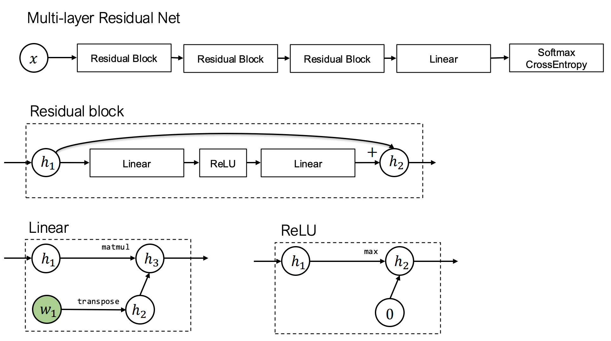

*残差连接结构示意图（摘自ResNet论文）*

- 上图的每一个方框都可以视为一个模块

### 模块化组件设计

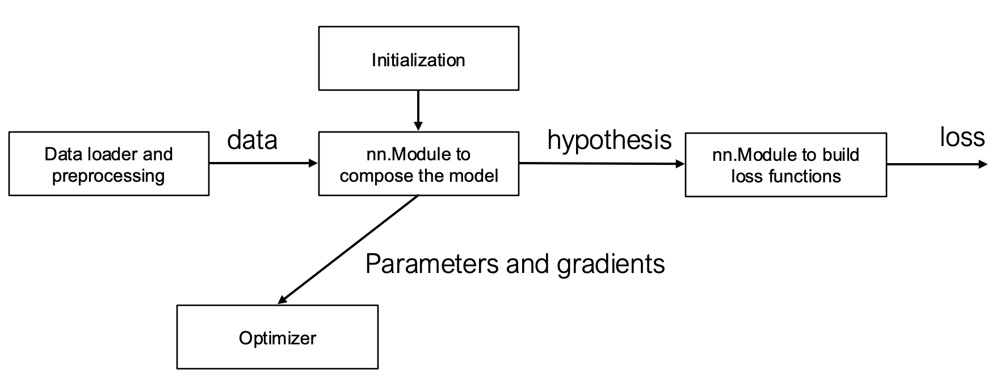

#### 1. `nn.Module`：组合模块


- **​核心功能​**​：tensor in → tensor out
- **​关键要素​**​：
  - 给定输入计算输出
  - 获取（可训练）参数列表
  - 参数初始化方法
- **​代码示例​**​：
  
```python
class Linear(Module):
 def __init__(self, in_features, out_features):
  self.weight = Parameter(...)  # 可训练参数
  self.bias = Parameter(...)
 def forward(self, X):
  return X @ self.weight + self.bias
```

#### 2. 损失函数：特殊模块


- **​特性​**​：张量输入 → 标量输出  
  - 例如交叉熵损失：  $l(h_\theta(x),y)=−h_y(x)+log∑_{j=1}^k exp(h_j(x))$

- **​扩展问题​**​：
  - 如何组合多目标函数？
  - 训练完成后推理阶段的行为？

#### 3. 优化器（Optimizer）


- **​功能​**​：根据模型权重执行优化步骤
- **​状态管理​**​：跟踪辅助状态（如动量）
- **​常见优化器​**​：
  - **​SGD​**​：$w_i←w_i−αg_i$
  - **​SGD with momentum​**​：  $\begin{aligned}u_i​&←βu_i​+(1−β)g_i\\​w_i​&←w_i​−αu_i​​\end{aligned}$
  - **​Adam​**​：$\begin{aligned}u_i&←β_1u_i+(1−β_1)g_i\\v_i&←β_2v_i+(1−β_2)g_i^2\\w_i&←w_i−αu_i/(v_i^{1/2}+ϵ)\end{aligned}$

#### 4. 正则化与优化器

- **​实现方式​**​：
  - 作为损失函数的一部分（如L2正则项）
  - 直接整合到优化器更新中
  - *例：带权重衰减的SGD*  $w_i←(1−αλ)w_i−αg_i$

#### 5. 参数初始化（Initialization）

- **​策略依赖​**​：模块类型和参数种类
- **​常见方法​**​：
  - 权重（weights）：均匀分布（幅度取决于输入/输出维度）
  - 偏置（bias）：零初始化
  - 方差累加项：初始化为1
- **​执行时机​**​：在`nn.Module`构建阶段完成

#### 6. 数据加载与预处理（Data Loader and Preprocessing）

- **流程**：
  - 经常通过混洗(shuffle)和变化进行输入的预处理
  
- **​重要性​**​：数据增强对深度学习模型预测精度提升有显著贡献
- **​特性​**​：数据管道本身具有组合性

### 讨论（Discussions）

**​其他可能的模块化组件示例​**​：

- 学习率调度器（Learning Rate Scheduler）
- 梯度裁剪模块（Gradient Clipping）
- 自定义激活函数（如Swish, GELU）
- 分布式训练通信原语

---

### Revisit Programming Abstraction

**分层抽象设计**

以PyTorch（Needle）为例：

1. **​底层​**​：张量计算图抽象（处理自动微分）
2. **​高层​**​：模块化组合抽象（如`nn.Module`）

**对比早期框架（Caffe 1.0）**

```python
class Layer:
    def forward(bottom, top): ... 
    def backward(top, propagate_down, bottom): ...
```

- **​局限​**​：将梯度计算与模块组合紧密耦合

# Lec9 深度学习系统：归一化与正则化

## 9.1 引言

本讲主要讨论深度学习中的两个关键技术：**归一化（Normalization）** 和 **正则化（Regularization）**，以及它们与优化、初始化之间的相互作用。

- **归一化**：用于稳定和加速训练过程，通过调整层间激活值的分布。
- **正则化**：用于防止过拟合，提升模型在测试集上的泛化能力。
- 三者（优化、初始化、归一化、正则化）之间存在复杂而深刻的交互关系。

---

## 9.2 初始化与优化的交互

**问题提出**：
假设我们初始化权重为 $W_i \sim \mathcal{N}(0, \frac{c}{n})$，其中对于 ReLU 网络通常选择 $c = 2$。那么是否在几次优化迭代后，权重的尺度就会“自动修正”？

**答案：不会！**

- 如果初始化不当，深层网络即使使用标准 SGD 也无法成功训练。
- 更根本的问题是：**即使训练成功，初始化时的尺度效应在整个训练过程中仍然持续存在**
  
  - 图中, 训练后不同方差的激活值和梯度趋近, 但是权重的分布与训练前变化相差不大

**实验观察**：

**图1：不同初始化方差对激活值和梯度的影响（50层网络）**

| 初始化方差               | 激活值范数（Activation Norm） | 梯度范数（Gradient Norm） | 训练结果    |
| ------------------------ | ----------------------------- | ------------------------- | ----------- |
| $\sigma^2 = \frac{3}{n}$ | 随层数指数增长（>10³）        | 极小（~10⁻⁸）             | 溢出（NaN） |
| $\sigma^2 = \frac{2}{n}$ | 稳定在 ~1                     | 保持稳定                  | ✅ 成功训练  |
| $\sigma^2 = \frac{1}{n}$ | 指数衰减（<10⁻²）             | 快速消失                  | ❌ 无进展    |

> **结论**：初始化严重影响训练动态，且其影响贯穿整个训练过程。

---

## 9.3 归一化（Normalization）

### 动机

- 初始化的影响难以在训练中“自我修复”。
- 深度网络中每一“层”可以是任意计算操作。
- 解决方案：**引入额外的层，显式地“修复”每层激活值的分布**。

---

### 9.3.1 层归一化（Layer Normalization）

**定义**：
对每一层的激活值进行归一化，使其均值为 0，方差为 1。
设第 $i$ 层输出为：

$$
\hat{z}_{i+1} = \sigma_i(W_i^T z_i + b_i)
$$

- hat表示这是归一化前的值
则层归一化定义为：

$$
z_{i+1} = \frac{\hat{z}_{i+1} - \mathbb{E}[\hat{z}_{i+1}]}{\sqrt{\mathrm{Var}[\hat{z}_{i+1}] + \varepsilon}}
$$

- $\mathbb E$是均值, $\mathbb E[\hat{z}_{i+1}]=\frac{1}{n}\sum_{j=1}^n(\hat{z}_{i+1})_{j}$
- $\varepsilon$ 是一个小常数，防止除零

常见扩展：
通常还会加入可学习的缩放和平移参数：

$$
z_{i+1} = \gamma \cdot \frac{\hat{z}_{i+1} - \mu}{\sqrt{\sigma^2 + \varepsilon}} + \beta
$$

其中 $\gamma, \beta$ 是可学习的标量参数。

---

### 9.3.2 层归一化效果

**图2：层归一化前后对比**


| 指标       | 归一化前（$\sigma^2 = 1.7/n, 2/n, 2.3/n$） | 归一化后  |
| ---------- | ------------------------------------------ | --------- |
| 激活值范数 | 随层数变化剧烈（1.7 → 2.3）                | 统一为 ~1 |
| 梯度范数   | 差异明显                                   | 更加稳定  |
| 权重方差   | 初始差异保留                               | 影响减弱  |

> **结论**：层归一化有效“修复”了激活值的范数问题。

**实际表现**：

- 在标准全连接网络（FCN, 或者多层感知机MLP）中，**较难训练到较低损失**。
- 原因：不同样本之间的相对激活范数可能包含有用的判别信息，而 LayerNorm 抹平了这些差异。

---

### 9.3.3 批归一化（Batch Normalization）

核心思想：
从“按行归一化”（LayerNorm）转向“按列归一化”——即在**小批量（minibatch）维度上**对每个特征进行归一化。

设激活矩阵为：

$$
\hat{Z}_{i+1} = \sigma_i(Z_i W_i + b_i)
$$

其中每行对应一个样本，每列对应一个特征。


批归一化对每一列（即每个特征）在 minibatch 上计算均值和方差，并进行归一化：

$$
(\hat{z}_{i+1})_j = \frac{(z_{i+1})_j - \mu_j}{\sqrt{\sigma_j^2 + \varepsilon}}, \quad \text{其中 } \mu_j = \frac{1}{m}\sum_{k=1}^m (z_{i+1}^{(k)})_j, \quad \sigma_j^2 = \frac{1}{m}\sum_{k=1}^m ((z_{i+1}^{(k)})_j - \mu_j)^2
$$

- m为每个batch的样本数
同样可加入可学习参数 $\gamma, \beta$。

---

### 9.3.4 小批量依赖性（Minibatch Dependence）

- **问题**：BatchNorm 使得每个样本的输出依赖于整个 minibatch，这在测试(推理)时不可接受, 因为batch size可能为1
- **解决方案**：
  - 在训练时维护每个特征的**运行平均（running average）** 的均值 $\hat{\mu}_{i+1}$ 和方差 $\hat{\sigma}^2_{i+1}$。
  - 测试时使用这些统计量进行归一化：

$$
(z_{i+1})_j = \frac{(\hat{z}_{i+1})_j - (\hat{\mu}_{i+1})_j}{\sqrt{(\hat{\sigma}^2_{i+1})_j + \varepsilon}}
$$

---

## 9.4 正则化（Regularization）

### 背景

- 深度网络通常是**过参数化（overparameterized）** 的：参数数量远超训练样本数。
- 传统机器学习理论认为这会导致严重**过拟合overfit**。
- 然而实践中，许多深度网络**泛化良好**，但并非总是如此（大模型仍可能过拟合）。

### 9.4.1 正则化的定义与分类

**==正则化(Regularization)==**：限制函数类的复杂度，以提升泛化能力。

分为两类：

1. **隐式正则化（Implicit Regularization）**：
   - 来自优化算法（如 SGD）或网络结构本身。
   - 例如：我们并非在“所有神经网络”空间中搜索，而是在 SGD + 初始化所能到达的子空间中搜索。

2. **显式正则化（Explicit Regularization）**：
   - 显式修改网络或训练过程以限制复杂度。
   - 例如：$\ell_2$ 正则化、out。

---

### 9.4.2 $\ell_2$ 正则化（Weight Decay）

使用 $\ell_2$ 正则化的目标函数：

$$
\min_{W_{1:L}} \frac{1}{m} \sum_{i=1}^m \ell(h_{W_{1:L}}(x_i), y_i) + \frac{\lambda}{2} \sum_{i=1}^L \|W_i\|_F^2
$$

- F-范数: $||W||_{F} = \sqrt{ \sum_{i=1}^m\sum_{j=1}^nw_{ij}^2 }$, 类似向量的L2范数
梯度下降更新规则：

$$
W_i \leftarrow W_i - \alpha \nabla_{W_i} \ell - \alpha \lambda W_i = (1 - \alpha \lambda) W_i - \alpha \nabla_{W_i} \ell
$$

即：每步先将权重乘以 $(1 - \alpha \lambda)$（衰减），再进行梯度更新。

### 9.4.3 $\ell_2$ 正则化的局限性

- 尽管 $\ell_2$ 正则化在深度学习中广泛使用（常称为“weight decay”），但其有效性存疑。
- **问题**：在深度网络中，**参数大小可能不是复杂度的良好代理**。
- 如前所示，不同初始化导致的参数尺度差异在整个训练中持续存在，而 $\ell_2$ 正则化可能无法有效控制真正的“复杂度”。

---

### 9.4.4 Dropout

**Dropout方法**：在训练时，以概率 $p$ 随机将某些激活值置零。

设：

$$
\hat{z}_{i+1} = \sigma_i(W_i^T z_i + b_i)
$$

Dropout 操作：

$$
z_{i+1,j} =
\begin{cases}
\frac{\hat{z}_{i+1,j}}{1 - p}, & \text{以概率 } 1 - p \\
0, & \text{以概率 } p
\end{cases}
$$

> **注意**：训练时除以 $1-p$ 以保持期望值不变；测试时**不使用 Dropout**，直接使用原始激活值。

直观解释：

- 常被解释为“增强鲁棒性”或“防止共适应”。
- 但为何有效？为何测试时不使用？

### 9.4.5 Dropout 作为随机近似

Dropout 可类比于 SGD 的随机性：

- SGD：从完整损失中采样 minibatch 近似梯度：
  $$
  \frac{1}{m}\sum_{i=1}^m \ell(h(x_i), y_i) \Rightarrow \frac{1}{|B|}\sum_{i \in B} \ell(h(x_i), y_i)
  $$

- Dropout：对输入特征进行随机子集采样：
  $$
  z_{i+1} = \sigma_i\left( \sum_{j=1}^n W_{:,j} z_i^{(j)} \right) \Rightarrow z_{i+1} = \sigma_i\left( \sum_{j \in P} \frac{W_{:,j} z_i^{(j)}}{1 - p} \right)
  $$
  其中 $P$ 是以概率 $1-p$ 采样的特征子集。

> **类比**：Dropout 在特征空间引入随机性，类似 SGD 在数据空间引入随机性。

---

## 9.5 各因素的交互作用

设计选择众多：

- 优化器选择（学习率、动量等）
- 权重初始化
- 归一化层（BatchNorm, LayerNorm 等）
- 正则化方法（Dropout, weight decay）
- 其他技巧：残差连接、学习率调度等

> **感受**：深度学习实践看似像是“在大量 GPU 上随机试错”。

### BatchNorm 的反思（Ali Rahimi 演讲引用）

> “我们对 BatchNorm 的理解是：它有效，因为它减少了‘内部协变量偏移（internal covariate shift）’。  
> 但你难道不想知道：  
>
> - 为什么减少内部协变量偏移能加速梯度下降？  
> - 有没有定理或实验证据？  
> - 什么是内部协变量偏移？  
> - 有没有明确定义？”  
> —— Ali Rahimi（NeurIPS 2017 时间检验奖演讲）

**启示**：当前许多深度学习技术仍缺乏坚实的理论基础，更多依赖经验。

---

### BatchNorm 的其他观察

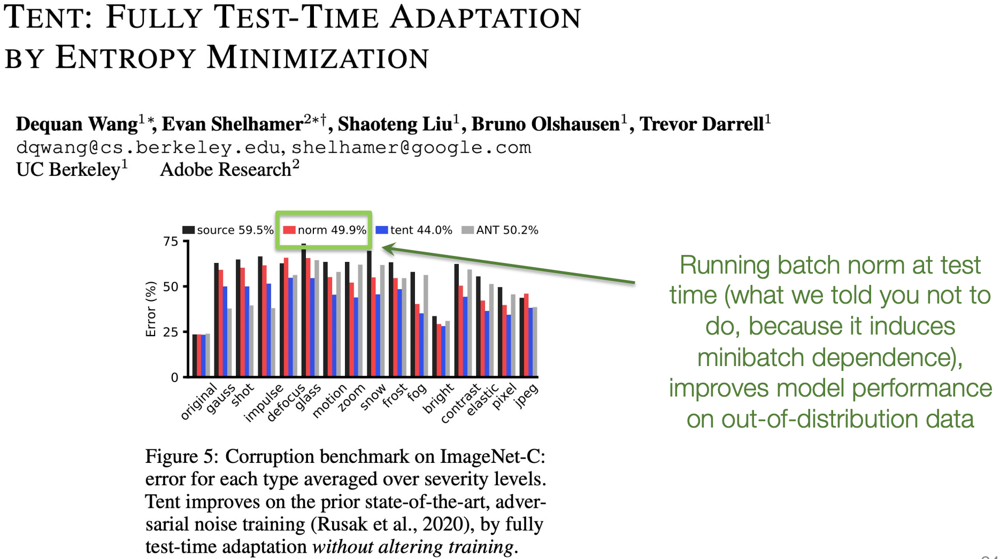

- **反常现象**：在**测试时**使用当前 minibatch 的统计量（即“运行 BatchNorm”），反而能提升模型在**分布外（out-of-distribution）数据**上的性能。
- 这与我们“应使用运行平均”的常规做法相悖，说明 BatchNorm 的机制仍不完全清楚。

## 9.8 总结与启示

1. **不要误解**：深度学习并非全是“随机黑科技”，已有大量优秀的实验研究。
2. **现实**：我们尚未完全理解各种经验技巧（如 BatchNorm、Dropout、初始化等）**如何工作以及如何相互作用**。
3. **好消息**：在许多情况下，**不同的架构和方法组合往往能达到相似的良好性能**。
4. 因此，设计模型时可尝试多种路径，不必拘泥于单一“最佳实践”。

# Lec10 卷积网络 (Convolutional Networks)

## 10.1 深度网络中的卷积算子 (Convolutional operators in deep networks)

### 全连接网络 (fully connected networks) 的问题

到目前为止，我们考虑的网络都是将输入图像视为**向量**

这在我们试图处理更大图像时会产生一个严重的问题：

- 一个 $256 \times 256$ 的 RGB 图像是约 20 万维的输入
- 将其映射到一个 1000 维的隐藏向量需要 2 亿个参数 (仅单层)

此外，这种方式没有捕捉到我们期望在图像中存在的任何“直观”的不变性 (invariances)

- 例如，将图像平移一个像素会导致下一层输出完全不同

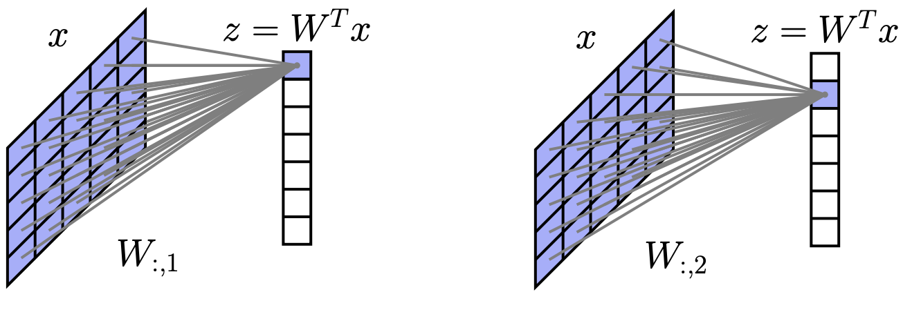

### 卷积如何“简化”深度网络

卷积结合了两种非常适合处理图像的思想

1. 要求层与层之间的激活仅在“局部” (`local`) 发生，并将隐藏层本身也视为空间图像
2. 在所有空间位置上共享权重 (`share weights`)


### 卷积的优势

- **大幅减少参数数量**
  - 一个 $256 \times 256$ 的灰度图输入到一个 $256 \times 256$ 的单通道隐藏层：
    - 在全连接网络中需要 40 亿个参数
    - 在一个 $3 \times 3$ 的卷积中只需要 9 个参数
- **捕捉（部分）“自然”的不变性**
  - 将输入图像向右平移一个像素，会使隐藏单元的“图像”也相应平移


### 卷积详解

卷积是许多计算机视觉和图像处理算法中的一个基本操作
其思想是“滑动”一个 $k \times k$ 的权重矩阵 $w$ (称为 `filter` 或 `kernel`) 在图像上，以生成一个新的图像，记为 $y = z * w$

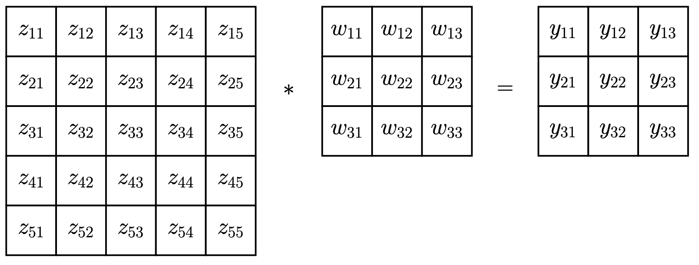

**计算过程示例**:

1. 计算输出 $y_{11}$:
    
    $y_{11} = z_{11}w_{11} + z_{12}w_{12} + z_{13}w_{13} + z_{21}w_{21} + \dots$

2. 计算输出 $y_{12}$:  $y_{12} = z_{12}w_{11} + z_{13}w_{12} + z_{14}w_{13} + z_{22}w_{21} + \dots$
3. 计算输出 $y_{13}$:  $y_{13} = z_{13}w_{11} + z_{14}w_{12} + z_{15}w_{13} + z_{23}w_{21} + \dots$
4. 计算输出 $y_{21}$:  $y_{21} = z_{21}w_{11} + z_{22}w_{12} + z_{23}w_{13} + z_{31}w_{21} + \dots$
5. 计算输出 $y_{22}$:  $y_{22} = z_{22}w_{11} + z_{23}w_{12} + z_{24}w_{13} + z_{32}w_{21} + \dots$
6. 计算输出 $y_{23}$:  $y_{23} = z_{23}w_{11} + z_{24}w_{12} + z_{25}w_{13} + z_{33}w_{21} + \dots$

### 图像处理中的卷积

卷积（通常使用预设定的 `filter`）是许多计算机视觉应用中的常见操作；卷积网络只是转向了**学习**这些 `filter`


### 深度网络中的卷积

深度网络中的卷积几乎总是多通道卷积 (`multi-channel convolutions`)：将多通道（例如 RGB）输入映射到多通道隐藏单元

- 输入 $x \in \mathbb{R}^{h \times w \times c_{in}}$ 表示一个 $c_{in}$ 通道，$h \times w$ 大小的图像
- 输出 $z \in \mathbb{R}^{h \times w \times c_{out}}$ 表示一个 $c_{out}$ 通道，$h \times w$ 大小的图像
- `Filter` $W \in \mathbb{R}^{c_{in} \times c_{out} \times k \times k}$ (一个 4 阶张量) k是卷积核大小

多通道卷积为每个输入-输出通道对包含一个卷积 `filter`，单个输出通道是所有输入通道卷积结果的和

- $z[:,:,s] = \sum_{r=1}^{c_{in}} x[:,:,r] * W[r,s,:,:]$


### 多通道卷积的矩阵-向量形式

有一种更直观的方式来理解多通道卷积：它们是传统卷积的推广，其中标量乘法被替换为矩阵-向量乘积


- 输入图像中的每个 $x_{ij}$ 都是 $\mathbb{R}^{c_{in}}$ 中的向量
- `Filter` 中的每个 $W_{ij}$ 都是 $\mathbb{R}^{c_{out} \times c_{in}}$ 的矩阵
- 计算 $z_{22}$ 的公式：
  - $z_{22} = W_{11}x_{22} + W_{12}x_{23} + W_{13}x_{24} + W_{21}x_{32} + \dots$
  - 这里的乘法是矩阵-向量乘积

---

## 10.2 实用卷积的要素 (Elements of practical convolutions)

### Padding

- **挑战**: “朴素”的卷积产生的输出图像比输入图像小
- **解决方案**: 对于（奇数）大小为 k 的 `kernel`，在输入图像的所有边填充 $(k-1)/2$ 个零，这使得输出与输入大小相同
- **变体**: `circular padding`，使用均值填充等


### 步幅卷积 (Strided Convolutions) / 池化 (Pooling)

- **挑战**: 卷积在每一层都保持输入的分辨率，不能直接产生不同“分辨率”的表示
- **解决方案 #1**: 引入 `max` 或 `average pooling` 层来聚合信息
- **解决方案 #2**: 以大于 1 的增量（即 `stride`）在图像上滑动卷积 `filter`


### 分组卷积 (Grouped Convolutions)

- **挑战**: 对于大量的输入/输出通道，`filter` 的权重数量仍然很大，可能导致过拟合 (`overfitting`) 和计算缓慢
- **解决方案**: 将通道分组，使得输出中的通道组仅依赖于输入中对应的通道组（等效于强制 `filter` 权重矩阵为块对角矩阵）


### 扩张卷积 (Dilations)

- **挑战**: 单个卷积的感受野 (`receptive field`) 相对较小
- **解决方案**: 扩张 (`dilate` 或 `spread out`) 卷积 `filter`，使其覆盖图像的更大范围
- **注意**: 为了再次获得相同大小的图像，需要添加更多的 `padding`


---

## 10.3 卷积的微分 (Differentiating convolutions)

### 微分需要什么？

回想一下，为了将任何操作集成到深度网络中，我们需要能够乘以其偏导数（伴随操作 `adjoint operation`）

如果我们定义操作为 $z = conv(x, W)$
那么我们如何乘以其伴随算子？

$$
\bar{v}\frac{\partial conv(x,W)}{\partial W}\ 和\ \bar{v}\frac{\partial conv(x,W)}{\partial x}
$$

### 回顾矩阵乘法的微分

考虑一个更简单的情况：矩阵-向量乘积 $z = Wx$

- $\frac{\partial z}{\partial x} = W$，所以我们需要计算伴随积 $\bar{v}^T W \iff W^T \bar{v}$
- 换句话说，对于矩阵向量乘法操作 `Wx`，计算反向传播需要乘以转置矩阵 $W^T$

那么，什么是“卷积的转置”呢？

### 将卷积视为矩阵乘法：版本 1

为了回答这个问题，我们先考虑一个 1D 卷积以简化问题
我们可以将一个 1D 卷积 $x * w$ (例如，使用零填充) 写成矩阵乘法 $\hat{W}x$ 的形式


$\begin{bmatrix} z_1 \\ z_2 \\ z_3 \\ z_4 \\ z_5 \end{bmatrix} = x * w = \underbrace{\begin{bmatrix} w_2 & w_3 & 0 & 0 & 0 \\ w_1 & w_2 & w_3 & 0 & 0 \\ 0 & w_1 & w_2 & w_3 & 0 \\ 0 & 0 & w_1 & w_2 & w_3 \\ 0 & 0 & 0 & w_1 & w_2 \end{bmatrix}}_{\hat{W}} \begin{bmatrix} x_1 \\ x_2 \\ x_3 \\ x_4 \\ x_5 \end{bmatrix}$

### 卷积的伴随算子 (Adjoint)

那么我们如何乘以转置矩阵 $\hat{W}^T$ 呢？
$\hat{W}^T = \begin{bmatrix} w_2 & w_1 & 0 & 0 & 0 \\ w_3 & w_2 & w_1 & 0 & 0 \\ 0 & w_3 & w_2 & w_1 & 0 \\ 0 & 0 & w_3 & w_2 & w_1 \\ 0 & 0 & 0 & w_3 & w_2 \end{bmatrix}$

请注意，操作 $\hat{W}^T v$ 本身就是与一个“翻转”的 `filter` $[w_3, w_2, w_1]$ 进行的卷积
因此，伴随算子 $\bar{v} \frac{\partial conv(x, W)}{\partial x}$ 只需要用翻转后的 `W` 对 $\bar{v}$ 进行卷积

### 将卷积视为矩阵乘法：版本 2

那么另一个伴随算子 $\bar{v} \frac{\partial conv(x,W)}{\partial W}$ 呢？
对于这一项，我们可以观察到卷积也可以写成一个矩阵-向量乘积，其中 `filter` 被视为向量

$\begin{bmatrix} z_1 \\ z_2 \\ z_3 \\ z_4 \\ z_5 \end{bmatrix} = x * w = \begin{bmatrix} 0 & x_1 & x_2 \\ x_1 & x_2 & x_3 \\ x_2 & x_3 & x_4 \\ x_3 & x_4 & x_5 \\ x_4 & x_5 & 0 \end{bmatrix} \begin{bmatrix} w_1 \\ w_2 \\ w_3 \end{bmatrix}$

因此，其伴随操作需要乘以这个**基于 `x` 构建的矩阵**的转置（这实际上是一种相当实用的方法，参见未来关于 `im2col` 操作的讲座）

# Lec11 硬件加速

## 11.1 通用加速技术

#### 机器学习框架中的层次


- 最上层是机器学习模型 (`ML Models`)
- 模型接收输入 `x` (例如一张图片)
- 模型内部由一个计算图 (`Computational graph`) 表示
- 计算图的节点是张量 (`Tensor`) 和线性代数库 (`Tensor linear algebra libraries`) 定义的操作
- 最终输出结果 $h_{\theta}(x)$
- 这些计算可以运行在各种硬件上，例如：
  - Intel Xeon Processor (CPU)
  - GPU
  - 手机
  - Raspberry Pi
  - 服务器集群

#### Vectorization (向量化)

向量化是一种利用 `SIMD` (Single Instruction, Multiple Data) 指令并行处理多个数据元素的技术

**例子：两个长度为256的数组相加**

```c
// C 语言示例(伪)代码
void vecadd(float* A, float *B, float* C) {
    for (int i=0; i<64; ++i) {
        // load_float4, add_float4, store_float4 都是向量化指令的抽象
        // 一次处理 4 个浮点数(4个byte)
        float4 a = load_float4(A + i*4);
        float4 b = load_float4(B + i*4);
        float4 c = add_float4(a, b);
        store_float4(C + i*4, c);
    }
}
```

- **额外要求**: 内存 `(A, B, C)` 需要是128位对齐的

> 内存对齐: 内存起始地址必须为32的倍数, 这样可以避免数据跨越内存总线宽度 / cache line, 减少访存次数&防止缓存污染

#### 数据布局 (Data layout) 和步幅 (strides)

**问题：如何在内存中存储一个矩阵**

- **行主序 (Row major)**: $A[i,j] \Rightarrow Adata[i * A.shape[1] + j]$
- **列主序 (Column major)**: $A[i,j] \Rightarrow Adata[j * A.shape[0] + i]$
- **步幅格式 (Strides format)**: $A[i,j] \Rightarrow Adata[i * A.strides[0] + j * A.strides[1]]$

#### 关于 Strides 的讨论

- **优点**: 可以用零拷贝 (`zero copy`) 的方式实现某些变换/切片
  - **切片 (Slice)**: 改变起始偏移量和形状 (`shape`)
  - **转置 (Transpose)**: 交换 (`swap`) 步幅
  - **广播 (Broadcast)**: 插入一个等于 0 的步幅
- **缺点**: 内存访问可能变得不连续,  因为执行计算时操作的是底层的原始数组
  - 这使得向量化 (`vectorization`) 更加困难
  - 许多线性代数操作可能需要先将数组紧凑化 (`compact`):
   	  - 需要在执行计算前检查是否compact, 如果不是, 进行compact处理, 根据stride创建一个数组
   	  	  	  - 或者直接实现一个迭代器根据stride进行计算的版本

#### Parallelization (并行化)

利用多线程并行执行计算

```c
// 使用 OpenMP 的并行化 vecadd 示例
void vecadd(float* A, float *B, float* C) {
    // #pragma omp parallel for 指令告诉编译器用多个线程并行执行这个 for 循环
    #pragma omp parallel for
    for (int i=0; i<64; ++i) {
        float4 a = load_float4(A + i*4);
        float4 b = load_float4(B + i*4);
        float4 c = add_float4(a, b);
        store_float4(C + i*4, c);
    }
}
```

- 该指令会在多个线程上执行计算
  
## 11.2 案例学习：矩阵乘法

#### 朴素矩阵乘法 (Vanilla matrix multiplication)

计算 $C = dot(A, B.T)$

```c
float A[n][n], B[n][n], C[n][n];

for (int i=0; i<n; ++i)
    for (int j=0; j<n; ++j) {
        C[i][j] = 0;
        for (int k=0; k < n; ++k) {
            C[i][j] += A[i][k] * B[j][k];
        }
    }
}
```

- 时间复杂度为 $O(n^3)$

#### 现代 CPU 的内存层次结构 (Memory hierarchy)

| 内存层级      | 延迟 (Latency) | 相对延迟                        |
| --------- | ------------ | --------------------------- |
| Registers |              |                             |
| L1 Cache  | 0.5 ns       |                             |
| L2 Cache  | 7ns          | 14x L1 cache                |
| DRAM      | 200ns        | 20x L2 cache, 200x L1 cache |

> (数据来源: Latency numbers every programmer should know)

#### 体系结构感知分析 (Architecture aware analysis)

分析朴素矩阵乘法中的内存访问开销

```c
dram float A[n][n], B[n][n], C[n][n];

for (int i=0; i<n; ++i) {
    for (int j=0; j<n; ++j) {
        register float c = 0;
        for (int k=0; k<n; ++k) {
            register float a = A[i][k];
            register float b = B[j][k];
            c += a * b;
        }
        C[i][j] = c;
    }
}
```

- **`dram->register` 的时间成本**:
  - 对于 $A$ 是 $n^3$
  - 对于 $B$ 是 $n^3$
- **加载总成本**: $2 * dramspeed * n^3$
- **`register` 内存成本**: 3 (用于 a, b, c)

#### 寄存器分块矩阵乘法 (Register tiled matrix multiplication)

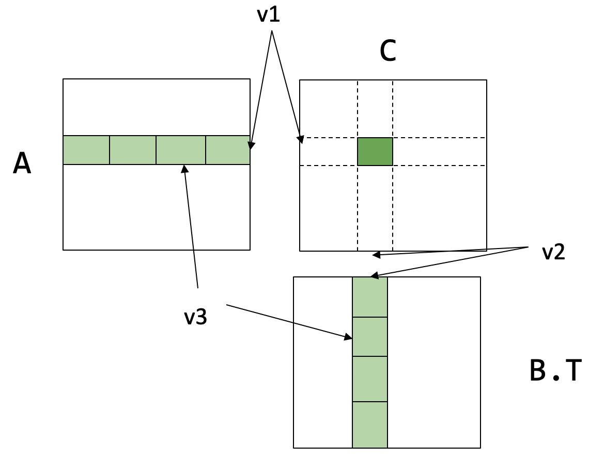

```c
// v1, v2, v3 是 tiling (分块) 的大小
// 假设 A, B, C 矩阵都存储在 DRAM 中
// 数据布局被重排以匹配分块策略，例如 A 的维度是 (n/v1, n/v3, v1, v3)
dram float A[n/v1][n/v3][v1][v3];
dram float B[n/v2][n/v3][v2][v3];
dram float C[n/v1][n/v2][v1][v2];

// 循环遍历输出矩阵 C 的行块 (block row)
for (int i=0; i<n/v1; ++i) {
    // 循环遍历输出矩阵 C 的列块 (block column)
    for (int j=0; j<n/v2; ++j) {
        // 在寄存器中分配一个 v1 x v2 的块，用于累加 C[i][j] 的结果
        register float c[v1][v2] = {0};
        
        // 沿着 k 维度循环，这是矩阵乘法的缩减维度 (reduction dimension)
        for (int k=0; k<n/v3; ++k) {
            // 从 DRAM 加载 A 的一个 v1 x v3 块到寄存器 a 中
            register float a[v1][v3] = A[i][k];
            // 从 DRAM 加载 B 的一个 v2 x v3 块到寄存器 b 中
            register float b[v2][v3] = B[j][k];
            
            // 计算两个寄存器块的点积 (a * b.T) 并累加到寄存器 c 中
            c += dot(a, b.T);
        }
        
        // 当k循环结束后，将寄存器c中累加完毕的结果块写回到 DRAM 中的 C[i][j]
        C[i][j] = c;
    }
}
```

- **分块后的成本分析**:
  - `A` 的 `dram->register` 时间成本: $n^3 / v2 = \frac{n}{v_{1}} * \frac{n}{v_{2}} * \frac{n}{v_{3}}*v_{1}*v_{3}$
  - `B` 的 `dram->register` 时间成本: $n^3 / v1$
  - 总加载成本: $dramspeed * (n^3/v2 + n^3/v1)$
  - `register` 内存成本: $v1*v3 + v2*v3 + v1*v2$

#### 缓存行感知分块 (Cache line aware tiling)

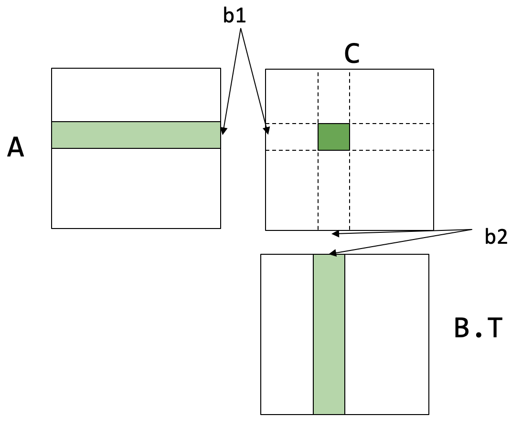

```c
// b1, b2 是缓存分块的大小
dram float A[n/b1][b1][n];
dram float B[n/b2][b2][n];
dram float C[n/b1][n/b2][b1][b2];

for (int i=0; i<n/b1; ++i) {
    l1cache float a[b1][n] = A[i];
    for (int j=0; j<n/b2; ++j) {
        l1cache b[b2][n] = B[j];
        // 子过程，可以在这里应用寄存器分块
        C[i][j] = dot(a, b.T);
    }
}
```

- **缓存分块成本分析**:
  - `A` 的 `dram->l1` 时间成本: $n^2$
  - `B` 的 `dram->l1` 时间成本: $n^3 / b1$
- **约束条件**:
  - 加载到 L1 缓存的数据块大小不能超过 L1 缓存的容量: $b1*n + b2*n < \text{l1 cache size}$
  - 为了在 `dot` 子过程中继续应用寄存器分块: $b1 \% v1 <mark> 0$, $b2 \% v2 </mark> 0$

#### 整合两种分块方法

```c
// 结合缓存分块和寄存器分块
dram float A[n/b1][b1/v1][n][v1];
dram float B[n/b2][b2/v2][n][v2];

for (int i=0; i<n/b1; ++i) {
    l1cache float a[b1/v1][n][v1] = A[i];
    for (int j=0; j<n/b2; ++j) {
        l1cache b[b2/v2][n][v2] = B[j];
        for (int x=0; x<b1/v1; ++x)
            for (int y=0; y<b2/v2; ++y) {
                register float c[v1][v2] = {0};
                for (int k=0; k<n; ++k) {
                    register float ar[v1] = a[x][k][:];
                    register float br[v2] = b[y][k][:];
                    c += dot(ar, br.T);
                }
                // 此处省略了将 c 写回 C 的代码
            }
        }
    }
}
```

- **总加载成本**: $l1speed * (n^3/v2 + n^3/v1) + dramspeed * (n^2 + n^3/b1)$

#### 核心思想：内存加载复用 (Memory load reuse)

回顾寄存器分块的代码：

```c
for (int i=0; i<n/v1; ++i) {
    for (int j=0; j<n/v2; ++j) {
        register float c[v1][v2] = {0};
        for (int k=0; k<n/v3; ++k) {
            register float a[v1][v3] = A[i][k];
            register float b[v2][v3] = B[j][k];
            c += dot(a, b.T);
        }
        C[i][j] = c;
    }
}
```

- 在内层的 `k` 循环中加载的 `a` 块，会在外层的 `j` 循环中被复用 $v2$ 次
- 同理，加载的 `b` 块，会在 `i` 循环中被复用 $v1$ 次
- 复用大大减少了从 `DRAM` 到 `register` 的总数据传输量
  - `A` 的 `dram->register` 成本从 $n^3$ 降至 $n^3/v2$
  - `B` 的 `dram->register` 成本从 $n^3$ 降至 $n^3/v1$

#### 常见的复用模式

对于如下形式的计算：
$C[i][j] = \text{sum}(A[i][k] * B[j][k], \text{axis}=k)$

- 对 `A` 的访问 $A[i][k]$ 与 `j` 无关
- 因此，对 `j` 维度进行大小为 `v` 的分块，可以使得 `A` 的数据被复用 `v` 次

#### 讨论：卷积中可能的复用模式

```c
float Input[n][ci][h][w];
float Weight[co][ci][K][K];
float Output[n][co][h][w];

// 卷积计算公式
Output[b][co][y][x] = sum(Input[b][k][y+ry][x+rx] * Weight[co][k][ry][rx], axis=[k, ry, rx])
```

- 可以思考在 `Input` 和 `Weight` 张量的访问中存在哪些复用模式

# Lec12 GPU 加速

## 12.1 GPU 编程

### 什么是 GPU

与 CPU 相比, GPU 拥有大规模的并行计算单元

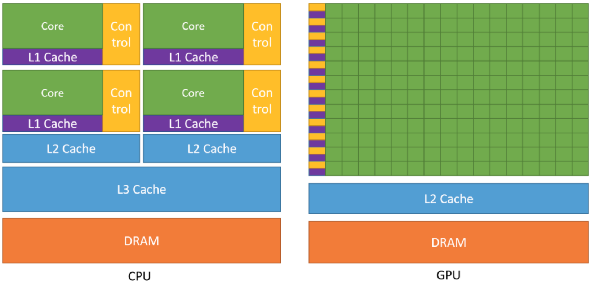

- **CPU (Central Processing Unit)**
  - 拥有较少的 `Core`
  - 每个 `Core` 配有较大的 `Control` 单元和 `L1 Cache`
  - 拥有共享的 `L2 Cache` 和 `L3 Cache`
  - 适用于处理复杂的串行任务

- **GPU (Graphics Processing Unit)**
  - 拥有海量的 `Core` (绿色方块)
  - `Control` 单元和 `Cache` 相对较小
  - 通过大量线程并行执行简单任务, 实现高吞吐量

### GPU 编程模型: SIMT

GPU 采用 **SIMT (Single Instruction Multiple Threads)** 编程模型

- 所有线程执行相同的代码, 但可以根据数据走不同的执行路径

**CUDA 编程模型术语**
(注意: 其他 GPU 编程模型如 OpenCL, SYCL, Metal 也有类似概念)

1. **Thread**
    - 最基本的执行单元
2. **Thread Block**
    - `Thread` 被组织成 `Block`
    - 同一个 `Block` 内的 `Thread` 共享一块 `Shared Memory`, 可以相互协作
    - 例如, 下图展示了包含 `block0`, `block1`, `block2`, `block3` 的结构
      
3. **Grid**
    - `Block` 被组织成 `Grid`
    - 一个 `Kernel` 函数会启动一个 `Grid` 来执行

### 示例: 向量加法

这是一个在 CPU 和 GPU 上实现向量加法 $C[i] = A[i] + B[i]$ 的对比

**CPU 实现**

```cpp
void VecAddCPU(float* A, float* B, float* C, int n) {
    for (int i = 0; i < n; ++i) {
        C[i] = A[i] + B[i];
    }
}
```

**GPU 实现 (Kernel 函数)**

在 GPU 上执行的函数称为 Kernel, 使用 **global** 标识符

每个线程负责计算结果向量 C 中的一个元素

```cpp
__global__ void VecAddKernel(float* A, float* B, float* C, int n) {
    // 计算当前线程在全局数据中的索引 i
    int i = blockDim.x * blockIdx.x + threadIdx.x;
    if (i < n) {
        C[i] = A[i] + B[i];
    }
}
```

- `blockIdx.x`: 当前 `Block` 在 `Grid` 中的索引
- `threadIdx.x`: 当前 `Thread` 在 `Block` 中的索引
- `blockDim.x`: 每个 `Block` 中 `Thread` 的数量
  

**线程索引计算图解**

假设每个 `Block` 包含 4 个 `Thread` (`blockDim.x = 4`)

全局索引 $i$ 的计算公式为: $i = \text{blockDim.x} * \text{blockIdx.x} + \text{threadIdx.x}$

本质上不同Thread执行的都是同一段代码, 因为索引不同而产生区别
这段代码不存在数据依赖, 可以非常简单的实现并行计算

**Host 端代码**

在 CPU (Host) 端, 我们需要:

1. 在 GPU (Device) 上分配内存
2. 将数据从 Host 拷贝到 Device
3. 启动 `Kernel` 函数
4. 将结果从 Device 拷贝回 Host
5. 释放 Device 上的内存

```cpp
void VecAddCUDA(float* Acpu, float* Bcpu, float* Ccpu, int n) {
    float *dA, *dB, *dC;
    
    // 1. 在 Device 上分配内存
    cudaMalloc(&dA, n * sizeof(float));
    cudaMalloc(&dB, n * sizeof(float));
    cudaMalloc(&dC, n * sizeof(float));

    // 2. 将数据从 Host 拷贝到 Device
    // 瓶颈在这里, 频繁的PCIe传输过于耗时
    cudaMemcpy(dA, Acpu, n * sizeof(float), cudaMemcpyHostToDevice);
    cudaMemcpy(dB, Bcpu, n * sizeof(float), cudaMemcpyHostToDevice);

    // 3. 启动 Kernel
    int threads_per_block = 512;
    int nblocks = (n + threads_per_block - 1) / threads_per_block;
    VecAddKernel<<<nblocks, threads_per_block>>>(dA, dB, dC, n);

    // 4. 将结果从 Device 拷贝回 Host
    cudaMemcpy(Ccpu, dC, n * sizeof(float), cudaMemcpyDeviceToHost);

    // 5. 释放 Device 内存
    cudaFree(dA);
    cudaFree(dB);
    cudaFree(dC);
}
```

注意: 实际应用中, 为了避免频繁的内存拷贝开销, 数据通常会**尽可能长时间**地保留在 GPU 内存中

### 其他 GPU 编程模型示例

**OpenCL (用于 ARM GPU 等)**

```cpp
kernel void VecAdd(__global float *a, 
                   __global float* b, 
                   __global float* c, 
                   int n) {
    int gid = get_global_id(0);
    if (gid < n) {
        c[gid] = a[gid] + b[gid];
    }
}
```

**Metal (用于 Apple 设备)**

```cpp
kernel void VecAdd(float* a [[buffer(0)]],
                   float* b [[buffer(1)]],
                   float* c [[buffer(2)]], // 应该是 buffer(2)
                   uint gid [[thread_position_in_grid]],
                   int n) {
    if (gid < n) {
        c[gid] = a[gid] + b[gid];
    }
}
```

### GPU 内存层级

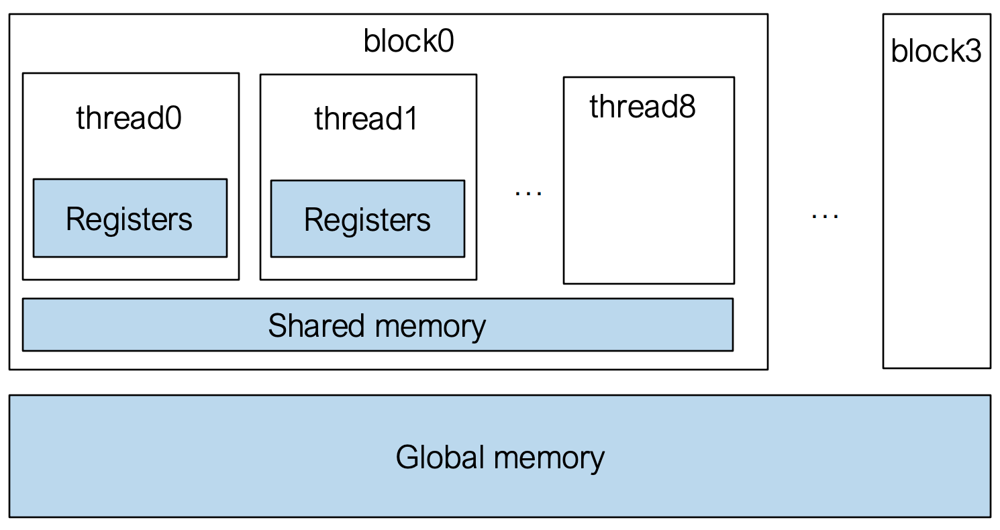

- **Registers**:
  - 每个 `Thread` 私有
  - 速度最快
  - 生命周期与 `Thread` 相同
- **Shared Memory**:
  - 每个 `Thread Block` 共享
  - 速度快于 `Global Memory`
  - 用于 `Block` 内 `Thread` 间的通信与数据共享
- **Global Memory**:
  - 所有 `Thread` 均可访问 (整个 `Grid`)
  - 速度最慢, 延迟最高
  - 容量最大

### 示例: 窗口求和 (Window Sum)

**任务**: 对输入数组 `A`, 计算一个滑动窗口内元素的和, 存入 `B` (窗口半径 `RADIUS = 2`)

**简单实现 (只用 Global Memory)**

每个线程独立从 `Global Memory` 中读取所有需要的元素


```cpp
#define RADIUS 2
__global__ void WindowSumSimpleKernel(float* A, float* B, int n) {
    int out_idx = blockDim.x * blockIdx.x + threadIdx.x;
    if (out_idx < n) {
        float sum = 0;
        for (int dx = -RADIUS; dx <= RADIUS; ++dx) {
            sum += A[dx + out_idx + RADIUS];
        }
        B[out_idx] = sum;
    }
}
```

- **问题**: 相邻线程读取的数据有大量重叠, 导致对 `Global Memory` 的重复访问, 效率低下
  

**使用 Shared Memory 的优化实现**

利用 `Block` 内线程协作, 将计算所需的数据一次性从 `Global Memory` 读入 `Shared Memory`, 然后每个线程从 `Shared Memory` 中读取数据进行计算

```cpp
__global__ void WindowSumSharedKernel(float* A, float* B, int n) {
    // 1. 在 Shared Memory 中声明一个临时数组
    __shared__ float temp[THREADS_PER_BLOCK + 2 * RADIUS];
    
    int base = blockDim.x * blockIdx.x;
    int out_idx = base + threadIdx.x;

    // 2. 协作将数据从 Global Memory 载入 Shared Memory
    // 载入核心部分
    if (base + threadIdx.x < n) {
        temp[threadIdx.x + RADIUS] = A[base + threadIdx.x]; // 偏移 RADIUS
    }
    // 载入处理边界所需的 "ghost" 元素
    if (threadIdx.x < RADIUS) {
        if (base + threadIdx.x - RADIUS >= 0)
            temp[threadIdx.x] = A[base + threadIdx.x - RADIUS];
        if (base + THREADS_PER_BLOCK + threadIdx.x < n)
            temp[threadIdx.x + THREADS_PER_BLOCK + RADIUS] = A[base + THREADS_PER_BLOCK + threadIdx.x];
    }

    // 3. 同步, 确保所有数据都已载入 Shared Memory
    __syncthreads();
 
    // 4. 从 Shared Memory 中读取数据进行计算
    if (out_idx < n) {
        float sum = 0;
        for (int dx = -RADIUS; dx <= RADIUS; ++dx) {
            sum += temp[threadIdx.x + RADIUS + dx];
        }
        B[out_idx] = sum;
    }
}
```

- 通过协作读取到 `Shared Memory`, 增加了数据复用, 显著减少了对 `Global Memory` 的访问次数
  
### 核心要点

- 通过启动 `Grid` 和 `Block` 来组织大量线程
- 通过协作将数据块读取到 `Shared Memory` 中以增加数据复用, 这是 GPU 优化的关键技巧
  
## 12.2 案例学习: GPU 上的矩阵乘法

### 线程级别优化: Register Tiling

**思路**: 每个线程负责计算结果矩阵 `C` 的一个 $V \times V$ 的小块, 这个小块的数据 (`c[V][V]`) 直接**存储在寄存器**中以获得最高访问速度


- 每个线程从 `A.T` 的一行和 `B` 的一列中分别读取 `V` 个元素, 计算出一个外积, 累加到寄存器中的 $V \times V$ 块
```cpp
// C = A.T * B
__global__ void mm(float A[N][N], float B[N][N], float C[N][N]) {
    int ybase = blockIdx.y * blockDim.y + threadIdx.y;
    int xbase = blockIdx.x * blockDim.x + threadIdx.x;

    float c[V][V] = {0}; // V*V 的结果块, 存储在寄存器中
    float a[V], b[V];    // 临时存储从 A 和 B 读取的数据

    for (int k = 0; k < N; ++k) {
        // 从 Global Memory 读取数据
        a[:] = A[k, ybase*V : ybase*V + V];
        b[:] = B[k, xbase*V : xbase*V + V];

        // 在寄存器中计算外积并累加
        for (int y = 0; y < V; ++y) {
            for (int x = 0; x < V; ++x) {
                c[y][x] += a[y] * b[x];
            }
        }
    }
    
    // 将结果写回 Global Memory
    C[ybase*V : ybase*V+V, xbase*V : xbase*V+V] = c[:];
}
```

### 块级别优化: Shared Memory Tiling

**思路**: 每个 `Thread Block` 负责计算 `C` 的一个 $L \times L$ 的块, 每个线程依然计算其 $V \times V$ 的子块. `Block` 内的线程协作地将 `A` 和 `B` 的子块 (tile) 载入 `Shared Memory`, 然后所有线程从 `Shared Memory` 中读取数据进行计算


- 每个 `Block` 从 `A.T` 和 `B` 中载入 $S \times L$ 和 $S \times L$ 的数据块到 `Shared Memory`
- `Block` 内的每个 `Thread` 再从 `Shared Memory` 读取数据, 计算自己的 $V \times V$ 结果块
  
```cpp
__global__ void mm(float A[N][N], float B[N][N], float C[N][N]) {
    __shared__ float sA[S][L], sB[S][L]; // Shared Memory 中的数据块

    float c[V][V] = {0}; // 每个线程的寄存器数据块
    float a[V], b[V];

    int yblock = blockIdx.y;
    int xblock = blockIdx.x;

    for (int ko = 0; ko < N; ko += S) {
        // 1. 协作将 Global Memory 数据载入 Shared Memory
        // SA[:,:] = A[ko:ko+S, yblock*L : yblock*L+L];
        // sB[:,:] = B[ko:ko+S, xblock*L : xblock*L+L];
        __syncthreads(); // 等待所有线程完成载入

        // 2. 从 Shared Memory 读取数据到寄存器, 进行计算
        for (int ki = 0; ki < S; ++ki) {
            a[:] = sA[ki, threadIdx.y*V : threadIdx.y*V+V];
            b[:] = sB[ki, threadIdx.x*V : threadIdx.x*V+V]; // PPT原文为 sA, 应为 sB
            
            for (int y = 0; y < V; ++y) {
                for (int x = 0; x < V; ++x) {
                    c[y][x] += a[y] * b[x];
                }
            }
        }
        __syncthreads(); // 同步, 准备载入下一批数据块
    }
    // ... 将 c 写回 Global Memory ...
}
```

**内存复用分析**

- **Global -> Shared 拷贝**: $2 \cdot N^3 / L$
- Shared -> Register 拷贝: $2 \cdot N^3 / V$
  
    通过增大 L 和 V 的值, 可以显著提高数据在 Shared Memory 和 Register 中的复用率, 从而减少对慢速 Global Memory 的访问

展开协作式数据获取

将数据从 Global Memory 载入 Shared Memory (SA[:,:] = A[...]) 的具体实现如下:

```cpp
// blockDim.y * blockDim.x
int nthreads = blockDim.y * blockDim.x; 
// threadIdx.y * blockDim.x + threadIdx.x
int tid = threadIdx.y * blockDim.x + threadIdx.x; 

for(int j = 0; j < L*S / nthreads; ++j) {
    int y = (j * nthreads + tid) / L;
    int x = (j * nthreads + tid) % L;
    sA[y, x] = A[ko+y, yblock*L+x]; // sA in ppt, not s
}
```

### 更多 GPU 优化技巧

- **Global Memory Coalescing (全局内存连续读取)**: 让同一个 `Warp` 中的线程连续访问 `Global Memory` 地址, 可以合并成一次内存事务, 提高带宽利用率
- **Shared Memory Bank Conflict**: `Shared Memory` 分为多个 `Bank`, 如果 `Warp` 内多个线程同时访问同一个 `Bank`, 就会发生冲突, 导致访问串行化, 降低性能
- **Software Pipelining**: 通过软件技术重叠数据加载和计算指令, 隐藏内存访问延迟
- **Warp Level Optimizations**: 针对 `Warp`(一组32个线程)的特性进行优化
- **Tensor Core**: 利用 NVIDIA GPU 中的专用硬件单元加速矩阵乘加运算
  
> 更多细节请查阅 CUDA Programming Guide

# Lec13 硬件加速实现

[13_hardware_acceleration_architecture_overview.ipynb - Colab](https://colab.research.google.com/github/dlsyscourse/lecture13/blob/main/13_hardware_acceleration_architecture_overview.ipynb) 

# Lec14 卷积网络实现
skip


# Lec15 序列建模与循环神经网络

## 15.1 序列建模 (Sequence Modeling)

### 序列建模任务

- 到目前为止我们考虑的例子中，我们都假设每个输入输出对 $x^{(i)}$, $y^{(i)}$ 是**独立同分布** (independent identically distributed, i.i.d.) 的
- 在实践中，很多情况下输入/输出对是按特定序列给出的，我们需要利用这个序列的信息来帮助我们进行预测

- 通常，我们将时间步 $t$ 的整个输入向量用下标表示为 $x_t$ 

### Example：词性标注 (Part of speech tagging)

- **任务**: 给定一个单词序列，确定每个单词的词性
- 一个单词的词性取决于它所在的上下文，而不仅仅是单词本身


### 示例：语音转文本 (Speech to text)

- **任务**: 给定一个音频信号（甚至假设我们知道单词的边界，并将每个片段映射到一个固定大小的向量描述符），确定相应的文本转录
- 同样，单词的上下文极其重要（例如，糟糕的语音识别系统可能会出错）


### 示例：自回归预测 (Autoregressive prediction)

- 这是一种特殊的序列预测，其要预测的元素是序列中的下一个元素
- 常见于时间序列预测、语言建模 (language modeling) 等用例


## 15.2 循环神经网络 (Recurrent Neural Networks, RNNs)

- 循环神经网络 (RNNs) 随时间维护一个隐藏状态 (hidden state)，该状态是当前输入和前一个隐藏状态的函数


- **核心公式**:
  - 隐藏状态: $h_{t}=f(W_{hh}h_{t-1}+W_{hx}x_{t}+b_{h})$
  - 输出: $y_{t}=g(W_{yh}h_{t}+b_{y})$
- 其中 $f$ 和 $g$ 是激活函数，$W_{hh}$、$W_{hx}$、$W_{yh}$ 是权重(下标hx意为将x映射到h的维度)，$b_{h}$、$b_{y}$ 是偏置项

### 如何训练你的RNN

- 给定一个输入和目标输出序列 $(x_{1},...,x_{T},\ y_{1}^{*},...,y_{T}^{*})$，我们可以使用**时间反向传播 (backpropagation through time, BPTT)** 来训练RNN
- 这实际上就是将RNN按序列长度“展开”，然后主要依赖自动微分

```python
# 训练过程伪代码
opt = Optimizer(params = (w_hh, w_hx, w_yh, b_h, b_y))
h[0] = 0
l = 0
for t in 1,...,T:
    h[t] = f(w_hh * h[t-1] + w_hx * x[t] + b_h)
    y[t] = g(w_yh * h[t] + b_y)
    l += Loss(y[t], y_star[t])
l.backward()
opt.step()
```

### 堆叠RNNs (Stacking RNNs)

- 就像普通的神经网络一样，RNNs也可以堆叠在一起，将一层的隐藏单元作为下一层的输入，从而形成“深度RNNs (deep RNNs)”
- 实际上，“非常深”的RNNs的价值往往不如其他架构


### 激活/梯度爆炸 (Exploding activations/gradients)

- 训练RNNs的挑战与训练深度MLP网络相似
- 因为我们在长序列上训练RNNs，如果RNN的权重/激活缩放不当，隐藏激活（以及梯度）会随着序列长度无限增长
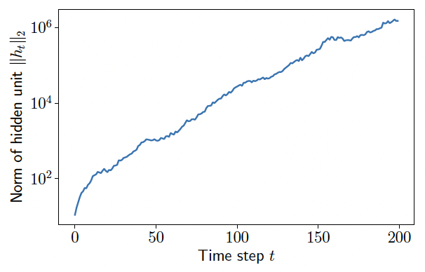

- **示例**: 单层RNN，使用ReLU激活函数，权重初始化为 $W_{hh}​∼N(0,3/n)$
- (回想一下，对于ReLU激活函数，σ2=2/n 是“合适的”初始化)
  
### 激活/梯度消失 (Vanishing activation/gradients)

- 同样，如果权重太小，来自输入的信息会随时间迅速衰减
- 而我们通常希望用序列模型来建模的正是“长距离依赖关系”

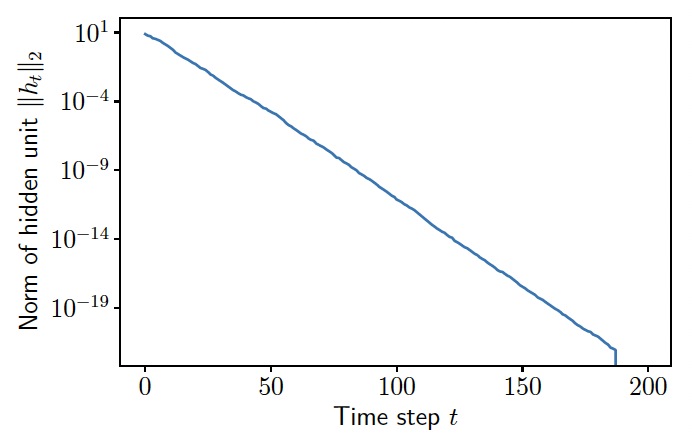

- **示例**: 单层RNN，使用ReLU激活函数，权重初始化为 $W_{hh}​∼N(0,1.5/n)$
- (这里仅在时间点1提供了非零输入，以展示关于该输入的信息随时间衰减的情况)

### 修改激活函数

- ReLU的一个明显问题是它可以无界增长；使用有界激活函数（如 `sigmoid` 或 `tanh`）能“修复”这个问题吗？
  
- **不能**: 
	- 可以解决激活值爆炸, 因为限制了输出范围
	- 要创建足够大的权重以避免激活/梯度消失，就需要让激活函数处于“饱和”区域，而在这些区域梯度非常小，因此**仍然存在梯度消失问题**
  
 

---

## 15.3 LSTMs (Long Short-Term Memory)

### 长短期记忆RNNs

长短期记忆 (Long Short-Term Memory, LSTM) 单元是一种特殊形式的隐藏单元更新方式，它避免了（部分）普通RNNs的问题
  
- **步骤1**: 将隐藏单元分为两个部分，分别称为（有点令人困惑的）**隐藏状态 (hidden state)** $h_t$​ 和 **单元状态 (cell state)** $c_t​$
  


- **步骤2**: 使用一个非常特定的公式来更新隐藏状态和单元状态
  
- 为了更好地理解(maybe更困惑)，还引入了一些其他名称，如“遗忘门 (forget gate)”、“输入门 (input gate)”、“输出门 (output gate)”
$$
\begin{aligned}&\begin{bmatrix}i_t\\f_t\\g_t\\o_t\end{bmatrix}=\begin{pmatrix}\mathrm{sigmoid}\\\mathrm{sigmoid}\\\mathrm{tanh}\\\mathrm{sigmoid}\end{pmatrix}(W_{hh}h_{t-1}+\mathrm{W}_{hx}x_t+b_h)\\&c_{t}=c_{t-1}\circ f_{t}+i_{t}\circ g_{t}\\&\begin{aligned}h_t=\tanh(c_t)\circ o_t\end{aligned}\end{aligned}
$$
- $W_{hh}\in \mathbb R^{4d*d}, W_{hx}\in \mathbb R^{4d*n}$, 每个i, f, g, o都是d维的
### 为什么LSTMs有效？

- 关于“理解LSTMs工作原理”的论文/博客文章似乎数不胜数
- **关键在于这行公式**: $c_t​=c_{t−1}​∘f_t​+i_t​∘g_t​$
  
- **核心思想**:
    - 我们通过将 $c_{t−1}$​ 按比例缩小（通过遗忘门 ft​，[0,1]组成的d维向量），然后再加上一项（通过输入门 it​ 和 gt​）来形成新的单元状态 ct​
    - 重要的是，ft​ 的 sigmoid 激活函数在值为1时达到“饱和”，此时会使 ct−1​ 不受影响地直接通过
    - 这意味着在更大范围的权重下，LSTMs**不会遭受梯度消失的困扰**
      

### 一些著名的LSTMs

- LSTM历史上一个非常著名的博客文章：[The Unreasonable Effectiveness of Recurrent Neural Networks by Andrej Karpathy](http://karpathy.github.io/2015/05/21/rnn-effectiveness/)
  


**示例：由模型生成的代码/文本**
  
- 由在**Linux源代码**上训练的字符级自回归模型生成:

```c
/*
* Increment the size file of the new incorrect
UI FILTER group information
* of the size generatively.
*/
static int indicate_policy(void)
{
	int error;
	if (fd == MARN_EPT) {
	}
	/*
	* The kernel blank will coeld it to userspace.
	*/
	if (ss->segment < mem_total)
		unblock_graph_and_set_blocked();
	else
		ret = 1;
	goto bail;
	segaddr = in_SB(in.addr);
	selector = seg / 16;
	setup_works = true;
...
```
    
- 在**LaTeX源代码**上训练生成的文本:
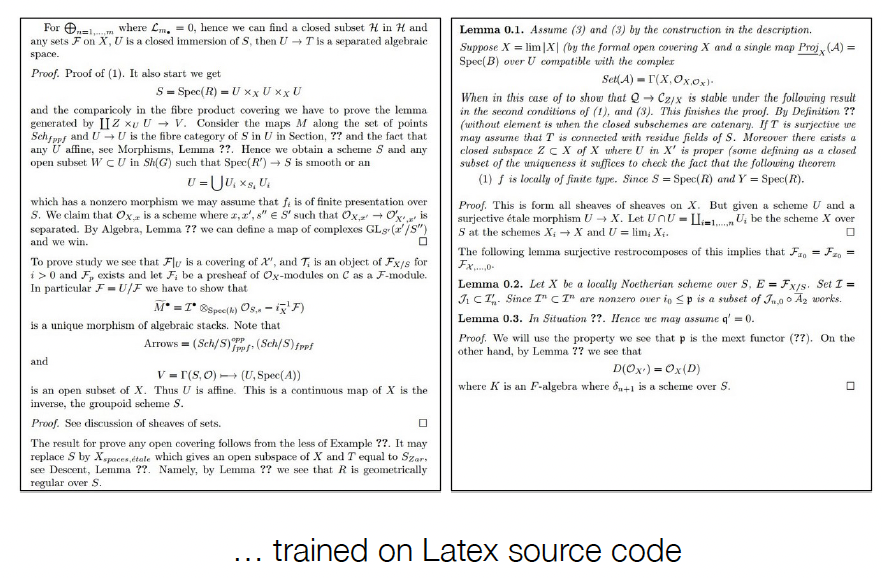

## 15.4 超越“简单”序列模型

### 序列到序列 (Sequence-to-sequence) 模型

- 为了让大家初步了解RNNs/LSTMs在“简单序列预测”之外的应用，我们来看看语言翻译任务
  
- **结构**:
    - 可以将两个RNNs连接在一起
    - 一个 **编码器 (encoder)** 只负责处理输入序列以生成最终的隐藏状态（没有损失函数）
    - 然后另一个 **解码器 (decoder)** 接收这个初始隐藏状态，只负责生成一个序列
      

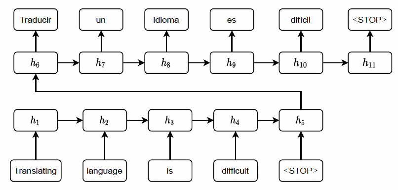

### 双向RNNs (Bidirectional RNNs)

- **问题**: 标准RNNs只能使用直到时间点 t 的序列信息来预测 yt​
    - 这在某些情况下是合适的（例如，自回归模型）
    - 但有时却不合适（例如，在语言翻译中，我们希望使用“整个”输入序列的上下文）
    
- **解决方案**: 双向RNNs (Bi-directional RNNs)
    - 将一个**前向RNN**和一个**后向RNN**堆叠在一起
    - 这样，整个序列的信息都能传播到每个时间点的隐藏状态中
- 但是依赖过于复杂?

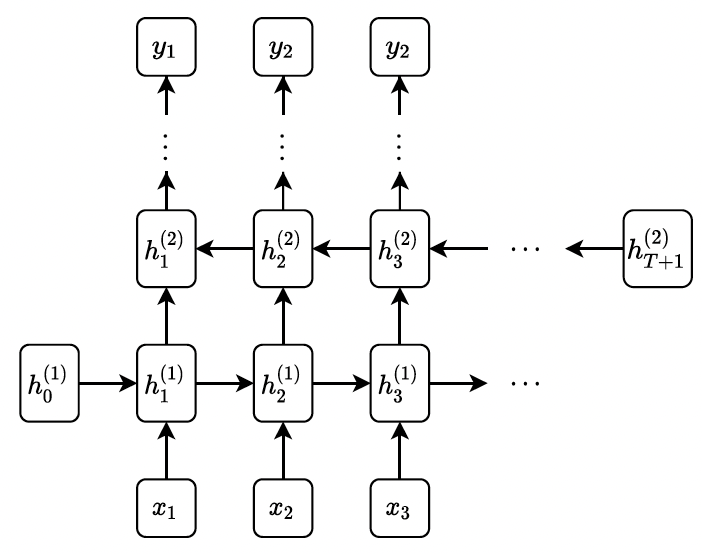

- 