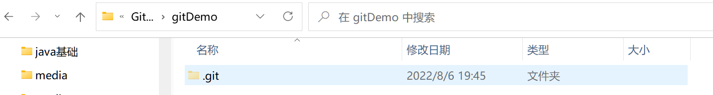

# **一**、Git概述

* `Git`是一个免费的、开源的==分布式版本控制系统== ，可以快速高效地处理从小型到大型的各种项目 。
* `Git`易于学习，占地面积小，性能极快 。 它具有廉价的本地库 ，方便的暂存区域和多个工作流分支等特性。 其性能优于 `Subversion`、 `CVS`、 `Perforce`和 `ClearCase`等版本控制工具。

### 1. 版本控制

#### 1.1 什么是版本控制

* 版本控制是一种记录文件内容变化，以便将来查阅特定版本修订情况的系统

* 版本控制其实最重要的是可以记录==文件修改历史记录==，从而让用户能够查看历史版本，方便版本切换。

  

* 团队协作时, 如果单纯使用多副本的版本, 不同人的修改无法合并, 所以需要专业的版本控制软件

#### 1.2 版本控制工具

* 分为**集中式**版本控制工具 和 **分布式**版本控制工具

##### 集中式版本控制工具

1. 常见集中式版本控制工具:  `CVS`、<font color='#EE0000'>`SVN(Subversion)`</font>、`VSS`……

2. 基本原理
   * 集中化的版本控制系统诸如 CVS、SVN 等，都有一个单一的集中管理的服务器，保存所有文件的修订版本，而协同工作的人们都通过客户端连到这台服务器，取出最新的文件或者提交更新。多年以来，这已成为版本控制系统的标准做法。

3. 集中式版本控制工具优缺点

   * 好处: 每个人都可以在一定程度上看到项目中的其他人正在做些什么。而管理员也可以轻松掌控每个开发者的权限，并且管理一个集中化的版本控制系统，要远比在各个客户端上维护本地数据库来得轻松容易。

   * 缺点: 中央服务器的单点故障。如果服务器宕机一小时，那么在这一小时内，谁都无法提交更新，也就无法协同工作。

##### 分布式版本控制工具

1. 常见分布式式版本控制工具: Git、 Mercurial、 Bazaar、 Darcs……
2. 基本原理
   * 像Git这种分布式版本控制工具 ，客户端提取的不是最新版本的文件快照, 而是把代码仓库完整地镜像下来 (本地库)
   * 这样任何一处协同工作用的文件发生故障，事后都可以用其他客户端的本地仓库进行恢复。因为每个客户端的每一次文件提取操作，实际上都是一次对==整个文件仓库的完整备份== 
3. 分布式的版本控制系统出现之后,解决了集中式版本控制系统的缺陷 :
   * 服务器断网的情况下也可以进行开发,  因为版本控制是在==本地进行==的
   * 每个客户端保存的也都是整个完整的项目, 包含历史记录, 更加安全

### 2. Git

#### 2.1 Git工作机制


* 分为四个区域: 工作区, 暂存区, 本地库, 远程库
  * 工作区(Workspace): 本地磁盘存放代码的文件夹
  * 暂存区(Index/Stage): 用于临时存放改动信息
    * 将工作区的代码**添加(add)**到暂存区, 用来临时存储, 可以删除
  * 本地库(Repository): 存放所有提交的版本数据
    * 将暂存区的代码**提交(commit)**到本地库, 将生成一份历史版本, 无法删除
  * 远程库(Remote) : 托管代码的服务器
    * 可以将本地库的代码**推送(push)**到远程库 

#### 2.2 Git 和代码托管中心

1. 代码托管中心是基于网络服务器的远程代码仓库，一般我们简单称为<font color='#66ccff'>远程库</font>。

2. 分类

   * 局域网: GitLab

   * 互联网: GitHub(Git官方托管中心) / Gitee 码云

### 3. Git安装

# 二、 Git常用命令

| 命令名称                             | 作用           |
| ------------------------------------ | -------------- |
| `git config global user.name 用户名` | 设置用户签名   |
| `git config global user.email 邮箱`  | 设置用户签名   |
| `git init`                           | 初始化本地库   |
| `git status`                         | 查看本地库状态 |
| `git add 文件名`                     | 添加到暂存区   |
| `git commit m " 日志信息 " 文件名`   | 提交到本地库   |
| `git reflog`                         | 查看历史记录   |
| `git reset hard 版本号`              | 版本穿梭       |

### 1. 设置用户签名

1. 基本语法

   ```
   git config --global user.name 用户名
   git config --global user.email 邮箱
   ```

2. 案例实操

   ```
   全局范围的签名设置：
   14258@LAPTOP-PJGCAD1J MINGW64 ~
   $ git config --global user.name yJader
   
   14258@LAPTOP-PJGCAD1J MINGW64 ~
   $ git config --global user.email yj1425840290@gmail.com
   
   14258@LAPTOP-PJGCAD1J MINGW64 ~
   $ cat ~/.gitconfig
   [user]
           name = yJader
           email = yj1425840290@gmail.com
   ```

3. 说明：

   * 签名的作用是区分不同操作者身份。用户的签名信息在每一个版本的提交信息中能够看到，以此确认本次提交是谁做的。
   * Git首次安装必须设置一下用户签名，否则无法提交代码。首次安装必须设置一下用户签名，否则无法提交代码。
   * <font color='#EE0000'>注意</font>：这里设置用户签名和将来登录GitHub（或其他代码托管中心）的账号没有任何关系。

### 2. 初始化本地库

1. 基本语法

   `git init`: 初始化本地库

2. 使用例

   ```python
   14258@LAPTOP-PJGCAD1J MINGW64 /e/Work/GitSpace/gitDemo
   $ git init
   Initialized empty Git repository in E:/Work/GitSpace/gitDemo/.git/
   
   14258@LAPTOP-PJGCAD1J MINGW64 /e/Work/GitSpace/gitDemo (master)
   $ ll -a
   total 4
   drwxr-xr-x 1 14258 197609 0 Aug  6 19:45 ./
   drwxr-xr-x 1 14258 197609 0 Aug  6 19:39 ../
   drwxr-xr-x 1 14258 197609 0 Aug  6 19:45 .git/
   
   ```

   

### 3. 查看本地库状态

1. 基本语法

   `git status`: 查看本地库状态

2. 使用例

   * 首次查看(工作区没有文件)

     ```python
     14258@LAPTOP-PJGCAD1J MINGW64 /e/Work/GitSpace/gitDemo (master)
     $ git status
     On branch master
     
     No commits yet
     
     nothing to commit (create/copy files and use "git add" to track)
     
     ```

   * 添加Hello.txt文件后, 再次查看

     ```python
     14258@LAPTOP-PJGCAD1J MINGW64 /e/Work/GitSpace/gitDemo (master)
     $ git status
     On branch master
     
     No commits yet
     
     Untracked files:
       (use "git add <file>..." to include in what will be committed)
             hello.txt
     
     ```

### 4. 添加暂存区

1. 基本语法

   `git add 文件名` : 将文件区的文件添加到暂存区

   `git rm --cached 文件名 ` : 将暂存区的文件删除

2. 使用例

   * 将文件提交到暂存区
   
     ```python
     14258@LAPTOP-PJGCAD1J MINGW64 /e/Work/GitSpace/gitDemo (master)
     $ git add hello.txt
     warning: in the working copy of 'hello.txt', LF will be replaced by CRLF the next time Git touches it
     
     //再次查看status
     
     14258@LAPTOP-PJGCAD1J MINGW64 /e/Work/GitSpace/gitDemo (master)
     $ git status
     On branch master
     
     No commits yet
     
     Changes to be committed:
       (use "git rm --cached <file>..." to unstage)
             new file:   hello.txt
     
     ```

   * 删除暂存区文件
   
     ```python
     14258@LAPTOP-PJGCAD1J MINGW64 /e/Work/GitSpace/gitDemo (master)
     $ git rm --cached hello.txt
     rm 'hello.txt'
     
     14258@LAPTOP-PJGCAD1J MINGW64 /e/Work/GitSpace/gitDemo (master)
     $ git status
     On branch master
     
     No commits yet
     
     Untracked files:
       (use "git add <file>..." to include in what will be committed)
             hello.txt
     
     nothing added to commit but untracked files present (use "git add" to track)
     
     ```
   
     
   

### 5. 提交本地库

1. 基本语法

   `git commit (-m "日志信息") 文件名` : 将暂存区的文件提交到本地库

2. 使用例

   * 将文件提交到暂存区

     ```python
     14258@LAPTOP-PJGCAD1J MINGW64 /e/Work/GitSpace/gitDemo (master)
     $ git commit -m "my first commit" hello.txt
     warning: in the working copy of 'hello.txt', LF will be replaced by CRLF the next time Git touches it
     [master (root-commit) a1bb2f8] my first commit //"a1bb2f8"版本号
      1 file changed, 9 insertions(+) //1个文件改变, 9行被插入
      create mode 100644 hello.txt
     
     14258@LAPTOP-PJGCAD1J MINGW64 /e/Work/GitSpace/gitDemo (master)
     $ git status
     On branch master
     nothing to commit, working tree clean
     
     ```
   
   * 查看日志信息

     ```python
     14258@LAPTOP-PJGCAD1J MINGW64 /e/Work/GitSpace/gitDemo (master)
     $ git reflog
     a1bb2f8 (HEAD -> master) HEAD@{0}: commit (initial): my first commit
     
     14258@LAPTOP-PJGCAD1J MINGW64 /e/Work/GitSpace/gitDemo (master)
     $ git log
     commit a1bb2f84971f7e9898bdee567fbcf79b801779a4 (HEAD -> master)
     Author: yJader <yj1425840290@gmail.com>
     Date:   Sat Aug 6 20:56:08 2022 +0800
     
         my first commit
     
     ```
   

### 6. 修改文件

* 修改文件

  ```python
  14258@LAPTOP-PJGCAD1J MINGW64 /e/Work/GitSpace/gitDemo (master)
  $ cat hello.txt
  hello world! hello git! 12345678
  hello world! hello git!
  hello world! hello git!
  hello world! hello git!
  hello world! hello git!
  hello world! hello git!
  hello world! hello git!
  hello world! hello git!
  hello world! hello git!
  
  ```

* 查看状态

  ```python
  14258@LAPTOP-PJGCAD1J MINGW64 /e/Work/GitSpace/gitDemo (master)
  $ git status
  On branch master
  Changes not staged for commit:
    (use "git add <file>..." to update what will be committed)
    (use "git restore <file>..." to discard changes in working directory)
          modified:   hello.txt
  
  no changes added to commit (use "git add" and/or "git commit -a")
  
  ```

* 将修改的文件再次添加暂存区

  ```python
  14258@LAPTOP-PJGCAD1J MINGW64 /e/Work/GitSpace/gitDemo (master)
  $ git add hello.txt
  warning: in the working copy of 'hello.txt', LF will be replaced by CRLF the next time Git touches it
  
  14258@LAPTOP-PJGCAD1J MINGW64 /e/Work/GitSpace/gitDemo (master)
  $ git status
  On branch master
  Changes to be committed:
    (use "git restore --staged <file>..." to unstage)
          modified:   hello.txt
  
  ```

### 7. 历史版本

#### 7.1 查看历史版本

1. 基本语法

   `git reflog`: 查看版本信息

   `git log` : 查看详细版本信息

   `git blame 文件名` : 以列表形式查看指定文件的历史修改记录

2. 使用例

   ```python
   //提交了第二个版本的hello.txt
   14258@LAPTOP-PJGCAD1J MINGW64 /e/Work/GitSpace/gitDemo (master)
   $ git commit hello.txt
   warning: in the working copy of 'hello.txt', LF will be replaced by CRLF the next time Git touches it
   [master bc9b393] my second commit
    1 file changed, 1 insertion(+), 1 deletion(-)
   
   //reflog 版本信息
   14258@LAPTOP-PJGCAD1J MINGW64 /e/Work/GitSpace/gitDemo (master)
   $ git reflog
   bc9b393 (HEAD -> master) HEAD@{0}: commit: my second commit
   a1bb2f8 HEAD@{1}: commit (initial): my first commit
   
   //log 详细版本信息
   14258@LAPTOP-PJGCAD1J MINGW64 /e/Work/GitSpace/gitDemo (master)
   $ git log
   commit bc9b393b870e50dc617f850238f1fdd19bd09528 (HEAD -> master)
   Author: yJader <yj1425840290@gmail.com>
   Date:   Sat Aug 6 21:35:15 2022 +0800
   
       my second commit
   
   commit a1bb2f84971f7e9898bdee567fbcf79b801779a4
   Author: yJader <yj1425840290@gmail.com>
   Date:   Sat Aug 6 20:56:08 2022 +0800
   
       my first commit
   
   ```

#### 7.2 版本穿梭

1. 基本语法

   `git reset --hard 版本号` : 切换版本

2. 使用例

   ```python
   //先查看当前的历史记录, 可以看到当前版本是bc9b393
   14258@LAPTOP-PJGCAD1J MINGW64 /e/Work/GitSpace/gitDemo (master)
   $ git reflog
   bc9b393 (HEAD -> master) HEAD@{0}: commit: my second commit
   a1bb2f8 HEAD@{1}: commit (initial): my first commit
   
   //切换到a1bb2f8版本(第一次提交的版本)
   14258@LAPTOP-PJGCAD1J MINGW64 /e/Work/GitSpace/gitDemo (master)
   $ git reset --hard a1bb2f8
   HEAD is now at a1bb2f8 my first commit
   
   //查看hello.txt 文件内容
   14258@LAPTOP-PJGCAD1J MINGW64 /e/Work/GitSpace/gitDemo (master)
   $ cat hello.txt
   hello world! hello git!
   hello world! hello git!
   hello world! hello git!
   hello world! hello git!
   hello world! hello git!
   hello world! hello git!
   hello world! hello git!
   hello world! hello git!
   hello world! hello git!
   ```

3. **版本切换本质: HEAD指针的移动**

# 三、Git分支操作


### 1. 分支概述

1. 什么是分支

   * 在版本控制过程中，同时推进多个任务，为每个任务，我们就可以创建每个任务的单独分支。使用分支意味着程序员可以把自己的工作从开发主线上分离开来，开发自己分支的时候，不会影响主线分支的运行。对于初学者而言，分支可以简单理解为副本，一个分支就是一个单独的副本。（分支底层其实也是指针的引用）

     

2. 分支的好处
   * 同时并行推进多个功能开发, 提高工作效率
   * 各个分支在开发过程中, 如果某个分支开发失败, 不会对其他分支有任何影响, 只需要将失败的分支删除, 重新开始即可

### 2. 分支的操作

| 命令名称              | 作用                         |
| --------------------- | ---------------------------- |
| `git branch 分支名`   | 创建分支                     |
| `git branch -v`       | 查看分支                     |
| `git checkout 分支名` | 切换分支                     |
| `git merge 分支名`    | 把指定的分支合并到当前分支上 |

#### 2.1 查看分支

1. 基本语法

   `git branch -v`

2. 使用例

   ```python
   14258@LAPTOP-PJGCAD1J MINGW64 /e/Work/GitSpace/gitDemo (master)
   $ git branch -v
   * master a1bb2f8 my first commit
   
   ```

#### 2.2 创建分支

1. 基本语法

   `git branch 分支名`

2. 使用例

   ```python
   14258@LAPTOP-PJGCAD1J MINGW64 /e/Work/GitSpace/gitDemo (master)
   $ git branch hot-fix
   
   14258@LAPTOP-PJGCAD1J MINGW64 /e/Work/GitSpace/gitDemo (master)
   $ git branch -v
     hot-fix a1bb2f8 my first commit
   * master  a1bb2f8 my first commit
   
   ```

#### 2.3 修改分支

```python
//在master分支上修改
14258@LAPTOP-PJGCAD1J MINGW64 /e/Work/GitSpace/gitDemo (master)
$ vim hello.txt
//添加到暂存区
14258@LAPTOP-PJGCAD1J MINGW64 /e/Work/GitSpace/gitDemo (master)
$ git add hello.txt
//提交本地库
14258@LAPTOP-PJGCAD1J MINGW64 /e/Work/GitSpace/gitDemo (master)
$ git commit -m "my third commit" hello.txt
[master 53d4dd7] my third commit
 1 file changed, 1 insertion(+), 1 deletion(-)
//查看分支, 此时master分支的文件已经更改
14258@LAPTOP-PJGCAD1J MINGW64 /e/Work/GitSpace/gitDemo (master)
$ git branch -v
  hot-fix a1bb2f8 my first commit
* master  53d4dd7 my third commit
//查看master分支上的文件内容
14258@LAPTOP-PJGCAD1J MINGW64 /e/Work/GitSpace/gitDemo (master)
$ cat hello.txt
hello world! hello git! 1111111
hello world! hello git!
hello world! hello git!
hello world! hello git!
hello world! hello git!
hello world! hello git!
hello world! hello git!
hello world! hello git!
hello world! hello git!

```

#### 2.4 切换分支

1. 基本语法

   `git checkout 分支名`

2. 使用例

   ```python
   //切换到hot-fix分支
   14258@LAPTOP-PJGCAD1J MINGW64 /e/Work/GitSpace/gitDemo (master)
   $ git checkout hot-fix
   Switched to branch 'hot-fix'
   //查看hot-fix的hello.txt文件内容, 与master分支的内容不同
   14258@LAPTOP-PJGCAD1J MINGW64 /e/Work/GitSpace/gitDemo (hot-fix)
   $ cat hello.txt
   hello world! hello git!
   hello world! hello git!
   hello world! hello git!
   hello world! hello git!
   hello world! hello git!
   hello world! hello git!
   hello world! hello git!
   hello world! hello git!
   hello world! hello git!
   //在hot-fix分支上做修改
   14258@LAPTOP-PJGCAD1J MINGW64 /e/Work/GitSpace/gitDemo (hot-fix)
   $ vim hello.txt
   
   14258@LAPTOP-PJGCAD1J MINGW64 /e/Work/GitSpace/gitDemo (hot-fix)
   $ cat hello.txt
   hello world! hello git!
   hello world! hello git!
   hello world! hello git!
   hello world! hello git!
   hello world! hello git!
   hello world! hello git!
   hello world! hello git!
   hello world! hello git!
   hello world! hello git!
   hot-fix test
   //添加暂存区
   14258@LAPTOP-PJGCAD1J MINGW64 /e/Work/GitSpace/gitDemo (hot-fix)
   $ git add hello.txt
   //提交本地库
   14258@LAPTOP-PJGCAD1J MINGW64 /e/Work/GitSpace/gitDemo (hot-fix)
   $ git commit -m "hot-fix commit" hello.txt
   [hot-fix 94a3dc2] hot-fix commit
    1 file changed, 1 insertion(+)
   
   ```

#### 2.5 合并分支

1. 基本语法

   `git merge 分支名`

2. 使用例

   * 在master分支上合并hot-mix分支

     ```
     14258@LAPTOP-PJGCAD1J MINGW64 /e/Work/GitSpace/gitDemo (master)
     $ git merge hot-fix
     Auto-merging hello.txt
     CONFLICT (content): Merge conflict in hello.txt
     Automatic merge failed; fix conflicts and then commit the result.
     
     ```

#### 2.6 冲突

1. 冲突产生的表现: 后面状态为 MERGING 

   ```python
   14258@LAPTOP-PJGCAD1J MINGW64 /e/Work/GitSpace/gitDemo (master|MERGING)
   $ cat hello.txt
   hello world! hello git! 1111111
   hello world! hello git!
   hello world! hello git!
   hello world! hello git!
   hello world! hello git!
   hello world! hello git!
   hello world! hello git!
   hello world! hello git!
   hello world! hello git!
   <<<<<<< HEAD
   master test
   =======
   hello world! hello git!
   hot-fix test
   >>>>>>> hot-fix
   
   ```

2. 冲突产生的原因: 合并分支时，两个分支在==同一个文件的同一个位置==有两套完全不同的修改。 Git无法替我们决定使用哪一个。必须==人为决定==新代码内容。

   ```python
   14258@LAPTOP-PJGCAD1J MINGW64 /e/Work/GitSpace/gitDemo (master|MERGING)
   $ git status
   On branch master
   You have unmerged paths.
     (fix conflicts and run "git commit")
     (use "git merge --abort" to abort the merge)
   
   Unmerged paths:
     (use "git add <file>..." to mark resolution)
           both modified:   hello.txt
   
   no changes added to commit (use "git add" and/or "git commit -a")
   
   ```

3. 冲突的解决

   * 编辑有冲突的文件，删除特殊符号，决定要使用的内容
     特殊符号：**<<<<<<< HEAD** 当前分支的代码 **\=\=\=\=\=\=\=** 合并过来的代码 **>>>>>>> hot-fix**

     ```python
     14258@LAPTOP-PJGCAD1J MINGW64 /e/Work/GitSpace/gitDemo (master|MERGING)
     $ vim hello.txt
     
     14258@LAPTOP-PJGCAD1J MINGW64 /e/Work/GitSpace/gitDemo (master|MERGING)
     $ cat hello.txt
     hello world! hello git! 1111111
     hello world! hello git!
     hello world! hello git!
     hello world! hello git!
     hello world! hello git!
     hello world! hello git!
     hello world! hello git!
     hello world! hello git!
     hello world! hello git!
     master test
     hello world! hello git!
     hot-fix test
     
     ```

   * 添加到暂存区

     ```
     14258@LAPTOP-PJGCAD1J MINGW64 /e/Work/GitSpace/gitDemo (master|MERGING)
     $ git add hello.txt
     
     ```

   * 执行提交 注意: 此时使用git commit 时不能带文件名

     ```python
     14258@LAPTOP-PJGCAD1J MINGW64 /e/Work/GitSpace/gitDemo (master|MERGING)
     $ git commit -m "merge test" hello.txt
     fatal: cannot do a partial commit during a merge. //无法在合并时进行部分提交
     
     14258@LAPTOP-PJGCAD1J MINGW64 /e/Work/GitSpace/gitDemo (master|MERGING)
     $ git commit -m "merge test"
     [master c824ab3] merge test
     
     ```

### 3. 分支的本质


* master、hot-fix 其实都是指向具体版本记录的指针。当前所在的分支，其实是由HEAD决定的。所以创建分支的本质就是==多创建一个指针==。

  * HEAD 如果指向master，那么我们现在就在master 分支上。

  * HEAD 如果执行hotfix，那么我们现在就在hotfix 分支上。

* 所以切换分支的本质就是移动HEAD指针。

# 四、Git团队协作机制

### 1. 团队内协作


### 2. 跨团队协作


# 五、GitHub

### 1. 远程库操作

命令名称
作用
git remote v 查看当前所有远程地址别名
git remote add 别名 远程地址 起别名
git push 别名 分支 推送本地分支上的内容到远程仓库
git clone 远程地址 将远程仓库的内容克隆到本地
git pull 远程库地址别名 远程分支名 将远程
仓库对于 分支最新内容拉下来后与
当前本地分支直接合并

| 命令作用                             | 名称                                                       |
| ------------------------------------ | ---------------------------------------------------------- |
| `git remote -v`                      | 查看当前所有远程地址别名                                   |
| `git remote add 别名 远程地址`       | 为远程库起一个别名                                         |
| `git push 别名 分支名`               | 推送本地分支上的内容到远程仓库                             |
| `git clone 远程地址`                 | 将远程地址的内容克隆到本地                                 |
| `git pull 远程库地址别名 远程分支名` | 将远程仓库对于分支最新内容拉下来后, 与当前本地分支直接合并 |

#### 1.1 创建远程仓库别名

1. 基本语法

   `git remote -v`: 查看当前所有远程地址别名

   `git remote add 别名 远程地址` : 起别名

2. 使用例

   ```python
   14258@LAPTOP-PJGCAD1J MINGW64 /e/Work/GitSpace/gitDemo (master)
   $ git remote -v
   
   14258@LAPTOP-PJGCAD1J MINGW64 /e/Work/GitSpace/gitDemo (master)
   $ git remote add git-demo https://github.com/yJader/git-demo.git
   
   14258@LAPTOP-PJGCAD1J MINGW64 /e/Work/GitSpace/gitDemo (master)
   $ git remote -v
   git-demo        https://github.com/yJader/git-demo.git (fetch)
   git-demo        https://github.com/yJader/git-demo.git (push)
   //别名既可以推送, 又可以拉取, 所有这里出现了两个别名
   ```

#### 1.2 推送本地分支到远程库

1. 基本语法

   `git push 别名 分支` 

2. 使用例

   ```python
   14258@LAPTOP-PJGCAD1J MINGW64 /e/Work/GitSpace/gitDemo (master)
   $ git push git-demo master
   Enumerating objects: 15, done.
   Counting objects: 100% (15/15), done.
   Delta compression using up to 16 threads
   Compressing objects: 100% (10/10), done.
   Writing objects: 100% (15/15), 1.10 KiB | 563.00 KiB/s, done.
   Total 15 (delta 5), reused 0 (delta 0), pack-reused 0
   remote: Resolving deltas: 100% (5/5), done.
   To https://github.com/yJader/git-demo.git
    * [new branch]      master -> master
   
   ```

   

#### 1.3 拉取远程库代码到本地库

1. 基本语法

   `git pull 远程库地址别名 远程分支名` : 将远程仓库对于分支最新内容拉下来后, 与当前本地分支直接合并

2. 使用例

   ```python
   14258@LAPTOP-PJGCAD1J MINGW64 /e/Work/GitSpace/gitDemo (master)
   $ git pull git-demo master
   remote: Enumerating objects: 5, done.
   remote: Counting objects: 100% (5/5), done.
   remote: Compressing objects: 100% (2/2), done.
   remote: Total 3 (delta 1), reused 0 (delta 0), pack-reused 0
   Unpacking objects: 100% (3/3), 679 bytes | 26.00 KiB/s, done.
   From https://github.com/yJader/git-demo
    * branch            master     -> FETCH_HEAD
      c824ab3..43737f2  master     -> git-demo/master
   Updating c824ab3..43737f2
   Fast-forward
    hello.txt | 1 +
    1 file changed, 1 insertion(+)
   //说明拉取会自动提交到本地库
   14258@LAPTOP-PJGCAD1J MINGW64 /e/Work/GitSpace/gitDemo (master)
   $ git status
   On branch master
   nothing to commit, working tree clean
   
   14258@LAPTOP-PJGCAD1J MINGW64 /e/Work/GitSpace/gitDemo (master)
   $ cat hello.txt
   hello world! hello git! 1111111
   hello world! hello git!
   hello world! hello git!
   hello world! hello git!
   hello world! hello git!
   hello world! hello git!
   hello world! hello git!
   hello world! hello git!
   hello world! hello git!
   master test
   hello world! hello git!
   hot-fix test
   github change test
   
   ```

#### 1.4 克隆远程库到本地

1. 基本语法

   `git clone 远程地址`

2. 使用例

   ```python
   14258@LAPTOP-PJGCAD1J MINGW64 /e/Work/GitSpace/gitCloneTest
   $ git clone https://github.com/yJader/git-demo.git
   Cloning into 'git-demo'...
   remote: Enumerating objects: 18, done.
   remote: Counting objects: 100% (18/18), done.
   remote: Compressing objects: 100% (7/7), done.
   remote: Total 18 (delta 6), reused 14 (delta 5), pack-reused 0
   Receiving objects: 100% (18/18), done.
   Resolving deltas: 100% (6/6), done.
   
   14258@LAPTOP-PJGCAD1J MINGW64 /e/Work/GitSpace/gitCloneTest/git-demo (master)
   $ git remote -v
   origin  https://github.com/yJader/git-demo.git (fetch)
   origin  https://github.com/yJader/git-demo.git (push)
   
   14258@LAPTOP-PJGCAD1J MINGW64 /e/Work/GitSpace/gitCloneTest/git-demo (master)
   $ git reflog
   43737f2 (HEAD -> master, origin/master, origin/HEAD) HEAD@{0}: clone: from https://github.com/yJader/git-demo.git
   
   ```

3. 注意点

   * clone的如果是公共库, 则不需要登录即可克隆
   * clone会做如下操作: 1. 拉取代码 2. 初始化本地库 3. 创建别名

#### 1.5 团队内协作

* 在另一个本地库push

  ```python
  //修改最后一行
  14258@LAPTOP-PJGCAD1J MINGW64 /e/Work/GitSpace/gitCloneTest/git-demo (master)
  $ cat hello.txt
  hello world! hello git! 1111111
  hello world! hello git!
  hello world! hello git!
  hello world! hello git!
  hello world! hello git!
  hello world! hello git!
  hello world! hello git!
  hello world! hello git!
  hello world! hello git!
  master test
  hello world! hello git!
  hot-fix test
  github change test
  11111 by other
  //添加, 提交
  14258@LAPTOP-PJGCAD1J MINGW64 /e/Work/GitSpace/gitCloneTest/git-demo (master)
  $ git reflog
  3f53bf9 (HEAD -> master) HEAD@{0}: commit: other commit
  43737f2 (origin/master, origin/HEAD) HEAD@{1}: clone: from https://github.com/yJader/git-demo.git
  //push
  14258@LAPTOP-PJGCAD1J MINGW64 /e/Work/GitSpace/gitCloneTest/git-demo (master)
  $ git push https://github.com/yJader/git-demo.git
  Enumerating objects: 5, done.
  Counting objects: 100% (5/5), done.
  Delta compression using up to 16 threads
  Compressing objects: 100% (2/2), done.
  Writing objects: 100% (3/3), 283 bytes | 283.00 KiB/s, done.
  Total 3 (delta 1), reused 0 (delta 0), pack-reused 0
  remote: Resolving deltas: 100% (1/1), completed with 1 local object.
  To https://github.com/yJader/git-demo.git
     43737f2..3f53bf9  master -> master
  
  ```

  

* 在原本地库pull

  ```python
  14258@LAPTOP-PJGCAD1J MINGW64 /e/Work/GitSpace/gitDemo (master)
  $ git pull git-demo master
  remote: Enumerating objects: 5, done.
  remote: Counting objects: 100% (5/5), done.
  remote: Compressing objects: 100% (1/1), done.
  remote: Total 3 (delta 1), reused 3 (delta 1), pack-reused 0
  Unpacking objects: 100% (3/3), 263 bytes | 10.00 KiB/s, done.
  From https://github.com/yJader/git-demo
   * branch            master     -> FETCH_HEAD
     43737f2..3f53bf9  master     -> git-demo/master
  Updating 43737f2..3f53bf9
  Fast-forward
   hello.txt | 1 +
   1 file changed, 1 insertion(+)
  
  14258@LAPTOP-PJGCAD1J MINGW64 /e/Work/GitSpace/gitDemo (master)
  $ cat hello.txt
  hello world! hello git! 1111111
  hello world! hello git!
  hello world! hello git!
  hello world! hello git!
  hello world! hello git!
  hello world! hello git!
  hello world! hello git!
  hello world! hello git!
  hello world! hello git!
  master test
  hello world! hello git!
  hot-fix test
  github change test
  11111 by other
  
  ```

###  2. 跨团队协作

* 备注: 懒得搞两个账号精分

1. 将远程仓库的地址复制发给邀请跨团队协作的人，或者目标人自己搜索

2. 目标人的 GitHub 账号里的地址栏复制收到的链接，然后点击 Fork 将项目叉到自己的本地仓库。

   

3. 这时目标人就可以编辑内容

4. 修改完后，按下图操作

   

   跳出的界面如下

   

    点击绿色的创建按钮，在对话框输入一些文字来标识

   

    5）回到拥有者的仓库，刷新一下页面，就可以看到发送的请求

   

    进入到聊天室(上图红框)，可以讨论代码相关内容，聊天室实时更新，不用刷新网页。

    下图红框可以查看修改的代码

   

    确定代码无误后就可以合并代码了

   

### 3. SSH免密登录

#### 3.1 http协议
1. http介绍:

   * Git 1.6.6 版本之前的一般被称为 哑 HTTP 协议，
   * Git 1.6.6 版本引入了一种新的、更智能的协议，让 Git 可以像通过 SSH 那样智能的协商和传输数据， 新版本的 HTTP 协议一般被称为 **智能 HTTP 协议**，也是目前最流行的一种协议。

2. 智能 HTTP: 

   * 智能HTTP的运行方式和 SSH 及 Git 协议类似，只是运行在标准的 HTTP/S 端口上并且可以使用各种 HTTP 验证机制， 这意味着使用起来会比 SSH 协议简单的多，可以使用 HTTP 协议的用户名/密码授权，免去设置 SSH 公钥。

   * 其像 SSH 协议一样提供传输时的授权和加密， 而且只用一个 URL 就可以都做到，省去了为不同的需求设置不同的 URL。如果你要推送到一个需要授权的服务器上（一般来讲都需要），服务器会提示你输入用户名和密码。 从服务器获取数据时也一样。

3. HTTP优点：

   * 不同的访问方式只需要一个 URL 以及服务器只在需要授权时提示输入授权信息，这两个简便性让终端用户使用 Git 变得非常简单。

   * 相比 SSH 协议，可以使用用户名／密码授权是一个很大的优势，这样用户就不必须在使用 Git 之前先在本地生成 SSH 密钥对再把公钥上传到服务器。 对非资深的使用者，或者系统上缺少 SSH 相关程序的使用者，HTTP 协议的可用性是主要的优势。 与 SSH 协议类似，HTTP 协议也非常快和高效。
   * HTTPS 协议被广泛使用，一般的企业防火墙都会允许这些端口的数据通过。

4. HTTP缺点：

   * 在一些服务器上，架设 HTTPS 协议的服务端会比 SSH 协议的棘手一些。 除了这一点，用其他协议提供 Git 服务与智能 HTTP 协议相比就几乎没有优势了。
   * 在 HTTP 上使用需授权的推送，管理凭证会比使用 SSH 密钥认证麻烦一些

#### 3.2 ssh协议
1. 架设 Git 服务器时常用 SSH 协议作为传输协议。 因为大多数环境下服务器已经支持通过 SSH 访问 —— 即使没有也很容易架设。 SSH 协议也是一个验证授权的网络协议；并且，因为其普遍性，架设和使用都很容易。

2. 通过 SSH 协议克隆版本库，你可以指定一个 ssh:// 的 URL：

   ```python
   $ git clone ssh://[user@]server/project.git
   #或者使用一个简短的 scp 式的写法：
   $ git clone [user@]server:project.git
   ```

3. 优点
   * SSH 架设相对简单 —— SSH 守护进程很常见，多数管理员都有使用经验，并且多数操作系统都包含了它及相关的管理工具。
   * 通过 SSH 访问是安全的 —— 所有传输数据都要经过授权和加密。
   * 与 HTTPS 协议、Git 协议及本地协议一样，SSH 协议很高效，在传输前也会尽量压缩数据。
4. 缺点
   * 不支持匿名访问 Git 仓库。
   * 如果你使用 SSH，那么即便只是读取数据，使用者也 必须 通过 SSH 访问你的主机， 这使得 SSH 协议不利于开源的项目，毕竟人们可能只想把你的仓库克隆下来查看。
   * 如果你只在公司网络使用，SSH 协议可能是你唯一要用到的协议。 如果你要同时提供匿名只读访问和 SSH 协议，那么你除了为自己推送架设 SSH 服务以外， 还得架设一个可以让其他人访问的服务。

#### 3.3 使用

* 没有发现需要反复登录, 暂时摸了

# 六、IDEA集成git

### 1. 配置Git忽略文件

1. 为什么需要忽略文件

   * 在idea以及其他IDE使用时, 会生成如`.idea / .xml / .iml` 的一些配置文件
   * 这些文件与项目的实际功能无关, 不参与服务器上部署运行, 将它们忽略掉, 能够屏蔽IDE工具之间的差异

2. 如何忽略

   1. 创建忽略规则文件 `xxxx.ignore(常为git.ignore)`

      * 文件存储位置为了便于.gitconfig文件引用, 常放在用户家目录下

      * git.ignore文件模板

        ```python
        ######################
        # 解决java产生文件
        ######################
        *.class
         
        # Mobile Tools for Java (J2ME)
        .mtj.tmp/
         
        # Package Files #
        *.jar
        *.war
        *.ear
         
        # virtual machine crash logs, see http://www.java.com/en/download/help/error_hotspot.xml
        hs_err_pid*
         
        ######################
        # 解决maven产生的文件
        ######################
         
        target/
        **/target/
        pom.xml.tag
        pom.xml.releaseBackup
        pom.xml.versionsBackup
        pom.xml.next
        release.properties
        dependency-reduced-pom.xml
        buildNumber.properties
        .mvn/timing.properties
         
        ######################
        # 解决各类编辑器自动产生的文件
        ######################
         
        *.iml
         
        ## Directory-based project format:
        .idea/
        # if you remove the above rule, at least ignore the following:
         
        # User-specific stuff:
        # .idea/workspace.xml
        # .idea/tasks.xml
        # .idea/dictionaries
         
        # Sensitive or high-churn files:
        # .idea/dataSources.ids
        # .idea/dataSources.xml
        # .idea/sqlDataSources.xml
        # .idea/dynamic.xml
        # .idea/uiDesigner.xml
         
        # Gradle:
        # .idea/gradle.xml
        # .idea/libraries
         
        # Mongo Explorer plugin:
        # .idea/mongoSettings.xml
         
        ## File-based project format:
        *.ipr
        *.iws
         
        ## Plugin-specific files:
         
        # IntelliJ
        /out/
        /target/
         
        # mpeltonen/sbt-idea plugin
        .idea_modules/
         
        # JIRA plugin
        atlassian-ide-plugin.xml
         
        # Crashlytics plugin (for Android Studio and IntelliJ)
        com_crashlytics_export_strings.xml
        crashlytics.properties
        crashlytics-build.properties
        ```

   2. 让`.gitconfig`引用这个文件

      ```python
      [user]
      	name = yJader
      	email = yj1425840290@gmail.com
      [core]
      	editor = vim
      	excludesfile = C:/Users/14258/git.ignore
      ```


* ignore在测试项目(git-test)中起效, 但在之前已经建好的项目(JaveSe)中无效, 最后使用插件解决
  * https://blog.csdn.net/qq_34590097/article/details/56284935

