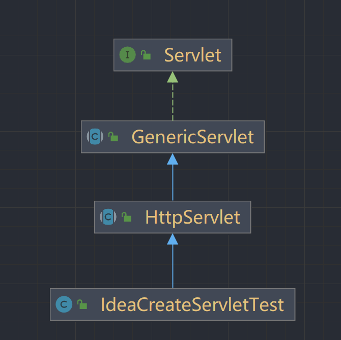

# 一. HTML

## 1.1 B/S软件的结构

Javase C/S结构 Client Server客户端-----&gt;服务器

B/S结构 Brower Server结构 浏览器-----&gt;服务器

## 1.2 前端的开发流程

美术实现----------------------------------------------&gt;	前端工程师-------------------------------------------&gt;	java后台

网页设计师根据需求设计网页    			前端工程师将设计做成静态页面    			后台工程师将静态网页修改为动态网页

## 1.3 网页的组成部分

页面由三部分内容组成！

- 内容：是我们在页面中可以看到的数据，我们称之为内容，一般内容使用<font color='#66ccff'>html技术</font>来展示。 
- 表现：指这些内容在页面上的展示形式。比如：布局，颜色，大小等等。一般使用<font color='#66ccff'>css技术</font>实现 
- 行为：指的是页面中元素与输入设备交互的响应，一般使用<font color='#66ccff'>javascript技术</font>实现。

## 1.4 HTML简介

`Hyper Text Markup Language`（超文本标记语言）

通过标签来标记要显示的网页中的各个部分，网页文件本身是一种文本文件， 通过在文本文件中添加标记符，可以告诉浏览器如何显示其中的内容（如：文字如何处理，画面如何安排，图片如何显示等）

## 1.5 创建HTML文件

1. 创建一个web工程 
2. 在工程下创建HTML页面

## 1.6 HTML文件的书写规范

```html
<!DOCTYPE html><!--约束，说明-->
<html lang="zh_CN"><!--html标签表示html的开始 lang="zh_CN"表示中午
                   html标签中一般分为两个部分，分别是head和boby
                   -->
    <head><!--表示头部信息，一般包含三个部分内容：title标签，css样式，js代码-->
        <meta charset="UTF-8"><!--表示当前页面使用utf-8字符集-->
        <title>页面主题内容</title><!--表示页面标题-->
    </head>
    <body><!--boby标签是整个html页面显示的主体内容-->
        hello
    </body>
</html>
```

注释：`<!-- -->`

## 1.7 HTML标签介绍

1. 标签的格式： <标签名>封装的数据</标签名>  

2. 标签名==大小写不敏感==  

3.  标签拥有自己的属性 
    
    * 基本属性: `bgcolor=“red”` 可以修改简单的样式效果 

    * 事件属性: `οnclick=“alert(‘你好！’);”`  可以直接设置事件响应后的代码 
    
6.  标签又分为，单标签和双标签 

  6. 单标签格式：&lt;标签名 /&gt; 
      水平线 换行 
      
  6. 双标签格式：&lt;标签名&gt;…封装数据…&lt;标签名/&gt; 


**标签的语法**

```html
<!DOCTYPE html>
<html lang="en">
<head>
    <meta charset="UTF-8">
    <title>0-标签语法.html</title>
</head>
<body>
	<!--标签不能交叉嵌套-->
	正确：<div><span>早安，尚硅谷</span></div>
	错误：<div><span>早安，尚硅谷</div></span>
	<hr/>
	<!--标签必须正确关闭(闭合)-->
	<!--1 有文本内容的标签-->
	正确：<div>早安，尚硅谷</div>
	错误：<div>早安，尚硅谷
	<hr/>
	<!--2 没有文本内容的标签-->
	正确：<br/>
	错误：<br>
	<hr/>
	<!--属性必须有值，属性值必须加引号-->
	正确：<font color="#00bfff">早安，尚硅谷</font>
	错误：<font color=#00bfff>早安，尚硅谷</font>
	错误：<font color>早安，尚硅谷</font>
	<hr/>
    <!--注释不能嵌套-->
    正确：<!--注释内容--><br/>
    错误：<!--注释内容<!--注释内容-->-->
</body>
</html>
```

## 1.8 常用标签介绍

### 1.8.1 font字体标签

* `font标签`是字体标签，它可以修改文本的字体，颜色，大小（尺寸）
  * `color属性`修改颜色
    `face属性`修改字体
    `size属性`修改大小

**在网页上显示，我是字体标签，并修改字体为宋体，颜色为红色。**

```html
<!DOCTYPE html>
<html lang="en">
<head>
    <meta charset="UTF-8">
    <title>1-font标签.html</title>
</head>
<body>
    <!--字体标签
        需求：在网页上显示，我是字体标签，并修改字体为宋体，颜色为红色
    -->
<font color="red" face="宋体" size="7">我是字体标签</font>
</body>
</html>
```

### 1.8.2 特殊字符

```html
常用的特殊字符：
    <    &lt;
    >    &gt;
    空格  &nbsp;
```

**把换行标签变成文本转换成字符显示在页面上**

```html
<!DOCTYPE html>
<html lang="en">
<head>
    <meta charset="UTF-8">
    <title>2-特殊字符.html</title>
</head>
<body>
    <!--特殊字符
    需求1：把<br>换行标签变成文本转换成字符显示在页面上
    -->
我是<br>标签
我是&it;br&gt;标签<br/>

</body>
</html>
```

### 1.8.3 标题标签

标题标签是h1到h6

**显示标题1到标题6**

```html
<!DOCTYPE html>
<html lang="en">
<head>
    <meta charset="UTF-8">
    <title>3-标题标签</title>
</head>
<body>
<!--
	标签标题
    需求1：演示标题1到标题6的
    h1-h6都是标题标签
    h1 最大
    h6 最小
    align：属性是对其属性
    left     左对齐：默认
    right    右对齐
    center              
-->
<h1 align="left">标题1</h1>
<h2 align="center">标题2</h2>
<h3 align="right">标题3</h3>
<h4>标题4</h4>
<h5>标题5</h5>
<h6>标题6</h6>
</body>
</html>
```

### 1.8.4 超链接

在网页中所有点击之后可以跳转的内容都是超链接

标签

**需求：普通的超链接**

```html
<!DOCTYPE html>
<html lang="en">
<head>
    <meta charset="UTF-8">
    <title>4-超链接</title>
</head>
<body>
<!--
    a标签是：超链接
    href属性设置链接的地址
    target属性设置那个目标进行跳转
        _self        表示当前页面（默认）
        _blank       表示打开新页面来进行跳转
-->
<a href="http://www.baidu.com">百度</a>
<a href="http://www.baidu.com" target="_self">百度</a>
<a href="http://www.baidu.com" target="_blank">百度</a>
</body>
</html>
```

### 1.8.5 列表标签

* `ul`是无序列表
  * `type属性`可以修改列表项前面的符号
  * `li标签`是列表项
* `ol`是有序列表

**需求：使用无序列表方式，把四大天王，刘德华，郭富城，黎明，张学友，展示出来**

```html
<!DOCTYPE html>
<html lang="en">
<head>
    <meta charset="UTF-8">
    <title>9-列表</title>
</head>
<body>

<!--
    需求：使用无序，列表方式，把四大天王，刘德华，郭富城，黎明，张学友，展示出来
    ul是无序列表
        type属性可以修改列表项前面的符号
		li是列表项
    ol是有序列表
-->
<ul>
    <li type="none">赵四</li>
    <li>宋小宝</li>
    <li>小沈阳</li>
    <li>刘能</li>
</ul>
<ol>
    <li>赵四</li>
    <li>宋小宝</li>
    <li>小沈阳</li>
    <li>刘能</li>
</ol>
</body>
</html>
```

### 1.8.6 img标签

img标签可以在html页面上显示图片

* img标签是图片标签，用来显示图片
  * `src属性`可以设置图片的路径
    `width属性`可以设置图片的宽度
    `height属性`可以设置图片的高度
    `border属性`可以设置图片的边框大小
    `alt属性`设置当指定路径找不到图片时，用来替代显示的==文本内容==

* 在javase中路径也分为相对路径和绝对路径
  * 相对路径：从工程名开始算
    * `.`:  表示当前文件坐在的目录
      `..`: 表示当前文件所在的上一级目录
      文件名       表示当前文件所在目录的文件，相当于  ./文件名    ./可以省略
  * 绝对路径：盘符：/目录/文件名
    * 正确格式是：http://ip:prot/工程名/资源路径
      错误格式是：盘符:/目录/文件名

**需求：使用img标签显示一张照片。并修改宽高和边框属性**

```html
<!DOCTYPE html>
<html lang="en">
<head>
    <meta charset="UTF-8">
    <title>5-img标签</title>
</head>
<body>

<!--
    需求：使用img标签显示一张照片。并修改宽高和边框属性
-->

</body>
</html>
```

### 1.8.7 表格标签

* table标签是表格标签
* `border`   设置表格标签
  `width`    设置表格宽度
  `height`   设置表格高度
  `align`    设置表格相对于页面的对齐方式(right/left/center)
  `cellspacing` 设置单元格之间的间距

* `tr`   是行标签
  `th`   是表头标签
  `td`   是单元格标签
* `b`标签是加粗标签

**需求1：做一个带表头的，三行，三列的表格，并显示边框**

```html
<!DOCTYPE html>
<html lang="en">
<head>
    <meta charset="UTF-8">
    <title>6-表格标签</title>
</head>
<body>
<!--
    需求1：做一个带表头的，三行，三列的表格，并显示边框
    需求2：修改表格的宽度，高度，表格的对齐方式，单元格间距

        table标签是表格标签
            border   设置表格标签
            width    设置表格宽度
            height   设置表格高度
        tr   是行标签
        th   是表头标签
        td   是单元格标签
            align     设置单元格文本对齐方式
        b标签是加粗标签
-->
<table border="1" width="300" height="300">
    <tr>
        <td align="center"><b>1.1</b></td>
        <td align="center"><b>1.2</b></td>
        <th>1.3</th>
    </tr>
    <tr>
        <td>2.1</td>
        <td>2.2</td>
        <td>2.3</td>
    </tr>
    <tr>
        <td>3.1</td>
        <td>3.2</td>
        <td>3.3</td>
    </tr>
</table>

</body>
</html>
```

**需求2：修改表格的宽度，高度，表格的对齐方式，单元格间距**

```html
<!DOCTYPE html>
<html lang="en">
<head>
    <meta charset="UTF-8">
    <title>6-表格标签</title>
</head>
<body>
<!--
    需求1：做一个带表头的，三行，三列的表格，并显示边框
    需求2：修改表格的宽度，高度，表格的对齐方式，单元格间距
-->
<table align="center" border="1" width="300" height="300" cellspacing="0">
    <tr>
        <td align="center"><b>1.1</b></td>
        <td align="center"><b>1.2</b></td>
        <th>1.3</th>
    </tr>
    <tr>
        <td>2.1</td>
        <td>2.2</td>
        <td>2.3</td>
    </tr>
    <tr>
        <td>3.1</td>
        <td>3.2</td>
        <td>3.3</td>
    </tr>
</table>

</body>
</html>
```

### 1.8.8 跨行跨列表格

* `colspan` / `rowspan`: <font color='green'>span:跨越</font>

```html
<!DOCTYPE html>
<html lang="en">
<head>
    <meta charset="UTF-8">
    <title>7-表格跨行跨列</title>
</head>
<body>
<!--
    需求：新建一个五行五列的表格，
    第一行，第一列的单元格要跨两列，
    第二行第一列的单元格跨两行，
    第四行第四列的单元格跨两行两列
-->

<table width="500" height="500" cellspacing="0" border="1">
    <tr>
        <td colspan="2">1.1</td>
        <td>1.3</td>
        <td>1.4</td>
        <td>1.5</td>
    </tr>
    <tr>
        <td rowspan="2">2.1</td>
        <td>2.2</td>
        <td>2.3</td>
        <td>2.4</td>
        <td>2.5</td>
    </tr>
    <tr>
        <td>3.2</td>
        <td>3.3</td>
        <td>3.4</td>
        <td>3.5</td>
    </tr>
    <tr>
        <td>4.1</td>
        <td>4.2</td>
        <td>4.3</td>
        <td rowspan="2" colspan="2">4.4</td>
    </tr>
    <tr>
        <td>5.1</td>
        <td>5.2</td>
        <td>5.3</td>
    </tr>
</table>
</body>
</html>
```

### 1.8.9 了解iframe框架标签（内嵌窗口）

iframe标签可以在一个html页面上，打开一个窗口，去加载一个单独的页面

* iframe标签可以在页面上开辟一个小区域显示一个单独的页面
* iframe和a标签组合使用的步骤：
  1. 在iframe标签中使用name属性定义一个名称
  2. 在a标签的target属性上设置iframe的name的属性值

* iframe标签不是单闭合标签

```html
<!DOCTYPE html>
<html lang="en" xmlns="http://www.w3.org/1999/html">
<head>
    <meta charset="UTF-8">
    <title>8-iframe标签</title>
</head>
<body>
    
我是一个单独完整的页面
<br/>

<iframe src="1-font标签.html" width="500" height="600" name="abc"></iframe>
<br/>
    <ul>
        <li><a href="1-font标签.html" target="abc">1-font标签.html</a></li>
        <li><a href="2-特殊字符.html" target="abc">2-特殊字符.html</a></li>
        <li><a href="3-标题标签.html" target="abc">3-标题标签.html</a></li>
    </ul>

</body>
</html>
```

### 1.8.10 表单标签

1. 什么是表单？
   * 表单html页面中，用来收集用户信息的所有元素集合，然后把这些信息发送给服务器。

2. `form标签`就是表单标签

   * action属性设置提交的==服务器地址==
   * method属性设置提交的方式`GET（默认值）`或`post`

   * 表单提交的时候，数据没有发送给服务器的三种情况：

     1. 表单项没有name属性

     2. 单选 复选 下拉列表中的option标签，都要==添加value属性==，以便发给服务器

     3. 表单项不在提交的form标签中

        ```html
        https://www.baidu.com/
        ?
        action=login
        sex=on
        admin=admin
        ```

   * **get请求**的特点是：
     
     1. 浏览器地址栏中的地址是：action属性[+?+请求参数]
        参数格式是：name=value&name=value
     2. 不安全
     3. 数据长度的限制
   * **post请求**的特点是：
     
     * 浏览器地址栏中只有action属性值
     * 相对于get请求要安全
     * 理论上没有数据长度的限制

3. 框

   * `input type="text"`:  是==文件输入框==
     * 其中`name属性`必须指定, 否则数据不会发送到服务器
   * `input type="password"`: 是==密码输入框==
   * `input type="radio"`: 	是==单选框== 
     * `name属性`可以对其进行分组
   * `input type="checkbox`: 是==复选框==
     * `checked="checked"` 表示默认选中
   * `textarea` 表示==多行文本输入框==（起始标签和结束标签中间的内容是默认值）
     * `rows 属性`设置可以显示几行的高度
       `cols 属性`设置每行可以显示几个字符宽度

4. 按钮

   * `input type="reset"`:  	是==重置按钮==
     * `value属性`修改按钮上的文本
   * `input type="submit"`: 	是==提交按钮==
     * `value属性`修改按钮上的文本
   * `input type="button"`: 	是==按钮==
     * `value属性`修改按钮上的文本

5. 文件上传

   * `input type="file"`:	是==文件上传域==

6. 隐藏域

   * `input type="hidden"`: 	是==隐藏域==
     * 我们要发送某些信息，不需要用户参与，就可以使用隐藏域（提交的时候同时发给服务器）

7. 下拉列表框

   * `select标签`是==下拉列表框==
   * `option标签`是下拉列表框中的选项，可以设置`selected="selected"`设置默认选中

**需求：创建一个个人信息注册的表单界面。** **包含用户名，密码，确认密码。性别（单选框）** **兴趣爱好（多选框），国籍（下拉列表）。** **隐藏域，自我评价（多行文本域。重置，提交）**

```html
<!DOCTYPE html>
<html lang="en">
<head>
    <meta charset="UTF-8">
    <title>Title</title>
</head>
<body>
 
<!--
    需求：创建一个个人信息注册的表单界面。
    包含用户名，密码，确认密码。性别（单选框）
    兴趣爱好（多选框），国籍（下拉列表）。
    隐藏域，自我评价（多行文本域。重置，提交）
-->
<form>
    用户名称：<input type="text" value="默认值"/><br/>
    用户密码：<input type="password" value="123456"/><br/>
    确认密码：<input type="password" value="123456"/><br/>
    性别：<input type="radio" name="sex" checked="checked">男<input type="radio" name="sex">女<br/>
    兴趣爱好：<input type="checkbox" checked="checked"/>java<input type="checkbox"/>C<input type="checkbox"/>C++
            <input type="checkbox"/>Python<br/>
    国籍：<select>
            <option>---请选择国籍---</option>
            <option selected="selected">中国</option>
            <option>小日本</option>
            <option>棒子国</option>
         </select><br/>
    自我评价：<br/><textarea rows="10" cols="20">默认值</textarea>
    <input type="reset"/>
    <input type="submit"/>
    <input type="hidden" name="admin" value="admin" />
</form>
</body>
</html>
```

居中显示

```html
<!DOCTYPE html>
<html lang="en">
<head>
    <meta charset="UTF-8">
    <title>Title</title>
</head>
<body>

<!--
    需求：创建一个个人信息注册的表单界面。
    包含用户名，密码，确认密码。性别（单选框）
    兴趣爱好（多选框），国籍（下拉列表）。
    隐藏域，自我评价（多行文本域。重置，提交）
-->
<!--
    form标签就是表单
    input type="text"       是文件输入框
    input type="password"   是密码输入框
    input type="radio"      是单选框 name属性可以对其进行分组 checked="checked"表示默认选中
    input type="checkbox    是复选框    checked="checked" 表示默认选中
    input type="reset"      是重置按钮  value属性修改按钮上的文本
    input type="submit"     是提交按钮  value属性修改按钮上的文本
    input type="button"     是按钮     value属性修改按钮上的文本
    input type="file"       是文件上传域
    input type="hidden"     是隐藏域    我们要发送某些信息，不需要用户参与，就可以使用隐藏域（提交的时候同时发给服务器）

    select标签是下拉列表框
        option标签是下拉列表框中的选项，可以设置selected="selected"设置默认选中

    textarea 表示多行文本输入（起始标签和结束标签中间的内容是默认值）
        rows 属性设置可以显示几行的高度
        cols 属性设置每行可以显示几个字符宽度

-->
<form>
    <h1 align="center">用户注册</h1>
    <table align="center">
        <tr>
            <td>用户名称：</td>
            <td><input type="text" value="默认值"/></td>
        </tr>
        <tr>
            <td>用户密码：</td>
            <td><input type="password" value="123456"/></td>
        </tr>
        <tr>
            <td>确认密码：</td>
            <td><input type="password" value="123456"/></td>
        </tr>
        <tr>
            <td>性别：</td>
            <td>
                <input type="radio" name="sex" checked="checked">男
                <input type="radio" name="sex">女
            </td>
        </tr>
        <tr>
            <td>兴趣爱好：</td>
            <td>
                <input type="checkbox" checked="checked"/>java
                <input type="checkbox"/>C
                <input type="checkbox"/>C++
                <input type="checkbox"/>Python
            </td>
        </tr>
        <tr>
            <td>国籍：</td>
            <td>
                <select>
                    <option>---请选择国籍---</option>
                    <option selected="selected">中国</option>
                    <option>小日本</option>
                    <option>棒子国</option>
                </select>
            </td>
        </tr>
        <tr>
            <td>自我评价：</td>
            <td><textarea rows="10" cols="20">默认值</textarea></td>
        </tr>
        <tr>
            <td align="center"><input type="reset"/></td>
            <td align="center"><input type="submit"/></td>
            <td><input type="hidden" name="admin" value="admin"/></td>
        </tr>
    </table>
</form>
</body>
</html>
```

**表单提交细节**

```html
<!DOCTYPE html>
<html lang="en">
<head>
    <meta charset="UTF-8">
    <title>Title</title>
</head>
<body>
<!--
    form标签是表单标签
        action属性设置提交的服务器地址
        method属性设置提交的方式GET（默认值）或post

        表单提交的时候，数据没有发送给服务器的三种情况：
            1 表单项没有name属性
            2 单选 复选 下拉列表中的option标签，都要添加value属性，以便发给服务器
            3 表单项不在提交的form标签中
        https://www.baidu.com/
        ?
        action=login
        sex=on
        admin=admin

        get请求的特点是：
            1 浏览器地址栏中的地址是：action属性[+?+请求参数]
                参数格式是：name=value&name=value
            2 不安全
            3 数据长度的限制
        post请求的特点是：
            1 浏览器地址栏中只有action属性值
            2 相对于get请求要安全
            3 理论上没有数据长度的限制
-->
<form action="http://www.baidu.com" method="get">
    <input type="hidden" name="action" value="login">
    <h1 align="center">用户注册</h1>
    <table align="center">
        <tr>
            <td>用户名称：</td>
            <td><input name="username" type="text" value="默认值"/></td>
        </tr>
        <tr>
            <td>用户密码：</td>
            <td><input name="password" type="password" value="123456"/></td>
        </tr>
        <tr>
            <td>确认密码：</td>
            <td><input name="password2" type="password" value="123456"/></td>
        </tr>
        <tr>
            <td>性别：</td>
            <td>
                <input type="radio" name="sex" value="boy" checked="checked">男
                <input type="radio" name="sex" value="girl">女
            </td>
        </tr>
        <tr>
            <td>兴趣爱好：</td>
            <td>
                <input name="hobby" value="java" type="checkbox" checked="checked"/>java
                <input name="hobby" value="c" type="checkbox"/>C
                <input name="hobby" value="c++" type="checkbox"/>C++
                <input name="hobby" value="python" type="checkbox"/>Python
            </td>
        </tr>
        <tr>
            <td>国籍：</td>
            <td>
                <select name="country">
                    <option value="null">---请选择国籍---</option>
                    <option value="cn" selected="selected">中国</option>
                    <option value="jp">小日本</option>
                    <option value="kr">棒子国</option>
                </select>
            </td>
        </tr>
        <tr>
            <td>自我评价：</td>
            <td><textarea name="desc" rows="10" cols="20">默认值</textarea></td>
        </tr>
        <tr>
            <td align="center"><input type="reset"/></td>
            <td align="center"><input type="submit"/></td>
            <td><input type="hidden" name="admin" value="admin"/></td>
        </tr>
    </table>
</form>
</body>
</html>
```

### 1.8.11 其他标签

div标签：默认独占一行
span标签：它的长度是封装主句的长度
p标签：段落标签  默认会在段落上方或下方各空出一行（如果已有就不再空）

```html
<!DOCTYPE html>
<html lang="en">
<head>
    <meta charset="UTF-8">
    <title>Title</title>
</head>
<body>
<!--div\span\p标签-->
<!--
div标签：默认独占一行
span标签：它的长度是封装主句的长度
p标签：段落标签  默认会在段落上方或下方各空出一行（如果已有就不再空）
-->
<div>div标签1</div>
<div>div标签2</div>
<span>span标签1</span>
<span>span标签2</span>
<p>p标签1</p>
<p>p标签2</p>
</body>
</html>
```

# 二. CSS

## 2.1 CSS语言介绍

CSS是用于（增强）网页样式并允许将样式信息与网页内容分离的一种标记性语言。

## 2.2 CSS的语法规则


选择器：浏览器根据"选择器"决定CSS样式影响的HTML元素（标签）

属性：是你要改变的样式名，并且每个属性都有一个值。属性和值被冒号分开，并由花括号包围，这样就组成了一个完整的声明，例如：p{color:bule}

多个声明：如果要定义不止一个声明，则需要用分号将声明分开。虽然最后一条声明的最后可以不用加分号（但尽量在每条声明的末尾都加上分号）

例如：

```css
p{ /*表示所有的p标签都遵循以下规则*/
<!-- -->

color:red;

font-size:30px;

}
```

一般每行只描述一个属性

CSS：注释：/**/

## 2.3 CSS和HTML的结合方式

### 2.3.1 第一种 嵌入样式表

 在标签的style属性上设置"key:value value",修改标签样式。

**需求：分别定义两个div span标签，分别修改每个div标签的样式：边框1个像素，实线，红色**

```html
<!DOCTYPE html>
<html lang="en">
<head>
    <meta charset="UTF-8">
    <title>Title</title>
</head>
<body>
<div style="border: 1px solid red">div标签1</div>
<div style="border: 1px solid red">div标签2</div>
<span style="border: 1px solid red">span标签1</span>
<span style="border: 1px solid red">span标签2</span>
</body>
</html>
```

这种代码方式存在问题：

1 代码量太多而且大部分都是重复代码

2 可读性差

3 CSS代码没有复用性

### 2.3.2 第二种 内部样式表

在head标签中，使用style标签来定义各种自己需要的css样式

格式如下：

```html
xxx{ 
<!-- -->
 key : value value;

```

```html
<!DOCTYPE html>
<html lang="en">
<head>
    <meta charset="UTF-8">
    <title>Title</title>
    <!--style标签专门用来定义css样式代码-->
    <style type="text/css">
        div{
     
            border: 1px solid rosybrown;
        }
        span{
     
            border: 1px solid rosybrown;
        }
    </style>
</head>
<body>
<div>div标签1</div>
<div>div标签2</div>
<span>span标签1</span>
<span>span标签2</span>
</body>
</html>
```

存在问题：这种方式存在的缺点

 1 只能在统一页面内服用代码，不嫩恶搞在多个页面中复用css代码

 2 维护起来不方便，实际的项目中会有成千上万的页面，要到每个页面中去修改，工作量太大了。

### 2.3.3 第三种 外部样式表

把css样式写成一个单独的css文件，再通过`link标签`引入即可复用。

使用html的标签导入css样式文件

## 2.4 CSS选择器

### 2.4.1 标签名选择器

标签名选择器的格式是：

```html
标签名{ 
<!-- -->
 属性：值；
}
```

标签名选择器，可以决定哪些标签被动的使用这个样式。

```html
<!DOCTYPE html>
<html lang="en">
<head>
    <meta charset="UTF-8">
    <title>2-标签名选择器</title>
</head>
<style type="text/css">
    div{
     
        border: 1px solid yellow;
        color: blue;
        font-size: 30px;
    }
    span{
     
        border: 5px dashed blue;
        color:yellow;
        font-size: 20px;
    }
</style>
<body>
<!--
    需求：在所有div标签上修改字体颜色为蓝色，字体大小30个像素，边框为1像素黄色实线
    并且修改所有span标签的字体颜色为黄色，字体大小20个像素，边框为5像素蓝色虚线。
-->
<div>div标签1</div>
<div>div标签2</div>
<span>span标签1</span>
<span>span标签2</span>
</body>
</html>
```

### 2.4.2 id选择器

id选择器的格式是：

```html
#id属性值{ 
<!-- -->
 属性：值;
}
```

id选择器，可以让我们通过==id属性==选择性的去使用这个样式。

需求1：分别定义两个div标签。

第一个id为id001,然后根据id属性定义css样式修改字体颜色为蓝色，字体大小为30像素。边框为1像素黄色实线。

第二个div标签id为id002，然后根据id属性定义css样式修改的字体颜色为红色，字体大小20个像素。边框为5像素蓝色点线。

```html
<!DOCTYPE html>
<html lang="en">
<head>
    <meta charset="UTF-8">
    <title>id选择器</title>
    <style type="text/css">
        #id001{
     
            color:blue;
            font-size: 30px;
            border: 1px yellow solid;
        }
        #id002{
     
            color:red;
            font-size: 20px;
            border: 5px blue dotted;
        }
    </style>
</head>
<body>
<div id="id001">div标签1</div>
<div id="id002">div标签2</div>
</body>
</html>
```

### 2.4.3 class选择器（类选择器）

class类型选择器的格式是：

```html
.class 属性值{ 
<!-- -->
 属性: 值;
}
```

class类型选择器，可以通过class属性有效的选择性的去使用这个样式。

需求1：修改class属性值为class01de span或div标签，字体颜色为蓝色，字体大小为30个像素。边框为1像素黄色实线。

需求2：修改class属性值为class02的div标签，字体颜色为灰色，字体大小26个像素。边框为1像素红实线。

```html
<!DOCTYPE html>
<html lang="en">
<head>
    <meta charset="UTF-8">
    <title>类选择器</title>
    <!--
    需求1：修改class属性值为class01的span或div标签，字体颜色为蓝色，字体大小为30个像素。边框为1像素黄色实线。

    需求2：修改class属性值为class02的div标签，字体颜色为灰色，字体大小26个像素。边框为1像素红实线。
    -->
    <style type="text/css">
        .class01{
            border: 1px yellow solid;
            color: blue;
            font-size: 30px;
        }
        .class02{
            color: gray;
            font-size: 26px;
            border: 1px red solid;
        }
    </style>
</head>
<body>
<div class="class01">div标签1</div>
<div class="class02">div标签2</div>
<span class="class01">span标签1</span>
<span class="class02">span标签2</span>
</body>
</html>
```

### 2.4.4 组合选择器

1. 包含选择器
   * 包含选择器通过空格标识符来实现
   
   * 例如：

        ```html
        <div id="header">
        <p>文本一</p>
        </div>
        <div id="main">
        <p>文本二</p>
        </div>
        #header p{
        fontsize:12px;
        }
        #main p{
        fontsize:12px;
        }
        ```

		即设置header和main里<p>标签像素大小为12

2. 子选择器

   * 子选择器是指定==父元素所包含的子元素==，子选择器使用">"表示

   * 例如：

     ```html
     div>span{
     ......
     font-size:24px;
     }
     ```

     即包含在div元素里的子元素span字体大小都定义为24像素。

3. 相邻选择器

   * 相邻选择器通过“+”分隔符定义，即两个标签==必须是规定给的顺序关系==，否则无法实现

   * 例如：

     ```html
     p+h3{
     ......
     background-color：#0099FF；}
     ```

     即在<p>标签之后的一个<h3>标签背景设置为蓝色。

4. 兄弟选择器

   * 通过“~”分隔符定义，能够选择前置元素后同级的所有匹配元素

   * 例如：

     ```html
     p~h3{
     background-color:#0099FF;
     .......}
     
     <h3>文本一</h3>
     <p>文本二</p>
     <h3>文本三</h3>
     ```

​				即<p>之后的所有h3背景色都改为蓝色。

5. 分组选择器

   * 分组选择器通过“，”分隔符定义，通过分组选择器可以实现==集体声明==，将一致的CSS样式放在一起。

   * 例如

     ```html
     h1,h2,h3{
     background-color:#0099FF;
     .......}
     ```

     即将h1,h2,h3标签的背景都设置为蓝色。

     ```html
     <!DOCTYPE html>
     <html lang="en">
     <head>
         <meta charset="UTF-8">
         <title>组合选择器</title>
         <style type="text/css">
             .class01, #id01{
                 color: blue;
                 font-size: 20px;
                 border: 1px yellow solid;
             }
         </style>
     </head>
     <body>
     <!--
         需求：修改class="class01"的div标签和id="id01"所有的span标签
         字体为蓝色，字体大小20个像素，边框为1像素黄色实线。
     -->
     <div class="class01">div标签1</div>
     <div id="id01">div标签1</div>
     <span class="class01">span标签1</span>
     <span id="id01">span标签2</span>
     </body>
     </html>
     ```

     

## 2.5 其他常用样式

1.  字体颜色: `color`  
2.  宽度 `width:`  
3.  高度 `height:`  
4.  背景颜色 `background:`  
5.  字体样式: `font-size`  
6.  div居中： `margin-left:auto`; `matgin-right:auto`;  
7.  边框: `border`  
8.  文本居中： `text-align:center`  
9.  超链接去下划线： `text-decoration:none`  
10.  表格细线: 
     * `border: 1px black solid;`设置边框
     * `border-collapse: collapse;`将边框合并  
11.  ul无序列表去除符号: `list-style: none;` 


#  三. JavaScript

## 3.1 JavaScript介绍

* javaScript语言诞生主要是完成页面的数据验证，因此，它运行在客户端，需要运行浏览器来解析执行JavaScript代码。

* JS是弱类型: 类型可变

  ```javascript
  var i;
  i=12; 数值型
  i=‘abc’; 字符串类型
  ```

  java是强类型: 定义变量的时候，类型已确定，而且不可变 `int i = 12;`

* JavaScript特点：
  1. 交互性（它可以做的就是信息的动态交互）； 
  1. 安全性（不允许直接访问本地硬盘） 
  1. 跨平台性（只要是可以解释JS的浏览器都可以执行，和平台无关）


## 3.2 JavaScript和html代码的结合方式

### 3.2.1 第一种方式

JavaScript代码在页面执行的时候执行

```html
<!DOCTYPE html>
<html lang="en">
<head>
    <meta charset="UTF-8">
    <title>hello,javaScript</title>
    <script type="text/javascript">
        //alert是JavaScript语言提供的一个警告框函数
        //它可以接受任意类型的参数，这个参数就是警告框的提示信息
        alert("hello javaScript!");
    </script>
</head>
<body>
</body>
</html>
```

### 3.2.2 第二种方式

使用`script标签` 引入，单独的JavavaScript代码文件

```html
<!DOCTYPE html>
<html lang="en">
<head>
    <meta charset="UTF-8">
    <title>Title</title>
    <!--
        现在需要使用script引入外部的js文件来执行
        src属性专门用来引入js文件路径（可以是相对路径，也可以是绝对路径）

        script标签可以用来定义js代码也可以用来引用js文件
        但是，两个功能二选一使用。不能同时使用两个功能
        即：不能再一个script标签里面又引用文件又写代码
    -->
    <script type="text/javascript" src="1.js"></script>
    <script type="text/javascript">
        alert("helloscript!");
    </script>
</head>
<body>

</body>
</html>
```

## 3.3 变量

1. 什么是变量？
   * 变量是可以存放某些值的内存的命名

2. javaScript的变量类型：

   - <font color='#66ccff'>数值类型number</font> : JavaScript 不区分整数和小数

   - <font color='#66ccff'>字符串类型 String</font> : JavaScript 不区分字符和字符串

   - <font color='#66ccff'>对象类型 object</font> : 

   - <font color='#66ccff'>布尔类型 boolean</font> : true/false

     - JavaScript中, 其他类型和布尔类型的自动转换

       true: 非零的数值, 非空字符串, 非空对象

       false: 零, 空字符串, null, undefined


   - <font color='#66ccff'>函数类型 function</font>


3. JavaScript里特殊的值：

   - <font color='#66ccff'>undefined 未定义</font>：所有js变量未赋予初值的时候，默认值都是undefined 

   - <font color='#66ccff'>null 空值 </font>

   - <font color='#66ccff'>NaN (Not a Number)</font>：非数字，非数值。


4. JS中的定义变量格式：

   - `var 变量名；` 

   - `var 变量名 = 值；`


```html
<!DOCTYPE html>
<html lang="en">
<head>
    <meta charset="UTF-8">
    <title>变量</title>
    <script type="text/javascript">
      var i;
      alert(typeof (i));//undefined
      i = 12;
      //typeof是javaScript提供的返回变量类型的函数
      alert(typeof (i));//number
      i="abc";
      //它可以取变量的数据类型返回
      alert(typeof (i));//String

      var a = 12;
      var b = "abc";

      alert(a*b);//NaN
    </script>
</head>
<body>

</body>
</html>
```

## 3.4 关系（比较）运算

- `>` `>=` `<` `<=` `!=` 

- 等于：== 是简单的做字面值的比较

- 全等于：=== 除了做字面值的比较之外还会比较两个变量的数据类型

- 例

  ```html
  <!DOCTYPE html>
  <html lang="en">
  <head>
      <meta charset="UTF-8">
      <title>关系运算</title>
      <script type="text/javascript">
           var a = 12;
           var b = "12";
  
           alert(a==b);//true
  
           alert(a===b);//false
      </script>
  </head>
  <body>
  
  </body>
  </html>
  ```

  

## 3.5 逻辑运算

- 且运算：&amp;&amp;

- 或运算：||
- 取反：！

- 在javaScript语言中左右的变量，都可以作为一个boolean类型的变量去使用
  - 0,null,undefined,""（空串）都认为是false;
    ```html
    <!DOCTYPE html>
    <html lang="en">
    <head>
        <meta charset="UTF-8">
        <title>逻辑运算</title>
        <script type="text/javascript">
            var a = 0;
            if(a){
                alert("零为真");
            }else{
                alert("零为假");
            }
    
            var b = null;
            if(b){
                alert("null为真");
            }else{
                alert("null为假");
            }
            var c = undefined;
            if(c){
                alert("undefined为真");
            }else{
                alert("undefined为假");
            }
    
            var d = "";
            if(d){
                alert("空串为真");
            }else{
                alert("空串为假");
            }
    
        </script>
    </head>
    <body>
    
    </body>
    </html>
    ```

- &amp;&amp;且运算。
  1. 当表达式全为真的时候。返回==最后一个表达式==的值 
  1. 当表达式中有一个为假的时候，返回==第一个为假的表达式的值==

- ||或运算
  1. 当表达式全为假的时候，返回最后一个表达式的值 
  2. 只要有一个表达式为真，就会返回第一个为真的表达式的值

- 并且&amp;&amp;与运算和||或运算有<font color='#66ccff'>短路</font>
  - 短路:当这两个运算有结果了之后，后面的表达式就不再执行<font color='orange'>(并不是什么新东西)</font>

## 3.6 数组

### 3.6.1 数组定义方式

- js中数组的定义：

  ```js
  var 数组名 = []; //空数组
  var 数组名 = [1,‘abc’,true]; //定义数组同时赋值元素
  ```

    ```html
    <!DOCTYPE html>
    <html lang="en">
    <head>
        <meta charset="UTF-8">
        <title>数组</title>
        <script type="text/javascript">
            var arr = [];//定义一个空数组
  
            arr[0] = 12;
            alert(arr.length);//数组长度是1
  
            //javaScript语言中的数组，只要我们通过数组下标赋值，那么最大的下标值就会自动的给数组做扩容操作。
            arr[2] = "abc";
            alert(arr.length);//数组长度是3
  
            alert(arr[1]);//值为undefined
  
            //数组的遍历
            for(var i = 0; i<arr.length;i++){
  
                alert(arr[i]);
            }
        </script>
    </head>
    <body>
  
    </body>
    </html>
    ```

## 3.7 函数

### 3.7.1 函数的第一种定义方式

- **可以使用function关键字来定义**

- 格式：**在js不用指明参数类型，因为js中参数类型统一为var指明了也没有用。**

    ```javascript
    function 函数名（参数名称）{ 
    <!-- -->
     函数体；
    }
    ```

- 在javaScript语言中，如何认定带有返回值的函数？只要在函数体中直接使用return语句返回即可！

    ```html
    <!DOCTYPE html>
    <html lang="en">
    <head>
        <meta charset="UTF-8">
        <title>函数</title>
        <script type="text/javascript">
            //定义一个无参函数
            function fun(){
    
                alert("无参函数fun()被调用");
            }
            //无参函数调用
            fun();
    
            //有参函数
            function fun2(a,b){
    
                alert("a的值为"+a);
                alert("b的值为"+b);
            }
            fun2(2,"abc");
    
            //有返回值函数
            function sum(num1,num2){
    
                return num1+num2;
            }
            sum(3,6);
    
        </script>
    </head>
    <body>
    
    </body>
    </html>
    ```

### 3.7.2 函数的第二种定义格式

- **格式如下：**

    ```javascript
    var 函数名 = function(形参列表){ 
    <!-- -->
     函数体；
    }
    ```

- 例
    ```html
    <!DOCTYPE html>
    <html lang="en">
    <head>
        <meta charset="UTF-8">
        <title>函数</title>
        <script type="text/javascript">
            //无参函数
            var fun1=function (){
    
                alert("无参");
            }
            fun1();
    
            //有参函数
            var fun = function (a,b){
    
                alert(a+b);
            }
            fun(1,2);
    
            //有返回值
            var fun2 = function (num1,num2){
    
                return num1+num2;
            }
            alert(fun2(4,5));
    
        </script>
    </head>
    <body>
    
    </body>
    </html>
    ```

- js不允许函数重载，函数重载会覆盖之前的函数
    ```html
    <!DOCTYPE html>
    <html lang="en">
    <head>
        <meta charset="UTF-8">
        <title>js不允许函数重载</title>
        <script type="text/javascript">
            function fun(){
    
                alert("无参函数！");
            }
    
            function fun(a){
    
                alert("有参函数！a=" + a);
            }
    
            //调用无参函数，但执行的是有参函数，说明重载函数会覆盖
            fun();
        </script>
    </head>
    <body>
    
    </body>
    </html>
    ```

### 3.7.2 隐形参数

在function函数中不需要定义，但却可以直接用来获取所有参数的变量，我们叫他隐形参数。

隐形参数和java的可变长参数类似。可变长参数是一个数组

js中的隐形参数操作类似数组。

```html
<!DOCTYPE html>
<html lang="en">
<head>
    <meta charset="UTF-8">
    <title>隐形参数</title>
</head>
<script type="text/javascript">
    function fun(){
     
        alert(arguments.length);
        for (var i = 0; i < arguments.length; i++) {
            alert(arguments[i]);
        }
        alert("无参函数被传参后接收参数");
    }
    fun(1,"abc",true);

    function sum(sum1,sum2){
        var result = 0;
        for (var i = 0; i < arguments.length; i++) {
            result += arguments[i];
        }
        return result;
    }
    alert(sum(1,1,2,3,4,5,6,7,8,9,10));
</script>
<body>

</body>
</html>
```

## 3.8 JS中的自定义对象

### 3.8.1 Object形式的自定义对象

- 对象的定义：
    ```javascript
    var 变量名 = new Object(); //对象实例（空对象）
     变量名.属性名=值 //定义一个属性
     变量名.函数名 = function(){} //定义一个函数
    ```

- 对象的访问： 变量名.属性/变量名.函数名();
    ```html
    <!DOCTYPE html>
    <html lang="en">
    <head>
        <meta charset="UTF-8">
        <title>自定义对象</title>
        <script type="text/javascript">
            var User = new Object();   //创建一个对象实例
            User.name = "张三";         //定义一个属性并赋值
            User.getName = function (){
    
                alert("姓名：" + this.name);
            }; //定义一个函数
    
            //对象的访问：
            //    变量名.属性/函数名();
            alert(User.name);
            User.getName();
        </script>
    </head>
    <body>
    
    </body>
    </html>
    ```

### 3.8.2 {}花括号形式的自定义对象

对象的定义：

```js
var 变量名 = { //空对象
 属性：值， //定义一个属性
 属性：值， //定义一个属性
 函数名：function（）{}//定义一个函数
};
```

```html
<!DOCTYPE html>
<html lang="en">
<head>
    <meta charset="UTF-8">
    <title>自定义对象</title>
    <script type="text/javascript">
        var User = {
                    //空对象
            name:"张三",            //定义一个属性
            age:20,                //定义属性
            getUser:function (){
     
                alert("姓名：" + this.name + ",性别：" + this.age);
            }  //定义一个函数
        };

        User.getUser();
        alert(User.name);
    </script>
</head>
<body>

</body>
</html>
```

## 3.9 JS中的事件

1. 什么是事件？事件是电脑输入设备与页面进行交互的响应。

2. **常用的事件：**

   - `onload`<font color='#66ccff'>加载完成事件</font>： 页面加载完之后，常用于做页面js代码==初始化==操作 

   - `onclick`<font color='#66ccff'>单击事件</font>： 常用于按钮的==点击==响应操作 

   - `onblur`<font color='#66ccff'>失去焦点事件</font>： 常用于输入框失去焦点后验证其输入内容是否合法。 

   - `onchange`<font color='#66ccff'>内容发生改变事件</font>： 常用于下拉列表和输入框内容发生改变后操作 

   - `onsubmit`<font color='#66ccff'>表单提交事件</font>： 常用于表单提交前，验证所有表单项是否合法。


2. **事件的注册又分为静态注册和动态注册两种：**
   1. 事件的注册: 其实就是告诉浏览器，当事件响应后要执行哪些操作代码，叫事件注册或绑定。
   2. **静态注册事件**：通过html标签的事件属性直接赋予事件响应后的代码，这种方式叫静态注册。
   3. **动态注册事件**：是指先通过js代码得到标签的dom对象，然后再通过dom对象.事件名=function(){}这种形式赋予事件响应后的代码，叫动态注册。
      * 动态注册的基本步骤：
        1. 获取标签对象 
        1. 标签对象.事件名 = function(){}

### 3.9.1 onload加载完成事件

```html
<!DOCTYPE html>
<html lang="en">
<head>
    <meta charset="UTF-8">
    <title>onload事件</title>
    <script type="text/javascript">
        //静态注册onload事件要调用的方法
        function fun(){
            alert("静态注册onload事件");
        }
        //动态注册onload事件
        window.onload = function fun(){
            alert("动态注册onload事件");
        }
    </script>
</head>
<!--<body οnlοad="function fun() {
  alert('静态注册onload事件');
}">-->
<!--<body οnlοad="fun()">-->
<body>
</body>
</html>
```

### 3.9.2 onclick单击事件

**静态注册onclick事件**

```html
<!DOCTYPE html>
<html lang="en">
<head>
    <meta charset="UTF-8">
    <title>点击事件</title>
    <script type="text/javascript">
        function onclickFun() {
     
            alert("静态注册onclick事件");
        }
    </script>
</head>
<body>
<button onclick="onclickFun()">按钮1</button>
</body>
</html>
```

**动态注册onclick事件**

```html
<!DOCTYPE html>
<html lang="en">
<head>
    <meta charset="UTF-8">
    <title>点击事件</title>
    <script type="text/javascript">

        window.onload = function (){
     
            /*
            * 1 获取标签对象
            * document  是JavaScript语言提供的一个对象（文档）
            * get       获取
            * Element   元素(就是标签)
            * By        通过……
            * Id        id属性
            */

            var elementById = document.getElementById("button");
            elementById.onclick = function () {
     
                alert("动态注册onclick事件");
            }
        }
    </script>
</head>
<body>
<button id="button">按钮2</button>
</body>
</html>
```

### 3.9.3 onblur失去焦点事件

**静态注册事件**

```html
<!DOCTYPE html>
<html lang="en">
<head>
    <meta charset="UTF-8">
    <title>onblur事件</title>
    <script type="text/javascript">
        //静态失去焦点事件事件
        function onblurFun() {
            //console是控制台对象，是由于javaScript语言提供，专门用来向浏览器的控制台打印输出，用于测试使用
            //log();是打印方法
            console.log("静态失去焦点事件!");
        }

    </script>
</head>
<body>
用户名：<input type="text" onblur="onblurFun()"><br/>
密码：<input type="text" id="password"><br/>
</body>
</html>
```

**动态注册事件**

```html
<!DOCTYPE html>
<html lang="en">
<head>
    <meta charset="UTF-8">
    <title>onblur事件</title>
    <script type="text/javascript">

        //动态失去焦点事件
        window.onload = function () {
     
            var pass = document.getElementById("password");
            pass.onblur = function () {
     
                console.log("动态失去焦点事件!");
            }
        }
    </script>
</head>
<body>
用户名：<input type="text" onblur="onblurFun()"><br/>
密码：<input type="text" id="password"><br/>
</body>
</html>
```

### 3.9.4 onchange内容发生改变事件

```html
<!DOCTYPE html>
<html lang="en">
<head>
    <meta charset="UTF-8">
    <title>内容改变</title>
    <script type="text/javascript">
        //静态内容改变事件注册
        function onchangeFun() {
     
            alert("国籍选择改变！");
        }

        window.onload = function () {
     
            var id = document.getElementById("coutory");
            id.onchange = function () {
     
                alert("国籍身份改变");
            }
        }
    </script>
</head>
<body>
    //静态注册
<select onchange="onchangeFun();">
    <option>---国籍---</option>
    <option>中国</option>
    <option>偷国</option>
    <option>小日本</option>
    <option>干净又卫生国</option>
    <option>老铁国</option>
</select>
//动态注册
<select id="coutory">
    <option>---国籍---</option>
    <option>中国</option>
    <option>偷国</option>
    <option>小日本</option>
    <option>干净又卫生国</option>
    <option>老铁国</option>
</select>
</body>
</html>
```

### 3.9.5 onsubmit事件

```html
<!DOCTYPE html>
<html lang="en">
<head>
    <meta charset="UTF-8">
    <title>点击事件注册</title>
    <script type="text/javascript">
        //静态注册表单提交
        function onsubmitFun(){
     
            alert("静态点击事件注册!----不合法");
            return false;
        }

        //动态注册表单提交按钮
        //获取标签对象
        window.onload = function () {
     
            //通过标签对象.事件名=function（）
            var elementById = document.getElementById("button");
            elementById.onsubmit = function () {
     
                alert("动态点击事件注册----不合法！");
                return false;
            }
        }
    </script>
</head>
<body>
<form action="http://www.baidu.com" method="get" onsubmit=" return onsubmitFun()">
    <input type="submit" value="静态注册表单提交"/>
</form>

<form action="http://www.baidu.com" method="get" onsubmit=" return onsubmitFun()">
    <input id="button" type="submit" value="动态注册表单提交"/>
</form>
</body>
</html>
```

## 3.10 DOM模型

- 全称是 <font color='#66ccff'>Document Object Model文档对象模型</font>

- 把文档中的标签，属性，文本，转换成对象来管理。

### 3.10.1 Document对象


Document对象的理解：

- Document它管理了所有的HTML文档内容
- document他是一种树形结构的文档，有层级关系 
- 它让我们把所有的标签都对象化 
- 我们可以通过document访问所有的标签对象

### 3.10.2 Document对象中的方法介绍

- **document.getElementById(elementId)** 
  - 返回对拥有id的第一个对象的引用
  - 通过标签**id属性**查找标签dom对象，elementId是标签的id属性值

**验证用户名是否符合规则**

```html
<!DOCTYPE html>
<html lang="en">
<head>
    <meta charset="UTF-8">
    <title>Title</title>
    <script type="text/javascript">
        /*
        * @Description: 当用户点击了校验按钮，要获取输出框中的内容，然后验证其是否合法
        * 验证规则：必须由字母，数字，下划线组成，并且长度是5到12位
        */
        function onclickFun(){
     
            //当我们要操作一个标签的时候，一定要先获取这个标签的对象
            var username = document.getElementById("username");
            var usernametext = username.value;

            //验证字符串符合某个规则，需要使用正则表达式技术
            var patt = /^\w{5,12}$/;

            /*
            * @Description: test()方法用于测试某个字符串，是不是匹配我的规则
            * 匹配就返回true,不匹配就返回false
            */
            if (patt.test(usernametext)){
                alert("用户名合法！");
            }else{
                alert("用户名不合法！");
            }
        }
    </script>
</head>
<body>
用户名：<input type="text" id="username">
<button onclick="onclickFun()">校验</button>
</body>
</html>
```

#### 两种最常见的验证提示效果

第一种：在输入框末尾添加提示信息

```html
<!DOCTYPE html>
<html lang="en">
<head>
    <meta charset="UTF-8">
    <title>验证用户名是否有效</title>
    <script type="text/javascript">
        /*
        * @Description: 当用户点击了校验按钮，要获取输出框中的内容，然后验证其是否合法
        * 验证规则：必须由字母，数字，下划线组成，并且长度是5到12位
        */
        function onclickFun(){
     
            //当我们要操作一个标签的时候，一定要先获取这个标签的对象
            var username = document.getElementById("username");
            var usernametext = username.value;

            //验证字符串符合某个规则，需要使用正则表达式技术
            var patt = /^\w{5,12}$/;

            var usernamespan = document.getElementById("usernamespan");
            //innerHTML  表示起始标签和结束标签的内容
            //innerHTML  这个属性可读可写
            /*
            * @Description: test()方法用于测试某个字符串，是不是匹配我的规则
            * 匹配就返回true,不匹配就返回false
            */
            if (patt.test(usernametext)){
                usernamespan.innerHTML = "用户名合法！";
            }else{     
                usernamespan.innerHTML = "用户名不合法！";
            }
        }
    </script>
</head>
<body>
用户名：<input type="text" id="username">
<span id="usernamespan" style="color:red"></span>
<button onclick="onclickFun()">校验</button>
</body>
</html>
```

第二种：使用图片代替文字

```html
<!DOCTYPE html>
<html lang="en">
<head>
    <meta charset="UTF-8">
    <title>验证用户名是否有效</title>
    <script type="text/javascript">
        /*
        * @Description: 当用户点击了校验按钮，要获取输出框中的内容，然后验证其是否合法
        * 验证规则：必须由字母，数字，下划线组成，并且长度是5到12位
        */
        function onclickFun(){
     
            //当我们要操作一个标签的时候，一定要先获取这个标签的对象
            var username = document.getElementById("username");
            var usernametext = username.value;

            //验证字符串符合某个规则，需要使用正则表达式技术
            var patt = /^\w{5,12}$/;

            var usernamespan = document.getElementById("usernamespan");
            //innerHTML  表示起始标签和结束标签的内容
            //innerHTML  这个属性可读可写
            /*
            * @Description: test()方法用于测试某个字符串，是不是匹配我的规则
            * 匹配就返回true,不匹配就返回false
            */
            if (patt.test(usernametext)){
                usernamespan.innerHTML = "";
            }else{
                usernamespan.innerHTML = "";
            }
        }
    </script>
</head>
<body>
    用户名：<input type="text" id="username">
    <span id="usernamespan" style="color:red"></span>
    <button onclick="onclickFun()">校验</button>
</body>
</html>
```

**document.getElementsByName(elementName)**

返回带有指定名称的对象集合

通过标签的**name属性**查找标签dom对象，elementName标签的name属性值

**完成复选框的“全选”，“全不选”，“反选”操作**

```html
<!DOCTYPE html>
<html lang="en">
<head>
    <meta charset="UTF-8">
    <title>ByName</title>
    <script type="text/javascript">
        function checkAll() {
     
            /*
            * 让所有复选框都选中
            * document.getElementsByName();是根据指定的name属性查询返回多个标签对象集合
            * 这个集合的操作跟数组一样
            * 集合中每个元素都是dom对象
            * 这个集合中元素顺序是他们在html页面中从上到下的顺序
            */
            var hobbys = document.getElementsByName("hobby");
            //checked表示复选框的选中状态，如果选中为true那么不选为false
            //checked是可读可写的
            for (var i = 0; i < hobbys.length; i++) {
     
                hobbys[i].checked = true;
            }
        }
        function NoCheckAll() {
     
            var hobbys = document.getElementsByName("hobby");
            for (var i = 0; i < hobbys.length; i++) {
     
                hobbys[i].checked = false;
            }
        }
        function checkReverse() {
     
            var hobbys = document.getElementsByName("hobby");
            for (var i = 0; i < hobbys.length; i++) {
     
                if(hobbys[i].checked){
     
                    hobbys[i].checked = false;
                }else {
     
                    hobbys[i].checked = true;
                }
            }
        }
    </script>
</head>
<body>
兴趣爱好：
<input type="checkbox" name="hobby" value="cpp">C++
<input type="checkbox" name="hobby" value="c">C
<input type="checkbox" name="hobby" value="java">Java
<input type="checkbox" name="hobby" value="python">Python
<br/>
<button onclick="checkAll();">全选</button>
<button onclick="NoCheckAll();">全不选</button>
<button onclick="checkReverse();">反选</button>
</body>
</html>
```

**document.getElementsByTagName(tagname)**

返回带有指定标签名的对象集合

通过**标签名**查找标签dom对象，tagname是标签名

```html
<!DOCTYPE html>
<html lang="en">
<head>
    <meta charset="UTF-8">
    <title>ByTagName</title>
    <script type="text/javascript">
        function byTagName() {
     
            //getElementsByTagName  按照指定标签名进行查询并返回集合
            //这个集合操作跟数组一样
            //集合中都是dom对象
            //集合中元素顺序是他们在html页面中从上到下的顺序
            var inputs = document.getElementsByTagName("input");
            for (var i = 0; i < inputs.length; i++) {
     
                inputs[i].checked = true;
            }
        }
    </script>
</head>
<body>
兴趣爱好：
<input type="checkbox" name="hobby" value="cpp">C++
<input type="checkbox" name="hobby" value="c">C
<input type="checkbox" name="hobby" value="java">Java
<input type="checkbox" name="hobby" value="python">Python
<br/>
<button onclick="byTagName();">全选</button>
</body>
</html>
```

**document.createElement(tagname)**

方法，通过给定的标签名，**创建一个标签对象**。tagname是要创建的标签名

### 3.10.3 正则表达式


  

```html
<!DOCTYPE html>
<html lang="en">
<head>
    <meta charset="UTF-8">
    <title>正则表达式</title>
    <script type="text/javascript">
        //表示要求 字符串中，是否包含字母e
        var patt = new RegExp("e");
        var patt = /e/;
        //表示要求 字符串中是否包含字母a或b或c
        var patt = /[abc]/;
        //表示要求 字符串是否包含小写字母
        var patt = /[a-z]/;
        //表示要求 字符串是否包含大写字母
        var patt = /[A-Z]/;
        //表示要求 字符串是否包含数字
        var patt = /[0-9]/;
        //表示要求 字符串是否包含字母，数字，下划线
        var patt = /\w/;
        //表示要求 字符串中是否包含至少一个a
        var patt = /a+/;
        //表示要求 字符串中是否包含零个或多个a
        var patt = /a*/;
        //表示要求 字符串中是否包含一个或零个a
        var patt = /a?/;
        //表示要求 字符串是否包含连续三个a
        var pstt = /a{3}/;
        //表示要求 字符串中是否包含至少3个连续的a，最多5个连续的a
        var patt = /a{3,5}/;
        //表示要求 字符串是否包含至少3个连续的a
        var patt = /a{3,}/;
        //表示要求 字符串必须以a结尾
        var patt = /a$/;
        //表示要求 字符串必须以a作为开头
        var patt = /^a/;


        //表示要求 字符串中是否包含至少3个连续的a
        var patt = /a{3,5}/;
        //要求字符串，从头到尾都必须完全匹配
        var patt = /^a{3,5}$/;
    </script>
</head>
<body>

</body>
</html>
```

### 3.10.4 document对象的三个查询方法使用的注意事项

注意：

document对象的三个查询方法，

如果有id属性，有限使用getElementById方法来进行查询。

如果没有id属性，则优先使用getElementsByName方法来进行查询

如果id属性和name属性都没有，最后再按标签名查getElementsByTagName

以上三个方法，一定要再页面加载完成之后执行，才能查询到标签对象

### 3.10.5 节点的常用属性和方法

节点就是标签对象

**方法**

通过具体的元素节点调用

getElementsByTagName()方法，获取当前节点的指定标签名孩子节点

appendChild(oChildNode)方法，可以添加一个子节点，oChildNode是要添加的孩子节点

**属性**

childNodes属性，获取当前结点的所有子节点

firstChild属性，获取当前结点的第一个子节点

lastChild属性，获取当前结点的最后一个子节点

parentNode属性，获取当前结点的父节点

nextSibling属性，获取当前结点的下一个节点

previousSibling属性，获取当前结点的上一个节点

className属性，获取或设置标签的class属性值

innerHTML属性，表示获取/设置起始标签和结束标签中的**内容**

innerText属性，表示获取/设置起始标签和结束标签中的**文本**

innerText属性和innerHTML属性的区别

```html
<!DOCTYPE html>
<html lang="en">
<head>
    <meta charset="UTF-8">
    <title>create</title>
    <script type="text/javascript">
        //现在需要我们使用js代码来创建html标签，并显示再页面上
        //标签内容就是：<div>法外狂徒张三</div>
        window.onload = function (){
     
            var divElement = document.createElement("div");
            divElement.innerHTML = "法外狂徒张三！";
            document.body.appendChild(divElement);
        }
    </script>
</head>
<body>
</body>
</html>
```

# 四. jQuery

## 4.1 jQuery介绍

1. 什么是jQuery？
   * JavaScript和查询（Query）,它是辅助JavaScript开发的js类库

2. jQuery核心思想：
   * write less,do more所以实现了很多浏览器的兼容问题。

3. jQuery流行程度：
   * jQuery现在已经成为最流行的JavaScript库

4. jQuery优点：
   * jQuery是免费 开源的，jQuery的语法设计可以使开发更加敏捷

## 4.2 jQuery的第一个程序

```html
<!DOCTYPE html PUBLIC "-//W3C//DTD HTML 4.01 Transitional//EN" "http://www.w3.org/TR/html4/loose.dtd">
<html lang="en">
<head>
    <meta http-equiv="Content-Type" content="text/html" charset="UTF-8">
    <title>Title</title>
    <script type="text/javascript" src="script/jQuery.js"></script>
    <script type="text/javascript">
    /*      window.onload = function (){
            var byId = document.getElementById("btnId");
            byId.onclick = function () {
                alert("js原生事件")
            }
        }*/
        $(function (){
     //表示页面加载完成之后，相当于window.οnlοad=fuhnction(){}
            var $btnObj = $("#btnId");//表示按id查询标签对象
            $btnObj.click(function () {
     //绑定单击事件
                alert("jQuery的单击事件");
            });
        });
    </script>
</head>
<body>
    <button id="btnId">sayhello</button>
</body>
</html>
```

**常见问题**

1. 使用jQuery一定要引入jQuery库吗？ 必须引入  

2. jQuery中的$到底是什么？ 是一个函数  

3. 怎么为按钮添加点击响应函数的？ 

   ```html
   <blockquote> 
       <p>使用jQuery查询到标签对象</p> 
   </blockquote> 
   ```

   ```html
   <blockquote> 
       <p>使用标签对象.click(function(){});</p> 
   </blockquote> 
   ```

   


## 4.3 jQuery核心函数（$）

- `$`是jQuery的核心函数，能完成jQuery很多功能，`$()`就是调用`$`这个函数

- jQuery将程序中的“jQuery”字符替换成了“$”

   

  1.  传入参数为[函数]时： 表示页面加载完成之后。相当于window.onload = function(){}  
  2.  传入参数为`[HTML字符串]`时： 根据这个字符串创建元素节点对象，会对我们创建这个html标签对象  
  3.  传入参数为`[选择器字符串]`时： 根据这个字符串查找元素结点对象 
      - `$("#id属性值");` **id 选择器**，根据id查询标签对象
      - `$(“标签名”);` **标签名选择器**，可以根据指定的标签名查询标签对象
      - `$(".class属性值");` **类型选择器**，可以根据class属性查询标签对象  

  4. 传入参数为`[DOM对象]`时： 将DOM对象包装为jQuery对象返回 

## 4.4 jQuery对象和dom对象区分

### 4.4.1 什么是jQuery对象？什么是dom对象？

- **Dom对象**
  1.  通过getElementById()查询出来的标签对象是Dom对象  
  1.  通过getElementsByName()查询出来的标签对象是Dom对象  
  1.  通过getElementsByTagName()查询出来的标签对象是Dom对象  
  1.  通过createElement()方法创建的对象，是Dom对象 Dom对象alert出来的效果是：[object HTML标签名Element] 


- **jQuery对象**

  1.  通过jQuery提供的API创建的对象，是jQuery对象  
  2.  通过jQuery包装的Dom对象也是jQuery对象  
  3.  通过jQuery提供的API查询到的对象，是jQuery对象 

  - jQuery对象alert出来的效果是：[object Object] 

### 4.4.2 问题：jQuery对象的本质是什么？

本质是dom对象的数组+jQuery提供的一系列功能函数

```html
<!DOCTYPE htmlPUBLIC "-//W3C//DTD HTML 4.01 Transitional//EN" "http://www.w3.org/TR/html4/loose.dtd">
<html>
<head>
    <meta content="text/html charset=UTF-8"  http-equiv="Content-Type">
    <title>title</title>
    <script type="text/javascript" src="../script/jQuery.js"></script>
    <script type="text/javascript">
        $(function (){

            var $btns = $("button");
            for (var i = 0; i < $btns.length; i++) {
                alert($btns[i])
            }
        });
    </script>
</head>
<body>
    <div id="testDiv">zhangsan is very good!</div>
    <button id="btn01">使用DOM对象调用DOM方法</button>
    <button id="btn02">使用DOM对象调用jQuery方法</button>
    <button id="btn03">使用jQuery对象调用jQuery方法</button>
</body>
</html>
```

### 4.4.3 jQuery对象和Dom对象使用区别

jQuery对象不能使用DOM对象的属性和方法

DOM对象也不能使用jQuery对象的属性和方法

### 4.4.4 jQuery对象和Dom对象互转


## 4.5 jQuery选择器

### 4.5.1 基本选择器

#id选择器:根据id查找标签对象

.class选择器：根据class查找标签对象

element选择器：根据标签名查找标签对象

*选择器：表示任意的所有元素

selector1,selector2组合选择器：合并选择器1，选择器2 的结果并返回

```html
<!DOCTYPE htmlPUBLIC "-//W3C//DTD HTML 4.01 Transitional//EN" "http://www.w3.org/TR/html4/loose.dtd">
<html>
<head>
    <meta content="text/html charset=UTF-8"  http-equiv="Content-Type">
    <title>$的本质</title>
    <script type="text/javascript" src="../script/jQuery.js"></script>
    <script type="text/javascript">
        $(function () {
     
            //1 选择id为one的元素"background-color","#bbffaa"
            $("#btn1").click(function () {
     
                $("#one").css("background-color","#bbffaa");
            });
            //2 选择class为mini的所有元素
            $("#btn2").click(function () {
     
                $(".mini").css("background-color","#bbffaa");
            });
            //3 选择元素名是div的所有元素
            $("#btn3").click(function () {
     
                $("div").css("background-color","#bbffaa");
            });
            //4 选择所有元素
            $("#btn4").click(function () {
     
                $("*").css("background-color","#bbffaa");
            });

            //5 选择所有的span元素和id为two的元素
            $("#btn5").click(function () {
     
                $("span,#two").css("background-color","#bbffaa");
            });
        });


    </script>
    <style type="text/css">
        div,span,p{
     
            width:140px;
            height:140px;
            margin:5px;
            background:#aaa;
            border: #000 1px solid;
            float: left;
            font-size: 17px;
            font-family: Verdana;
        }
        div.mini{
     
            width: 55px;
            height: 55px;
            background-color: #aaa;
            font-size:12px;
        }
        div.hide{
     
            display: none;
        }
    </style>
</head>
<body>
<button id="btn1">选择id为one的元素</button>
<button id="btn2">选择class为mini的元素</button>
<button id="btn3">选择元素名是div的所有元素</button>
<button id="btn4">选择所有的元素</button>
<button id="btn5">选择所有的span和id为two的元素</button>
<br/>

<div class="one" id="one">
    选择id为one的元素
    <div class="mini">class为mini</div>
</div>
<div class="one" id="two" title="test">
    id为two,class为one,title为test的div
    <div class="mini" title="other">class为mini,title为other</div>
    <div class="mini" title="test">class为mini,title为test</div>
</div>
<div class="one">
    <div class="mini">class为mini</div>
    <div class="mini">class为mini</div>
    <div class="mini">class为mini</div>
    <div class="mini"></div>
</div>
<div class="one">
    <div class="mini">class为mini</div>
    <div class="mini">class为mini</div>
    <div class="mini">class为mini</div>
    <div class="mini" title="test">class为mini,title为test</div>
</div>
<div style="display: none" class="none">
    style的display为"none的div"</div>
<div class="hide">class为“hidden的div”</div>
<div>
    包含input的type为"hidden"的div
    <input type="hidden" size="8">
</div>
<span class="one" id="span">^^span元素^^</span>
</body>
</html>
```

### 4.5.2 层级选择器

ancestor descendant

parent &gt; child

prev + next

prev ~ siblings

```html
<!DOCTYPE htmlPUBLIC "-//W3C//DTD HTML 4.01 Transitional//EN" "http://www.w3.org/TR/html4/loose.dtd">
<html>
<head>
    <meta content="text/html charset=UTF-8"  http-equiv="Content-Type">
    <title>$的本质</title>
    <script type="text/javascript" src="../script/jQuery.js"></script>
    <script type="text/javascript">
        $(function () {
     
            //1 选择body内的所有div元素
            $("#btn1").click(function () {
     
                $("body div").css("background-color","#bbffaa");
            });
            //2 在body内，选择div子元素
            $("#btn2").click(function () {
     
                $("body > div").css("background-color","#bbffaa");
            });
            //3 选择id为one的下一个div元素
            $("#btn3").click(function () {
     
                $("#").css("background-color","#bbffaa");
            });
            //4 选择id为two的元素后面的所有div兄弟元素
            $("#btn4").click(function () {
     
                $("#two~div").css("background-color","#bbffaa");
            });

        });


    </script>
    <style type="text/css">
        div,span,p{
     
            width:140px;
            height:140px;
            margin:5px;
            background:#aaa;
            border: #000 1px solid;
            float: left;
            font-size: 17px;
            font-family: Verdana;
        }
        div.mini{
     
            width: 55px;
            height: 55px;
            background-color: #aaa;
            font-size:12px;
        }
        div.hide{
     
            display: none;
        }
    </style>
</head>
<body>
<button id="btn1">选择body内的所有div元素</button>
<button id="btn2">在body内，选择div子元素</button>
<button id="btn3">选择id为one的下一个div元素</button>
<button id="btn4">选择id为two的元素后面的所有div兄弟元素</button>

<br/>

<div class="one" id="one">
    选择id为one的元素
    <div class="mini">class为mini</div>
</div>
<div class="one" id="two" title="test">
    id为two,class为one,title为test的div
    <div class="mini" title="other">class为mini,title为other</div>
    <div class="mini" title="test">class为mini,title为test</div>
</div>
<div class="one">
    <div class="mini">class为mini</div>
    <div class="mini">class为mini</div>
    <div class="mini">class为mini</div>
    <div class="mini"></div>
</div>
<div class="one">
    <div class="mini">class为mini</div>
    <div class="mini">class为mini</div>
    <div class="mini">class为mini</div>
    <div class="mini" title="test">class为mini,title为test</div>
</div>
<div style="display: none" class="none">
    style的display为"none的div"</div>
<div class="hide">class为“hidden的div”</div>
<div>
    包含input的type为"hidden"的div
    <input type="hidden" size="8">
</div>
<span class="one" id="span">^^span元素^^</span>
</body>
</html>
```

### 4.5.3 过滤选择器

#### 基本过滤器

:first 获取第一元素个

:last 选择最后一个

:not 不选择

:even 选择标签的所有偶数下标元素

:odd 选择标签的所有奇数下标元素

:eq(index) 选择下标等于index的元素

:gt(index) 大于

:lt(index) 小于

:header 标题元素

:animated 动画元素

:focus

```html
<!DOCTYPE htmlPUBLIC "-//W3C//DTD HTML 4.01 Transitional//EN" "http://www.w3.org/TR/html4/loose.dtd">
<html>
<head>
    <meta content="text/html charset=UTF-8"  http-equiv="Content-Type">
    <title>$的本质</title>
    <script type="text/javascript" src="../script/jQuery.js"></script>

    <style type="text/css">
        div,span,p{
     
            width:140px;
            height:140px;
            margin:5px;
            background:#aaa;
            border: #000 1px solid;
            float: left;
            font-size: 17px;
            font-family: Verdana;
        }
        div.mini{
     
            width: 55px;
            height: 55px;
            background-color: #aaa;
            font-size:12px;
        }
        div.hide{
     
            display: none;
        }
    </style>

    <script type="text/javascript">
        $(function () {
     
            function anmateIt(){
     
                $("#mover").slideToggle("slow",anmateIt);
            }
            anmateIt();
        });

        $(function () {
     
            //1 选择第一个div元素
            $("#btn1").click(function () {
     
                $("div:first").css("background-color","#bbffaa");
            });

            //2 选择最后一个div元素
            $("#btn2").click(function () {
     
                $("div:last").css("background-color","#bbffaa");
            });

            //3 选择class不为one的所有div元素
            $("#btn3").click(function () {
     
                $("div:not(.one)").css("background-color","#bbffaa");
            });

            //4 选择索引值为偶数的div元素
            $("#btn4").click(function () {
     
                $("div:even").css("background-color","#bbffaa");
            });

            //5 选择索引值为奇数的div元素
            $("#btn5").click(function () {
     
                $("div:odd").css("background-color","#bbffaa");
            });

            //6 选择索引值大于3的div元素
            $("#btn6").click(function () {
     
                $("div:gt(3)").css("background-color","#bbffaa");
            });

            //7 选择索引值等于3的div元素
            $("#btn7").click(function () {
     
                $("div:eq(3)").css("background-color","#bbffaa");
            });

            //8 选择索引值小于3的div元素
            $("#btn8").click(function () {
     
                $("div:lt(3)").css("background-color","#bbffaa");
            });

            //9 选择所有的标题元素
            $("#btn9").click(function () {
     
                $(":header").css("background-color","#bbffaa");
            });

            //10 选择当前正在执行动画的所有元素
            $("#btn10").click(function () {
     
                $(":animated").css("background-color","#bbffaa");
            });

            //11 没有执行动画的最后一个div
            $("#btn11").click(function () {
     
                $("div:not(:animated):last").css("background-color","#bbffaa");
            });
        });
    </script>
</head>
<body>
<button id="btn1">选择第一个div元素</button>
<button id="btn2">选择最后一个div元素</button>
<button id="btn3">选择class不为one的所有元素</button>
<button id="btn4">选择索引值为偶数的div元素</button>
<button id="btn5">选择索引值为奇数的div元素</button>
<button id="btn6">选择索引值大于3的div元素</button>
<button id="btn7">选择索引值等于3的div元素</button>
<button id="btn8">选择索引值小于3的div元素</button>
<button id="btn9">选择所有的标题元素</button>
<button id="btn10">选择当前正在执行动画的所有元素</button>
<button id="btn11">没有执行动画的最后一个div</button>
<br/>
<h3>基本选择器</h3>
<br/>
<div class="one" id="one">
    选择id为one的元素
    <div class="mini">class为mini</div>
</div>
<div class="one" id="two" title="test">
    id为two,class为one,title为test的div
    <div class="mini" title="other">class为mini,title为other</div>
    <div class="mini" title="test">class为mini,title为test</div>
</div>
<div class="one">
    <div class="mini">class为mini</div>
    <div class="mini">class为mini</div>
    <div class="mini">class为mini</div>
    <div class="mini"></div>
</div>
<div class="one">
    <div class="mini">class为mini</div>
    <div class="mini">class为mini</div>
    <div class="mini">class为mini</div>
    <div class="mini" title="test">class为mini,title为test</div>
</div>
<div style="display: none" class="none">
    style的display为"none的div"</div>
<div class="hide">class为“hidden的div”</div>
<div>
    包含input的type为"hidden"的div
    <input type="hidden" size="8">
</div>
<div class="one" id="mover">正在展示动画的div元素</div>
</body>
</html>
```


#### 内容过滤器

:contains：包含xxx内容的div元素

:empty：匹配不含有子元素或者文本的元素

:has(selector)：匹配含有选择器所匹配的元素的元素

:parent：匹配含有子元素或者文本的元素

```html
<!DOCTYPE htmlPUBLIC "-//W3C//DTD HTML 4.01 Transitional//EN" "http://www.w3.org/TR/html4/loose.dtd">
<html>
<head>
    <meta content="text/html charset=UTF-8"  http-equiv="Content-Type">
    <title>内容过滤选择器</title>
    <script type="text/javascript" src="../script/jQuery.js"></script>

    <style type="text/css">
        div,span,p{
     
            width:140px;
            height:140px;
            margin:5px;
            background:#aaa;
            border: #000 1px solid;
            float: left;
            font-size: 17px;
            font-family: Verdana;
        }
        div.mini{
     
            width: 55px;
            height: 55px;
            background-color: #aaa;
            font-size:12px;
        }
        div.hide{
     
            display: none;
        }
    </style>

    <script type="text/javascript">
        $(function () {
     
            function anmateIt(){
     
                $("#mover").slideToggle("slow",anmateIt);
            }
            anmateIt();
        });

        $(function () {
     

            //1 选择含有文本"id"的div元素
            $("#btn1").click(function () {
     
                $("div:contains('id')").css("background-color","#bbffaa");
            });

            //2 选择不含子元素（或者文本元素）的div元素
            $("#btn2").click(function () {
     
                $("div:empty").css("background-color","#bbffaa");
            });

            //3 选择含有class为mini元素的div元素
            $("#btn3").click(function () {
     
                $("div:has(.mini)").css("background-color","#bbffaa");
            });

            //4 选择含有子元素（或者文本元素）的div元素
            $("#btn4").click(function () {
     
                $("div:parent").css("background-color","#bbffaa");
            });
        });
    </script>
</head>
<body>
<button id="btn1">选择含有文本"id"的div元素</button>
<button id="btn2">选择不含子元素（或者文本元素）的div元素</button>
<button id="btn3">选择含有class为mini元素的div元素</button>
<button id="btn4">选择含有子元素（或者文本元素）的div元素</button>

<br/>
<h3>基本选择器</h3>
<br/>
<div class="one" id="one">
    选择id为one的元素
    <div class="mini">class为mini</div>
</div>
<div class="one" id="two" title="test">
    id为two,class为one,title为test的div
    <div class="mini" title="other">class为mini,title为other</div>
    <div class="mini" title="test">class为mini,title为test</div>
</div>
<div class="one">
    <div class="mini">class为mini</div>
    <div class="mini">class为mini</div>
    <div class="mini">class为mini</div>
    <div class="mini"></div>
</div>
<div class="one">
    <div class="mini">class为mini</div>
    <div class="mini">class为mini</div>
    <div class="mini">class为mini</div>
    <div class="mini" title="test">class为mini,title为test</div>
</div>

<div style="display: none" class="none">
    style的display为"none的div"</div>
<div class="hide">class为“hidden的div”</div>

<div>
    包含input的type为"hidden"的div
    <input type="hidden" size="8">
</div>

<div class="one" id="mover">正在展示动画的div元素</div>
</body>
</html>
```

#### 属性过滤器

[attribute] 匹配包含给定属性的元素

[attribute=value] 匹配给定的属性是某个特定值的元素

[attribute!=value] 匹配所有不含有指定的属性，或者属性不等于特定值的元素。

[attribute^=value] 匹配给定的属性是以某些值开始的元素

[attribute$=value] 匹配给定的属性是以某些值结束的元素

[attribute*=value] 匹配给定的属性是以包含某些值的元素

[atrrSel1] [attrSel2] [attrSelN] 复合属性选择器，需要同时满足多个条件时使用

```html
<!DOCTYPE htmlPUBLIC "-//W3C//DTD HTML 4.01 Transitional//EN" "http://www.w3.org/TR/html4/loose.dtd">
<html>
<head>
    <meta content="text/html charset=UTF-8"  http-equiv="Content-Type">
    <title>属性选择器</title>
    <script type="text/javascript" src="../script/jQuery.js"></script>

    <style type="text/css">
        div,span,p{
     
            width:140px;
            height:140px;
            margin:5px;
            background:#aaa;
            border: #000 1px solid;
            float: left;
            font-size: 17px;
            font-family: Verdana;
        }
        div.mini{
     
            width: 55px;
            height: 55px;
            background-color: #aaa;
            font-size:12px;
        }
        div.hide{
     
            display: none;
        }
    </style>

    <script type="text/javascript">
        $(function () {
     
            function anmateIt(){
     
                $("#mover").slideToggle("slow",anmateIt);
            }
            anmateIt();
        });

        $(function () {
     

            //1 选择含有属性title的div元素
            $("#btn1").click(function () {
     
                $("div[title]").css("background-color","#bbffaa");
            });

            //2 选择属性title值等于'test'的div元素
            $("#btn2").click(function () {
     
                $("div[title='test']").css("background-color","#bbffaa");
            });

            //3 选择属性title值不等于'test'的div元素（没有属性title的也将被选中）
            $("#btn3").click(function () {
     
                $("div[title!='test']").css("background-color","#bbffaa");
            });

            //4 选取属性title值以“te”开始的div元素
            $("#btn4").click(function () {
     
                $("div[title^='te']").css("background-color","#bbffaa");
            });

            //5 选取属性title值以‘est‘结束的div元素
            $("#btn5").click(function () {
     
                $("div[title$='est']").css("background-color","#bbffaa");
            });

            //6 选取属性title值含有’es‘的div元素
            $("#btn6").click(function () {
     
                $("div[title*='es']").css("background-color","#bbffaa");
            });

            //7 组合器首先选取有属性id的div元素，然后在结果中选取属性title值含有'es' 的div元素
            $("#btn7").click(function () {
     
                $("div[id][title*='es']").css("background-color","#bbffaa");
            });

            //8 选取含有title属性值，且title属性值不等于test的div元素
            $("#btn8").click(function () {
     
                $("div[title][title!='test']").css("background-color","#bbffaa");
            });
        });
    </script>
</head>
<body>
<button id="btn1">选择含有属性title的div元素</button>
<button id="btn2">选择属性title值等于'test'的div元素</button>
<button id="btn3">选择属性title值不等于'test'的div元素（没有属性title的也将被选中）</button>
<button id="btn4">选取属性title值以“te”开始的div元素</button>
<button id="btn5">选取属性title值以‘est‘结束的div元素</button>
<button id="btn6">选取属性title值含有’es‘的div元素</button>
<button id="btn7">组合器首先选取有属性id的div元素，然后在结果中选取属性title值含有'es' 的div元素</button>
<button id="btn8">选取含有title属性值，且title属性值不等于test的div元素</button>

<div class="one" id="one">
    选择id为one的元素
    <div class="mini">class为mini</div>
</div>
<div class="one" id="two" title="test">
    id为two,class为one,title为test的div
    <div class="mini" title="other">class为mini,title为other</div>
    <div class="mini" title="test">class为mini,title为test</div>
</div>
<div class="one">
    <div class="mini">class为mini</div>
    <div class="mini">class为mini</div>
    <div class="mini">class为mini</div>
    <div class="mini"></div>
</div>
<div class="one">
    <div class="mini">class为mini</div>
    <div class="mini">class为mini</div>
    <div class="mini">class为mini</div>
    <div class="mini" title="test">class为mini,title为test</div>
</div>

<div style="display: none" class="none">
    style的display为"none的div"</div>
<div class="hide">class为“hidden的div”</div>

<div>
    包含input的type为"hidden"的div
    <input type="hidden" size="8">
</div>

<div class="one" id="mover">正在展示动画的div元素</div>
</body>
</html>
```

#### 表单过滤器

:input 匹配所有的input，textarea，select和button元素

:text 表示匹配所有的单行文本框

:password 表示匹配所有的密码框

:radio 表示匹配所有的单选框

:checkbox 表示匹配所有的复选框

:submit 表示匹配所有的提交按钮

:image 表示匹配所有的图片

:reset 表示匹配所有的重置按钮

:button 表示匹配所有的按钮

:file 表示匹配所有的文件域

:hidden 表示匹配所有的隐藏域

#### 表单对象属性过滤器

:enabled： 所有可用的

:disabled： 所有不可用的

:checked： 匹配选中的元素

:selected： 匹配选中的option元素

```html
<!DOCTYPE htmlPUBLIC "-//W3C//DTD HTML 4.01 Transitional//EN" "http://www.w3.org/TR/html4/loose.dtd">
<html>
<head>
    <meta content="text/html charset=UTF-8"  http-equiv="Content-Type">
    <title>表单对象属性过滤选择器</title>
    <script type="text/javascript" src="../script/jQuery.js"></script>

    <style type="text/css">
        div,span,p{
     
            width:140px;
            height:140px;
            margin:5px;
            background:#aaa;
            border: #000 1px solid;
            float: left;
            font-size: 17px;
            font-family: Verdana;
        }
        div.mini{
     
            width: 55px;
            height: 55px;
            background-color: #aaa;
            font-size:12px;
        }
        div.hide{
     
            display: none;
        }
    </style>

    <script type="text/javascript">
        $(function () {
     
            function anmateIt(){
     
                $("#mover").slideToggle("slow",anmateIt);
            }
            anmateIt();
        });

        $(function () {
     

            //1 对表单内，可用input赋值操作
            $("#btn1").click(function () {
     
                //val()可以操作表单项的value属性值
                //它可以设置和获取
                $(":text:enabled").val("万能的张三！");
            });

            //2 对表单内，不可用input赋值操作
            $("#btn2").click(function () {
     
                $(":text:disabled").val("非常万能的张三！");
            });

            //3 获取多选框选中的个数，使用size()方法获取选取到的元素集合的元素个数
            $("#btn3").click(function () {
     
                $((":checkbox:checked").length);
            });

            //4 获取多选框，每个选中的value值
            $("#btn4").click(function () {
     
                var $checkboxes = $(":checkbox:checked");
                //以前的遍历方式
/*                for (var i = 0; i < $checkboxes.length; i++) {

                    alert(($checkboxes[i]).value);
                }*/
                //each方法是jQuery对象提供的用来遍历元素的方法
                //在遍历的function函数中，有一个this对象，就是当前遍历到的dom对象
                $checkboxes.each(function () {
     
                    alert(this.value);
                })
            });

            //5 获取下拉框选中的内容
            $("#btn5").click(function () {
     
                //获取选中的option对象
                //遍历获取的option标签中的文本内容
                var $options = $("select option:selected");
                //遍历
                $options.each(function () {
     
                    alert(this.innerHTML);
                })
            });

        });
    </script>
</head>
<body>
<h3>表单对象属性过滤选择器</h3>
<button id="btn1">对表单内可用input赋值操作</button>
<button id="btn2">对表单内，不可用input赋值操作</button>
<button id="btn3">获取多选框选中的个数，使用size()方法获取选取到的元素集合的元素个数</button>
<button id="btn4">获取多选框，每个选中的value值</button>
<button id="btn5">获取下拉框选中的内容</button>

<form id="form1" action="#">
    可用元素：<input name = "add" value="可用文本框1"><br>
    不可用元素：<input name = "email" disabled="disabled" value="不可用文本框1"><br/>
    可用元素：<input name = "che" value="可用文本框2"><br/>
    不可用元素：<input name="name" value="不可用文本框2" disabled="disabled"/><br/>
    <br/>

    多选框：<br>
    <input type="checkbox" name="newsletter" checked="checked" value="test1"/>test1
    <input type="checkbox" name="newsletter" value="test2"/>test2
    <input type="checkbox" name="newsletter" value="test3"/>test3
    <input type="checkbox" name="newsletter" checked="checked" value="test4"/>test4
    <input type="checkbox" name="newsletter"  value="test5"/>test5

    <br/><br/>
    下拉列表1：<br/>
    <select name="test" multiple="multiple" style="" id="sele1">
        <option>浙江</option>
        <option selected="selected">辽宁</option>
        <option>北京</option>
        <option selected="selected">天津</option>
        <option>广州</option>
        <option>湖北</option>
    </select>
    <br/>
    下拉列表2：<br/>
    <select name="test2">
        <option>浙江</option>
        <option>上海</option>
        <option>杭州</option>
        <option selected="selected">北京</option>
        <option>深圳</option>
    </select>
</form>
</body>
</html>
```

## 4.6 jQuery元素筛选

eq() 获取给定索引的元素 :eq() 一样

first() 获取第一个元素 :first()一样

last() 获取最后一个元素 :last()一样

filter(exp) 留下匹配的元素

is(exp) 判断是否匹配给定的选择器，只要匹配就返回true

has(exp) 返回包含有匹配选择器的元素的元素 :has一样

not(exp) 删除匹配选择器的元素 :not一样

children(exp) 返回匹配给定的那个的选择器的子元表 parent&gt;child一样

find(exp) 返回匹配给定选择器的后代元素

next() 当前元素的下一个兄弟元素

nextAll() 返回当前元素后面所有的兄弟元素

nextUntil() 返回当前元素到指定匹配的元素为止的后面元素

parent() 返回父元素

prev(exp) 返回当前元素的上一个兄弟元素

prevAll() 返回当前元素前面所有的兄弟元素

prevUntil(exp) 返回当前元素到指定匹配的元素位置的前面元素

siblings(exp) 返回所有兄弟元素

add() 把add匹配的选择器的元素添加到当前jQuery对象中

```html
<!DOCTYPE htmlPUBLIC "-//W3C//DTD HTML 4.01 Transitional//EN" "http://www.w3.org/TR/html4/loose.dtd">
<html>
<head>
  <meta content="text/html charset=UTF-8"  http-equiv="Content-Type">
  <title>$的本质</title>
  <script type="text/javascript" src="../script/jQuery.js"></script>

  <style type="text/css">
    div,span,p{
     
      width:140px;
      height:140px;
      margin:5px;
      background:#aaa;
      border: #000 1px solid;
      float: left;
      font-size: 17px;
      font-family: Verdana;
    }
    div.mini{
     
      width: 55px;
      height: 55px;
      background-color: #aaa;
      font-size:12px;
    }
    div.hide{
     
      display: none;
    }
  </style>

  <script type="text/javascript">
    $(function () {
     
      function anmateIt(){
     
        $("#mover").slideToggle("slow",anmateIt);
      }
      anmateIt();
    });

    $(function () {
     
      //1 eq()选择索引值为等于3的div元素
      $("#btn1").click(function () {
     
        $("div").eq(3).css("background-color","#bfa");
      });

      //2 first()选择第一个div元素
      $("#btn2").click(function () {
     
        $("div").first().css("background-color","#bfa");
      });

      //3 last()选择最后一个div元素
      $("#btn3").click(function () {
     
        $("div").last().css("background-color","#bfa");
      });

      //4 filter()在div中选择索引为偶数的
      $("#btn4").click(function () {
     
        $("div").filter(":even").css("background-color","#bfa");
      });

      //5 is()判断#one是否为:empty或:parent
      $("#btn5").click(function () {
     
        alert($("#one").is(":empty"));
        alert($("#one").is(":parent"));
      });

      //6 has()选择div中包含.mini的
      $("#btn6").click(function () {
     
        $("div").has(".mini").css("background-color","#bfa");
      });

      //7 not()选择div中class不为one的
      $("#btn7").click(function () {
     
        $("div").not(".one").css("background-color","#bfa");
      });

      //8 children()在body中选择所有class为one的div子元素
      $("#btn8").click(function () {
     
        $("body").children("div.one").css("background-color","#bfa");
      });

      //9 find()在body中选择所有class为mini 的div后代元素
      $("#btn9").click(function () {
     
        $("body").find("div.mini").css("background-color","#bfa");
      });

      //10 next()#one的下一个div
      $("#btn10").click(function () {
     
        $("#one").next("div").css("background-color","#bfa");
      });

      //11 nextAll()#one后面左右的span元素
      $("#btn11").click(function () {
     
        $("#one").nextAll("span").css("background-color","#bfa");
      });

      //12 nextUntil()#one和span之间的元素
      $("#btn12").click(function () {
     
        $("#one").nextUntil("span").css("background-color","#bfa");
      });

      //13 parent().mini的父元素
      $("#btn13").click(function () {
     
        $(".mini").parent().css("background-color","#bfa");
      });

      //14 prev()#two的上一个div
      $("#btn14").click(function () {
     
        $("#two").prev("div").css("background-color","#bfa");
      });

      //15 prevAll()span前面所有的div
      $("#btn15").click(function () {
     
        $("span").prevAll("div").css("background-color","#bfa");
      });

      //16 prevUntil()span向前直到#one的元素
      $("#btn16").click(function () {
     
        $("span").prevUntil("#one").css("background-color","#bfa");
      });

      //17 sibling()#two的所有兄弟元素
      $("#btn17").click(function () {
     
        $("#two").siblings().css("background-color","#bfa");
      });

      //18 add()选择所有的span元素和id为two的元素
      $("#btn18").click(function () {
     
        $("span").add("#two").css("background-color","#bfa");
      });
    });
  </script>
</head>
<body>
<button id="btn1">eq()选择索引值为等于3的div元素</button><br>
<button id="btn2">first()选择第一个div元素</button><br>
<button id="btn3">last()选择最后一个div元素</button><br>
<button id="btn4">filter()在div中选择索引为偶数的</button><br>
<button id="btn5">is()判断#one是否为:empty或:parent</button><br>
<button id="btn6">has()选择div中包含.mini的</button><br>
<button id="btn7">not()选择div中class不为one的</button><br>
<button id="btn8">children()在body中选择所有class为one的div子元素</button><br>
<button id="btn9">find()在body中选择所有class为mini 的div后代元素</button><br>
<button id="btn10">next()#one的下一个div</button><br>
<button id="btn11">nextAll()#one后面左右的span元素</button><br>
<button id="btn12">nextUntil()#one和span之间的元素</button><br>
<button id="btn13">parent().mini的父元素</button><br>
<button id="btn14">prev()#two的上一个div</button><br>
<button id="btn15">prevAll()span前面所有的div</button><br>
<button id="btn16">prevUntil()span向前直到#one的元素</button><br>
<button id="btn17">sibling()#two的所有兄弟元素</button><br>
<button id="btn18">add()选择所有的span元素和id为two的元素</button><br>
<br/>


<h3>基本选择器</h3>
<br/>

文本框<input type="text"><br/><br/>

<div class="one" id="one">
  选择id为one的元素
  <div class="mini">class为mini</div>
</div>

<div class="one" id="two" title="test">
  id为two,class为one,title为test的div
  <div class="mini" title="other">class为mini,title为other</div>
  <div class="mini" title="test">class为mini,title为test</div>
</div>

<div class="one">
  <div class="mini">class为mini</div>
  <div class="mini">class为mini</div>
  <div class="mini">class为mini</div>
  <div class="mini"></div>
</div>

<div class="one">
  <div class="mini">class为mini</div>
  <div class="mini">class为mini</div>
  <div class="mini">class为mini</div>
  <div class="mini" title="test">class为mini,title为test</div>
</div>

<span>^^span元素111^^</span>

<div style="display: none" class="none">
  style的display为"none的div"</div>

<div class="hide">class为“hidden的div”</div>

<div class="one" >
  包含input的type为"hidden"的div
  <input type="hidden" size="8">
</div>

<span>^^span元素222^^</span>

<div class="one" id="mover">正在展示动画的div元素</div>

</body>
</html>
```

## 4.7 jQuery 的属性操作

html() 它可以设置和获取起始标签和结束标签之间的内容。 跟dom属性中的innerHTML一样。会把内容中的标签解析为html标签并按照对应效果输出

text() 它可以设置和获取起始标签和结束标签之间的文本。 跟dom属性中的innerTEXT一样。不会解析文本中的内容，直接接收或输出成本

val() 它可以设置和获取**表单项**的value属性值。 跟dom属性value一样

**属性操作实例**

```html
<!DOCTYPE html PUBLIC "-//W3C//DTD HTML 4.01 Transitional//EN" "http://www.w3.org/TR/html4/loose.dtd">
<html lang="en">
<head>
    <meta http-equiv="Content-Type" content="text/html" charset="UTF-8">
    <title>Title</title>
    <script type="text/javascript" src="script/jQuery.js"></script>
    <script type="text/javascript">
        $(function () {
     
            //html相当于innerHTML
            //不传值是获取，传值是设置
            alert($("div").html());
            $("div").html("<h3>你不是一个div</h3>");

            //text
            //不传值是获取，传值是设置
            alert($("div").text());
            $("div").text("<span>你不是一个div</span>");

            //val传值就是设置，不传值就是获取
            $("button").click(function () {
     
                alert($("#username").val());
            });

        });

    </script>
</head>
<body>
<div>div标签<span>span标签</span></div>
<input type="text" name="username" id="username">
<button>点击提交</button>
</body>
</html>
```

**val属性的特殊用法**

```html
<!DOCTYPE html PUBLIC "-//W3C//DTD HTML 4.01 Transitional//EN" "http://www.w3.org/TR/html4/loose.dtd">
<html lang="en">
<head>
    <meta http-equiv="Content-Type" content="text/html" charset="UTF-8">
    <title>Title</title>
    <script type="text/javascript" src="script/jQuery.js"></script>
    <script type="text/javascript">
        $(function () {
     
            //批量操作单选
            $(":radio").val(["radio2"]);
            //批量操作多框的选中状态
            $(":checkbox").val(["checkboxes1","checkboxes2"]);
            //批量操作多选下拉框的选中装态
            $("#multiple").val(["mul1","mul2"]);
            //操作单选下拉框选中状态
            $("#danxuan").val(["dan1"]);
            
            //同时批量操作不同属性的val值
            $(":radio,:checkbox,#multiple,#danxuan").val(["radio2","checkboxes1","dan1","checkboxes2","mul1","mul2",])
        });

    </script>
</head>
<body>
    单选：
    <input type="radio" name="danxuan" value="radio1">radio1
    <input type="radio" name="danxuan" value="radio2">radio2<br/>
    多选：
    <input type="checkbox" name="checkboxes" value="checkboxes1">checkbox1
    <input type="checkbox" name="checkboxes" value="checkboxes2">checkbox1
    <input type="checkbox" name="checkboxes" value="checkboxes3">checkbox1<br/>
    下拉多选：
    <select id="multiple" multiple="multiple">
        <option value="mul1">1</option>
        <option value="mul2">2</option>
        <option value="mul3">3</option>
        <option value="mul4">4</option>
    </select><br/>
    下拉单选：
    <select id="danxuan">
        <option value="dan1">1</option>
        <option>2</option>
        <option>3</option>
        <option>4</option>
    </select>
</body>
</html>
```

attr() 可以设置和获取属性的值，不推荐操作checked readOnly selected diable等等。

attr() 还可以操作非标准的属性。比如abc,bbj等

prop() 可以设置和获取属性的值，只推荐操作checked readOnly selected diable等等

```html
<!DOCTYPE html PUBLIC "-//W3C//DTD HTML 4.01 Transitional//EN" "http://www.w3.org/TR/html4/loose.dtd">
<html lang="en">
<head>
    <meta http-equiv="Content-Type" content="text/html" charset="UTF-8">
    <title>Title</title>
    <script type="text/javascript" src="script/jQuery.js"></script>
    <script type="text/javascript">
        $(function () {
     
            //attr
            alert($(":checkbox:first").attr("name"));//获取
            $(":checked:first").attr("name","check");//设置
            alert($(":checkbox:last").attr("checked"));//官方觉得attr("checked")在未设置的情况下返回undefined是一种错误
            alert($(":checkbox:last").prop("checked"));//返回true或false
            $(":checkbox:last").prop("checked","true");//设置

            //设置和获取非标准的属性值
            $(":checkbox").attr("abc","abcValue");
            alert($(":checkbox").attr("abc"));
        });

    </script>
</head>
<body>
    多选：
    <input type="checkbox" name="checkboxes" value="checkboxes1">checkbox1
    <input type="checkbox" name="checkboxes" value="checkboxes2">checkbox1
    <input type="checkbox" name="checkboxes" value="checkboxes3">checkbox1<br/>
</body>
</html>
```

## 4.8 jQuery 练习

```html
<!DOCTYPE html PUBLIC "-//W3C//DTD HTML 4.01 Transitional//EN" "http://www.w3.org/TR/html4/loose.dtd">
<html lang="en">
<head>
    <meta http-equiv="Content-Type" content="text/html" charset="UTF-8">
    <title>Title</title>
    <script type="text/javascript" src="../../script/jQuery.js"></script>
    <script type="text/javascript">
        $(function () {
     
            //给全选绑定单击事件
            $("#btn1").click(function () {
     
                $(":checkbox").prop("checked",true);
            });
            //给全不选绑定单击事件
            $("#btn2").click(function () {
     
                $(":checkbox").prop("checked",false);
            });
            //给反选绑定单击事件
            $("#btn3").click(function () {
     
                //查询全部的运动的复选框
                $(":checkbox[name='items']").each(function (){
     
                    this.checked= !this.checked;
                });

                //要检查是否满选如果满选就将上面的复选框也选中
                var allCount = $(":checkbox[name='items']").length;

                var checkedCount = $(":checkbox[name='items']:checked").length;
                if(allCount == checkedCount){
     
                    $("#checkedAllBox").prop("checked",true);
                }else{
     
                    $("#checkedAllBox").prop("checked",false);
                }
            });
            
            //给提交按钮绑定事件
            $("#sub").click(function () {
     

                $(":checkbox[name='items']:checked").each(function () {
     

                    alert(this.value);
                });
            });

            //给全选/全不选绑定事件
            $("#checkedAllBox").click(function () {
     
                //alert(this.checked);
                if (this.checked) {
     
                    $(":checkbox[name='items']").prop("checked", true);
                } else {
     
                    $(":checkbox[name='items']").prop("checked", false);
                }
            });

            //给球类复选框绑定事件
            $(":checkbox[name='items']").click(function () {
     
                var allCount = $(":checkbox[name='items']").length;

                var checkedCount = $(":checkbox[name='items']:checked").length;
                if (allCount == checkedCount) {
     
                    $("#checkedAllBox").prop("checked", true);
                } else {
     
                    $("#checkedAllBox").prop("checked", false);
                }
                //$("#checkedAllBox").prop("checked", allCount == checkedCount);
            });
        });
    </script>
</head>
<body>
<form method="post" action="">
    你爱好的运动是？
    <input type="checkbox" id="checkedAllBox"/>全选/全不选
    <br/>
    <input type="checkbox" name="items" value="足球"/>足球
    <input type="checkbox" name="items" value="篮球"/>篮球
    <input type="checkbox" name="items" value="游泳"/>游泳
    <input type="checkbox" name="items" value="跑步"/>跑步
    <br/>
    <input type="button" id="btn1" value="全选"/>
    <input type="button" id="btn2" value="全不选"/>
    <input type="button" id="btn3" value="反选"/>
    <input type="submit" id="sub" value="提交">
</form>
</body>
</html>
```

## 4.9 DOM 的增删改

**内部插入：**

appendTo() a.appendTo(b) 把a插入到b的子元素的末尾，成为最后一个子元素这里a之前存在的位置会删除，然后放入新的位置中，相当于剪切，复制。

prependTo() a.prependTo(b) 把a插入到b的子元素的前面，成为第一个子元素这里a之前存在的位置会删除，然后放入新的位置中，相当于剪切，复制。

**外部插入：**

insertAfter() a.insertAfter(b) 得到ba

insertBefore() a.insertBefore(b) 得到ab

**替换：**

replaceWith() a.replaceWith(b); 用b替换a，将所有的b替换成一个a

replaceAll() a.replaceAll(b); 用a替换b，用a替换所有的b

**删除：**

remove() a.remove(); 删除所有的a标签

empty() a.empty(); 清空标签a里的内容

```html
<!DOCTYPE html PUBLIC "-//W3C//DTD HTML 4.01 Transitional//EN" "http://www.w3.org/TR/html4/loose.dtd">
<html lang="en">
<head>
    <meta http-equiv="Content-Type" content="text/html" charset="UTF-8">
    <title>Title</title>
    <script type="text/javascript" src="script/jQuery.js"></script>
    <script type="text/javascript">
        $(function () {
     

            $("<h2>这是一个h2标题</h2>").appendTo("div");
            $("<h2>这是一个h2标题</h2>").prependTo("div");
            $("<h2>这是一个h2标题</h2>").insertAfter("div");
            $("<h2>这是一个h2标题</h2>").insertBefore("div");
            $("div").replaceWith("<h2>这是一个h2标题</h2>");
            $("<h2>这是一个h2标题</h2>").replaceAll("div");
            $("div").remove();
            $("div").empty();

        });

    </script>
</head>
<body>

<div>div的div1<span>div里的span1</span></div>
<div>div的div2<span>div里的span2</span></div>
</body>
</html>
```

## 4.10 jQuery 练习二

**从左边的值到右边，从右边的值到左边**

```html
<!DOCTYPE html PUBLIC "-//W3C//DTD HTML 4.01 Transitional//EN" "http://www.w3.org/TR/html4/loose.dtd">
<html lang="en">
<head>
    <meta http-equiv="Content-Type" content="text/html" charset="UTF-8">
    <title>Title</title>
    <script type="text/javascript" src="../../script/jQuery.js"></script>

    <style type="text/css">
        select{
     
            width: 165px;
            height: 100px;
        }
        div{
     
            width: 450px;
            height: 120px;
        }
    </style>

    <script type="text/javascript">
        $(function () {
     

            //将左边下拉框中的选中的元素添加到右边的下拉框里
            $("#btn1").click(function () {
     
                $("#selet1 option:selected").appendTo($("#selet2"));
            });
            $("#btn2").click(function () {
     
                $("#selet1 option").appendTo($("#selet2"));
            });
            $("#btn3").click(function () {
     
                $("#selet2 option:selected").appendTo($("#selet1"));
            });
            $("#btn4").click(function () {
     
                $("#selet2 option").appendTo($("#selet1"));
            });
        });
    </script>
</head>
<body>
<form>
    <div>
        <select id="selet1" multiple="multiple">
            <option>1</option>
            <option>2</option>
            <option>3</option>
            <option>4</option>
            <option>5</option>
            <option>6</option>
            <option>7</option>
            <option>8</option>
            <option>9</option>
        </select>
        <select id="selet2" multiple="multiple">
        </select>
    </div>

    <table>
        <tr>
            <td>
                <input type="button" id="btn1" value="将左边的选项添加到右边"><br/>
                <input type="button" id="btn2" value="全部选项添加到右边">
            </td>
            <td>
                <input type="button" id="btn3" value="将右边的选项添加到左边"><br/>
                <input type="button" id="btn4" value="全部选项添加到左边">
            </td>
        </tr>
    </table>
</form>

</select>
</body>
</html>
```

**动态删除和添加表格记录**

```html
<!DOCTYPE html PUBLIC "-//W3C//DTD HTML 4.01 Transitional//EN" "http://www.w3.org/TR/html4/loose.dtd">
<html lang="en">
<head>
    <meta http-equiv="Content-Type" content="text/html" charset="UTF-8">
    <title>添加删除表格行元素</title>

    <!--引入css样式-->
    <link rel="stylesheet" type="text/css" href="style/css.css"/>

    <script type="text/javascript" src="../../script/jQuery.js"></script>

    <script type="text/javascript">
        $(function () {
     
            //我们将函数代码提取出来，实现代码复用，当我们调用这段代码的时候，因为我们需要的是代码体不是返回值，所以代码体调用是使用函数名不加括号实现的
            function deleteFun() {
     
                //在时间响应的function函数中，有一个this对象，这个this对象是当前正在响应时间的dom对象

                /*
                * @Description:confirm是JavaScript语言提供的一个确认框函数。传给它什么
                * 它就弹出什么提示框，用户点击确定，就返回true，用户点击取消就返回false
                */
                var $trObj = $(this).parent().parent();
                var $name = $trObj.find("td:first").text();
                if(confirm("你确定要删除" + $name +"的所有信息吗？")){
     
                    $trObj.remove();
                }
                //防止跳转页面
                return false;
            }

            //给submit按钮绑定一个单击事件
            $("#addEmpButton").click(function () {
     
                //获取文本框内容
                var name = $("#empName").val();
                var email = $("#email").val();
                var salary = $("#salary").val();
               //添加一行数据在表格中
                var $trobj = $("<tr>" +
                    "        <td>" + name + "</td>" +
                    "        <td>" + email + "</td>" +
                    "        <td>" + salary + "</td>" +
                    "        <td><a href=\"deleteEmp?id=003\">Delete</a></td>" +
                    "    </tr>");
                $trobj.appendTo($("#employeeTable"));

                //给新添加的一行绑上单击事件
                $trobj.find("a").click(deleteFun);
            });


            //删除的a标签绑定单击事件
            $("a").click(deleteFun);

        });
    </script>

</head>
<body>

<table id="employeeTable" border="1px">
    <tr>
        <th>姓名</th>
        <th>邮箱</th>
        <th>薪水</th>
        <th></th>
    </tr>
    <tr>
        <td>Tom</td>
        <td>tom@tom.com</td>
        <td>50000</td>
        <td><a href="deleteEmp?id=001">Delete</a></td>
    </tr>
    <tr>
        <td>tony</td>
        <td>tony@tony.com</td>
        <td>15000</td>
        <td><a href="deleteEmp?id=002">Delete</a></td>
    </tr>
    <tr>
        <td>lily</td>
        <td>lily@lily.com</td>
        <td>35000</td>
        <td><a href="deleteEmp?id=003">Delete</a></td>
    </tr>
</table>

    <div id="formDiv">
        <h4>添加新员工</h4>
        <table>
            <tr>
                <td class="word">姓名：</td>
                <td class="inp">
                    <input type="text" name="empName" id="empName"/>
                </td>
            </tr>
            <tr>
                <td class="word">邮箱:</td>
                <td class="inp">
                    <input type="text" name="email" id="email"/>
                </td>
            </tr>
            <tr>
                <td class="word">薪水:</td>
                <td class="inp">
                    <input type="text" name="salary" id="salary"/>
                </td>
            </tr>
            <tr>
                <td colspan="2" align="center">
                    <button id="addEmpButton" value="abc">
                        提交
                    </button>
                </td>
            </tr>
        </table>
    </div>

</body>
</html>
```

## 4.11 CSS 样式操作

addClass() 添加样式。

removeClass() 删除样式。

toggleClass() 有就删除，没有就添加样式。

offset() 获取和设置元素的坐标。

```html
<!DOCTYPE html PUBLIC "-//W3C//DTD HTML 4.01 Transitional//EN" "http://www.w3.org/TR/html4/loose.dtd">
<html>
<head>
    <meta http-equiv="Content-Type" content="text/html" charset="UTF-8">
    <title>Title</title>
    <script type="text/javascript" src="../script/jQuery.js"></script>

    <script type="text/javascript">
        $(function (){
     
            var $divEle = $("div:first");

            $("#btn1").click(function () {
     
                //addClass()添加样式
                $divEle.addClass('blueBorder');
            });
            $("#btn2").click(function () {
     
                //removeClass()删除样式
                $divEle.removeClass("blueBorder");
            });
            $("#btn3").click(function () {
     
                //toggleClass()有就删除没有就添加
                $divEle.toggleClass("redDiv");
            });
            $("#btn4").click(function () {
     
                //返回第一个匹配元素相对于文档的位置
                $divEle.offset({
     
                    top:100,
                    left:50
                });
            });
        })
    </script>

    <style type="text/css">

        div{
     
            width:100px;
            heigth:260px;
        }
        div.whiteborder{
     
            border: 2px white solid;
        }
        div.redDiv{
     
            background-color: red;
        }
        div.blueBorder{
     
            border: 5px blue solid;
        }
    </style>
</head>
<body>
<table align="center">
    <tr>
        <td>
            <div class="border">
                这个div改变样式
            </div>
        </td>

        <td>
            <div class="btn">
                <input type="button" value="addClass()" id="btn1"/><br/>
                <input type="button" value="removeClass()" id="btn2"/><br/>
                <input type="button" value="toggleClass()" id="btn3"/><br/>
                <input type="button" value="offset()" id="btn4"/><br/>
            </div>
        </td>
    </tr>
</table>
</body>
</html>
```

## 4.12 jQuery 动画

### 基本动画

show() 将隐藏的元素显示。

hide() 将可见的元素隐藏。

toggle() 可见就隐藏，不可见就显示。

以上动画方法都是可以添加参数的

1. 第一个参数是动画执行时长，以毫秒为单位 
2. 第二个参数是动画的回调函数（动画完成后自动调用的函数）

**淡入淡出动画**

fadeln() 淡入（）

fadeOut() 淡出（）

fadeTo() 在指定时长内慢慢的将透明度修改到指定的值。0透明，1完全可见，0.5半透明

fadeToggle() 淡入/淡出之间切换

```html
<!DOCTYPE html PUBLIC "-//W3C//DTD HTML 4.01 Transitional//EN" "http://www.w3.org/TR/html4/loose.dtd">
<html lang="en">
<head>
  <meta http-equiv="Content-Type" content="text/html" charset="UTF-8">
  <title>Title</title>
  <style type="text/css">
    div{
     
      background-color: blue;
      border: 1px  solid;
      width: 400px;
      height: 200px;
    }
    td{
     
      border: 1px black solid;
    }
  </style>
  <script type="text/javascript" src="../script/jQuery.js"></script>
  <script type="text/javascript">
    $(function () {
     
      $("#btn1").click(function () {
     
        $("#div1").show();
      });
      $("#btn2").click(function () {
     
        $("#div1").hide();
      });
      $("#btn3").click(function () {
     
        $("#div1").toggle();
      })
      $("#btn4").click(function () {
     
        $("#div1").fadeIn();
      })
      $("#btn5").click(function () {
     
        $("#div1").fadeOut();
      })
      $("#btn6").click(function () {
     
        $("#div1").fadeTo(2000,0.5);
      })
      $("#btn7").click(function () {
     
        $("#div1").fadeToggle();
      })
    });
  </script>
</head>
<body>

<table style="border: 1px black solid">
  <tr>
    <td >
      <button id="btn1">显示show()</button>
    </td>
  </tr>
  <tr>
    <td>
      <button id="btn2">隐藏hide()</button>
    </td>
  </tr>
  <tr>
    <td>
      <button id="btn3">显示/隐藏切换toggle()</button>
    </td>
  </tr>
  <tr>
    <td>
      <button id="btn4">淡入fadeln()</button>
    </td>
  </tr>
  <tr>
    <td>
      <button id="btn5">淡出fadeOut()</button>
    </td>
  </tr>
  <tr>
    <td>
      <button id="btn6">淡化到fadeTo()</button>
    </td>
  </tr>
  <tr>
    <td>
      <button id="btn7">淡化切换fadeToggle()</button>
    </td>
  </tr>
</table>


<div id="div1">
   jQuery动画定义了很多种动画效果，可以很方便的使用这些动画效果
</div>
</body>
</html>
```

### 练习：CSS_动画 品牌展示

```html
<!DOCTYPE html PUBLIC "-//W3C//DTD HTML 4.01 Transitional//EN" "http://www.w3.org/TR/html4/loose.dtd">
<html lang="en">
<head>
    <meta http-equiv="Content-Type" content="text/html" charset="UTF-8">
    <title>品牌展示</title>

    <style type="text/css">
        /*所有样式*/
        *{
     
            margin: 0;
            padding: 0;
        }
        /*主体样式*/
        boby{
     
            font-size: 12px;
            text-align: center;
        }

        /*a标签样式*/
        a{
     
            color: #04D;
            text-decoration: none;
        }
        /*鼠标指针浮动在其上的元素，并设计其样式*/
        a:hover{
     
            color: #F50;
            text-decoration: underline;
        }

        /*类型选择器*/
        .SubCategoryBox{
     
            width:600px;
            margin:0 auto;
            text-align: center;
            margin-top: 40px;
        }

        .SubCategoryBox ul {
     
            list-style: none;
        }

        .SubCategoryBox ul li{
     
            display: block;
            float: left;
            width: 200px;
            line-height: 20px;
        }
        /*类型选择器showmore和showless都有的样式*/
        .showmore, .showless{
     
            clear:both;
            text-align: center;
            padding-top:10px;
        }

        .showmore a , .showless a{
     
            display: block;
            width:120px;
            margin: 0 auto;
            line-height:24px;
            border: 1px solid #AAA;
        }


        .showmore a span{
     
            padding-left: 15px;
            background: url(../img/down.png) no-repeat 0 0 ;
        }

        .showless a span{
     
            padding-left: 15px;
            background: url(../img/up.png) no-repeat 0 0 ;
        }

        /*a标签高亮*/
        .promoted a {
     
            color:#F50;
        }
    </style>
    <script type="text/javascript" src="../../script/jQuery.js"></script>
    <script type="text/javascript">
        $(function () {
     
            //基本初始状态
            $("li:gt(5):not(:last)").hide();

            //给功能的按钮绑定单击事件
            $("div div a").click(function () {
     
                //点击让某些品牌显示或隐藏
                $("li:gt(5):not(:last)").toggle();

                //判断品牌是否隐藏
                if($("li:gt(5):not(:last)").is(":hidden")){
     
                    //隐藏的状态下：1 显示全部品牌==角标向下  showmore
                    $("div div a span").text("显示全部品牌");
                    $("div div").removeClass();
                    $("div div").addClass("showmore");
                    //去掉高亮
                    $("li:contains('索尼')").removeClass("promoted");
                }else{
     
                    //不隐藏状态下：2 显示精简品牌==角标向上  showless
                    $("div div a span").text("显示精简品牌");
                    $("div div").removeClass();
                    $("div div").addClass("showless");
                    //给品牌加高亮
                    $("li:contains('索尼')").addClass("promoted");
                }

                return false;
            });

        });

    </script>
</head>
<body>
<div class="SubCategoryBox">
    <ul>
        <li><a href="#">佳能</a><i>(30440)</i></li>
        <li><a href="#">索尼</a><i>(30440)</i></li>
        <li><a href="#">三星</a><i>(30440)</i></li>
        <li><a href="#">尼康</a><i>(30440)</i></li>
        <li><a href="#">松下</a><i>(30440)</i></li>
        <li><a href="#">卡西欧</a><i>(30440)</i></li>
        <li><a href="#">富士</a><i>(30440)</i></li>
        <li><a href="#">柯达</a><i>(30440)</i></li>
        <li><a href="#">宾得</a><i>(30440)</i></li>
        <li><a href="#">理光</a><i>(30440)</i></li>
        <li><a href="#">奥林巴斯</a><i>(30440)</i></li>
        <li><a href="#">明基</a><i>(30440)</i></li>
        <li><a href="#">爱国者</a><i>(30440)</i></li>
        <li><a href="#">其他品牌相机</a><i>(30440)</i></li>
    </ul>
    <div class="showmore">
        <a href="more.html"><span>显示全部品牌</span></a>
    </div>
</div>
</body>
</html>
```

## 4.13 jQuery 事件操作

### 4.13.1 原生js和jQuery加载完成之后的区别

**$(function(){});和window.onload = function(){}有什么区别？**

**他们分别在什么时候触发？**

1. jQuery的页面加载完成之后是浏览器的内核解析完页面的标签创建好DOM对象之后就会立马执行。 
2. 原生js的页面加载完成之后，除了要等浏览器内核解析完标签创建好DOM对象，还要等标签显示时需要的内容加载完成。

**他们触发的顺序？**

1. jQuery页面加载完成之后先执行 
2. 原生js的页面加载完成之后后执行

**他们执行的次数？**

- 原生js的页面加载完成之后，只会执行最后一次赋值函数 
- jQuery的页面加载完成之后是全部把注册的function函数，依次顺序全部执行。

### 4.13.2 jQuery中其它的事件处理方法：

click()：它可以绑定单击事件，以及触发单击事件

mouseover()：鼠标移入事件

mouseout()：鼠标移出事件

bind()：可以给元素一次性绑定一个或多个事件。

one()：使用上跟bind一样，但是one方法绑定的事件只会只会响应一次

live()：也是用来绑定事件的。它可以用来绑定选择器匹配的左右元素的事件。哪怕这个元素是后面动态创建出来的也有效。

unbind()：跟bind方法相反的操作，解除事件的绑定

```html
<!DOCTYPE html PUBLIC "-//W3C//DTD HTML 4.01 Transitional//EN" "http://www.w3.org/TR/html4/loose.dtd">
<html lang="en">
<head>
    <meta http-equiv="Content-Type" content="text/html" charset="UTF-8">
    <title>事件绑定</title>
    <script type="text/javascript" src="../script/jQuery.js"></script>
    <script type="text/javascript">
        $(function () {
     
            //给h5绑定单击事件
            $("h5").click(function (){
     
                alert("点我干嘛？");
            });

            //给h5绑定鼠标移入事件
            $("h5").mouseover(function () {
     
                console.log("来了老弟？");
            });
            //给h5绑定鼠标移出事件
            $("h5").mouseout(function () {
     
                console.log("这就要走了？");
            });
            //给元素绑定一个事件
            $("button").bind("click",function () {
     
                $("h5").click();
            });
            //给元素绑定多个事件
            $("button").bind("click mouseover mouseout",function () {
     
                $("h5").click();
            });

            //给元素绑定多个事件,但只响应一次
            $("button").one("click mouseover mouseout",function () {
     
                $("h5").click();
            });

            //给元素解除事件的绑定
            $("button").unbind("click");

            $('<h5 class="head">什么是java?</h5>').appendTo($("#panel"));
            //给后来创建的元素也绑定事件，实现实时绑定
            $("h5").on("click",function () {
     
                alert("别碰我！！！");
            });


        });
    </script>
</head>
<body>
<div id="panel">
    <h5 class="head">什么是jQuery?</h5>
    <button>这是一个按钮</button>
</div>
</body>
</html>
```

### 4.13.3 事件的冒泡

什么是事件的冒泡？

事件的冒泡是指，父子元素同时监听同一个事件。当触发子元素的事件的时候，同时也被传递到了父元素的事件里去响应。

如何阻止事件冒泡呢？

在事件函数体内，return false;可以阻止事件的冒泡传递。

```html
<!DOCTYPE html PUBLIC "-//W3C//DTD HTML 4.01 Transitional//EN" "http://www.w3.org/TR/html4/loose.dtd">
<html lang="en">
<head>
    <meta http-equiv="Content-Type" content="text/html" charset="UTF-8">
    <title>Title</title>
    <script type="text/javascript" src="../script/jQuery.js"></script>
    <script type="text/javascript">

        $(function () {
     
            $("span").click(function () {
     
                alert("span标签被点击！");
                return false;
            });
            $("div").click(function () {
     
                alert("div标签被点击！");
            });
        });
    </script>
</head>
<body>
<div>
    <span>我是span</span>
</div>
</body>
</html>
```

### 4.13.4 javaScript事件对象

事件对象，是封装有触发的事件信息的一个javaScript对象。

如何获取javaScript事件对象呢？

在给元素绑定事件的时候，在事件的function(event)参数列表中添加一个参数，这个参数名，我们习惯取名为event。这个event就是javaScript传递参数事件处理函数事件对象。

```html
<!DOCTYPE html PUBLIC "-//W3C//DTD HTML 4.01 Transitional//EN" "http://www.w3.org/TR/html4/loose.dtd">
<html lang="en">
<head>
    <meta http-equiv="Content-Type" content="text/html" charset="UTF-8">
    <title>Title</title>
    <style type="text/css">
        #areaDiv{
     
            border:1px solid black;
            width:300px;
            height:50px;
            margin-bottom: 10px;
        }

        #showMsg{
     
            border:1px solid black;
            width:300px;
            heigth:20px;
        }
    </style>
    <script type="text/javascript" src="../script/jQuery.js"></script>
    <script type="text/javascript">
        /*
        * 1 原生javascript获取事件对象
        * 2 jQuery代码获取事件对象
        * 3 使用bind同时获取对多个事件绑定统一函数，怎么获取当前操作是什么事件
        */
        window.onload = function () {
     
            document.getElementById("areaDiv").onclick = function (event) {
     
                console.log(event);
            };
        };

        $(function () {
     
            $("#areaDiv").click(function (event) {
     
                console.log(event);
            });
        });

        $(function () {
     
            $("#areaDiv").bind("click mouseover mouseout",function (event) {
     
                if(event.type == "mouseover"){
     
                    console.log("鼠标移入");
                }else if(event.type == "mouseout"){
     
                    console.log("鼠标移出");
                }
            });
        });
    </script>
</head>
<body>
<div id = "areaDiv"></div>
<div id = "showMsg"></div>
</body>
</html>
```

### 4.13.5 图片跟随

```html
<!DOCTYPE html PUBLIC "-//W3C//DTD HTML 4.01 Transitional//EN" "http://www.w3.org/TR/html4/loose.dtd">
<html lang="en">
<head>
    <meta http-equiv="Content-Type" content="text/html" charset="UTF-8">
    <title>Title</title>
    
    <style type="text/css">
        boby{
     
            text-align: center;
        }
        #small{
     
            margin-top: 150px;
        }
        #showBig{
     
            position: absolute;
            display: none;
        }
    </style>
    <script type="text/javascript" src="../../script/jQuery.js"></script>
    <script type="text/javascript">
        $(function (event) {
     
            $("#small").bind("mouseover mouseout mousemove",function (event) {
     
                if(event.type == "mouseover"){
     
                    $("div").show();
                }else if(event.type == "mouseout"){
     
                    $("div").hide();
                }else if(event.type = "mousemove"){
     
                    $("#showBig").offset({
     
                        left: event.pageX+10,
                        top: event.pageY+10
                    });
                }
            });
        });
    </script>
</head>
<body>

<div id="showBig">
    
</div>
</body>
</html>
```

# 五.  XML

## 5.1 什么是XML?

xml是可扩展标记语言。

## 5.2 XML的作用？

xml的主要作用有：

- 用来保存数据，而且这些数据具有自我描述性 
- 它还可以作为项目或模块的配置文件 
- 还可以作为网络传输数据的格式（JSON为主）

## 5.3 XML语法

1. 文档声明 
2. 元素（标签） 
3. xml属性 
4. xml注释 
5. 文本区域（CDATA区）

### 5.3.1 文档声明

```html
<?xml version="1.0" encoding="UTF-8" ?>
<!--
    <?xml version="1.0" encoding="UTF-8" ?>
    以上内容都是xml文件的声明
    version="1.0"     version表示xml的版本
    encoding="utf-8"  encoding表示xml文件本身的编码
-->
<books><!--books表示多个图书信息-->
    <book sn="SN1345649644"><!--book表示一个图书信息 sn属性表示图书序列号-->
        <name>时间简史</name><!--name标签表示书名-->
        <author>霍金</author><!--author表示作者-->
        <price>99.9</price><!--price表示图书价格-->
    </book>

    <book sn="SN1345649654">
        <name>java</name>
        <author>张三</author>
        <price>9.9</price>
    </book>
</books>
```

### 5.3.2 XML注释

html和xml注释一样：<!-- -->

### 5.3.3 元素（标签）

1. html标签：

   - 格式：&lt;标签名&gt;封装数据&lt;/标签名&gt; 

   - 单标签：&lt;标签名/&gt; &lt; br/&gt;换行 &lt; hr/&gt;水平线 

   - 双标签：&lt;标签名&gt;封装数据&lt;/标签名&gt; 

   - 标签名大小写不敏感 

   - 标签有属性，有基本属性和事件属性 

   - 标签要闭合（不闭合，html中不会报错。但我们要养成良好的书写习惯，闭合标签）


2. **什么是xml元素？**
   * xml元素指的是从（且包括）开始标签直到（且包括）结束标签的部分。
   * 元素可包含其他元素 文本或者两者的混合物，元素也可以拥有属性。
   * 元素是指从开始标签到结束标签的内容。

3. **元素命名规则**
   * 名称可以含字母 数字以及其他字符 
   * 名称不能以数字或者标点符号开始 
   * 名称不能以字符“xml”（或者“XML” “Xml”）开始（其实可以，只是不建议这么做） 
   * 名称不能包含空格

4. **xml中的元素（标签）也分为单标签和双标签：**

   * 单标签：格式：&lt;标签名 属性=“值” 属性=“值“…/&gt;

   * 双标签：格式：&lt;标签名 属性=”值“ 属性=”值“…&gt;文本数据或子标签&lt;/标签名&gt;

### 5.3.4 xml属性

xml的标签属性和html的标签属性是非常类似的，**属性可以提供元素的额外信息**

在标签上可以书写属性：

一个标签上可以书写多个属性。每个属性值必须使用引号引起来

### 5.3.5 语法规则

1.  所有xml元素都必须有关闭标签  
2.  xml标签对大小写敏感  
3.  xml标签必须进行正确的嵌套  
4.  xml必须正确的嵌套  
5.  xml文档必须有根元素 根元素就是顶级元素 没有父标签的元素，叫顶级元素。 根元素是没有父标签的顶级元素，而且是唯一一个  
6.  xml的属性值须加引号  
7.  xml中的特殊字符<: & lt; >: & lt;  
8.  文本区域（CDATA区）  
9.  CDATA语法可以告诉解析器，我们CDATA里的文本内容，只是纯文本，不需要xml语法解析 CDATA格式： &lt;![CDATA[这里可以把你输入的字符原样显示，不会解析xml]]&gt; 

## 5.4 xml解析技术介绍

xml可扩展的标记语言。

不管是html文件还是xml文件都是标记型文档，都可以使用dom技术来解析

**document对象表示的是整个文档**（可以是html文档，也可以是xml文档）

早期JDK为我们提供了两种xml解析技术：**DOM和Sax**

DOM解析技术是W3C组织制定的，所有的编程语言都对这个解析技术使用了自己的标记语言的特点进行实现。Java对DOM技术解析标记也做了实现。

sun公司在JDK5版本对dom解析技术进行升级：SAX（Simple API for XML）

SAX 解析，它跟 W3C 制定的解析不太一样。

它是以类似事件机制通过回调告诉用户当前正在解析的内容。

它是一行一行的读取 xml 文件进行解析的。

不会创建大量的 dom 对象。

所以它在解析 xml 的时候，在内存的使用上和性能上。都优于 Dom 解析。

**第三方的解析：**

- jdom在dom基础张进行了封装 
- **dom4**j又对jdom进行了封装 
- pull主要用在Android手机开发，是在跟sax非常类似都是事件机制解析xml文件

Dom4j是第三方的解析技术，我们需要使用第三方给我们提供好的类库才可以解析xml文件。

## 5.5 dom4j解析技术

### 5.5.1 dom4j目录的介绍

- docs是文档目录 
- lib目录它是dom4j需要依赖其他第三方类库 
- src目录是第三方类库的源码目录

### 5.5.2 dom4j编程步骤

1. 第一步： 先加载 xml 文件创建 Document 对象 
2. 第二步：通过 Document 对象拿到根元素对象 
3. 第三步：通过根元素.elelemts(标签名); 可以返回一个集合，这个集合里放着。所有你指定的标签名的元素对象 
4. 第四步：找到你想要修改 删除的子元素，进行相应在的操作 
5. 第五步，保存到硬盘上

### 5.5.3 获取document对象

**需要解析的xml文件**

```html
<?xml version="1.0" encoding="UTF-8"?>
<books>
    <book sn="SN12341232">
        <name>辟邪剑谱</name>
        <price>9.9</price>
        <author>班主任</author>
    </book>
    <book sn="SN12341231">
        <name>葵花宝典</name>
        <price>99.99</price>
        <author>班长</author>
    </book>
</books>
```

**获取Document对象的代码**

```html
package com.company.bean;

import org.dom4j.Document;
import org.dom4j.DocumentException;
import org.dom4j.io.SAXReader;
import org.junit.Test;

/**
 * ClassName: Dom4jTest
 * Description:
 * date: 2021/11/30 10:18
 *
 * @author zhangyingying
 * @since JDK 1.8
 */
public class Dom4jTest{
   
    @Test
    public void test1(){
   
        //创建一个SAXReader输入流，去读取xml配置文件，生成Document对象
        SAXReader saxReader = new SAXReader();
        try {
   
            Document read  = saxReader.read("src/books.xml");
            System.out.println(read);
        } catch (DocumentException e) {
   
            e.printStackTrace();
        }
    }
}
```

### 5.5.4 dom4j解析xml

```html
package com.company.bean;

import org.dom4j.Document;
import org.dom4j.DocumentException;
import org.dom4j.Element;
import org.dom4j.io.SAXReader;
import org.junit.Test;

import java.util.List;

/**
 * ClassName: Dom4jTest
 * Description:
 * date: 2021/11/30 10:18
 *
 * @author zhangyingying
 * @since JDK 1.8
 */
public class Dom4jTest{
   
    @Test
    public void test1(){
   
        //创建一个SAXReader输入流，去读取xml配置文件，生成Document对象
        SAXReader saxReader = new SAXReader();
        try {
   
            Document read  = saxReader.read("src/books.xml");
            System.out.println(read);
        } catch (DocumentException e) {
   
            e.printStackTrace();
        }
    }

    /*
    * @Description: 读取books.xml文件生成Book类
    * @author: zhangyingying
    * @date: 2021/11/30 10:32
    * @param:* @return {@link null }
    * @return:* @param null
    */
    @Test
    public void test2() throws Exception {
   
        //1 读取books.xml文件
        SAXReader saxReader = new SAXReader();
        //在Junit测试中，相对路径是从模块名开始算
        Document document = saxReader.read("src/books.xml");
        //2 通过Document对象获取根元素
        Element rootElement = document.getRootElement();
        //3 通过根元素获取book标签元素
        //element()和elements()都是通过标签名查找子元素
        List<Element> books = rootElement.elements("book");
        //4 遍历，处理每一个book标签转换为Book类
        for (Element book : books) {
   
            //asXML()把标签对象，转换为标签字符串
            /*String str = book.asXML();
            System.out.println(str);*/
            Element nameElement = book.element("name");
            //getText()可以获取标签中的文本内容
            String nameText = nameElement.getText();
            //直接获取指定标签名的文本内容
            String priceText = book.elementText("price");
            String authorText = book.elementText("author");
            String snValue = book.attributeValue("sn");
            System.out.println(new Book(snValue, nameText, Double.parseDouble(priceText), authorText));
        }
    }
}
```


# 六. JavaWeb

## 6.1 JavaWeb的概念

1. 什么是JavaWeb

   * JavaWeb是指通过java语言编写可以通过浏览器访问的程序的总称。

   * JavaWeb是基于请求和响应开发的。

2. 什么是请求？

   * 请求是指客户端给服务器发送数据，叫<font color='#66ccff'>请求request</font> 

3. 什么是响应？
   * 响应是指服务器给客户端回传数据，叫<font color='#66ccff'>响应response</font> 

4. 请求和响应的关系？
   * 成对出现, 有请求就有响应, 一个请求对应一个响应

## 6.2 Web资源的分类

web资源按实现的技术和呈现的效果的不同，又分为静态资源和动态资源两种

- 静态资源：html/css/js/txt/mp4视频/jpg图片 
- 动态资源：jsp页面/servlet程序

## 6.3 常用的Web服务器

**Tomcat**：由 Apache 组织提供的一种 Web 服务器，提供对 jsp 和 Servlet 的支持。它是一种轻量级的 javaWeb 容器（服务器），也是当前应用最广的 JavaWeb 服务器（**免费**）

**Jboss**：是一个遵从 JavaEE 规范的 开放源代码的 纯 Java 的 EJB 服务器，它支持所有的 JavaEE 规范（免费）

**GlassFish**： 由 Oracle 公司开发的一款 JavaWeb 服务器，是一款强健的商业服务器，达到产品级质量（应用很少）

**Resin**：是 CAUCHO 公司的产品，是一个非常流行的服务器，对 servlet 和 JSP 提供了良好的支持， 性能也比较优良，resin 自身采用 JAVA 语言开发（收费，应用比较多）

**WebLogic**：是 Oracle 公司的产品，是目前应用最广泛的 Web 服务器，支持 JavaEE 规范， 而且不断的完善以适应新的开发要求，适合大型项目（收费，用的不多，适合大公司）

## 6.4 Tomcat服务器和Servlet版本对应关系。


 

Servlet程序从2.5版本是现在失眠使用最多的版本（xml配置）

到了Servlet3.0之后就是注解版本的servlet使用

## 6.5 Tomcat的基本使用

1. 安装
   * 找到需要的Tomcat版本对应的zip压缩包。解压到需要安装的目录即可

2. 目录介绍

   - `bin` 专门用来存放Tomcat服务器的可执行程序 

   - `conf` 专门用来存放Tomcat服务器的配置文件 

   - `lib` 专门用来存放Tomcat服务器的jar包 

   - `logs` 专门用来存放 Tomcat 服务器运行时输出的日志信息 

   - `temp` 专门用来存放 Tomcdat 运行时产生的临时数据 

   - `webapps` 专门用来存放==部署的 Web 工程==。

   - `work` 是 Tomcat 工作时的目录，用来存放 Tomcat 运行时 jsp 翻译为 Servlet 的源码，和 Session 钝化的目录。


3. 如何启动Tomcat服务器

   * 找到Tomcat目录下的bin目录下的startup.bat文件，双击，就可以启动Tomcat服务器

   * 打开浏览器，在浏览器地址栏中输入以下地址测试：

     1. http://localhost:8080 

     2. http://127.0.0.1:8080 

     3. http://真实ip地址:8080


4. 常见的启动失败的情况
   * 双击startup.bat文件，窗口闪退
     * 这个时候，失败原因基本上都是因为没有配置好JAVA_HOME环境变量

5.  **JAVA_HOME配置失败的几种常见情况 **
   * JAVA_HOME 必须全大写。
   * JAVA_HOME 中间必须是下划线，不是减号-
   * JAVA_HOME 配置的路径只需要配置到jdk 的安装目录即可。不需要带上 bin 目录。

6. 另一种启动tomcat服务器的方式 (命令行启动)

   1. 打开命令行 

   2. cd到tomcat的bin目录下 

   3. 输入命令：catalina run


7. Tomcat的停止
   1. 关闭tomcat窗口 
   1. 把tomcat服务器窗口置为当前窗口，然后按快捷键Ctrl+C 
   1. 找到tomcat的bin目录下的shutdown.bat文件，然后双击


8. 如何修改tomcat的默认端口号

   > mysql默认端口号是3306
   >
   > Tomcat:默认的端口号是8080 <font color='orange'>8080被占用 改成了8081</font>

   1. 找到Tomcat目录下的conf目录，找到server.xml配置文件
   1. Connector标签，修改port属性为你需要的端口号。端口号的范围为：1-65535。1000以内的多被系统占用。最好选1000以上的 
   1. 修改完端口号，一定重启Tomcat服务器才会生效 
   1. HTTP协议默认端口号是：80.


## 6.6 Tomcat部署web工程

### 6.6.1 第一种方法：

只需要把web工程的目录拷贝到Tomcat的webapps目录下即可。

1 在webapps目录下创建一个book工程：

2 把上午做的书城第一阶段的内容拷贝到里面

3 如何访问tomcat下的web工程

 只需要在浏览器中注入访问地址格式如下：

 http://ip:port/工程名/目录下/文件名

 http://ip:port/表示已经到了webapps这个目录下

### 6.6.2 第二种方法：

1. 找到tomcat下的conf目录下的\Catalina\localhost下，创建配置文件：如：abc.xml  

2. 在abc.xml配置文件中添加以下内容 

   ```xml
   <!--
   Context表示一个工程上下文
   path表示工程的访问路径：/abc
   docBase表示你的工程存放的路径
   -->
   <Context path="/abc" docBase="E:\book"/> 
   ```
   
   访问这个工程的路径为：http://ip:port/abc/就表示访问E:\book目录 

## 6.7 html页面用鼠标拖到浏览器和在浏览器中输入http://ip:端口号/工程名/访问的区别

### 6.7.1 html页面用鼠标拖到浏览器

使用这种方式，浏览器使用file://协议。

file协议表示告诉浏览器直接读取file:协议后面的路径，解析展示在浏览器上即可。

### 6.7.2 在浏览器中输入http://ip:端口号/工程名/访问的区别

这种方式使用的是http协议。背后原理和使用file:协议完全不同


## 6.8 默认访问的工程和默认访问的资源

当我们在浏览器地址栏中注入访问地址如下：

http://ip:port/ = ===》没有工程名的时候，默认访问的是ROOT工程

当我们在浏览器地址栏中输入的访问地址如下：

http://ip:port/工程名/ ====》没有资源名只有工程名的时候，默认访问index.html页面

## 6.9 IDEA整合Tomcat服务器

file----&gt;setting----&gt;Build,Execution,Deployment-------&gt;Application Servers

点击➕，选择tomcat server，选择tomcat安装位置，点击ok

## 6.10 IDEA中动态创建web工程

1. 创建一个新模块 
2. 输入模块名 
3. 点击右键选择add Framework Support，点击web Application，点击ok

**Web工程的目录介绍**

- src 存储自己编写的java源码 
- web 存放web工程的资源文件。比如：html/css/js等 
- WEB-INF 是一个受服务器保护的目录，浏览器无法直接访问到此目录的内容 
- web.xml 是整个动态web工程的**配置部署描述文件**，可以在这里配置很多web工程的组件，比如：Servlet/Filter过滤器/Listener监听器/Session超时等等 
- lib目录 用来存放第三方的jar包（IDEA需要自己创建配置导包）

**Web工程添加额外jar包**

- file ----&gt;project structure-----&gt;libraries----&gt;点击左边的＋----&gt;点击java-----&gt;选择要添加的jar包单击ok点击apply 
- 选择Artfacts选项，将类库，添加到打包部署中；

**tomcat点击重新启动之后选项所对应的意思** 

# 七.  Servlet

## 7.1 什么是Servlet?

1. Servlet是JavaEE规范之一。<font color='orange'>(规范就是接口)</font> 
2. Servlet就是JavaWeb三大组件之一
   - 三大组件分别是：`Servlet程序`，`Filter过滤器`，`Listener监听器` 
3. Servlet是运行在服务器上的一个java程序，它可以接收客户端发送过来的请求，并响应数据给客户端

## 7.2 Tomcat整合servlet中容易出现的问题

1.  部署了tomcat之后实现Servlet接口报错，提示找不到接口，导入import javax.servlet.*;也没有用。 
    - 解决方法： file----->Project Structure----->Libraries ------>点击➕选择java-------->选择tomcat安装目录------->选择lib文件夹 ------->选择servlet-api.jar和jsp-api.jsp---->点击ok------->点击apply ------->选择Artifacts ----->选择WEB-INF点击创建文件夹的按钮创建文件夹lib ------->点击lib点击➕-------->选择Library Files ------>选择刚刚在Libraries中添加的jar文件----->点击apply  
2.  注意：将tomcat部署在web项目之后 file----->Project Structure----->Project Project SDK和Project language level要选择对应的版本 SDK选1.8Project language level就要选8，否则tomcat就会启动失败

## 7.3 手动实现Servlet程序

1. 编写一个类去实现Servlet接口
2. 实现service方法, 处理请求, 并响应数据
3. 到web.xml中去配置servlet程序的访问地址

**实现Servlet接口** 

```java
package com.company.test;

import javax.servlet.*;
import java.io.IOException;

public class servletTest implements Servlet {
   
    @Override
    public void init(ServletConfig servletConfig) throws ServletException {}

    @Override
    public ServletConfig getServletConfig() {
        return null;
    }

	//service方法是专门用来处理请求和响应的
    @Override
    public void service(ServletRequest servletRequest, ServletResponse servletResponse) throws ServletException, IOException {
        System.out.println("Servlet成功运行！");
    }

    @Override
    public String getServletInfo() {
        return null;
    }

    @Override
    public void destroy() {}
}
```

**web.xml**

```html
<?xml version="1.0" encoding="UTF-8"?>
<web-app xmlns="http://xmlns.jcp.org/xml/ns/javaee"
         xmlns:xsi="http://www.w3.org/2001/XMLSchema-instance"
         xsi:schemaLocation="http://xmlns.jcp.org/xml/ns/javaee http://xmlns.jcp.org/xml/ns/javaee/web-app_4_0.xsd"
         version="4.0">
    <!-- servlet标签给Tomcat配置Servlet程序-->
    <servlet>
        <!-- servlet-name标签: Servlet程序起一个别名-->
        <servlet-name>HelloServlet</servlet-name>
        <!-- servlet-class标签: Servlet程序的全类名-->
        <servlet-class>servlets.HelloServlet</servlet-class>
    </servlet>

    <!-- servlet-mapping标签: 给servlet程序配置访问地址-->
    <servlet-mapping>gt;Application Servers
        <!--servlet-name标签: 告诉服务器, 当前配置的地址是给哪一个Servlet程序使用-->
        <servlet-name>HelloServlet</servlet-name>
        <!-- url-pattern标签: 配置访问地址 (分配访问地址)
            /: 斜杠在服务器解析的时候, 表示地址为: http://ip:port/工程路径 <br/>
            /hello: 表示地址为: http://ip:port/工程路径/hello
        -->
        <url-pattern>/hello</url-pattern>
    </servlet-mapping>
</web-app>
```

* servlet标签: 给Tomcat配置Servlet程序
  * servlet-name标签: Servlet程序起一个**别名**
  * servlet-class标签: Servlet程序的**全类名**
* servlet-mapping标签: 给servlet程序配置访问地址
  * servlet-name标签: 告诉服务器, 当前配置的地址是给哪一个Servlet程序使用
  * **url-pattern标签**: 配置访问地址 <font color='orange'>(自己分配访问地址, 尽量和servlet程序有联系)</font>
    * /: 斜杠在服务器解析的时候, 表示地址为: http://ip:port/工程路径 <br/>
      /hello: 表示地址为: http://ip:port/工程路径/hello

**常见错误:**

1. url-pattern 中配置的路径没有==以斜杠打头== 
2. servlet-name 配置的值不存在 
3. servlet-class 标签的全类名配置错误

## 7.4 url地址到Servlet程序的访问


## 7.5 Servlet的生命周期

1.  执行Servlet构造器方法  
2.  执行init初始化方法 第一 二步，是在第一次访问的时候创建Servlet程序会调用，说明这个程序是单例的。  
3.  执行service方法 第三步：每次访问都会调用  
4.  执行destory销毁方法 第四步：在web工程停止的时候调用 

## 7.6 Servlet的请求分发处理

GET和POST请求的分发处理

```java
package com.company.test;

import javax.servlet.*;
import javax.servlet.http.HttpServletRequest;
import java.io.IOException;

/**
 * ClassName: servletTest
 * Description:
 * date: 2021/12/1 9:12
 *
 * @author zhangyingying
 * @since JDK 1.8
 */
public class servletTest implements Servlet {
   
    public servletTest() {
        System.out.println("1 构造器方法");
    }

    @Override
    public void init(ServletConfig servletConfig) throws ServletException {
        System.out.println("2 初始化方法");
    }

    @Override
    public ServletConfig getServletConfig() {
        return null;
    }


    /*
    * @Description: service方法是专门用来处理请求和响应的
    * @author: zhangyingying
    * @date: 2021/12/1 10:42
    * @Param: servletRequest
    * @Param: servletResponse
    * @return:void
    */
    @Override
    public void service(ServletRequest servletRequest, ServletResponse servletResponse) throws ServletException, IOException {

        //类型转换（因为它有getMethod（）方法）
        HttpServletRequest httpServletRequest = (HttpServletRequest) servletRequest;
        System.out.println("Servlet成功运行！");
        System.out.println("3 service请求");
        String method = httpServletRequest.getMethod();
        if("GET".equals(method)){
   
            doGet();
        }else if("POST".equals(method)){
   
            doPost();
        }
    }

    private void doPost() {
        System.out.println("get请求");
    }

    private void doGet() {
        System.out.println("post请求");
    }

    @Override
    public String getServletInfo() {
   
        return null;
    }

    @Override
    public void destroy() {
   
        System.out.println("4 destroy销毁");
    }
}
```

```html
<!DOCTYPE html>
<html lang="en">
<head>
  <meta charset="UTF-8">
  <title>Title</title>
</head>
<body>
<form action="http://localhost:8080/p2_servlet/hello" method="post">
    <!-- 或
	<form action="hello" method="get">
    -->
  <input type="submit"/>
</form>
</body>
</html>
```

*  注: 路径要么写全, 要么使用相对路径, 使用绝对路径"/hello"将会404

## 7.7 通过继承HttpServlet实现Servlet程序

一般在实际项目开发中，都是使用继承 HttpServlet 类的方式去实现 Servlet 程序。

1. 编写一个类去继承 HttpServlet 类

2. 根据业务需要重写 doGet 或 doPost 方法

3. 到 web.xml 中的配置 Servlet 程序的访问地址

**编写一个类去继承 HttpServlet 类 **

```java
package com.company.test;

import javax.servlet.ServletException;
import javax.servlet.http.HttpServlet;
import javax.servlet.http.HttpServletRequest;
import javax.servlet.http.HttpServletResponse;
import java.io.IOException;

/**
 * ClassName: HttpServletTest
 * Description:
 * date: 2021/12/1 14:08
 *
 * @author zhangyingying
 * @since JDK 1.8
 */
public class HttpServletTest extends HttpServlet {
    /*
    * @Description:doGet:在get请求的时候调用
    * @author: zhangyingying
    * @date: 2021/12/1 14:11
    * @param:
    * @Param: req
    * @Param: resp
    * @return:void
    */
    @Override
    protected void doGet(HttpServletRequest req, HttpServletResponse resp) throws ServletException, IOException {
   
        super.doGet(req, resp);
        System.out.println("HttpServletTest的doGet方法");
    }

    /*
    * @Description: doPost:在post请求的时候调用
    * @author: zhangyingying
    * @date: 2021/12/1 14:13
    * @param:
    * @Param: req
    * @Param: resp
    * @return:void
    */
    @Override
    protected void doPost(HttpServletRequest req, HttpServletResponse resp) throws ServletException, IOException {
   
        super.doPost(req, resp);
        System.out.println("HttpServletTest的doPost方法");
    }
}
```

**页面**

```java
<!DOCTYPE html>
<html lang="en">
    <head>
      <meta charset="UTF-8">
      <title>Title</title>
    </head>
    <body>
        <form action="hello2" method="post">
          <input type="submit"/>
        </form>
    </body>
</html>
```

**配置HttpServlet程序访问地址**

```java
<?xml version="1.0" encoding="UTF-8"?>
<web-app xmlns="http://xmlns.jcp.org/xml/ns/javaee"
         xmlns:xsi="http://www.w3.org/2001/XMLSchema-instance"
         xsi:schemaLocation="http://xmlns.jcp.org/xml/ns/javaee http://xmlns.jcp.org/xml/ns/javaee/web-app_4_0.xsd"
         version="4.0">
    
    <servlet>
        <servlet-name>HttpServletTest</servlet-name>
        <servlet-class>com.company.test.HttpServletTest</servlet-class>
    </servlet>
    <servlet-mapping>
        <servlet-name>HttpServletTest</servlet-name>
        <url-pattern>/hello2</url-pattern>
    </servlet-mapping>
</web-app>
```

## 7.8 IDEA菜单生成Servlet程序

* 右键要创建Servlet包类的包，选择new选择Servlet，不要勾选Create Java EE 6+ annotated class，填写类名之后点击确定

* 如果右键没有Servlet选项：file-----&gt;Project Structure-----&gt;Facets-----&gt;SourceRoots下的路径前打勾-----&gt;apply-----&gt;ok

  

```java
package servlets; /**
 * @Author yJade
 * @Date 2022-09-13 22:58
 * @Package ${PACKAGE_NAME}
 */

import javax.servlet.*;
import javax.servlet.http.*;
import javax.servlet.annotation.*;
import java.io.IOException;

@WebServlet(name = "IdeaCreateServletTest", value = "/IdeaCreateServletTest")
public class IdeaCreateServletTest extends HttpServlet {
    @Override
    protected void doGet(HttpServletRequest request, HttpServletResponse response) throws ServletException, IOException {

    }

    @Override
    protected void doPost(HttpServletRequest request, HttpServletResponse response) throws ServletException, IOException {

    }
}
```

* Servlet 3.0 (即Tomcat 7.0)后，官方推荐使用@WebServlet方式配置, 而不是使用web.xml

## 7.9 Servlet的继承体系



* **javax.servlet: `Interface Servlet`**：Servlet接口，只是负责定义Servlet程序的访问规范。

* **javax.servlet: `Class GenericServlet`（实现上面的接口）**： GenericServlet类实现了Servlet接口，做了很多空实现。并有一个ServletConfig类的引用，并对**ServletConfig**的使用做了一些方法。

* **javax.servlet.http:`Class HttpServlet`（继承上面的类）**：HttpServlet抽象类实现了service()方法，并实现了请求的分发处理

  * String method = req.getMethod(); 

  * doGet(), doPost() **只负责抛异常**，并不支持GET/POST请求

* **自定义的Servlet程序（继承上面的类）**：我们只需要根据自己的业务需要重写doGet()和doPost()方法即可。

## 7.10 ServletConfig类

ServletConfig类从类名上看，就知道是Servlet程序的配置信息类。

`Servlet程序`和`ServletConfig对象`都是由Tomcat负责创建，我们负责使用

Servlet程序默认是第一次访问的时候创建的，ServletConfig是每个Servlet程序创建时就创建一个ServletConfig对象。

### 7.10.1 ServletConfig类的三大作用

1. 可以获取Servlet程序的别名servlet-name的值 
2. 获取初始化参数`init-param` 
3. 获取ServletContext对象

**web.xml配置信息**

```html
<?xml version="1.0" encoding="UTF-8"?>
<web-app xmlns="http://xmlns.jcp.org/xml/ns/javaee"
         xmlns:xsi="http://www.w3.org/2001/XMLSchema-instance"
         xsi:schemaLocation="http://xmlns.jcp.org/xml/ns/javaee http://xmlns.jcp.org/xml/ns/javaee/web-app_4_0.xsd"
         version="4.0">
             
    <!--servlet标签给Tomcat配置Servlet程序-->
    <servlet>
        <!--servlet-name标签 Servlet程序起一个别名（一般是类名）-->
        <servlet-name>servletTest</servlet-name>
        <!--servlet-class是Servlet程序的全类名-->
        <servlet-class>com.company.test.servletTest</servlet-class>
            
        <!--init-param是初始化参数-->
        <init-param>
            <param-name>username</param-name>
            <param-value>root</param-value>
        </init-param>
        <init-param>
            <!--参数名-->
            <param-name>url</param-name>
            <!--参数值-->
            <param-value>jdbc:mysql://localhost:3306/test</param-value>
        </init-param>
    </servlet>
            
    <!--servlet-mapping标签给servlet程序配置访问地址-->
    <servlet-mapping>
        <!--servlet-name标签的作用是告诉服务器，我当前配置的地址给哪个Servlet程序使用-->
        <servlet-name>servletTest</servlet-name>
        <!--
            url-pattern标签配置访问地址
            /斜杠在服务器解析的时候，表示地址为：http://ip:port/工程路径
            /hello表示地址为：http://ip:port/工程路径/hello
        -->
        <url-pattern>/hello</url-pattern>
    </servlet-mapping>
</web-app>
```

```java
package com.company.test;

import javax.servlet.*;
import javax.servlet.http.HttpServletRequest;
import java.io.IOException;

/**
 * ClassName: servletTest
 * Description:
 * date: 2021/12/1 9:12
 *
 * @author zhangyingying
 * @since JDK 1.8
 */
public class servletTest implements Servlet {
   
    public servletTest() {
   
        System.out.println("1 构造器方法");
    }

    @Override
    public void init(ServletConfig servletConfig) throws ServletException {
   
        System.out.println("2 初始化方法");
        //1. 可以获取Servlet程序的别名servlet-name的值
        System.out.println("servletTest程序的别名是：" + servletConfig.getServletName());
        //2. 获取初始化参数init-param
        System.out.println("初始化参数username的值是：" + servletConfig.getInitParameter("username"));
        //3. 获取ServletContext对象
        System.out.println(servletConfig.getServletContext());

    }

    @Override
    public ServletConfig getServletConfig() {
   
        return null;
    }


    /*
    * @Description: service方法是专门用来处理请求和响应的
    * @author: zhangyingying
    * @date: 2021/12/1 10:42
    * @Param: servletRequest
    * @Param: servletResponse
    * @return:void
    */
    @Override
    public void service(ServletRequest servletRequest, ServletResponse servletResponse) throws ServletException, IOException {
   

        //类型转换（因为它有getMethod（）方法）
        HttpServletRequest httpServletRequest = (HttpServletRequest) servletRequest;
        System.out.println("Servlet成功运行！");
        System.out.println("3 service请求");
        String method = httpServletRequest.getMethod();
        if("GET".equals(method)){
   
            doGet();
        }else if("POST".equals(method)){
   
            doPost();
        }
    }

    private void doPost() {
        System.out.println("get请求");
    }

    private void doGet() {
        System.out.println("post请求");
    }

    @Override
    public String getServletInfo() {
        return null;
    }

    @Override
    public void destroy() {
        System.out.println("4 destroy销毁");
    }
}
```

重写init方法里面一定要调用父类的init(ServletConfig)操作：super.init(config);

## 7.11 ServletContext类

### 7.11.1 什么是ServletContext?

1. ServletContext是一个接口，它表示Servlet上下文对象 
2. 一个web工程，只有一个ServletContext对象实例 
3. ServletContext对象是一个域对象

**域对象：**是可以像map一样存取数据的对象，这里的域指的是存取数据的操作范围。整个web工程

 存数据 取数据 删除数据

Map put() get() remove()

域对象 setAttribute() getAttribute() removeAttribute()

### 7.11.2 ServletContext类的四个作用

1. 获取web.xml中配置的上下文参数context-param  

2. 获取当前的工程路径，格式：/工程路径  

3. 获取工程部署后在服务器硬盘上的绝对路径  

4. Servlet在wbe工程部署启动的时候创建。在web程停止的时候销毁。 

   <pre><code class="prism language-java"><span class="token keyword">package</span> com<span class="token punctuation">.</span>company<span class="token punctuation">.</span>test<span class="token punctuation">;</span> <span class="token comment">/**

 * ClassName: ${NAME}
 * Description:
 * date: 2021/12/1 17:16
   *
 * @author zhangyingying
 * @version
 * @since JDK 1.8
   */</span>

<span class="token keyword">import</span> javax<span class="token punctuation">.</span>servlet<span class="token punctuation">.</span>*<span class="token punctuation">;</span>
<span class="token keyword">import</span> javax<span class="token punctuation">.</span>servlet<span class="token punctuation">.</span>http<span class="token punctuation">.</span>*<span class="token punctuation">;</span>
<span class="token keyword">import</span> java<span class="token punctuation">.</span>io<span class="token punctuation">.</span>IOException<span class="token punctuation">;</span>

<span class="token keyword">public</span> <span class="token keyword">class</span> <span class="token class-name">ContextServlet</span> <span class="token keyword">extends</span> <span class="token class-name">HttpServlet</span> <span class="token punctuation">{
     

    <!-- --></span>
    <span class="token annotation punctuation">@Override</span>
    <span class="token keyword">protected</span> <span class="token keyword">void</span> <span class="token function">doGet</span><span class="token punctuation">(</span>HttpServletRequest request<span class="token punctuation">,</span> HttpServletResponse response<span class="token punctuation">)</span> <span class="token keyword">throws</span> ServletException<span class="token punctuation">,</span> IOException <span class="token punctuation">{
     
    <!-- --></span>
        <span class="token comment">//获取web.xml中配置的上下文参数context-param</span>
        ServletContext servletContext <span class="token operator">=</span> <span class="token function">getServletConfig</span><span class="token punctuation">(</span><span class="token punctuation">)</span><span class="token punctuation">.</span><span class="token function">getServletContext</span><span class="token punctuation">(</span><span class="token punctuation">)</span><span class="token punctuation">;</span>
        String username <span class="token operator">=</span> servletContext<span class="token punctuation">.</span><span class="token function">getInitParameter</span><span class="token punctuation">(</span><span class="token string">"username"</span><span class="token punctuation">)</span><span class="token punctuation">;</span>
        System<span class="token punctuation">.</span>out<span class="token punctuation">.</span><span class="token function">println</span><span class="token punctuation">(</span>username<span class="token punctuation">)</span><span class="token punctuation">;</span>
    
        <span class="token comment">//获取当前的工程路径，格式：/工程路径</span>
        System<span class="token punctuation">.</span>out<span class="token punctuation">.</span><span class="token function">println</span><span class="token punctuation">(</span><span class="token string">"当前工程路径："</span> <span class="token operator">+</span> servletContext<span class="token punctuation">.</span><span class="token function">getContextPath</span><span class="token punctuation">(</span><span class="token punctuation">)</span><span class="token punctuation">)</span><span class="token punctuation">;</span>
        <span class="token comment">//获取工程部署后在服务器硬盘上的绝对路径</span>
        <span class="token comment">//斜杠被服务器解析地址为:http://ip:port/工程名/    映射到IDEA代码的web目录</span>
        System<span class="token punctuation">.</span>out<span class="token punctuation">.</span><span class="token function">println</span><span class="token punctuation">(</span><span class="token string">"工程部署的绝对路径："</span> <span class="token operator">+</span> servletContext<span class="token punctuation">.</span><span class="token function">getRealPath</span><span class="token punctuation">(</span><span class="token string">"/"</span><span class="token punctuation">)</span><span class="token punctuation">)</span><span class="token punctuation">;</span>
        System<span class="token punctuation">.</span>out<span class="token punctuation">.</span><span class="token function">println</span><span class="token punctuation">(</span><span class="token string">"工程下CSS目录的绝对路径："</span> <span class="token operator">+</span> servletContext<span class="token punctuation">.</span><span class="token function">getRealPath</span><span class="token punctuation">(</span><span class="token string">"/css"</span><span class="token punctuation">)</span><span class="token punctuation">)</span><span class="token punctuation">;</span>
        System<span class="token punctuation">.</span>out<span class="token punctuation">.</span><span class="token function">println</span><span class="token punctuation">(</span><span class="token string">"工程下imgs目录1.jpg的绝对路径："</span> <span class="token operator">+</span> servletContext<span class="token punctuation">.</span><span class="token function">getRealPath</span><span class="token punctuation">(</span><span class="token string">"/imgs/1.jpg"</span><span class="token punctuation">)</span><span class="token punctuation">)</span><span class="token punctuation">;</span>
    <span class="token punctuation">}</span>
    
    <span class="token annotation punctuation">@Override</span>
    <span class="token keyword">protected</span> <span class="token keyword">void</span> <span class="token function">doPost</span><span class="token punctuation">(</span>HttpServletRequest request<span class="token punctuation">,</span> HttpServletResponse response<span class="token punctuation">)</span> <span class="token keyword">throws</span> ServletException<span class="token punctuation">,</span> IOException <span class="token punctuation">{
     
    <!-- --></span>
    
    <span class="token punctuation">}</span>

<span class="token punctuation">}</span>
</code></pre> web.xml文件 <!--context-param是上下文参数（它属于整个web工程）-->
    <context-param>
        <param-name>username</param-name>
        <param-value>root</param-value>
    </context-param>
    <!--context-param是上下文参数（它属于整个web工程）-->
    <context-param>
        <param-name>password</param-name>
        <param-value>123456</param-value>
    </context-param>  

5.  像Map一样存取数据 

```java
package com.company.test; 
/**
 * ClassName: ${NAME}
 * Description:
 * date: 2021/12/1 18:19
 *
 * @author zhangyingying
 * @version
 * @since JDK 1.8
 */

import javax.servlet.*;
import javax.servlet.http.*;
import java.io.IOException;

public class ContextServlet2 extends HttpServlet {
   
    @Override
    protected void doGet(HttpServletRequest request, HttpServletResponse response) throws ServletException, IOException {
   
        ServletContext servletContext = getServletContext();

        System.out.println("Context1中获取域数据key1值是：" + servletContext.getAttribute("key1"));
    }
}
```

```java
package com.company.test; /**
 * ClassName: ${NAME}
 * Description:
 * date: 2021/12/1 18:19
 *
 * @author zhangyingying
 * @version
 * @since JDK 1.8
 */

import javax.servlet.*;
import javax.servlet.http.*;
import java.io.IOException;

public class ContextServlet1 extends HttpServlet {
   
    @Override
    protected void doGet(HttpServletRequest request, HttpServletResponse response) throws ServletException, IOException {
   
        ServletContext servletContext = getServletContext();
        System.out.println("保存之前：Context1获取key1的值是：" + servletContext.getAttribute("key1"));
        servletContext.setAttribute("key1","value1");
        System.out.println("Context1中获取域数据key1值是：" + servletContext.getAttribute("key1"));
        System.out.println("Context1中获取域数据key1值是：" + servletContext.getAttribute("key1"));
        System.out.println("Context1中获取域数据key1值是：" + servletContext.getAttribute("key1"));
    }

}
```

## 7.12 Http协议

**什么是http协议？**

什么是协议？

 协议是指双方或多方相互约定好，大家都要遵守的规则

HTTP协议，是指客户端和服务器之间通信时，发送的数据和需要遵守的规则

HTTP协议中的数据又叫报文。

### 7.12.1 请求的HTTP协议格式

客户端给服务器发送数据叫请求

服务器给客户端回传数据叫响应

请求又分为GET和POST两种

**GET请求**

1.  请求行 

 <ul> 
  1. 请求方式 GET 
  1. 请求的资源路径[+?+请求参数] 
  1. 请求的协议版本号 HTTP/1.1 
 </ul>  

5.  请求头 key : value组成，不同的键值对，表示不同的含义。 


Accept:表示 客户端可以接收的数据类型

Accept-Language:表示客户端可以接收的语言类型

 zh_CN 中文

 en_US 英文

User-Agent:表示浏览器的信息

Accept-Encoding:告诉服务器，客户端可以接收的数据编码（压缩）格式

Host:表示请求的服务器ip和端口号

Connection:告诉服务器请求连接如何处理

 Keep-Alive 告诉服务器回传数据不要马上关闭，保持一小段时间的连接

 Closed 马上关闭

**POST请求**

1.  请求行 

 <ul> 
  1. 请求的方式 POST 
  1. 请求的资源路径[+?+请求参数] 
  1. 请求的协议版本号 HTTP/1.1 
 </ul>  

5.  请求头 key : value 不同的请求头，有不同的含义 空行  
6.  请求体====》就是发送给服务器的数据 


Accept:表示 客户端可以接收的数据类型

Accept-Language:表示客户端可以接收的语言类型

Referer:表示请求发起时，浏览器地址栏中的地址（从哪来）

User-Agent:表示浏览器的信息

Content-Type:发送的数据的类型

 application/x-www-form-urlencoded：表示提交的数据格式是name=value&amp;name=value，然后对其进行url编码，url编码是把非英文内容转换为：%xxx%xxx

 multipart/form-data：表示以多段的形式提交数据给服务器（以流的形式提交，用于上传）

Content-Length：表示发送的数据的长度

Connection:告诉服务器请求连接如何处理

 Keep-Alive 告诉服务器回传数据不要马上关闭，保持一小段时间的连接

 Closed 马上关闭

Cache-Control:表示如何控制缓存no-cache不缓存

### 7.12.2 常用的请求头说明

**Accept：表示客户端可以接收的数据类型**

**Accept-Language：表示客户端可以接收的语言类型**

**User-Agent：表示客户端浏览器的信息**

**Host：表示请求时的服务器ip和端口号**

### 7.12.3 哪些时GET请求，哪些是POST请求

**GET请求：**

- form标签method=get 
- a标签 
- link标签引入css 
- Script标签引入js文件 
- img标签引入图片 
- iframe引入html页面 
- 在浏览器地址栏中输入地址后敲回车

**POST请求**

- form标签 method=post

### 7.12.4 响应的HTTP协议格式

1.  响应行 

 <ul> 
  1. 响应的协议和版本号 HTTP/1.1 
  1. 响应状态码 200 
  1. 响应状态描述符 OK 
 </ul>  

5.  响应头 key:value 不同的响应头，有其不同的含义  
6.  空行  
7.  响应体 ----------->就是回传给客户端的数据 

[外链图片转存失败,源站可能有防盗链机制,建议将图片保存下来直接上传(img-WXMKQ4W0-1647830664385)(file:///C:/Users/ZHANGY~1/AppData/Local/Temp/企业微信截图_16384115578355.png)]

Server:表示服务器的信息

Content-Type:表示响应体的数据类型

Context-Length:响应体的长度

Data:请求响应的时间（格林时间）

### 7.12.5 常用的响应码说明

200 表示请求成功

302 表示请求重定向

404 表示服务器已经收到了请求，但是数据不存在（请求地址需错误）

500 表示服务器已经收到了请求，但是服务器内部错误（代码错误）

### 7.12.6 MIME类型说明

MIME是HTTP协议中数据类型

MIME的英文全称是”[ Multipurpose Internet Mail Extension]“意为多用途网际邮件扩充服务。MIME类型是"大类型/小类型"，并于某一种文件的扩展名相对应。

## 7.13 HttpServletRequest类

### 7.13.1 HttpServletRequest类有什么作用？

每次只要有请求进入Tomcat服务器，Tomcat服务器就会把请求过来的HTTP协议信息解析封装到Request对象中。然后传递到service方法（doGet和doPost）中给我们使用。我们可以通过HttpServletRequest对象，获取到所有请求的信息。

### 7.13.2 HttpServletRequest类的常用方法


**测试代码**

```java
package com.company.httpServletRequestTest;

import javax.servlet.*;
import javax.servlet.http.*;
import java.io.IOException;


/**
 * ClassName: HttpServletRequestTest
 * Description:
 * date: 2021/12/2 11:45
 *
 * @author zhangyingying
 * @since JDK 1.8
 */
public class HttpServletRequestTest extends HttpServlet {
   

    @Override
    protected void doGet(HttpServletRequest req, HttpServletResponse resp) throws ServletException, IOException {
   
        //getRequestURI()获取请求的资源路径
        System.out.println("URI====>" + req.getRequestURI());
        //getRequestURL()获取统一资源定位符（绝对路径）
        System.out.println("URL=====>" + req.getRequestURL());
        //getRemoteHost()获取客户端的ip地址
        /*
         * 在 IDEA 中，使用 localhost 访问时，得到的客户端 ip 地址是 ===>>> 127.0.0.1<br/>
         * 在 IDEA 中，使用 127.0.0.1 访问时，得到的客户端 ip 地址是 ===>>> 127.0.0.1<br/>
         * 在 IDEA 中，使用 真实 ip 访问时，得到的客户端 ip 地址是 ===>>> 真实的客户端 ip 地址<br/>
         */
        System.out.println("客户端的ip地址" + req.getRemoteHost());
        //getHeader()获取请求头
        System.out.println("获取请求头" +req.getHeader("User-Agent") );
        //getMethod()获取请求方式GET或POST
        System.out.println("获取请求方式" + req.getMethod());
    }
}
```

**运行结果**

```java
URI====>/httpServletRequest
URL=====>http://localhost:8080/httpServletRequest
客户端的ip地址0:0:0:0:0:0:0:1
获取请求头Mozilla/5.0 (Windows NT 10.0; Win64; x64) AppleWebKit/537.36 (KHTML, like Gecko) Chrome/95.0.4638.69 Safari/537.36
获取请求方式GET
```

**获取请求的参数值**

```java
//getParameter()获取请求的参数
//getParameterValues()获取请求的参数（多个值的时候使用）
package com.company.httpServletRequestTest;

import javax.servlet.ServletException;
import javax.servlet.http.HttpServlet;
import javax.servlet.http.HttpServletRequest;
import javax.servlet.http.HttpServletResponse;
import java.io.IOException
import java.util.Arrays;
/**
 * ClassName: ParameterServlet
 * Description:
 * date: 2021/12/2 16:23
 *
 * @author zhangyingying
 * @since JDK 1.8
 */
public class ParameterServlet extends HttpServlet {
   
    @Override
    protected void doGet(HttpServletRequest req, HttpServletResponse resp) throws ServletException, IOException {
   
        //获取请求参数
        String username = req.getParameter("username");
        String password = req.getParameter("password");
        String[] hobby = req.getParameterValues("hobby");
        System.out.println(username + "的密码是：" + password);
        System.out.println("兴趣爱好：" + Arrays.asList(hobby));
    }

    @Override
    protected void doPost(HttpServletRequest req, HttpServletResponse resp) throws ServletException, IOException {
   
        super.doPost(req, resp);
    }
}
```

**前端页面**

```java
<!DOCTYPE html>
<html lang="en">
<head>
    <meta charset="UTF-8">
    <title>表单</title>
</head>
<body>
<form action="http://localhost:8080/parameterServlet" method="get">
    用户名：<input type="text" name="username"/><br/>
    密码：<input type="password" name="password"><br/>
    兴趣爱好：
    <input type="checkbox" name="hobby" value="cpp">C++
    <input type="checkbox" name="hobby" value="Python">python
    <input type="checkbox" name="hobby" value="java">java
    <input type="checkbox" name="hobby" value="js">js
    <br/>
    <input type="submit" value="提交">
</form>
</body>
</html>
```

**web.xml配置**

```java
<?xml version="1.0" encoding="UTF-8"?>
<web-app xmlns="http://xmlns.jcp.org/xml/ns/javaee"
         xmlns:xsi="http://www.w3.org/2001/XMLSchema-instance"
         xsi:schemaLocation="http://xmlns.jcp.org/xml/ns/javaee http://xmlns.jcp.org/xml/ns/javaee/web-app_4_0.xsd"
         version="4.0">
    <servlet>
        <servlet-name>ParameterServlet</servlet-name>
        <servlet-class>com.company.httpServletRequestTest.ParameterServlet</servlet-class>
    </servlet>
    <servlet-mapping>
        <servlet-name>ParameterServlet</servlet-name>
        <url-pattern>/parameterServlet</url-pattern>
    </servlet-mapping>
</web-app>
```

### 7.13.3 doGet请求的中文乱码解决

```java
//获取请求参数
String username = req.getParameter("username");
//先以iso8859-1进行编码
//再以utf-8进行解码
username = new String(username.getBytes(StandardCharsets.UTF_8));
```

### 7.13.4 Post请求的中文乱码解决

```java
//设置请求体的字符集为utf-8，来解决post请求的中文乱码问题
//要在获取请求之前调用才有效，因此这句代码要放在所有获取请求的语句之前。
req.setCharacterEncoding("UTF-8");
```

### 7.13.5 请求的转发

**什么是请求的转发？**

请求的转发是指，服务器收到请求之后，从一次资源跳转到另一个资源的操作。

**servlet1**

```java
package com.company.httpServletRequestTest; /**
 * ClassName: ${NAME}
 * Description:
 * date: 2021/12/2 17:31
 *
 * @author zhangyingying
 * @version
 * @since JDK 1.8
 */

import javax.servlet.*;
import javax.servlet.http.*;
import java.io.IOException;


public class Servlet1 extends HttpServlet {
   
    @Override
    protected void doGet(HttpServletRequest request, HttpServletResponse response) throws ServletException, IOException {
   
        String username = request.getParameter("username");
        request.setAttribute("key1","材料带齐了，给个证明");
        RequestDispatcher requestDispatcher = request.getRequestDispatcher("/servlet2");
        requestDispatcher.forward(request,response);
    }

}
```

**servlet2**

```java
package com.company.httpServletRequestTest; /**
 * ClassName: ${NAME}
 * Description:
 * date: 2021/12/2 17:31
 *
 * @author zhangyingying
 * @version
 * @since JDK 1.8
 */

import javax.servlet.*;
import javax.servlet.http.*;
import java.io.IOException;


public class Servlet2 extends HttpServlet {
   
    @Override
    protected void doGet(HttpServletRequest request, HttpServletResponse response) throws ServletException, IOException {
   
        String username = request.getParameter("username");
        Object key1 = request.getAttribute("key1");
        System.out.println("servlet1的证明带来了" + key1);
        System.out.println("继续在柜台2办理业务");
    }

}
```

**特点：**

-  浏览器访问地址没有改变  
-  只执行一次请求  
-  两个servlet服务共享Request域中的数据  
-  可以转发到WEB-INF目录下  
-  不可以访问工程以外的资源  
-  浏览器地址不可以直接访问WEB-INF目录下的资源，必须通过转发才可以实现。 [外链图片转存失败,源站可能有防盗链机制,建议将图片保存下来直接上传(img-TUO1kh7j-1647830664385)(file:///C:/Users/ZHANGY~1/AppData/Local/Temp/企业微信截图_16384395307497.png)] 

### 7.13.6 base标签的作用

**index.html**

```java
<!DOCTYPE html>
<html lang="en">
<head>
    <meta charset="UTF-8">
    <title>首页</title>
</head>
<body>
这是index.html页面<br/>
<!--默认地址会到web目录下，因此页面跳转可以从web目录以下开始写-->
<a href="a/b/a.html">跳转到a.html页面</a><br/>
<!--请求转发的页面要写请求转发web文件中配置的地址-->
<a href="http://localhost:8080/09-servlet/forwardC">请求转发到a.html页面</a>
</body>
</html>
```

**a.html页面**

```java
<!DOCTYPE html>
<html lang="en">
<head>
    <meta charset="UTF-8">
    <title>Title</title>
</head>
<body>
这是a下的b下的a.html<br/>
<a href="../../index.html">跳转到首页</a>
</body>
</html>
```

**请求转发servlet**

```java
package com.company.httpServletRequestTest; /**
 * ClassName: ${NAME}
 * Description:
 * date: 2021/12/3 9:20
 *
 * @author zhangyingying
 * @version
 * @since JDK 1.8
 */

import javax.servlet.*;
import javax.servlet.http.*;
import java.io.IOException;

public class ForwardC extends HttpServlet {
   
    @Override
    protected void doGet(HttpServletRequest request, HttpServletResponse response) throws ServletException, IOException {
   
        System.out.println("经过了Servlet程序");

        //请求到新的服务
        RequestDispatcher requestDispatcher = request.getRequestDispatcher("/a/b/a.html");
        //携带数据转发到新的服务
        requestDispatcher.forward(request,response);
    }

}
```

**web.xml配置**

```java
<?xml version="1.0" encoding="UTF-8"?>
<web-app xmlns="http://xmlns.jcp.org/xml/ns/javaee"
         xmlns:xsi="http://www.w3.org/2001/XMLSchema-instance"
         xsi:schemaLocation="http://xmlns.jcp.org/xml/ns/javaee http://xmlns.jcp.org/xml/ns/javaee/web-app_4_0.xsd"
         version="4.0">
    <servlet>
        <servlet-name>ForwardC</servlet-name>
        <servlet-class>com.company.httpServletRequestTest.ForwardC</servlet-class>
    </servlet>
    <servlet-mapping>
        <servlet-name>ForwardC</servlet-name>
        <url-pattern>/forwardC</url-pattern>
    </servlet-mapping>
</web-app>
```

**当我们点击a标签进行跳转的时候**

```java
浏览器地址栏中的地址是
http://localhost:8080/09_servlet/a/b/a.html
跳转回去的路径是：../../index.html
所有相对路径在工作的时候都会参照当前浏览器地址栏中的地址来进行跳转。
得到的地址是：http://localhost:8080/index.html
==得到的地址是正确的跳转路径==
```

**当我们使用请求转发进行跳转的时候**

```java
浏览器地址栏中的地址是http://localhost:8080/09_servlet/forwardC
跳转回去的路径是：../../index.html
所有相对路径在工作的时候都会参照当前浏览器地址栏中的地址来进行跳转。
得到的地址是：http://localhost:8080/index.html
==得到的地址是错误的跳转路径==
```

base标签可以设置当前页面中所有相对路径工作时，参照哪个路径来进行跳转

```java
<!DOCTYPE html>
<html lang="en">
<head>
    <meta charset="UTF-8">
    <title>Title</title>
    <!--
		base标签设置页面相对路径工作时参照的地址
		href属性就是参数的地址值
	-->
    <base href="http://localhost:8080/09-servlet/a/b/a.html">
</head>
<body>
这是a下的b下的a.html<br/>
<a href="../../index.html">跳转到首页</a>
</body>
</html>
```

### 7.13.7 WEB中的相对路径和绝对路径

在javaWeb中路径分为相对路径和绝对路径两种：

相对路径是：

 . 表示当前目录

 … 表示上一级目录

 资源名 表示当前目录/资源名

绝对路径：

 http://ip:port/工程路径/资源路径

在实际开发中路径都使用绝对路径，不简单的使用相对路径。

1 绝对路径

2 base+相对路径

### 7.13.8 web中/（斜杠）的不同意义

在web中/是一种绝对路径。

/斜杠 如果被浏览器解析，得到的地址是：http://ip:port/

 <a href = "/">斜杠</a>

/斜杠 如果被服务器解析，得到的地址是：http://ip:port/工程名

 1 <url-pattern>/servlet</url-apttern>

 2 servletContext.getRealPath("/");

 3 request.getRequestDispatcher("/");

特殊情况：response.sendRediect("/");把斜杠发送给浏览器解析得到http://ip:port/

## 7.14 HttpServletResponse类

### 7.14.1 HttpServletResponse类的作用

HttpServletResponse类和HttpServletRequest类一样。每一次请求进来，Tomcat服务器都会创建一个Response对象传递给Servlet程序去使用。

HttpServletRequest表示请求过来的信息，HttpServletResponese表示所有响应的信息。

我们如果需要设置返回给客户端的信息，都可以通过HttpServletResponse对象来进行设置。

### 7.14.2 两个输出流的说明

 字节流：getOutpurStream(); 常用于下载（传递二进制数据）

 字符流：getWriter(); 常用于回传字符（常用）

两个流同时只能使用一个。

使用了字节流，就不能使用字符流；使用了字符流，就不能使用字节流。否则就会报错。

**以下这种写法就会报错**

```java
package com.company.httpServletRequestTest; /**
 * ClassName: ${NAME}
 * Description:
 * date: 2021/12/3 14:21
 *
 * @author zhangyingying
 * @version
 * @since JDK 1.8
 */

import javax.servlet.*;
import javax.servlet.http.*;
import java.io.IOException;

public class ResponseIOServlet extends HttpServlet {
   
    @Override
    protected void doGet(HttpServletRequest request, HttpServletResponse response) throws ServletException, IOException {
   
        //不能同时使用两个流
        response.getWriter();
        response.getOutputStream();
    }
}
```

### 7.14.3 如何往客户端回传数据？

要求：往客户端回传字符串数据

```java
package com.company.httpServletRequestTest;
import javax.servlet.*;
import javax.servlet.http.*;
import java.io.IOException;
import java.io.PrintWriter;

public class ResponseIOServlet extends HttpServlet {
   
    @Override
    protected void doGet(HttpServletRequest request, HttpServletResponse response) throws ServletException, IOException {
   
        //要求：往客户端回传字符串
        PrintWriter responseWriter = response.getWriter();
        responseWriter.write("response's content!!!");
    }
}
```

### 7.14.4 Servlet解决响应的乱码问题

**第一种方法：**

```java
package com.company.httpServletRequestTest; /**
 * ClassName: ${NAME}
 * Description:
 * date: 2021/12/3 14:21
 *
 * @author zhangyingying
 * @version
 * @since JDK 1.8
 */

import javax.servlet.*;
import javax.servlet.http.*;
import java.io.IOException;
import java.io.PrintWriter;

public class ResponseIOServlet extends HttpServlet {
   
    @Override
    protected void doGet(HttpServletRequest request, HttpServletResponse response) throws ServletException, IOException {
   
        //获取服务器默认字符集:ISO-8859-1
        String characterEncoding = response.getCharacterEncoding();
        System.out.println(characterEncoding);
        //设置服务器字符集为UTF-8
        response.setCharacterEncoding("UTF-8");
        //设置服务器的字符集不足以解决问题，浏览器的字符集不是utf-8
        response.setHeader("Content-Type","text/html;charset=UTF-8");
        //要求：往客户端回传字符串
        PrintWriter responseWriter = response.getWriter();
        responseWriter.write("张三很牛！");
    }
}
```

**第二个方法：**

 这种方法设置编码类型要在创建流对象之前设置，在流对象创建之后设置无效。

```java
package com.company.httpServletRequestTest; /**
 * ClassName: ${NAME}
 * Description:
 * date: 2021/12/3 14:21
 *
 * @author zhangyingying
 * @version
 * @since JDK 1.8
 */

import javax.servlet.*;
import javax.servlet.http.*;
import java.io.IOException;
import java.io.PrintWriter;

public class ResponseIOServlet extends HttpServlet {
   
    @Override
    protected void doGet(HttpServletRequest request, HttpServletResponse response) throws ServletException, IOException {
   
        //获取服务器默认字符集:ISO-8859-1
        String characterEncoding = response.getCharacterEncoding();
        System.out.println(characterEncoding);
        //直接设置Content-Type的编码类型
        response.setContentType("text/html; charset=UTF-8");
        //要求：往客户端回传字符串
        PrintWriter responseWriter = response.getWriter();
        responseWriter.write("张三很牛！");
    }
}
```

### 7.14.4 Servlet请求重定向

请求重定向是指，客户端给服务器 发请求，然后服务器告诉客户端，我给你一个新地址，你去新地址访问（之前的地址可能已经废弃）。

**请求重定向的示意图。**

[外链图片转存失败,源站可能有防盗链机制,建议将图片保存下来直接上传(img-TTbCdtSd-1647830664386)(file:///C:/Users/ZHANGY~1/AppData/Local/Temp/企业微信截图_16385189771664.png)]

**请求重定向的特点：**

- 浏览器地址栏会发生变化 
- 两次请求 
- 不共享Request域中的数据 
- 不能访问WEB-INF下的资源 
- 能访问当前工程以外的资源

重定向的第一种方法

**重定向服务1**

```java
package com.company.httpServletRequestTest; 

import javax.servlet.*;
import javax.servlet.http.*;
import javax.servlet.annotation.*;
import java.io.IOException;

public class Response1 extends HttpServlet {
   
    @Override
    protected void doGet(HttpServletRequest request, HttpServletResponse response) throws ServletException, IOException {
   
        //设置响应状态码302，表示重定向
        response.setStatus(302);
        //设置响应头，说明新的访问地址
        response.setHeader("Location","http://localhost:8080/09-servlet/response2");
    }
}
```

**重定向服务2**

```java
package com.company.httpServletRequestTest; 

import javax.servlet.*;
import javax.servlet.http.*;
import java.io.IOException;

public class Response2 extends HttpServlet {
   
    @Override
    protected void doGet(HttpServletRequest request, HttpServletResponse response) throws ServletException, IOException {
   
        response.setContentType("text/html; charset=utf-8");
        String str = "重定向访问到了";
        response.getWriter().write(str);
    }
}
```

重定向的第二种方法(推荐使用)

```java
package com.company.httpServletRequestTest;

import javax.servlet.*;
import javax.servlet.http.*;
import javax.servlet.annotation.*;
import java.io.IOException;

public class Response1 extends HttpServlet {
   
    @Override
    protected void doGet(HttpServletRequest request, HttpServletResponse response) throws ServletException, IOException {
   
        //请求重定向第二种方法
       response.sendRedirect("http://localhost:8080/09-servlet/response2");
    }
}
```

# 八.  jsp

## 8.1 什么是jsp？有什么用

jsp的全称是java server pages。 java的服务器页面。

jsp的主要作用是代替servlet程序回传html页面的数据。

因为Servlet程序回传html页面数据是一件非常繁琐的事情。开发成本和维护成本都极高。

```java
package com.company.controller;

import javax.servlet.ServletException;
import javax.servlet.http.HttpServlet;
import javax.servlet.http.HttpServletRequest;
import javax.servlet.http.HttpServletResponse;
import java.io.IOException;
import java.io.PrintWriter;

/**
 * ClassName: Pring
 * Description:
 * date: 2021/12/8 16:24
 *
 * @author zhangyingying
 * @since JDK 1.8
 */
public class PrintHtml extends HttpServlet {
   

    //通过响应的回传流回传html页面数据

    @Override
    protected void doGet(HttpServletRequest req, HttpServletResponse resp) throws ServletException, IOException {
   
        resp.setContentType("text/html;charset=utf-8");
        PrintWriter writer = resp.getWriter();
        writer.write("<!DOCTYPE html>\r\n");
        writer.write("   <html lang=\"en\">\r\n");
        writer.write("   <head>\r\n");
        writer.write("      <meta charset=\"UTF-8\">\r\n");
        writer.write("      <title>Title</title>\r\n");
        writer.write("   </head>\r\n");
        writer.write("   <body>\r\n");
        writer.write("       这是hmtl页面数据\r\n");
        writer.write("   </body>\r\n");
        writer.write("   </html>\r\n");

    }

}
```

**小结**

1.  如何创建jsp的页面？  
2.  jsp页面html一样，都是存放在web目录下。访问也跟访问html页面一样。 比如： 在web目录下有如下文件： web目录 a.html页面 访问地址是--------------------------->http://ip:port/工程路径名/a.html a.jsp页面 访问地址是---------------------------->http://ip:port/工程路径/a.jsp 8.2 jsp的本质是什么？ jsp页面本质上是一个servlet程序 当我们第一次访问jsp页面的时候。Tomcat服务器会帮我们把jsp页面翻译成一个java源文件。并且对它进行编译成为.class字节码程序。我们打开java源文件不难发现HttpJspBase类，直接地继承了HttpServlet类。 也就是说。jsp翻译出来的Java类，间接的继承了HttpServlet类。也就是说翻译出来是一个Servlet程序。 **总结：**通过翻译的java源代码我们就可以得到结果：jsp就是Servlet程序。 

## 8.2 jsp的三种语法

### 8.2.1 jsp头部的page指令

jsp 的 page 指令可以修改 jsp 页面中一些重要的属性，或者行为。

&lt;%@ page contentType=“text/html;charset=UTF-8” language=“java” %&gt;

- **language 属性：**表示 jsp 翻译后是什么语言文件。暂时只支持 java。 
- **contentType 属性：** 表示 jsp 返回的数据类型是什么。也是源码中 response.setContentType()参数值 
- **pageEncoding 属性：** 表示当前 jsp 页面文件本身的字符集。 
- **import 属性：** 跟 java 源代码中一样。用于导包，导类。

两个属性是给 out 输出流使用=================================

-  autoFlush 属性： 设置当 out 输出流缓冲区满了之后，是否自动刷新冲级区。默认值是 true。 [外链图片转存失败,源站可能有防盗链机制,建议将图片保存下来直接上传(img-jovVy0wn-1647830664390)(C:\Users\zhangyingying\AppData\Roaming\Typora\typora-user-images\image-20211208173714263.png)]  
-  buffer 属性： 设置 out 缓冲区的大小。默认是 8kb 

=两个属性是给 out 输出流使用=====================

- **errorPage 属性：** 设置当 jsp 页面运行时出错，自动跳转去的错误页面路径。 
- **isErrorPage 属性：** 设置当前 jsp 页面是否是错误信息页面。默认是 false。如果是 true 可以 获取异常信息。 
- **session 属性：** 设置访问当前 jsp 页面，是否会创建 HttpSession 对象。默认是 true。 
- **extends 属性：** 设置 jsp 翻译出来的 java 类默认继承谁。

### 8.2.2 jsp中常用脚本

#### 8.2.2.1 声明脚本

 **声明脚本的格式是：**&lt;%! 声明java代码 %&gt;

 作用：可以给jsp翻译出来的java类定义属性和方法，甚至是静态代码块。内部类等。

练习：

1. 声明类属性 
2. 声明static静态代码块 
3. 声明类方法 
4. 声明内部类

```java
<%@ page import="java.util.Map" %>
<%@ page import="java.util.HashMap" %>
<%--
  Created by IntelliJ IDEA.
  User: zhangyingying
  Date: 2021/12/8
  Time: 16:43
  To change this template use File | Settings | File Templates.
--%>
<%@ page contentType="text/html;charset=UTF-8"
         errorPage="error500.jsp"
         language="java" %>
<html>
<head>
    <title>printJsp</title>
</head>
<body>

<%--1. 声明类属性--%>
<%!
    private int id;
    private String name;
    private static Map<String,Object> map;
%>
<%--2. 声明static静态代码块--%>
<%!
    static {
        map = new HashMap<String,Object>();
        map.put("key1","value1");
        map.put("key2","value2");
        map.put("key3","value3");
        map.put("key4","value4");
    }
%>
<%--3. 声明类方法--%>
<%!
    public int abc(){
        return 12;
    }
%>
<%--4. 声明内部类--%>
<%!
    public static class A{
        private  int id = 12;
        private String str = "abc";
    }
%>
</body>
</html>
```

#### 8.2.2.2 表达式脚本

 **表达式脚本的格式是**：&lt;%=表达式%&gt;

 **表达式脚本的作用是**：在jsp页面上输出数据。

**表达式脚本的特点：**

1. 所有表达式脚本都会被翻译到_jspService方法中 
2. 表达式脚本都会被翻译成为out.print()输出到页面上 
3. 由于表达式脚本翻译的内容都在_jspService()方法中，所以 _jspServcie()方法中的对象都是可以直接使用 
4. 表达式脚本中的表达式不能以分号结束。

练习：

- 输出整型 
- 输出浮点型 
- 输出字符串 
- 输出对象

```java
<%!=12%>
<%!=12.23%>
<%!="abc"%>
<%!=map%>
<%!=request.getParameter("username")%>
```

#### 8.2.2.3 代码脚本

**代码脚本的格式是：**

&lt;%

 java语句

%&gt;

**代码脚本的作用是**：可以在jsp页面中，编写我们自己需要的功能（写的是java语句）。

**代码脚本的特点是：**

1. 代码脚本翻译之后都在_jspServcie方法中 
2. 代码脚本由于翻译到_jspServcie()方法中，所以在 _jspService方法中的现有对象都可以直接使用。 
3. 还可以由多个代码脚本组合完成一个完整的java语句 
4. 代码脚本还可以和表达式脚本一起组合使用，在jsp页面上输出数据

练习：

- 代码脚本——if语句 
- 代码脚本——for循环语句 
- 翻译后java文件中_jspService方法内的代码都可以写

```java
<%--代码脚本——if语句--%>
<%
    int i = 12;
    if(i == 12){
        System.out.println("是真的");
    }else{
        System.out.println("别瞎掰掰");
    }
%>
<%--代码脚本——for循环语句--%>
<%
    for (int j = 0; j < 10; j++) {
        System.out.println(j);
    }
%>
<%--翻译后java文件中_jspService方法内的代码都可以写--%>
<%
    String username = request.getParameter("username");
    System.out.println("username:" + username);
%>

<%--多个代码脚本组合完成一个完整的java语句，并且和表达式脚本组合使用--%>
<%
	int i = 13 ;
	if (i == 12) {
%>
	<h1>国哥好帅</h1>
<%
	} else {
%>
	<h1>国哥又骗人了！</h1>
<%
}
%>
<br>
```

### 8.2.3 jsp中的三种注释

1.  html注释 html注释会被翻译到java源代码中，在_jspService方法里，以out.writer输出到客户端。  
2.  java注释 <% //单行java注释 /* 多行java注释 */ %> java注释会被翻译到java源代码中。  
3.  jsp注释 <%–这是jsp注释–%> jsp注释可以注释掉jsp页面中所有代码。 

## 8.3 jsp九大内置对象

jsp中内置对象，是指Tomcat在翻译jsp页面成为Servlet源代码之后，内部提供的九大对象，叫内置对象。


## 8.4 jsp四大域对象

四个域对象分别是：pageContext,request,session,application


域对象是可以像Map一样存取数据的对象。四个域对象功能一样。不同的是他们对数据的存取范围。

虽然四个域对像都可以存储数据。在使用上还是有优先顺序的。

四个域在使用的时候优先顺序分别是，他们范围从小到大的范围顺序

pageContext---------&gt;request----------&gt;session---------&gt;application

在最短的时间内，在数据不需要用的情况下就得到最快的释放，从而减轻服务器内存的压力。

**scope1.jsp**

```java
<%--
  Created by IntelliJ IDEA.
  User: zhangyingying
  Date: 2021/12/9
  Time: 11:34
  To change this template use File | Settings | File Templates.
--%>
<%@ page contentType="text/html;charset=UTF-8" language="java" %>
<html>
<head>
    <title>Title</title>
</head>
<body>
<h1>scope.jsp页面</h1>
<%
    //往四个域中都分别保存了数据
    pageContext.setAttribute("key1","pageContext");
    request.setAttribute("key1","request");
    session.setAttribute("key1","session");
    application.setAttribute("key1","application");
%>
    
pageContext域是否有值：<%=pageContext.getAttribute("key1")%><br/>
request域是否有值：<%=request.getAttribute("key1")%><br/>
session域是否有值：<%=session.getAttribute("key1")%><br/>
application域是否有值：<%=application.getAttribute("key1")%><br/>
<%
    request.getRequestDispatcher("/scope2.sp").forward(request,response);
%>
</body>
</html>
```

**scope2.jsp**

```java
<%--
  Created by IntelliJ IDEA.
  User: zhangyingying
  Date: 2021/12/9
  Time: 11:52
  To change this template use File | Settings | File Templates.
--%>
<%@ page contentType="text/html;charset=UTF-8" language="java" %>
<html>
<head>
    <title>Title</title>
</head>
<body>
pageContext域是否有值：<%=pageContext.getAttribute("key1")%><br/>
request域是否有值：<%=request.getAttribute("key1")%><br/>
session域是否有值：<%=session.getAttribute("key1")%><br/>
application域是否有值：<%=application.getAttribute("key1")%><br/>
</body>
</html>
```

## 8.5 jsp中的out输出和response.getWriter的区别

response表示响应，我们经常用于设置返回给客户端的内容（输出）

out也是给用户做输出使用的。

分别有两个缓冲区：out缓冲区 response缓冲区

当jsp页面中所有代码执行完成后会做以下两个操作：

- 执行out.flush()操作，会把out缓冲区中的数据追加写入到response缓冲区末尾 
- 会执行response的刷新操作。把全部数据写给客户端

由于jsp翻译之后，底层源代码都是使用out来进行输出，所以一般情况下。我们在jsp页面中统一使用out来进行输出。避免打乱页面输出顺序。

 out.write()：输出字符串没有问题（只适合输出字符串）将输出的值直接转成字符放到out字符缓冲区数组中，对应的值是ASCII码表中的值。

 out.print()：输出任意数据都没有问题（都转换成为字符串类型后调用的write输出）

深入源码，结论：在jsp页面中，可以统一使用out.print()来进行输出

以下代码输出结果是：

response输出1

response输出2

out输出1

out输出2

```java
<%@ page contentType="text/html;charset=UTF-8" language="java" %>
<html>
<head>
    <title>Title</title>
</head>
<body>
<%
    out.write("out输出1<br/>");
    out.write("out输出2<br/>");
    
    response.getWriter().write("response输出1 <br/>");
    response.getWriter().write("response输出2 <br/>");
%>
</body>
</html>
```

## 8.6 jsp的常用标签

### 8.6.1 jsp静态包含

 一个网站的页面，总会有一块展示信息相同，且每个或者大多数页面里包含这些信息。

 我们希望实现这部分信息是一份单独的jsp页面，只维护一份或只改一处其它页面对应的信息也都被修改。

**main.jsp**

```java
<%@ page contentType="text/html;charset=UTF-8" language="java" %>
<html>
<head>
    <title>Title</title>
</head>
<body>
头部信息<br/>
主体信息<br/>
<%--
    <%@ include file=""%>就是静态包含
    file 属性指定要包含的jsp页面路径

    地址中第一个斜杠  /  表示http://ip:port/工程路径/  映射到代码的web目录

    静态包含的特点：
    1 静态包含不会翻译被包含的jsp页面
    2 静态包含其实就是把被包含的jsp页面的代码拷贝到包含的位置执行输出
--%>
<%@ include file="/include/footer.jsp"%>
</body>
</html>
```

**footer.jsp**

```java
<%@ page contentType="text/html;charset=UTF-8" language="java" %>
<html>
<head>
    <title>页脚信息</title>
</head>
<body>
页脚信息
</body>
</html>
```

### 8.6.2 jsp动态包含

**动态包含的底层原理：**

[外链图片转存失败,源站可能有防盗链机制,建议将图片保存下来直接上传(img-M7kgRVIA-1647830664394)(file:///C:/Users/ZHANGY~1/AppData/Local/Temp/企业微信截图_16390341785228.png)]

```java
<%@ page contentType="text/html;charset=UTF-8" language="java" %>
<html>
<head>
    <title>Title</title>
</head>
<body>
头部信息<br/>
主体信息<br/>
<%--
    <jsp:include page="/include/footer.jsp"></jsp:include>这是动态包含
    page属性：是指定要包含的jsp页面的路径
    动态包含也可以像静态包含一样，把被包含的内容执行输出到包含位置。
    特点：
        1 动态包含会把包含的jsp页面也翻译成为java代码
        2 动态包含底层代码使用如下代码去调用被包含的jsp页面执行输出。
            JspRuntimeLibrary.include(request,response,"/include/footer.jsp",out.false);
        3 动态包含，还可以传递参数
--%>
<jsp:include page="/include/footer.jsp">
    <jsp:param name="username" value="bbj"/>
    <jsp:param name="password" value="root"/>
</jsp:include>
</body>
</html>
```

```java
<%@ page contentType="text/html;charset=UTF-8" language="java" %>
<html>
<head>
    <title>页脚信息</title>
</head>
<body>
页脚信息
<%=request.getParameter("username")%>
</body>
</html>
```

### 8.6.3 jsp标签-转发

```java
<%--
    <jsp:forword page=""></jsp:forword>是请求转发标签，它的功能就是请求转发
    page属性设置请求转发的路径
--%>
<jsp:forward page="/scope2.jsp"></jsp:forward>
```

## 练习

### 练习一：jsp页面中输出九九乘法表

```java
<%@ page contentType="text/html;charset=UTF-8" language="java" %>
<html>
<head>
    <title>口诀表</title>
</head>
<body>
<h1 align="center">九九乘法口诀表</h1>
<table align="center">
    <% for (int i = 1; i < 10; i++) { %>
    <tr>
        <% for (int j = 1; j <= i; j++) { %>
            <td> <%= j + "*" + i + "=" + i*j%> </td>
        <% } %>
    </tr>
    <% } %>
</table>
</body>
</html>
```

### 练习二：jsp输出一个表格，里面有十个学生信息

```java
<%@ page import="com.company.bean.Student" %>
<%@ page import="java.util.List" %>
<%@ page import="java.util.ArrayList" %><%--
  Created by IntelliJ IDEA.
  User: zhangyingying
  Date: 2021/12/9
  Time: 15:26
  To change this template use File | Settings | File Templates.
--%>
<%@ page contentType="text/html;charset=UTF-8" language="java" %>
<html>
<head>
    <title>学生信息表</title>
    <style>
        table{
            border:1px black solid;
            width:600px;
            border-collapse: collapse;
        }
        td,th{
            border:1px black solid;
        }
    </style>
</head>
<body>
<%
    List<Student> studentList = new ArrayList<Student>();
    for (int i = 0; i < 10; i++) {
        int t = i+1;
        studentList.add(new Student(t,"name"+t,"phone"+t,18+t));
    }
%>
<table>
    <tr>
        <td>编号</td>
        <td>姓名</td>
        <td>年龄</td>
        <td>电话</td>
        <td>操作</td>
    </tr>
<%for (Student student : studentList) {%>
<tr>
    <td><%=student.getId()%></td>
    <td><%=student.getName()%></td>
    <td><%=student.getAge()%></td>
    <td><%=student.getPhone()%></td>
    <td>删除 修改</td>
</tr>
<% } %>
</table>
</body>
</html>
```

**请求转发的使用说明**

**SearchStudentServlet**

```java
package com.company.controller;

import com.company.bean.Student;

import javax.servlet.ServletException;
import javax.servlet.http.HttpServlet;
import javax.servlet.http.HttpServletRequest;
import javax.servlet.http.HttpServletResponse;
import java.io.IOException;
import java.util.ArrayList;
import java.util.List;

/**
 * ClassName: SearchStudentServlet
 * Description:
 * date: 2021/12/9 16:20
 *
 * @author zhangyingying
 * @since JDK 1.8
 */
public class SearchStudentServlet extends HttpServlet {
   
    @Override
    protected void doGet(HttpServletRequest req, HttpServletResponse resp) throws ServletException, IOException {
   
        //获取前端发送的参数

        //发sql语句查询学生的信息

        //使用for循环生成到的数据做模拟
        List<Student> studentList = new ArrayList<Student>();
        for (int i = 0; i < 10; i++) {
   
            int t = i+1;
            studentList.add(new Student(t,"name"+t,"phone"+t,18+t));
        }
        //保存查询到的结果（学生信息）到request域中
        req.setAttribute("studentlist",studentList);
        //请求转发到showStudent.jsp页面
        req.getRequestDispatcher("/test/showStudent.jsp").forward(req,resp);
    }
}
```

**showStudent.jsp**

```java
<%@ page contentType="text/html;charset=UTF-8" language="java" %>
<html>
<head>
    <title>Title</title>
</head>
<body>

</body>
</html>
<%@ page import="com.company.bean.Student" %>
<%@ page import="java.util.List" %>
<%@ page import="java.util.ArrayList" %>
<%@ page contentType="text/html;charset=UTF-8" language="java" %>
<html>
<head>
    <title>学生信息表</title>
    <style>
        table{
            border:1px black solid;
            width:600px;
            border-collapse: collapse;
            align-content: center;
        }
        td,th{
            border:1px black solid;
        }
    </style>
</head>
<body>
<%
    List<Student> studentlist = (List<Student>) request.getAttribute("studentlist");
%>

<table>
    <tr>
        <td>编号</td>
        <td>姓名</td>
        <td>年龄</td>
        <td>电话</td>
        <td>操作</td>
    </tr>
    <%for (Student student : studentlist) {%>
    <tr>
        <td><%=student.getId()%></td>
        <td><%=student.getName()%></td>
        <td><%=student.getAge()%></td>
        <td><%=student.getPhone()%></td>
        <td>删除 修改</td>
    </tr>
    <% } %>
</table>
</body>
</html>
```

## 8.7 什么是Listener监听器？

1. Listener监听器它是JavaWeb的三大组件之一。JavaWeb的三大组件分别是：Servlet程序 Filter过滤器 Lintener监听器 
2. Listener它是JavaEE的规范，就是接口 
3. 监听的作用是，监听某种事务的变化。然后通过回调函数，反馈给用户（程序）去做一些相应的处理。

### 8.7.1 ServletContextListener监听器

 ServletContextListener它可以监听ServletContext对象的创建和销毁。

 ServletContext对象在web工程启动的时候创建，在web工程停止的时候销毁。

 监听到创建和销毁之后都会分别调用ServletContextListener监听器的方法反馈。

两个方法是：

```java
public interface ServletContextListener extends EventListener {
   
    //在ServletContext对象创建之后马上调用，做初始化
    public void contextInitialized(ServletContextEvent var1);
    //在ServletContext对象销毁之后调用
    public void contextDestroyed(ServletContextEvent var1);
}
```

实现监听器

```java
package com.company.listener;

import javax.servlet.ServletContextEvent;
import javax.servlet.ServletContextListener;

public class MyServletContextListener implements ServletContextListener {
   
    @Override
    public void contextInitialized(ServletContextEvent servletContextEvent) {
   
        System.out.println("ServletContext对象被创建了");
    }

    @Override
    public void contextDestroyed(ServletContextEvent servletContextEvent) {
   
        System.out.println("ServletContext对象被销毁了");
    }
}
```

web.xml中配置监听器

```java
<!--配置监听器-->
<listener>
    <listener-class>com.company.listener.MyServletContextListener</listener-class>
</listener>
```

# 九. EL表达式

## 9.1 什么是EL表达式？EL表达式有什么作用？

EL表达式的全称是：ExPression Language 是表达式语言。

EL表达式的作用：EL表达式主要代替JSP页面中的表达式脚本在jsp页面中进行数据的输出。

因为EL表达式在输出数据的时候要比jsp的表达式脚本要简洁很多

```java
<%@ page contentType="text/html;charset=UTF-8" language="java" %>
<html>
<head>
    <title>Title</title>
</head>
<body>
<%
    request.setAttribute("key","value");
%>
表达式脚本输出key的值是：<%=request.getAttribute("key")%><br/>
EL表达式输出key值是:${key}
</body>
</html>
```

EL表达式的格式是：${表达式}

EL表达式在输出null值的时候，输出的是空串。jsp表达式脚本输null值的时候，输出的是null字符串。

## 9.2 EL表达式搜索域数据的顺序

EL表达式主要是在jsp页面中输入数据

主要是输出域对象中的数据。

当四个域中都有相同的key的数据时，EL表达式会按照四个域的从小到大的顺序去进行搜索，找到就输出

```java
<%@ page contentType="text/html;charset=UTF-8" language="java" %>
<html>
<head>
    <title>Title</title>
</head>
<body>
<%
    pageContext.setAttribute("key","pageContext");
    request.setAttribute("key","request");
    session.setAttribute("key","session");
    application.setAttribute("key","application");
%>
${key}
</body>
</html>
```

## 9.3 EL表达式输出Bean的普通属性，数组属性。List集合属性，map集合属性需求——输出Person类中普通属性，数组属性，list集合和map集合属

**Person实体类**

```java
package com.company.Bean;

import java.util.Arrays;
import java.util.List;
import java.util.Map;

public class Person {
   
    private String name;
    private String[] phones;
    private List<String> cities;
    private Map<String,Object> map;
    private int age=18;

    public int getAge() {
   
        return 18;
    }

    public Person() {
   
    }

    public String getName() {
   
        return name;
    }

    public void setName(String name) {
   
        this.name = name;
    }

    public String[] getPhones() {
   
        return phones;
    }

    public void setPhones(String[] phones) {
   
        this.phones = phones;
    }

    public List<String> getCities() {
   
        return cities;
    }

    public void setCities(List<String> cities) {
   
        this.cities = cities;
    }

    public Map<String, Object> getMap() {
   
        return map;
    }

    public void setMap(Map<String, Object> map) {
   
        this.map = map;
    }

    @Override
    public String toString() {
   
        return "Person{" +
                "name='" + name + '\'' +
                ", phones=" + Arrays.toString(phones) +
                ", cities=" + cities +
                ", map=" + map +
                '}';
    }
}
```

**b.jsp**

```java
<%@ page import="com.company.Bean.Person" %>
<%@ page import="java.util.List" %>
<%@ page import="java.util.ArrayList" %>
<%@ page import="java.util.Map" %>
<%@ page import="java.util.HashMap" %><%--
  Created by IntelliJ IDEA.
  User: zhangyingying
  Date: 2021/12/9
  Time: 18:19
  To change this template use File | Settings | File Templates.
--%>
<%@ page contentType="text/html;charset=UTF-8" language="java" %>
<html>
<head>
    <title>Title</title>
</head>
<body>
<%
    Person person = new Person();
    person.setName("张三yyds");
    person.setPhones(new String[]{"18600264640","45645612333","13344567895"});
    
    List<String> cities = new ArrayList<String>();
    cities.add("北京");
    cities.add("上海");
    cities.add("广州");
    person.setCities(cities);
    
    Map<String,Object> map = new HashMap<>();
    map.put("key1","value1");
    map.put("key2","value2");
    map.put("key3","value3");
    person.setMap(map);
    pageContext.setAttribute("p",person);
%>

输出Person:${p}<br/>
    
输出Person的name属性:${p.name}<br/>
    
输出Person的phones属性：${p.phones}<br/>
    
输出Person的cities集合总的元素值：${p.cities}<br/>
    
输出Person的List集合中的个别值：${p.cities[1]}<br/>
    
输出Person的Map集合：${p.map}<br/>
    
输出Person的Map集合中某个key的值：${p.map.key2}<br/>
    
输出Person的age属性:${p.age}<br/>

</body>
</html>
```

通过获取age的值，我们可以了解到：

1. 当age定义时被赋值，没有提供getAge的情况下，jsp页面不能通过p.age获取到age的值。 
2. 当age定义时赋值和getAge返回的值不同时，p.age获取到的值是getAge的return值。 
3. 以上情况可知EL表达式获取对象值的时候不是寻找属性本身，而是寻找要查询的属性的get方法。

## 9.4 EL表达式运算

语法：${ 运算表达式 }，EL表达式支持如下运算符：

### 9.4.1 关系运算


### 9.4.2 逻辑运算


### 9.4.3 算数运算


### 9.4.4 empty运算

empty运算可以判断一个数据是否为空，如果为空，则输出true，不空输出false

以下几种情况为空：

1.  值为null值的时候为空  
2.  值为空串的时候为空  
3.  值是Object类型数组，长度为零的时候  
4.  list集合，元素个数为0  
5.  map集合，元素个数为0 <%@ page import="java.util.List" %>
    <%@ page import="java.util.ArrayList" %>
    <%@ page import="java.util.Map" %>
    <%@ page import="java.util.HashMap" %><%--
    Created by IntelliJ IDEA.
    User: zhangyingying
    Date: 2021/12/10
    Time: 10:18
    To change this template use File | Settings | File Templates.
    --%>
    <%@ page contentType="text/html;charset=UTF-8" language="java" %>
    <html>

<head>
    <title>Title</title>
</head>

<body>
<%
    //1. 值为null值的时候为空
    request.setAttribute("emptyNull",null);
    //2. 值为空串的时候为空
    request.setAttribute("emptyStr","");
    //3. 值是Object类型数组，长度为零的时候
    request.setAttribute("emptyArr",new Object[]{});
    //4. list集合，元素个数为0
    List<String> list = new ArrayList<String>();
    list.add("empty");
    request.setAttribute("emptyList",list);
    //5. map集合，元素个数为0
    Map<String,Object> map = new HashMap<String,Object>();
    map.put("key","value");
    request.setAttribute("emptyMap",map);
%>
${empty emptyNull}
${empty emptyStr}
${empty emptyArr}
${empty emptyList}
${empty emptyMap}
</body>
</html> 

#### 9.4.4.1 三元运算

表达式1？表达式2：表达式3

如果表达式1的值为true，返回表达式2的值，如果表达式1的值为假，返回表达式3的值

```java
${12 == 12?"是真的":"别瞎掰掰"}
```

#### 9.4.4.2 "."点运算和[]中括号运算符

**.**点运算，可以输出Bean对象中的某个属性值。

[]中括号运算，可以输出有序集合中某个元素的值

并且[]中括号运算，还可以输出map集合中key里含有特殊字符的key的值，这时key值要用单引号或双引号包括。

```java
<%@ page import="java.util.Map" %>
<%@ page import="org.omg.PortableInterceptor.ObjectReferenceFactory" %>
<%@ page contentType="text/html;charset=UTF-8" language="java" %>
<html>
<head>
    <title>Title</title>
</head>
<body>
<%
    Map<String, Object> map = new HashMap<String,Object>;
    map.put("a.a.a","aaavalue");
    map.put("b+b+b","bbbvalue");
    map.put("c-c-c","cccvalue");
    request.setAttribute("map",map);
%>
${map["a.a.a"]}
${map["b+b+b"]}
${map['c-c-c']}
</body>
</html>
```

## 9.5 EL表达式中11个隐含对象

EL表达式中11个隐含对象，是EL表达式中自己定义的可以直接使用


### 9.5.1 EL获取四个特定域中的属性


```java
<%@ page contentType="text/html;charset=UTF-8" language="java" %>
<html>
<head>
    <title>scope</title>
</head>
<body>
<%
    pageContext.setAttribute("key1","pageContext");
    request.setAttribute("key1","request");
    session.setAttribute("key1","session");
    application.setAttribute("key1","application");
%>
${pageScope.key1}
${requestScope.key1}
${sessionScope.key1}
${applicationScope.key1}
</body>
</html>
```

### 9.5.2 pageContext对象的使用

1.  协议：  
2.  服务器ip：  
3.  服务器端口：  
4.  获取工程路径：  
5.  获取请求方法：  
6.  获取客户端ip地址：  
7.  获取会话的id编号： <%--
    Created by IntelliJ IDEA.
    User: zhangyingying
    Date: 2021/12/10
    Time: 11:33
    To change this template use File | Settings | File Templates.
    --%>
    <%@ page contentType="text/html;charset=UTF-8" language="java" %>
    <html>

<head>
    <title>Title</title>
</head>

<body>
${ pageContext }<br/>

1. 协议：<%=request.getScheme()%><br/>
2. 服务器ip：<%=request.getServerName()%><br/>
3. 服务器端口：<%=request.getServerPort()%><br/>
4. 获取工程路径：<%=request.getContextPath()%><br/>
5. 获取请求方法：<%=request.getMethod()%><br/>
6. 获取客户端ip地址：<%=request.getRemoteHost()%><br/>
7. 获取会话的id编号：<%=session.getId()%><br/>


1. 协议：${pageContext.request.scheme}<br/>
2. 服务器ip：${pageContext.request.serverName}<br/>
3. 服务器端口：${pageContext.request.serverPort}<br/>
4. 获取工程路径：${pageContext.request.contextPath}<br/>
5. 获取请求方法：${pageContext.request.method}<br/>
6. 获取客户端ip地址：${pageContext.request.remoteHost}<br/>
7. 获取会话的id编号：${pageContext.session.id}<br/>

</body>
</html> 

### 9.5.3 EL表达式其他隐含对象的使用


**param和paramValues**

```java
<%@ page contentType="text/html;charset=UTF-8" language="java" %>
<html>
<head>
    <title>other_el_obj</title>
</head>
<body>
输出请求参数username的值${param.username}<br/>
输出请求参数password的值${param.password}<br/>

输出请求参数username的值：${paramValues.username[0]}<br/>
输出请求参数hobby的值：${paramValues.hobby[0]}<br/>
输出请求参数hobby的值：${paramValues.hobby[1]}<br/>
</body>
</html>
```

请求地址：(http://localhost:8080/09_EL_JSTL/other_el_obj.jsp?username=wzg168&amp;password=666666&amp;hobby=java&amp;hobby=cpp)

**header和headerValues**

```java
<%@ page contentType="text/html;charset=UTF-8" language="java" %>
<html>
<head>
    <title>other_el_obj</title>
</head>
<body>
由于User-Agent中含有特殊字符，因此在取值的时候不能直接用点运算，要用[]运算，在中括号中要带引号<br/>
    
输出请求头[User-Agent]的值：${header["User-Agent"]}<br/>
输出请求头[Connection]的值：${header.Connection}<br/>
    
使用headerValues输出[User-Agent]是数组的地址值，要取值需要加上下标。<br/>
    
输出请求头[User-Agent]的值：${headerValues["User-Agent"][0]}<br/>

</body>
</html>
```

**cookie和initParam**

```java
<%@ page contentType="text/html;charset=UTF-8" language="java" %>
<html>
<head>
    <title>other_el_obj</title>
</head>
<body>
    
获取Cookie的名称:${cookie.JSESSIONID.name}<br>
获取Cookie的值：${cookie.JSESSIONID.value}<br>
    
<hr/>
    
输出&lt;Context-param&gt;username的值：${initParam.username}<br>
输出&lt;Context-param&gt;password的值：${initParam.password}<br>
    
</body>
</html>
```

**web.xml配置信息**

```java
<?xml version="1.0" encoding="UTF-8"?>
<web-app xmlns="http://xmlns.jcp.org/xml/ns/javaee"
         xmlns:xsi="http://www.w3.org/2001/XMLSchema-instance"
         xsi:schemaLocation="http://xmlns.jcp.org/xml/ns/javaee http://xmlns.jcp.org/xml/ns/javaee/web-app_4_0.xsd"
         version="4.0">
    <context-param>
        <param-name>username</param-name>
        <param-value>root</param-value>
    </context-param>
    <context-param>
        <param-name>password</param-name>
        <param-value>123456</param-value>
    </context-param>
</web-app>
```


 JSTL标签库全称是指 JSP Standard Tag Library （JSP标准标签库）。是一个不断完善的开放源代码的JSP标签库。

 EL表达式主要是为了替换jsp中的表达式脚本，而标签库是为了替换代码脚本。这样使得整个jsp页面变得更加整洁。

 J**STL由五个不同功能的标签库组成**


**在jsp标签库中使用taglib指令引入标签库**

CORE 标签库

&lt;%@ taglib prefix=“c” uri=“http://java.sun.com/jsp/jstl/core” %&gt;

XML 标签库

&lt;%@ taglib prefix=“x” uri=“http://java.sun.com/jsp/jstl/xml” %&gt;

FMT 标签库

&lt;%@ taglib prefix=“fmt” uri=“http://java.sun.com/jsp/jstl/fmt” %&gt;

SQL 标签库

&lt;%@ taglib prefix=“sql” uri=“http://java.sun.com/jsp/jstl/sql” %&gt;

FUNCTIONS 标签库

&lt;%@ taglib prefix=“fn” uri=“http://java.sun.com/jsp/jstl/functions” %&gt;

# 十.库

## 10.1 JSTL标签库的使用步骤

1.  先导入jstl标签库jar包。 taglibs-standard-impl-1.2.1.jar taglibs-standard-spec-1.2.1.jar  
2.  使用taglib指令引入标签库。 <%@ taglib prefix=“c” uri=“http://java.sun.com/jsp/jstl/core” %> 

## 10.2 core核心库使用

### 10.2.1 <c:set/>(很少使用)

作用：set标签可以往域中保存数据

```java
<%@ taglib prefix="c" uri="http://java.sun.com/jsp/jstl/core" %>
<%--
  Created by IntelliJ IDEA.
  User: zhangyingying
  Date: 2021/12/10
  Time: 15:40
  To change this template use File | Settings | File Templates.
--%>
<%@ page contentType="text/html;charset=UTF-8" language="java" %>
<html>
<head>
    <title>core</title>
</head>
<body>
<%--
i.<c:set />
作用：set 标签可以往域中保存数据

域对象.setAttribute(key,value);
scope 属性设置保存到哪个域
    page 表示 PageContext 域（默认值）
    request 表示 Request 域
    session 表示 Session 域
    application 表示 ServletContext 域
var 属性设置 key 是多少
value 属性设置值
--%>
保存之前：${ requestScope.abc } <br>
<c:set scope="request" var="abc" value="abcValue"/>
保存之后：${ requestScope.abc } <br>
</body>
</html>
```

### 10.2.2 <c:if/>

作用：if标签用来做if判断

```java
<%@ taglib prefix="c" uri="http://java.sun.com/jsp/jstl/core" %>
<%@ page contentType="text/html;charset=UTF-8" language="java" %>
<html>
<head>
    <title>core</title>
</head>
<body>

<%--
ii.<c:if></c:if>
    if标签用来做if判断
    test属性表示判断条件（使用EL表达式输出）
--%>
<%--用两个if条件相反来实现if   else--%>
<c:if test="${12 == 12}">
    <h1>这是真的!</h1>
</c:if>

<c:if test="${12 != 12}">
    <h1>这不是真的!</h1>
</c:if>
</body>
</html>
```

### 10.2.3 <c:choose/><c:when/><c:otherwise/>标签

作用：多路判断。跟switch…case…default非常接近

choose标签开始选择判断

when标签表示每一种判断情况

 test属性表示当前这种判断情况的值

otherwise标签表示剩下的情况

&lt;c:choose&gt;&lt;c:when&gt;&lt;c:otherwise&gt;标签使用时需要注意的点：

1. 标签里不能用html注释，要使用jsp注释 
2. when标签的父标签一定要是choose标签

```java
<%@ taglib prefix="c" uri="http://java.sun.com/jsp/jstl/core" %>

<%@ page contentType="text/html;charset=UTF-8" language="java" %>
<html>
<head>
    <title>core</title>
</head>
<body>
<%--
iii.<c:choose> <c:when> <c:otherwise>标签
作用：多路判断。跟 switch ... case .... default 非常接近

choose 标签开始选择判断
when 标签表示每一种判断情况
    test 属性表示当前这种判断情况的值
otherwise 标签表示剩下的情况
<c:choose> <c:when> <c:otherwise>标签使用时需要注意的点：
    1 标签里不能使用 html 注释，要使用 jsp 注释
    2 when 标签的父标签一定要是 choose 标签
--%>
<%
    request.setAttribute("height",181);
%>
<c:choose>
    <%--这是html注释--%>
    <c:when test="${ requestScope.height > 190}">
        <h1>小巨人</h1>
    </c:when>
    <c:when test="${requestScope.height > 180}">
        <h2>挺高的</h2>
    </c:when>
    <c:when test="${requestScope.height > 170}">
        <h3>嗯嗯，好的</h3>
    </c:when>
    <c:when test="${requestScope.height > 160}">
        <h4>女生吧</h4>
    </c:when>
    <c:otherwise>
        <c:choose>
            <c:when test="${requestScope.height >150}">
                <h5>大于150</h5>
            </c:when>
            <c:otherwise>
                <h6>其他小于150的</h6>
            </c:otherwise>
        </c:choose>
    </c:otherwise>
</c:choose>
</body>
</html>
```

### 10.2.4 <c:forEach/>

作用：遍历循环使用

**练习1：从1遍历到10，输出**

```java
<%@ taglib prefix="c" uri="http://java.sun.com/jsp/jstl/core" %>

<%@ page contentType="text/html;charset=UTF-8" language="java" %>
<html>
<head>
    <title>forEach标签</title>
</head>
<body>
<%--
    1 遍历1到10，输出
    begin 属性设置开始的索引
    end  属性设置结束的索引
    var 属性表示循环的变量（也是当前正在遍历到的数据）
--%>
<table border="1">
<c:forEach begin="1" end="10" var="i">
    <tr>
        <td>第${i}行</td>
    </tr>
</c:forEach>
</table>
</body>
</html>
```

**遍历对象类型的数组**

```java
<%--
    2 遍历Object数组
    for(Object item:arr)
    items 表示遍历的数据源（遍历集合）
    var 表示当前遍历到的数据
--%>
<%
    request.setAttribute("name",new String[]{"zhangsan","lisi","wnagwu"});
%>
<c:forEach items="${requestScope.name}" var="itme">
    ${ itme } <br>
</c:forEach>
```

**遍历Map集合**

```java
<%--
    3 遍历Map集合
--%>
<%
    Map<String,Object> map = new HashMap<String,Object>();
    map.put("key1","value1");
    map.put("key2","value2");
    map.put("key3","value3");
    map.put("key4","value4");
/*    for(Map.Entry<String,Object> entry: map.entrySet()){
        
    }*/
    request.setAttribute("map",map);
%>

<c:forEach items="${requestScope.map}" var="entry">
    ${entry.key} = ${entry.value}
</c:forEach>
```

**遍历list集合——list中存放Student类，有属性：编号，用户名，密码，年龄，电话信息**

**Student**

```java
package com.company.Bean;

/**
 * ClassName: Student
 * Description:
 * date: 2021/12/10 17:13
 *
 * @author zhangyingying
 * @since JDK 1.8
 */
public class Student {
   
    private int id;
    private String username;
    private String password;
    private int age;
    private String phone;

    public Student() {
   
    }

    public Student(int id, String username, String password, int age, String phone) {
   
        this.id = id;
        this.username = username;
        this.password = password;
        this.age = age;
        this.phone = phone;
    }

    public int getId() {
   
        return id;
    }

    public void setId(int id) {
   
        this.id = id;
    }

    public String getUsername() {
   
        return username;
    }

    public void setUsername(String username) {
   
        this.username = username;
    }

    public String getPassword() {
   
        return password;
    }

    public void setPassword(String password) {
   
        this.password = password;
    }

    public int getAge() {
   
        return age;
    }

    public void setAge(int age) {
   
        this.age = age;
    }

    public String getPhone() {
   
        return phone;
    }

    public void setPhone(String phone) {
   
        this.phone = phone;
    }

    @Override
    public String toString() {
   
        return "Student{" +
                "id=" + id +
                ", username='" + username + '\'' +
                ", password='" + password + '\'' +
                ", age=" + age +
                ", phone='" + phone + '\'' +
                '}';
    }
}
```

**jsp**

```java
<%@ page import="java.util.Map" %>
<%@ page import="java.util.HashMap" %>
<%@ page import="java.util.List" %>
<%@ page import="com.company.Bean.Student" %>
<%@ page import="java.util.ArrayList" %>
<%@ taglib prefix="c" uri="http://java.sun.com/jsp/jstl/core" %>

<%@ page contentType="text/html;charset=UTF-8" language="java" %>
<html>
<head>
    <title>forEach标签</title>
    <style type="text/css">
        table{
            width: 500px;
            border:1px solid black;
        }
        th,td{
            border: 1px solid black;
        }
    </style>
</head>
<body>

<%--4 遍历list集合--%>
<%
    List<Student> studnetList = new ArrayList<Student>();
    for (int i = 0; i <= 10 ; i++) {
        studnetList.add(new Student(i,"username"+i,"pass"+i,18 + i,"phone" + i));
    }
    request.setAttribute("list",studnetList);
%>
<table border="1" align="center">
    <tr>
        <td>编号</td>
        <td>姓名</td>
        <td>密码</td>
        <td>年龄</td>
        <td>电话</td>
    </tr>

    <c:forEach items="${requestScope.list}" var="student">
        <tr>
            <td>${student.id}</td>
            <td>${student.username}</td>
            <td>${student.password}</td>
            <td>${student.age}</td>
            <td>${student.phone}</td>
        </tr>

    </c:forEach>
</table>
</body>
</html>
```

### 10.2.5 JSTL标签库forEach标签所有组合使用介绍

**status方法的属性值**

[外链图片转存失败,源站可能有防盗链机制,建议将图片保存下来直接上传(img-PPCAmem9-1647830664395)(C:\Users\zhangyingying\AppData\Roaming\Typora\typora-user-images\image-20211210175544337.png)]

```java
<%@ page import="java.util.Map" %>
<%@ page import="java.util.HashMap" %>
<%@ page import="java.util.List" %>
<%@ page import="com.company.Bean.Student" %>
<%@ page import="java.util.ArrayList" %>
<%@ taglib prefix="c" uri="http://java.sun.com/jsp/jstl/core" %>

<%@ page contentType="text/html;charset=UTF-8" language="java" %>
<html>
<head>
    <title>forEach标签</title>
    <style type="text/css">
        table{
            width: 500px;
            border:1px solid black;
        }
        th,td{
            border: 1px solid black;
        }
    </style>
</head>
<body>

<%--4 遍历list集合--%>
<%
    List<Student> studnetList = new ArrayList<Student>();
    for (int i = 0; i <= 10 ; i++) {
        studnetList.add(new Student(i,"username"+i,"pass"+i,18 + i,"phone" + i));
    }
    request.setAttribute("list",studnetList);
%>
<table border="1" align="center">
    <tr>
        <td>编号</td>
        <td>姓名</td>
        <td>密码</td>
        <td>年龄</td>
        <td>电话</td>
    </tr>

    <c:forEach begin="2" end="9" step="2" varStatus="status" items="${requestScope.list}" var="student">
        <tr>
            <td>${student.id}</td>
            <td>${student.username}</td>
            <td>${student.password}</td>
            <td>${student.age}</td>
            <td>${student.phone}</td>
            <td>${status.begin}</td>
            <td>${status.end}</td>
            <td>${status.current}</td>
            <td>${status.index}</td>
            <td>${status.count}</td>
            <%--读方法
            生成getXxxx(){}或isXxxx(){}属性是boolean类型时，生成的读方法就是isXxx(){},set方法都一样
            --%>
            <td>${status.first}</td>
            <td>${status.last}</td>
            <td>${status.step}</td>
        </tr>

    </c:forEach>
</table>
</body>
</html>
```


文件的上传和下载是非常常见的功能。很多系统中都经常使用文件的上传和下载。

比如：QQ头像，就使用了上传。

邮箱中也有附件的上传和下载功能

OA系统中审批有附件材料的上传。

# 十一. 文件

## 11.1 文件的上传介绍

1. 要有一个form标签，method=**post**请求 
2. form标签的encType属性值必须为mutipart/form-data值 
3. 在form标签中使用input type=file添加上传文件 
4. 编写服务器代码（Servlet程序）接收，处理上传的文件数据

 encType = multipart/form-data表示提交数据的时候，以多段（每一个个表单项一个数据段）的形式进行拼接，然后以二进制流的形式发送给服务器。

## 11.2 文件上传，HTTP协议的说明

请求头 POST /12_file/upload HTTP/1.1 Host: localhost:8080 Connection: keep-alive Content-Length: 287672 Cache-Control: max-age=0 sec-ch-ua: “Google Chrome”;v=“95”, “Chromium”;v=“95”, “;Not A Brand”;v=“99” sec-ch-ua-mobile: ?0 sec-ch-ua-platform: “Windows” Upgrade-Insecure-Requests: 1 Origin: http://localhost:8080 Content-Type: multipart/form-data; boundary=----WebKitFormBoundarybk4cAePF3swpuqTFContent-Type表示提交的数据类型；multipart/form-data表示提交的数据，以多段（每一个表单项一个数据段）的形式发送给服务器；boundary表示每段数据的分隔符，是由浏览器每次都随机生成，它就是每段数据的分界符。 User-Agent: Mozilla/5.0 (Windows NT 10.0; Win64; x64) AppleWebKit/537.36 (KHTML, like Gecko) Chrome/95.0.4638.69 Safari/537.36 Accept: text/html,application/xhtml+xml,application/xml;q=0.9,image/avif,image/webp,image/apng, */* ;q=0.8,application/signed-exchange;v=b3;q=0.9 Sec-Fetch-Site: same-origin Sec-Fetch-Mode: navigate Sec-Fetch-User: ?1 Sec-Fetch-Dest: document Referer: http://localhost:8080/12_file/upload.jsp Accept-Encoding: gzip, deflate, br Accept-Language: zh-CN,zh;q=0.9 Cookie: JSESSIONID=5C414FE1FF66ECB683901D51C805F8AC

空行

----WebKitFormBoundarybk4cAePF3swpuqTF表示一段数据的开始 Content-Disposition:form-data;name=“username”

空行

admin表示当前表单值 ----WebKitFormBoundarybk4cAePF3swpuqTF表示另一段数据的开始 Content-Disposition:form-data;name=“photo”;filename=“d.jsp” Content-Type:image/jpeg

空行

上传文件的数据

----WebKitFormBoundarybk4cAePF3swpuqTF–多了两个减号的分隔符，表示数据的结束标记

**接收客户端上传的文件**

```java
package com.company.controller;

import javax.servlet.ServletException;
import javax.servlet.http.HttpServlet;
import javax.servlet.http.HttpServletRequest;
import javax.servlet.http.HttpServletResponse;
import java.io.IOException;

public class UploadServlet extends HttpServlet {
   

    @Override
    protected void doPost(HttpServletRequest req, HttpServletResponse resp) throws ServletException, IOException {
   
        //文件是由二进制流上传的，接收也要用二进制流接收。
        byte[] buffer = new byte[102400];
        int read = req.getInputStream().read(buffer);
        System.out.println(new String(buffer,0,read));
    }
}
```

## 11.3 commons-fileupload.jar常用API介绍说明

commons-fileupload.jar 需要依赖 commons-io.jar 这个包，所以两个包我们都要引入。

第一步，就是需要导入两个 jar 包：

 commons-fileupload-1.2.1.jar

 commons-io-1.4.jar

commons-fileupload.jar 和 commons-io.jar 包中，我们常用的类有哪些？

**ServletFileUpload 类，用于解析上传的数据。**

**FileItem 类，表示每一个表单项。**

boolean ServletFileUpload.isMultipartContent(HttpServletRequest request);

 判断当前上传的数据格式是否是多段的格式。

public List parseRequest(HttpServletRequest request)

 解析上传的数据

boolean FileItem.isFormField()

 判断当前这个表单项，是否是普通的表单项。还是上传的文件类型。

 true 表示普通类型的表单项

 false 表示上传的文件类型

String FileItem.getFieldName()

 获取表单项的 name 属性值

String FileItem.getString()

 获取当前表单项的值。

String FileItem.getName();

 获取上传的文件名

void FileItem.write( file );

 将上传的文件写到参数 file所指向的磁盘位置。

## 11.4 fileupload类库的使用：

**上传文件的表单：**

```java
<%@ page contentType="text/html;charset=UTF-8" language="java" %>
<html>
<head>
    <title>Title</title>
</head>
<body>
<form action="http://localhost:8080/12_file/upload" method="post" enctype="multipart/form-data">
    用户名：<input type="text" name="username"/><br>
    头像：<input type="file" name="photo" value="上传图片"/><br>
    <input type="submit" value="上传">
</form>
</body>
</html>
```

**解析上传的数据的代码**

```java
package com.company.controller;

import org.apache.commons.fileupload.FileItem;
import org.apache.commons.fileupload.FileItemFactory;
import org.apache.commons.fileupload.FileUploadException;
import org.apache.commons.fileupload.disk.DiskFileItemFactory;
import org.apache.commons.fileupload.servlet.ServletFileUpload;

import javax.servlet.ServletException;
import javax.servlet.http.HttpServlet;
import javax.servlet.http.HttpServletRequest;
import javax.servlet.http.HttpServletResponse;
import java.io.File;
import java.io.IOException;
import java.util.List;

/**
 * ClassName: UploadServlet
 * Description:
 * date: 2021/12/13 13:16
 *
 * @author zhangyingying
 * @since JDK 1.8
 */
public class UploadServlet extends HttpServlet {
   
    /**
     * @Description:
     * @author: zhangyingying
     * @date: 2021/12/13 13:53
     * @param:
     * @Param: req
     * @Param: resp
     * @return:void
     */
    @Override
    protected void doPost(HttpServletRequest req, HttpServletResponse resp) throws ServletException, IOException {
   
        //判断上传的数据是不是多段数据（只有多段数据才是文件上传的）
        if(ServletFileUpload.isMultipartContent(req)){
   
            //创建FileItemFactory工厂实现类
            FileItemFactory fileItemFactory = new DiskFileItemFactory();
            //创建用于解析上传数据的工具类ServletFileUpload类
            ServletFileUpload servletFileUpload = new ServletFileUpload(fileItemFactory);
            try {
   
                //解析上传数据，得到每一个表单项FileItem
                List<FileItem> list = servletFileUpload.parseRequest(req);
                //循环判断，每一个表单项，是普通类型，还是上传文件
                for (FileItem fileItem: list) {
   
                    if(fileItem.isFormField()){
   
                        //普通表单项
                        System.out.println("表单项的name属性值" + fileItem.getFieldName());
                        System.out.println("表单项的value属性值" + fileItem.getString("UTF-8"));
                    }else {
   
                        //是上传的文件
                        System.out.println("上传文件的name属性名" + fileItem.getFieldName());
                        System.out.println("上传文件名" + fileItem.getName());
                        fileItem.write(new File("e:\\" + fileItem.getName()));
                    }
                }
            } catch (Exception e) {
   
                e.printStackTrace();
            }
        }
    }
}
```


**下载的常用API说明：**

response.getOutputStream()

servletContext.getResourAStream()

servletContext.getMimeType()

response.setContentType()

response.setHeader(“Content-Disposition”,“attachment;fileName=1.png”)

 这个响应头告诉浏览器，这是需要下载的。而attachment表示附件，也就是下载的一个文件。fileName=后面，表示下载的文件名。

 完成上面两个步骤，下载文件是没问题了，但是如果我们现在文件是中文名的话，你会发现，下载无法正确显示出正确的中文名。

 原因是在响应头中，不能包含有中文字符，只能包含ASCII码。

**文件下载实例：**

```java
package com.company.controller;

import org.apache.commons.io.IOUtils;

import javax.servlet.ServletContext;
import javax.servlet.ServletException;
import javax.servlet.ServletOutputStream;
import javax.servlet.http.HttpServlet;
import javax.servlet.http.HttpServletRequest;
import javax.servlet.http.HttpServletResponse;
import java.io.IOException;
import java.io.InputStream;
import java.io.OutputStream;

public class DownloadServlet extends HttpServlet {
   
    @Override
    protected void doGet(HttpServletRequest req, HttpServletResponse resp) throws ServletException, IOException {
   
        //1 获取要下载的文件名
        String downloadFileName = "2.png";
        
        //2 读取要下载的文件内容（通过ServletContext对象可以读取）
        ServletContext servletContext = getServletContext();
        
        //4 在回传前，通过响应头告诉客户端返回的数据类型
            //获取要下载的文件类型
        String mimeType1 = servletContext.getMimeType("/file/" + downloadFileName);
        resp.setContentType(mimeType1);
        
        //5 还要告诉客户端手袋的数据是用于下载使用（还是使用响应头）
        //Content-Disposition响应头，表示收到的数据怎么处理
        //attachment表示附件，表示下载使用
        //filename=表示指定下载的文件名
        resp.setHeader("Content-Disposition","attachment;filename=" + downloadFileName);
        
        /**
         * /斜杠被服务器解析表示地址为 http://ip:prot/工程名/ 映射 到代码的 Web 目录
         */
        InputStream resourceAsStream1 = servletContext.getResourceAsStream("/file/" + downloadFileName);
        
        //获取响应的输出流
        OutputStream outputStream1 = resp.getOutputStream();
        
        //3 把下载的文件内容回传给客户端。
        //读取输入流中全部的数据，复制给输出流，输出给客户端
        IOUtils.copy(resourceAsStream1,outputStream1);
    }
}
```

# 十二. 文件乱码

## 12.1 附件中文乱码问题解决方法：

### 12.1.1 方案一：URLEncoder解决IE和谷歌浏览器的附件中文名问题。

如果客户端浏览器是IE浏览器或者谷歌浏览器。我们需要使用URLEconder类先对中文名进行UTF-8的编码操作。

因为IE和谷歌浏览器收到含有编码后的字符串后会以UTF-8字符集进行解码显示。

```java
//url编码是把汉字转换成为%xx%xx的格式,xx表示十六进制。
//把中文名进行UTF-8编码操作
String str = "attachment;fileName=" + URLEncoder.encode("中文文件名.png","UTF-8");
//然后把编码后的字符串设置到响应头中
response.setHeader("Content-Disposition",str);
```

### 12.1.2 BASE64编解码，火狐浏览器的附件中文名问题

如果客户端浏览器是火狐浏览器。那么我们需要对中文名进行BASE64的编码操作。

这时候需要把请求头Content-Disposition:attachment;filename=中文名

编码成为：Content-Disposition:attachment;filename= =?charset?B?xxxx?=====

=?charset?B?xxxx?=现在我们对这段内容进行一下说明。

=？表示编码内容的开始

charset表示字符集

B表示BASE64编码

xxxx表示编码后的内容

?=表示编码内容的结束

**BASE64编码解码示例：**

```java
package com.company.base;

import sun.misc.BASE64Decoder;
import sun.misc.BASE64Encoder;
/**
 * ClassName: BaseTest
 * Description:
 * date: 2021/12/14 9:38
 *
 * @author zhangyingying
 * @since JDK 1.8
 */
public class BaseTest {
   
    public static void main(String[] args) throws Exception {
   
        String str = "这是一串需要base64编码的字符串";
        //创建一个BASE64编码器
        BASE64Encoder base64Encoder = new BASE64Encoder();
        //执行BASE64编码操作
        String encode = base64Encoder.encode(str.getBytes("UTF-8"));
        System.out.println(encode);

        //创建BASE64解码器
        BASE64Decoder base64Decoder = new BASE64Decoder();
        //解码操作
        byte[] bytes = base64Decoder.decodeBuffer(encode);
        String string = new String(bytes, "UTF-8");
        System.out.println(string);
    }
}
```

因为火狐使用的是BASE64的编码方式还原响应中的汉字。所以需要使用BASE64Ecoder类进行编码操作。

```java
//火狐浏览器设置响应头
resp.setHeader("Content-Disposition","attachment;filename==?utf-8?B?" + new BASE64Encoder().encode("中文文件名.png".getBytes("UTF-8")) + "?=");
```

## 12.2 实现不同浏览器下载中文文件名的兼容

```java
package com.company.controller;

import org.apache.commons.io.IOUtils;
import sun.misc.BASE64Encoder;

import javax.servlet.ServletContext;
import javax.servlet.ServletException;
import javax.servlet.ServletOutputStream;
import javax.servlet.http.HttpServlet;
import javax.servlet.http.HttpServletRequest;
import javax.servlet.http.HttpServletResponse;
import java.io.IOException;
import java.io.InputStream;
import java.io.OutputStream;
import java.net.URLEncoder;

public class DownloadServlet extends HttpServlet {
   
    @Override
    protected void doGet(HttpServletRequest req, HttpServletResponse resp) throws ServletException, IOException {
   
        //1 获取要下载的文件名
        String downloadFileName = "2.png";
        //2 读取要下载的文件内容（通过ServletContext对象可以读取）
        ServletContext servletContext = getServletContext();
        //4 在回传前，通过响应头告诉客户端返回的数据类型
            //获取要下载的文件类型
        String mimeType1 = servletContext.getMimeType("/file/" + downloadFileName);
        resp.setContentType(mimeType1);
        
        //5 还要告诉客户端手袋的数据是用于下载使用（还是使用响应头）
        //Content-Disposition响应头，表示收到的数据怎么处理
        //attachment表示附件，表示下载使用
        //filename=表示指定下载的文件名
        //判断是否为火狐浏览器
        if(req.getHeader("User-Agent").contains("Firefox")){
   
            //使用BASE64编码后
            resp.setHeader("Content-Disposition","attachment;filename==?UTF-8?B?" + new BASE64Encoder().encode("中文文件名.png".getBytes("UTF-8")) + "?=");
        } else {
   
            //把中文名进行utf-8编码操作
            resp.setHeader("Content-Disposition","attachment;filename=" + URLEncoder.encode("中文文件名.png","utf-8"));
        }
        
        //resp.setHeader("Content-Disposition","attachment;filename=" + downloadFileName);
        //IE和谷歌浏览器url编码是把汉字转换成为%xx%xx的格式,xx表示十六进制。
        //resp.setHeader("Content-Disposition","attachment;filename=" + URLEncoder.encode(downloadFileName,"UTF-8"));
        //火狐浏览器
        resp.setHeader("Content-Disposition","attachment;filename==?UTF-8?B?" + new BASE64Encoder().encode("中文文件名.png".getBytes("UTF-8")) + "?=");
        /**
         * /斜杠被服务器解析表示地址为 http://ip:prot/工程名/ 映射 到代码的 Web 目录
         */
        InputStream resourceAsStream1 = servletContext.getResourceAsStream("/file/" + downloadFileName);
        //获取响应的输出流
        OutputStream outputStream1 = resp.getOutputStream();
        //3 把下载的文件内容回传给客户端。
        //读取输入流中全部的数据，复制给输出流，输出给客户端
        IOUtils.copy(resourceAsStream1,outputStream1);
    }
}
```

