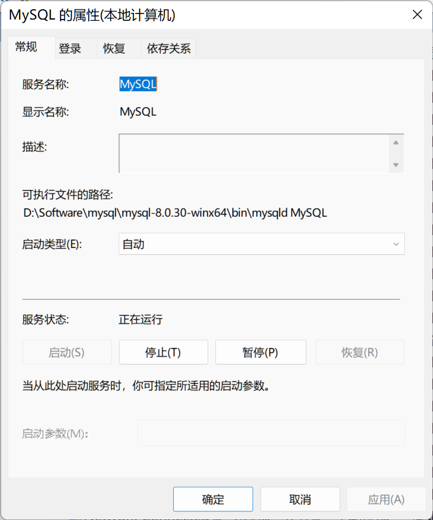
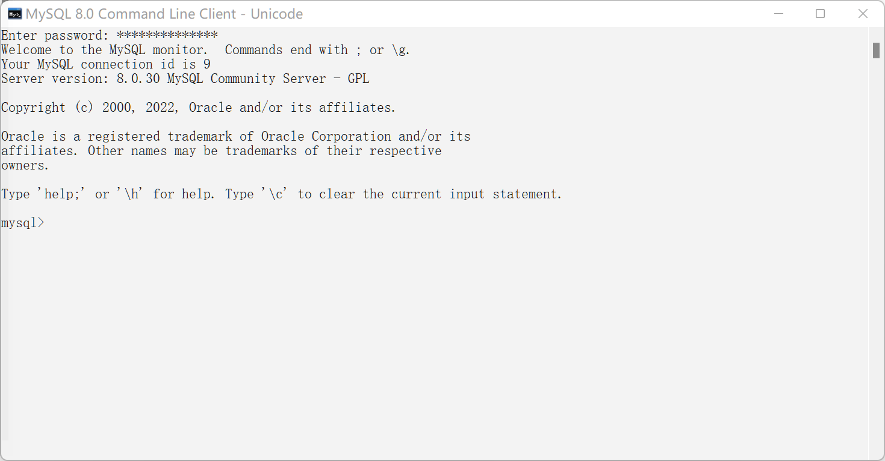

* 

### 2. mysql安装

参考: https://blog.csdn.net/weixin_43605266/article/details/110477391

* 期间由于我D:\Software文件夹操作均需要管理员权限, `mysqld --initialize`初始化失败

* 虽然遇到了一些困难, 但还是搞定了XD

  

* 笑死, 根本没有安装好, 无法登录

* 使用正常的安装, 3分钟搞定(压缩包版害人不浅)

  

5. * 


# 二、常用命令

* <font color='#EE0000'>注意点</font>: mysql语句以分号`;`结束

#### 1. 退出mysql 

* `exit`

#### 2. 查看mysql有哪些数据库 

* `show databases;` 

* ```python
	mysql> show databases;
    +--------------------+
    | Database           |
    +--------------------+
    | information_schema |
    | mysql              |
    | performance_schema |
    | sys                |
    +--------------------+
    4 rows in set (0.00 sec)
    #mysql默认自带了4个数据库。
  ```

#### 3. 选择使用某个数据库

* `use 数据库名;`

#### 4. 创建数据库

* `create database 数据库名;`

* ```python
    mysql> create database test;
    Query OK, 1 row affected (0.01 sec)
	
    mysql> show databases;
    +--------------------+
    | Database           |
    +--------------------+
    | information_schema |
    | mysql              |
    | performance_schema |
    | sys                |
    | test               |
    +--------------------+
    5 rows in set (0.00 sec)
	```

# 三、表

1. <font color='#66ccff'>表(table)</font>：数据库当中最基本的单元 

   * 例

     ```
     姓名	性别	年龄(列：字段) 
     ---------------------------
     张三	男			20            ------->行（记录）
     李四	女			21            ------->行（记录）
     王五	男			22            ------->行（记录）
     ```

2. 数据库当中是以表格的形式表示数据的。
   因为表比较直观。

3. 任何一张表都有行和列：
   * **行（row）**：被称为<font color='#66ccff'>数据/记录</font>。
   * **列（column）**：被称为<font color='#66ccff'>字段</font>。
     * 姓名字段、性别字段、年龄字段。
     * 每一个字段都有：字段名、数据类型、约束等属性。
       * **字段名**: 可以理解，是一个普通的名字，见名知意就行。
       * **数据类型**：字符串，数字，日期等，后期讲。
       * **约束**：约束也有很多，其中一个叫做唯一性约束，这种约束添加之后，该字段中的数据不能重复。

# 5. SQL语句分类

1. DQL：数据查询语句(Data Query Language)
   * `select`

2. DML：数据操作语言(Data Manipulation Language)
   对表中的数据进行增删改
   * `insert` `delete` `update`

   * 主要操作的是表中的数据

3. DDL：数据定义语言(Data Definition Language)

   * `create`、`drop`、`alter`

   * DDL主要操作的表的结构，不是表中的数据。

4. TCL：事务控制语言(Transactional Control Language)

   * 事务提交：commit

   * 事务回滚：rollback

5. DCL：数据控制语言(Data Control Language)

   * 授权：grant

   * 撤销：revoke
