# 第一章 Web基础概念简介

## 1.1 服务器与客户端

1. 线下的服务器与客户端

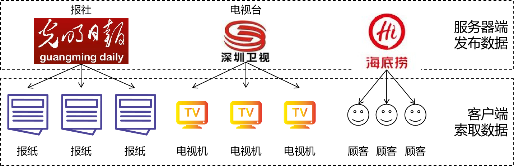

2. 线上的服务器与客户端

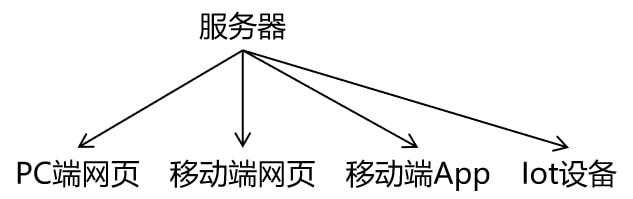

3. 客户端的各种形式

   1. PC端网页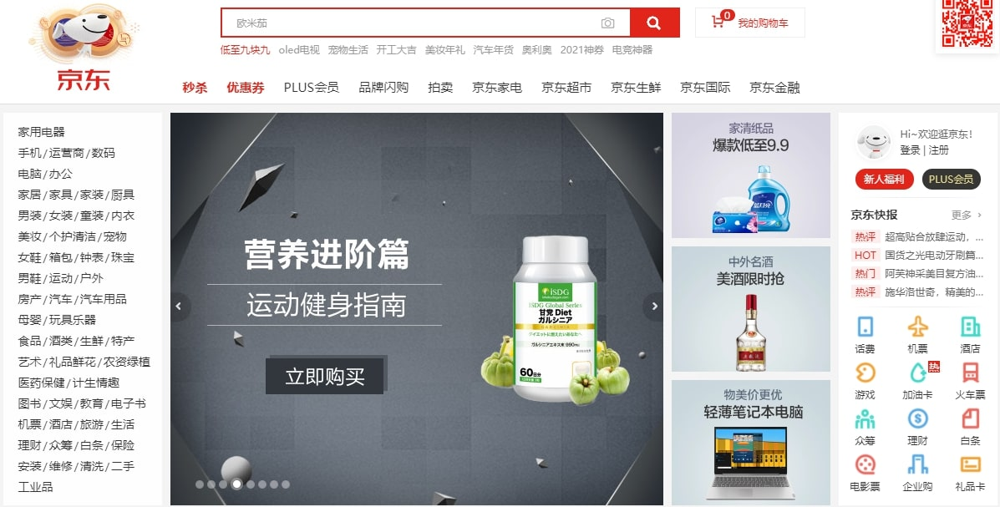

   2. 移动端

   3. Iot设备

   4. 服务器的各种形式: [点我查看完整内容](https://heavy_code_industry.gitee.io/code_heavy_industry/pro000-dev-story/chapter11/content.html)

## 1.2 服务器端应用程序

我们要开发的就是**服务器端应用程序**。

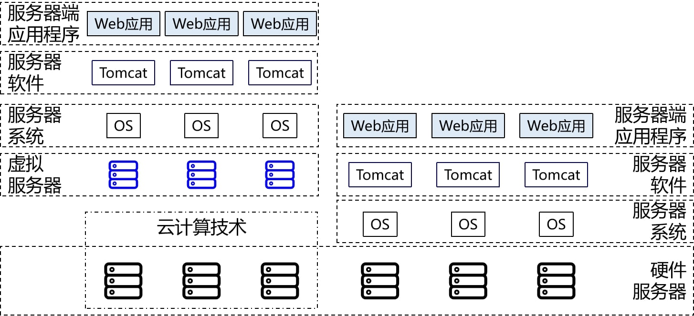

## 1.3 业务

项目中的功能就是业务。

## 1.4 请求和响应

1. 发生在饭馆的请求和响应

   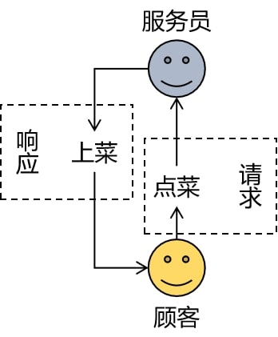

2. 项目中的请求和响应

   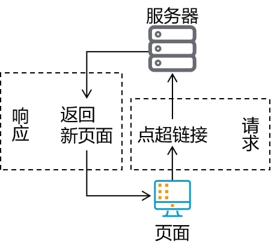

## 1.5 项目的逻辑构成

- <font color='#66ccff'>请求</font>：请求是项目中==最基本==的逻辑单元，就像万事万物都由原子构成

  > 举例：点超链接跳转到注册页面

- <font color='#66ccff'>功能</font>：一个功能包含很==多个请求==

  > 举例：注册用户功能
  >
  > - 请求1：点超链接跳转到注册页面
  > - 请求2：发送请求获取短信验证码
  > - 请求3：检查用户名是否可用
  > - 请求4：提交表单完成注册

- <font color='#66ccff'>模块</font>：一个模块包含很==多功能==

  > 举例：用户信息管理模块
  >
  > - 功能1：用户注册功能
  > - 功能2：用户登录功能
  > - 功能3：个人中心——账户安全功能
  > - 功能4：个人中心——账户绑定功能
  > - 功能5：个人中心——收货地址功能
  > - 功能6：个人中心——我的银行卡功能

- <font color='#66ccff'>子系统</font>：根据项目规模的不同，子系统这层逻辑概念可能有也可能没有。如果设置了子系统，那么子系统中也必然包含很==多模块==。其实庞大项目的子系统已经相当于一个项目了，甚至比小型项目整个都大。

  > 举例：认证中心子系统
  >
  > - 模块1：用户信息管理模块
  > - 模块2：权限管理模块
  > - 模块3：授权管理模块
  > - 模块4：权限检查模块

- <font color='#66ccff'>项目</font>：为了解决现实生活中的实际问题开发一个项目，这个项目就是为这个需求提供的一整套解决方案。

  > 举例：电商项目
  >
  > - 子系统1：认证中心子系统
  > - 子系统2：商品管理子系统
  > - 子系统3：购物车子系统
  > - 子系统4：仓储子系统
  > - 子系统5：物流子系统
  > - 子系统6：订单子系统

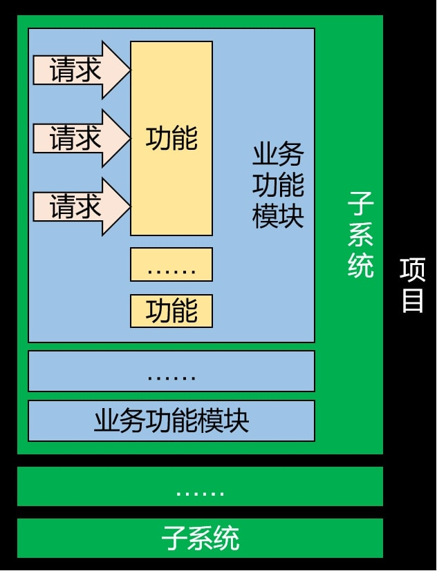

## 1.6 架构

1. 概念: **『架构』其实就是项目的『结构』**。只不过『结构』这个词太小了，不适合用来描述项目这么大的东西，所以换了另一个更大的词：架构。所以当我们聊一个项目的架构时，我们聊的是项目是由哪些部分组成的。

2. 发展演变历程

   1. 单一架构: 一个项目就是一个工程，这样的结构就是单一架构，也叫all in one。我们现在的JavaWeb阶段. SSM阶段都是学习单一架构开发技术。

   2. 分布式架构: 一个项目中包含很多工程，每个工程作为一个模块。模块之间存在调用关系。分布式架构阶段的技术分为两类：

      - Java框架：`SpringBoot`, `SpringCloud`, `Dubbo`等等。

      - 中间件：`Redis`,  `ElasticSearch`, `FastDFS`. `Nginx`. `Zookeeper`. `RabbitMQ`等等。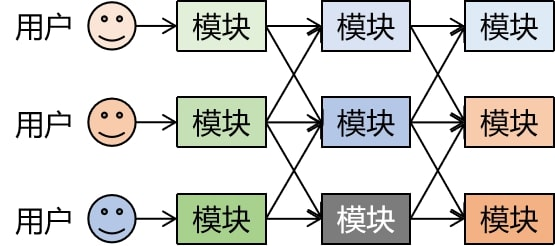


3. 单一架构技术体系

   - 视图：用户的操作界面+数据的动态显示
     - 前端技术：HTML/CSS/JavaScript
     - 服务器端页面模板技术：Thymeleaf
     
     - 控制层：处理请求+跳转页面
       - 服务器：Tomcat
       - 控制器：Servlet
       - 域对象：request. session. servletContext
       - 过滤器：Filter
       - 监听器：Listener
       - 异步交互：Ajax
     
- 业务逻辑层：业务逻辑计算
  
- 持久化层：操作数据库


## 1.7 本阶段技术体系

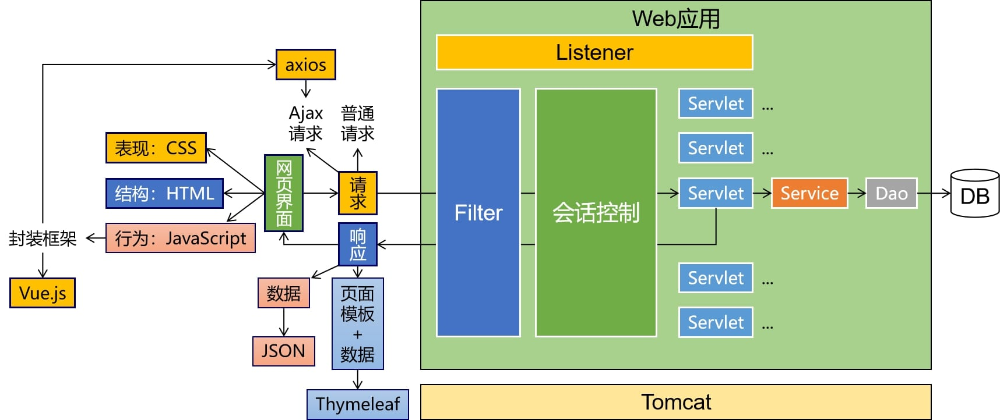

## 1.8 本阶段案例简介

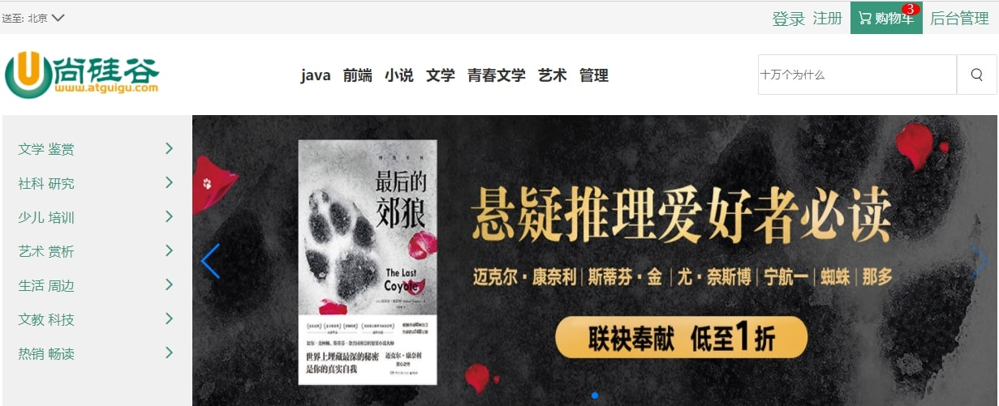


# 第二章 HTML&CSS

## 第一节 单一架构回顾

我们从现在的JavaWeb阶段到后面学习SSM框架阶段都是在学习单一架构项目开发的技术。而在JavaWeb阶段由于重点是探讨如何实现Web开发，所以必须学习一部分前端开发的技术。本节就是让大家明确我们现在要学习的内容在整个架构体系中处于什么位置。

### 1. 单一架构技术体系

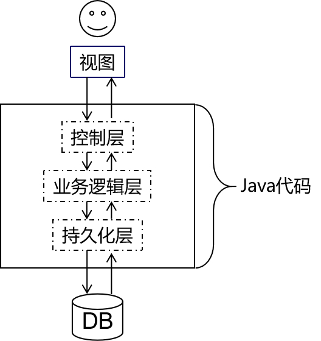

### 2. 视图层

严格来说视图分成两层：

- 前端技术：HTML/CSS/JavaScript
- 服务器端页面模板技术：Thymeleaf

其中HTML. CSS. JavaScript都是工作在浏览器上的，所以它们都属于前端技术。而Thymeleaf是在服务器上把动态内容计算出具体数据，所以严格来说Thymeleaf是后端技术。

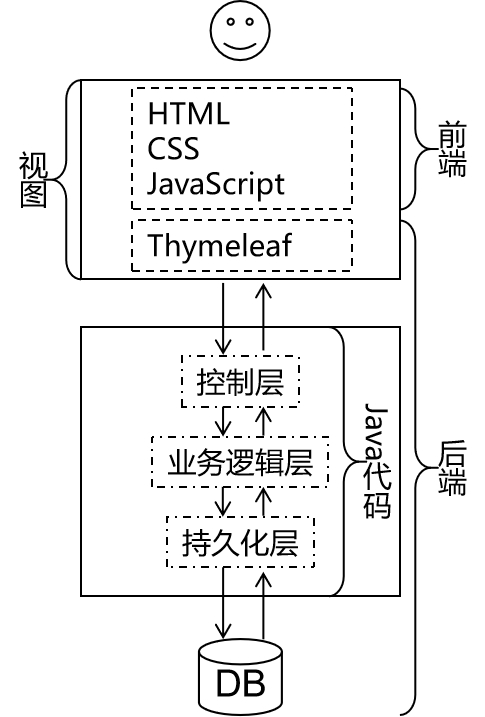

> 这里大家会有个疑问：为什么在『视图』这个地方已经有HTML. CSS. JavaScript这些前端技术了，能够生成用户可以操作的界面，那为什么还需要Thymeleaf这样一个后端技术呢？
>
> 简单来说原因是Thymeleaf=HTML+动态数据，而HTML不支持动态数据，这部分需要借助Thymeleaf来完成。
>
> 更进一步的细节咱们讲到那再说啦！

### 3. Web2.0

Web2.0是相对于更早的网页开发规范而提出的新规范。Web2.0规范之前的网页开发并没有明确的将HTML. CSS. JavaScript代码分开，而是互相之间纠缠在一起，导致代码维护困难，开发效率很低。

> 在开发中我们把这样彼此纠缠. 互相影响的现象称为<font color='#66ccff'>『耦合』</font>。而把耦合在一起的东西拆解开，让他们彼此独立出来称为<font color='#66ccff'>『解耦』</font>。各个组成部分独立完成自己负责的功能，和其他模块无关称为<font color='#66ccff'>『内聚』</font>。
>
> 将来大家经常会听到一句话：软件开发提倡<font color='#66ccff'>『 高内聚，低耦合』</font>。
>
> 一个软件项目只有做到了高内聚. 低耦合才能算得上结构严谨，模块化程度高，有利于开发和维护。

所以Web2.0规范主张将网页代码分成下面三个部分：

- **结构**：由HTML实现，负责管理网页的==内容==。将来网页上不管是静态还是动态的数据都是填写到HTML的标签里。
- **表现**：由CSS实现，负责管理网页内容的==表现形式==。比如：颜色. 尺寸. 位置. 层级等等。也就是给数据穿上一身漂亮的衣服。
- **行为**：由JavaScript实现，负责实现网页的==动态交互效果==。比如：轮播图. 表单验证. 鼠标滑过显示下拉菜单. 鼠标滑过改变背景颜色等等。

## 第二节 HTML简介

### 1. 名词解释

HTML是<font color='#EE0000'>H</font>yper <font color='#EE0000'>T</font>ext <font color='#EE0000'>M</font>arkup <font color='#EE0000'>L</font>anguage的缩写。意思是**『超文本标记语言』**。

### 2. 超文本

HTML文件本质上是==文本文件==，而普通的文本文件只能显示字符。但是HTML技术则通过<font color='#66ccff'>HTML标签</font>把其他网页. 图片. 音频. 视频等各种多媒体资源引入到当前网页中，让网页有了非常丰富的呈现方式，这就是超文本的含义——本身是文本，但是呈现出来的最终效果超越了文本。

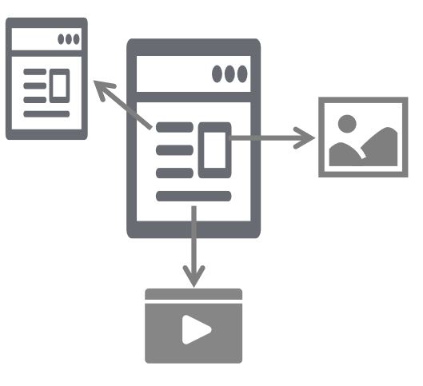

## [#](https://heavy_code_industry.gitee.io/code_heavy_industry/pro001-javaweb/lecture/chapter02/verse02.html#_3. 标记语言)3. 标记语言

说HTML是一种<font color='#66ccff'>『标记语言』</font>是因为它不是向Java这样的『编程语言』，因为它是由一系列『标签』组成的，没有常量. 变量. 流程控制. 异常处理. IO等等这些功能。HTML很简单，每个标签都有它固定的含义和确定的页面显示效果。

* <font color='#66ccff'>标签</font>是通过一组尖括号+标签名的方式来定义的：

    ```html
    <p>HTML is a very popular fore-end technology.</p>
    ```
    
    * 这个例子中使用了一个p标签来定义一个段落，`<p>`叫<font color='#66ccff'>『开始标签』</font>，`</p>`叫<font color='#66ccff'>『结束标签』</font>。开始标签和结束标签一起构成了一个完整的标签。
    * 开始标签和结束标签之间的部分叫<font color='#66ccff'>『文本标签体』</font>，也简称<font color='#66ccff'>『标签体』</font>。

* 有的时候标签内部还带有<font color='#66ccff'>『属性』</font>：

    ```html
    <a href="http://www.xxx.com">show detail</a>
    ```
    
    * href="http://www.xxx.com"就是属性，href是**『属性名』**，"http://www.xxx.com"是**『属性值』**。

* 还有一种标签是<font color='#66ccff'>『单标签』</font>：

    ```html
    <input type="text" name="username" />
    ```


## [#](https://heavy_code_industry.gitee.io/code_heavy_industry/pro001-javaweb/lecture/chapter02/verse02.html#_4. helloworld)4. HelloWorld

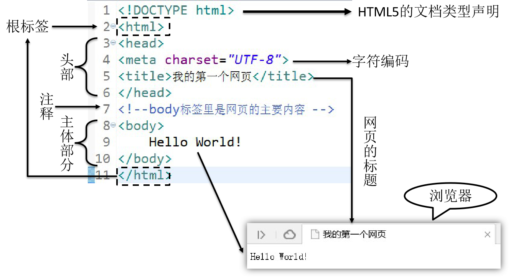

## [#](https://heavy_code_industry.gitee.io/code_heavy_industry/pro001-javaweb/lecture/chapter02/verse02.html#_5. html文件结构)5. HTML文件结构

### [#](https://heavy_code_industry.gitee.io/code_heavy_industry/pro001-javaweb/lecture/chapter02/verse02.html#_1文档类型声明)①文档类型声明

HTML文件中第一行的内容，用来告诉浏览器当前HTML文档的基本信息，其中最重要的就是当前HTML文档遵循的语法标准。这里我们只需要知道HTML有4和5这两个大的版本，HTML4版本的文档类型声明是：

```html
<!DOCTYPE HTML PUBLIC "-//W3C//DTD HTML 4.01 Transitional//EN"
"http://www.w3.org/TR/html4/loose.dtd">
```

1
2

HTML5版本的文档类型声明是：

```html
<!DOCTYPE html>
```

1

现在主流的技术选型都是使用HTML5，之前的版本基本不用了。

历史上HTML的各个版本：

| 版本名称 | 年份 |
| -------- | ---- |
| HTML     | 1991 |
| HTML+    | 1993 |
| HTML2.0  | 1995 |
| HTML3.2  | 1997 |
| HTML4.01 | 1999 |
| XHTML1.0 | 2000 |
| HTML5    | 2012 |
| XHTML5   | 2013 |

### [#](https://heavy_code_industry.gitee.io/code_heavy_industry/pro001-javaweb/lecture/chapter02/verse02.html#_2根标签)②根标签

html标签是整个文档的根标签，所有其他标签都必须放在html标签里面。上面的文档类型不能当做普通标签看待。

> 所谓『根』其实是『树根』的意思。在一个树形结构中，根节点只能有一个。

### [#](https://heavy_code_industry.gitee.io/code_heavy_industry/pro001-javaweb/lecture/chapter02/verse02.html#_3头部)③头部

head标签用于定义文档的头部，其他头部元素都放在head标签里。头部元素包括title标签. script标签. style标签. link标签. meta标签等等。

### [#](https://heavy_code_industry.gitee.io/code_heavy_industry/pro001-javaweb/lecture/chapter02/verse02.html#_4主体)④主体

body标签定义网页的主体内容，在浏览器窗口内显示的内容都定义到body标签内。

### [#](https://heavy_code_industry.gitee.io/code_heavy_industry/pro001-javaweb/lecture/chapter02/verse02.html#_5注释)⑤注释

HTML注释的写法是：

```html
<!-- 注释内容 -->
```

1

注释的内容不会显示到浏览器窗口内，是开发人员用来对代码内容进行解释说明。

## [#](https://heavy_code_industry.gitee.io/code_heavy_industry/pro001-javaweb/lecture/chapter02/verse02.html#_6. html语法规则)6. HTML语法规则

- 根标签有且只能有一个
- 无论是双标签还是单标签都必须正确关闭
- 标签可以嵌套但不能交叉嵌套
- 注释不能嵌套
- 属性必须有值，值必须加引号，单引号或双引号均可
- 标签名不区分大小写但建议使用小写