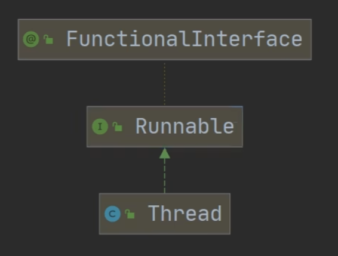
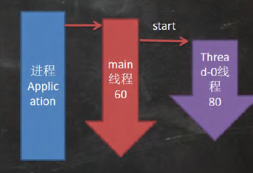
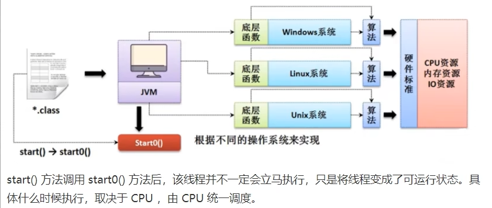
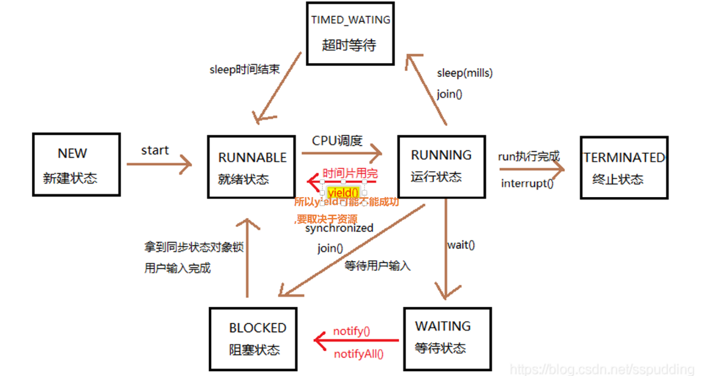

# 17.1线程相关概念

2022年7月14日

23:13

1.  程序：是为了完成特定任务, 用某种语言编写的一组指令的集合

2.  进程:
    1.  进程是指==运行中的程序==，比如我们使用QQ，就启动了一个进程，操作系统就会为该进程分配内存空间。当我们使用迅雷，又启动了一个进程,操作系统将为迅雷分配新的内存空间。
    2.  ==进程是程序的一次执行过程==,或是正在运行的一个程序。
    3.  是一个动态过程, 有它自身的产生、存在和消亡的过程

3.  什么是线程
    1.  线程是由==进程创建==的, 是进程的一个实体
    2.  ==一个进程可以拥有多个线程==

4.  其他相关概念
    1.  单线程: 在同一时刻, 只允许执行一个线程
    2.  多线程: 在同一时刻, 执行多个线程

        (如 一个QQ进程, 在同一时间可以打开多个聊天窗口, 一个迅雷进程, 可以同时下载多个文件)

    3. 并发: 同一时刻, 多个任务==交替执行==, 造成一种类似同时进行的错觉

       <font color='orange'>(单核cpu实现的多任务就是并发)</font>

    4. 并行: 同一时刻, 多个任务==同时执行==。

       <font color='orange'>(多核cpu可以实现并发和并行)</font>

# 17.2线程基本使用

2022年7月14日

23:39

1.  创建线程的两种方式

    ​	java中线程的使用有两种方式

    1.  继承Thread类, 重写run方法

    2.  继承Runnable接口, 重写run方法

    3.  

        ​		Thread类本质上是一个是实现了Runnable接口的类

#### Thread类的使用

1.  写一个类, 继承Thread类, 之后这个类就能够作为线程使用 

    ```java
    class Cat extends Thread{}
    ```

2.  重写该类的run方法, 写上自己的业务逻辑 

    ```java
    class Cat extends Thread{
    
      int times = 0;
    
      @Override
      public void run() { //重写run方法, 写上自己的业务逻辑
        while (true) {
    
          //该线程每隔1s, 在控制台输出"喵喵, 我是小猫咪"
          System.out.println("喵喵, 我是小猫咪" + (++times) + " 线程名=" + Thread.currentThread().getName());
    
          //让该线程休眠1秒 [ctrl+alt+t 快速添加环绕](杂项/#快捷键)
          try{
            Thread.sleep(1000);
          } catch (InterruptedException e){
            e.printStackTrace();
          }
            
          if(times == 80) {
            break; //当times 到80, 退出while, 这时候线程也就退出
          }
        }
      }
    }
    ```

3.  使用时创建一个对象

3.  通过此对象使用start方法启动线程 

    ```java
    Cat cat = new Cat();
    cat.start(); //启动线程, 最终会执行cat的run方法
    
    //输出结果: 
    "喵喵, 我是小猫咪2 线程名=Thread-0"
    "主线程 i=2"
    
    cat.run(); 
    //只是使用了一个方法, 没有真正地启动一个线程, 就会把run方法执行完毕, 再向下执行(阻塞)
    //这种方式称为: 串行化
    
    //输出结果: 
    "喵喵, 我是小猫咪* 线程名=main"
    ```

    

##### 如何理解多线程的启动



1.  进程先调用main方法, 开启一个main线程, 在main方法内部调用`cat.start()`, 开启一个Thread-0线程 <font color='orange'>(</font>当前线程名可以通过`Thread.currentThread().getName()`获得<font color='orange'>)</font>
2.  当main线程启动一个子线程Thread-0, 主线程不会阻塞, 会继续执行(两个线程交替执行(并发/并行))
3.  主线程(main)结束, 子线程(Thread-0)并不会结束

##### start源码

1. ```java
   1.  public synchronized void start() {
   
     /**
      * This method is not invoked for the main method thread or "system"
      * group threads created/set up by the VM. Any new functionality added
      * to this method in the future may have to also be added to the VM.
      *
      * A zero status value corresponds to state "NEW".
      */
   
     if (threadStatus != 0)
       throw new IllegalThreadStateException();
   
     /* Notify the group that this thread is about to be started
      * so that it can be added to the group's list of threads
      * and the group's unstarted count can be decremented. */
   
     group.add(this);
   
     boolean started = false;
   
     try {
       start0();
       started = true;
     } finally {
       try {
         if (!started) {
           group.threadStartFailed(this);
         }
       } catch (Throwable ignore) {
   
         /* do nothing. If start0 threw a Throwable then
          it will be passed up the call stack */
       }
     }
   }
   ```

   

1. <font color='#EE0000'>核心</font>: 调用`start0`方法

   start0()方法是本地方法, 是JVM调用的方法, 底层由c/c++实现

2. 真正实现多线程效果的方法是start0方法, 而非run()方法



#### Runnable接口的使用

1.  为什么要使用Runnable接口: java是单继承的, 如果一个类已经继承了某一父类, 就无法继承Thread类来创建线程, 此时可以采用Runnable接口来创建线程

2.  使用-==静态代理==:
    1.  实现Runnable接口

    2.  重写run()方法

    3.  创建runnable实例

    4.  创建Thread实例

    5.  将Runnable实例放入Thread实例中

    6.  通过线程实例控制线程的行为(运行，停止)，在运行时会调用Runnable接口中的run方法。

        * <font color='#EE0000'>注意</font>: Java中真正能==创建新线程的只有Thread类对象==

          通过实现Runnable的方式，最终还是通过Thread类对象来创建线程

3.  使用-<font color='#66ccff'>==动态代理==</font>
    1.  创建一个实现了Runnable接口的代理类, 用来起到Thread类的作用, 其余步骤与静态代理相似

    2.  例子:

        ```java
        Tiger tiger = new Tiger();//实现了Runnable
        ThreadProxy threadProxy = new ThreadProxy(tiger);
        threadProxy.start();
         
        
        //线程代理类, 模拟了一个极简的Thread类
        
        class ThreadProxy implements Runnable{
          private Runnable target = null; //属性, 类型是 Runnable
        
          @Override
          public void run() {
            if (target != null){
              target.run(); //动态绑定, 运行类型是Tiger
            }
          }
        
          public ThreadProxy(Runnable target) {
            this.target = target;
          }
        
          public void start() {
            start0(); //此时实现多线程方法
          }
        
          private void start0() {
            run();
          }
        }
        ```
        
    3.  <font color='orange'>好像不是多线程, 摸了, 明天看看</font>
    
    4.  Runnable源码: 仅定义了一个run()方法
    
        ```java
        package java.lang;
        
        public interface Runnable {
          public abstract void run();
        }
        ```
    
         
    
4.  ==继承Thread== 与 ==实现Runnable==的区别

    1.  从java的设计来看，通过继承Thread或者实现Runnable接口来创建线程本质上没有区别,从jdk帮助文档我们可以看到Thread类本身就实现了Runnable接口
    2.  实现Runnable接口方式更加适合多个线程共享一个资源的情况，并且避免了单继承的限制,建议使用Runnable
    3.  [售票系统]，编程模拟三个售票窗口售票,分别使用继承 Thread和实现Runnable方式,并分析有什么问题 ? <font color='#66ccff'>SellTicket.java</font>
    * 因为是先判断, 后--, 多个线程同时访问ticketNum时, 会出现超卖的现象

5.  线程终止
    1.  当线程完成任务后, 会自动退出
    2.  还可以通过==使用变量==来控制run方法退出的方式来停止线程, 即<font color='#66ccff'>通知方式</font>

        例: ThreadExit.java

    3.  <font color='orange'>本质上就是</font> 在main方法中, 修改run方法中的循环条件, 来退出run函数

# 17.3 线程常用方法

2022年7月17日

16:21

1.  ##### 线程常用方法_part1
    
      ```java
        1.  setName(): 设置线程名称，使之与参数 name 相同
        2.  getName(): 返回该线程的名称
        3.  start(): 使该线程开始执行;Java虚拟机底层调用该线程的start0方法
        4.  run(): 调用线程对象run方法
        5.  setPriority(): 更改线程的优先级
        6.  getPriority(): 获取线程的优先级
        7.  sleep(): 在指定的毫秒数内让当前正在执行的线程休眠(暂停执行)
        8.  interrupt(): 中断线程
        9.  isAlive(): 判断当前线程是否存活
      ```
    
2.  注意事项和细节
    1.  start底层会创建新的线程, 调用run

        ​	run只是一个方法, 并不会启动新线程

    2. 线程优先级的范围

       ```java
       //The minimum priority that a thread can have.
       public final static int MIN_PRIORITY = 1;
       
       //The default priority that is assigned to a thread.
       public final static int NORM_PRIORITY = 5;
       
       //The maximum priority that a thread can have.
       public final static int MAX_PRIORITY = 10;
       //说明: 高优先级的线程会抢占cpu的执行权。但只是从概率上讲, 高优先级线程高概率线执行,并不意味这高优先级的线程执行后, 低优先级的线程才执行
       ```
    
    3. `interrupt()`: 中断线程, 但没有真正的结束线程, 所以一般用于中断正在休眠的线程(提前结束休眠)
    
    4. `sleep()`: 线程的静态方法, 使当前线程休眠
    
       
    
3.  ##### 线程常用方法_part2
    
    1. ```java
       1.  yield:线程的礼让。让出cpu，让其他线程执行。但当cpu资源足够是，礼让可能不成功， 所以礼让的时间不确定, 也不一定礼让成功
       2.  join: 线程的插队。插队的线程一旦插队成功，则肯定先执行完插入的线程所有的任务
       ```
    
    3.  <font color='#66ccff'>案例</font>:main线程创建一个子线程,每隔1s输出hello,输出20次,主线程每隔1秒,输出hi,输出20次.
    
        要求:两个线程同时执行，当主线程输出5次后，就让子线程运行完毕，主线程再继续,
        
        

#### 用户线程和守护线程

1.  <font color='#66ccff'>用户线程</font>： 也叫工作线程， 当线程的任务执行完或者通知方式结束
2.  <font color='#66ccff'>守护线程</font>：一般视为工作线程服务的, 当所有的用户线程结束, 守护线程自动结束

    ​	常见的守护线程: <font color='#EE0000'>垃圾回收机制</font>

3. 如何设置为用户线程/守护线程

   ```java
   Thread.setDeamon(): true:守护线程 / false:用户线程
   ```

   

# 17.4线程的生命周期

2022年7月17日

21:13

1. JDK中用Thread.State枚举表示了线程的几种状态

   public static enum **Thread.State** extends [Enum](https://www.matools.com/file/manual/jdk_api_1.8_google/java/lang/Enum.html) \<[Thread.State](https://www.matools.com/file/manual/jdk_api_1.8_google/java/lang/Thread.State.html)>

   线程可以处于以下状态之一：

   1.  [NEW](https://www.matools.com/file/manual/jdk_api_1.8_google/java/lang/Thread.State.html#NEW)  
       尚未启动的线程处于此状态。
       
   2.  [RUNNABLE](https://www.matools.com/file/manual/jdk_api_1.8_google/java/lang/Thread.State.html#RUNNABLE) -\> Ready / Running  
       在Java虚拟机中执行的线程处于此状态。
       
   3.  [BLOCKED](https://www.matools.com/file/manual/jdk_api_1.8_google/java/lang/Thread.State.html#BLOCKED)  
       被阻塞等待监视器锁定的线程处于此状态。
       
   4.  [WAITING](https://www.matools.com/file/manual/jdk_api_1.8_google/java/lang/Thread.State.html#WAITING)  
       正在等待另一个线程执行特定动作的线程处于此状态。
       
   5.  [TIMED_WAITING](https://www.matools.com/file/manual/jdk_api_1.8_google/java/lang/Thread.State.html#TIMED_WAITING)  
       正在等待另一个线程执行动作达到指定等待时间的线程处于此状态。
       
   6.  [TERMINATED](https://www.matools.com/file/manual/jdk_api_1.8_google/java/lang/Thread.State.html#TERMINATED)  
       已退出的线程处于此状态。

       一个线程可以在给定时间点处于一个状态。这些状态是不反映任何操作系统线程状态的虚拟机状态。

#### 线程状态转换图




# 17.5 同步机制(Synchronized / Lock)

2022年7月17日

22:54

1.  线程同步机制
    1. 在多线程编程中, 一些敏感数据==不允许被多个线程同时访问==, 此时就是用<font color='#66ccff'>同步访问</font>技术, 保证数据在任何时刻, 最多有一个线程访问, 以保证数据的完成性

    2. <font color='#66ccff'>线程同步</font>: 即当有一个线程在对内存进行操作时, 其他线程都不可以对这个内存地址进行操作, 直到该线程完成操作, 其他线程才能对该内存地址进行操作

       

2. **<font color='#66ccff'>Synchronized</font>** 同步

   1.  synchronized同步<font color='#EE0000'>代码块</font>

       ```java
       synchronized (同步监视器(对象)) { //得到对象的锁, 才能操作同步代码
       	//需要被同步的代码
       }
       ```
       
   2. synchronized同步<font color='#EE0000'>方法</font>

   ```java
   public synchronized void mthod() {
   	//需要被同步的代码
   }
   ```

   3. * 需要被同步的代码: 操作==共享数据==(多个线程共同操作的变量)的代码

      * <font color='#66ccff'>同步监视器</font>: 俗称 锁, 任何一个类的对象都可以用来充当锁

        * 同步方法一样有同步监视器, 只不过不需要显示声明

          非静态同步方法, 同步监视器是==this==;

          静态同步方法, 同步监视器是==当前类本身==

      * 要求: ==多个线程必须共用一把锁== 

   4. <font color='orange'>如何理解</font>: 当一个线程在使用这段代码时, 就将这一段代码<font color='#EE0000'>上锁</font>, 使其他线程不能访问, 直到使用结束后才<font color='#EE0000'>解锁</font>, 此时其他线程才能使用

   5. 使用synchronized来解决售票问题中的bug

3.  Lock锁 同步 (JDK5.0新增)

    1.  介绍: 
        1.  从JDK 5.0开始，Java提供了更强大的线程同步机制--通过==显式定义同步锁对象==来实现同步。同步锁使用Lock对象充当。
        2.  `java.util.concurrent.locks.Lock接口`是==控制多个线程对共享资源进行访问的工具==。锁提供了对共享资源的独占访问，每次只能有一个线程对Lock对象加锁，线程开始访问共享资源之前应先获得Lock对象。
        3.  <font color='#66ccff'>ReentrantLock类</font>实现了Lock接口，它拥有与 synchronized相同的并发性和内存语义，在实现线程安全的控制中，比较常用的是 <font color='#66ccff'>Reentrantlock</font>，可以显式加锁、释放锁。

    2.  如何使用: 
        1.   实例化ReentrantLock
        2.  用`try{} finally {}` 包围需要同步的代码, 
        3.  在try开头调用锁定方法lock()
        4.  在finally调用解锁方法unlock()

4.  synchronized 和 Lock的异同

    1.  同: 二者都可以解决线程的同步问题

    2.  异: synchronized机制在执行完相应的同步代码以后, ==自动==释放同步监视器

        ​		Lock需要==手动==地启动同步(lock()方法), 同时结束同步也需要手动地实现(unlock())

5. <font color='#EE0000'>优先使用顺序</font> : Lock -> 同步代码块 (已经进入了方法体, 分配了相应资源) -> 同步方法 (在方法体之外)

#### 分析同步原理


t1先抢到锁, t2t3阻塞, t1进行相关操作, 然后退出程序并解锁, 之后三个线程一起抢夺访问权限(因此t1可能会再次进入)


# 17.6 互斥锁

1. 互斥锁
   1. Java语言中, 引入了一个对象互斥锁的概念, 来保证共享数据操作的完整性
   2. 每个对象都对应于一个可称为“<font color='#66ccff'>互斥锁</font>”的标记，这个标记用来保证在任一时刻，只能有一个线程访问该对象。
   3. 关键字synchronized来与对象的互斥锁联系。当某个对象用synchronized修饰时, 表明该对象在任一时刻只能由一个线程访问
   4. 同步的局限性: 只有一个线程参与, 相当于单线程, 导致程序的==执行效率降低==
   5. 同步方法==(非静态的)== 的锁可以是this, 也可以是其他对象(要求是同一个对象) <font color='orange'>(多个线程访问的锁必须是同一对象)</font>
   6. 同步方法==(静态的)== 的锁为当前类本身<font color='orange'>(SellTicket.class)</font>。

2. 注意事项和细节

   1. 同步方法如果没有使用static修饰, 默认锁对象: `this`
   2. 如果方法使用static修饰, 默认锁对象: `当前类.class`

   3. 实现的步骤

      1. 先分析上锁的代码

      2. 选择同步代码块或同步方法

         ​	优先选择同步代码块, 因为锁的范围越小, 执行速度越快

      3. 要求多个线程的锁为同一个对象

         例: 

         ```java
         new SellTicket03().start();
         new SellTicket03().start();
         //无法同步, 因为内部锁的是this, 两个对象的this不相同, 两个线程访问的对象不是同一个
         ```

# 17.7线程死锁

1. 基本介绍

   多个线程都占用了对象的锁资源, 但又不肯相让, 导致了死锁, 在编程时一定要避免死锁的发生

   <font color='#66ccff'>例</font>: 妈妈: 你先完成作业, 才让你玩手机 小明: 你先让我玩手机, 我才完成作业

##### 释放锁

1. 释放锁的操作
   1. 当前线程的同步方法 / 同步代码块 ==执行结束==
   2. 当前线程在同步方法 / 同步代码块中 ==遇到return / break==
   3. 当前线程在同步方法 / 同步代码块中 出现了==未处理的Error或Exception==, 导致异常结束
   4. 当前线程在同步方法 / 同步代码块中 ==执行了线程对象的wait()方法==, 当前<font color='#EE0000'>线程暂停, 并释放锁</font>

2. 不会释放锁的操作

   1. 线程执行同步方法或同步代码块时, 程序调用`Thread.sleep()`、`Thread.yield()`党法, 只会暂停当前线程的执行, 不会释放锁

   2. 线程执行同步代码块时, 其他线程调用了该线程的`suspend()`方法将该线程挂起, 该线程不会释放锁

      <font color='#EE0000'>注意</font>: 应该尽量避免使用`suspend()`和`resume()`, 因为该线程已过时

# 17.8线程的通信

1. <font color='#66ccff'>例</font>: 使用2个线程打印1-100, 其中线程1,2交替打印
```java
class PrintNumber implements Runnable {
    private int num = 1;

    @Override
    public void run() {
        while (true) {
            synchronized (this) {
                if (num <= 100) {

                    notify(); //唤醒另一个线程, 但是由于锁在当前线程手上, 锁未释放, 另一个线程无法运行
                    //(this.notify())

                    try {
                        Thread.sleep(50);
                    } catch (InterruptedException e) {
                        throw new RuntimeException(e);
                    }
                    System.out.println(Thread.currentThread().getName() + " print: " + num++);

                    try {
                        wait();
                    } catch (InterruptedException e) {
                        throw new RuntimeException(e);
                    }
                } else {
                    notifyAll(); //线程退出时要记得notify另一个线程
                    break;
                }
            }
        }
        System.out.println(Thread.currentThread().getState());
    }
}
```
##### 2. wait和notify

```
wait(): 一旦执行此方法, 当前线程就进入阻塞状态, 并释放同步监视器
notify(): 一旦执行此方法, 就唤醒被wait的一个线程, 如果多个线程被wait, 则唤醒优先度最高的线程
notifyAll(): 一旦执行此方法, 唤醒所有的wait线程
```

3. <font color='#EE0000'>注意点: </font>

   1. wait, notify, notifyAll 三个方法必须==使用在同步代码块 / 同步监视器==中

   2. wait, notify, notifyAll 三个方法的==调用者==必须是同步代码块 / 同步监视器的==同步监视器==

      ​	否则, 会出现`IllegalMonitorStateException`异常

   3. wait, notify, notifyAll 三个方法定义在`java.lang.Object类`中

      目的: 使所有的类作为同步监视器时,都能调用wait, notify, notifyAll

4. ##### sleep和wait的异同

   1. <font color='#EE0000'>相同点</font>: 一旦执行方法, 都可以使当前线程进入阻塞状态

   1. <font color='#EE0000'>不同点</font>:
      1. 两个方法声明位置不同: sleep()在Thread中声明, wait()在同步代码块中声明
      2. 调用要求不同: sleep可以在任何需要的场景调用, wait只能在同步代码块/同步方法中调用
      3. 是否释放同步监视器: sleep不释放锁, wait会释放锁 (只针对同步代码块/同步方法)

5. 经典例题: <font color='#66ccff'>生产者/消费者问题(Producer-consumer problem)</font> 也叫<font color='#66ccff'>有限缓冲问题(Bounded-buffer problem)</font>

   * <font color='#66ccff'>生产者(Productor)</font>生产一定量的产品(数据)交给店员(Clerk)<font color='orange'><缓冲区></font>，而<font color='#66ccff'>消费者(Customer)</font>从店员处取走一定量的产品(数据)，店员一次只能持有固定数量的产品(缓冲区大小)

   * 这里可能出现两个问题:

     1. 生产者比消费者快时，消费者会漏掉一些数据没有取到。

     2. 消费者比生产者快时，消费者会取空数据。

   * 分析: 

     1. 是否是多线程问题? 是, 生产者线程, 消费者线程
     2. 是否共享数据? 是, 店员(或产品)
     3. 如何解决数据的安全问题? 同步机制, 有三种方法
     4. 是否涉及线程的通信? 是

   * 解决方案: [ProducerConsumerProblem.java](D:\Java\idea_workspace\books\JavaSe_hsp\Chap17_Multithreading\src\communication\ProducerConsumerProblem.java)

# 17.9 JDK5.0新增线程创建方式

#### 1. <font color='#66ccff'>Callable接口</font> 实现多线程

   1. Callable<font color='#EE0000'>特点</font>: 
   
      * 与使用Runnable相比, Callable功能更强大
      
      1. 相比run()方法, 可以==有返回值==
      2. ==方法可以抛出异常==
      3. ==支持泛型==的返回值
      4. <font color='#EE0000'>注意</font>: 使用时需要借助FutureTask类, 比如获取返回结果
   
   2. <font color='#66ccff'>Future接口</font>
      
      1. 可以对具体Runnable, Callable任务的执行结果进行取消, 查询是否完成, 获取结果等操作
      2. <font color='#66ccff'>FutureTask类</font>是Future接口的唯一实现类
   3. FutureTask 同时==实现了Runnable, Future 接口==, 它即可以作为Runnable被线程执行, 又可以作为Future得到Callable的返回值
   
   3. 使用: [使用例CallableTest.java](D:\Java\idea_workspace\books\JavaSe_hsp\Chap17_Multithreading\src\thread_jdk5\CallableTest.java)
      1. 创建一个实现Callable的实现类
      2. 实现call方法, 将此线程需要执行的操作 声明在call()中
      3. 创建Callable接口实现类的对象
      4. 将此Callable接口实现类的对象作为参数, 换地到FutureTask构造器中, 创建一个FutureTask的对象
      5. 将FutureTask的对象作为参数, 传递到Thread类的构造器中, 创建Thread对象, 并调用start()
      6. 获取Callable中call方法的返回值 (get()的返回值为FutureTask构造器参数Callable实现类重写的call() 的返回值<font color='orange'>(default为Object)</font>)

#### 2. 使用==线程池==

   1. 介绍

      1. 背景: 经常创建和销毁、使用量特别大的资源，比如并发情况下的线程，对性能影响很大。

      2. 思路: 提前创建好多个线程，放入线程池中，使用时直接获取，使用完放回池中。可以避免频繁创建销毁、实现重复利用。类似生活中的公共交通工具。<font color='orange'>(与数据库连接池相似)</font>

      3. 好处: 

         1. ==提高响应速度==（减少了创建新线程的时间)

         2. ==降低资源消耗==（重复利用线程池中线程，不需要每次都创建)

         3. ==便于线程管理==
   * corePoolSize: 核心池的大小
     
   * maximumPoolSize: 最大线程数
     
   * keepAliveTime: 线程没有任务时最多保持多长时间后会终止√ ...


      2. 相关API
       
         JDK 5.0起提供了线程池相关API： <font color='#66ccff'>ExecutorService</font>和 <font color='#66ccff'>Executors</font>
       
         1. `ExecutorService`：真正的线程池<font color='#EE0000'>接口</font>。常见子类 <font color='#66ccff'>ThreadPoolExecutor</font>
       
            ​	`void execute(Runnable command)`：执行任务/命令，没有返回值，一般用来执行Runnable
       
            ​	`<T> Future<T> submit（Callable<T>task)`：执行任务，有返回值，一般又来执行Callable
       
            ​	`void shutdown()`：关闭连接池
       
         2. `Executors`：工具类、线程池的工厂类，用于创建并返回不同类型的线程池
            
            ​	`Executors.newCachedThreadPool()`：创建一个可根据需要创建新线程的线程池
            
            ​	`Executors.newFixedThreadPool(n)`；创建一个可重用固定线程数的线程池
            
            ​	`EXecutors.newSingleThreadEXecutor()`：创建一个只有一个线程的线程池
            
            ​	`Executors.newScheduledThreadPool(n)`：创建一个线程池，它可安排在给定延迟后运行命令或者定期地执行。
       
      3. 使用

   


            1. 提供指定线程数量的线程池
       
            2. 执行指定的线程的操作, 需要提供实现Runnable接口或Callable接口实现类的对象
       
               ```java
               service.execute(Runnable runnable);
               service.submit(Callable callable);
               ```
       
            3. 关闭连接池
       
            4. 注: 如果需要设置线程池属性, 需要将service向下转型为ThreadPoolExecutor, 调用set方法
       
      4. 使用例 [CallableTest.java](D:\Java\idea_workspace\books\JavaSe_hsp\Chap17_Multithreading\src\thread_jdk5\CallableTest.java)

# Homework

1. 编程题 <font color='#66ccff'>Homework01.java</font>

   1. 在main方法中启动两个线程

   2. 第1个线程循环随机打印100以内的整数(3)直到第2个线程从键盘读取了“Q”命令。

* 思路: 在线程b中, 采用通知方式控制线程a的运行

2. 编程题 <font color='#66ccff'>Homework02.java</font>
   1. 有2个用户分别从同一个卡上取钱(总额:10000)
   2. 每次都取1000,当余额不足时，就不能取款了(3)不能出现超取现象=》线程同步问题.
