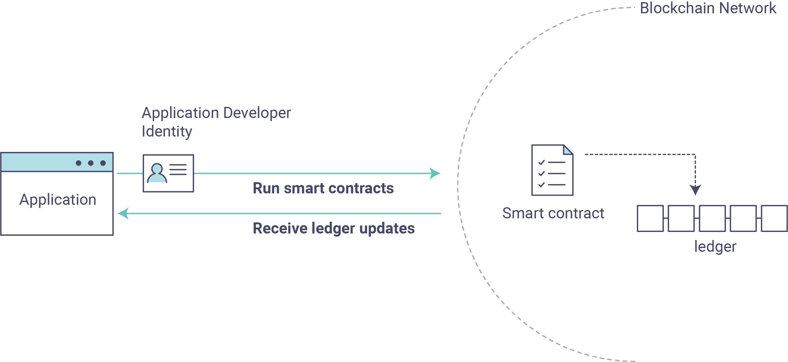

> [一个企业级区块链平台 — hyperledger-fabricdocs master 文档](https://hyperledger-fabric.readthedocs.io/zh-cn/latest/)

## Fabric测试网络

### Fabric网络结构

1. 对等节点(peer node): 一个网络实体，维护账本并运行链码容器来对账本做**读写操作**, 用于验证交易。
   - 节点由成员所有，并负责维护。
   - Peers上运行智能合约(chaincode), 用于管理区块链账本的业务逻辑
2. 排序节点(orderer node): 
   1. 对交易顺序进行排序, 打包成区块; 
      - 这样可以使得对等节点专注于验证交易并将它们提交到账本
   2. 可以操作定义Fabric网络的功能的**系统通道**
      - 例如如何制作块, 节点可以使用的Fabric版本, 定义了哪个组织是该联盟的成员
   3. 不同的排序节点使用Raft公式算法达成跨交易顺序的共识网络


### 与网络交互

> 使用peer CLI与网络进行交互

#### 配置环境变量

1. 运行环境(PWD=`/fabric-samples/test-network`)

   ```bash
   export PATH=${PWD}/../bin:$PATH 
   
   export FABRIC_CFG_PATH=$PWD/../config/
   ```

   

2. 设置环境变量, 以Org1管理员的身份对peer操作

   ```bash
   # Environment variables for Org1
   export CORE_PEER_TLS_ENABLED=true
   export CORE_PEER_LOCALMSPID="Org1MSP"
   export CORE_PEER_TLS_ROOTCERT_FILE=${PWD}/organizations/peerOrganizations/org1.example.com/peers/peer0.org1.example.com/tls/ca.crt
   export CORE_PEER_MSPCONFIGPATH=${PWD}/organizations/peerOrganizations/org1.example.com/users/Admin@org1.example.com/msp
   export CORE_PEER_ADDRESS=localhost:7051
   ```

   - `CORE_PEER_TLS_ROOTCERT_FILE`和`CORE_PEER_MSPCONFIGPATH`环境变量指向Org1的`organizations`文件夹中的的加密材料。 
   - 如果您使用 `./network.sh deployCC -ccl go` 安装和启动 asset-transfer (basic) 链码，您可以调用链码（Go）的 `InitLedger` 方法来赋予一些账本上的初始资产（如果使用 typescript 或者 javascript，例如 `./network.sh deployCC -ccl javascript`，你会调用相关链码的 `initLedger` 功能）。

#### 初始化账本

```shell
peer chaincode invoke -o localhost:7050 --ordererTLSHostnameOverride orderer.example.com --tls --cafile ${PWD}/organizations/ordererOrganizations/example.com/orderers/orderer.example.com/msp/tlscacerts/tlsca.example.com-cert.pem -C mychannel -n basic --peerAddresses localhost:7051 --tlsRootCertFiles ${PWD}/organizations/peerOrganizations/org1.example.com/peers/peer0.org1.example.com/tls/ca.crt --peerAddresses localhost:9051 --tlsRootCertFiles ${PWD}/organizations/peerOrganizations/org2.example.com/peers/peer0.org2.example.com/tls/ca.crt -c '{"function":"InitLedger","Args":[]}'
```

#### 查询账本

```shell
peer chaincode query -C mychannel -n basic -c '{"Args":["GetAllAssets"]}'
```

输出结果

```json
[
  {"ID": "asset1", "color": "blue", "size": 5, "owner": "Tomoko", "appraisedValue": 300},
  {"ID": "asset2", "color": "red", "size": 5, "owner": "Brad", "appraisedValue": 400},
  {"ID": "asset3", "color": "green", "size": 10, "owner": "Jin Soo", "appraisedValue": 500},
  {"ID": "asset4", "color": "yellow", "size": 10, "owner": "Max", "appraisedValue": 600},
  {"ID": "asset5", "color": "black", "size": 15, "owner": "Adriana", "appraisedValue": 700},
  {"ID": "asset6", "color": "white", "size": 15, "owner": "Michel", "appraisedValue": 800}
]
```

#### 更改资产所有者

```shell
peer chaincode invoke -o localhost:7050 --ordererTLSHostnameOverride orderer.example.com --tls --cafile ${PWD}/organizations/ordererOrganizations/example.com/orderers/orderer.example.com/msp/tlscacerts/tlsca.example.com-cert.pem -C mychannel -n basic 
--peerAddresses localhost:7051 
--tlsRootCertFiles ${PWD}/organizations/peerOrganizations/org1.example.com/peers/peer0.org1.example.com/tls/ca.crt 
--peerAddresses localhost:9051 
--tlsRootCertFiles ${PWD}/organizations/peerOrganizations/org2.example.com/peers/peer0.org2.example.com/tls/ca.crt 
-c '{"function":"TransferAsset","Args":["asset6","Christopher"]}'
```

- 因为 asset-transfer (basic) 链码的背书策略需要交易同时被 Org1 和 Org2 签名，链码调用指令需要使用两次 `--peerAddresses` 标签来指向 `peer0.org1.example.com` 和 `peer0.org2.example.com`。
- 因为网络的 TLS 被开启，指令也需要用 `--tlsRootCertFiles` 标签指向每个 peer 节点的 TLS 证书。

输出结果

```shell
2024-02-12 21:09:22.546 CST 0001 INFO [chaincodeCmd] chaincodeInvokeOrQuery -> Chaincode invoke successful. result: status:200 payload:"Christopher"
```

```json
[
    {"appraisedValue":300,"assetID":"asset1","color":"blue","owner":"Tomoko","size":5},{"appraisedValue":400,"assetID":"asset2","color":"red","owner":"Brad","size":5},{"appraisedValue":500,"assetID":"asset3","color":"green","owner":"Jin Soo","size":10},{"appraisedValue":600,"assetID":"asset4","color":"yellow","owner":"Max","size":10},{"appraisedValue":700,"assetID":"asset5","color":"black","owner":"Adrian","size":15},{"appraisedValue":700,"assetID":"asset6","color":"white","owner":"Christopher","size":15}
]
```

```shell
peer chaincode query -C mychannel -n basic -c '{"Args":["ReadAsset","asset6"]}'
{"owner":"Christopher","color":"white","size":15,"appraisedValue":700,"assetID":"asset6"}
```

#### 关闭网络

```shell
./network.sh down
```


## 将智能合约部署到通道

终端用户通过调用**智能合约(smart contract)**与区块链账本进行交互

在 Hyperledger Fabric 中，智能合约被部署在**链码(chain code)包**中。若组织想要验证交易或访问账本，则需要在 peer 上安装链码。待通道上的 peer 安装链码后，通道成员可将链码部署到通道上，并可在该通道使用智能合约新增或更新通道账本上的资产。


使用Peer CLI将 asset-transfer (basic) 链码部署到通道上, 步骤:

1. [打包智能合约](# 打包智能合约)
2. 安装链码包
3. 批准链码定义
4. 提交链码定义到通道


### per: 设置Logspout

> 可以使用logspout工具来查看Docker容器的汇总输出
>
> 安装和配置Logspout的脚本是`monitordocker.sh`


### 打包智能合约

> [Fabric java链码文档](https://hyperledger.github.io/fabric-chaincode-java/)
>
> [Overview (fabric-chaincode-shim 3.0.0 API) (hyperledger.github.io)](https://hyperledger.github.io/fabric-chaincode-java/main/api/)

```shell
peer lifecycle chaincode package basic.tar.gz --path ../asset-transfer-basic/chaincode-java/ --lang java --label basic_1.0
```

### 安装链码包

链码必须安装在每个为交易背书的peer上。由于我们将要设置背书策略，并要求来自 Org1 和 Org2 的背书，因此我们需要两个组织操作的 peer 上安装链码：

- peer0.org1.example.com
- peer0.org2.example.com

#### 在Org的peer上安装链码

1. 设置环境变量, 以 Org1 的管理员的身份去操作`peer` CLI, 将`CORE_PEER_ADDRESS`将被设置为指向 Org1 的 peer`peer0.org1.example.com`

   - ```shell
     export CORE_PEER_TLS_ENABLED=true # 开启tls加密通信
     export CORE_PEER_LOCALMSPID="Org1MSP" # 标识组织
     export CORE_PEER_TLS_ROOTCERT_FILE=${PWD}/organizations/peerOrganizations/org1.example.com/peers/peer0.org1.example.com/tls/ca.crt # tls加密时所用的根证书文件路径
     export CORE_PEER_MSPCONFIGPATH=${PWD}/organizations/peerOrganizations/org1.example.com/users/Admin@org1.example.com/msp # 指定Peer节点的MSP配置文件路径
     export CORE_PEER_ADDRESS=localhost:7051
     ```

     - [Membership Service Provider](https://hyperledger-fabric.readthedocs.io/zh-cn/latest/glossary.html#membership-service-provider): 成员服务提供者（MSP）是指为客户端和节点加入超级账本Fabric网络，提供证书的系统抽象组件。客户端用证书来认证他们的交易；节点用证书认证交易处理结果（背书）。该接口与系统的交易处理组件密切相关，旨在定义成员服务组件，以这种方式可选实现平滑接入，而不用修改系统的交易处理组件核心。

2. 执行peer命令, 安装链码

   - ```shell
     peer lifecycle chaincode install basic.tar.gz
     ```

   - ```shell
     2024-02-14 15:40:59.459 CST 0001 INFO [cli.lifecycle.chaincode] submitInstallProposal -> Installed remotely: response:<status:200 payload:"\nJbasic_1.0:91f3ea079176d6986b6ad7ae9b9b8039c1df857579b003cdcb291f54dff9339a\022\tbasic_1.0" >
     2024-02-14 15:40:59.459 CST 0002 INFO [cli.lifecycle.chaincode] submitInstallProposal -> Chaincode code package identifier: basic_1.0:91f3ea079176d6986b6ad7ae9b9b8039c1df857579b003cdcb291f54dff9339a
     ```

3. 同1, 操作Org2

   - ```shell
     export CORE_PEER_LOCALMSPID="Org2MSP"
     export CORE_PEER_TLS_ROOTCERT_FILE=${PWD}/organizations/peerOrganizations/org2.example.com/peers/peer0.org2.example.com/tls/ca.crt
     export CORE_PEER_MSPCONFIGPATH=${PWD}/organizations/peerOrganizations/org2.example.com/users/Admin@org2.example.com/msp
     export CORE_PEER_ADDRESS=localhost:9051
     
     peer lifecycle chaincode install basic.tar.gz
     ```
     
     

### 批准链码定义

在安装了链码包后，需要为组织批准链码定义。定义包括链码管理的重要参数，如名称、版本和链码背书策略。

通道成员集合需要在部署链码前批准链码，该集合受到`/Channel/Application/LifecycleEndorsement`策略的管辖。

- 默认情况下，该策略要求在通道中使用链码前，需要大多数通道成员批准链码。
- 我们这里只有2个组织, 所以大多数即为2, 需要Org1和Org2批准前面的basic链码


#### 查询链码包id

```shell
peer lifecycle chaincode queryinstalled 
```

```shell
Installed chaincodes on peer:
Package ID: basic_1.0:91f3ea079176d6986b6ad7ae9b9b8039c1df857579b003cdcb291f54dff9339a, Label: basic_1.0
```

返回的Package ID由链码名称+版本号+哈希组成


#### 将包id保存为环境变量

```shell
export CC_PACKAGE_ID=basic_1.0:91f3ea079176d6986b6ad7ae9b9b8039c1df857579b003cdcb291f54dff9339a
```

#### 批准链码定义

```shell
peer lifecycle chaincode approveformyorg -o localhost:7050 --ordererTLSHostnameOverride orderer.example.com --channelID mychannel --name basic --version 1.0 --package-id $CC_PACKAGE_ID --sequence 1 --tls --cafile "${PWD}/organizations/ordererOrganizations/example.com/orderers/orderer.example.com/msp/tlscacerts/tlsca.example.com-cert.pem"
```

查看批准链码情况

```shell
peer lifecycle chaincode checkcommitreadiness --channelID mychannel --name basic --version 1.0 --sequence 1 --tls --cafile "${PWD}/organizations/ordererOrganizations/example.com/orderers/orderer.example.com/msp/tlscacerts/tlsca.example.com-cert.pem" --output json
```

### 提交链码定义到通道

mychannel通道成员Org1和Org2批准了提交的链码包, 使用commit命令将链码命令提交到通道

- 注意 commit命令需要组织管理员提交

```shell
peer lifecycle chaincode commit -o localhost:7050 --ordererTLSHostnameOverride orderer.example.com --channelID mychannel --name basic --version 1.0 --sequence 1 --tls --cafile "${PWD}/organizations/ordererOrganizations/example.com/orderers/orderer.example.com/msp/tlscacerts/tlsca.example.com-cert.pem" --peerAddresses localhost:7051 --tlsRootCertFiles "${PWD}/organizations/peerOrganizations/org1.example.com/peers/peer0.org1.example.com/tls/ca.crt" --peerAddresses localhost:9051 --tlsRootCertFiles "${PWD}/organizations/peerOrganizations/org2.example.com/peers/peer0.org2.example.com/tls/ca.crt"
```

- `peerAddresses`: 定位来自 Org1 的`peer0.org1.example.com`和来自 Org2 的`peer0.org2.example.com`。
- 通道成员的链码定义背书被提交给**排序服务**，以添加到块中并分发到通道。通道成员的链码定义背书被提交给排序服务，以添加到块中并分发到通道。

可以使用`peer lifecycle chaincode querycommitted`迷宫诺和灵确认链码定义已经提交到通道

### 调用链码

在将链码定义提交给通道后，链码将在加入到安装了链码的通道的 peers 上启动。asset-transfer (basic)链码现在可以被客户端应用程序调用了。

#### 在账本上创建初始资产

```shell
peer chaincode invoke -o localhost:7050 --ordererTLSHostnameOverride orderer.example.com --tls --cafile "${PWD}/organizations/ordererOrganizations/example.com/orderers/orderer.example.com/msp/tlscacerts/tlsca.example.com-cert.pem" -C mychannel -n basic --peerAddresses localhost:7051 --tlsRootCertFiles "${PWD}/organizations/peerOrganizations/org1.example.com/peers/peer0.org1.example.com/tls/ca.crt" --peerAddresses localhost:9051 --tlsRootCertFiles "${PWD}/organizations/peerOrganizations/org2.example.com/peers/peer0.org2.example.com/tls/ca.crt" -c '{"function":"InitLedger","Args":[]}'
```

#### 调用查询函数

```shell
peer chaincode query -C mychannel -n basic -c '{"Args":["GetAllAssets"]}'
```

```json
[{"Key":"asset1","Record":{"ID":"asset1","color":"blue","size":5,"owner":"Tomoko","appraisedValue":300}},
{"Key":"asset2","Record":{"ID":"asset2","color":"red","size":5,"owner":"Brad","appraisedValue":400}},
{"Key":"asset3","Record":{"ID":"asset3","color":"green","size":10,"owner":"Jin Soo","appraisedValue":500}},
{"Key":"asset4","Record":{"ID":"asset4","color":"yellow","size":10,"owner":"Max","appraisedValue":600}},
{"Key":"asset5","Record":{"ID":"asset5","color":"black","size":15,"owner":"Adriana","appraisedValue":700}},
{"Key":"asset6","Record":{"ID":"asset6","color":"white","size":15,"owner":"Michel","appraisedValue":800}}]
```

### 升级智能合约

同上打包, 然后在Org1和Org2上分别, 安装, 批准

- 注: 可以使用`peer lifecycle chaincode queryinstalled`查看已安装的链码包, 并查看链码包id

## 编写Fabric应用

> 使用Fabric Gateway客户端API构建的示例程序来调用智能合约, 使用智能合约API查询和更新账本

1. 搭建链块网络
   - 
2. 运行示例和智能合约互动

### 启动区块链网络

启动测试网络

- ```shell
  cd fabric-samples/test-network
  ./network.sh up createChannel -c mychannel -ca
  ```

- 与之前使用cryptogen工具包测试网络不同, 我们使用证书颁发机构来启动测试网络，因此使用了‘-ca’标志。在启动证书颁发机构时还会初始化组织管理员用户的注册。

#### 部署智能合约

```shell
./network.sh deployCC -ccn basic -ccp ../asset-transfer-basic/chaincode-java/ -ccl java
```

此脚本使用链码生命周期来打包、安装、查询已安装的链码、为Org1和Org2批准链码,最后提交链码

- 有一说一 java打包确实慢

### 运行样例应用

```java
public void run() throws GatewayException, CommitException {
    // Initialize a set of asset data on the ledger using the chaincode 'InitLedger' function.
    initLedger();

    // Return all the current assets on the ledger.
    getAllAssets();

    // Create a new asset on the ledger.
    createAsset();

    // Update an existing asset asynchronously.
    transferAssetAsync();

    // Get the asset details by assetID.
    readAssetById();

    // Update an asset which does not exist.
    updateNonExistentAsset();
}
```


#### gateway的gRPC连接

建立gRPC连接需要gateway的终端地址, 同时我们使用了tls, 还需要tls证书

```java
private static final Path TLS_CERT_PATH
    = CRYPTO_PATH.resolve(Paths.get("peers/peer0.org1.example.com/tls/ca.crt"));
private static final String PEER_ENDPOINT = "localhost:7051";
private static final String OVERRIDE_AUTH = "peer0.org1.example.com";

private static ManagedChannel newGrpcConnection() throws IOException {
    var credentials = TlsChannelCredentials.newBuilder()
        .trustManager(TLS_CERT_PATH.toFile())
        .build();
    return Grpc.newChannelBuilder(PEER_ENDPOINT, credentials)
        .overrideAuthority(OVERRIDE_AUTH)
        .build();
}
```

#### 创建Gateway连接

应用程序创建一个’’Gateway’’连接,用于访问Fabric Gateway可访问的任何’’Networks’’(类似于通道), 以及随后在这些网络上部署的智能’Contracts’。’’Gateway’’连接具有三个要求:
 1. 与Fabric Gateway的gRPC连接。
 2. 用于与网络交互的客户身份。
 3. 用于为客户身份生成数字签名的签名实现。

```java
public static void main(final String[] args) throws Exception {
    // The gRPC client connection should be shared by all Gateway connections to
    // this endpoint.
    var channel = newGrpcConnection();

    var builder = Gateway.newInstance().identity(newIdentity()).signer(newSigner()).connection(channel)
        // Default timeouts for different gRPC calls
        .evaluateOptions(options -> options.withDeadlineAfter(5, TimeUnit.SECONDS))
        .endorseOptions(options -> options.withDeadlineAfter(15, TimeUnit.SECONDS))
        .submitOptions(options -> options.withDeadlineAfter(5, TimeUnit.SECONDS))
        .commitStatusOptions(options -> options.withDeadlineAfter(1, TimeUnit.MINUTES));

    try (var gateway = builder.connect()) {
        new App(gateway).run();
    } finally {
        channel.shutdownNow().awaitTermination(5, TimeUnit.SECONDS);
    }
}

private static Identity newIdentity() throws IOException, CertificateException {
    var certReader = Files.newBufferedReader(CERT_PATH);
    var certificate = Identities.readX509Certificate(certReader);

    return new X509Identity(MSP_ID, certificate);
}

private static Signer newSigner() throws IOException, InvalidKeyException {
    var keyReader = Files.newBufferedReader(getPrivateKeyPath());
    var privateKey = Identities.readPrivateKey(keyReader);

    return Signers.newPrivateKeySigner(privateKey);
}
```

#### 调用智能合约

```java
private static final String CHANNEL_NAME = System.getenv().getOrDefault("CHANNEL_NAME", "mychannel");
private static final String CHAINCODE_NAME = System.getenv().getOrDefault("CHAINCODE_NAME", "basic");

public App(final Gateway gateway) {
    // Get a network instance representing the channel where the smart contract is
    // deployed.
    var network = gateway.getNetwork(CHANNEL_NAME);

    // Get the smart contract from the network.
    contract = network.getContract(CHAINCODE_NAME);
}
```

#### 初始化账本

部署链码包之后， 需要调用链码中的InitLedger函数来初始化账本

```java
/**
	 * This type of transaction would typically only be run once by an application
	 * the first time it was started after its initial deployment. A new version of
	 * the chaincode deployed later would likely not need to run an "init" function.
	 */
private void initLedger() throws EndorseException, SubmitException, CommitStatusException, CommitException {
    System.out.println("\n--> Submit Transaction: InitLedger, function creates the initial set of assets on the ledger");

    // 使用 contract.submitTransaction 方法提交 "InitLedger" 交易 
    contract.submitTransaction("InitLedger");

    System.out.println("*** Transaction committed successfully");
}
```

#### 调用事务函数 读写资产

##### 查询所有资产 `evaluateTransaction("GetAllAssets")`

```java
/**
* Evaluate a transaction to query ledger state.
*/
private void getAllAssets() throws GatewayException {
    System.out.println("\n--> Evaluate Transaction: GetAllAssets, function returns all the current assets on the ledger");

    var result = contract.evaluateTransaction("GetAllAssets");

    System.out.println("*** Result: " + prettyJson(result));
}
```

`evaluateTransaction()` 将使用Fabric Gateway来调用**事务函数**并返回其结果。该事务不会被发送到订购服务,也不会导致账本更新。

##### 创建新资产

```java
/**
* Submit a transaction synchronously, blocking until it has been committed to
* the ledger.
*/
private void createAsset() throws EndorseException, SubmitException, CommitStatusException, CommitException {
    System.out.println("\n--> Submit Transaction: CreateAsset, creates new asset with ID, Color, Size, Owner and AppraisedValue arguments");

    contract.submitTransaction("CreateAsset", assetId, "yellow", "5", "Tom", "1300");

    System.out.println("*** Transaction committed successfully");
}
```

注意: CreateAsset的参数数量和类型需要安装**正确的顺序**进行提交

##### 更新资产

`submitAsync()`

```java
/**
* Submit transaction asynchronously, allowing the application to process the
* smart contract response (e.g. update a UI) while waiting for the commit
* notification.
*/
private void transferAssetAsync() throws EndorseException, SubmitException, CommitStatusException {
    System.out.println("\n--> Async Submit Transaction: TransferAsset, updates existing asset owner");

    var commit = contract.newProposal("TransferAsset")
        .addArguments(assetId, "Saptha") // 向交易添加参数，这里包括资产的标识符 assetId 和新的所有者名 "Saptha"。
        .build()
        .endorse()
        .submitAsync();

    var result = commit.getResult();
    var oldOwner = new String(result, StandardCharsets.UTF_8);

    System.out.println("*** Successfully submitted transaction to transfer ownership from " + oldOwner + " to Saptha");
    System.out.println("*** Waiting for transaction commit");

    var status = commit.getStatus();
    if (!status.isSuccessful()) {
        throw new RuntimeException("Transaction " + status.getTransactionId() +
                                   " failed to commit with status code " + status.getCode());
    }

    System.out.println("*** Transaction committed successfully");
}
```

##### 查询更新后的资产

```java
private void readAssetById() throws GatewayException {
    System.out.println("\n--> Evaluate Transaction: ReadAsset, function returns asset attributes");

    var evaluateResult = contract.evaluateTransaction("ReadAsset", assetId);

    System.out.println("*** Result:" + prettyJson(evaluateResult));
}
```

#### 处理事务错误

```java
/**
 * submitTransaction() will throw an error containing details of any error
 * responses from the smart contract.
 */
private void updateNonExistentAsset() {
    try {
        // 尝试提交更新资产的交易，但资产 "asset70" 不存在，应该返回错误
        System.out.println("\n--> Submit Transaction: UpdateAsset asset70, asset70 does not exist and should return an error");

        // 提交更新资产的交易
        contract.submitTransaction("UpdateAsset", "asset70", "blue", "5", "Tomoko", "300");

        // 如果没有抛出异常，表示提交交易未返回错误，打印失败信息
        System.out.println("******** FAILED to return an error");
    } catch (EndorseException | SubmitException | CommitStatusException e) {
        // 捕获并处理 EndorseException、SubmitException 或 CommitStatusException 异常
        System.out.println("*** Successfully caught the error: ");
        e.printStackTrace(System.out);
        System.out.println("Transaction ID: " + e.getTransactionId());

        // 获取错误的详细信息并打印
        var details = e.getDetails();
        if (!details.isEmpty()) {
            System.out.println("Error Details:");
            for (var detail : details) {
                System.out.println("- address: " + detail.getAddress() + ", mspId: " + detail.getMspId()
                                   + ", message: " + detail.getMessage());
            }
        }
    } catch (CommitException e) {
        // 捕获并处理 CommitException 异常
        System.out.println("*** Successfully caught the error: " + e);
        e.printStackTrace(System.out);
        System.out.println("Transaction ID: " + e.getTransactionId());
        System.out.println("Status code: " + e.getCode());
    }
}

```

