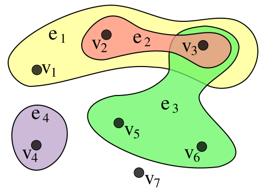

## 超图 hypergraph

[维基百科-超图](https://zh.wikipedia.org/wiki/%E8%B6%85%E5%9B%BE): 在数学中，超图（Hypergraph）是一种广义上的图。
- 不同于普通图的一条边只能连接两个顶点，超图的一条边可以连接任**意数量的顶点**。
- 超图$H$是一个集合组$H=(X,E)$，其中$X$是一个有限集合，该集合的元素被称为节点或顶点，$E$是$X$的非空子集的集合，被称为超边或连接。
- 因此，$E$是$\mathcal{P}(X)\setminus \{\emptyset\}$的一个**子集**，其中$\mathcal{P}(X)$是$X$的幂集(P(X)的全部子集为元素构成的集合)。
- 
  一个超图的例子，图示中包含了 $X = \{v_{1},v_{2},v_{3},v_{4},v_{5},v_{6},v_{7}\}$ 和 $E = \{e_{1},e_{2},e_{3},e_{4}\} = \{ \{v_{1},v_{2},v_{3}\}, \{v_{2},v_{3}\}, \{v_{3},v_{5},v_{6}\}, \{v_{4}\} \}$.
  
