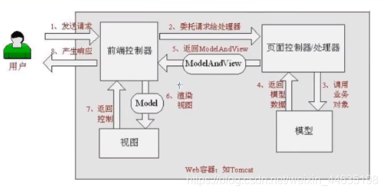

# 一. 回顾MVC

## 1.1 什么是MVC

1. 什么是MVC

   - MVC是<font color='#66ccff'>模型(Model)</font> <font color='#66ccff'>视图(View)</font> <font color='#66ccff'>控制器(Controller)</font>的简写，是一种软件设计规范

   - 是将业务逻辑, 数据, 显示分离的方法来组织代码

   - MVC主要作用是**降低了视图与业务逻辑间的双向偶合**

   - MVC不是一种设计模式，**MVC是一种架构模式**。当然不同的MVC存在差异

2. $\mathbb M \mathbb V \mathbb C$ 

   - **<font color='#66ccff'>Model（模型）</font>**： 数据模型，提供要展示的数据，因此包含数据和行为，可以认为是领域模型或JavaBean组件（包含数据和行为），不过现在一般都分离开来：Value Object（数据 Dao） 和 服务层（行为 Service）。
     - 也就是模型提供了模型数据查询和模型数据的状态更新等功能，包括数据和业务
     - <font color='green'>DAO : Data Access Object</font> 

   - **<font color='#66ccff'>View（视图）</font>**：负责进行模型的展示，一般就是我们见到的用户界面，客户想看到的东西
   - **<font color='#66ccff'>Controller（控制器）</font>**：接收用户请求，委托给模型进行处理（状态改变），处理完毕后把返回的模型数据返回给视图，由视图负责展示。也就是说控制器做了个调度员的工作

   - **最典型的MVC就是JSP + servlet + javabean的模式** 

   -  

## 1.2 Model1时代

- 在web早期的开发中，通常采用的都是Model1

- Model1中，主要分为两层，视图层(jsp)和模型层(servlet)

  -  

  - Model1优点：架构简单，比较适合小型项目开发；
  - Model1缺点：JSP职责不单一，职责过重，不便于维护；

## 1.3 Model2时代

1. Model2把一个项目分成三部分，包括**视图 控制 模型。** 

2. 处理流程: 

   -  

   1. 用户发请求 
   1. Servlet接收请求数据，并调用对应的业务逻辑方法 
   1. 业务处理完毕，返回更新后的数据给servlet 
   1. servlet转向到JSP，由JSP来渲染页面 
   1. 响应给前端更新后的页面


2. **职责分析：**
   - **Controller：控制器**
     1. 取得表单数据 
     1. 调用业务逻辑 
     1. 转向指定的页面

   - **Model：模型**
     1. 业务逻辑 
     2. 保存数据的状态
   - **View：视图**
     1. 显示页面

- Model2这样不仅提高的代码的复用率与项目的扩展性，且大大降低了项目的维护成本。Model 1模式的实现比较简单，适用于快速开发小规模项目，Model1中JSP页面身兼View和Controller两种角色，将控制逻辑和表现逻辑混杂在一起，从而导致代码的重用性非常低，增加了应用的扩展性和维护的难度。Model2消除了Model1的缺点。

## 1.4 回顾Servlet

1. Servlet使用步骤

   1.  新建一个Maven工程当做父工程pom依赖 
      
      ```xml
      <dependencies>
          <dependency>
              <groupId>junit</groupId>
              <artifactId>junit</artifactId>
              <version>4.12</version>
          </dependency>
      
          <dependency>
              <groupId>org.springframework</groupId>
              <artifactId>spring-webmvc</artifactId>
              <version>5.1.9.RELEASE</version>
          </dependency>
      
          <dependency>
              <groupId>javax.servlet</groupId>
              <artifactId>servlet-api</artifactId>
              <version>2.5</version>
          </dependency>
      
          <dependency>
              <groupId>javax.servlet.jsp</groupId>
              <artifactId>jsp-api</artifactId>
              <version>2.2</version>
          </dependency>
      
          <dependency>
              <groupId>javax.servlet</groupId>
              <artifactId>jstl</artifactId>
              <version>1.2</version>
          </dependency>
      </dependencies>  
      ```

   2. 建立一个Moudle：`springmvc-01-servlet` ， 添加Web app的支持  

   3. 导入servlet 和 jsp 的 jar 依赖 

      ```xml
      <dependency>
      	<groupId>javax.servlet</groupId>
      	<artifactId>servlet-api</artifactId>
      	<version>2.5</version>
      </dependency>
      
      <dependency>
      	<groupId>javax.servlet.jsp</groupId>
      	<artifactId>jsp-api</artifactId>
      	<version>2.2</version>
      </dependency>  
      ```

   4. 编写一个Servlet类，用来处理用户的请求 

      ```java
      package com.yj.servlet;
      
      //实现Servlet接口
      public class HelloServlet extends HttpServlet {
         @Override
         protected void doGet(HttpServletRequest req, HttpServletResponse resp) throws ServletException, IOException {
             //取得参数
             String method = req.getParameter("method");
             if (method.equals("add")){
                 req.getSession().setAttribute("msg","执行了add方法");
            }
             if (method.equals("delete")){
                 req.getSession().setAttribute("msg","执行了delete方法");
            }
             //业务逻辑
             //视图跳转
             req.getRequestDispatcher("/WEB-INF/jsp/hello.jsp").forward(req,resp);
        }
      
         @Override
         protected void doPost(HttpServletRequest req, HttpServletResponse resp) throws ServletException, IOException {
             doGet(req,resp);
        }
      }
      ```
   
   
   5. 编写Hello.jsp，在WEB-INF目录下新建一个jsp的文件夹，新建hello.jsp 
   
      ```jsp
      <%@ page contentType="text/html;charset=UTF-8" language="java" %>
      <html>
          <head>
             <title>Kuangshen</title>
          </head>
          
          <body>
          	${msg}
          </body>
      </html>
      ```
   
   6. 在web.xml中注册Servlet 
   
       ```xml
       <?xml version="1.0" encoding="UTF-8"?>
       <web-app xmlns="http://xmlns.jcp.org/xml/ns/javaee"
                xmlns:xsi="http://www.w3.org/2001/XMLSchema-instance"
                xsi:schemaLocation="http://xmlns.jcp.org/xml/ns/javaee
                                    http://xmlns.jcp.org/xml/ns/javaee/web-app_4_0.xsd"
                version="4.0">
           <servlet>
               <servlet-name>HelloServlet</servlet-name>
               <servlet-class>com.kuang.servlet.HelloServlet</servlet-class>
           </servlet>
       
           <servlet-mapping>
               <servlet-name>HelloServlet</servlet-name>
               <url-pattern>/user</url-pattern>
           </servlet-mapping>
       </web-app>  
       ```
   
   
   7. 配置Tomcat，并启动测试 
   
      - `localhost:8080/user?method=add` 
   
      - `localhost:8080/user?method=delete` 
   
2. **MVC框架要做哪些事情**
   1. 将url映射到java类或java类的方法 . 
   1. 封装用户提交的数据 . 
   1. 处理请求–调用相关的业务处理–封装响应数据 . 
   1. 将响应的数据进行渲染 . jsp / html 等表示层数据 .


3. **说明：**
   - 常见的服务器端MVC框架有：`Struts` `Spring MVC` `ASP.NET MVC` `Zend Framework` `JSF`；
   - 常见前端MVC框架：`vue` `angularjs` `react` `backbone`；
   - 由MVC演化出了另外一些模式如：`MVP` `MVVM` 等等…
     - MVVM : M+V+VM   *ViewModel 双向绑定*

# 二. 什么是SpringMVC

## 2.1 概述


1. Spring MVC是Spring Framework的一部分，是基于Java实现MVC的轻量级Web框架。
   - 官方文档： [https://docs.spring.io/spring/docs/5.2.0.RELEASE/spring-framework-reference/web.html#spring-web](https://docs.spring.io/spring/docs/5.2.0.RELEASE/spring-framework-reference/web.html#spring-web)

2. Spring MVC的==特点==：
   1. 轻量级，简单易学 
   2. 高效 , 基于请求响应的MVC框架 
   3. 与Spring兼容性好，无缝结合 
   4. 约定优于配置 
   5. 功能强大：RESTful 数据验证 格式化 本地化 主题等 
   6. 简洁灵活

3. Spring的web框架围绕**DispatcherServlet** [ 调度Servlet ] 设计。
   - DispatcherServlet的作用是将请求分发到不同的处理器。从Spring 2.5开始，使用Java 5或者以上版本的用户可以采用基于注解形式进行开发，十分简洁；

4. SpringMVC好 , 简单 , 便捷 , 易学 , 天生和Spring无缝集成(使用SpringIOC和AOP) ; 使用约定优于配置; 能够进行简单的junit测试 . 支持Restful风格; 异常处理 , 本地化 , 国际化 , 数据验证 , 类型转换 , 拦截器 等等…

## 2.2 中心控制器

- Spring的web框架围绕`DispatcherServlet`设计。DispatcherServlet的作用是将请求==分发==到不同的处理器。
- 从Spring 2.5开始，使用Java 5或者以上版本的用户可以采用基于注解的controller声明方式。


 

Spring MVC框架像许多其他MVC框架一样, **以请求为驱动** , **围绕一个中心Servlet分派请求及提供其他功能**，**DispatcherServlet是一个实际的Servlet (它继承自HttpServlet 基类)**。

- SpringMVC的原理如下图所示： 当发起请求时被前置的控制器拦截到请求，根据请求参数生成代理请求，找到请求对应的实际控制器，控制器处理请求，创建数据模型，访问数据库，将模型响应给中心控制器，控制器使用模型与视图渲染视图结果，将结果返回给中心控制器，再将结果返回给请求者

   

## 2.3 SpringMVC执行原理

  

图为SpringMVC的一个较完整的流程图，**实线**表示SpringMVC框架提供的技术，不需要开发者实现，**虚线**表示需要开发者实现。

**简要分析执行流程**

1. ①`DispatcherServlet`表示**前置控制器**，是整个SpringMVC的控制中心。用户发出请求，DispatcherServlet接收请求并拦截请求
   - 假设请求的url为 : `http://localhost:8080/SpringMVC/hello` 
   - **如上url拆分成三部分：**
     - `http://localhost:8080`  :  ==服务器域名== 
     - `SpringMVC`  :  部署在服务器上的==web站点== 
     - `hello`  :  表示==控制器== 
   - 如上url表示为：请求位于服务器localhost:8080上的SpringMVC站点的hello控制器。

2. 处理器部分

   1. `HandlerMapping`为处理器映射。

      ②`DispatcherServlet`调用`HandlerMapping`,`HandlerMapping`根据请求url查找`Handler`(`HandlerExecution`)

   2. ③`HandlerExecution`表示**具体**的Handler, 主要作用是根据url查找控制器 (如上url被查找控制器为：hello)

   3. ④`HandlerExecution`将==解析后==的信息传递给`DispatcherServlet`(如解析控制器映射等)

3. 模型和视图处理

   1. ⑤`HandlerAdapter`表示处理器适配器，其按照特定的规则去==执行==Handler
   2. ⑥Handler由==具体==的`Controller`执行
   3. ⑦`Controller`将具体的==执行信息返回==给`HandlerAdapter` (如ModelAndView) 
   4. ⑧`HandlerAdapter`将**视图逻辑名**或**模型**传递给`DispatcherServlet`

4. 视图

   1. ⑨`DispatcherServlet`调用视图解析器(`ViewResolver`)来==解析==`HandlerAdapter`传递的逻辑==视图名==
   2. ⑩视图解析器将解析的逻辑视图名传给`DispatcherServlet`
   3. ⑪`DispatcherServlet`根据视图解析器解析的视图结果，==调用具体的视图==

5. ⑫最终视图呈现给用户

# 三. 第一个MVC程序

## 3.1 配置版

> 只是用于理解执行原理

1. 新建一个Moudle ， springmvc-02-hello ， 添加web的支持  

2. 确定导入了SpringMVC 的依赖  

3.  配置web.xml ， 注册DispatcherServlet 
   
   ```xml
   <?xml version="1.0" encoding="UTF-8"?>
   <web-app xmlns="http://xmlns.jcp.org/xml/ns/javaee"
           xmlns:xsi="http://www.w3.org/2001/XMLSchema-instance"
           xsi:schemaLocation="http://xmlns.jcp.org/xml/ns/javaee http://xmlns.jcp.org/xml/ns/javaee/web-app_4_0.xsd"
           version="4.0">
   
      <!--1.注册DispatcherServlet-->
      <servlet>
          <servlet-name>springmvc</servlet-name>
          <servlet-class>org.springframework.web.servlet.DispatcherServlet</servlet-class>
          <!--关联一个springmvc的配置文件:【servlet-name】-servlet.xml-->
          <init-param>
              <param-name>contextConfigLocation</param-name>
              <param-value>classpath:springmvc-servlet.xml</param-value>
          </init-param>
          <!--启动级别-1-->
          <load-on-startup>1</load-on-startup>
      </servlet>
   
      <servlet-mapping>
          <servlet-name>springmvc</servlet-name>
          <!--/ 匹配所有的请求；（不包括.jsp）-->
      	   <!--/* 匹配所有的请求；（包括.jsp）-->
          <url-pattern>/</url-pattern>
      </servlet-mapping>
   
   </web-app>  
   ```
   
   

4.  编写SpringMVC 的 配置文件名称：springmvc-servlet.xml : [servletname]-servlet.xml 说明，这里的名称要求是按照官方来的 
    
    ```xml
    <?xml version="1.0" encoding="UTF-8"?>
    <beans xmlns="http://www.springframework.org/schema/beans"
    xmlns:xsi="http://www.w3.org/2001/XMLSchema-instance"
    xsi:schemaLocation="http://www.springframework.org/schema/beans
    http://www.springframework.org/schema/beans/spring-beans.xsd">
    
    </beans>  
    ```

5. 添加 处理映射器（可省略） 

   ```xml
   <bean class="org.springframework.web.servlet.handler.BeanNameUrlHandlerMapping"/>  
   <!--这个处理器只在原理讲解时使用-->
   ```

6. 添加 处理器适配器（可省略） 

   ```xml
   <bean class="org.springframework.web.servlet.mvc.SimpleControllerHandlerAdapter"/>  
   ```

7. 添加 视图解析器

   ```xml
   <!--视图解析器:DispatcherServlet给他的ModelAndView-->
   <bean class="org.springframework.web.servlet.view.InternalResourceViewResolver" id="InternalResourceViewResolver">
      <!--前缀-->
      <property name="prefix" value="/WEB-INF/jsp/"/>
      <!--后缀-->
      <property name="suffix" value=".jsp"/>
   </bean>
   ```

8. 编写我们要操作业务Controller ，要么实现Controller接口，要么增加注解；需要返回一个ModelAndView，装数据，封视图； 

   ```java
   package com.yj.controller;
   
   import org.springframework.web.servlet.ModelAndView;
   import org.springframework.web.servlet.mvc.Controller;
   
   import javax.servlet.http.HttpServletRequest;
   import javax.servlet.http.HttpServletResponse;
   
   //注意：这里我们先导入Controller接口
   public class HelloController implements Controller {
   
       public ModelAndView handleRequest(HttpServletRequest request, HttpServletResponse response) throws Exception {
           //ModelAndView 模型和视图
           ModelAndView mv = new ModelAndView();
   
           //封装对象，放在ModelAndView中。Model
           mv.addObject("msg","HelloSpringMVC!");
           //封装要跳转的视图，放在ModelAndView中
           mv.setViewName("hello"); //自动拼接为: /WEB-INF/jsp/hello.jsp
           return mv;
       }
   }
   ```

9. 将自己的类交给SpringIOC容器，注册bean 

   ```xml
   <!--Handler-->
   <bean id="/hello" class="com.yj.controller.HelloController"/>
   ```

10. 写要跳转的jsp页面，显示ModelandView存放的数据，以及我们的正常页面；

    ```jsp
    <%@ page contentType="text/html;charset=UTF-8" language="java" %>
    <html>
    <head>
        <title>Jin</title>
    </head>
    <body>
        ${msg}
    </body>
    </html>
    ```
11. 配置Tomcat 启动测试 

     

**可能遇到的问题：访问出现404，排查步骤：**

1. 查看控制台输出，看一下是不是缺少了什么jar包
2. 如果jar包存在，显示无法输出，就在IDEA的项目发布中，添加lib依赖 
3. 重启Tomcat 即可解决

小结：我们来看个注解版实现，这才是SpringMVC的精髓。

## 3.2 注解版

> 配置版痛点在于 添加Controller时还需要到xml中去配置(注册)Controller
>
> 改为注解之后 添加Controller只需要写一个方法+一个注解

1. 新建一个Moudle，springmvc-03-hello-annotation 。添加web支持  

2. 由于Maven可能存在资源过滤的问题，我们将配置完善 

   ```xml
   <build>
   <resources>
       <resource>
           <directory>src/main/java</directory>
           <includes>
               <include>**/*.properties</include>
               <include>**/*.xml</include>
           </includes>
           <filtering>false</filtering>
       </resource>
       <resource>
           <directory>src/main/resources</directory>
           <includes>
               <include>**/*.properties</include>
               <include>**/*.xml</include>
           </includes>
           <filtering>false</filtering>
       </resource>
   </resources>
   </build>  
   ```

3. 在pom.xml文件引入相关的依赖：主要有Spring框架核心库 Spring MVC servlet , JSTL等。(我们在父依赖中已经引入了)

4. 配置web.xml 注意点： 

   ```xml
   <?xml version="1.0" encoding="UTF-8"?>
   <web-app xmlns="http://xmlns.jcp.org/xml/ns/javaee"
           xmlns:xsi="http://www.w3.org/2001/XMLSchema-instance"
           xsi:schemaLocation="http://xmlns.jcp.org/xml/ns/javaee http://xmlns.jcp.org/xml/ns/javaee/web-app_4_0.xsd"
           version="4.0">
   
      <!--1.注册servlet-->
      <servlet>
          <servlet-name>SpringMVC</servlet-name>
          <servlet-class>org.springframework.web.servlet.DispatcherServlet</servlet-class>
          <!--通过初始化参数指定SpringMVC配置文件的位置，进行关联-->
          <init-param>
              <param-name>contextConfigLocation</param-name>
              <!--默认的是在/WEB-INF/applicationContext.xml-->
              <param-value>classpath:springmvc-servlet.xml</param-value>
          </init-param>
          <!-- 启动顺序，数字越小，启动越早 -->
          <load-on-startup>1</load-on-startup>
      </servlet>
   
      <!--所有请求都会被springmvc拦截 -->
      <servlet-mapping>
          <servlet-name>SpringMVC</servlet-name>
          <url-pattern>/</url-pattern>
      </servlet-mapping>
   
   </web-app>  
   ```

5. / 和 /* 的区别： 
   - `< url-pattern > / </ url-pattern >` 不会匹配到.jsp， 只针对我们编写的请求；即：.jsp 不会进入spring的 DispatcherServlet类 。
   - `< url-pattern > /* </ url-pattern >` 会匹配 *.jsp，会出现返回 jsp视图 时再次进入spring的DispatcherServlet 类，导致找不到对应的controller所以报404错。

6. 添加Spring MVC配置文件 在resource目录下添加springmvc-servlet.xml配置文件，配置的形式与Spring容器配置基本类似，为了支持基于注解的IOC，设置了自动扫描包的功能，具体配置信息如下： 

   ```xml
   <?xml version="1.0" encoding="UTF-8"?>
   <beans xmlns="http://www.springframework.org/schema/beans"
          xmlns:xsi="http://www.w3.org/2001/XMLSchema-instance"
          xmlns:context="http://www.springframework.org/schema/context"
          xmlns:mvc="http://www.springframework.org/schema/mvc"
          xsi:schemaLocation="http://www.springframework.org/schema/beans
          http://www.springframework.org/schema/beans/spring-beans.xsd
          http://www.springframework.org/schema/context
          https://www.springframework.org/schema/context/spring-context.xsd
          http://www.springframework.org/schema/mvc
          https://www.springframework.org/schema/mvc/spring-mvc.xsd">
   
       <!-- 自动扫描包，让指定包下的注解生效,由IOC容器统一管理 -->
       <context:component-scan base-package="com.yj.controller"/>
   
       <!-- 让Spring MVC不处理静态资源 -->
       <mvc:default-servlet-handler />
       <!--
       支持mvc注解驱动
           在spring中一般采用@RequestMapping注解来完成映射关系
           要想使@RequestMapping注解生效
           必须向上下文中注册DefaultAnnotationHandlerMapping
           和一个AnnotationMethodHandlerAdapter实例
           这两个实例分别在类级别和方法级别处理。
           而annotation-driven配置帮助我们自动完成上述两个实例的注入。
        -->
       <mvc:annotation-driven />
   
       <!-- 视图解析器 -->
       <bean class="org.springframework.web.servlet.view.InternalResourceViewResolver"
             id="internalResourceViewResolver">
           <!-- 前缀 -->
           <property name="prefix" value="/WEB-INF/jsp/" />
           <!-- 后缀 -->
           <property name="suffix" value=".jsp" />
       </bean>
   
   </beans>
   ```

   在视图解析器中我们把所有的视图都存放在/WEB-INF/目录下，这样可以保证视图安全，因为这个目录下的文件，客户端不能直接访问。

   - 让IOC的注解生效 
   - 静态资源过滤 ：HTML . JS . CSS . 图片 ， 视频 … 


       - MVC的注解驱动 


       - 配置视图解析器 

7. 创建Controller 编写一个Java控制类：com.yj.controller.HelloController , 注意编码规范 

   ```java
   package com.yj.controller;
   
   import org.springframework.stereotype.Controller;
   import org.springframework.ui.Model;
   import org.springframework.web.bind.annotation.RequestMapping;
   
   import javax.annotation.Resources;
   
   /**
    * @Author yJade
    * @Date 2023-01-09 17:33
    * @Package com.yj.controller
    */
   
   @Controller
   @RequestMapping("/hello")
   public class HelloController {
   
       //真实访问地址: http://localhost:8080/springmvc-03-annotation/hello/h1
       @RequestMapping("/h1")
       public String hello1(Model model) {
           //封装数据
           model.addAttribute("msg", "Hello, SpringMVCAnnotation");
           return "hello";     //会被视图解析器处理
       }
       
   }
   ```

     - `@Controller`是为了让Spring IOC容器初始化时自动扫描到； 
     - `@RequestMapping`是为了映射请求路径，这里因为类与方法上都有映射所以访问时应该是 `hello/h1`； 
     - 方法中声明Model类型的参数是为了把Action中的数据带到视图中； 
     - 方法返回的结果是视图的名称hello，加上配置文件中的前后缀变成`WEB-INF/jsp/hello.jsp` 

8. 创建视图层 

   在`WEB-INF/jsp`目录中创建hello.jsp ， 视图可以直接取出并展示从Controller带回的信息； 

   可以通过EL表示取出Model中存放的值，或者对象；

7.  配置Tomcat运行 配置Tomcat ， 开启服务器 ， 访问 对应的请求路径  OK，运行成功 

## 小结

- 实现步骤其实非常的简单：
  1. 新建一个web项目 
  2. 导入相关jar包 
  3. 编写web.xml , 注册DispatcherServlet 
  4. 编写springmvc配置文件 
  5. 接下来就是去创建对应的控制类 , controller 
  6. 最后完善前端视图和controller之间的对应 
     - <font color='orange'>视图解析器根据Controller类的方法return的String 解析匹配jsp资源</font>
  7. 测试运行调试.

使用springMVC必须配置的三大件

**①处理器映射器  ②处理器适配器  ③视图解析器**

通常，我们只需要手动配置视图解析器，而处理器映射器和处理器适配器只需要开启注解驱动即可，而省去了大段的xml配置

# 四. RestFul和控制器

## 4.1 控制器Controller

-  控制器复杂提供访问应用程序的行为，通常通过接口定义或注解定义两种方法实现 
-  控制器负责解析用户的请求并将其转换为一个模型 
-  在Spring MVC中一个控制器类可以包含多个方法  
-  在Spring MVC中，对于Controller的配置方式有很多种 

## 4.2 使用方法1 实现Controller接口 -已淘汰

1. Controller是一个<font color='#66ccff'>接口</font>，在`org.springframework.web.servlet.mvc`包下，接口中只有一个方法；

   ```java
   //实现该接口的类获得控制器功能
   public interface Controller {
      
      //处理请求且返回一个模型与视图对象
      ModelAndView handleRequest(HttpServletRequest var1, HttpServletResponse var2) throws Exception;
   }
   ```

2. **测试**

   1.  新建一个Moudle，`springmvc-04-controller`
       - web.xml 配置DispatcherServlet
       - springmvc-servlet.xml 配置视图解析器和注解
   4. 编写一个Controller类，`ControllerTest1` 

      ```java
      public class ControllerTest1 implements Controller {
      
          @Override
          public ModelAndView handleRequest(HttpServletRequest httpServletRequest, HttpServletResponse httpServletResponse) throws Exception {
              ModelAndView mv = new ModelAndView();
      
              mv.addObject("msg", "This is ControllerTest1");
              mv.setViewName("test");
              return null;
          }
      }
      ```


5. 编写完毕后，去Spring配置文件中注册请求的bean；name对应请求路径，class对应处理请求的类 

   ```xml
   <bean name="/t1" class="com.yj.controller.ControllerTest1"/>  
   ```

6. 编写前端test.jsp，注意在WEB-INF/jsp目录下编写，对应我们的视图解析器 

   ```jsp
   <%@ page contentType="text/html;charset=UTF-8" language="java" %>
   <html>
   <head>
       <title>Title</title>
   </head>
   <body>
   	${msg}
   </body>
   </html>
   ```
7.  配置Tomcat运行测试

**说明：**

-  实现接口Controller定义控制器是较老的办法  
-  缺点是：一个控制器`Controller类`中只有一个方法(<font color='orange'>函数式接口</font>)，如果要多个方法则需要定义多个Controller, 并配置多个url的bean；定义的方式比较麻烦； 

## 4.3 使用方法2 注解`@Controller` *

- @Controller注解类型用于声明Spring类的实例是一个控制器（在讲IOC时还提到了另外3个注解）；

  | 注解          |            |
  | ------------- | ---------- |
  | `@Component`  | 组件       |
  | `@Service`    | service    |
  | `@Controller` | controller |
  | `@Repository` | dao        |

- Spring可以使用扫描机制来找到应用程序中所有基于注解的控制器类，为了保证Spring能找到你的控制器，需要在配置文件中声明组件扫描

  ```xml
  <!-- 自动扫描指定的包，下面所有注解类交给IOC容器管理 -->
  <context:component-scan base-package="com.yj.controller"/>  
  ```

-  增加一个ControllerTest2类，使用注解实现

   ```java
   @Controller //代表这个类会被Spring接管
   // 这个被注解的类中的所有方法的 String返回值会被视图解析器解析 跳转到页面
   public class ControllerTest2 {
       @RequestMapping("/t2")
       public String test1(Model model){
           model.addAttribute("msg", "This is ControllerTest2");
           return "test"; //和
       }
   }
   ```

-  运行tomcat测试  

**可以发现，我们的两个请求都可以指向一个视图(test)，但是页面结果的结果是不一样的，从这里可以看出视图是被复用的，而控制器与视图之间是弱偶合关系。**

**注解方式是平时使用的最多的方式**

## 4.4 `@RequestMapping` 说明

1. `@RequestMapping`注解用于映射url到控制器类或一个特定的处理程序方法。

   -  可用于类或方法上。用于类上，表示类中的所有响应请求的方法都是以该地址作为==父路径== 

2. 为了测试结论更加准确，我们可以加上一个项目名测试 myweb  

3. 只注解在方法上面

  ```java
  @Controller 
  public class ControllerTest2 {
      @RequestMapping("/t2")
      public String test1(Model model){
          model.addAttribute("msg", "This is ControllerTest2");
          return "test";
      }
  }
  ```

  - 访问路径为 `http://localhost:8080/项目名/t2`

4. 同时注解类与方法 

   ```java
   @Controller
   @RequestMapping("/ct3")
   public class ControllerTest3 {
   
       @RequestMapping("/t1")
       public String test1() {
           return "test";
       }
   }
   ```

   - 访问路径为`http://localhost:8080/项目名/ct3/t1` 

   - 在大项目中 写在类前的`@RequestMapping`可能会被忽略 应该尽量改为

     ```java
     @Controller
     public class ControllerTest3 {
     
         @RequestMapping("/ct3/t1")
         public String test1() {
             return "test";
         }
     }
     ```

     

## 4.5 RestFul 风格

1. **概念** : Restful是一个资源定位及资源操作的<font color='#66ccff'>风格</font>。
   - 不是标准也不是协议，只是一种风格。基于这个风格设计的软件可以更简洁，更有层次，更易于实现缓存等机制。

2. **功能**
   - <font color='#66ccff'>资源</font>：互联网所有的事物都可以被抽象为资源
   - <font color='#66ccff'>资源操作</font>：使用`POST` `DELETE` `PUT` `GET`，使用不同方法对资源进行操作(<font color='orange'>分别对应 添加  删除 修改 查询</font>)

3. 对比 

   - **传统方式操作资源** ：通过不同的==参数==来实现不同的效果

     > - 方法单一，post 和 get
     >
     >   http://127.0.0.1/item/queryItem.action?id=1 查询,GET
     >
     >   http://127.0.0.1/item/saveItem.action 新增,POST
     >
     >   http://127.0.0.1/item/updateItem.action 更新,POST
     >
     >   http://127.0.0.1/item/deleteItem.action?id=1 删除,GET或POST

   - **使用RESTful操作资源** ：可以通过不同的==请求方式==来实现不同的效果

     > - 如下：请求地址一样，但是功能可以不同
     >
     >   http://127.0.0.1/item/1 查询,GET
     >
     >   http://127.0.0.1/item 新增,POST
     >
     >   http://127.0.0.1/item 更新,PUT
     >
     >   http://127.0.0.1/item/1 删除,DELETE

4. 学习&测试

   ```java
   @Controller
   public class RestFulController {
       //原先:http://localhost:8080/springmvc_04_controller/add1?a=10&p2=15
       @RequestMapping("/add1")
       public String add1(int a, int b, Model model){
           int result = a+b;
           model.addAttribute("msg", "a="+a+"; b="+b + "\t结果："+result);
           return "test";
   
       }
   
       //RestFul风格:http://localhost:8080/springmvc_04_controller/add2/2/4
       @RequestMapping("/add2/{a}/{b}")
       public String add2(@PathVariable int a, @PathVariable int b, Model model){
           int result = a+b;
           model.addAttribute("msg", "a="+a+"; b="+b + "\t结果："+result);
           return "test";
   
       }
   }
   ```

5. 使用路径变量的好处

   - 使路径变得更加简洁；

   - 获得参数更加方便，框架会自动进行类型转换。

   - 通过路径变量的类型可以约束访问参数，如果类型不一样，则访问不到对应的请求方法，如这里访问是的路径是`/add2/1/XD`，则路径与方法不匹配，而不会是参数转换失败

      

6. **使用method属性指定请求类型**

   - 用于约束请求的类型，可以收窄请求范围。
     指定请求谓词的类型如GET, POST, HEAD, OPTIONS, PUT, PATCH, DELETE, TRACE等

   - 测试:

     ```java
     @RequestMapping(value = "/add3/{a}/{b}", method = {RequestMethod.POST})
     public String add3(@PathVariable int a, @PathVariable int b, Model model){
         int result = a+b;
         model.addAttribute("msg", "a="+a+"; b="+b + "\t结果："+result);
         return "test";
     }
     ```

     - 我们使用浏览器地址栏进行访问默认是Get请求，会报错405  

     - 改为GET后正常访问

       ```java
       //    @RequestMapping(value = "/add4/{a}/{b}", method = {RequestMethod.GET})
       @GetMapping("/add4/{a}/{b}")
       public String add4(@PathVariable int a, @PathVariable int b, Model model){
           int result = a+b;
           model.addAttribute("msg", "a="+a+"; b="+b + "\t结果："+result);
           return "test";
       }
       ```

        

     

7. **小结：**

   - Spring MVC 的 @RequestMapping 注解能够处理 HTTP 请求的方法, 比如 GET, PUT, POST, DELETE 以及 PATCH。
     - **所有的地址栏请求默认都会是 HTTP GET 类型的。**

   - 方法级别的注解变体(<font color='#66ccff'>组合注解</font>)有如下几个：

     ```java
     @GetMapping
     @PostMapping
     @PutMapping
     @DeleteMapping
     @PatchMapping
     ```

     - @GetMapping 是一个组合注解，平时使用的会比较多

       它是 `@RequestMapping(method = RequestMethod.GET)` 的一个快捷方式

## 扩展：小黄鸭调试法

场景一： 我们都有过向别人（甚至可能向完全不会编程的人）提问及解释编程问题的经历，但是很多时候就在我们解释的过程中自己却想到了问题的解决方案，然后对方却一脸茫然。 

场景二：你的同行跑来问你一个问题，但是当他自己把问题说完，或说到一半的时候就想出答案走了，留下一脸茫然的你。

其实上面两种场景现象就是所谓的小黄鸭调试法（Rubber Duck Debuging），又称橡皮鸭调试法，它是我们软件工程中最常使用调试方法之一。


此概念据说来自《程序员修炼之道》书中的一个故事，传说程序大师随身携带一只小黄鸭，在调试代码的时候会在桌上放上这只小黄鸭，然后详细地向鸭子解释每行代码，然后很快就将问题定位修复了。

# 五. 结果跳转方式

## 5.1 ModelAndView

设置ModelAndView对象 , 根据view的名称 , 和视图解析器跳到指定的页面

页面 : {视图解析器前缀} + viewName +{视图解析器后缀}

```java
<!-- 视图解析器 -->
<bean class="org.springframework.web.servlet.view.InternalResourceViewResolver"
     id="internalResourceViewResolver">
   <!-- 前缀 -->
   <property name="prefix" value="/WEB-INF/jsp/" />
   <!-- 后缀 -->
   <property name="suffix" value=".jsp" />
</bean>
```

对应的controller类

```java
public class ControllerTest1 implements Controller {
    
   public ModelAndView handleRequest(HttpServletRequest httpServletRequest, HttpServletResponse httpServletResponse) throws Exception {
       //返回一个模型视图对象
       ModelAndView mv = new ModelAndView();
       mv.addObject("msg","ControllerTest1");
       mv.setViewName("test");
       return mv;
  }
}
```

## 5.2 ServletAPI –

通过设置ServletAPI , 不需要视图解析器

1.  通过HttpServletResponse进行输出  
2.  通过HttpServletResponse实现重定向  
3.  通过HttpServletResponse实现转发 

```java
@Controller
public class ResultGo {

   @RequestMapping("/result/t1")
   public void test1(HttpServletRequest req, HttpServletResponse rsp) throws IOException {
       rsp.getWriter().println("Hello,Spring BY servlet API");
  }

   @RequestMapping("/result/t2")
   public void test2(HttpServletRequest req, HttpServletResponse rsp) throws IOException {
       rsp.sendRedirect("/index.jsp");
  }

   @RequestMapping("/result/t3")
   public void test3(HttpServletRequest req, HttpServletResponse rsp) throws Exception {
       //转发
       req.setAttribute("msg","/result/t3");
       req.getRequestDispatcher("/WEB-INF/jsp/test.jsp").forward(req,rsp);
  }
}
```

## 5.3 SpringMVC

1. **通过SpringMVC来实现转发和重定向 - 无需视图解析器；**

   - 测试前，需要将视图解析器注释掉
   - 默认为forward转发（==也可以加上==） 

   - redirect转发需特别加

   - ```java
     @Controller
     public class ResultSpringMVC {
        
        @RequestMapping("/rsm/t1")
        public String test1(){
            return "/WEB-INF/jsp/index.jsp"; 		//转发 但是不需要视图解析器
       }
     
        @RequestMapping("/rsm/t2")
        public String test2(){
            return "forward:/index.jsp";	//转发二
       }
     
        @RequestMapping("/rsm/t3")
        public String test3(){
            return "redirect:/index.jsp";	//重定向
       }
     }
     ```

2. **通过SpringMVC来实现转发和重定向 - 有视图解析器；**

   - 重定向 , 不需要视图解析器 , 本质就是重新请求一个新地方嘛 , 所以注意路径问题.

   - 可以重定向到另外一个请求实现 .

   - 默认为forward转发（==不可以加上==） 

   - redirect转发需特别加

   - ```java
     @Controller
     public class ResultSpringMVC2 {
        
        @RequestMapping("/rsm2/t1")
        public String test1(){
            return "test";       //转发
       }
     
        @RequestMapping("/rsm2/t2")
        public String test2(){
            return "redirect:/index.jsp";       //重定向
            //return "redirect:hello.do"; //hello.do为另一个请求/
       }
     }
     ```

     

# 六. 数据处理

## 6.1 处理提交数据

1. 提交的域名称和处理方法的参数名一致

   - 提交数据 : http://localhost:8080/hello?name=kuangshen

   - 处理方法 :

     ```java
     @RequestMapping("/hello")
     public String hello(String name){
        
        System.out.println(name);
        return "hello";
     }
     ```

   - 后台输出 : kuangshen

2. 提交的域名称和处理方法的参数名不一致

   - 提交数据 : http://localhost:8080/hello?username=kuangshen

   - 处理方法 :

     ```java
     //@RequestParam("username") : username提交的域的名称 .
     @RequestMapping("/hello")
     public String hello(@RequestParam("username") String name){
        
        System.out.println(name);
        return "hello";
     }
     ```

   - 后台输出 : kuangshen

3. 提交的是一个对象

   - 要求提交的表单域和对象的属性名一致 , 参数使用对象即可

   1.  实体类 
       
       ```java
      @Data
      @AllArgsConstructor
      @NoArgsConstructor
      public class User {
          private int id;
          private String name;
          private int age;
      }
      ```
      
      - lombok插件 简化代码

   2.  提交数据 : http://localhost:8080/mvc04/user?name=kuangshen&id=1&age=15  

   3. 处理方法

      ```java
      //http://localhost:8080/mvc04/user?name=kuangshen&id=1&age=15  
      //前端接收一个对象 id, name, age
      @GetMapping("/t2")
      public String test2(User user) {
          System.out.println(user);
          return "test";
      }
      ```

      - 后台输出 : User { id=1, name=‘kuangshen’, age=15 }

   - 说明：如果使用对象的话，前端传递的参数名和对象名必须一致，否则就是null。

## 6.2 数据显示到前端

1. 通过ModelAndView (<font color='orange'>之前一直用的方式</font>)

   ```java
   public class ControllerTest1 implements Controller {
      public ModelAndView handleRequest(HttpServletRequest httpServletRequest, HttpServletResponse httpServletResponse) throws Exception {
      
          //返回一个模型视图对象
          ModelAndView mv = new ModelAndView();
          mv.addObject("msg","ControllerTest1");
          mv.setViewName("test");
          return mv;
     }
   }
   ```
   
2. 通过ModelMap
    ```java
    @RequestMapping("/hello")
    public String hello(@RequestParam("username") String name, ModelMap modelMap){
    
       //封装要显示到视图中的数据
       //相当于req.setAttribute("name",name);
       modelMap.addAttribute("name",name);
       System.out.println(name);
       return "hello";
    }
    ```

3. 通过Model
    ```java
    @RequestMapping("/ct2/hello")
    public String hello(@RequestParam("username") String name, Model model){
    
       //封装要显示到视图中的数据
       //相当于req.setAttribute("name",name);
       model.addAttribute("msg",name);
       System.out.println(name);
       return "test";
    }
    ```

4. 对比 (仅使用区别)

   - Model 只有寥寥几个方法只适合用于储存数据，简化了新手对于Model对象的操作和理解； <font color='#EE0000'>常用</font> 

   - ModelMap 继承了 LinkedMap ，除了实现了自身的一些方法，同样的继承 LinkedMap 的方法和特性；

   - ModelAndView 可以在储存数据的同时，可以进行设置返回的逻辑视图，进行控制展示层的跳转。

​	当然更多的以后开发考虑的更多的是性能和优化，就不能单单仅限于此的了解。

> **请使用80%的时间打好扎实的基础，剩下18%的时间研究框架，2%的时间去学点英文，框架的官方文档永远是最好的教程。**

# 七. 乱码问题

1. 测试步骤：

    1. 我们可以在首页编写一个提交的表单

       ```html
       <form action="/e/t" method="post">
        <input type="text" name="name">
        <input type="submit">
       </form>

       12345
       ```

    2. 后台编写对应的处理类

       ```java
       @Controller
       public class Encoding {
          @RequestMapping("/e/t")
          public String test(Model model,String name){
              model.addAttribute("msg",name); //获取表单提交的值
              return "test"; //跳转到test页面显示输入的值
         }
       }

       123456789
       ```

    3. 输入中文测试，发现乱码

        

不得不说，乱码问题是在我们开发中十分常见的问题，也是让我们程序猿比较头大的问题

2. 以前乱码问题通过过滤器解决 , 而SpringMVC给我们提供了一个过滤器 , 可以在web.xml中配置
   - ==修改了xml文件需要重启服务器==

    ```xml
    <filter>
       <filter-name>encoding</filter-name>
       <filter-class>org.springframework.web.filter.CharacterEncodingFilter</filter-class>
       <init-param>
           <param-name>encoding</param-name>
           <param-value>utf-8</param-value>
       </init-param>
    </filter>
   
    <filter-mapping>
       <filter-name>encoding</filter-name>
       <url-pattern>/* </url-pattern>
    </filter-mapping>
    ```
   
   - 注意：这里写/*，写/的话过滤不了jsp页面，不能解决乱码

但是我们发现 , 有些极端情况下.这个过滤器对get的支持不好 .

**处理方法** :

1.  修改tomcat配置文件 ：设置编码 

    ```xml
    <Connector URIEncoding="utf-8" port="8080" protocol="HTTP/1.1"
          connectionTimeout="20000"
          redirectPort="8443" />  
    ```

2.  自定义过滤器（万能解决）

    ```java
    package com.kuang.filter;
    
    import javax.servlet.*;
    import javax.servlet.http.HttpServletRequest;
    import javax.servlet.http.HttpServletRequestWrapper;
    import javax.servlet.http.HttpServletResponse;
    import java.io.IOException;
    import java.io.UnsupportedEncodingException;
    import java.util.Map;
    
    /**
    * 解决get和post请求 全部乱码的过滤器
    */
    public class GenericEncodingFilter implements Filter {
    
       @Override
       public void destroy() {
      }
    
       @Override
       public void doFilter(ServletRequest request, ServletResponse response, FilterChain chain) throws IOException, ServletException {
           //处理response的字符编码
           HttpServletResponse myResponse=(HttpServletResponse) response;
           myResponse.setContentType("text/html;charset=UTF-8");
    
           // 转型为与协议相关对象
           HttpServletRequest httpServletRequest = (HttpServletRequest) request;
           // 对request包装增强
           HttpServletRequest myrequest = new MyRequest(httpServletRequest);
           chain.doFilter(myrequest, response);
      }
    
       @Override
       public void init(FilterConfig filterConfig) throws ServletException {
      }
    
    }
    
    //自定义request对象，HttpServletRequest的包装类
    class MyRequest extends HttpServletRequestWrapper {
    
       private HttpServletRequest request;
       //是否编码的标记
       private boolean hasEncode;
       //定义一个可以传入HttpServletRequest对象的构造函数，以便对其进行装饰
       public MyRequest(HttpServletRequest request) {
           super(request);// super必须写
           this.request = request;
      }
    
       // 对需要增强方法 进行覆盖
       @Override
       public Map getParameterMap() {
           // 先获得请求方式
           String method = request.getMethod();
           if (method.equalsIgnoreCase("post")) {
               // post请求
               try {
                   // 处理post乱码
                   request.setCharacterEncoding("utf-8");
                   return request.getParameterMap();
              } catch (UnsupportedEncodingException e) {
                   e.printStackTrace();
              }
          } else if (method.equalsIgnoreCase("get")) {
               // get请求
               Map<String, String[]> parameterMap = request.getParameterMap();
               if (!hasEncode) { // 确保get手动编码逻辑只运行一次
                   for (String parameterName : parameterMap.keySet()) {
                       String[] values = parameterMap.get(parameterName);
                       if (values != null) {
                           for (int i = 0; i < values.length; i++) {
                               try {
                                   // 处理get乱码
                                   values[i] = new String(values[i]
                                          .getBytes("ISO-8859-1"), "utf-8");
                              } catch (UnsupportedEncodingException e) {
                                   e.printStackTrace();
                              }
                          }
                      }
                  }
                   hasEncode = true;
              }
               return parameterMap;
          }
           return super.getParameterMap();
      }
    
       //取一个值
       @Override
       public String getParameter(String name) {
           Map<String, String[]> parameterMap = getParameterMap();
           String[] values = parameterMap.get(name);
           if (values == null) {
               return null;
          }
           return values[0]; // 取回参数的第一个值
      }
    
       //取所有值
       @Override
       public String[] getParameterValues(String name) {
           Map<String, String[]> parameterMap = getParameterMap();
           String[] values = parameterMap.get(name);
           return values;
      }
    }
    ```

3.  一般情况下，SpringMVC默认的乱码处理就已经能够很好的解决了 然后在web.xml中配置这个过滤器即可 乱码问题，需要平时多注意，在尽可能能设置编码的地方，都设置为统一编码 UTF-8 

# 八. Json交互处理

## 8.1 什么是JSON？

1. <font color='#66ccff'>JSON</font>(JavaScript Object Notation, JS 对象标记) 是一种轻量级的数据交换格式，目前使用特别广泛

   - 采用完全独立于编程语言的**文本格式**来存储和表示数据
   - 简洁和清晰的层次结构使得 JSON 成为理想的数据交换语言
   - 易于人阅读和编写，同时也易于机器解析和生成，并有效地提升网络传输效率。

   - 在 JavaScript 语言中，一切都是对象。因此，任何JavaScript 支持的类型都可以通过 JSON 来表示，例如字符串 数字 对象 数组等

2. JSON要求和语法格式：

   - 对象表示为==键值对==，数据由逗号分隔 

     - 花括号保存对象 

     - 方括号保存数组

   - **JSON 键值对**是用来保存 JavaScript 对象的一种方式，和 JavaScript 对象的写法也大同小异，键/值对组合中的键名写在前面并用双引号 “” 包裹，使用冒号 : 分隔，然后紧接着值：

        ```json
        {"name": "QinJiang"}
        {"age": "3"}
        {"sex": "男"}
        ```

3. JSON 是 JavaScript 对象的字符串表示法，它使用文本表示一个 JS 对象的信息，本质是一个字符串。

    ```js
    var obj = {a: 'Hello', b: 'World'}; //这是一个对象，注意键名也是可以使用引号包裹的
    var json = '{"a": "Hello", "b": "World"}'; //这是一个 JSON 字符串，本质是一个字符串
    ```

## 8.2 JSON 和 JavaScript 对象互转

1. 互转实现

   - JSON字符串→JavaScript 对象，使用 `JSON.parse()` 方法：

       ```js
       var obj = JSON.parse('{"a": "Hello", "b": "World"}');
       //结果是 {a: 'Hello', b: 'World'}
       ```


   - JavaScript对象→JSON字符串，使用 `JSON.stringify()` 方法：

       ```js
       var json = JSON.stringify({
          a: 'Hello', b: 'World'});
       //结果是 '{"a": "Hello", "b": "World"}'
       ```


**代码测试**

1. 新建一个module ，springmvc-05-json ， 添加web的支持  

2. 在web目录下新建一个 jsontest.html ， 编写测试内容

   ```html
   <!DOCTYPE html>
   <html lang="en">
   <head>
       <meta charset="UTF-8">
       <title>Title</title>
   
       <script type="text/javascript">
           var user = {
               name:"咕咕咕",
               age:10,
               sex:"男"
           };
   
           //将js对象转换为json对象
           var s = JSON.stringify(user);
           
           console.log(user); //这是一个对象
           console.log(s); //这是一个字符串
   
           var obj = JSON.parse(s);
           console.log(obj);
   
       </script>
   
   </head>
   <body>
   
   </body>
   </html>
   ```

3. 在IDEA中使用浏览器打开，查看控制台输出

    

## 8.3 Controller返回JSON数据

1. Jackson是目前比较好的json解析工具了  
   - 当然工具不止这一个，比如还有阿里巴巴的 fastjson 等等 

2. 我们这里使用Jackson，使用它需要导入它的jar包；

   ```xml
    <!-- https://mvnrepository.com/artifact/com.fasterxml.jackson.core/jackson-core -->
   <dependency>
   <groupId>com.fasterxml.jackson.core</groupId>
   <artifactId>jackson-databind</artifactId>
   <version>2.9.8</version>
   </dependency>  
   ```

3. 配置SpringMVC需要的配置–固定

   - web.xml

     ```xml
     <?xml version="1.0" encoding="UTF-8"?>
     <web-app xmlns="http://xmlns.jcp.org/xml/ns/javaee"
             xmlns:xsi="http://www.w3.org/2001/XMLSchema-instance"
             xsi:schemaLocation="http://xmlns.jcp.org/xml/ns/javaee http://xmlns.jcp.org/xml/ns/javaee/web-app_4_0.xsd"
             version="4.0">
     
        <!--1.注册servlet-->
        <servlet>
            <servlet-name>SpringMVC</servlet-name>
            <servlet-class>org.springframework.web.servlet.DispatcherServlet</servlet-class>
            <!--通过初始化参数指定SpringMVC配置文件的位置，进行关联-->
            <init-param>
                <param-name>contextConfigLocation</param-name>
                <param-value>classpath:springmvc-servlet.xml</param-value>
            </init-param>
            <!-- 启动顺序，数字越小，启动越早 -->
            <load-on-startup>1</load-on-startup>
        </servlet>
     
        <!--所有请求都会被springmvc拦截 -->
        <servlet-mapping>
            <servlet-name>SpringMVC</servlet-name>
            <url-pattern>/</url-pattern>
        </servlet-mapping>
     
        <filter>
            <filter-name>encoding</filter-name>
            <filter-class>org.springframework.web.filter.CharacterEncodingFilter</filter-class>
            <init-param>
                <param-name>encoding</param-name>
                <param-value>utf-8</param-value>
            </init-param>
        </filter>
        <filter-mapping>
            <filter-name>encoding</filter-name>
            <url-pattern>/</url-pattern>
        </filter-mapping>
     
     </web-app>
     ```

   - springmvc-servlet.xml

     ```xml
     <?xml version="1.0" encoding="UTF-8"?>
     <beans xmlns="http://www.springframework.org/schema/beans"
           xmlns:xsi="http://www.w3.org/2001/XMLSchema-instance"
           xmlns:context="http://www.springframework.org/schema/context"
           xmlns:mvc="http://www.springframework.org/schema/mvc"
           xsi:schemaLocation="http://www.springframework.org/schema/beans
            http://www.springframework.org/schema/beans/spring-beans.xsd
            http://www.springframework.org/schema/context
            https://www.springframework.org/schema/context/spring-context.xsd
            http://www.springframework.org/schema/mvc
            https://www.springframework.org/schema/mvc/spring-mvc.xsd">
     
        <!-- 自动扫描指定的包，下面所有注解类交给IOC容器管理 -->
        <context:component-scan base-package="com.kuang.controller"/>
     
        <!-- 视图解析器 -->
        <bean class="org.springframework.web.servlet.view.InternalResourceViewResolver"
              id="internalResourceViewResolver">
            <!-- 前缀 -->
            <property name="prefix" value="/WEB-INF/jsp/" />
            <!-- 后缀 -->
            <property name="suffix" value=".jsp" />
        </bean>
     
     </beans>
     ```

   - 一个平平无奇的User类

     ```java
     @Data
     @AllArgsConstructor
     @NoArgsConstructor
     public class User {
         private int id;
         private String name;
       private int age;
     }
     ```

4. Controller类

   ```java
   @Controller
   public class UserController {
       
   	//@RequestMapping("/j1") 这样因为没有拦截器 输入中文会产生乱码
   	@RequestMapping(value = "/j1",produces = "application/json;charset=utf-8")	//produces:指定响应体返回类型和编码 解决乱码问题
       @ResponseBody//他就不会走视图解析器，会直接返回一个 字符串
       public String json1() throws JsonProcessingException {
           //jackson,ObjectMapper
           ObjectMapper mapper = new ObjectMapper();
   
           //创建一个对象
           User user = new User(1, "秦疆一号", 12);
           //System.out.println(user);
   
           String str = mapper.writeValueAsString(user);
           return str;
       }
   }
   ```

5. 测试


## 8.4 代码优化

1. **乱码统一解决**

   - 上一种方法比较麻烦，如果项目中有许多请求则每一个都要添加，可以通过Spring配置统一指定，这样就不用每次都去处理了

   - 我们可以在springmvc的配置文件上添加一段消息`StringHttpMessageConverter`转换配置

     ```xml
     <mvc:annotation-driven>
        <mvc:message-converters register-defaults="true">
            <bean class="org.springframework.http.converter.StringHttpMessageConverter">
                <constructor-arg value="UTF-8"/>
            </bean>
            <bean class="org.springframework.http.converter.json.MappingJackson2HttpMessageConverter">
                <property name="objectMapper">
                    <bean class="org.springframework.http.converter.json.Jackson2ObjectMapperFactoryBean">
                        <property name="failOnEmptyBeans" value="false"/>
                    </bean>
                </property>
            </bean>
        </mvc:message-converters>
     </mvc:annotation-driven>
     ```

     

2. **返回json字符串统一解决**

   - @ResponseBody解决（每个方法都得加，不建议使用）

     作用在方法上 表示将返回结果直接写入HTTP response body中 而不会被解析为跳转路径

     ```java
     @Controller
     public class UserController {
        //produces:指定响应体返回类型和编码
        @RequestMapping(value = "/json1")
        @ResponseBody
        public String json1() throws JsonProcessingException {
            //创建一个jackson的对象映射器，用来解析数据
            ObjectMapper mapper = new ObjectMapper();
            //创建一个对象
            User user = new User(1, "秦疆一号", 12);
            //将我们的对象解析成为json格式
            String str = mapper.writeValueAsString(user);
            //由于@ResponseBody注解，这里会将str转成json格式返回；十分方便
            return str;
       }
     }
     ```


-  @RestController（直接加到类上即可） 
  
  ```java
  @RestController
  public class UserController {
     @RequestMapping(value = "/j1")
     public String json1() throws JsonProcessingException {
         //创建一个jackson的对象映射器，用来解析数据
         ObjectMapper mapper = new ObjectMapper();
         //创建一个对象
         User user = new User(1, "秦疆一号", 12);
         //将我们的对象解析成为json格式
         String str = mapper.writeValueAsString(user);
         return str;
    }
  }
  ```
  
  

## 8.5 测试集合输出

增加一个新的方法

```java
@RequestMapping("/j2")
public String json2() throws JsonProcessingException {
   
    //创建一个jackson的对象映射器，用来解析数据
    ObjectMapper mapper = new ObjectMapper();
    //创建一个对象
   	User user1 = new User(1, "秦疆1号", 12);
    User user2 = new User(2, "秦疆2号", 12);
    User user3 = new User(3, "秦疆3号", 12);
    User user4 = new User(4, "秦疆4号", 12);
    User user5 = new User(5, "秦疆5号", 12);
    List<User> list = new ArrayList<User>();
    list.add(user1);
    list.add(user2);
    list.add(user3);
    list.add(user4);
    list.add(user5);
    //将我们的对象解析成为json格式
    String str = mapper.writeValueAsString(list);
    return str;
}
```

运行结果 : 十分完美，没有任何问题


 

## 8.6 输出时间对象

1. 增加一个新的方法 

  ```java
  @RequestMapping("/j3")
  public String json3() throws JsonProcessingException {
  
     ObjectMapper mapper = new ObjectMapper();
  
     //创建时间一个对象，java.util.Date
     Date date = new Date();
     //将我们的对象解析成为json格式
     String str = mapper.writeValueAsString(date);
     return str;
  }
  ```

  - 运行结果 :   

     

    - 默认日期格式会变成一个数字，是1970年1月1日到当前日期的毫秒数  

    -  Jackson 默认是会把时间转成timestamps形式 


3. **解决方案：取消timestamps形式 ， 自定义时间格式** 

   ```java
   @RequestMapping("/j3")
   public String json4() throws JsonProcessingException {
   
      ObjectMapper mapper = new ObjectMapper();
   
      //不使用时间戳的方式
      mapper.configure(SerializationFeature.WRITE_DATES_AS_TIMESTAMPS, false);
      //自定义日期格式对象
      SimpleDateFormat sdf = new SimpleDateFormat("yyyy-MM-dd HH:mm:ss");
      //指定日期格式
      mapper.setDateFormat(sdf);
   
      Date date = new Date();
      String str = mapper.writeValueAsString(date);
   
      return str;
   }
   ```

   - 运行结果 : 成功的输出了时间


 

3. **抽取为工具类**

   - **如果要经常使用的话，这样是比较麻烦的，我们可以将这些代码封装到一个工具类中；我们去编写下**

     ```java
     public class JsonUtils {
        
         public static String getJson(Object object) {
             return getJson(object,"yyyy-MM-dd HH:mm:ss");
         }
         
         public static String getJson(Object object, String dateFormat) {
        
             ObjectMapper mapper = new ObjectMapper();
     
             //java自定义日期格式
             SimpleDateFormat sdf = new SimpleDateFormat(dateFormat);
             //sdf.format(date)
     
             // 使用ObjectMapper 来格式化输出
             mapper.configure(SerializationFeature.WRITE_DATES_AS_TIMESTAMPS,false);
             mapper.setDateFormat(sdf);
     
             try {
        
                 //ObjectMapper,时间解析后的默认格式为：TImestamp.时间戳
                 return mapper.writeValueAsString(object);
             } catch (JsonProcessingException e) {
        
                 e.printStackTrace();
             }
             return null;
         }
     
     }
     ```

   - 我们使用工具类，代码就更加简洁了

     ```java
     @RequestMapping("/j3")
         public String json3(){
             Date date = new Date();
             return JsonUtils.getJson(date,"yyyy-MM-dd HH:mm:ss");
         }
     }
     ```


## 8.7 FastJson

1. fastjson.jar是阿里开发的一款专门用于Java开发的包， 
   - 实现json对象与JavaBean对象的转换， 
   - 实现JavaBean对象与json字符串的转换， 
   - 实现json对象与json字符串的转换
   - 实现json的转换方法很多，最后的实现结果都是一样的。


2. fastjson 的 pom依赖

   ```xml
   <dependency>
      <groupId>com.alibaba</groupId>
      <artifactId>fastjson</artifactId>
      <version>1.2.60</version>
   </dependency>
   ```

3. **fastjson 三个主要的类：**
   1. <font color='#66ccff'>JSONObject </font>: 代表 json 对象
      - JSONObject实现了Map接口, 猜想 JSONObject底层操作是由Map实现的。
      - JSONObject对应json对象，通过各种形式的get()方法可以获取json对象中的数据，也可利用诸如size()，isEmpty()等方法获取"键：值"对的个数和判断是否为空。其本质是通过实现Map接口并调用接口中的方法完成的。
   2. <font color='#66ccff'>JSONArray </font>: 代表 json 对象数组
      - 内部是有List接口中的方法来完成操作的。
   3. JSON代表 JSONObject和JSONArray的转化
      - JSON类源码分析与使用
      - 仔细观察这些方法，主要是实现json对象，json对象数组，javabean对象，json字符串之间的相互转化。

4. **代码测试，我们新建一个FastJsonDemo 类**

   ```java
   @RequestMapping("/j4")
   //@ResponseBody//他就不会走视图解析器，会直接返回一个 字符串
   public String json4(){
   
   
       User user1 = new User(1, "秦疆1号", 12);
       User user2 = new User(2, "秦疆2号", 12);
       User user3 = new User(3, "秦疆3号", 12);
       User user4 = new User(4, "秦疆4号", 12);
       User user5 = new User(5, "秦疆5号", 12);
   
       List<User> list = new ArrayList<User>();
       list.add(user1);
       list.add(user2);
       list.add(user3);
       list.add(user4);
       list.add(user5);
   
       System.out.println("*******Java对象 转 JSON字符串*******");
       String str1 = JSON.toJSONString(list);
       System.out.println("JSON.toJSONString(list)==>"+str1);
       String str2 = JSON.toJSONString(user1);
       System.out.println("JSON.toJSONString(user1)==>"+str2);
   
       System.out.println("\n****** JSON字符串 转 Java对象*******");
       User jp_user1=JSON.parseObject(str2,User.class);
       System.out.println("JSON.parseObject(str2,User.class)==>"+jp_user1);
   
       System.out.println("\n****** Java对象 转 JSON对象 ******");
       JSONObject jsonObject1 = (JSONObject) JSON.toJSON(user2);
       System.out.println("(JSONObject) JSON.toJSON(user2)==>"+jsonObject1.getString("name"));
   
       System.out.println("\n****** JSON对象 转 Java对象 ******");
       User to_java_user = JSON.toJavaObject(jsonObject1, User.class);
       System.out.println("JSON.toJavaObject(jsonObject1, User.class)==>"+to_java_user);
   
       return JSON.toJSONString(list);
   }
   ```

   - 这种工具类，我们只需要掌握使用就好了，在使用的时候在根据具体的业务去找对应的实现。和以前的commons-io那种工具包一样，拿来用就好了

# 九. 整合SSM

## 9.1 环境要求

1. 环境：

   - IDEA

   - MySQL 5.7.19

   - Tomcat 9

   - Maven 3.6

   - > 我的环境 : IDEA + MySQL 8.0.30 + tomcat 8 + maven 3.8.6

2. 要求：
   - 需要熟练掌握MySQL数据库，Spring，JavaWeb及MyBatis知识，简单的前端知识；

## 9.2 基本环境搭建

1. 新建maven项目ssmbuild, 添加web支持

2. 导入相关的pom依赖

   ```xml
   <!--依赖 junit 数据库驱动 连接池 servlet jsp mybatis mybatis-spring spring-->
   <dependencies>
       <!--Junit-->
       <dependency>
           <groupId>junit</groupId>
           <artifactId>junit</artifactId>
           <version>4.13.2</version>
       </dependency>
       <!--数据库驱动-->
       <dependency>
           <groupId>mysql</groupId>
           <artifactId>mysql-connector-java</artifactId>
           <version>8.0.30</version>
       </dependency>
       <!-- 数据库连接池 -->
       <dependency>
           <groupId>com.mchange</groupId>
           <artifactId>c3p0</artifactId>
           <version>0.9.5.5</version>
       </dependency>
   
       <!--Servlet - JSP -->
       <dependency>
           <groupId>javax.servlet</groupId>
           <artifactId>servlet-api</artifactId>
           <version>2.5</version>
       </dependency>
       <dependency>
           <groupId>javax.servlet.jsp</groupId>
           <artifactId>jsp-api</artifactId>
           <version>2.2</version>
       </dependency>
       <dependency>
           <groupId>javax.servlet</groupId>
           <artifactId>jstl</artifactId>
           <version>1.2</version>
       </dependency>
   
       <!--Mybatis-->
       <dependency>
           <groupId>org.mybatis</groupId>
           <artifactId>mybatis</artifactId>
           <version>3.5.11</version>
       </dependency>
       <dependency>
           <groupId>org.mybatis</groupId>
           <artifactId>mybatis-spring</artifactId>
           <version>2.0.2</version>
       </dependency>
   
       <!--Spring-->
       <dependency>
           <groupId>org.springframework</groupId>
           <artifactId>spring-webmvc</artifactId>
           <version>5.1.9.RELEASE</version>
       </dependency>
       <dependency>
           <groupId>org.springframework</groupId>
           <artifactId>spring-jdbc</artifactId>
           <version>5.1.9.RELEASE</version>
       </dependency>
   
       <dependency>
           <groupId>org.projectlombok</groupId>
           <artifactId>lombok</artifactId>
           <version>1.18.24</version>
       </dependency>
   </dependencies>
   ```

   - 由于使用的是mysql8.0 数据库驱动需要更新 不能用5.0版本

3. maven资源过滤设置

   ```xml
   <build>
      <resources>
          <resource>
              <directory>src/main/java</directory>
              <includes>
                  <include>**/*.properties</include>
                  <include>**/*.xml</include>
              </includes>
              <filtering>false</filtering>
          </resource>
          <resource>
              <directory>src/main/resources</directory>
              <includes>
                  <include>**/*.properties</include>
                  <include>**/*.xml</include>
              </includes>
              <filtering>false</filtering>
          </resource>
      </resources>
   </build>
   ```

## 9.3 mybatis层

1. 数据库配置文件 jdbc.properties

   ```properties
   # jdbc.driver=com.mysql.jdbc.Driver
   # 8.0版本driver有变化
   jdbc.driver=com.mysql.jdbc.Driver
   jdbc.url=jdbc:mysql://localhost:3306/ssmbuild?useSSL=true&useUnicode=true&characterEncoding=utf8&serverTimezone=Asia/Shanghai
   jdbc.username=root
   jdbc.password=123456
   ```

   - ssmbuild : 数据库名称
   - useSSL : 使用安全连接
   - useUnicode : 是否使用Unicode字符集，如果参数characterEncoding设置为gb2312或gbk，本参数值必须设置为true
   - characterEncoding  : 当useUnicode设置为true时，指定字符编码。比如可设置为gb2312或gbk 
   - 此外mysql8.0+的url需要配置时区 即添加`&serverTimezone=Asia/Shanghai` 
     否则保存当前时间到数据库时结果不正确

2. idea配置关联数据库

3. 编写mybatis的核心配置文件 `mybatis-config.xml`

   ```xml
   <?xml version="1.0" encoding="UTF-8" ?>
   <!DOCTYPE configuration
           PUBLIC "-//mybatis.org//DTD Config 3.0//EN"
           "http://mybatis.org/dtd/mybatis-3-config.dtd">
   <configuration>
       <properties resource="jdbc.properties"/>
   
       <typeAliases>
           <package name="com.yj.pojo"/>
       </typeAliases>
   
       <environments default="development">
           <environment id="development">
               <transactionManager type="JDBC"/>
               <dataSource type="POOLED">
                   <property name="driver" value="${jdbc.driver}"/>
                   <property name="url" value="${jdbc.url}"/>
                   <property name="username" value="${jdbc.username}"/>
                   <property name="password" value="${jdbc.password}"/>
               </dataSource>
           </environment>
       </environments>
   
       <mappers>
           <package name="com.yj.dao"/>
       </mappers>
   </configuration>
   ```

4. 编写数据库对应的实体类(POJO层) 即com.yj.pojo.Books

   ```java
   package com.yj.pojo;
   
   import lombok.AllArgsConstructor;
   import lombok.Data;
   import lombok.NoArgsConstructor;
   
   @Data
   @AllArgsConstructor
   @NoArgsConstructor
   public class Books {
       private  int bookID;
       private String bookName;
       private int bookCounts;
       private String detail;
   }
   ```

5. 编写Dao(Mapper)层的Mapper接口

   ```java
   package com.yj.dao;
   
   import com.yj.pojo.Books;
   import org.apache.ibatis.annotations.Param;
   
   import java.util.List;
   
   public interface BookMapper {
       int addBook(Books books);
       int deleteBookById(@Param("bookId") int id);
       int updateBook(Books books);
       Books selectBookById(int id);
       List<Books> selectAllBook();
   }
   ```

6. 编写接口对应的Mapper.xml文件

   ```xml
   <?xml version="1.0" encoding="UTF-8" ?>
   <!DOCTYPE mapper
           PUBLIC "-//mybatis.org//DTD Mapper 3.0//EN"
           "http://mybatis.org/dtd/mybatis-3-mapper.dtd">
   <mapper namespace="com.yj.dao.BookMapper">
   
   <!--    int addBook(Books books);-->
       <insert id="addBook" parameterType="Books">
           insert into ssmbuild.books (bookName, bookCounts, detail)
           values (#{bookName}, #{bookCounts}, #{detail});
       </insert>
   
   <!--    int deleteBookById(@Param("bookId") int id);-->
       <delete id="deleteBookById" parameterType="int">
           delete
           from ssmbuild.books where bookID = #{bookId};
       </delete>
   
   <!--    int updateBook(Books books);-->
       <update id="updateBook" parameterType="Books">
           update ssmbuild.books set bookName=#{bookName},bookCounts=#{bookCounts},detail=#{detail}
           where bookID=#{bookID};
       </update>
   
   <!--    Books selectBookById(int id);-->
       <select id="selectBookById" resultType="Books">
           select * from ssmbuild.books where bookID = #{bookId};
       </select>
   
   <!--    List<Books> selectAllBook();-->
       <select id="selectAllBook" resultType="Books">
           select * from ssmbuild.books;
       </select>
   </mapper>
   ```

   - 记得在mybatis-config注册这个mapper 
     但是我设置了包的自动扫描 所以无需操作

7. 编写Service层的接口以及实现类

   - 接口

     ```java
     package com.yj.service;
     
     import com.yj.pojo.Books;
     
     import java.util.List;
     
     public interface BookService {
         int addBook(Books books);
         int deleteBookById( int id);
         int updateBook(Books books);
         Books selectBookById(int id);
         List<Books> selectAllBook();
     }
     
     ```

   - 实现类

     ```java
     package com.yj.service;
     
     import com.yj.dao.BookMapper;
     import com.yj.pojo.Books;
     
     import java.util.List;
     
     /**
      * @Author yJade
      * @Date 2023-01-14 23:54
      * @Package com.yj.service
      */
     public class BookServiceImpl implements BookService{
         //service调取 组合Dao层
         private BookMapper bookMapper;
     
         public void setBookMapper(BookMapper bookMapper) {
             this.bookMapper = bookMapper;
         }
     
         @Override
         public int addBook(Books books) {
             System.out.println("添加了"+books);
             return bookMapper.addBook(books);
         }
     
         @Override
         public int deleteBookById(int id) {
             //我的其他业务
             System.out.println("删除了"+selectBookById(id));
             return bookMapper.deleteBookById(id);
         }
     
         @Override
         public int updateBook(Books books) {
             System.out.println("更新了"+books.getBookName()+"的数据");
             return bookMapper.updateBook(books);
         }
     
         @Override
         public Books selectBookById(int id) {
             return bookMapper.selectBookById(id);
         }
     
         @Override
         public List<Books> selectAllBook() {
             return bookMapper.selectAllBook();
         }
     }
     
     ```

> dao层和service层就是MVC的Model

## 9.4 spring层

> 配置spring整合mybatis, 这里的数据源使用c3p0连接池

1. 编写spring整合mybatis的相关配置文件 spring-dao.xml

   ```xml
   <?xml version="1.0" encoding="UTF-8"?>
   <beans xmlns="http://www.springframework.org/schema/beans"
          xmlns:xsi="http://www.w3.org/2001/XMLSchema-instance"
          xmlns:context="http://www.springframework.org/schema/context"
          xsi:schemaLocation="http://www.springframework.org/schema/beans
          http://www.springframework.org/schema/beans/spring-beans.xsd
          http://www.springframework.org/schema/context
          https://www.springframework.org/schema/context/spring-context.xsd">
   
       <!-- 配置整合mybatis -->
       <!-- 1.关联数据库文件 -->
       <context:property-placeholder location="classpath:jdbc.properties"/>
   
       <!-- 2.数据库连接池 -->
       <!--数据库连接池
           dbcp 半自动化操作 不能自动连接
           c3p0 自动化操作（自动地加载配置文件 并且设置到对象里面）
       -->
       <bean id="dataSource" class="com.mchange.v2.c3p0.ComboPooledDataSource">
           <!-- 配置连接池属性 -->
           <property name="driverClass" value="${jdbc.driver}"/>
           <property name="jdbcUrl" value="${jdbc.url}"/>
           <property name="user" value="${jdbc.username}"/>
           <property name="password" value="${jdbc.password}"/>
   
           <!-- c3p0连接池的私有属性 -->
           <!-- 最大/最小连接池 -->
           <property name="maxPoolSize" value="30"/>
           <property name="minPoolSize" value="10"/>
           <!-- 关闭连接后不自动commit -->
           <property name="autoCommitOnClose" value="false"/>
           <!-- 获取连接超时时间 -->
           <property name="checkoutTimeout" value="10000"/>
           <!-- 当获取连接失败重试次数 -->
           <property name="acquireRetryAttempts" value="2"/>
       </bean>
   
       <!-- 3.配置SqlSessionFactory对象 -->
       <bean id="sqlSessionFactory" class="org.mybatis.spring.SqlSessionFactoryBean">
           <!-- 注入数据库连接池 -->
           <property name="dataSource" ref="dataSource"/>
           <!-- 配置MyBatis全局配置文件:mybatis-config.xml -->
           <property name="configLocation" value="classpath:mybatis-config.xml"/>
       </bean>
   
       <!-- 4.配置扫描Dao接口包，动态实现Dao接口注入到spring容器中 -->
       <!--解释 ：https://www.cnblogs.com/jpfss/p/7799806.html-->
       <bean class="org.mybatis.spring.mapper.MapperScannerConfigurer">
           <!-- 注入sqlSessionFactory -->
           <property name="sqlSessionFactoryBeanName" value="sqlSessionFactory"/>
           <!-- 给出需要扫描Dao接口包 -->
           <property name="basePackage" value="com.yj.dao"/>
       </bean>
   
   </beans>
   ```

2. spring整合service层 `spring-service.xml` 

   ```xml
   <?xml version="1.0" encoding="UTF-8"?>
   <beans xmlns="http://www.springframework.org/schema/beans"
          xmlns:xsi="http://www.w3.org/2001/XMLSchema-instance"
          xmlns:context="http://www.springframework.org/schema/context"
          xsi:schemaLocation="http://www.springframework.org/schema/beans
      http://www.springframework.org/schema/beans/spring-beans.xsd
      http://www.springframework.org/schema/context
      http://www.springframework.org/schema/context/spring-context.xsd">
   
       <!--1. 扫描service相关的bean 使注解生效 -->
       <context:component-scan base-package="com.yj.service" />
   
       <!--2. BookServiceImpl注入到IOC容器中-->
       <bean id="BookServiceImpl" class="com.yj.service.BookServiceImpl">
           <property name="bookMapper" ref="bookMapper"/>
       </bean>
   
       <!--3. 配置事务管理器 -->
       <bean id="transactionManager" class="org.springframework.jdbc.datasource.DataSourceTransactionManager">
           <!-- 注入数据库连接池 -->
           <property name="dataSource" ref="dataSource" />
       </bean>
   
       <!--4. aop事务支持-->
   </beans>
   ```

## 9.5 SpringMVC层

1. web.xml

   ```xml
   <?xml version="1.0" encoding="UTF-8"?>
   <web-app xmlns="http://xmlns.jcp.org/xml/ns/javaee"
            xmlns:xsi="http://www.w3.org/2001/XMLSchema-instance"
            xsi:schemaLocation="http://xmlns.jcp.org/xml/ns/javaee http://xmlns.jcp.org/xml/ns/javaee/web-app_4_0.xsd"
            version="4.0">
   
       <!--DispatcherServlet-->
       <servlet>
           <servlet-name>DispatcherServlet</servlet-name>
           <servlet-class>org.springframework.web.servlet.DispatcherServlet</servlet-class>
           <init-param>
               <param-name>contextConfigLocation</param-name>
               <!--一定要注意:我们这里加载的是总的配置文件，之前被这里坑了！-->
               <param-value>classpath:applicationContext.xml</param-value>
           </init-param>
           <load-on-startup>1</load-on-startup>
       </servlet>
       <servlet-mapping>
           <servlet-name>DispatcherServlet</servlet-name>
           <url-pattern>/</url-pattern>
       </servlet-mapping>
   
       <!--encodingFilter-->
       <filter>
           <filter-name>encodingFilter</filter-name>
           <filter-class>org.springframework.web.filter.CharacterEncodingFilter</filter-class>
           <init-param>
               <param-name>encoding</param-name>
               <param-value>utf-8</param-value>
           </init-param>
       </filter>
       <filter-mapping>
           <filter-name>encodingFilter</filter-name>
           <url-pattern>/*</url-pattern>
       </filter-mapping>
   
       <!--Session过期时间-->
       <session-config>
           <session-timeout>15</session-timeout>
       </session-config>
   
   </web-app>
   ```

   - 注: 不要随便更新springframework依赖 高版本(6.*)不适配jdk8

2. spring-mvc.xml(spring-servlet.xml)

   ```xml
   <?xml version="1.0" encoding="UTF-8"?>
   <beans xmlns="http://www.springframework.org/schema/beans"
          xmlns:xsi="http://www.w3.org/2001/XMLSchema-instance"
          xmlns:context="http://www.springframework.org/schema/context"
          xmlns:mvc="http://www.springframework.org/schema/mvc"
          xsi:schemaLocation="http://www.springframework.org/schema/beans
      http://www.springframework.org/schema/beans/spring-beans.xsd
      http://www.springframework.org/schema/context
      http://www.springframework.org/schema/context/spring-context.xsd
      http://www.springframework.org/schema/mvc
      https://www.springframework.org/schema/mvc/spring-mvc.xsd">
   
       <!-- 配置SpringMVC -->
       <!-- 1.开启SpringMVC注解驱动 -->
       <mvc:annotation-driven />
       <!-- 2.静态资源默认servlet配置-->
       <mvc:default-servlet-handler/>
   
       <!-- 3.配置jsp 显示ViewResolver视图解析器 -->
       <bean class="org.springframework.web.servlet.view.InternalResourceViewResolver">
           <property name="viewClass" value="org.springframework.web.servlet.view.JstlView" />
           <property name="prefix" value="/WEB-INF/jsp/" />
           <property name="suffix" value=".jsp" />
       </bean>
   
       <!-- 4.扫描web相关的bean -->
   	<context:component-scan base-package="com.yj.controller" />
   
   </beans>
   ```

3. sping配置整合文件 applicationContext.xml

   ```xml
   <?xml version="1.0" encoding="UTF-8"?>
   <beans xmlns="http://www.springframework.org/schema/beans"
         xmlns:xsi="http://www.w3.org/2001/XMLSchema-instance"
         xsi:schemaLocation="http://www.springframework.org/schema/beans
          http://www.springframework.org/schema/beans/spring-beans.xsd">
   
      <import resource="spring-dao.xml"/>
      <import resource="spring-service.xml"/>
      <import resource="spring-mvc.xml"/>
      
   </beans>
   ```

## 9.6 查询书籍功能

1. BookController类编写 : 方法1 查询所有书籍

   ```java
   package com.yj.controller;
   
   import com.yj.pojo.Books;
   import com.yj.service.BookService;
   import com.yj.service.BookServiceImpl;
   import org.springframework.beans.factory.annotation.Autowired;
   import org.springframework.beans.factory.annotation.Qualifier;
   import org.springframework.stereotype.Controller;
   import org.springframework.ui.Model;
   import org.springframework.web.bind.annotation.RequestMapping;
   
   import java.util.List;
   
   @Controller
   @RequestMapping("/book")
   public class BookController {
       //controller调用service 层, 使用spring注入
       @Autowired
       @Qualifier("BookServiceImpl")
       private BookService bookService;
   
       @RequestMapping("/allBook")
       public String list(Model model) {
           List<Books> books = bookService.selectAllBook();
           model.addAttribute("list", books);
           return "allBook";
       }
   }
   ```

   

2. 编写首页 index.jsp

   - index不能放在WEB-INF下 访问不到的

   - ```jsp
     <%@ page contentType="text/html;charset=UTF-8" language="java" %>
     <html>
     <head>
       <title>书城首页</title>
     
       <style>
         h1{
           color: #66ccff;
         }
         a{
           text-decoration: none;
           color: black;
           font-size: 18px;
         }
         h3{
           width: 180px;
           height: 38px;
           margin: 100px auto;
           text-align: center;
           line-height: 38px;
           background: deepskyblue;
           border-radius: 5px; /*圆角*/
         }
       </style>
     
     </head>
     <body>
     <h1 >欢迎访问书城系统</h1>
     <h3>
       <a href="${pageContext.request.contextPath}/book/allBook">进入书城页面</a>
     </h3>
     </body>
     </html>
     
     ```

3. 书籍列表页面 allBook.jsp

   - ```jsp
     <%@ taglib prefix="c" uri="http://java.sun.com/jsp/jstl/core" %>
     <%@ page contentType="text/html;charset=UTF-8" language="java" %>
     <html>
     <head>
         <title>书籍展示</title>
         <!-- 引入 Bootstrap -->
         <link href="https://cdn.bootcss.com/bootstrap/3.3.7/css/bootstrap.min.css" rel="stylesheet">
     </head>
     <body>
     
     <div class="container">
         <div class="row clearfix">
             <div class="col-md-12 column">
                 <div class="page-header">
                     <h1>
                         <small>书籍列表----显示所有书籍</small>
                     </h1>
                 </div>
             </div>
         </div>
     
         <div class="row clearfix">
             <div class="cod-md-12 column">
                 <table class="table table-hover table-striped">
                     <thead>
                     <tr>
                         <th>书籍编号</th>
                         <th>书籍名称</th>
                         <th>书籍数量</th>
                         <th>书籍详情</th>
                     </tr>
                     </thead>
     
                     <%--书籍从数据库中查询出来, 从list中遍历--%>
                     <tbody>
                         <c:forEach var="book" items="${list}"> <%--list由model返回获得--%>
                             <tr>
                                 <td>${book.bookID}</td>
                                 <td>${book.bookName}</td>
                                 <td>${book.bookCounts}</td>
                                 <td>${book.detail}</td>
                             </tr>
                         </c:forEach>
                     </tbody>
                 </table>
             </div>
         </div>
     </div>
     
     </body>
     </html>
     
     ```

   - 显示效果

     

## 9.7 添加书籍功能

1. 跳转到添加书籍页面

   - 在allBook页面添加一个跳转按钮

     ```jsp
     <div class="row">
         <div class="col-md-4 column">
             <%--toAddBook--%>
             <a class="btn btn-primary" href="${pageContext.request.contextPath}/book/toAddBook">新增书籍</a>
         </div>
     </div>
     ```

   - 因为前端(用户)不能直接访问其他jsp, 需要servlet进行跳转

     ```java
     //跳转到添加书籍的页面
     // 因为WEB-INF不能直接被用户访问 需要在servlet中进行跳转
     @RequestMapping("toAddBook")
     public String toAddPage() {
         return "addBook";
     }
     ```

   - 添加书籍页面 addBook.jsp

     ```jsp
     <%@ page contentType="text/html;charset=UTF-8" language="java" %>
     <html>
     <head>
         <title>Title</title>
     
         <!-- 引入 Bootstrap -->
         <link href="https://cdn.bootcss.com/bootstrap/3.3.7/css/bootstrap.min.css" rel="stylesheet">
     </head>
     <body>
     <div class="container">
         <div class="row clearfix">
             <div class="col-md-12 column">
                 <div class="page-header">
                     <h1>
                         <small>新增书籍</small>
                     </h1>
                 </div>
             </div>
         </div>
     
         <form action="${pageContext.request.contextPath}/book/addBook" method="post">
             <div class="form-group">
                 <label >书籍名称:</label>
                 <label>
                     <input type="text" name="bookName" class="form-control" required>
                 </label>
             </div>
             <div class="form-group">
                 <label>书籍数量:</label>
                 <label>
                     <input type="text" name="bookCounts" class="form-control" required>
                 </label>
             </div>
             <div class="form-group">
                 <label >书籍描述</label>
                 <label>
                     <input type="text" name="detail" class="form-control" required>
                 </label>
             </div>
             <button type="submit" class="btn btn-default" >提交</button>
         </form>
     </div>
     </body>
     </html>
     
     ```

   - BookController类编写addBook方法

     ```java
     //添加书籍的请求
     @RequestMapping("addBook")
     public String addBook(Books books) {
         System.out.println("addBook==>"+books);
         bookService.addBook(books);
         return "redirect:/book/allBook"; //重定向到@RequestMapping("/allBook")请求
     }
     ```

## 9.8 修改删除功能

1. BookController类编写 修改书籍方法

   ```java
   //跳转修改书籍页面
   @RequestMapping("/toUpdateBook/{bookID}")
   public String toUpdatePage(@PathVariable int bookID, Model model) {
       Books books = bookService.selectBookById(bookID);
       model.addAttribute("QBook", books);
       return "updateBook"; //记住  这里转跳到updateBook.jsp 并且model携带一个QBook
   }
   
   //修改书籍
   @RequestMapping("updateBook")
   public String updateBook(Books books) {
       System.out.println("updateBook==>"+books);
       bookService.updateBook(books);
       return "redirect:/book/allBook"; //重定向 重新查一遍结果
   }
   ```

2. 修改书籍页面 

   ```jsp
   <%@ page contentType="text/html;charset=UTF-8" language="java" %>
   <html>
   <head>
       <title>Title</title>
   
       <!-- 引入 Bootstrap -->
       <link href="https://cdn.bootcss.com/bootstrap/3.3.7/css/bootstrap.min.css" rel="stylesheet">
   </head>
   <body>
   <div class="container">
       <div class="row clearfix">
           <div class="col-md-12 column">
               <div class="page-header">
                   <h1>
                       <small>修改书籍</small>
                   </h1>
               </div>
           </div>
       </div>
   
       <form action="${pageContext.request.contextPath}/book/updateBook" method="post">
           <%--前端传递隐藏域--%>
           <input type="hidden" name="bookID" value="${QBook.bookID}">
   
           <div class="form-group">
               <label >书籍名称:</label>
               <label>
                   <input type="text" name="bookName" class="form-control" value="${QBook.bookName}" required>
               </label>
           </div>
           <div class="form-group">
               <label>书籍数量:</label>
               <label>
                   <input type="text" name="bookCounts" class="form-control" value="${QBook.bookCounts}" required>
               </label>
           </div>
           <div class="form-group">
               <label >书籍描述</label>
               <label>
                   <input type="text" name="detail" class="form-control" value="${QBook.detail}" required>
               </label>
           </div>
           <button type="submit" class="btn btn-default" >修改</button>
       </form>
   </div>
   </body>
   </html>
   
   ```

   - 出现的问题 : 提交了修改的SQL请求 但是修改失败

        1. 可能是事务问题 配置事务但是依旧失败

        2. 看SQL语句 能否执行成功: SQL执行失败, 修改未完成

              发现传入Controller层的books没有id 无法修改

3. 删除功能 - 页面

   ```jsp
   <%--普通的数据传输--%>
   <a href="${pageContext.request.contextPath}/book/deleteBook?id=${book.bookID}">删除</a>
   ```

   - 删除并不需要额外的页面 直接转给deleteBook进行删除操作

4. Controller方法 deleteBook

   ```java
   //删除书籍
   @RequestMapping("deleteBook")
   public String deleteBook(int bookID) {
       System.out.println("deleteBook==>"+bookService.selectBookById(bookID));
       bookService.deleteBookById(bookID);
       return "redirect:/book/allBook";
   }
   ```

- 

  注: 搜索是下个部分 忘记截图力

## 9.9 搜索功能

1. 前端部分 修改allBook.jsp

   ```jsp
   <div class="row">
       <div class="col-md-4 column">
           <%--toAddBook--%>
           <a class="btn btn-primary" href="${pageContext.request.contextPath}/book/toAddBook">新增书籍</a>
           <a class="btn btn-primary" href="${pageContext.request.contextPath}/book/allBook">显示所有书籍</a>
       </div>
       <div class="col-md-8 column">
           <%--查询书籍--%>
           <form action="${pageContext.request.contextPath}/book/queryBook" method="post" style="float: right" class="form-inline">
               <span style="color: #ee0000;font-weight: bold">${error}</span>
               <input type="text" name="queryBookName" class="form-control" placeholder="请输入要查询的书籍">
               <input type="submit" value="查询" class="btn btn-primary">
           </form>
       </div>
   </div>
   ```

2. 后端部分
   - 需求  : 根据书籍名称查询书籍信息
   - 设计步骤 : 自底向上 mapper->service->controller

3. dao层

   - BookMapper.jsp

     ```java
     Books selectBookByName(@Param("bookName") String name);
     ```

   - BookMapper.xml

     ```xml
     <!--    Books selectBookByName(@Param("bookName") String name);-->
     <select id="selectBookByName" resultType="Books">
         select * from ssmbuild.books where bookName=#{bookName};
     </select>
     ```

4. service层

   - BookService (和mapper一样 不过不需要注解)

     ```java
     Books selectBookByName(String name);
     ```

   - BookServiceImpl

     ```java
     @Override
     public Books selectBookByName(String name) {
         return bookMapper.selectBookByName(name);
     }
     ```

5. controller层

   ```java
   //查询书籍
   @RequestMapping("queryBook")
   public String queryBook(String queryBookName, Model model) {
       Books books = bookService.selectBookByName(queryBookName);
       List<Books> list = new ArrayList<>();
       list.add(books);
   
       if (books==null){
           list = bookService.selectAllBook();
           model.addAttribute("error", "未查到");
       }
   
       model.addAttribute("list", list);
       return "allBook";
   }
   ```

   


# 十. Ajax研究

- 学了js一定重修 咕咕咕!

## 10.1 简介

- <font color='#66ccff'>AJAX</font> : <font color='green'>Asynchronous JavaScript and XML</font> (异步的 JavaScript 和 XML )

- AJAX 是一种在无需重新加载整个网页的情况下，能够更新部分网页的技术

- Ajax 不是一种新的编程语言，而是一种用于创建更好更快以及交互性更强的Web应用程序的==技术==

- 在 2005 年，Google 通过其 Google Suggest 使 AJAX 变得流行起来。Google Suggest能够自动帮你完成搜索单词

  Google Suggest 使用 AJAX 创造出动态性极强的 web 界面：当您在谷歌的搜索框输入关键字时，JavaScript 会把这些字符发送到服务器，然后服务器会返回一个搜索建议的列表

   自动进行请求和响应 (可以看控制台查看)

- 传统的网页(即不用ajax技术的网页)，想要更新内容或者提交一个表单，都需要重新加载整个网页

  使用ajax技术的网页，通过在后台服务器进行少量的数据交换，就可以实现异步局部更新

  使用Ajax，用户可以创建接近本地桌面应用的直接 高可用 更丰富 更动态的Web用户界面。

## 10.2 伪造Ajax

> 我们可以使用前端的`iframe`标签来伪造一个ajax的样子。

1. 新建一个module ：`sspringmvc-06-ajax` ， 导入web支持  

2. 编写一个 ajax-frame.html 使用 iframe 测试，感受下效果 

   ```jsp
   <!DOCTYPE html>
   <html>
   <head lang="en">
      <meta charset="UTF-8">
      <title>kuangshen</title>
   </head>
   <body>
   
   <script type="text/javascript">
      window.onload = function(){
          var myDate = new Date();
          document.getElementById('currentTime').innerText = myDate.getTime();
     };
   
      function LoadPage(){
          var targetUrl =  document.getElementById('url').value;
          console.log(targetUrl);
          document.getElementById("iframePosition").src = targetUrl;
     }
   
   </script>
   
   <div>
      <p>请输入要加载的地址：<span id="currentTime"></span></p>
      <p>
          <input id="url" type="text" value="https://www.baidu.com/"/>
          <input type="button" value="提交" onclick="LoadPage()">
      </p>
   </div>
   
   <div>
      <h3>加载页面位置：</h3>
      <iframe id="iframePosition" style="width: 100%;height: 500px;"></iframe>
   </div>
   
   </body>
   </html>
   ```

3.  使用IDEA开浏览器测试一下 

**利用AJAX可以做：**

- 注册时，输入用户名自动检测用户是否已经存在
- 登陆时，提示用户名密码错误 
- 删除数据行时，将行ID发送到后台，后台在数据库中删除，数据库删除成功后，在页面DOM中将数据行也删除
- …等等

## 10.3 jQuery.ajax

>  纯JS原生实现Ajax我们不去讲解这里，直接使用jquery提供的，方便学习和使用，避免重复造轮子
> 		有兴趣的同学可以去了解下JS原生XMLHttpRequest  

- Ajax的核心是XMLHttpRequest对象(XHR)。
  - XHR为向服务器发送请求和解析服务器响应提供了接口。能够以异步方式从服务器获取新数据
- jQuery 提供多个与 AJAX 有关的方法
- 通过 jQuery AJAX 方法，您能够使用 HTTP Get 和 HTTP Post 从远程服务器上请求文本 HTML XML 或 JSON – 同时您能够把这些外部数据直接载入网页的被选元素中
- jQuery Ajax本质就是 XMLHttpRequest，对他进行了封装，方便调用

```java
jQuery.ajax(...)
    部分参数：
url：请求地址
type：请求方式，GET POST（1.9.0之后用method）
headers：请求头
data：要发送的数据
contentType: 即将发送信息至服务器的内容编码类型(默认: "application/x-www-form-urlencoded; charset=UTF-8")
async：是否异步
timeout：设置请求超时时间（毫秒）
beforeSend: 发送请求前执行的函数(全局)
complete：完成之后执行的回调函数(全局)
success：成功之后执行的回调函数(全局)
error：失败之后执行的回调函数(全局)
accepts：通过请求头发送给服务器，告诉服务器当前客户端可接受的数据类型
dataType：将服务器端返回的数据转换成指定类型
"xml": 将服务器端返回的内容转换成xml格式
"text": 将服务器端返回的内容转换成普通文本格式
"html": 将服务器端返回的内容转换成普通文本格式，在插入DOM中时，如果包含JavaScript标签，则会尝试去执行。
"script": 尝试将返回值当作JavaScript去执行，然后再将服务器端返回的内容转换成普通文本格式
"json": 将服务器端返回的内容转换成相应的JavaScript对象
"jsonp": JSONP 格式使用 JSONP 形式调用函数时，如 "myurl?callback=?" jQuery 将自动替换 ? 为正确的函数名，以执行回调函数
```

**我们来个简单的测试，使用最原始的HttpServletResponse处理 , 最简单 , 最通用**

1.  配置web.xml 和 springmvc的配置文件【记得静态资源过滤和注解驱动配置上】
   
   ```xml
   <?xml version="1.0" encoding="UTF-8"?>
   <beans xmlns="http://www.springframework.org/schema/beans"
          xmlns:xsi="http://www.w3.org/2001/XMLSchema-instance"
          xmlns:context="http://www.springframework.org/schema/context"
          xmlns:mvc="http://www.springframework.org/schema/mvc"
          xsi:schemaLocation="http://www.springframework.org/schema/beans
                              http://www.springframework.org/schema/beans/spring-beans.xsd
                              http://www.springframework.org/schema/context
                              https://www.springframework.org/schema/context/spring-context.xsd
                              http://www.springframework.org/schema/mvc
                              https://www.springframework.org/schema/mvc/spring-mvc.xsd">
   
      <!-- 自动扫描指定的包，下面所有注解类交给IOC容器管理 -->
      <context:component-scan base-package="com.kuang.controller"/>
       <!--静态资源过滤-->
      <mvc:default-servlet-handler />
       <!--注解驱动配-->
      <mvc:annotation-driven />
   
      <!-- 视图解析器 -->
      <bean class="org.springframework.web.servlet.view.InternalResourceViewResolver"
            id="internalResourceViewResolver">
          <!-- 前缀 -->
          <property name="prefix" value="/WEB-INF/jsp/" />
          <!-- 后缀 -->
          <property name="suffix" value=".jsp" />
      </bean>
   
   </beans>  
   ```

2. 编写一个AjaxController

   ```java
   @Controller
   public class AjaxController {
   
      @RequestMapping("/a1")
      public void ajax1(String name , HttpServletResponse response) throws IOException{
          if ("admin".equals(name)){
              response.getWriter().print("true");
         }else{
              response.getWriter().print("false");
         }
     }
   }
   ```

3. 导入jquery ， 可以使用在线的CDN ， 也可以下载导入

   ```jsp
   <script src="https://code.jquery.com/jquery-3.1.1.min.js"></script>
   <script src="${pageContext.request.contextPath}/statics/js/jquery-3.1.1.min.js"></script>
   ```
4. 编写index.jsp测试 

   ```jsp
   <%@ page contentType="text/html;charset=UTF-8" language="java" %>
   <html>
   <head>
       <title>Title</title>
   
       <script src="${pageContext.request.contextPath}/statics/js/jquery-3.6.3.js"></script>
   
       <script>
           function a(){
               $.post({
                   url:"${pageContext.request.contextPath}/a1",
                   data:{"name":$("#username").val()},  //可省略
                   success:function (data) {
                       alert(data);
                   }
               })
           }
   
       </script>
   
   </head>
   <body>
       <%--失去焦点的时候, 发起一个请求到后台--%>
       用户名<input type="text" id="username" onblur="a()">
   </body>
   </html>
   ```

5.  启动tomcat测试打开浏览器的控制台，当我们鼠标离开输入框的时候，可以看到发出了一个ajax的请求是后台返回给我们的结果测试成功 

## 10.4 Springmvc实现

1. 实体类user（使用了lombok插件，可以自己写实现类方法）

   ```java
   @Data
   @AllArgsConstructor
   @NoArgsConstructor
   public class User {
   
      private String name;
      private int age;
      private String sex;
   
   }
   ```

2. 我们来获取一个集合对象，展示到前端页面 

   ```java
   @RequestMapping("/a2")
   public List<User> ajax2(){
      List<User> list = new ArrayList<User>();
      list.add(new User("秦疆1号",3,"男"));
      list.add(new User("秦疆2号",3,"男"));
      list.add(new User("秦疆3号",3,"男"));
      return list; //由于@RestController注解，将list转成json格式返回
   }
   ```

3. 前端页面 

   ```jsp
   <%@ page contentType="text/html;charset=UTF-8" language="java" %>
   <html>
   <head>
      <title>Title</title>
   </head>
   <body>
   <input type="button" id="btn" value="获取数据"/>
   <table width="80%" align="center">
      <tr>
          <td>姓名</td>
          <td>年龄</td>
          <td>性别</td>
      </tr>
      <tbody id="content">
      </tbody>
   </table>
   
   <script src="${pageContext.request.contextPath}/statics/js/jquery-3.1.1.min.js"></script>
   <script>
   
      $(function () {
          $("#btn").click(function () {
              $.post("${pageContext.request.contextPath}/a2",function (data) {
                  console.log(data)
                  var html="";
                  for (var i = 0; i <data.length ; i++) {
                      html+= "<tr>" +
                          "<td>" + data[i].name + "</td>" +
                          "<td>" + data[i].age + "</td>" +
                          "<td>" + data[i].sex + "</td>" +
                          "</tr>"
                 }
                  $("#content").html(html);
             });
         })
     })
   </script>
   </body>
   </html>
   ```

**成功实现了数据回显可以体会一下Ajax的好处** 


## 10.5 注册提示效果

1. 我们写一个Controller 

   ```java
   @RequestMapping("/a3")
   public String ajax3(String name,String pwd){
      String msg = "";
      //模拟数据库中存在数据
      if (name!=null){
          if ("admin".equals(name)){
              msg = "OK";
         }else {
              msg = "用户名输入错误";
         }
     }
      if (pwd!=null){
          if ("123456".equals(pwd)){
              msg = "OK";
         }else {
              msg = "密码输入有误";
         }
     }
      return msg; //由于@RestController注解，将msg转成json格式返回
   }
   ```

2. 前端页面 login.jsp 

   ```jsp
   <%@ page contentType="text/html;charset=UTF-8" language="java" %>
   <html>
   <head>
      <title>ajax</title>
      <script src="${pageContext.request.contextPath}/statics/js/jquery-3.1.1.min.js"></script>
      <script>
   
          function a1(){
              $.post({
                  url:"${pageContext.request.contextPath}/a3",
                  data:{'name':$("#name").val()},
                  success:function (data) {
                      if (data.toString()=='OK'){
                          $("#userInfo").css("color","green");
                     }else {
                          $("#userInfo").css("color","red");
                     }
                      $("#userInfo").html(data);
                 }
             });
         }
          function a2(){
              $.post({
                  url:"${pageContext.request.contextPath}/a3",
                  data:{'pwd':$("#pwd").val()},
                  success:function (data) {
                      if (data.toString()=='OK'){
                          $("#pwdInfo").css("color","green");
                     }else {
                          $("#pwdInfo").css("color","red");
                     }
                      $("#pwdInfo").html(data);
                 }
             });
         }
   
      </script>
   </head>
   <body>
   <p>
     用户名:<input type="text" id="name" onblur="a1()"/>
      <span id="userInfo"></span>
   </p>
   <p>
     密码:<input type="text" id="pwd" onblur="a2()"/>
      <span id="pwdInfo"></span>
   </p>
   </body>
   </html>
   ```

3. 记得处理json乱码问题 <!--JSON乱码问题配置-->

   测试一下效果，动态请求响应，局部刷新，就是如此  

    

## 10.6 获取baidu接口Demo

1. JSONP.html 

   ```jsp
   <!DOCTYPE HTML>
   <html>
   <head>
      <meta http-equiv="Content-Type" content="text/html; charset=utf-8">
      <title>JSONP百度搜索</title>
      <style>
          #q{
              width: 500px;
              height: 30px;
              border:1px solid #ddd;
              line-height: 30px;
              display: block;
              margin: 0 auto;
              padding: 0 10px;
              font-size: 14px;
         }
          #ul{
              width: 520px;
              list-style: none;
              margin: 0 auto;
              padding: 0;
              border:1px solid #ddd;
              margin-top: -1px;
              display: none;
         }
          #ul li{
              line-height: 30px;
              padding: 0 10px;
         }
          #ul li:hover{
              background-color: #f60;
              color: #fff;
         }
      </style>
      <script>
   
          // 2.步骤二
          // 定义demo函数 (分析接口、数据)
          function demo(data){
              var Ul = document.getElementById('ul');
              var html = '';
              // 如果搜索数据存在 把内容添加进去
              if (data.s.length) {
                  // 隐藏掉的ul显示出来
                  Ul.style.display = 'block';
                  // 搜索到的数据循环追加到li里
                  for(var i = 0;i<data.s.length;i++){
                      html += '<li>'+data.s[i]+'</li>';
                 }
                  // 循环的li写入ul
                  Ul.innerHTML = html;
             }
         }
   
          // 1.步骤一
          window.onload = function(){
              // 获取输入框和ul
              var Q = document.getElementById('q');
              var Ul = document.getElementById('ul');
   
              // 事件鼠标抬起时候
              Q.onkeyup = function(){
                  // 如果输入框不等于空
                  if (this.value != '') {
                      // ☆☆☆☆☆☆☆☆☆☆☆☆☆☆☆☆☆☆JSONPz重点☆☆☆☆☆☆☆☆☆☆☆☆☆☆☆☆☆☆☆☆
                      // 创建标签
                      var script = document.createElement('script');
                      //给定要跨域的地址 赋值给src
                      //这里是要请求的跨域的地址 我写的是百度搜索的跨域地址
                      script.src ='https://sp0.baidu.com/5a1Fazu8AA54nxGko9WTAnF6hhy/su?wd='+this.value+'&cb=demo';
                      // 将组合好的带src的script标签追加到body里
                      document.body.appendChild(script);
                 }
             }
         }
      </script>
   </head>
   
   <body>
   <input type="text" id="q" />
   <ul id="ul">
   
   </ul>
   </body>
   </html>
   ```

2.  测试

# 十一. 拦截器

## 11.1 概述

1. 拦截器

   - SpringMVC的处理器拦截器类似于Servlet开发中的过滤器Filter,用于对处理器进行预处理和后处理

   - 开发者可以自己定义一些拦截器来实现特定的功能


2. **过滤器与拦截器的区别：**拦截器是AOP思想的具体应用

   - **过滤器** 

     - servlet规范中的一部分，任何javaweb工程都可以使用

     - 在url-pattern中配置了`/*`之后，可以对==所有==要访问的资源进行拦截


   - **拦截器** 

     - 拦截器是SpringMVC框架自己的，只有使用了SpringMVC框架的工程才能使用

     - 拦截器只会拦截访问的==控制器方法==， 如果访问的是jsp / html / css / image / js <font color='orange'>(静态资源)</font>是不会进行拦截的


## 11.2 自定义拦截器

1. 新建一个Moudule， springmvc-Interceptor ，添加web支持

2. 配置web.xml 和 springmvc-servlet.xml 文件

3. 编写一个拦截器（必须实现 HandlerInterceptor 接口）

   ```java
   package com.kuang.interceptor;
   
   import org.springframework.web.servlet.HandlerInterceptor;
   import org.springframework.web.servlet.ModelAndView;
   
   import javax.servlet.http.HttpServletRequest;
   import javax.servlet.http.HttpServletResponse;
   
   public class MyInterceptor implements HandlerInterceptor {
   
      //在请求处理的方法之前执行
      //如果返回true执行下一个拦截器
      //如果返回false就不执行下一个拦截器
      public boolean preHandle(HttpServletRequest httpServletRequest,HttpServletResponse httpServletResponse, Object o) throws Exception {
          System.out.println("------------处理前------------");
          return true;
     }
   
      //在请求处理方法执行之后执行 如日志功能(返回值为void)
      public void postHandle(HttpServletRequest httpServletRequest,HttpServletResponse httpServletResponse, Object o, ModelAndView modelAndView)throws Exception {
          System.out.println("------------处理后------------");
     }
   
      //在dispatcherServlet处理后执行,做清理工作.
      public void afterCompletion(HttpServletRequest httpServletRequest,HttpServletResponse httpServletResponse, Object o, Exception e) throws Exception {
          System.out.println("------------清理------------");
     }
   }
   ```

4. 在springmvc的配置文件中配置拦截器 

   ```xml
   <!--关于拦截器的配置-->
   <mvc:interceptors>
      <mvc:interceptor>
          <!--/** 包括路径及其子路径-->
          <!--/admin/* 拦截的是/admin/add等等这种 , /admin/add/user不会被拦截-->
          <!--/admin/** 拦截的是/admin/下的所有-->
          <mvc:mapping path="/**"/>
          <!--bean配置的就是拦截器-->
          <bean class="com.kuang.interceptor.MyInterceptor"/>
      </mvc:interceptor>
   </mvc:interceptors>
   ```

5. 编写一个Controller, 接受请求

   ```java
   package com.kuang.controller;
   
   import org.springframework.stereotype.Controller;
   import org.springframework.web.bind.annotation.RequestMapping;
   import org.springframework.web.bind.annotation.ResponseBody;
   
   //测试拦截器的控制器
   @Controller
   public class InterceptorController {
   
      @RequestMapping("/interceptor")
      @ResponseBody
      public String testFunction() {
          System.out.println("控制器中的方法执行了");
          return "hello";
     }
   }
   ```

6. 前端 index.jsp

   ```jsp
   <a href="${pageContext.request.contextPath}/interceptor">拦截器测试</a>
   ```

7. 启动tomcat 测试一下(http://localhost:8888/t1)

## 11.3 拦截器测试 : 验证用户是否登录

> 错误记录 : 手误将LoginController写在了config包内 导致DispatcherServlet不能扫描到这个Controller 报404错误

1. **实现思路** 

   1. 有一个登陆页面，需要写一个controller访问页面

   2. 登陆页面有一提交表单的动作。需要在controller中处理。判断用户名密码是否正确。如果正确，向session中写入用户信息。 

      返回到用户首页

   3. 拦截用户请求，判断用户是否登陆。如果用户已经登陆。放行， 如果用户未登陆，跳转到登陆页面

   1. 用户首页上添加一个退出登陆选项


2. 前端部分

   1. 客户端首页index.jsp

      ```jsp
      <%@ page contentType="text/html;charset=UTF-8" language="java" %>
      <html>
      <head>
          <title>Title</title>
      </head>
      
      <body>
      <h1>This is index</h1>
      <a href="${pageContext.request.contextPath}/user/goLogin">登录页面</a>
      <a href="${pageContext.request.contextPath}/user/goMain">首页</a>
      </body>
      </html>
      ```

   2. 登录界面 login.jsp

      ```jsp
      <%@ page contentType="text/html;charset=UTF-8" language="java" %>
      <html>
      <head>
          <title>Title</title>
      </head>
      <body>
      <h1>登录页面</h1>
      <form action="${pageContext.request.contextPath}/user/login" method="post">
          用户名:<input type="text" name="username">
          密码: <input type="text" name="password">
          <input type="submit" value="提交">
      </form>
      </body>
      </html>
      
      ```

   3. 用户首页 mian.jsp

      ```jsp
      <%@ page contentType="text/html;charset=UTF-8" language="java" %>
      <html>
      <head>
          <title>Title</title>
      </head>
      <body>
      <h1>首页</h1>
      <span>${username}</span>
      <p>
          <a href="${pageContext.request.contextPath}/user/exitLogin">退出登录</a>
      </p>
      </body>
      </html>
      ```

3. LoginController.java

   ```java
   package com.yj.controller;
   
   import org.springframework.stereotype.Controller;
   import org.springframework.web.bind.annotation.RequestMapping;
   import org.springframework.web.bind.annotation.ResponseBody;
   
   import javax.servlet.http.HttpSession;
   
   @Controller
   @RequestMapping("/user")
   public class LoginController {
       @RequestMapping("/goMain")
       public String goMain() {
           System.out.println("请求进入首页");
           return "main";
       }
   
       @RequestMapping("/goLogin")
       public String goLogin() {
           System.out.println("请求进入登录界面");
           return "login";
       }
   
       @RequestMapping("/login")
       public String login(HttpSession httpSession,String username, String password) {
           //钯用户信息存在Session中
           httpSession.setAttribute("userLoginInfo", username);
           System.out.println(httpSession.getId());
   
           return "main";
       }
   
       @RequestMapping("/exitLogin")
       public String exitLogin(HttpSession httpSession,String username, String password) {
           System.out.println(httpSession.getId()+"退出登录");
           httpSession.removeAttribute("userLoginInfo");
           return "login";
       }
   }
   ```

4. 拦截器 LoginInterceptor.java

   ```java
   package com.yj.config;
   
   import org.springframework.web.servlet.HandlerInterceptor;
   import org.springframework.web.servlet.ModelAndView;
   
   import javax.servlet.http.HttpServletRequest;
   import javax.servlet.http.HttpServletResponse;
   import javax.servlet.http.HttpSession;
   
   /**
    * @Author yJade
    * @Date 2023-01-22 16:54
    * @Package com.yj.config
    */
   public class LoginInterceptor implements HandlerInterceptor {
       @Override
       public boolean preHandle(HttpServletRequest request, HttpServletResponse response, Object handler) throws Exception {
           HttpSession session = request.getSession();
   
           //需要放行登录页面
           if (request.getRequestURI().contains("login") || request.getRequestURI().contains("goLogin")) return true;
   
           if(session.getAttribute("userLoginInfo")!=null) {
               return true;
           }
   
           System.out.println(session.getId()+"未登录 转发至登录界面");
           request.getRequestDispatcher("/WEB-INF/jsp/login.jsp").forward(request, response);
           return false;
       }
   
   }
   
   ```

6. 记得在springmvc的配置文件中注册拦截器 (这个项目里写的是applicationContext)

   ```xml
   <!--关于拦截器的配置-->
   <mvc:interceptors>
       <mvc:interceptor>
           <mvc:mapping path="/user/**"/> <!--只拦截user下的请求-->
           <bean class="com.yj.config.LoginInterceptor"/>
       </mvc:interceptor>
   </mvc:interceptors>
   ```

   

# 十二. 文件上传和下载

## 12.1 准备工作

- 文件上传是项目开发中最常见的功能之一 ,SpringMVC 可以很好的支持文件上传。 
- SpringMVC上下文中默认没有装配MultipartResolver，因此默认情况下其不能处理文件上传工作。如果想使用Spring的文件上传功能，则需要在上下文中配置MultipartResolver
- 前端表单要求：为了能上传文件，必须将表单的method设置为POST，并将enctype设置为multipart/form-data。只有在这样的情况下，浏览器才会把用户选择的文件以二进制数据发送给服务器

**对表单中的 enctype 属性做个详细的说明：**

- application/x-www=form-urlencoded：默认方式，只处理表单域中的 value 属性值，采用这种编码方式的表单会将表单域中的值处理成 URL 编码方式
- multipart/form-data：这种编码方式会以二进制流的方式来处理表单数据，这种编码方式会把文件域指定文件的内容也封装到请求参数中，不会对字符编码
- text/plain：除了把空格转换为 “+” 号外，其他字符都不做编码处理，这种方式适用直接通过表单发送邮件。

```java
<form action="" enctype="multipart/form-data" method="post">
   <input type="file" name="file"/>
   <input type="submit">
</form>
```

一旦设置了enctype为`multipart/form-data`，浏览器即会采用二进制流的方式来处理表单数据，而对于文件上传的处理则涉及在服务器端解析原始的HTTP响应。在2003年，Apache Software Foundation发布了开源的Commons FileUpload组件，其很快成为Servlet/JSP程序员上传文件的最佳选择。

- Servlet3.0规范已经提供方法来处理文件上传，但这种上传需要在Servlet中完成
- 而Spring MVC则提供了更简单的封装
- Spring MVC为文件上传提供了直接的支持，这种支持是用即插即用的MultipartResolver实现的
- Spring MVC使用Apache Commons FileUpload技术实现了一个MultipartResolver实现类： 
- CommonsMultipartResolver。因此，SpringMVC的文件上传还需要依赖Apache Commons FileUpload的组件。

## 12.2 文件上传

1. 导入文件上传的jar包，commons-fileupload ， Maven会自动帮我们导入他的依赖包 commons-io包； 

   ```xml
   <!--文件上传-->
   <dependency>
       <groupId>commons-fileupload</groupId>
       <artifactId>commons-fileupload</artifactId>
       <version>1.3.3</version>
   </dependency>
   <!--servlet-api导入高版本的-->
   <dependency>
       <groupId>javax.servlet</groupId>
       <artifactId>javax.servlet-api</artifactId>
       <version>4.0.1</version>
   </dependency>  
   ```

   

2. 配置bean：multipartResolver 

   - 注意这个bena的id必须为：multipartResolver ， 否则上传文件会报400的错误

   ```xml
    <!--文件上传配置-->
   <bean id="multipartResolver"  class="org.springframework.web.multipart.commons.CommonsMultipartResolver">
       <!-- 请求的编码格式，必须和jSP的pageEncoding属性一致，以便正确读取表单的内容，默认为ISO-8859-1 -->
       <property name="defaultEncoding" value="utf-8"/>
       <!-- 上传文件大小上限，单位为字节（10485760=10M） -->
       <property name="maxUploadSize" value="10485760"/>
       <property name="maxInMemorySize" value="40960"/>
   </bean>
   ```

   - CommonsMultipartFile 的常用方法： 
     - `String getOriginalFilename()`：获取上传文件的原名
     - `InputStream getInputStream()`：获取文件流
     - `void transferTo(File dest)`：将上传文件保存到一个目录文件中

6. 编写前端页面 

   ```jsp
   <form action="/upload" enctype="multipart/form-data" method="post">
    <input type="file" name="file"/>
    <input type="submit" value="upload">
   </form>  
   ```

7. Controller 

   ```java
   package com.kuang.controller;
   
   import org.springframework.stereotype.Controller;
   import org.springframework.web.bind.annotation.RequestMapping;
   import org.springframework.web.bind.annotation.RequestParam;
   import org.springframework.web.multipart.commons.CommonsMultipartFile;
   
   import javax.servlet.http.HttpServletRequest;
   import java.io.*;
   
   @Controller
   public class FileController {
       
      //@RequestParam("file") 将name=file控件得到的文件封装成CommonsMultipartFile 对象
      //批量上传CommonsMultipartFile则为数组即可
      @RequestMapping("/upload")
      public String fileUpload(@RequestParam("file") CommonsMultipartFile file ,HttpServletRequest request) throws IOException {
   
          //获取文件名 : file.getOriginalFilename();
          String uploadFileName = file.getOriginalFilename();
   
          //如果文件名为空，直接回到首页！
          if ("".equals(uploadFileName)){
              return "redirect:/index.jsp";
         }
          System.out.println("上传文件名 : "+uploadFileName);
   
          //上传路径保存设置
          String path = request.getServletContext().getRealPath("/upload");
          //如果路径不存在，创建一个
          File realPath = new File(path);
          if (!realPath.exists()){
              realPath.mkdir();
         }
          System.out.println("上传文件保存地址："+realPath);
   
          InputStream is = file.getInputStream(); //文件输入流
          OutputStream os = new FileOutputStream(new File(realPath,uploadFileName));//文件输出流
   
          //读取写出
          int len=0;
          byte[] buffer = new byte[1024];
          while ((len=is.read(buffer))!=-1){
              os.write(buffer,0,len);
              os.flush();
         }
          os.close();
          is.close();
          return "redirect:/index.jsp";
     }
   }
   ```

8. 测试上传文件，OK 

   

**采用file.Transto 来保存上传的文件**

1. 编写Controller

   ```java
   //采用file.transferTo 来保存上传的文件
   @RequestMapping("/upload2")
   public String  fileUpload2(@RequestParam("file") CommonsMultipartFile file,HttpServletRequest request) throws IOException {
   
       //上传路径保存设置
       String path = request.getServletContext().getRealPath("/upload");
       File realPath = new File(path);
       if (!realPath.exists()){
           realPath.mkdir();
       }
       //上传文件地址
       System.out.println("上传文件保存地址："+realPath);
   
       //通过CommonsMultipartFile的方法直接写文件（注意这个时候）
       file.transferTo(new File(realPath +"/"+ file.getOriginalFilename()));
   
       return "redirect:/index.jsp";
   }
   ```
2.  前端表单提交地址修改  
3.  访问提交测试，OK 

## 12.3 文件下载

1. **文件下载步骤：**
    1. 设置 response 响应头 
    2. 读取文件 – InputStream 
    3. 写出文件 – OutputStream 
    4. 执行操作 
    5. 关闭流 （先开后关）

2. **代码实现：**

   ```java
   @RequestMapping(value="/download")
   public String downloads(HttpServletResponse response , HttpServletRequest request) throws Exception{
   
       //要下载的图片地址
       String  path = request.getServletContext().getRealPath("/upload");
       String  fileName = "mio.png";
   
       //1 设置response 响应头
       response.reset(); //设置页面不缓存,清空buffer
       response.setCharacterEncoding("UTF-8"); //字符编码
       response.setContentType("multipart/form-data"); //二进制传输数据
       //设置响应头
       response.setHeader("Content-Disposition",
                          "attachment;fileName="+ URLEncoder.encode(fileName, "UTF-8"));
   
       File file = new File(path,fileName);
       //2  读取文件--输入流
       InputStream input=new FileInputStream(file);
       //3  写出文件--输出流
       OutputStream out = response.getOutputStream();
   
       byte[] buff =new byte[1024];
       int index=0;
       //4 执行 写出操作
       while((index= input.read(buff))!= -1){
           out.write(buff, 0, index);
           out.flush();
       }
       out.close();
       input.close();
       return null;
   }
   ```

3. 前端

    ```java
    <a href="/download">点击下载</a>
    ```

4. 测试，文件下载OK

     

    - 可能需要重启服务器

# 番外 一些小坑

1. index.jsp 只有右键-添加框架支持- Web应用程序时才会自动生成index.jsp 

   在项目结构中添加没有index.jsp

   - 但是默认打开index.jsp是tomcat的设置 自己加也不影响 就是有些小麻烦
