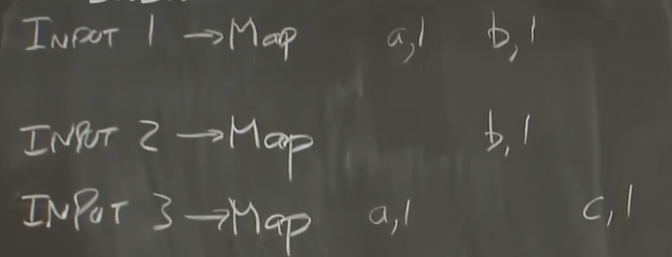
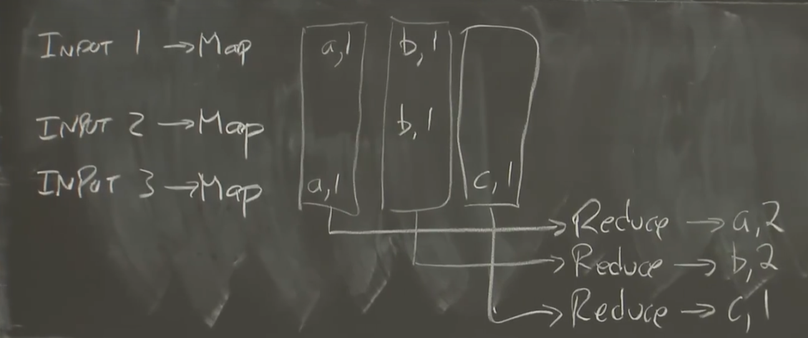
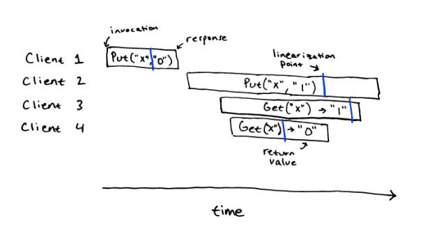
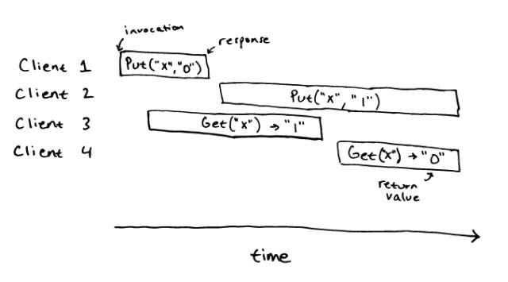
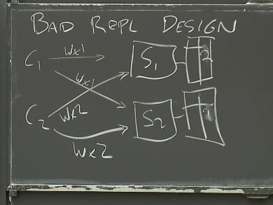

> [docsify-notes/docs/study/分布式策略 at master · Ashiamd/docsify-notes (github.com)](https://github.com/Ashiamd/docsify-notes/tree/master/docs/study/分布式策略)

# Lec 1: Introduction

## 1.1 分布式概述

### why分布式

1. 提高计算性能(increase capacity) → 通过多台计算机(cpu, 主存, 磁盘)并行
2. 容错(tolerate faults)
3. 很多实际上的需求就是需要连接物理上分隔的机器
4. 通过分布式运行代码, 来保证安全

### challenge

1. 有许多的并行执行 → 人脑很难理解并行
2. 分布式的组成太多, 错误情况复杂
3. 如何衡量分布式的性能 1000台机子能达到多少的性能


## 1.2 课程(lab)介绍

1. MapReduce
2. Raft算法实现容错
3. 基于Raft的KV
4. 分片式KV (并行加速)


## 1.3 分布式系统的抽象和实现工具（Abstraction and Implementation）

分布式系统的基础架构(infrastructure)

- 存储: 如何去构建一种多副本，容错的，高性能分布式存储实现
- 通信(网络)
- 计算

构建分布式系统需要对底层这些基础设施进行封装和抽象, 让用户使用接口时, 像是在使用非分布式的系统


### implement

**RPC**: Remote Procedure Call

**线程**: 用线程这个结构化的概念去简化并发操作

并发控制--**锁**

## 1.4 可扩展性（Scalability）

> 即为性能的拓展

理想的可拓展性: 两倍的机器 两倍的执行速度(一半的计算耗时)

另一种提升性能的方式: 重构系统, 优化算法, 但是更为耗时且expensive

- 比如我的网站在一个时刻突然爆火, 此时想要重构去优化已经来不及了, 想保证网站的可用只能购买更多服务器

## 1.5 可用性（Availability）

> 即为系统的容错

对于单计算机构建的系统, 通常是可靠的(计算机, os, 电源一般不会出错); 

但是多台计算机, 罕见的问题会被放大

- > 例如在我们的1000台计算机的集群中，总是有故障，要么是机器故障，要么是运行出错，要么是运行缓慢，要么是执行错误的任务。一个更常见的问题是网络，在一个有1000台计算机的网络中，会有大量的网络电缆和网络交换机，所以总是会有人踩着网线导致网线从接口掉出，或者交换机风扇故障导致交换机过热而不工作。在一个大规模分布式系统中，各个地方总是有一些小问题出现。所以大规模系统会将一些几乎不可能并且你不需要考虑的问题，变成一个持续不断的问题。

- 所以, 我们在设计时就要保证系统在出错之后能够屏蔽和掩盖错误

==可用性==(Availability): 在特定的故障范围内，系统仍然能够提供服务，系统仍然是可用的。如果出现了更多的故障，系统将不再可用。

- 比如构建了多副本系统

==可恢复性==(recoverability): 如果出现了问题，服务会停止工作，不再响应请求，之后有人来修复，并且在修复之后系统仍然可以正常运行，就像没有出现过问题一样。

- 这是一个**比可用性更弱**的需求，因为在出现故障到故障组件被修复期间，系统将会完全停止工作。但是修复之后，系统又可以完全正确的重新运行，所以可恢复性是一个重要的需求。

- 为了实现可恢复, 需要将系统数据进行backup, 以便之后恢复, 常用工具如下
  - 非易失存储（non-volatile storage，类似于硬盘）
  - 复制（replication）: 但是管理复制的副本, 使其状态同步较为复杂(lab2&3会涉及到)

## 1.6 一致性（Consistency）

> 假设构建了一套KV的分布式存储, 有两个操作, get和put
>
> put操作会将一个value存入一个key；get操作会取出key对应的value

对于分布式系统, 因为存在复制/缓存, 数据会存在于多个副本之中

- 加入初始时, AB机器维护了相同的KV表, 有<1, 100>
- 对机器A put<1, 200>, 但在此时, AB之间通信出错, B并没有收到put
- 之后get请求可能从A读, 得到200; 或是从B读, 得到100
  - 还有可能get一直从A读, 数据都是正确的, 直到某次A故障, 此时我们只保存了B中错误的100

### 强/弱一致

**强一致性**: get请求可以得到最近一次完成的put请求写入的值

**弱一致性**: 不保证get请求可以得到最近一次完成的put请求写入的值

强一致固然正确, 但是想要维护它需要带来很高的 用于同步的通信开销(不管put还是get都要同时读写所有副本, 并使用最新的数据)

- 存储我们的副本的物理位置通常较远(异地副本), 如果保持强一致, 物理距离带来的通信时延本身就很高, 大大拖慢系统速度

所以弱一致系统更为常用


## 1.7 MapReduce基本工作方式

> 背景: 论文2004年发布, 当时需要在TB级别上进行计算, 如对所有网页创建索引, 创建索引相当于对数据进行排序, 这个庞大的计算量需要通过将计算运行在大量的机器上
>
> 如果只雇佣熟练的分布式系统专家去编写分布式软件来实现每一种需求, 会有些浪费, 所以提出了MapReduce框架, 让工程师只需要实现应用的核心, 不需要考虑分布式下计算机的协作和错误处理

MapReduce的思想是，应用程序设计人员和分布式运算的使用者，只需要写简单的Map函数和Reduce函数，而不需要知道任何有关分布式的事情，MapReduce框架会处理剩下的事情。

### MapReduce抽象结构

> 以统计单词频率为例

输入: 被分割成几块的输入文件

1. MapReduce框架查找Map函数, 然后对每个Input执行Map函数
   - 
   - 得到了多个`<key, value>`键值对, 其中key是word, value是1, 表示频率
   - *根据论文提到的, 在这之后可以执行一个额外的combiner, 来合并计数结果*

2. 将<key, value>中间结果分组, 发送给reduce函数执行
   - 
   - 第一个Reduce输出a=2，第二个Reduce输出b=2，第三个Reduce输出c=1

**一些概念**: 

- **Job**。整个MapReduce计算称为Job。
- **Task**。每一次MapReduce调用称为Task。


## 1.8 Map函数和Reduce函数

### Map函数

Map函数的**输入参数**为key, value

- key是输入文件的名字(一般忽略)
- value是要统计的文本, 我们要将他拆成单词

对于每个word, 会调用由MapReduce框架提供的`emit`, 其中参数为`(key, value)`其中key是单词, value是字符串“1”

- emit是Map的一部分

> that's all, 非常简单, 只需要描述计算机需要做什么, 不用考虑底层的传输/计算调度方式

### Reduce

Reduce函数**输入参数**为某个中间结果key的所有实例, 所以同样是`(key, value)`

- 对于例子中的WordCount, key即为word, value即为同一单词多次出现后, 多次emit的产生的由**字符串“1”构成的数组**

Reduce同样有一个emit, 这里的输入参数只有`value`, 这个`value`对应输入参数中`key`的最终输出结果

### Other

#### 能否将Reduce输出传给另一个Map

Reduce输出一堆value, 这和Map输入一致

此外, 现实中复杂的多阶段分析or迭代算法本身就需要多个MapReduce Job来实现

> 对于一些非常复杂的多阶段分析或者迭代算法，比如说Google用来评价网页的重要性和影响力的PageRank算法，这些算法是逐渐向答案收敛的。
>
> 我认为Google最初就是这么使用MapReduce的，他们运行MapReduce Job多次，每一次的输出都是一个网页的列表，其中包含了网页的价值，权重或者重要性。所以将MapReduce的输出作为另一个MapReduce Job的输入这很正常。

#### 将Reduce输出作为Map输入, Reduce输出时需要注意什么

需要在输出时考虑到下一个MapReduce Job的输入格式来生成数据

这也是MapReduce框架的缺陷: 算法最好能够由Map函数、Map函数的中间输出以及Reduce函数来表达

此外, Map函数是独立的, 只会和入参相关, 如果需要比较长的运算, 就必须组合多个Map

#### emit函数本质

每次Map调用emit, worker就会将数据写入本地磁盘

#### MapReduce框架中的数据传输

论文中提到, 存储的文件都保存在分布式存储GFS中, 如果每次Input文件都通过**网络传输**给worker节点, 通信开销过大(如10T通过论文中GB级的带宽, 时延很大)

所以论文中提到, 通过修改GFS和worker架构来减少网络传输

- 具体是将GFS和worker混合运行在一组服务器上, master在拆分Map任务时会查找文件存储在哪个服务器, 然后将任务分配给那个服务器(如果不能, 则选择最近的)

同样的, Map输出写到本地磁盘, 不需要(实时的)网络通信

但是将Map传递给Reduce需要通过key来分类(这个过程称为Shuffle 混洗)并传输

**重提: 网络传输是MapReduce的瓶颈(2004年)**

- 对于多个MapReduce的Job, 10T输入通常对应着10T的输出, 输出需要写到GFS中
- 此外GFS为了提高性能和容错, 还会对数据进行拆分和拷贝(2-3副本), 这会带来更多的网络通信

但在现代数据中心网络中, 会有很多的root交换机做负载分担(而不只是论文中的1个), 吞吐大大增加

- > 我认为Google几年前就不再使用MapReduce了，不过在那之前，现代的MapReduce已经不再尝试在GFS数据存储的服务器上运行Map函数了，它乐意从任何地方加载数据，因为网络已经足够快了。

# Lec 2: RPC&Threads

> 笔记源文件: [nil.csail.mit.edu/6.824/2020/notes/l-rpc.txt](http://nil.csail.mit.edu/6.824/2020/notes/l-rpc.txt)

## 为什么选择 Go？

- 良好的线程支持（在 Go 中称为 goroutines）
- 方便的 RPC 实现
- 类型安全
- 垃圾回收机制（避免了释放后使用的错误）
- 线程与垃圾回收结合特别有吸引力
- 相对简单

## 线程（goroutines）

- 是执行线程的一种结构化工具，但可能比较棘手。
- 允许一个程序同时做多件事情。
- 每个线程串行执行，就像非线程化的程序一样。
- 线程共享内存。
- 每个线程包含一些特定于线程的状态，如程序计数器、寄存器和栈。

## 为什么使用线程？

- 表达并发性，这是分布式系统所必需的。
- I/O 并发：客户端可以并行发送请求到多个服务器，并等待响应；服务器可以处理多个客户端请求，每个请求都可能阻塞。
- 多核性能：在CPU的多个核心上并行执行代码, 提高利用率。
- 便利性：例如，在后台每秒检查一次每个工作进程是否仍然活跃。

## 线程的替代方案 - 事件驱动

- 显式地在单个线程中交错活动，通常被称为“事件驱动”编程。
  - 保持一张关于每个活动的状态表（例如每个客户端请求）。
  - 使用一个事件循环来**检查**每个活动的新输入、执行下一步操作并更新状态。
- 事件驱动实现了 I/O 并发且消除了线程成本，但不会带来多核加速，编程也相对痛苦。

## 线程挑战

- 共享数据可能导致竞态条件（race conditions / data race），例如两个线程同时执行 `n = n + 1` 或者一个线程读取数据时另一个线程修改数据。
- 解决竞态问题的方法包括使用锁（Go 提供 `sync.Mutex`）或避免共享可变数据。

## 何时使用共享与锁，以及何时使用通道？

- 对于状态管理，推荐使用共享与锁。
- 对于通信，则推荐使用通道。
- 大多数问题可以用两种方式解决，哪种更合适取决于程序员的思考方式。

## 远程过程调用 (RPC)

- 是分布式系统的关键组成部分，所有实验项目都会用到 RPC。
- 目标是提供易于编程的客户端/服务器通信。
- 隐藏网络协议细节，将数据转换为“线上传输格式”。
- 客户端应用、处理函数、存根函数和分发器通过 RPC 库进行交互。
- 在 Go 中，通常需要为每个服务器处理函数声明 Args 和 Reply 结构体。
- 客户端通过调用 `Dial()` 创建到服务器的 TCP 连接，使用 `Call()` 请求执行调用，指定服务端函数名、参数和放置回复的地方。
- 服务器需要声明一个对象，其中包含作为 RPC 处理器的方法，并将其注册到 RPC 库中。
- 服务器接收 TCP 连接并交给 RPC 库处理；库读取请求、查找命名的对象、调用方法、序列化回复并写回 TCP 连接。

## 最佳努力（Best Effort）与至少一次（At Most Once）的行为

- 最佳努力可能会导致重复的操作，例如两次成功的 `Put` 操作可能导致不确定的结果。
- 更好的行为是“至少一次”，即服务器检测重复请求并返回先前的回复而不是重新运行处理程序。
- 客户端需要为每个请求生成唯一的 ID（XID），并在重传时使用相同的 XID。
- 服务器维护已处理过的 XID 列表，以确保不重复处理请求。
- 如果服务器崩溃重启，可能需要将重复请求的信息持久化存储，以免忘记已处理过的请求。

# Lec ?: Consistency and Linearizability

> [Consistency and Linearizability](https://pdos.csail.mit.edu/6.824/notes/l-linearizability.txt)
>
> 这个文档讨论了MIT的6.5840课程2024年第4讲的内容，主题是关于一致性模型，特别是线性化一致性（Linearizability）。

## Consistency Model

### 一致性模型的重要性

我们需要能够对网络服务的正确行为进行推理。

例如，应用程序开发人员可以从Google文件系统（GFS）或实验2中期待什么样的行为？这引出了**一致性模型**的概念。

### 一致性模型定义

一致性模型是一种规范，用于描述不同客户端对服务的不同视图之间的关系。(a specification for the relationship of different clients' views of a service)

本课程将重点放在基于网络的键值存储服务上，包括`put(k, v)`和`get(k)`操作。在给定一些`put`和`get`调用的情况下，哪些结果是有效的？

在普通的编程环境中，我们无需特别讨论这个问题——读取总是返回最后一次写入的值。

但在分布式系统中，可能会出现对一致性的疑虑，原因包括：

- 并发的读写
- 复制（Replication）
- 缓存
- 故障与恢复
- 丢失的消息
- 重传

### 存储系统为什么需要形式化的模型？

- 对于应用程序来说，没有来自存储系统的保证就很难做到正确。
- 对于服务的设计、实现和优化来说，没有规范就很难进行。

#### 示例
一个生产者计算某个值，然后执行：
```
put("result", 27)
put("done", true)
```
消费者执行：
```
while get("done") != true
  pause
v = get("result")
```
这里的关键问题是：`v`是否可以保证为27，无论发生什么情况？

### 不同的一致性模型

存在多种一致性模型，这些模型有时是为了简化应用程序开发人员的生活而设计的，有时则是为了方便实施者。此外，还有许多领域（如文件系统、数据库、CPU内存）中的定义重叠。

## 线性化一致性 linearizability

- 它是一种规范，要求service面对并发的client请求时必须如何表现(才是正确的)。
  - 规定了service应该按照请求到的的顺序, 一次执行一个请求

- 它通常是指“强一致性”。
  - 符合程序员的直观理解，但会排除许多优化的可能性。


> 在实验2中，你需要实现一个线性化的键值存储，在实验4中，再次实现一个具有容错能力的线性化键值存储。

### 顺序规范Sequential Specifications

> serial specification; serial spec

通常对于一个 key-value store，我们对于它在**顺序操作**下面的行为都能有一个直观的认识：`Get` 操作如果在 `Put` 的后面，那么一定能得到 `Put` 的结果。

- 譬如，如果 `Put("x", "y")` ，那么后面的 `Get("x")` 就能得到 “y”，如果得到了 “z”，那么这就是不对的。
- 但是在**并发操**作下, 顺序规范并没有描述每个操作对应的结果

### 线性化一致性的定义

线性一致性是针对“历史记录histories”定义的：

- histories: 实际客户端请求和服务端响应的轨迹，标记了客户端发送和接收每条消息的时间。
  - 对于每个客户端请求，发送到服务器的请求消息及其对应的响应消息在历史记录中是独立的元素，每条消息都出现在客户端发送或接收它的时刻。因此，历史记录明确展现了请求的并发性和网络延迟。

线性一致性告诉你一个单独的历史记录**是否合法**；如果服务生成的每一个历史记录都是线性一致的，那么我们可以说这个服务是线性一致的。

- 如果可以为每个操作分配一个“linearization point”（一个时间点），使得每个操作的点位于客户端发送请求和接收响应的时间之间，并且历史记录的响应值与如果你按点顺序一次执行一个请求所得到的结果相同，那么**这个历史记录是线性一致的**。如果没有分配的线性化点满足这两个要求，那么这个历史记录就不是线性一致的。
- 如针对下面的操作histories, 标出了operation invocation和response时间点, 并标出了linearzation point(蓝线), 这个顺序历史 `Put("x", "0")`, `Get("x") -> "0"`, `Put("x", "1")`, `Get("x") -> "1"`，对于顺序规范来说就是一个正确的历史
  
- 下面的例子就不是线性一致的, 即不能在history中指定出linearization point
  

线性一致性一个重要的结果是，服务在执行并发（时间上重叠）操作时有选择执行顺序的自由。

- 如果客户端C1和C2的请求是并发的，即使C1在C2之前发送了请求消息，服务器也可能先执行C2的请求。
- 另一方面，如果C1在C2发送请求之前收到了响应，线性一致性要求服务表现得如同它在执行C2的请求之前先执行了C1的请求（即，如果有的话，C2的操作需要观察到C1操作的效果）。

#### 更多的例子

**example history 1:**

```
  |-Wx1-| |-Wx2-|
    |---Rx2---|
      |-Rx1-|
```

- points顺序: Wx1 Rx1 Wx2 Rx2
- 符合规则: ①每个point都介于invocation和response之间 ②符合顺序规范

**example 2:**

```
  |-Wx1-| |----Wx2----|
    |--Rx2--|
              |-Rx1-|
```

- 如果Wx1 Wx2 Rx2 Rx1: 显然不对, Rx1在Wx2后, 不符合sequential spec
- 如何证明它不是linearizable
  - 这里只有4个操作, A44=24种, 列举就完了
  - 但是可以根据history进行剪枝, 比如Wx2一定在Rx2前, 在Wx1后;  Wx2和Rx1不能作为第一个

**example 3:**

```
|--Wx0--|  |--Wx1--|
            |--Wx2--|
        |-Rx2-| |-Rx1-|
```

Wx0 Wx2 Rx2 Wx1 Rx1

service可以以任意顺序安排Write的顺序

**example 4:**

```
|--Wx0--|  |--Wx1--|
            |--Wx2--|
C1:     |-Rx2-| |-Rx1-|
C2:     |-Rx1-| |-Rx2-|
```

-  C1 needs Wx2 Rx2 Wx1 Rx1
   C2 needs Wx1 Rx1 Wx2 Rx2
   we can't have both Wx2 before Wx1, and Wx2 after Wx1.
  so not linearizable.

- 服务可以选择任意顺序处理并发写入，但所有客户端必须以相同的顺序看到这些写入，这一点在存在副本或缓存时尤为重要，它们都必须以相同的顺序执行操作。

**example 5:**

```
|-Wx1-|
        |-Wx2-|
                |-Rx1-|
```

- 顺序已经被定死为Wx1 Wx2 Rx1, Read只能看到最新的`{x, 1}`

线性一致性禁止了许多吸引人的设计可能性/错误：  

- split brain（两个活跃的leaders）  
- 在崩溃+重启后忘记已完成的写入  
- 从过时的副本读取数据

**example 6:** 重复请求(重传)

```
[client / network / server diagram]
C1 calls put(x, 1)
C2 calls put(x, 2)
service receives C1's request;
  network drops response;
  C1's RPC library re-sends request
is it legal for service to execute *both* of C1's request messages?
we then might see this if C3 reads three times:
C1: |--------Wx1---------| (due to retransmission)
C2:        |-Wx2-|
C3:   |-Rx1-| |-Rx2-|  |-Rx1-|
```

如果Wx1错误, 并进行了重复的请求(重传), 那么结果不会符合线性一致性

**example 7:** 如何处理重复请求

假设服务记住了每个请求+响应，

- 检测重复的请求， 用**与第一个请求副本相同的值进行回复**。  （通常服务器必须保存结果，因为无法重新执行）
- 对于写入操作，这消除了重复执行——很好。
  但对于读取操作，这可能会提供一个现在已过时的保存值！

```
C1: |-Wx3-|          |-Wx4-|
C2:          |-Rx3-------------|
C2's first request before Wx4, re-sends after Wx4
```

- 一个可行的顺序: Wx3 Rx3 Wx4, 保证线性一致, 但是返回了旧信息x=3
- 但是返回4同样正确 (但是这仅仅是因为Read没有副作用)


### Linearzability checker

一个简单的线性一致性检查器会尝试每一种可能的顺序（或者选择线性化点），以查看是否有一种顺序符合线性一致性定义中的规则。

checker只是用于测试

### 线性一致性的利弊

应用程序开发者喜欢线性一致性，因为它相对容易使用：

- 读取操作能够看到最新的数据，而不是过时的数据。
- 在没有写操作的情况下，所有客户端看到的数据都是一致的。
- 所有客户端按照相同的顺序看到数据的变化。 因此，像 `put(v,27); put(done,true);` 这样的例子能够正常工作。 当我们讨论一致性较弱的系统时，这些特性的价值会更加明显。

### 实现linearizability

我们如何实现线性一致性呢？ 

- 这取决于我们对复制、缓存和容错的需求。

#### 单个不崩溃的串行服务器

[图解：客户端，服务器，操作队列，状态] 

服务器为同时到达的客户端请求选择一个执行顺序。 按照这个顺序逐个执行请求， 每次在开始下一个请求前回复客户端。 

- 并发转顺序执行 可靠但低效率

- 需要检测**重复请求**
- 需要处理**崩溃恢复**（必须将数据写入磁盘……）。

#### 主备复制 primary/backup replication

[图解：主服务器，两个备份服务器] 

所有请求都发送到主服务器 

- 主服务器选择一个串行顺序
- 转发给备份服务器, 备份服务器按照相同的顺序执行操作
- 主服务器在两个备份服务器都执行完毕后才回复客户端

因此，如果客户端收到了响应，所有备份服务器都已执行操作

- 这对于主服务器失效的情况很重要 (以避免忘记已完成的请求)

客户端不能直接发送读取请求给备份服务器

- 如在GFS 中 客户端C1可能看到新值，而之后又可能看到旧值

需要一个外部实体来决定何时由备份服务器接管, 以避免split brain现象

- 例如，GFS 协调器

### 性能

**线性一致性系统的性能如何？**

- 坏消息：**串行特性**可能使得难以获得并行加速
- 坏消息：如果存在复制，那么会有大量的通信开销
- 坏消息：如果存在复制，副本必须可达， 这限制了容错性
- 好消息：如果键是独立的，可以进行分片处理

**其他一致性模型？**

> 它们能提供更好的性能吗？
>
> 它们有直观的语义吗？

## 最终一致性 eventual consistency

==最终一致性==: 一种*(一致性)*较弱的模型

- 数据有多个副本（例如在不同的数据中心，为了加速访问） 
- 读取操作可以查询任意一个副本（例如，最近的一个） 
- 写操作可以更新任意一个副本（例如，最近的一个） 
  - 当副本的更新完成时，客户端就会收到响应
  - 副本在后台同更新, 最终，其他副本会看到我的更新

最终一致性相当流行

- 比线性一致性更快, 特别是在副本位于不同城市以实现容错的情况下

- 更具可用性: 任意一个副本都可以, 无需等待主/备服务器的通信

- 实例: Amazon 的 Dynamo；Cassandra

但最终一致性向应用程序开发者暴露了一些异常情况：

- 读取操作可能看不到最近的写入——读取操作可能看到过时数据
  - 对于密码更改、访问控制列表更改是个问题
- 写入操作可能出现顺序错乱 打破了我的 `result/done` 例子
- 不同的客户端可能看到不同的数据
- 需要某种方式来解决对同一项的并发写入！ 
  - C1: `put(x, 1)` C2: `put(x, 2)` 它们可能最初在不同的副本上应用 只有在之后才会将它们推送到其他副本 
  - 如何合并并发的新值？ 如何确保所有副本选择相同的最终值？ 以便最终它们是相同的？
- 最终一致性无法支持例如 `test-and-set` 的操作

## 总结

一个普遍的模式是：你通常只能选择以下之一： 强一致性 最大可用性

但不能两者兼得。 

- 强一致性使得你需要等待更新副本， 并且如果太多副本不可用，无法继续操作。 因此可用性较差。 
- 最终一致性可以在没有其他副本可达的情况下继续操作。 但一致性较差。


# Lecture3 谷歌文件系统GFS

> [GFS(Google文件系统) - 百度百科](https://baike.baidu.com/item/GFS/1813072?fr=aladdin)
>
> GFS是一个可扩展的[分布式文件系统](https://baike.baidu.com/item/分布式文件系统/1250388?fromModule=lemma_inlink)，用于大型的、分布式的、对大量数据进行访问的应用。它运行于廉价的普通硬件上，并提供容错功能。它可以给大量的用户提供总体性能较高的服务。

本章节主要讨论点：

- storage：存储
- GFS：GFS的设计
- consistency：一致性

## 3.1 分布式存储系统设计难点(Why Hard)

构建可容错(fault tolerance)的系统，需要可靠的storage存储实现。

通常应用开发保持无状态stateless，而底层存储负责永久保存数据。

**性能需求(performance) → sharding**

- 分片shard：将数据分散到众多服务器上, 实现并发读取

- data across server：跨多个服务机器存储数据（单机的网卡、CPU等硬件吞吐量限制）

**faults → fault tolerance容错**

- 多实例/多机器(many servers)
  - constant faults：单机故障率低，但是足够多的机器则出现部分故障的概率高
  - 在GFS论文上千台机器规模下，每天总会有3个机器出现失败/故障。因此需要有容错设计

**tolerance → replication复制**

- replication：通常通过复制数据保证容错性，即当前磁盘数据异常/缺失等情况，尝试从另一个磁盘获取数据

**replication → inconsistency不一致问题**

- potential inconsistencies：潜在的数据不一致问题需要考虑

**consistency → low performance**

强一致性(strong consistency) -- 对应lower performance：一般需要通过一些消息机制保证一致性，这会稍微带来一些性能影响，但一般底层为了保证数据一致性而额外进行的网络通信等操作在整体性能的开销中占比并不会很高。其中可能涉及需要将通信的一些结果写入存储中，这是相对昂贵的操作。

> 一个闭环


## 3.2 一致性(consistency)

 理想的一致性，即整个分布式系统对外表现时像单个机器一样运作。

 **并发性(concurrency)**和**故障/失败(failures)**是两个实现一致性时需要考虑的难点。

**并发性问题举例**： W1写1，W2写2；R1和R2准备读取数据。W1和W2并发写，在不关心谁先谁后的情况下，考虑一致性，则我们希望R1和R2都读取到1或者都读取到2，R1和R2读取的值应该一致。（可通过分布式锁等机制解决）

**故障/失败问题举例**：

一般为了容错性，会通过复制的方式解决。而不成熟的复制操作，会导致读者在不做修改的情况下读取到两次不同的数据。



比如，我们要求所有写者写数据时，需要往S1和S2都写一份。

此时W1和W2并发地分别写1和2到S1、S2。对S1: 先写1再写2, 对S2: 先写2再写1, 造成两个副本中数据不一致

因为没有明确的（一致性）协议指出这里W1和W2的数据在S1、S2上以什么顺序存储，可能1被2覆盖，反之亦然

- 所以从S1或S2读数时结果可能是1也可能是2


## 3.3 GFS-简述

> [谷歌Colossus文件系统的设计经验 - 腾讯云开发者社区-腾讯云 (tencent.com)](https://cloud.tencent.com/developer/article/1971701) <= 可供拓展阅读

 GFS旨在保持高性能，且有复制、容错机制，但很难保持一致性。google确实曾使用GFS，虽然后继被新的文件系统Colossus取代。

 在论文中可以看到mapper从GFS系统(上千个磁盘)能够以超过10000MB/s的速度读取数据。论文发表时，当时单个磁盘的读取速度大概是30MB/s，一般在几十MB/s左右。

 GFS**主要性能特征**：

- Big：large data set，巨大的数据集
- Sharding：automatic sharding，自动分片到多个磁盘, 实现高性能
- Gloal：all apps see same files，所有应用程序从GFS读取数据时看到相同的文件（一致性）
- Fault tolerance：automic，尽可能**自动**地采取一些容错恢复操作

GFS**外部特征**: 

- Single data centor: 副本(数据)并不是遍布全球的
- Internal use: 隐藏在应用内部, 而不是直接对外访问
- Big sequential access: 专注于提高大文件吞吐量, 而非低时延

GFS思想: 

- 采用弱一致性 -- 会出现一些错误, 但是在应用场景下没有人在意
- singal master


## 3.4 GFS-Master简述

> Chunk: 数据块, 通常为64MB


**Master**: 单一master

**Master Data**

- **Mapping1**: 文件名 → Chunk ID(Chunk Handle)数组 

  - [nv, non-volatile] 非易失, 保存在主存中

- **Mapping2**: handle → list of chunk servers (一个chunk会有多个副本, 一般为3)

  - > Each chunk is identified by an immutable and globally unique 64 bit ==chunk handle== assigned by the master at the time of chunk creation.

  - **list of chunk server**: \[v, volatile\]\: master不存储chunk位置, 而是在重启时询问chunk server, 获取它们的chunk信息

    - version **[nv]** : 每个chunk的版本号, 用来检查副本
    - primary [v] : 哪个chunk是primary,
    - lease expiration [v] : 租期到期时间,

- Log + Check Point (在non-volatile非易失的disk中维护)
  - Log可以实现顺序的写入, (略微)提高性能
  - Checkpoint: 保存一个时刻系统的状态, 重建时从checkpoint开始, 运行之后的log, 避免从零开始
  - > log+check point：通过日志和检查点机制维护文件系统。所有变更操作会先在log中记录，后续才响应Client。这样即使Master崩溃/故障，重启时也能通过log恢复状态。master会定期创建自己状态的检查点，落到持久性存储上，重启/恢复状态时只需重放log中最后一个check point检查点之后的所有操作，所以恢复也很快。

**chunk server**: 数百个数据块服务器, 每个配备1-2个disk

master存储chunk位置, chunk server存储实际的数据


这里需要思考的是，哪些数据需要放到稳定的存储中(比如磁盘)？

- 比如file name => chunk hanles的映射，平时已经在内存中存储了，还有必要存在稳定的存储中吗？

  需要，否则崩溃后恢复时，内存数据丢失，master无法索引某个具体的文件，相当于丢失了文件。

- chunk handle 到 存放chunk的服务器列表，这一层映射关系，master需要稳定存储吗？

  不需要，master重启时会要求其他存储chunk数据的服务器说明自己维护的chunk handles数据。这里master只需要内存中维护即可。同样的，主服务器(primary)、次要服务器(secondaries)、主服务器(primary)的租赁时间(lease time)也都只需要在内存中即可。

- chunk handle的version版本号信息呢，master需要稳定存储吗？

  需要。否则master崩溃重启时，**master无法区分哪些chunk server存储的chunk最新的**。比如可能有服务器存储的chunk version是14，由于网络问题，该服务器还没有拿到最新version 15的数据，master必须能够区分哪些server有最新version的chunk。

------

问题：Master崩溃重启后，会连接所有的chunk server，找到最大的version？

回答：Master会尝试和所有chunk server通信，尽量获取最新version。当然有可能拥有最新version的chunk server由于网络等原因正好联系不上，此时能联系上的存活最久的chunk server的version会比master存储的version小。


## 3.5 GFS-文件读取

> [GFS文件系统剖析（中）一致性模型及读写流程介绍-社区博客-网易数帆 (163.com)](https://sq.sf.163.com/blog/article/172834757163061248)


GFS通过Master管理文件系统的元数据等信息，其他Client只能往GFS写入或读取数据。当应用通过GFS Client读取数据时，大致流程如下：

1. Client向Master发起读数据请求
2. Master查询需要读取的数据对应的目录等信息，汇总chunk handle、这些chunk所在的服务器节点信息给Client（大文件通常被拆分成多个块Chunk存放到不同服务器上）
3. Client得知需要读取的Chunk的信息后，直接和拥有这些Chunk的服务器网络通信传输Chunks


### 具体操作步骤

1. Client向Master发请求，要求读取X文件的Y偏移量的数据(**filename, offset**)
2. Master回复Client，X文件Y偏移量相关的块句柄、块服务器列表、版本号(**chunk handle, list of chunk servers, version**)
   - Client 缓存块服务器列表(list of chunk servers)
3. Client从(网络上)**最近的**服务器请求chunk数据(reads from closest servers)
   - chunk server使用linux系统, 将chunk作为普通文件存储, 所以唯一的chunk handle是作为用户名来使用的
4. 被Client访问的chunk server检查version，version正确则返回数据

### 一些问题

- **为什么这里Client要缓存list of chunk server信息呢？**

  因为在这里的设计中，Master只有一台服务器，我们希望尽量减少Client和Server之间的通信次数，客户端缓存可以大大减少Master机器的负载。

- **为什么Client尽量访问最近的服务器来获取数据(reads from closest servers)？**

  因为这样在宛如拓扑结构的网络中可以最大限度地减少网络流量(mininize network traffic)，提高整体系统的吞吐量。

- **为什么在Client访问chunk server时，chunk server需要检查verison？**

  为了尽量避免客户端读到过时数据的情况。

- **如果读取的数据超过Chunk的边界? 如64MB并不是一个完整的Chunk, 而是Chunk A后半+Chunk B前半**

  Client会分析这个读文件的请求是否跨越了Chunk边界, 并将它拆分为两个请求, 获取之后存入&组合, 返回给上级应用程序


## 3.6 GFS-文件写入

> [谷歌技术"三宝"之GFS](http://t.zoukankan.com/yorkyang-p-9889525.html)

这里主要关注文件写入中的**`append操作`**，因为把记录追加到文件中这个在他们的业务中很常见。

- **在map reduce中，reducer将处理后的记录数据(计算结果)很快地追加(append)到file中**。

[](https://camo.githubusercontent.com/2151743f7ff7c4cf0806ba4031721e727cd4cfa6fa800a69559aa5fcda22472f/68747470733a2f2f696d67323031382e636e626c6f67732e636f6d2f626c6f672f313033383631382f3230313831312f313033383631382d32303138313130313135323430343632362d313530323735363630302e706e67)

### Client -- Master

1. Client向Master发出请求，查询应该往哪里写入filename对应的文件。

2. Master查询filename到chunk handle映射关系的表，找到需要修改的chunk handle后，再查询chunk handle到chunk server数组映射关系的表，以list of chunk servers(primary、secondaries、version信息)作为Client请求的响应结果

   接下去有两种情况，已有primary和没有primary(假设这是系统刚启动后不久，还没有primary)

   - 有primary: 继续后续流程(3)

   - 无primary

     - master在chunk servers中**选出一个作为primary**，其余的chunk server作为secondaries。(暂时不考虑选出的细节和步骤)

     - master会**增加version**（每次有新的primary时，都需要考虑时进入了一个new epoch，所以需要维护新的version），然后向primary和secondaries发送**新的version**，并且会发给primary有效期限的**租约lease**。
       - 这里primary和secondaries需要将version存储到磁盘，否则重启后内存数据丢失，无法让master信服自己拥有最新version的数据(同理Master也是将version存储在磁盘中)。
       - **租约lease**: 告诉Server, 在这个lease到期前, 你是Primary, 到期后停止称为Primary

### Client -- Chunk Server

3. Client发送数据到想写入的chunk servers (primary和secondaries)

   - 有趣的是，这里Client**只需访问最近的**secondary，而这个被访问的secondary**会将数据转发**到列表中的下一个chunk server，**此时数据还不会真正被chunk severs存储**。
     - 即图中间黑色粗箭头，secondary收到数据后，马上将数据推送到其他本次需要写的chunk server
       
   - **这么做提高了Client的吞吐量，避免Client本身需要消耗大量网络接口资源往primary和多个secondaries都发送数据**。

4. 数据传递完毕后，Client向primary发送一个message，表明本次为append操作。

   primary此时需要做几件事：

   1. primary此时会检查version，如果version不匹配，那么Client的操作会被拒绝
   2. **primary检查lease是否还有效，如果自己的lease无效了，则不再接受任何mutation operations（因为租约无效时，外部可能已经存在一个新的primary了）**
   3. 如果version、lease都有效，那么primary会选择一个offset用于写入
   4. primary将前面接收到的数据写入稳定存储中

5. primary发送消息到secondaries，表示需要将之前接收的数据写入指定的offset

6. secondaries写入数据到primary指定的offset中，并回应primary已完成数据写入

7. primary回应Client: 你想append追加的数据已完成写入

   - 当然，存在一些情况导致数据append失败，此时primary本身写入成功，但是后续存在某些/某个secondaries写入失败，此时会向Client返回错误error。**Client遇到这种错误后，通常会retry整个流程直到数据成功append，这也就是所谓的最少一次语义(do at-least-once)**

- **需要注意的是，假设append失败，Client再次重试，此时流程中primary指定写入的offset和上一次会是一样的吗？**

  不，primary会指定一个新的offset。假设primary+2台secondaries，可能上一次p和s1都写成功，仅s2失败。此时retry需要用新的offset，或许p、s1、s2就都写入成功了。这里可以看出来**副本记录是可以重复的(replicates records can be duplicated)**，这和我们常见的操作系统中标准的文件系统不一样。

  好在应用程序不需要直接和这种特殊的文件系统交互，而是通过库操作，库的内部实现隐藏了这些细节，用户不会看到曾经失败的副本记录数据。如果你append数据，库会给数据绑定一个id，如果库读取到相同id的数据，会跳过前面的一个。同时库内通过checksums检测数据的变化，同时保证数据不会被篡改。

### 一些问题

学生提问：如果写入数据失败了，不是应该先找到问题在哪再重试吗？

Robert教授：

- 我认为这是个有趣的问题。当Primary向客户端返回写入失败时，你或许会认为一定是哪里出错了，在修复之前不应该重试。实际上，就我所知，论文里面在**重试追加数据之前没有任何中间操作**。因为，错误可能就是**网络数据的丢失**，这时就没什么好修复的，网络数据丢失了，我们应该重传这条网络数据。客户端重新尝试追加数据可以看做是一种复杂的重传数据的方法。或许对于大多数的错误来说，我们不需要修改任何东西，同样的Primary，同样的Secondary，客户端重试一次或许就能正常工作，因为这次网络没有丢包。
- 但是如果是某一个Secondary**服务器**出现严重的故障，那问题变得有意思了。我们希望的是，Master节点能够重新生成Chunk对应的服务器列表，将不工作的Secondary服务器剔除，再选择一个新的Primary，并增加版本号。如果这样的话，我们就有了一组新的Primary，Secondary和版本号，同时，我们还有一个不太健康的Secondary，它包含的是旧的副本和旧的版本号，正是因为版本号是旧的，Master永远也不会认为它拥有新的数据。但是，论文中没有证据证明这些会立即发生。论文里只是说，客户端重试，并且期望之后能正常工作。最终，Master节点会ping所有的Chunk服务器，如果Secondary服务器挂了，Master节点可以发现并更新Primary和Secondary的集合，之后再增加版本号。但是这些都是之后才会发生（而不是立即发生）。


**问题**：比起重写每一个副本(replica)，直接记住某个副本(replica)失败了不是更好吗？

回答：是的，有很多不同的实现方式。上面流程中假设遇到短暂的网络问题等，也不一定会直接判定会写入失败，可能过一会chunk server会继续写入，并且最后判定为写入成功。

**问题**：所有的这些服务器都是可信的吗？（换言之，流程中好像没说明一些权限问题）

回答：是的，这很重要，这里不像Linux文件系统，有权限和访问控制写入(permissions and access control writes)一类的东西，服务器完全可信（因为这完全是一个内部系统）。

**问题：写入流程中提到需要校验version，是否存在场景就是Client要读取旧version的数据？比如Client自己存储的version就是旧版本，所以读取数据时，拥有旧version的chunk server反而能够响应数据。**

**回答：假设这里有P(primary)，S1(secondary 1)，S2(secondary 2)和C(Client)，S2由于网络等问题和P、S1断开联系，此时重新选出Primary(假设还是原本的P)，version变为11，而S2断联所以还是version10的数据。一个本地cache了version10和list of chunk sevrers的Client正好直接从S2请求读取数据（因为S2最近），而S2的version和Client一致，所以直接读取到S2的数据。**

**问题**：上面这个举例中，为什么version11这个信息不会返回到Client呢？

回答：原因可能是Client设置的cache时间比较长，并且协议中没有要求更新version。

**问题：上面举例中，version更新后，不会推送到S2吗？即通知S2应该记录最新的version为11**

回答：**version版本递增是在master中维护的，version只会在选择新的primary的时候更新**。论文中还提到serial number序列号的概念，不过这个和version无关，这个用于表示写入顺序。

**问题**：primary完成写入前，怎么知道要检查哪一些secondaries（是否完成了写入）？

回答：master告知的。master告诉primary需要更新secondaries，这形成了new replica group for that chunk。


## 3.8 GFS-一致性(Consistency)

> [spanner(谷歌公司研发的数据库) - 百度百科](https://baike.baidu.com/item/spanner/6763355?fr=aladdin)

 这里一致性问题，可以简单地归结于，当你完成一个append操作后，进行read操作会读取到什么数据？

 这里假设一个场景，我们讨论一下可能产生的一致性问题，这里有一个M（maseter），P（primary），S（Secondary）：

- **某时刻起，M得不到和P之间的ping-pong通信的响应，什么时候Master会指向一个新的P？**

  1. M比如等待P的lease到期，否则会出现两个P
  2. 此时可能有些Client还在和这个P交互

  **假设我们此时选出新P，有两个P同时存在，这种场景被称为脑裂(split-brain)，此时会出现很多意料外的情况，比如数据写入顺序混乱等问题，严重的脑裂问题可能会导致系统最后出现两个Master**。

  这里M知道P的lease期限，在P的lease期限结束之前，不会选出新P，即使M无法和P通信，但其他Client可能还能正常和P通信。

------

这里扩展一下问题，**如何达到更强的一致性(How to get stronger consistency)？**

比如这里GFS有时候写入会失败，导致一部分S有数据，一部分S没数据（虽然对外不可见这种失败的数据）。我们或许可以做到要么所有S都成功写入，要么所有S都不写入。

事实上Google还有很多其他的文件系统，有些具有更强的一致性，比如Spanner有更强的一致性，且支持事务，其应用场景和这里不同。我们知道这里GFS是为了运行mapreduce而设计的。