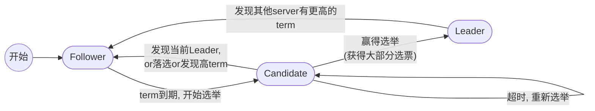
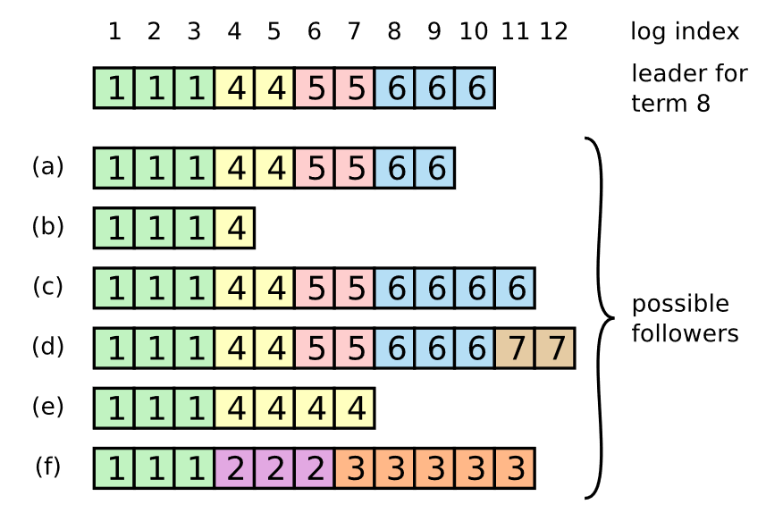
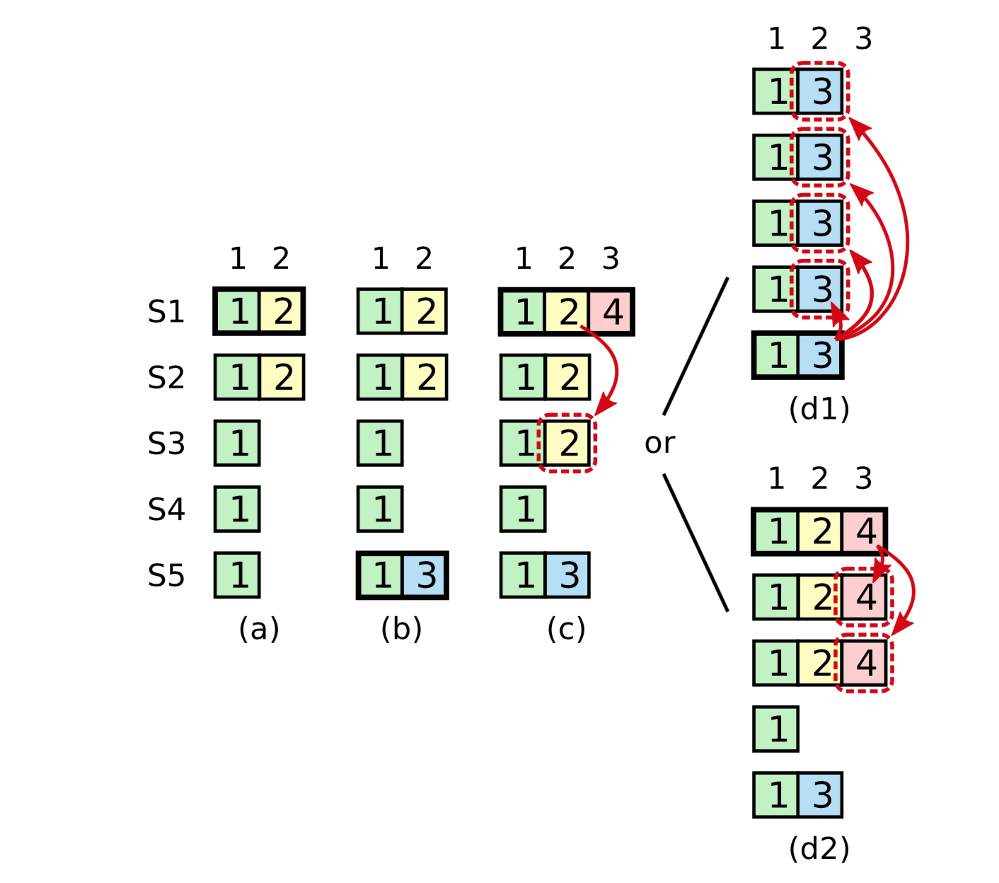
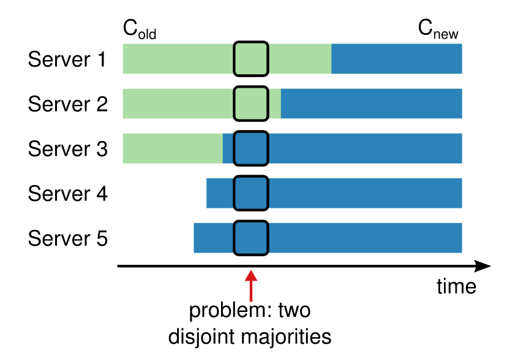
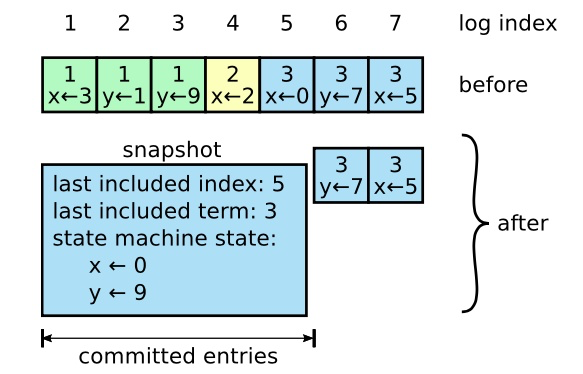
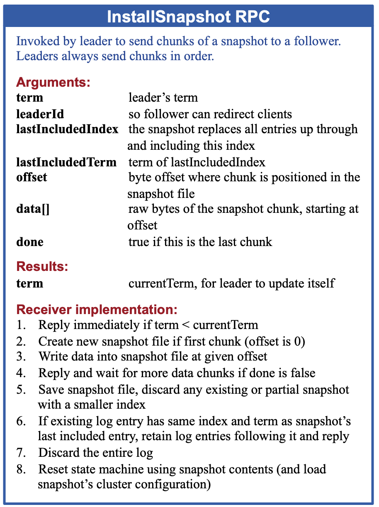

# In Search of an Understandable Consensus Algorithm (Extended Version)

> [In Search of an Understandable Consensus Algorithm (mit.edu)](https://pdos.csail.mit.edu/6.824/papers/raft-extended.pdf)
>
> [Raft 论文详析 - 知乎 (zhihu.com)](https://zhuanlan.zhihu.com/p/33816607)
>
> 另有作者的博士毕业论文, 更详细地描述了Raft算法, 下面贴个中文翻译
>
> - [raft-thesis-zh_cn/raft-thesis-zh_cn.md at master · OneSizeFitsQuorum/raft-thesis-zh_cn (github.com)](https://github.com/OneSizeFitsQuorum/raft-thesis-zh_cn/blob/master/raft-thesis-zh_cn.md#4-集群成员更改)
> - 

## 2 Replicated state machines

用于实际系统的共识算法通常具有以下**特性**：

- 它们在所有非拜占庭（即没有恶意行为）的条件下确保**安全性**（即永远不会返回一个不正确的结果），这些条件包括网络延迟、网络分区以及数据包的丢失、重复和乱序。

  - > [拜占庭将军问题 (The Byzantine Generals Problem) - Liebing's Blog](https://liebing.org.cn/byzantine-generals-problem.html)
    >
    > 现有的分布式一致性协议和算法主要可分为两类:
    >
    > - 一类是**故障容错算法(Crash Fault Tolerance, CFT)**, 即非拜占庭容错算法, 解决的是分布式系统中存在故障, 但不存在恶意攻击的场景下的共识问题. 也就是说, 在该场景下可能存在消息丢失, 消息重复, 但不存在消息被篡改或伪造的场景. 一般用于局域网场景下的分布式系统, 如分布式数据库. 属于此类的常见算法有Paxos算法, ==Raft算法==, ZAB协议等.
    > - 一类是**拜占庭容错算法**, 可以解决分布式系统中既存在故障, 又存在恶意攻击场景下的共识问题. 一般用于互联网场景下的分布式系统, 如在数字货币的区块链技术中. 属于此类的常见算法有PBFT算法, PoW算法.

- 只要大多数服务器可以正常运行并且能够相互通信并与客户端通信，它们就能完全功能化（可用）。因此，一个典型的由五个服务器组成的集群可以容忍任何两个服务器的故障。假定服务器会因停止而发生故障；它们可以通过从持久存储中恢复状态并重新加入集群来重启。

- 它们不依赖于时间来确保日志的一致性：有故障的时钟和极端的消息延迟最多只能导致可用性问题。

- 在常见情况下，一个命令可以在集群中的大多数成员对单轮远程过程调用作出响应后立即完成；少数响应慢的服务器不必影响整个系统的性能。

## 5 The Raft consensus algorithm

Leader的职责

- 从Client接收日志条目(客户端操作)，在其他servers上复制它们
- 告诉servers何时可以安全地将日志条目应用于其状态机

由Leader管理的好处: 

- 不需要经过讨论来决定放置***日志条目(Log Entry)***的位置
- 数据传输方向简单(Leader→servers)

Raft的特点之一--对同步中的问题的分解(decomposes the consensus problem)

1. **Leader election**: 一个Leader挂掉时, 需要选举出新Leader (具体实现-Section 5.2)
2. **Log replication**:  Leader从Client接受日志条目, 并将它复制给集群(其他日志会与Leader的保持一致)
3. **Safety**: 关键在于“状态机安全属性”（State Machine Safety Property）, 这个属性保证了: 如果一个server应用了一个日志条目, 其他server不会将其他命令应用到同一个log (具体实现-Section 5.4)
   - 理想情况下，每个entry对应一个唯一的命令，但是由于分布式系统中可能出现的故障（如领导者更换、网络分区等），可能会导致在某些情况下，同一个索引位置上的entry被尝试赋予不同的命令

### Raft特性

- **Election Safety**（选举安全）：在任意给定的 Term 中，至多一个节点会被选举为 Leader ([5.2 Leader election](# 5.2 Leader election))
- **Leader Append-Only**（Leader 只追加）：Leader 绝不会覆写或删除其所记录的日志，只会追加日志 ([5.3 Log replication](# 5.3 Log replication))
- **Log Matching**（日志匹配）：若两份日志在给定 Term 及给定 index 值处有相同的记录，那么两份日志在该位置及之前的所有内容完全一致([5.3 Log replication](# 5.3 Log replication))
- **Leader Completeness**（Leader 完整性）：若给定日志记录在某一个 Term 中已经被提交（后续会解释何为“提交”），那么后续所有 Term 的 Leader 都将包含该日志记录
- **State Machine Safety**（状态机安全性）：如果一个服务器在给定 index 值处将某个日志记录应用于其上层状态机，那么其他服务器在该 index 值处都只会应用相同的日志记录

### Raft结构描述

> 即论文Figure2

#### state in server

**所有节点**都会持有的**持久化状态**信息（在响应 RPC 前会先将更新写入到持久存储）：

-  `currentTerm`：当前 Term ID（初值为 `0`, 单调递增） 
-  `votedFor`: 该 Term 中已接收到来自该节点的选票的 Candidate ID
-  `log[]`: 日志记录。第一个日志记录的 index 值为 `1`

**所有节点**都会持有的**易失性状态**信息：

-  `commitIndex`: 最后一个**已提交**日志记录的 index（初值为 `0`）
-  `lastApplied`: 最后一个**已应用**至上层状态机的日志记录的 index（初值为 `0`）

**Leader** 才会持有的**易失性状态**信息（会在每次选举完成后初始化）：

- `nextIndex[]`: 每个节点即将为其发送的下一个日志记录的 index（初值均为 Leader 最新日志记录 index 值 + 1）
- `matchIndex[]`: 每个节点上已备份的最后一条日志记录的 index（初值均为 `0`）

####  `AppendEntries RPC`

**AppendEntries RPC**：由 Leader 进行调用，用于将日志记录备份至 Follower，同时还会被用来作为心跳信息

**参数**：

- `term`: Leader 的 Term ID
- `leaderId`: Leader 的 ID
- `prevLogIndex`: 在正在备份的日志记录之前的日志记录的 index 值
- `prevLogTerm`: 在正在备份的日志记录之前的日志记录的 Term ID
- `entries[]`: 正在备份的日志记录
- `leaderCommmit`: Leader 已经提交的最后一条日志记录的 index 值

**返回值**：

- `term`: 接收方的当前 Term ID
- `success`: 当 Follower 能够在自己的日志中找到 index 值和 Term ID 与 `prevLogIndex` 和 `prevLogTerm` 相同的记录时为 `true` 

**接收方在接收到该 RPC 后会进行以下操作：**

1. 检查调用者的term: 若 `term < currentTerm`，返回 `false` 
2. 检查调用者的prevLog的情况: 若日志中不包含index 值和 Term ID 与 `prevLogIndex` 和 `prevLogTerm` 相同的记录，返回 `false`
3. 检查自身的日志情况: **如果**日志中存在与正在备份的日志记录相冲突的记录（有相同的 index 值但 Term ID 不同），删除该记录以及之后的所有记录
4. 在保存的日志后追加新的日志记录
5. 若 `args.leaderCommit > commitIndex`，令 `commitIndex = min(args.leaderCommit, index of last new entry)`
   - min的原因: Follower可能会持有Leader没有的Log Entries, 如果在`leaderCommit > commitIndex`时直接让`commitIndex = leadercommit`, Follower会错误的认为尚未与Leader同步的Entries已经commit
   - 疑问: 为什么leaderCommit有可能大于index of last new entry
     - 如果一次发送所有新entries, leaderCommit只会 <= index of last new entry
     - 但是如果进行流量控制, 发送AppendEntries时不发送所有的entries, 则会出现LeaderCommit>LastIndex的情况

**一些其他注意事项**: 

- 该RPC用作心跳时, 参数中不携带日志条目

#### `RequestVote RPC`

**RequestVote RPC**：由 Candidate 调起, 以获取选票 ([Leader election]()相关)

参数：

- `term`：Candidate 的 Term ID
-  `candidateId`: Candidate 的 ID
-  `lastLogIndex`: Candidate 所持有的最后一条日志记录的 index

- `lastLogTerm`: Candidate 所持有的最后一条日志记录的 Term ID

返回值：

- `term`：接收方的 Term ID
-  `voteGranted`：接收方是否同意给出选票

接收方在接收到该 RPC 后会进行以下操作：

1. 若 `term < currentTerm`，返回 `false`
2. 若 `votedFor == null`或 `votedFor == args.CandidateId`, 且给定的日志记录信息可得出对方的日志和自己的相同甚至更新，返回 `true` 

#### Rules for Servers

**对于所有节点：**

- 若 `commitIndex > lastApplied`，则对 `lastApplied` 加 1，并将 `log[lastApplied]` 应用至上层状态机
- 若 RPC 请求或相应内容中携带的 `term > currentTerm`，则令 `currentTerm = term`，且 Leader 降级为 Follower

**对于 Follower：**

- 负责响应 Candidate 和 Leader 的 RPC
- 如果在 Election Timeout 之前没能收到来自**当前 Leader 的 `AppendEntries RPC`** 或将**选票投给其他 Candidate**，则进入 Candidate 角色
  - *注意是当前Leader的心跳*

**对于 Candidate：**

- 在进入 Candidate 角色时，发起 Leader 选举：
  1. `currentTerm` 加 1
  2. 将选票投给自己
  3. 重置 Election Timeout 计时器
  4. 发送 RequestVote RPC 至其他所有节点
- 如果接收到来自其他大多数节点的选票，则进入 Leader 角色
- 若接收到来自其他 Leader 的 AppendEntries RPC，则进入 Follower 角色
- 若再次 Election Timeout，那么重新发起选举

**对于 Leader：**

- 在空闲时周期地向 Follower 发起空白的 AppendEntries RPC（作为心跳信息），以避免 Follower 发起选举
- 若从客户端处接收到新的命令，则将该命令追加到所存储的日志中，并在顺利将该命令应用至上层状态机后返回响应
- 如果最新一条日志记录的 index 值大于等于某个 Follower 的 `nextIndex` 值，则通过 AppendEntries RPC 发送在该 `nextIndex` 值之后的所有日志记录：
  1. 如果备份成功，那么就更新该 Follower 对应的 `nextIndex` 和 `matchIndex` 值
  2. 否则，对 `nextIndex` 减 1 并重试
- 若存在一个index N满足 `N > commitIndex`，且大多数的 `matchIndex[i] >= N`，且 `log[N].term == currentTerm`，令 `commitIndex = N`

### 5.1 Raft basics

典型的Raft集群server数量为5, 可以容忍2台机器的故障

#### server state

server的三种状态: ***leade, follower, or candidate*** 

- leader: 处理client的请求, 分发给followers
- followers: 只响应来自leader/candidate的请求
  - 如果client请求到follower, 它会将请求转发给leader
- candidate: 用于选举leader

#### *term*

***term*** (任期): Raft算法中的时间单位

term的更新

- 一个term开始于一次选举(election), 选举中胜出的的candidate将会在剩余的term内担任leader
- 如果一次election失败, 会重新开启一次election(伴随一个新的term)
- Raft会确保一个term中最多只有一个leader 
  - Note: 网络分割怎么办???

term的作用--通过比较`currentTerm` 

- 在servers通信(RPC)时, 都会比较term: 
  - 如果比自己的大, 更新到大的
    - 如果server是candidate/leader, 还会把自己转换为follower
  - 如果比自己的小, 拒绝此次请求

### 5.2 Leader election

election触发时机: 

- Leader通过向Follower发送无日志条目的AppendEntries RPCs实现heartbeats
- Follower一段时间（***election timeout***）后还没有收到Leader的Heartbeat，就开始选举

election流程： 

1. currentTerm++, 转换为candidate状态
2. `voteFor`  = 自身ID, 并行发送`RequestVote RPCs`到集群中的每个server
3. 等待, 直到: 
   - 选举胜出: 收获大部分的vote(通过RPC的Response统计)
   - 其他server成为leader: 通过其他Leader的AppendEntries RPC中的term比较得出
     - 如果leader的term更大/等于, 偷偷认可它, 转为Follower state
     - 如果leader的term更小, 拒绝此次RPC, 保持candidate state
   - 一段时间后没有胜者: 重新开始一次投票(执行1, 2)
     - split vote: 同时有多个candidate, 分票导致无法决出胜者

如何保证投票能决出胜者?

- 随机选择election timeout的时长, 防止扎堆(random到的时间短的candidate, 它会抢先获取到vote)

### 5.3 Log replication

**日志条目的产生**: client发送请求(含有一个命令command), Leader将这个命令作为一个新entry加入到log

**日志条目结构**: 

- 一个会在状态机上执行的命令
- Entry在Log中的Index
- 所属的Term ID

#### **replication流程**

- Leader并行发送`AppendEntries RPCs`到server, 进行日志条目 的 replicate
- 当**安全地**完成replicate, leader将这个entry记录(apply to state machine), 并响应结果给client
  - 如果出现问题( follower crash or run slowly ; 网络故障→数据包丢失), Leader会**无限制**重发RPC, 直到所有follower完成日志条目的store

Leader什么时候记录日志条目 (称之为 ***committed entry***)?

- 当Leader在大多数server上完成了log replicate, 就会**提交**日志条目 (复读)
  - 这个提交操作也会提交Leader的Log中的之前的日志条目(还包括其他Leader创建的Entries)
- 当Follower得知日志条目提交, 就会按顺序执行这些Entries(原文: applies the entry to its local state machine)

#### Log Matching Property

***Log Matching***（日志匹配）：若两份日志在给定 Term 及给定 index 值处有相同的记录，那么两份日志在该位置及**之前的所有内容**完全一致

通过下面两个性质实现Log Matching: 

1. 对于两份日志中给定的 index 处，如果该处两个日志记录的 Term ID 相同，那么它们存储的状态机命令相同
2. 如果两份日志中给定 index 处的日志记录有相同的 Term ID 值，那么位于它们之前的日志记录完全相同

对于性质1: Leader在一个Term中只会在一个index上创建一个日志条目, 并且日志条目的位置不会改变; 所以两份日志中, index相同&Term ID相同, 则command相同

对于性质2: 需要额外保证之前的日志条目相同

- `AppendEntries RPC`中的`prevLogIndex`和`prevLogTerm`参数, 表示本次Append的Entries的前一个日志记录的Index和Term ID
- Follower会根据上面的参数, 检查自身的Log中是否有相同的Entry(通过性质1)
  - 如果没有找到, 就拒绝这次AppendEntries请求

#### Log不一致情况

replicate的过程中, Leader可能会出故障, 所以会导致Leader的日志可能会与Follower不一致, follower的Log可能出现下图的情况

- 注: 图中的数字是Entry的Term ID

- a, b: 日志缺失
- c, d: 包含部分未提交日志 (因为Leader还未确认)
- e, f: 两种情况兼有

#### Follower不一致处理方式

对于不一致的 Follower 日志，Raft 会强制要求 Follower 与 Leader 的日志保持一致。

对于两个不一致的Log(Leader和一个Follower), Leader会①**找到最后一条**还保持一致的日志条目, ②**删除**Follower的后续的Entries, 然后③replicate自身的Log到这个Follower上

**具体实现方式**: 

1. Leader 会为每个 Follower 维持一个 `nextIndex` 变量（`nextIndex[]`），代表 Leader 即将通过 AppendEntries RPC 调用发往该 Follower 的日志的 index 值
2. 在刚刚被选举为一个 Leader 时，Leader 会将每个 Follower 的 `nextIndex` 置为其所保存的最新日志记录的 index 之后
3. 当有 Follower 的日志与 Leader 不一致时，Leader 的 AppendEntries RPC 调用会失败，Leader 便对该 Follower 的 `nextIndex` 值**减 1 并重试**，直到 AppendEntries 成功
   - 所以用-1&不断重传去找到正确的`nextIndex`, 效率如何? 同下优化所示, 日志不一致发生不频繁, 简单的实现足以
4. Follower 接收到合法的 AppendEntries 后，便会**移除**其在该位置上及以后存储的日志记录，并追加上新的日志记录
5. 如此，在 AppendEntries 调用成功后，Follower 便会在该 Term 接下来的时间里与 Leader 保持一致

**一个优化思路**：

- 在AppendEntries RPC的拒绝中添加冲突的term以及该term的第一个index，可以让Leader直接修改nextIndex
- 只需要一次RPC就能确定冲突的日志条目，不需要多次重发RPC
- 但在实践中，这样的**优化并不必要**，日志不一致的情况发生不频繁，且冲突的Entries数量往往有限

### 5.4 Safety

就上述所提及的 Leader 选举及日志备份规则，实际上是不足以确保所有状态机都能按照相同的顺序执行相同的命令的(即不够安全)。

- 例如，在集群运行的过程中，某个 Follower 可能会失效，而 Leader 继续在集群中提交日志记录；当这个 Follower 恢复后，有可能会被选举为 Leader，而它实际上缺少了一些已经提交的日志记录。

#### 5.4.1 Leader 选举约束

其他的基于 Leader 架构的共识算法都会保证 Leader **最终**会持有所有已提交的日志记录。而这种机制实际上会为算法引入额外的复杂度。

- 一些算法（如 Viewstamped Replication）允许节点在不持有所有已提交日志记录的情况下被选举为 Leader，并通过其他机制将缺失的日志记录发送至新 Leader。

- 为了简化算法，Raft 限制了日志条目只会从 Leader 流向 Follower，同时 Leader 绝不会覆写它所保存的日志。

在这样的前提下，要提供相同的保证，Raft 就需要**限制**哪些 Candidate 可以成为 Leader。

- 前面提到，Candidate 为了成为 Leader 需要获得集群内**大多数节点的选票**，而一个日志记录被提交（committed entry）同样要求它已经被备份到集群内的大多数节点上。
- 那么如果一个 Candidate 能够成为 Leader，投票给它的节点中必然存在节点保存有所有已提交的日志记录。

**==限制方式==**：`RequestVote RPC`参数`lastLogIndex`和`lastLogTerm`

- Candidate 在发送 RequestVote RPC 调用进行拉票时，它还会附带上自己的日志中最后一条记录的 index 值和 Term ID 值
- 其他节点在接收到后会与自己的日志进行**比较**，如果发现对方的日志落后于自己的日志，就会拒绝这次 RPC 调用
  - **比较方式**: 首先由 Term ID 决定大小，在 Term ID 相同时由 index 决定大小

- 如此一来，Raft 就能确保被选举为 Leader 的节点必然包含所有已经提交的日志。

#### 5.4.2 来自旧Term的日志条目

> ***committed entry***: 日志条目成功replicate到大部分节点上后, 该entry被认为是committed的

如果 Leader 在日志记录replicate至大多数节点之前就崩溃了，**后续的 Leader** 会尝试继续replicate该日志。

然而，此时的 Leader 即使在将该日志备份至大多数节点上后，都**无法**立刻得出该日志已提交的结论。因为就像下面的例子中展示的这样, 旧Term的日志记录会被新Leader覆盖(即使这个旧记录已经被备份到了多个节点上)

##### 旧Term例子(Figure 8)

> 时间点: a, b, c, d1, d2
>
> 加粗黑框代表此时该Server为Leader
>
> *这个例子看了半天QAQ*

**(a) S1 是 Leader，部分复制了日志条目：**

- 在**时间点 (a)**，S1 是Leader，当前任期是**Term=2**。S1 开始在 `index=2` 处写入一个日志条目 `(TermID=2, index=2)`，并成功将该日志条目复制到了部分节点（例如S2）。
- 但由于还没有复制到大多数节点，该条目尚未提交。

**(b) S1 崩溃，S5 成为新Leader：**

- 在**时间点 (b)**，S1 崩溃了，新的Leader选举开始。此时，**S5被选举为Leader**，进入了**Term=3**。S5获得了S3、S4和自己的投票。
- S5在 `index=2` 处写入了一个新的日志条目 `(TermID=3, index=2)`，该条目覆盖了之前S1的日志条目 `(TermID=2, index=2)`(index冲突)。

**(c) S5 崩溃，S1 重新成为Leader：**

- 在**时间点 (c)**，S5崩溃，S1重新启动并在选举中再次成为Leader（进入**Term=4**）。
- 此时，S1继续将它在Term=2的日志条目 `(TermID=2, index=2)` 复制到其他节点，并成功将该条目复制到了大多数节点（例如S2、S3等）。
- 然而，**该条目仍然没有被标记为已提交**，因为它来自旧的任期（Term=2），不能仅通过复制来判断是否提交。

**(d) 如果 S1 再次崩溃，S5 再次当选Leader：**

- 在**时间点 (d)**，如果S1再次崩溃，新的选举将开始，**S5再次有可能当选为Leader**，因为S5的日志比S1的Term号更高（S5在Term=3有新的日志条目）。
- 如果S5当选，它会使用自己的日志条目 `(TermID=3, index=2)` 覆盖之前S1在Term=2的日志条目。这样，S1原本在Term=2复制的日志将被S5覆盖。

**(d2) 如果 S1 提交了当前Term的日志条目：**

- 在**时间点 (e)**，如果S1在崩溃之前，成功将**当前任期（Term=4）**的一个新的日志条目（例如`(TermID=4, index=3)`）复制到大多数节点，并将其提交，那么之前所有未提交的日志条目，包括 `(TermID=2, index=2)`，都可以***间接提交***。
- 此时，S5将无法再成为Leader，因为它的日志不完整（缺少Term=4的日志条目）。Raft的**Leader完整性原则**（Leader Completeness Property）规定，当前Term中成功提交的日志条目，必须在所有未来的Leader中存在，因此S5无法获得足够的投票成为Leader。

##### ***间接提交***

> Raft never commits log entries from previous terms by counting replicas; only log entries from the current term are committed by counting replicas. Once an entry from the current term has been committed in this way, then all prior entries **are committed indirectly** because of the **Log Matching Property**.
>
> Raft不会通过计数副本来提交旧任期的日志条目；只有**当前任期**的日志条目才能通过计数副本提交。一旦当前任期的一个日志条目通过这种方式提交，那么之前的所有日志条目（包括旧任期的条目）也会通过日志匹配属性间接提交。

像Figure8中展示的S1和S5在index=2上写入了不同的日志条目(S1 Terrm=2的`EntryA`, S5 Term=3的`EntryB`), S5作为Term=3的Leader有权利用B覆盖A。

所以就算后来S1重新成为Leader(进入到Term=4), 也不能贸然将Term=2的EntryB直接commit, 必须等当前任期的`EntryC`(Term = 4)通过正常的**统计replicate次数**完成commit时, 才能借由**Log Matching性质**, **间接**确认`EntryA`完成提交

上面提到的, 针对旧Term的日志记录的特殊处理方式, 即为***间接提交***

#### 5.4.3 Safety argument

##### **Leader Completeness Property（Leader完整性属性）**

- **定义**：Leader完整性属性规定，如果某个日志条目在任期`T`中被提交（committed），那么该日志条目将会存在于任期`T`及所有更高任期的领导者日志中。
- **意义**：这保证了日志条目一旦被提交，它就不会被未来的Leader覆盖或丢失。

- 证明过程：反证法 略

##### **State Machine Safety（状态机安全性）**

- **状态机安全性属性**：基于Leader完整性属性，Raft进一步证明了**状态机安全性**，即如果某个节点已经在某个日志索引处将日志条目应用到了状态机，那么不会有其他节点在相同的索引处应用不同的日志条目。这保证了所有节点的状态机应用的是一致的命令序列。

### 5.5 Follower 和 Candidate crashes

> 之前我们讨论都是 Leader failure

对于 Candidate 和 Follower 而言，它们分别是 `RequestVote` 和 `AppendEntries` RPC 调用的接收方：

- 当 Candidate 或 Follower 崩溃后，RPC 调用会失败；
- Raft 在RPC 失败时会不断重试 RPC，直至 RPC 成功；
- RPC 调用的过程也有可能已经完成，但接收方在响应前也有可能crash，因此之后会收到重复的RPC调用

为此 Raft 保证 RPC 的**幂等性**，在节点重启后收到重复的 RPC 调用也不会有所影响（会选择忽略该请求）。

### 5.6 Timing and availability

> Raft的安全性保证并不依赖于事件发生的时间(而是取决于term)

但为了提供合理的可用性，集群仍需满足一定的时间要求，具体如下：
$$
广播时间（broadcastTime） << 选举超时时间（electionTimeout） << 平均故障间隔时间（MTBF）
$$
- 广播时间$broadcastTime$ ：一个节点并发地发送 RPC 请求至集群中其他节点并接收请求的平均耗时
- 选举超时时间$electionTimeout$：节点的选举超时时间
  - 为了避免扎堆求票导致的选票分散，这个时间会随机选取 （[5.2 Leader election](# 5.2 Leader election)）
- 平均故障间隔时间$MTBF$ ：单个节点每次失效的平均间隔时间（Mean Time Between Failures）

上述的不等式要求:

- $broadcastTime≪electionTimeout$：$broadcastTime$ 要小于 $electionTimeout$ 一个数量级，以确保正常 Leader 心跳间隔不会导致 Follower 超时并发起选举；
  同时考虑到 $electionTimeout$ 会随机选出，该不等式还能确保 Leader 选举时平局局面不会频繁出现。

- $electionTimeout≪MTBF$：$electionTimeout$ 也应比 $MTBF$ 小几个数量级，考虑到系统会在 Leader 失效时停止服务（进行选举），而这样的情况不应当频繁出现。

在这个不等式中，$broadcastTime$ 及 $MTBF$ 由集群架构所决定，$electionTimeout$ 则可由运维人员自行配置(且配置的是一个随机范围)。

## 6 集群成员变更

> 824课程跳过了本节, 所以咱也skip!

像Leader Election、Log Replication都需要根据集群成员数量来判断完成情况，但这个数量可能因为server故障而变化。

简单的**手动实现**方式：暂停服务，修改配置文件，然后重启集群

- 会导致修改期间服务不可用；且手动修改可能会引发故障

### 自动切换配置中的问题

> 上图从3个Server逐渐切换为5个Server的过程

在箭头标记的位置就出现了两个不同的“大多数”：S1、S2 构成 $C_{old}$ 的大多数，S3、S4、S5 构成 $C_{new}$ 的大多数。在这一时间间隔内，处于两个配置的节点可能会选出各自的 Leader，出现 Split-Brain 问题。

- 问题的关键在于，在这段时间间隔中，$C_{old}$ 和 $C_{new}$ 都能够独立地做出决定。

## 7 日志压缩

> Raft的日志会随着client发送的请求而无限增长, 所以必须要进行日志的清理(压缩)

**快照(Snapshot)**: 在某个时间点, 将整个系统的状态写入持久化存储, 然后丢弃这个时间点之前的所有log

**增量压缩**: 日志清理(Log cleaning), 日志结构合并树(LSM Tree, log-structured merge tree)是可行的方法

- 原理: 先定位一个包含大量**已删除或覆盖对象**的区域，然后重新写入该区域中依然有效的数据(存活对象)，释放原始区域中被清理的空间
- 优点: 增量压缩一次只对部分数据进行操作, 将负载分摊到较长时间周期内，因此更适合需要连续服务且数据量大的系统
- 缺点: 相比于快照, 需要更加复杂的实现机制

> 图 12：一个服务器用新的快照替换了从 1 到 5 的条目，快照值存储了当前的状态。快照中包含了最后的索引位置和任期号。

每个peer独立地创建自己的快照, 快照中**只会包含committed的日志**

快照中的额外信息

- **最后被包含索引 (last included index)**: 指的是被快照取代的最后的条目在日志中的索引值（状态机最后应用的日志）
- **最后被包含的任期 (last included term)**: 指的是该条目的任期号
- 当启用集群成员切换时, 还会保存快照时的最后一次配置

创建快照之后, 就可以删除last included index及其之前的所有entries了

- 对于Leader, 删除这些entries意味着不能直接通过AppendEntries RPC去复制这些日志了
  - 如果Follower与Leader的通信稳定, 一般已经完成了这部分entries的复制了
  - 对于落后过多的Follower, 此时通过`InstallSnapshot RPC`来实现同步

### InstallSnapshot RPC

由领导人调用这个RPC, 以将快照的分块发送给跟随者。领导人总是按顺序发送分块。

| 参数              | 解释                                |
| ----------------- | ----------------------------------- |
| term              | 领导人的任期号                      |
| leaderId          | 领导人的 ID，以便于跟随者重定向请求 |
| lastIncludedIndex | 快照中包含的最后日志条目的索引值    |
| lastIncludedTerm  | 快照中包含的最后日志条目的任期号    |
| offset            | 分块在快照中的字节偏移量            |
| data[]            | 从偏移量开始的快照分块的原始字节    |
| done              | 如果这是最后一个分块则为 true       |

| 结果 | 解释                                          |
| ---- | --------------------------------------------- |
| term | 当前任期号（currentTerm），便于领导人更新自己 |

**RPC接收方逻辑**：

1. 如果`term < currentTerm`就立即回复
2. 如果是第一个分块（offset 为 0）就创建一个新的快照
3. 在指定偏移量写入数据
4. 如果 done 是 false，则回复, 并继续等待更多的数据
5. 保存快照文件，丢弃具有较小索引的任何现有或部分快照
6. 如果现存的日志条目与快照中最后包含的日志条目具有相同的索引值和任期号，则保留其后的日志条目并进行回复
7. 丢弃整个日志
8. 使用快照 重置状态机（并加载快照的集群配置）

> 图 13：一个关于安装快照的简要概述。为了便于传输，快照都是被分成分块的；每个分块都给了跟随者生命的迹象，所以跟随者可以重置选举超时计时器。

当Follower接受到快照时, 需要决定快照与已存在的log entries之间的关系

- 如果快照包含了entries没有的信息: 丢弃所有日志, 用快照来取代
- 如果快照是已有日志的前半部分: 删除被快照包含的条目, 保留其余entries

### 快照的更多讨论

#### 基于Leader的快照

只有Leader会创建快照, 然后发送给所有Follower

优点

- 更好的一致性(但是其实快照包含的Entries已经达成一致了, 没有必要)

缺点:

- 占用更多的网络带宽
- Leader的实现更加复杂: 既要并行发送快照, 又要并行复制日志

#### 快照的性能优化

1. 什么时候创建快照
   - 显然, 快照创建过快, 会浪费磁盘带宽和其他资源; 过慢, 会提高资源耗尽的风险, 同时也提高了通过快照重建的耗时
   - 最简单的策略: 对Log Entries设置一个阈值, 达到时创建一次快照
2. 创建快照耗时--写时复制 COW
   - 正常情况下, 创建快照需要暂停其他服务, 进行状态的复制, 这段时间要想办法利用起来XD
   - 解决方案: ==写时复制(COW, copy-on-write)==, 复制时并不会真分配一块内存, 只有当对内存进行修改时, 才进行真正的写入操作
     - 具有函数式数据结构的状态机天然支持这样的功能
     - OS自带的COW(Linux的`fork()`)可以用来实现状态机的快照
