# Lab 3: Raft

## 实验文档

### Introduction

这是构建容错键/值存储系统的一系列实验室作业中的第一个。在这个实验室作业中，您将实现Raft，一种复制状态机协议。在下一个实验室作业中，您将在Raft的基础上构建一个键/值服务。然后，您将把服务“分片”到多个复制状态机上，以提高性能。

一个复制的服务通过在多个副本服务器上存储其完整状态（即数据）来实现容错。复制允许服务在一些服务器经历故障（如崩溃或网络不稳定）的情况下继续运行。挑战在于，故障可能导致副本持有不同的数据拷贝。

Raft将客户端请求组织成一个序列，称为日志，并确保所有副本服务器看到相同的内容。每个副本按照日志顺序执行客户端请求，并将其应用于其本地的服务状态副本。由于所有存活的副本看到相同的内容，它们都以相同的顺序执行相同的请求，从而继续持有相同的服务状态。如果一个服务器发生故障但稍后恢复，Raft会负责使它的日志更新至最新。只要至少多数服务器存活并且能够相互通信，Raft就会继续运作。如果没有这样的多数，则Raft将无法进展，但在多数服务器能够再次通信时，它会从中断的地方继续运作。

在这个实验室作业中，您将实现Raft作为一个Go语言的对象类型，并带有相关的方法，旨在作为一个更大服务的一部分模块来使用。一组Raft实例通过RPC互相通信以维护复制的日志。您的Raft接口将支持无限序列编号的命令，也称为日志条目(log entries)。条目按索引编号(index numbers)。具有给定索引的日志条目最终将被提交。在这一点上，您的Raft应该将日志条目发送给更大的服务以供执行。

您应该遵循[扩展版Raft论文](https://pdos.csail.mit.edu/6.824/papers/raft-extended.pdf)中的设计，特别注意图2。您将实现论文中的大部分内容，包括保存持久状态并在节点发生故障后重新启动时读取它。您将不实现集群成员变更（第6节）。

这个实验室作业分为四个部分完成。您必须在对应的截止日期前提交每一部分。

### Start

如果您已经完成了实验室作业1，那么您已经有了实验室源代码的副本。如果没有，您可以参照实验室作业1中的指示，通过git获取源代码。

我们为您提供了一个骨架代码 `src/raft/raft.go`。我们还提供了一组测试用例，您应该使用这些测试来驱动您的实现，并且我们将使用这些测试来评估您提交的实验室作业。测试用例位于 `src/raft/test_test.go` 中。

在评估您的提交时，我们将不会使用 `-race` 标志来运行测试。然而，在开发过程中，您应该使用 `-race` 标志来检查代码是否存在竞争条件。

为了启动并运行，请执行以下命令。别忘了使用 `git pull` 获取最新的软件。

```shell
$ cd ~/6.5840
$ git pull
...
$ cd src/raft
$ go test
```

测试结果如下：

```shell
Test (3A): initial election ...
--- FAIL: TestInitialElection3A (5.04s)
        config.go:326: 预期有一个Leader，但实际上没有
Test (3A): election after network failure ...
--- FAIL: TestReElection3A (5.03s)
        config.go:326: 预期有一个Leader，但实际上没有
...
```

### The Code 代码实现

通过向 `raft/raft.go` 添加代码来实现Raft。在这个文件中，您会找到骨架代码，以及如何发送和接收RPC的示例。

您的实现必须支持以下接口，测试程序（以及最终您的键/值服务）将使用这个接口。您可以在 `raft.go` 中找到更多详细信息。

```go
// 创建一个新的Raft服务器实例:
rf := Make(peers, me, persister, applyCh)

// 开始对一个新的日志条目的共识:
rf.Start(command interface{}) (index, term, isleader)

// 请求Raft返回当前任期以及它是否认为自己是Leader
rf.GetState() (term, isLeader)

// 每次有新的条目被提交到日志时，每个Raft节点
// 应该向服务（或测试器）发送一个ApplyMsg。
type ApplyMsg
```

服务调用 `Make(peers, me, …)` 来创建一个Raft节点。

- 参数 `peers` 是一个Raft节点（包括当前节点）的网络标识符数组，用于RPC。
- 参数 `me` 是这个节点在 `peers` 数组中的索引。

`Start(command)` 请求Raft开始处理将命令追加到复制日志的过程。`Start()` 应该立即返回，而不必等待日志追加完成。服务期望您的实现在每次有新的日志条目被提交时，通过 `Make()` 的 `applyCh` 参数发送一个 `ApplyMsg`。

`raft.go` 包含了发送RPC（`sendRequestVote()`）和处理传入RPC（`RequestVote()`）的示例代码。您的Raft节点应使用 `labrpc` Go包（源码位于 `src/labrpc`）来交换RPC。测试程序可以让 `labrpc` 延迟RPC、重新排序或丢弃RPC，以模拟各种网络故障。虽然您可以临时修改 `labrpc`，但请确保您的Raft能够与原始的 `labrpc` 一起工作，因为我们将会使用原始的 `labrpc` 来测试和评分您的实验室作业。您的Raft实例只能通过RPC相互作用；例如，不允许使用共享的Go变量或文件进行通信。

后续的实验室作业将在此基础上进行构建，因此重要的是要给自己足够的时间来编写坚实的代码。

### Part 3A: leader election

#### 3A Task

为了实现Raft中的Leader选举和心跳（使用不含日志条目的AppendEntries RPCs），你需要完成以下几个步骤。在Part 3A中的目标是选举出一个Leader，并且在没有故障的情况下，该Leader能够持续担任Leader；而在旧Leader失败或与旧Leader之间的数据包丢失时，新的Leader能够接管。

#### 3A Tips

- 您不能直接运行您的Raft实现；相反，您应该通过测试程序来运行它，即使用 `go test -run 3A`。
- 遵循论文中的图2。在这个阶段，您关心的是发送和接收RequestVote RPCs、与选举相关的服务器规则以及与Leader选举相关的状态。
- 将图2中与Leader选举相关的状态添加到 `raft.go` 中的 `Raft` 结构体。您还需要定义一个结构体来保存每个日志条目的信息。
- 填写 `RequestVoteArgs` 和 `RequestVoteReply` 结构体。修改 `Make()` 方法，创建一个后台goroutine，以便在长时间未收到其他节点的消息时周期性地发送RequestVote RPCs来启动Leader选举。实现 `RequestVote()` RPC处理器，以便服务器之间可以相互投票。
- 为了实现心跳机制，定义一个 `AppendEntries` RPC结构体（尽管目前可能不需要所有参数），并让Leader周期性地发送这些RPC。编写一个 `AppendEntries` RPC处理器方法。
- 测试程序要求Leader每秒发送的心跳RPC不超过十次。
- 测试程序要求在旧Leader失败后的五秒钟内选出新的Leader（前提是大多数节点仍然可以通信）。
- 论文的第5.2节提到选举超时范围在150到300毫秒之间。这样的范围只有在Leader发送心跳的频率明显高于每150毫秒一次时才有意义（例如，每10毫秒一次）。由于测试程序限制您每秒只能发送数十次心跳，您将不得不使用大于论文中所述的150到300毫秒的选举超时时间，但也不能太大，否则可能无法在五秒钟内选出新的Leader。
- 您可能会发现Go语言中的 `rand` 很有用。
- 您需要编写一些定时执行或延迟执行的代码。最简单的方法是创建一个循环调用 `time.Sleep()` 的goroutine；参见 `Make()` 方法创建的用于此目的的 `ticker()` goroutine。不要使用Go的 `time.Timer` 或 `time.Ticker`，因为它们很难正确使用。
- 如果您的代码无法通过测试，请再次阅读论文中的图2；Leader选举的完整逻辑分布在图的多个部分。
- 不要忘记实现 `GetState()` 方法。
- 测试程序在永久关闭一个实例时会调用您的Raft的 `rf.Kill()` 方法。您可以使用 `rf.killed()` 检查是否已调用 `Kill()`。您可能希望在所有循环中都这样做，以避免死掉的Raft实例打印混淆信息。
- Go RPC只会发送名称以大写字母开头的结构字段。子结构也必须有大写的字段名（例如，数组中日志记录的字段）。`labgob` 包会对这种情况发出警告；不要忽略这些警告。
- 本次实验中最具挑战性的部分可能是调试。花一些时间使您的实现易于调试。参考调试提示页面以获取调试技巧。

确保在提交Part 3A之前通过3A测试，这样您会看到类似以下的结果：

```shell
$ go test -run 3A
Test (3A): initial election ...
  ... Passed --   3.5  3   58   16840    0
Test (3A): election after network failure ...
  ... Passed --   5.4  3  118   25269    0
Test (3A): multiple elections ...
  ... Passed --   7.3  7  624  138014    0
PASS
ok   6.5840/raft 16.265s
$
```

每行“Passed”后面跟着五个数字；这些数字分别代表测试所花费的时间（秒）、Raft节点的数量、测试期间发送的RPC数量、RPC消息的总字节数以及Raft报告的已提交的日志条目数量。您的数字可能会与这里显示的不同。如果您愿意，可以忽略这些数字，但它们可以帮助您检查实现发送的RPC数量是否合理。对于实验室作业3、4和5，如果所有测试（`go test`）的总时间超过600秒，或者任何单个测试的时间超过120秒，评分脚本将判定您的解决方案不合格。

在评估您的提交时，我们将不会使用 `-race` 标志来运行测试。然而，您应该确保您的代码始终能够通过带有 `-race` 标志的测试。这样可以确保您的代码没有竞争条件，并且在多协程环境下也能正确运行。

#### 3A 测试结果

使用助教提供的[dtest.py](https://gist.github.com/JJGO/0d73540ef7cc2f066cb535156b7cbdab)进行1600轮测试, 通过

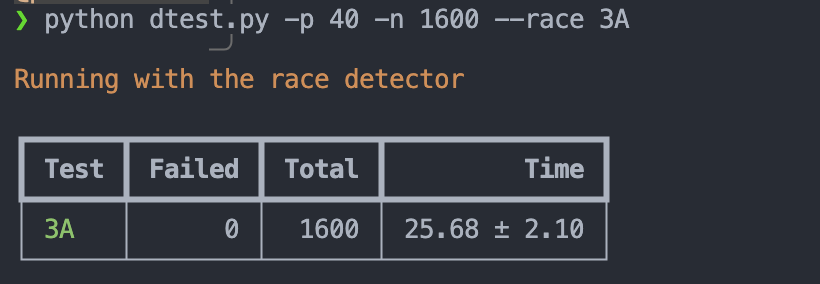

### Part 3B: log

#### 3B Task

实现Log Entries的复制和提交。在Part 3B中的目标是确保所有节点的日志条目保持一致，并且在提交日志条目时，确保它们按正确的顺序提交。

#### 3B Tips

- 运行 git pull 以获取最新的实验版本。
- 你的首要目标应该是通过 TestBasicAgree3B() 测试。首先实现 Start() 方法，然后编写代码通过 AppendEntries RPC 发送和接收新的日志条目，遵循图 2 的说明。在每个节点上，将每个新提交的条目发送到 applyCh。
- 你需要实现选举限制（论文中的第 5.4.1 节）。
- 你的代码中可能存在重复检查特定事件的循环。不要让这些循环在没有暂停的情况下连续执行，因为这会降低你的实现速度，导致测试失败。使用 Go 的条件变量，或者在每次循环迭代中插入 time.Sleep(10 * time.Millisecond)。
- 为了以后实验的方便，编写（或重写）清晰明了的代码。有关想法，请重新访问我们的[指导页面](https://pdos.csail.mit.edu/6.824/labs/guidance.html)，上面有关于如何开发和调试代码的提示。
- 如果测试失败，请查看 test_test.go 和 config.go 来了解正在测试的内容。config.go 还说明了测试器如何使用 Raft API。

#### 3B 测试结果

[重构AppendEntries架构](# 重构AppendEntries架构)后, 重新进行3B测试, 结果如下

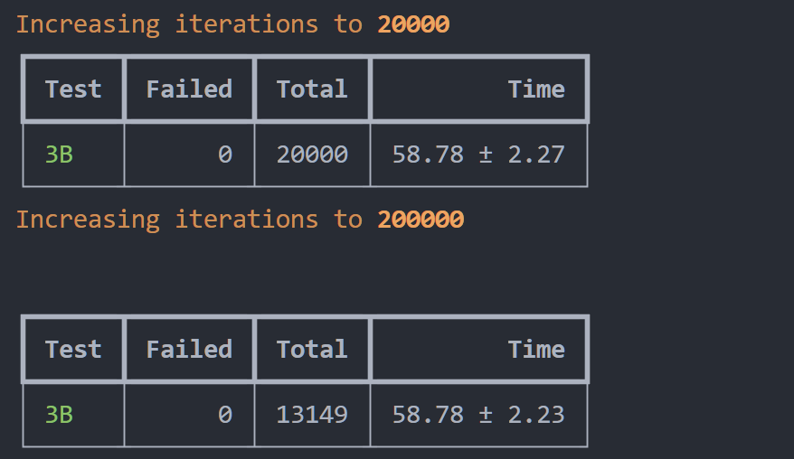

### Part 3C: persistence

如果基于 Raft 的服务器重启，它应该从上次离开的地方恢复服务。这要求 Raft 保持能够在重启后存活的状态。论文中的图 2 提到了哪些状态应该是持久的。

一个真实的实现会在每次 Raft 的持久状态变化时将其写入磁盘，并在重启后重新启动时从磁盘读取状态。你的实现不会使用磁盘；相反，它将从一个 Persister 对象（参见 persister.go）保存和恢复持久状态。无论谁调用 Raft.Make()，都会提供一个最初持有 Raft 最近持久化状态的 Persister（如果有的话）。Raft 应该从该 Persister 初始化其状态，并且应该在每次状态变化时使用它来保存其持久状态。使用 Persister 的 ReadRaftState() 和 Save() 方法。

#### 3C Task

在 raft.go 中完成 persist() 和 readPersist() 函数，通过添加代码来保存和恢复持久状态。您需要将状态编码（或“序列化”）为一个字节数组，以便将其传递给 Persister。使用 labgob 编码器；请参阅 persist() 和 readPersist() 中的注释。labgob 类似于 Go 的 gob 编码器，但如果您尝试编码带有小写字段名的结构体，它会打印错误消息。现在，将 nil 作为第二个参数传递给 persister.Save()。在您的实现更改持久状态的地方插入对 persist() 的调用。完成这些后，如果您的其他实现正确，您应该能够通过所有 3C 测试。

您可能需要优化，以便一次性备份多个 nextIndex 条目。请查看扩展 Raft 论文，从第 7 页底部和第 8 页顶部（灰色线条标记）开始阅读。
论文对细节描述得不够明确；您需要补充这些空白。
一种可能的做法是在拒绝消息中包含以下内容：

- XTerm：冲突条目中的任期（如果有的话）
- XIndex：具有该任期的第一个条目的索引（如果有的话）
- XLen：日志长度

然后，Leader的逻辑可以是如下：

- case 1：Leader没有 XTerm：nextIndex = XIndex
- case 2：Leader有 XTerm：nextIndex = Leader对于 XTerm 的最后一个条目
- case 3：Follower的日志太短：nextIndex = XLen

Tips: 3C 测试比 3A 或 3B 的测试要求更高，失败可能是由您在 3A 或 3B 代码中的问题引起的。

#### 3C 测试结果

![[IMG-20241212173459708.png]]

### Part 3D: log compaction

目前，重启的服务器会重放完整的 Raft 日志以恢复其状态。然而，对于一个长期运行的服务来说，记住完整的 Raft 日志是不切实际的。因此，你需要修改 Raft，使其能够配合服务定期持久化存储“快照”状态。在生成快照后，Raft 可以丢弃早于快照的日志条目。这样可以减少持久化数据的大小并加快重启速度。然而，这也带来了一个问题：某个跟随者可能落后得太多，以至于需要的日志条目已经被领导者丢弃。此时，领导者必须发送快照以及从快照开始的日志条目。Raft 扩展论文的第 7 节概述了该方案，你需要设计其中的细节。

你的 Raft 实现需要提供以下函数，供服务层调用以传递序列化后的快照状态：

```go
Snapshot(index int, snapshot []byte)
```

在实验 3D 中，测试器会周期性地调用 `Snapshot()`。在实验 4 中，你将实现一个调用 `Snapshot()` 的键值对服务器；快照会包含完整的键值对表。服务层会在每个节点上调用 `Snapshot()`（不仅仅是领导者）。

`index` 参数表示快照所包含的日志条目的最高索引。Raft 应丢弃该索引之前的所有日志条目。你需要修改 Raft 的代码，使其能够仅存储日志的尾部部分。

你需要实现论文中讨论的 `InstallSnapshot` RPC，允许 Raft 的领导者通知落后的 Raft 节点用快照替换其状态。你可能需要仔细考虑 `InstallSnapshot` 应如何与论文图 2 中的状态和规则交互。

当跟随者的 Raft 代码收到 `InstallSnapshot` RPC 时，可以通过 `applyCh` 向服务发送快照作为一个 `ApplyMsg`。`ApplyMsg` 的结构定义中已经包含了你需要的字段（测试器也会检查这些字段）。需要确保这些快照只会推进服务的状态，而不会让其状态回退。

如果服务器崩溃，它必须从持久化数据中恢复。你的 Raft 应持久化 Raft 状态以及对应的快照。使用 `persister.Save()` 的第二个参数来保存快照。如果没有快照，传递 `nil` 作为第二个参数。

当服务器重启时，应用层会读取持久化的快照并恢复其保存的状态。

#### 3D Task

你需要实现 `Snapshot()` 和 `InstallSnapshot` RPC，以及支持这些功能的 Raft 修改（例如，支持仅保留修剪后的日志）。当通过 3D 测试（以及所有之前的实验 3 测试）时，你的解决方案才算完整。

#### 3D Tips

- 执行 `git pull` 确保你拥有最新的软件版本。
- 一个不错的起点是修改你的代码，使其能够仅存储从某个索引 X 开始的日志部分。最初，你可以将 X 设置为 0，并运行 3B/3C 测试。然后，改进 `Snapshot(index)`，让其丢弃该索引之前的日志，并将 X 设置为该索引。如果一切顺利，你应该能够通过第一个 3D 测试。
- 接下来：当领导者没有所需的日志条目以使跟随者赶上时，让领导者发送 `InstallSnapshot` RPC。
- 在单个 `InstallSnapshot` RPC 中发送完整的快照。不要实现论文图 13 所描述的分段机制。
- Raft 必须以一种方式丢弃旧的日志条目，使得 Go 的垃圾回收器能够释放并重用这些内存。这意味着必须确保没有任何可达引用（指针）指向被丢弃的日志条目。
- 运行整个实验 3 测试（3A+3B+3C+3D）时的合理耗时参考：
 	- 在不启用 `-race` 的情况下，实际运行时间应为 6 分钟，CPU 时间约为 1 分钟。
 	- 启用 `-race` 时，实际运行时间约为 10 分钟，CPU 时间约为 2 分钟。

#### 3D Tests

##### snapshot的内容

snapshot(状态机在某时刻的状态)在这个测试中存储的是编码后的log(command)以及快照中包含的最后一个log的index, 在测试中会进行解码并检查是否和log匹配

逐步分析: 
1. 编码后的log即为下面的`var xlog []interface{}`
2. **xlog**: 根据config.go, xlog为一个**切片**, 存储`cfg.log[i][j]`, `i`为server, `j`为CommandIndex(LogEntryIndex), `interface{}`存储ApplyMsg.Command
3. **Command**: ApplyMsg.Command即为LogEntry.Command, 这个Command来源于Raft.Start, 由测试程序调用, 通常为指定数字or`rand.Int()`

```go
type config struct {
// ...
	logs        []map[int]interface{} // copy of each server's committed entries
// ...
}

// config.go:145
func (cfg *config) checkLogs(i int, m ApplyMsg) (string, bool) {
	v := m.Command
// ...
	cfg.logs[i][m.CommandIndex] = v
// ...
}

// config.go:218
func (cfg *config) applierSnap(i int, applyCh chan ApplyMsg) {
// ......
	w := new(bytes.Buffer)
	e := labgob.NewEncoder(w)
	e.Encode(m.CommandIndex)
	var xlog []interface{}
	for j := 0; j <= m.CommandIndex; j++ {
		xlog = append(xlog, cfg.logs[i][j])
	}
	e.Encode(xlog)
	rf.Snapshot(m.CommandIndex, w.Bytes())
// ......
}
```


##### Snapshot的测试逻辑

applierSnap函数中描述了启用快照功能后, 快照的调用时机
- applyCh接收Raft的两种ApplyMsg: command(`CommandValid == true`) or snapshot(`SnapshotValid == true`)
- 当接收到snapshot时, 解码, 并更新对应server的log
- 当接收到command时, 检查是servers否一致, 然后每当接受到的command达到SnapShotInterval个时, 调用一次Raft的Snapshot

#### 3D 测试结果

## 测试记录

### unreliable

如果 `reliable` 为 `false`，`Network` 的 `processReq` 方法会模拟不可靠的网络行为，包括以下几种情况：

1. **短延迟**：在处理请求之前，函数会随机延迟一段时间（0 到 26 毫秒）。
2. **请求丢失**：有 10% 的概率请求会被丢弃，返回一个超时错误。
3. **回复丢失**：有 10% 的概率回复会被丢弃，返回一个超时错误。
4. **长时间重新排序**：有 60% 的概率回复会被延迟一段时间（200 到 2200 毫秒）。

备注: reliable时, RPC耗时约为1ms

## 3A实现记录

### RequestVote

> 接收方在接收到该 RPC 后会进行以下操作：
>
> 1. 若 `term < currentTerm`，返回 `false`
> 2. 若 `votedFor == null`或 `votedFor == args.CandidateId`, 且给定的日志记录信息可得出对方的日志和自己的相同甚至更新，返回 `true`

并未提到当`term > currentTerm`时的处理, 但是在实现中, 应该修改voteFor为null并更新currentTerm, 因为此时的term比当前term大, 说明当前term已经过时, 不能再投票给之前的候选人
即在`1.`和`2.`之间加入下面的代码

```go
  // 如果收到的任期比当前的高，说明Follower需要更新任期并重置votedFor
 if args.Term > rf.currentTerm {
  rf.currentTerm = args.Term
  rf.votedFor = NULL
 }
```

当`term == currentTerm`时, 我的实现方式如果 `votedFor == null`或 `votedFor == args.CandidateId`, 则直接投票给对方, 否则拒绝投票, 即一个term内只投给一个候选人

#### 问题: 长时间离线的节点重新加入时, term异常高, 导致选举失败

**衍生问题A1**: 如果一个节点A因网络故障离线, 导致term很高(离线期间触发了很多次选举), 但是Log又很旧。在A重新上线后, 如果参与选举, 目前的更新方式会使得被A请求`RequestVote RPC`的节点的currentTerm更新得很高, 但是最终不会选取A为Leader(因为他的Log过时了), 如何解决这个问题?
> 旧版-不够健壮的实现, 导致的不必要的思考
>
> - ~~不进行处理: 最终经过多次的选举, 集群的term会增长到A的term, 使得A的旧Log被同步为集群中的Log~~
>   - ~~但是选举速度如何? 同衍生问题A2, A的term也在增长, 通过random的选举超时时间, 并不一定能保证集群能追上A的term~~
> - ~~进行处理: 考虑在`term > currentTerm`时也进行日志的比较, 如果对方的日志并没有比自己的新, 则拒绝更新term(不调用convertToFollower方法), 这样至少不会影响到集群这轮的选举~~

在最新版中, 实现了RequestVote RPC方法对args.Term和rf.currentTerm的比较, 如果args.Term>rf.currentTerm大, 则更新rf.currentTerm, 但还会对log的情况进行校验, 从而解决了这个问题

- 其实与上面的[旧版-进行处理]相似, 但是进行分割可以更好的对照论文中的Figure2

**衍生问题A2**: 此外, 如何处理节点A, 使他最后能够加入集群正常工作? A的term很高, 所以会拒绝接受集群中的 具有更新的Log的Leader的`AppendEntries RPC`, 导致A继续发起选举, term接着增长, 最终是否会无法加入集群?

##### 思路A: PerVote算法

> <https://blog.csdn.net/Ethan_199402/article/details/122704353>

Raft作者博士论文《CONSENSUS: BRIDGING THEORY AND PRACTICE》的第9.6节 "Preventing disruptions when a server rejoins the cluster"提到了PreVote算法的大概实现思路。

在PreVote算法中，Candidate首先要确认自己能赢得集群中大多数节点的投票，这样才会把自己的term增加，然后发起真正的投票。其他投票节点同意发起选举的条件是（同时满足下面两个条件）：

1. 没有收到有效领导的心跳，至少有一次选举超时。
2. Candidate的日志足够新

日志足够新怎么判断

1. Term更大，此时要与Basic Raft算法区分开来，后者会不断增加Term，而前者首先要确认自己能赢得集群中大多数节点的投票，这样才会把自己的term增加
2. Term相同raft index更大。

PreVote算法解决了网络分区节点在重新加入时，会中断集群的问题。在PreVote算法中，网络分区节点由于无法获得大部分节点的许可，因此无法增加其Term。然后当它重新加入集群时，它仍然无法递增其Term，因为其他服务器将一直收到来自Leader节点的定期心跳信息。一旦该服务器从Leader接收到心跳，它将返回到Follower状态，Term和Leader一致。

- 需要修改协议结构, 过于复杂

---

##### 思路B: 限制term增长速度

当多次选举失败后, 限制term的增长速度

---

##### 思路C: Candidate转变为Follower

在RequestVoteReply中, 包含server的term, 可以将其利用起来, 当Candidate的term比server的term小时, 将自己转变为Follower, 并更新自己的currentTerm

- 缺点: term可能会增长过快, 有没有溢出的风险
  - 解决方案: BC结合, 实现起来代码量不大 (TODO, 仅单独采用了C, 尚未结合B)

#### Candidate等待RPC过久, 导致重新触发选举

情况描述: 目前的实现方式是并行给所有节点发送RequestVote RPC, 每个节点最多重发次数为3. 但是test中这样的发送时间会赶不上electionTimeoutTicker的时间, 导致Candidate等待RPC过久, 从而重新触发选举

test中模拟的情况: server会最高等待7000ms, 远大于electionTimeout
↓labrpc.go

```go
  if enabled && servername != nil && server != nil {
    ...
 } else {
  // 模拟没有回复和最终超时。
  ms := 0
  if rn.longDelays {
   // 让 Raft 测试检查Leader是否不同步发送 RPC。
   ms = (rand.Int() % 7000)
  } else {
      //许多 kv 测试需要客户端尝试每个服务器以相当快的速度连续运行。
   ms = (rand.Int() % 100)
  }
  time.AfterFunc(time.Duration(ms)*time.Millisecond, func() {
   req.replyCh <- replyMsg{false, nil}
  })
 }
```

**解决方案**: 如果收到足够的选票, 则直接转变为Leader, 不再等待RPC

### 心跳实现

raft论文中的心跳机制为: 当收到Leader心跳时, Follower重置选举超时时间

但是参考tips:
> 您需要编写一些定时执行或延迟执行的代码。最简单的方法是创建一个循环调用 `time.Sleep()` 的goroutine；参见 `Make()` 方法创建的用于此目的的 `ticker()` goroutine。不要使用Go的 `time.Timer` 或 `time.Ticker`，因为它们很难正确使用。

一个较为简单的实现方式

- 对Follower: electionTimeoutTicker() goroutine中, 每隔一次ElectionTimeout, 检查在这期间是否收到过心跳, 如果没有, 则进行选举
- 对Leader: 另开一个heartbeatTicker() goroutine, 每隔一次HEARTBEAT_INTERVAL发送心跳

#### 发送心跳方式

并行发送心跳, 并且不等待发送AppenEntries RPC的结果
如果进行等待, 可能因为网络问题(这个在3A的测试范围内)导致等待时间过长, 从而导致心跳周期>选举超时时间

##### 关于并发的Data Race问题

问题背景: 心跳需要并行发送(通过在for中创建协程实现), 且主协程不等待发送协程
情况描述:

- 在前一版本中, 心跳请求在协程中发送, 需要通过访问共享资源来构造请求args
- 但是在主协程创建协程的for循环结束后, 就会解锁, 此时有概率go的请求args构造还没完成, 导致data race

解决方案: 将构造请求在for中完成, 而非在协程中实现

### 并发bug(在3B中发现)

**问题情况:**  

1. S0选举超时, 开启协程(go rf.startElection())进行选举
2. startElection()选举需要获取锁, 但是此时锁被RequestVote RPC占用, 并且此时投票给其他Server
3. RequestVote RPC返回, 但是startElection并没有校验term, 从而错误地发起一次选举

### 重复选举bug(在3C中发现)

```go
func (rf *Raft) electionTimeoutTicker() {
 for !rf.killed() {

  // Your code here (3A)
  // Check if a leader election should be started.
  // TODO 可能会开启过多的选举协程, 导致状态出现问题
  rf.mu.Lock()
  switch rf.state {
  case Follower:
   if !rf.resetTimeoutFlag {
    go rf.startElection(rf.currentTerm)
   } else {
    rf.resetTimeoutFlag = false
   }
  case Candidate:
   // 未获胜, 开启新一轮选举
   go rf.startElection(rf.currentTerm)
  case Leader:
   // Leader不需要选举
   rf.mu.Unlock()
   return
  }
  rf.mu.Unlock() 

  // pause for a random amount of time between 50 and 350
  // milliseconds.
  // 参考Tips, 修改时间间隔
  ms := ELECTION_TIMEOUT_MIN + time.Duration(rand.Int63n(ELECTION_TIMEOUT_RANGE))
  time.Sleep(ms)
 }
}

```

开启了过多的选举协程, 而且在选举发送完RPC, 统计选票期间会解锁(为了接收其他节点的RPC), 但是这时候可能会有新的选举协程开启, 导致状态出现问题

- 注1: 从Log中观察到的情况是Follower->Leader, 分析认为是两个协程, 一个导致Candidate->Follower, 另一个在等待投票结束后->Leader, 但是没有找到具体的原因

解决方案: 在接收选票后, 检查自身的state和Term是否变化, 保证正确性

- TODO: 启动多个选举进程似乎无法避免?

感想: 小坑好多, 没有完善的测试怎么发现QAQ

## 3B 实现记录

### 3B-1 heartbeatTicker错误
>
> 在3A中未检测出来
> 原先逻辑为: 先发送心跳, 再检测自身是否为Leader, 如果不是, go heartbeatTicker()协程结束, 如果是, sleep HEARTBEAT_INTERVAL后再次发送心跳

但是检测过慢, 如果sleep期间, 自身降级为Follower, 还会发出一次错误的心跳 (导致了一些看晕了的bug, 甚至开始怀疑RPC的正确性)

### 3B-2 奇怪的DataRace

go的切片如果使用的是 args.entries = rf.log[i:j], 获取到的切片依然引用原始的底层数组, 这意味着如果在其他协程中修改/读了entries, 会导致DataRace

### 3B-3 选举超时时间过短

错误发生逻辑: (三个节点S0, S1, S2)

1. S0-Term1-Leader被选举成功, **先**接收到Client的请求, 创建Entry1, 但是尚未发送Heartbeat/AppenEntries RPC
2. 处理Client请求过长, 超出了S1-Term1-Follower的选举超时时间, S1发起选举, 转变为S1-Term2-Candidate
3. S0收到S1的RequestVote RPC, 因为S1的Term比S0大, S0转变为Follower
4. S1当选Leader, 发送Heartbeat
5. S1的Heartbeat到达S0前, 因为选举超时时间过短, S0又发起选举, 转变为S0-Term3-Candidate(拒绝了S1的Heartbeat)
    - 如果这里选举超时时间够长, Heartbeat达到S0时, 就会删除S0的Entry1, 达成一致(之后等待客户端重新请求)
6. S0当选Leader, 但是Client请求超时, 却没有发起重试(在这个test中, retry被关闭了), S0的log因为间接提交机制, AppendEntries RPC复制之后不能通过计数进行commit, 导致卡住, 超过test的限时(报错: failed to reach agreement)

总结: 选举超时时间过短&节点操作时间过长(开启了自制的mutex的log, 每次lock都会打印两次日志, 通过拖慢时间来暴露问题)

```go
const (
 MAX_WAITING_TIMES                 = 3
 APPEND_ENTRIES_RPC_RETRY_INTERVAL = 50 * time.Millisecond
 HEARTBEAT_INTERVAL                = 100 * time.Millisecond // 每秒不能超过10次
 ELECTION_TIMEOUT_MIN              = 1000 * time.Millisecond
 ELECTION_TIMEOUT_MAX              = 2500 * time.Millisecond
 ELECTION_TIMEOUT_RANGE            = int64(ELECTION_TIMEOUT_MAX - ELECTION_TIMEOUT_MIN)
)
```

情形2: 并非选举超时时间过短, 而是electionTimeoutTicker启动go startElection()后, 没有在startElection()开头进行状态验证

- 问题在于这两个函数之间, 被插入了一次心跳(将currentTerm更新为LeaderTerm), 但是startElection()之后会直接currentTerm++, 这时携带更高Term的RequestVote RPC会使得Leader降级, 影响集群稳定性


## 3C 实现记录

### 3C-1 关于Log catch up quickly优化

论文中提到, nextIndex是通过多次RPC来减小(--)的, 实际上出错的概率并不高, 不一定需要实现优化
但是在"TestFigure8Unreliable3C"中存在一种场景: Leader离线并接受到许多Log, 如果仅通过--去减小nextIndex, 会导致大量的RPC, 从而导致超时, 无法通过测试

- 期间还会因为RPC的失败导致心跳失败, 产生一轮无意义的选举

### 3C-2 关于日志复制的实现方式(3B遗留问题)

在通过3B测试的版本中, 日志复制的实现方式是:

- client请求Leader(rf.Start())时, Leader仅将日志追加到自己的Log中, 不进行AppendEntries RPC
- Leader通过心跳周期性地发送AppendEntries RPC, 将日志复制到Follower
  - 发送心跳时会检查nextIndex, 并自动添加日志(args.Entries为空则代表是心跳)

**优点**: 将心跳和日志复制统一在一个发送调用函数中, 代码简洁

**缺点**: 因为日志复制会无限重发, 而心跳不会, 导致下面的情况

- 时间点A启动发送心跳, 进行日志复制, reply失败, 无限重试
- 时间点B启动发送心跳, 同样进行日志复制, reply失败, 无限重试
- ....

对于这个情况, 在3B的实现中, 每次重试都会检查自己是否还是Leader & 更新args(是否变为无日志的心跳), 并主动退出, **保证了正确性**
但是如果Follower与Leader的差距过大, 会导致许多次并行重试(时间点A, B, C...启动的handleAppendEntrirs协程都进行重试), 造成浪费

- 期间还可能因为重试过多导致心跳失败, 产生一轮无意义的选举(没有实现Log catch up quikly优化)
- 在实现串行化重试后, 进行3B测试, 发现如果不实现Log catch up quikly优化, 会导致超时, 无法通过测试(在未实现时, 因为并行重试, 会让nextIndex--的速度更快, 能够通过测试)

#### 串行化重试带来的bug

随手重新测试了3A, 发现串行化重试会阻塞心跳
在3A中有针对RPC超时的测试场景, 这样会导致测试失败

#### 另一种实现方式

- client请求Leader(rf.Start())时, Leader将日志追加到自己的Log中, 并立即发送AppendEntries RPC
- Leader的心跳只是发送空的AppendEntries RPC, 用于心跳检测

缺点:

- 在client请求较多时, 会分散的发送AppendEntries RPC, 造成网络负担(导致一次RPC只发送一个日志)

### 3C-3 重构AppendEntries架构

> 之前心跳和日志复制的实现过于耦合, 导致3C遇到了许多问题, 决定重构

#### handleAppendEntries

向指定server发送一次AppendEntries RPC, 并根据返回值更新nextIndex&matchIndex

```go
// 处理AppendEntries请求(心跳/日志追加)
func (rf *Raft) handleAppendEntries(server int, args *AppendEntriesArgs) {
 var reply = &AppendEntriesReply{}

 ok := rf.sendAppendEntries(server, args, reply)

 rf.mu.Lock()
 defer rf.mu.Unlock()

 if !ok {
  rf.printLog(LogReplication, fmt.Sprintf("send AppendEntries to %d failed", server))
 } else if !reply.Success {
  // 如果是对方的Term比自己大, 则转为Follower
  if reply.Term > rf.currentTerm {
   rf.SetState(Follower, reply.Term)
   return
  }

  // 复制失败, 更新nextIndex
  rf.updateNextIndex(reply, args, server)

  rf.printLog(LogReplication, fmt.Sprintf("%s to %d, nextIndex: %d", mytool.AddColorStr(mytool.PURPLE, "retry AppendEntries"), server, rf.nextIndex[server]))
 } else if reply.Success {
  // 心跳不需要更新nextIndex
  if args.isHeartbeat() {
   return
  }

  // 复制成功, 更新nextIndex和matchIndex
  rf.updateNextIndex(reply, args, server)
  rf.matchIndex[server] = args.Entries[len(args.Entries)-1].Index
  rf.checkAndUpdateCommitIndex()
 }

}
```

#### replicateLogEntries

对一个server复制Log, 并无限重试
因为实现的是串行化重试, 拒绝重入, 被拒绝且没有在重试中被添加的Entries会在下一次心跳中进行复制

```go
// 发送日志, 并无限重试
func (rf *Raft) replicateLogEntries(server int, term int) {
 sendTimes := 0
 beginTime := time.Now()
 // 设置重试标志, 防止其他协程重复发送
 rf.mu.Lock()
 if rf.retrying[server] {
  // 有其他协程正在重发, 放弃本次日志复制
  defer rf.mu.Unlock()
  return
 } else {
  rf.retrying[server] = true
  rf.printLog(Temp, fmt.Sprintf("goroutine(%d) set retrying[%d] to true", getGoroutineID(), server))
 }
 rf.mu.Unlock()

 for !rf.killed() {

  sendTimes++
  rf.mu.Lock()
  // 如果不再是Leader, 则结束重试
  if rf.state != Leader || rf.currentTerm != term {
   defer rf.mu.Unlock()
   rf.retrying[server] = false
   return
  }

  args := &AppendEntriesArgs{
   Term:         rf.currentTerm,
   LeaderId:     rf.me,
   LeaderCommit: rf.commitIndex,
   PrevLogIndex: rf.nextIndex[server] - 1,
   PrevLogTerm:  rf.getLogEntry(rf.nextIndex[server] - 1).Term,
   Entries:      rf.copyLogEntries(rf.nextIndex[server]), // 发送nextIndex之后的日志(如果没有, copyLogEntries返回空)
  }

  // 检查是否需要发送
  if args.isHeartbeat() {
   defer rf.mu.Unlock()
   rf.retrying[server] = false
   rf.printLog(LogReplication, fmt.Sprintf("AppendEntries to %d success\n\t(sendTimes: %d, cost: %v), nextIndex: %d",
    server, sendTimes, time.Since(beginTime),
    rf.nextIndex[server]))
   return
  }

  go rf.handleAppendEntries(server, args)
  rf.mu.Unlock()

  // sleep一会, 重试
  time.Sleep(APPEND_ENTRIES_RPC_RETRY_INTERVAL)

 }
}

```

#### sendHeartBeat

向指定server发送一次心跳

```go
// 发送心跳
// 未上锁
func (rf *Raft) sendHeartBeat(server int) {
 // 心跳也携带Entries, 区别在于是否重试
 var args = &AppendEntriesArgs{
  Term:         rf.currentTerm,
  LeaderId:     rf.me,
  LeaderCommit: rf.commitIndex,
  PrevLogIndex: rf.nextIndex[server] - 1,
  PrevLogTerm:  rf.getLogEntry(rf.nextIndex[server] - 1).Term,
  Entries:      rf.copyLogEntries(rf.nextIndex[server]),
 }

 go rf.handleAppendEntries(server, args)
}
```

## 3D 实现记录

### 3D-1 重构LogEntry, 实现存储部分Log

> A good place to start is to modify your code to so that it is able to store just the part of the log starting at some index X. Initially you can set X to zero and run the 3B/3C tests.

需要重构rf.log的访问相关逻辑(log数组的index需要带有snapshot相关的偏移量)

- 好在之前为了解决"raft的log下标从1开始, 而数组结构从0开始"的问题, 封装了log切片的访问, 重构起来省事一些

事实证明: 重构省事不了多少, 添加snapshot会影响Figure2的部分逻辑, 这里重构起来会比较危险

- 在修改时不够细心, 又浪费一晚上...

### 3D-2 applyCh导致的死锁

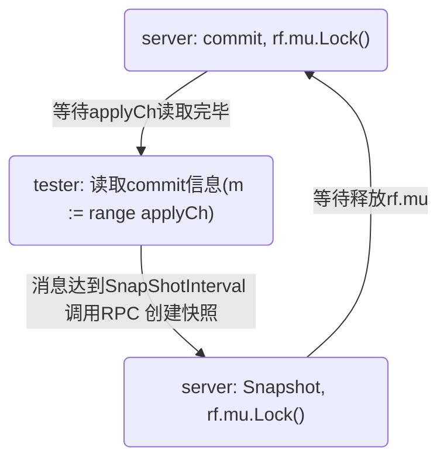

在3D的basic测试中, 在server Commit时被applyCh阻塞, 导致server发生死锁

原因在于config.go的`applierSnap`函数中, 读取applyCh并发现已提交数>SnapShotInterval时, 会调用server的`rf.Snapshot`, 导致死锁

fix方案1: 异步commit, 简单的用go func()去apply, 发现会因为异步导致apply顺序错误, 不能通过测试

fix方案2: 在server中用一个协程专门执行apply, 而不是像之前实现的, 在commit时手动apply

### 3D-3 snapshot交互逻辑

config.go中的applierSnap()用于处理applyCh的消息
- Snapshot消息, 会调用ingestSnap()去处理, 在ingestSnap()的结尾会更新`cfg.lastApplied[i] = lastIncludedIndex`
- Command消息, 在一些校验后会更新`cfg.lastApplied[i] = m.CommandIndex`

如3D-2中描述的, Command消息接收数达到`SnapshotInterval`时, 会调用rf.Snapshot来创建快照, 这时server会发送一个Snapshot消息到applyCh
问题在于: Command的apply是连续发送**连续一段**的, 其中会有某一个达到SanpshotInterval, 调用的Snapshot的index参数是**连续一段的Command**的中间部分, 导致后续的Snapshot消息错误的降低了`cfg.lastApplied[i]`
```shell
16:51:01.120013 0(L, T1, C10) --> [PeerState] Leader COMMIT log entries [2-10], logs: {
	...
}
Temp: server 0 lastApplied 1 -> 2
Temp: server 0 lastApplied 2 -> 3
Temp: server 0 lastApplied 3 -> 4
Temp: server 0 lastApplied 4 -> 5
Temp: server 0 lastApplied 5 -> 6
Temp: server 0 lastApplied 6 -> 7
Temp: server 0 lastApplied 7 -> 8
Temp: server 0 lastApplied 8 -> 9
16:51:01.122495 0(L, T1, C10) --> [Snapshot] start snapshot, index: 9, term: 1
Temp: server 0 lastApplied 9 -> 10
16:51:01.123883 0(L, T1, C10) --> [Temp] update snapshot, snapshot: LastIncludedIndex: 9, LastIncludedTerm: 1, state: ignore
Temp: server 0 lastApplied 10 -> 9 # 这里的lastApplied因为Snapshot降低了
```

正确的逻辑: 不能连续的apply一长段Command, 提交一个Command后需要及时响应Snapshot并apply Snapshot
> [Students' Guide to Raft :: Jon Gjengset](https://thesquareplanet.com/blog/students-guide-to-raft/)
> When snapshotting application state, you need to make sure that the application state corresponds to the state following some known index in the Raft log. This means that the application either needs to communicate to Raft what index the snapshot corresponds to, or that Raft needs to delay applying additional log entries until the snapshot has been completed.

fix方案1: 循环中每次apply1个Command, 然后检查Snapshot是否需要更新
- 在未实现InstallSnapshot时, 会因为Leader apply Snapshot过快, 导致删除了Entries, LogReplicate出错
fix方案2: TODO

相似问题: 在没有实现installSnapshot时, 在3节点情况下
- Leader复制到1个Follower成功, commit->apply->Snapshot, 删除已commit的Log
- 在LogReplicate到另一个Follower时, AppendEntries RPC需要传输**已删除的**LogEntries
- 就算之后实现了InstallSnapshot, 这样也会导致无意义的InstallSnapshot开销(一两个key的修改操作 > 状态机的状态)

### 3D-4 Log size too large

> 卡了好久, 过载期间还分析了一下[快照里到底存了什么](#snapshot的内容) (实际上并不需要考虑快照大小)

```shell
--- FAIL: TestSnapshotBasic3D (4.22s)
    test_test.go:1153: Log size too large, i: 14, size: 2106
FAIL
```

```go
// Maximum log size across all servers
func (cfg *config) LogSize() int {
	logsize := 0
	for i := 0; i < cfg.n; i++ {
		n := cfg.saved[i].RaftStateSize()
		if n > logsize {
			logsize = n
		}
	}
	return logsize
}

func (ps *Persister) RaftStateSize() int {
	ps.mu.Lock()
	defer ps.mu.Unlock()
	return len(ps.raftstate)
}

type Persister struct {
	mu        sync.Mutex
	raftstate []byte
	snapshot  []byte
}
func (ps *Persister) Save(raftstate []byte, snapshot []byte) {
	ps.mu.Lock()
	defer ps.mu.Unlock()
	ps.raftstate = clone(raftstate)
	ps.snapshot = clone(snapshot)
}
```

破案, 忘记Persister.Save()中raftstate和snapshot是分别Persist的了, 难怪too large
- 要注意, test会检查snapshot的内容, 所以persister.Save()参数中的Snapshot应为`func (rf *Raft) Snapshot(index int, snapshot []byte)`的参数snapshot
  
**反思**: 我在实现时, 封装了快照相关状态为一个结构体, 在后续的实现时就出现了逻辑混乱
```go
type RaftSnapshot struct {
	LastIncludedIndex int
	LastIncludedTerm  int
	State             []byte
}
```

### 3D-5 apply过慢(failed to reach agreement)

在完成3D并通过3D(2000轮)测试后, 进行回归测试, 发现在TestFigure8Unreliable3C中会出现FAIL
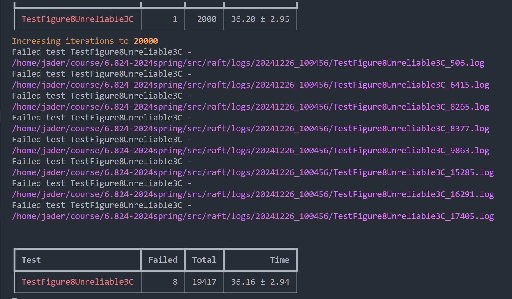

#### 原因1: Snapshot导致的apply过慢

检查日志后, 猜测为快照实现时, 需要及时响应Snapshot并apply快照, 因此applier的循环中, 每次只apply一个log entry
且raft并没有持久化当前apply了哪些信息, 当crash后, server会从0开始逐个apply log, 在日志中会看到巨量连续的apply信息
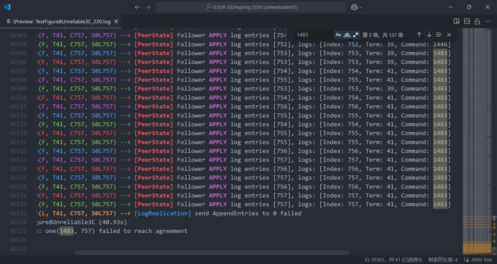
- 可以看到, 应该是只差一些就能及时apply, 通过测试(或许关闭日志就能pass了呢XD)
- 经过测试, 如果改回使用连续apply, 则可以顺利通过测试(变成1/20000了)

fix方案1: 缩短applier的sleep间隔

fix方案: TODO

#### 原因2: 某一server差异过大

在开启测试代码中的Log后发现, apply其实并没有那么慢, apply count = 4, 是其中一个server迟迟没有成功复制日志, 导致超时
**Append过慢原因**: server日志差异过大, 即便实现了quickly catch up, 需要多轮(其实并不多)AppendEntriesRPC

```shell
04:06:04.616491 1(C, T63, C7, S0L402) --> [PeerState] set state to Leader, term: 63

04:06:04.675757 2(F, T63, C7, S0L370) --> [LogReplication] reject AppendEntries RPC from Leader 1, 
    args: {Term: 63, LeaderId: 1, PrevLogIndex: 402, PrevLogTerm: 59, Entries: {}, LeaderCommit: 7}, 
    reply: {Term: 63, Success: false, XTerm: -1, XIndex: -1, XLen: 32}

04:06:04.752765 2(F, T63, C7, S0L370) --> [LogReplication] reject AppendEntries RPC from Leader 1, 
    args: {Term: 63, LeaderId: 1, PrevLogIndex: 370, PrevLogTerm: 46, Entries: {371-402}, LeaderCommit: 7}, 
    reply: {Term: 63, Success: false, XTerm: 43, XIndex: 357, XLen: -1}

04:06:05.043099 2(F, T63, C7, S0L370) --> [LogReplication] reject AppendEntries RPC from Leader 1, 
    args: {Term: 63, LeaderId: 1, PrevLogIndex: 324, PrevLogTerm: 41, Entries: {325-402}, LeaderCommit: 7}, 
    reply: {Term: 63, Success: false, XTerm: 38, XIndex: 281, XLen: -1}

04:06:05.249004 2(F, T63, C7, S0L370) --> [LogReplication] reject AppendEntries RPC from Leader 1, 
    args: {Term: 63, LeaderId: 1, PrevLogIndex: 280, PrevLogTerm: 35, Entries: {281-402}, LeaderCommit: 7}, 
    reply: {Term: 63, Success: false, XTerm: 32, XIndex: 204, XLen: -1}

04:06:05.727440 2(F, T63, C7, S0L370) --> [LogReplication] reject AppendEntries RPC from Leader 1, 
    args: {Term: 63, LeaderId: 1, PrevLogIndex: 203, PrevLogTerm: 33, Entries: {204-402}, LeaderCommit: 7}, 
    reply: {Term: 63, Success: false, XTerm: 29, XIndex: 141, XLen: -1}

04:06:05.958397 2(F, T63, C7, S0L370) --> [PeerState] set state to Candidate, term: 63->64
# 导致Leader重置matchIndex&nextIndex

04:06:06.384125 1(C, T65, C7, S0L402) --> [PeerState] set state to Leader, term: 65

```

进一步分析: 
- 统计每次完成对某一server的日志复制的最终耗时和apply耗时, 研究瓶颈究竟出在哪里

#### fix方案1: 连续apply的取巧

- 使用连续apply, 在每次apply之后发送一个空的ApplyMsg, 用于阻塞连续的apply, 然后检查Snapshot是否更新, 如果有, break以优先apply snapshot
```go
func (rf *Raft) applyLogEntries(lastIncludedIndex int) {
	rf.mu.RLock()
	startIndex := rf.applier.lastAppliedIndex + 1
	endIndex := rf.commitIndex

	appliedEntries := make(LogEntries, endIndex-startIndex+1)
	copy(appliedEntries, rf.getEntriesLogByIndex(startIndex, endIndex))
	rf.mu.RUnlock() // applyCh可能会阻塞, 所以提前释放锁

	for _, entry := range appliedEntries {
		rf.applyCh <- ApplyMsg{
			CommandValid: true,
			Command:      entry.Command,
			CommandIndex: entry.Index,
		}
		rf.applier.lastAppliedIndex = entry.Index
		// 发送一个空消息, 通过ch来阻塞当前的apply, 实现快照apply的检测
		rf.applyCh <- ApplyMsg{}
		// 检查是否需要apply快照
		rf.mu.RLock()
		if rf.snapshot.LastIncludedIndex > lastIncludedIndex {
			rf.mu.RUnlock()
			break
		} else {
			rf.mu.RUnlock()
		}
	}
}
```

- 还真有效(显著降低了超时频率)
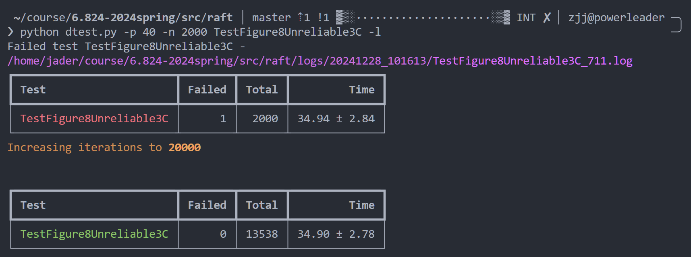

#### 关于选举超时

> 溯源到3A了...

**原因**: 当时为了省事(倒计时实现麻烦), 并没有严格的实现重置超时倒计时, 而是用flag标记, 然后在ticker中以ELECTION_TIMEOUT_RANGE之间随机sleep, 每次检查flag
**后果**: 这样可能会导致实际超时时间<选举超时时间
- 在3A, 3B, 未实现Snapshot的3C中并不会带来较大的问题, 因为重新选举的代价还不够大, 在完成3D, 进行回归测试才暴露

#### fix方案2: 在Leader上任后, 启动一次日志复制

突然想到, 在之前的实现中: 
- 心跳不会进行重试
- Client调用Start添加日志有实现重试(`syncLogEntries()`)
- 二者的Interval相差很大 (心跳按照3A要求, 为100ms)

这会导致, 必须等待Client重发Start才会执行一轮重试较快的synchronize, 这样浪费时间, 会导致进行更多的选举

**测试结果**: fail更频繁了QAQ, 可能原因是
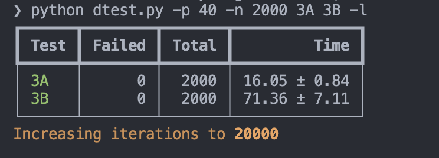

## 重构

> 在实现3D, 发现性能不足后, 进行了无止境的重构(与FAIL)

### 倒计时优化

旧实现:
- ElectionTimeoutTicker: 每次检查resetTimeoutFlag, 然后随机sleep一个ElectionTimeoutInterval
- 重置ElectionTimeout: 设置resetTimeoutFlag=true

旧实现的问题: 通过设置flag的方式, 可能会导致timeout时间不准确
- 说明: 如果在sleep刚开始时设置flag=true, 超时时间会延长到2个ElectionTimeoutInterval

新实现:
- ElectionTimeoutTicker: 每50ms~350ms检查一次lastReceivedHeartbeatTime~Now的时间差是否>electionTimeoutDuration
	- yes: 随机一个electionTimeoutDuration, 开始一次选举
	- no: 等待下一次检查
- 重置ElectionTimeout: 更新lastReceivedHeartbeatTime

#### 3B-4 too many RPCs

```shell
--- FAIL: TestCount3B (7.96s)
    test_test.go:654: too many RPCs (46) for 10 entries
```

在重构ticker后进行了回归测试, 发现了这一问题
- 由于中间间断时间太长, 忘记了之前的实现细节, debug浪费了很多时间

**原因**: 原本的日志复制重试操作中, RPC重试的实现并不是真正重试, 而是开一个协程去
发送和处理reply, 重试协程只是sleep一段时间(50ms), 会导致发送了过量的RPC
- fix方案如上所示

#### 可能不相关的kill bug
在毫无头绪的添加Log后偶然发现, 在上一个go test执行cleanup()后, 某些情况下server并不会正确的被kill
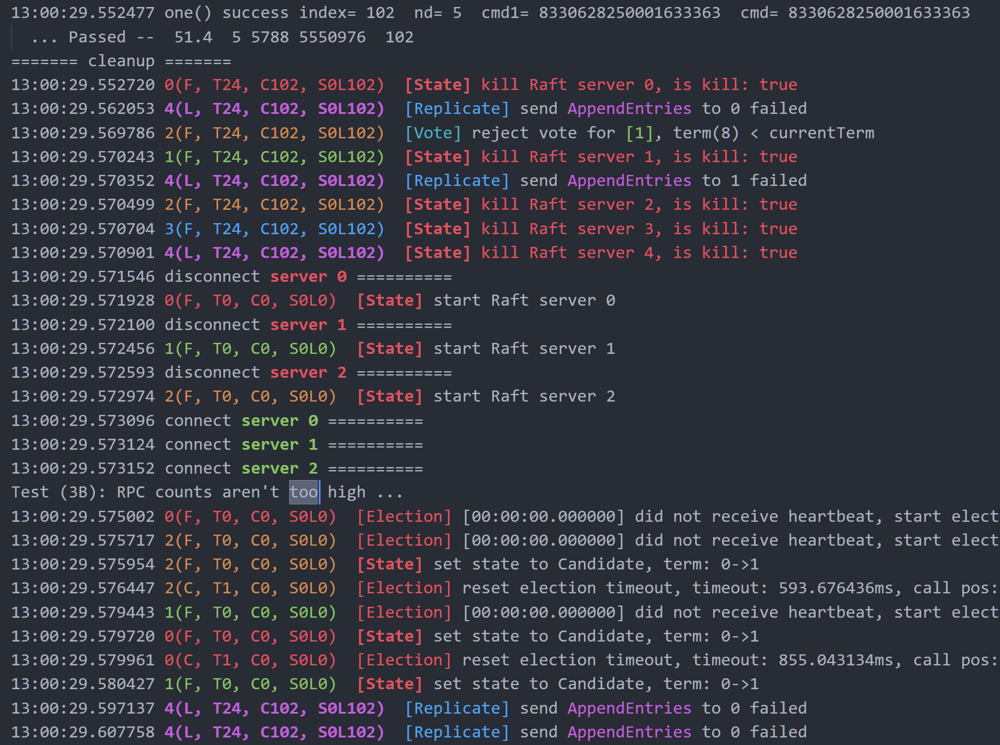
最后发现是因为这时候收到了超时的RPC回复, 所以打印了日志, 可以忽略


### replicator协程

原实现: 
- 每次Start后都启动一个协程进行日志的复制
- 后来发现启动过多协程会导致发送过多的RPC, 改为单协程重试, 重试后发现发送的是heartbeat时, 退出

重构原因: 
- 这样每次还需要创建协程, 导致不必要的开销

重构计划: 
- 在server启动时就创建n-1个replicator协程(n为server个数), 通过heartbeatTicker/Start通知replicator进行无限重试的日志复制
- ~~heartbeatTicker通知情形: 当需要日志复制时, 通知replicator; 当为无日志的heartbeat时, 并行发送~~
- [HeartbeatTicker](#Heartbeat阻塞问题): 不走replicator, 直接每100ms并行发送RPC
- 通知的实现: 条件变量`Signal()` & `Wait()`

#### leader2 rejected Start()

```shell
# 出现频率约为3/500
--- FAIL: TestFailNoAgree3B (3.44s)
    test_test.go:347: leader2(0) rejected Start()
```
- rejected Start()是因为正在进行一轮选举

当未完成日志复制的server断连时, replicator和的RPC会超时(约2s), 并无限重试
- 同样的, 断连server的RequestVote也会超时
但是在测试中, server重连后, 某些情况下(概率3/500)不能及时重发RPC, 并获取到回复, 以进行一轮选举

**fix方案**: RequestVoteRPC发送fail时, 设置reply为拒绝投票
- RequestVote实现时设置为无限重试, 这可能导致了阻塞
- 测试结果: 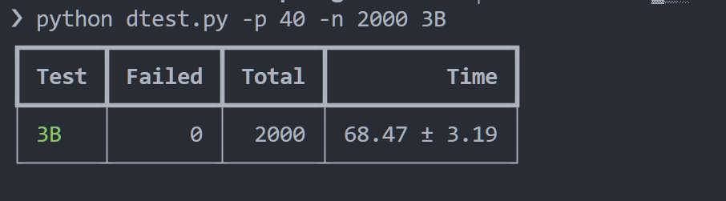
- 还真是这样: ~~怎么这种细节也会影响测试啊~~

**更新**: 但不进行重试也会导致一些偶然的fail
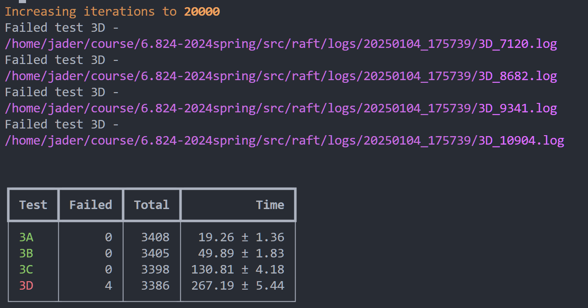
- 改为尝试发送三次试试


### vote优化

抽出了Vote相关状态为VoteState, 并封装了一些方法
```go
type VoteState struct {
	replyCh     chan *RequestVoteReply
	voteEndFlag bool
	rwmu        sync.RWMutex
}
```

同时, 在RequestVote接收到高term的reply时, 保持Candidate状态, 并更新term(但不重置ElectionTimeout)
- 备注: 这样才是正确的操作

### TestFigure8Unreliable3C

```shell
--- FAIL: TestFigure8Unreliable3C (39.75s)
    config.go:635: one(2790, 17) failed to reach agreement
```
在网络不可靠, 且server之间差异较大的情况下, 对日志复制和选举的效率有更高的要求, 可能需要更多的优化

#### Leader的ElectionTimeoutReset

Leader的electionTimeoutTicker会被阻塞, 直到自身不再是Leader
- 旧版的实现: 在Leader->Follower时, 重置选举超时时间, 重启ticker
- 优化: 在Leader发送Heartbeat时, 也对自身的超时时间进行重置

优化说明: 
- 网络不可靠带来的问题是: 某些Follower可能不能按时收到Leader的RPC, 导致触发选举, 进而导致: 
	1. 一个选举时间的服务不可用
	2. 打断旧Leader的日志复制进度, 下一个Leader需要重新开始日志的catch up
- 优化缩短了旧Leader超时时间, 使得它有更高的概率能够上位

测试结果: FAIL率由15/160 降为 5/160, **有效**

#### Heartbeat阻塞问题

heartbeat的发送: 
- 旧实现: 当需要日志复制时, 通知replicator; 当为无日志的heartbeat时, 并行发送
- 新实现: 不走replicator, 直接每100ms并行发送RPC

在当时考虑到并行发送会带来不必要的RPC(因为在[TestCount3B翻车](#3B-4%20too%20many%20RPCs)), 所以在重构为replicator时并没有并行发送
但是在TestFigure8Unreliable3C中, 心跳如果只是通过replicator单线程发送, 不可靠的网络会导致无法通过测试

#### ELectionTimeout的设置

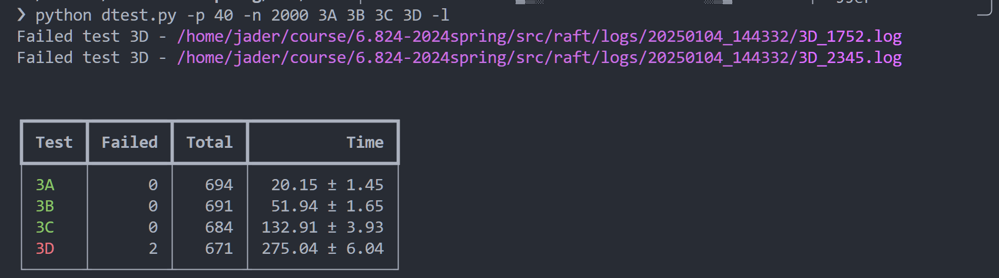


### 重构总结
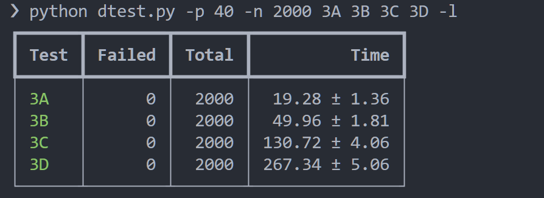


- 重构带来的性能提升可能并不是很大, 主要是让代码更加的简洁易懂
- 这次重构中测试FAIL的部分最终发现都是因为重构过程中没有思考, 顺手改了细节导致的
	- 如: RPC是否要重试([RequestVote](#leader2%20rejected%20Start())), RPC应该并行发送还是阻塞([TestCount3B](#3B-4%20too%20many%20RPCs))...