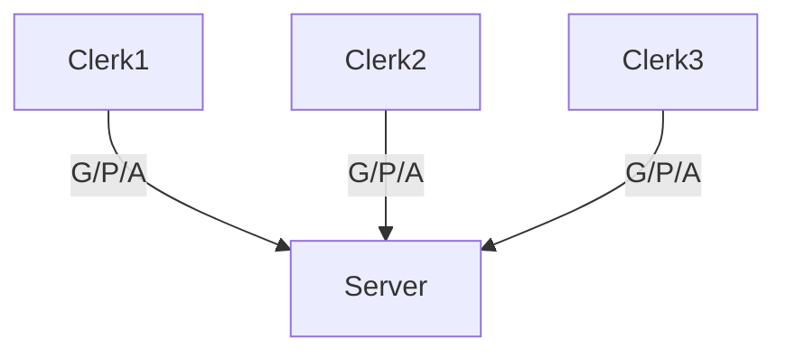
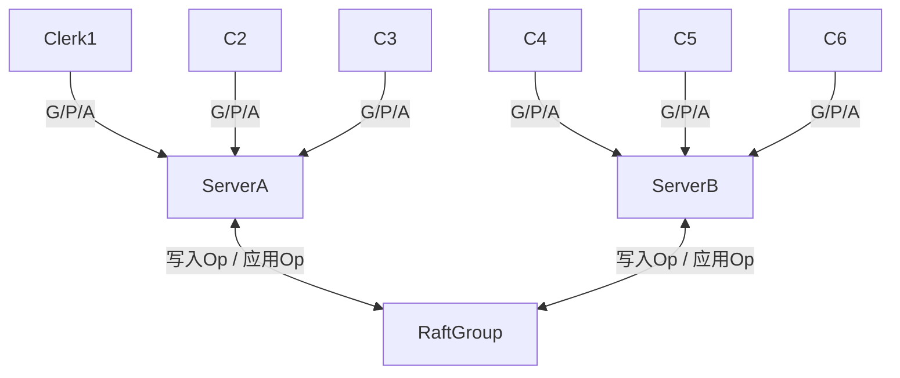

# Lab4 Fault-tolerant Key/Value Service
## 实验文档

### 介绍

在这个实验中，您将使用在Lab 3中构建的Raft库来创建一个容错的Key/Value存储服务。您的Key/Value服务将是一个复制状态机，由多个Key/Value服务器组成，每个服务器维护一个Key/Value对数据库，类似于Lab 2中的情况，但额外使用Raft进行复制。您的Key/Value服务应该能够继续处理客户端请求，只要大多数服务器存活且可以相互通信，即使存在其他故障或网络分区。完成Lab 4后，您将实现所有部分（Clerk, Service, 和 Raft），如[Raft交互图](https://pdos.csail.mit.edu/6.824/notes/raft_diagram.pdf)所示。

客户端将与您的Key/Value服务互动，方式与Lab 2大致相同。具体来说，客户端可以向Key/Value服务发送三种不同的远程过程调用（RPC）：

- `Put(key, value)`：替换数据库中特定键的值。
- `Append(key, arg)`：将`arg`追加到键的值后面（如果该键不存在，则将现有值视为空字符串）。
- `Get(key)`：获取键的当前值（对于不存在的键返回空字符串）。

键和值都是字符串。请注意，与Lab 2不同的是，`Put`和`Append`不应向客户端返回任何值。每个客户端通过一个具有`Put`/`Append`/`Get`方法的Clerk与服务通信。Clerk管理与服务器的RPC交互。

您的服务必须安排应用对Clerk `Get/Put/Append`方法的调用是线性化的。如果依次调用这些方法，它们应该表现得好像系统只有一个状态副本，并且每个调用都应该观察到前面一系列调用所隐含的状态修改。对于并发调用，返回值和最终状态必须与操作按照某个顺序逐一执行时相同。调用是并发的，如果它们在时间上有重叠：例如，如果客户端X调用了`Clerk.Put()`，而客户端Y调用了`Clerk.Append()`，然后客户端X的调用返回。一个调用必须观察到所有在其开始之前已完成的调用的效果。

为单个服务器提供线性化相对简单。如果是复制的服务，这会更困难，因为所有服务器必须为并发请求选择相同的执行顺序，必须避免使用不是最新的状态回复客户端，并且在故障恢复其状态时必须保留所有已确认的客户端更新。

本实验分为两部分。在第一部分A中，您将使用自己的Raft实现来实现一个复制的Key/Value服务，但不使用快照。在第二部分B中，您将使用从Lab 3D得到的快照实现，这将允许Raft丢弃旧的日志条目。请务必在各自的截止日期前提交每一部分。

您应该复习扩展的Raft论文，特别是第7节和第8节。为了获得更广泛的观点，可以参考Chubby, Paxos Made Live, Spanner, Zookeeper, Harp, Viewstamped Replication, 和 Bolosky et al. 的文章。

### 开始

我们在`src/kvraft`目录下为您提供了一个骨架代码和测试案例。您需要修改`kvraft/client.go`, `kvraft/server.go`，以及可能的`kvraft/common.go`。

要开始，请执行以下命令。不要忘记使用`git pull`以获取最新软件版本。

### Part A: 无快照的KV服务

你的每个键值服务器（“kvservers”）将有一个关联的 Raft 副本。客户端(`Clerk`)将 `Put()`、`Append()` 和 `Get()` RPC 发送到其关联的 Raft是Leader的 kvserver。kvserver 代码将 Put/Append/Get 操作提交给 Raft，以便 Raft 日志包含一系列 Put/Append/Get 操作。所有的 kvservers 按顺序执行 Raft 日志中的操作，将操作应用于它们的键值数据库；目的是让服务器维护键值数据库的相同副本。

`Clerk` 有时不知道哪个 kvserver 是 Raft 领导者。如果 `Clerk` 向错误的 kvserver 发送 RPC，或者无法到达 kvserver，`Clerk` 应该通过向不同的 kvserver 发送来重试。如果键值服务将操作提交到其 Raft 日志（并因此将操作应用于键值状态机），领导者将通过回复其 RPC 向 `Clerk` 报告结果。如果操作未能提交（例如，领导者被替换），服务器将报告错误，`Clerk` 将用不同的服务器重试。

你的 kvservers 不应直接通信；它们只应通过 Raft 相互交互。

#### 4A Task1

你的第一个任务是实现一个在没有丢失消息和没有服务器故障时可以工作的解决方案。

你可以自由地将实验 2 中的客户端代码（`kvsrv/client.go`）复制到 `kvraft/client.go`。你需要添加逻辑来决定向哪个 kvserver 发送每个 RPC。回想一下，`Append()` 不再向 Clerk 返回值。

你还需要在 `server.go` 中实现 `Put()`、`Append()` 和 `Get()` RPC 处理程序。这些处理程序应使用 `Start()` 将一个 `Op` 输入 Raft 日志；你应该在 `server.go` 中填写 `Op` 结构定义，以便它描述一个 Put/Append/Get 操作。每个服务器应执行 Raft 提交的 `Op` 命令，即当它们出现在 `applyCh` 上时。RPC 处理程序应注意 Raft 提交其 `Op` 时，并然后回复 RPC。

当你**可靠地**通过测试套件中的第一个测试：“One client(TestBasic4A)”时，你就完成了这个任务。

> **Hints**: 
> - 在调用 `Start()` 之后，你的 kvservers 将需要等待 Raft 完成协议。已达成协议的命令会出现在 `applyCh` 上。你的代码将需要继续读取 `applyCh`，同时 `Put()`、`Append()` 和 `Get()` 处理程序使用 `Start()` 将命令提交给 Raft 日志。注意 kvserver 与其 Raft 库之间的死锁。
> - 如果 kvserver 不是大多数的一部分（因此不会提供陈旧数据），则不应完成 `Get()` RPC。一个简单的解决方案是将每个 `Get()`（以及每个 `Put()` 和 `Append()`）输入 Raft 日志。你不需要实现第 8 节中描述的只读操作的优化。
> - 你不需要向 Raft `ApplyMsg` 或 Raft RPC（如 `AppendEntries`）添加任何字段，但你可以这样做。
> - 最好从一开始就添加Lock，因为避免死锁的需要有时会影响整体代码设计。使用 `go test -race` 检查你的代码是否无竞争。

#### 4A Task2

现在你应该修改你的解决方案，以在网络和服务器故障面前继续运行。 你会面临的一个问题是，`Clerk` 可能不得不多次发送 RPC，直到找到一个回复肯定的 kvserver。如果领导者在将条目提交到 Raft 日志后立即失败，`Clerk` 可能收不到回复，因此可能会将请求重新发送给另一个领导者。 每次调用 `Clerk.Put()` 或 `Clerk.Append()` 应该只导致一次执行，因此你需要确保重新发送不会导致服务器执行请求两次。

添加处理故障的代码，并应对 `Clerk` 的重复请求，包括 `Clerk` 向一个任期的 kvserver 领导者发送请求，等待回复超时，然后在另一个任期向新领导者重新发送请求的情况。请求应该只执行一次。这些说明包括关于重复检测的指导。 你的代码应该通过 `go test -run 4A` 测试。

> **Hints**: 
> - 你的解决方案需要处理领导者已经为 Clerk 的 RPC 调用 `Start()`，但在请求提交到日志之前失去了领导权的情况。在这种情况下，你应该安排 Clerk 向其他服务器重新发送请求，直到找到新领导者。一种方法是服务器通过注意到 Raft 的任期已更改或在 `Start()` 返回的索引处出现了不同的请求来检测它失去了领导权。 如果前领导者被单独分区，它将不知道新领导者；但同一分区中的任何客户端也无法与新领导者通信，因此在这种情况下，服务器和客户端无限期等待直到分区愈合是可以接受的。
> - 你可能需要修改你的 Clerk，记住上一个 RPC 的领导者是哪个服务器，并首先向该服务器发送下一个 RPC。这将避免在每个 RPC 上浪费时间寻找领导者，这可能有助于你足够快地通过一些测试。
> - 你应该使用类似于实验 2 的重复检测方案。它应该快速释放服务器内存，例如通过每个 RPC 暗示客户端已看到其上一个 RPC 的回复。可以假设客户端一次只调用 Clerk 的一个方法。你可能会发现你需要修改你在实验 2 中的重复检测表中存储的信息。

### Part B：带快照的键值服务

目前，你的键值服务器没有调用你的 Raft 库的 `Snapshot()` 方法，因此重启服务器时必须重播完整的持久化 Raft 日志以恢复其状态。现在你将修改 kvserver 以与 Raft 协作，使用实验 3D 中的 Raft 的 `Snapshot()` 来节省日志空间并减少重启时间。

测试器将 `maxraftstate` 传递给你的 `StartKVServer()`。`maxraftstate` 表示你的持久化 Raft 状态的最大允许大小（以字节为单位，包括日志，但不包括快照）。你应该将 `maxraftstate` 与 `persister.RaftStateSize()` 进行比较。每当你的键值服务器检测到 Raft 状态大小接近这个阈值时，它应该通过调用 Raft 的 `Snapshot` 来保存一个快照。如果 `maxraftstate` 为 -1，则无需进行快照。`maxraftstate` 适用于你的 Raft 传递给 `persister.Save()` 的第一个参数的 GOB 编码字节。

修改你的 kvserver，以便它检测到持久化 Raft 状态增长过大时，然后将快照交给 Raft。当 kvserver 服务器重启时，它应该从 `persister` 读取快照，并从快照中恢复其状态。

> Hints
> - 考虑 kvserver 应该何时快照其状态以及快照中应该包含什么。Raft 使用 `Save()` 将每个快照存储在 persister 对象中，连同相应的 Raft 状态。
>   你可以使用 `ReadSnapshot()` 读取最新存储的快照。
> - 你的 kvserver 必须能够在日志中的检查点之间检测重复操作，因此你用于检测它们的任何状态都必须包含在快照中。
> - 快照中存储的结构的所有字段都应该大写。
> - 本实验可能会暴露你 Raft 库中的错误。如果你对 Raft 实现进行了更改，请确保它继续通过所有实验 3 的测试。
> - 合适的实验 4 测试时间是 400 秒的实际时间和 700 秒的 CPU 时间。此外，`go test -run TestSnapshotSize` 应该在不到 20 秒的实际时间内完成。

## 4A 实现记录

> 拖了太久, 还得复习一下lab2的内容...

图中的Clerk1, Clerk2, Clerk3请求是并发的, lab2要实现的是不同Clerk操作之间的一致性

lab4是分布式容错的kvserver, 有多个server, 使用lab3实现的raft来达成共识

检查代码发现: 
- 每个kvserver创建时会获得raft集群的ClientEnd, 并创建一个Raft节点
- 所以kvserver数=raft节点数, 每个kvserver可以通过applyCh来消费已提交的Log
