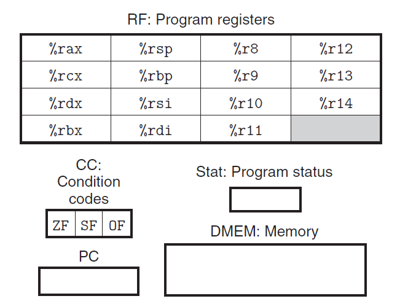
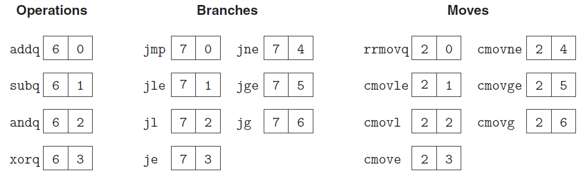
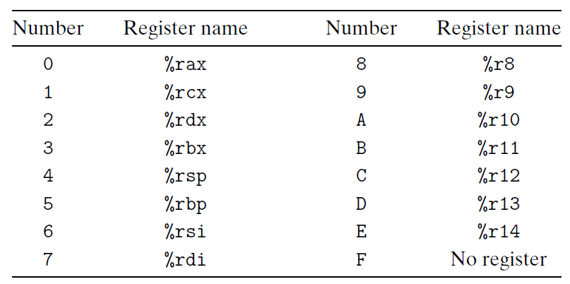
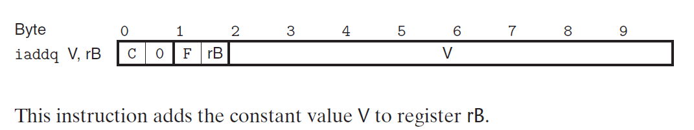

> [本电子书信息 - 深入理解计算机系统（CSAPP） (gitbook.io)](https://hansimov.gitbook.io/csapp/)

# CMU 15-213 CSAPP 深入理解计算机系统

> 因为看到Lecture08才想起做笔记, 有空一定补QAQ(虽然大概率不会)

## 二 Machine Level Programing

### 2.4 Data

2. Understanding Pointers #2
   
   - 描述: 
     - Cmp: Compiles (Y/N)
     - Bad: Possible bad pointer reference (Y/N) 
       指针指向元素未初始化, 会导致Bad
     - Size: Value returned by sizeof
   - c语言数据类型查看规则: 从里到外, 先右后左, 优先的决定数据的类型
     - A3是指向`int array[3]`的**指针**<font color='orange'>(最靠近A3的是`*`)</font>
     - A2/A4是包含三个元素的**指针数组**, 每个元素都是一个指针，指向一个 `int`
   - 
3. Understanding Pointers #3
   - A5是一个包含3个元素的**指针数组**, 每个元素都是一个指向长度为 5 的 `int` 数组的指针

### 2.5 Advanced Topics

1. 内存模型

   - 使用的最大地址: 47位(`0x7FFFFFFFFFF`), 128TB


## 第4章 处理器体系结构

> 参考: [CSAPP笔记 | Kiprey's Blog](https://kiprey.github.io/2020/07/csapp/#四、-处理器体系结构)

> 该章节中，作者定义了一个简单的`Y86`指令集用于学习，以下笔记均以`Y86`指令集为基础进行记录。
> 需要注意的是，尽管书上使用`Y86`指令集进行讲解，我们仍可通过该指令集来探究现代指令集。

### 4.1 Y86-64指令集体系结构

一个处理器支持的指令和指令的字节级编码，称为==指令集体系结构==(Instruction-Set Architecture, ISA)。

#### 4.1.1 程序员可见状态

1. 程序中的每条指令都会读取或修改处理器状态的某些部分，这称为==程序员可见状态==

   - 这里的**程序员**，既可以是用汇编代码写程序的人，也可以是产生机器级代码的编译器。


##### 可见状态

> Y86和X86的可见状态类似

 

包括：

1. RF: 程序寄存器
   - 省略`%r15`, 简化指令编码 (用`F`来表示不需要寄存器参与)
2. CC: 条件码
   - `ZF`: zore flag, 整数运算结果为0
   - `SF`: signal flag
   - `OF`: overflow flag
3. Stat: 程序状态。状态码指明程序是否运行正常或发生某个特殊事件。
4. DMEM: 内存
5. PC: 程序计数器

#### 4.1.2 Y86-64指令

> q: quadword, 四字, 8字节

1. `movq`: 
   - `irmovq`, `rrmovq`, `mrmovq`, `rmmovq`, 显式表明源和目的格式(`i`: 立即数, `r`: 寄存器. `m`: 内存)
   - 其中内存引用是简单的基址(`rX`)和偏移量(`D`)组成的基址寻址
     - 无变址寻址, 相对寻址
2. 整数操作指令`OPq`: 
   - `addq`, `subq`, `andq`, `xorq`
     - `subq rA, rB`: rB-rA
   - 只对寄存器操作
   - 会针对计算结果设置条件码
3. 跳转指令`jXX`
   - `jmp`, `jle`, `jl`, `je`, `jne`, `jge`, `jg`
4. 条件传送指令`cmovXX`
   - `cmovle`, `cmovl`, `cmove`, `cmovne`, `cmovge`, `cmovg`
5. `call`
6. `pushq`和`popq`
7. `halt`: 暂停处理器, 将状态码设置为HLT


#### 4.1.3 指令编码

1. 每条指令需要1~10个字节不等。

2. 每条指令的第一个字节表明指示的类型。其中高4位是**代码**(code)部分，低4位是**功能**(function)部分。

  > 功能值只有在一组相关指令共用一个代码时才有用。

  - 以下是部分指令的具体字节编码

     

  - 以上面的例子为例，`rrmovq`指令与条件传送`cmovXX`有同样的指令代码，可以把它看作是一个“无条件传送”。

3. 指令的长度与指令功能相关，有些需要**操作数**的指令编码就更长一点。

  - 可能有附加的**寄存器指示符字节**(register specifier byte)，用于指定1~2个寄存器
    

  - 有些指令需要一个附加的**常数字**(constant word)。这个立即数成为指令的某个操作数

    - 这个数字用小端编码
    - 例如`irmovq $1, %r9`: `30 f9 01 00 00 00 00 00 00 00` 
      

### 4.2 逻辑设计和HCL

### 4.3 Y86-64的顺序实现

#### 4.3.1 将处理组织成阶段

1. 五个阶段的简略描述

   - **取指**（fetch）：取指阶段从内存读取指令字节，地址为程序计数器（PC)的值。
     - 从指令中抽取出指令指示符字节的两个四位部分，称为`icode`（指令代码）和`ifun`（指令功能）。
     - 可能取出一个寄存器指示符字节，指明一个或两个寄存器操作数指示符`rA`和`rB`。
     - 还可能取出一个四字节常数字valC。它按顺序方式计算当前指令的下一条指令的地址`valP`(valP=PC+取出指令的长度)
   - **译码**（decode）：译码阶段从寄存器文件读入最多两个操作数，得到值`valA`和or或`valB`。通常，它读入指令`rA`和`rB`字段指明的寄存器，不过有些指令是读寄存器`%rsp`的。
   - **执行**（execute）：在执行阶段，算术/逻辑单元(ALU)要么执行指令指明的操作（根据ifun的值），**计算**内存引用的有效地址，要么增加或减少栈指针。得到的值我们称为`valE`。
     - 在此，也可能设置条件码`CC`。
     - 对一条**条件传送指令**来说，这个阶段会检验条件码和传送条件（由ifun给出），如果条件成立，则更新目标寄存器。
     - 同样，对一条**跳转指令**来说，这个阶段会决定是不是应该选择分支。
   - **访存**（memory）：访存阶段可以将数据写入内存，或者从内存读出数据。读出的值为`valM`。
   - **写回**（writeback）：写回阶段最多可以写两个结果到寄存器文件。
   - **更新PC**（PCupdate）：将PC设置成下一条指令的地址。

2. <a name="图4-18">图4-18</a> Y86-64指令`OPq`、`rrmovq`和`irmovq`在顺序实现中的计算。这些指令计算了一个值，并将结果存放在寄存器

   - | 阶段       | OPq rA, rB                                                   | rrmovq rA, rB                                                | irmovq V, rB                                                 |
     | ---------- | ------------------------------------------------------------ | ------------------------------------------------------------ | ------------------------------------------------------------ |
     | **取指**   | icode:ifun ← M~1~[PC]<br />rA:rB ← M~1~[PC+1]<br /><br />valP ← PC+2 | icode:ifun ← M~1~[PC]<br />rA:rB ← M~1~[PC+1]<br /><br />valP ← PC+2 | icode:ifun ← M~1~[PC]<br />rA:rB ← M~1~[PC+1]<br />valC ← M~8~[PC+2]<br />valP ← PC+10 |
     | **译码**   | valA ← R[rA]<br />valB ← R[rB]                               | valA ← R[rA] (只需要rA的数据)<br />                          |                                                              |
     | **执行**   | valE ← **valB OP valA**<br />**set CC**                      | valE ← 0 + valA                                              | valE ← 0+valC                                                |
     | **访存**   |                                                              |                                                              |                                                              |
     | **写回**   | R[rB] ← valE                                                 |                                                              | R[rB] ← valE                                                 |
     | **更新PC** | PC ← valP                                                    | PC ← valP                                                    | PC ← valP                                                    |

     - M~n~[x]:访问x位置n个字节的数据

3.  <a name="图4-19">图4-19</a> Y86-64指令rmmovq和mrmovq在顺序实现中的计算。这些指令读或者写内存

   - | 阶段       | rmmovq rA, D(rB)                                             | mrmovq V, rB                                                 |
     | ---------- | ------------------------------------------------------------ | ------------------------------------------------------------ |
     | **取指**   | icode:ifun ← M~1~[PC]<br />rA:rB ← M~1~[PC+1]<br />valC ← M~8~[PC+2]<br />valP ← PC+10 | icode:ifun ← M~1~[PC]<br />rA:rB ← M~1~[PC+1]<br />valC ← M~8~[PC+2]<br />valP ← PC+10 |
     | **译码**   | valA ← R[rA]<br />valB ← R[rB]                               | <br />valB ← R[rB]                                           |
     | **执行**   | valE ← valB + valC                                           | valE ← valB + valC                                           |
     | **访存**   | **M~8~[valE] ← valA**                                        | **valM ← M~8~[valE]**                                        |
     | **写回**   |                                                              | <br />**R[rA] ← valM**                                       |
     | **更新PC** | PC ← valP                                                    | PC ← valP                                                    |

4. <a name="图4-20">图4-20</a> Y86-64指令pushq和popq在顺序实现中的计算。这些指令将值压入或弹出栈

   - | 阶段       | pushq rA                                                     | popq rA                                                      |
     | ---------- | ------------------------------------------------------------ | ------------------------------------------------------------ |
     | **取指**   | icode:ifun ← M~1~[PC]<br />rA:rB ← M~1~[PC+1]<br /><br />valP ← PC+2 | icode:ifun ← M~1~[PC]<br />rA:rB ← M~1~[PC+1]<br /><br />valP ← PC+2 |
     | **译码**   | valA ← R[rA]<br />**valB ← R[%rsp]**                         | **valA ← R[%rsp]**<br />**valB ← R[%rsp]**                   |
     | **执行**   | valE ← valB + (-8)                                           | valE ← valB + 8                                              |
     | **访存**   | **M~8~[valE] ← valA**                                        | **valM ← M~8~[valA]**                                        |
     | **写回**   | **R[%rsp] ← valE**<br />                                     | **R[%rsp] ← valE**<br />R[rA] ← valM                         |
     | **更新PC** | PC ← valP                                                    | PC ← valP                                                    |

5. <a name="图4-21">图4-21</a> Y86-64指令`jXX`、`call`和`ret`在顺序实现中的计算。这些指令会导致控制转移

   - | 阶段       | jXX Dest                                                     | call Dest                                                    | ret                                                |
     | ---------- | ------------------------------------------------------------ | ------------------------------------------------------------ | -------------------------------------------------- |
     | **取指**   | icode:ifun ← M~1~[PC]<br /><br />valC ← M~8~[PC+1]<br />valP ← PC+9 | icode:ifun ← M~1~[PC]<br /><br />valC ← M~8~[PC+1]<br />valP ← PC+9 | icode:ifun ← M~1~[PC]<br /><br /><br />valP ← PC+1 |
     | **译码**   |                                                              | <br />**valB ← R[%rsp]**                                     | **valA ← R[%rsp]**<br />**valB ← R[%rsp]**         |
     | **执行**   | <br />Cnd ← Cond(CC, ifun)                                   | valE ← valB + (-8)<br />                                     | valE ← valB + 8<br />                              |
     | **访存**   |                                                              | M~8~[valE] ← valP (存栈帧)                                   | valM ← M~8~[valA] (读返回位置)                     |
     | **写回**   |                                                              | R[%rsp] ← valE (更新rsp)                                     | R[%rsp] ← valE (更新rsp)                           |
     | **更新PC** | **PC ← Cnd ? valC : valP**                                   | **PC ← valC**                                                | **PC ← valM**                                      |

##### Archlab PartB 实现iaddq

> 

1. 描述指令实现的计算(参考OPq和irmovq)

   - | 阶段       | OPq rA, rB                                                   | irmovq V, rB                                                 | ==iaddq V, rB==                                              |
     | ---------- | ------------------------------------------------------------ | ------------------------------------------------------------ | ------------------------------------------------------------ |
     | **取指**   | icode:ifun ← M~1~[PC]<br />rA:rB ← M~1~[PC+1]<br /><br />valP ← PC+2 | icode:ifun ← M~1~[PC]<br />rA:rB ← M~1~[PC+1]<br />valC ← M~8~[PC+2]<br />valP ← PC+10 | icode:ifun ← M~1~[PC]<br />rA:rB ← M~1~[PC+1]<br />valC ← M~8~[PC+2]<br />valP ← PC+10 |
     | **译码**   | valA ← R[rA]<br />valB ← R[rB]                               |                                                              | <br />valB ← R[rB]                                           |
     | **执行**   | valE ← **valB OP valA**<br />**set CC**                      | valE ← 0+valC                                                | valE ← **valB OP valC**<br />**set CC**                      |
     | **访存**   |                                                              |                                                              |                                                              |
     | **写回**   | R[rB] ← valE                                                 | R[rB] ← valE                                                 | R[rB] ← valE                                                 |
     | **更新PC** | PC ← valP                                                    | PC ← valP                                                    | PC ← valP                                                    |

2. 修改iaddq指令的控制逻辑快的HCL描述

#### 4.3.4 SEQ阶段的实现


> 详细细节请翻阅CSAPP第三版第277页，这里只是简单概述

##### ①取指阶段

- 以PC作为第一个字节的地址，指令内存硬件单元会一次从内存中读出10个字节。并将第一个字节分割成两个4位的数，用于计算指令和功能码。

- PC增加硬件单元会根据当前PC以及CPU内的信号来生成下一条指令的PC。

  

  newPC=oldPC+1+r+8i�����=�����+1+�+8�

  （

  

  r�

  为当前指令是否需要寄存器指示字节，

  

  i�

  为需要的常数字节数）

  > 注意，此时只是计算，还没有设置下一条的PC
  > 

##### ②译码和写回阶段

> 译码: 将指令码中的rA

- 寄存器文件有两个读端口A和B，从这两个端口同时读取寄存器值valA和valB
  

##### ③执行阶段

- 执行阶段包括ALU，该单元更具`alufun`信号的设置，对输入的`aluA`、`aluB`执行特定操作。
- 指令阶段还包括条件码寄存器。每次运行时，ALU都会产生三个与条件码相关的信号——零、符号、溢出。
- 标号为`cond`的硬件单元会根据条件码和功能码来确定是否进行条件分支或条件数据传送。
  

##### ④访存阶段

- 该阶段的任务为读写程序数据。读写的对象除了主存以外，还包括寄存器文件
  

##### ⑤更新PC阶段

- 根据指令的类型以及是否选择分支来设置新的PC。如果没有跳转，则使用取指阶段计算出的新PC值。
  

### 4.4 流水线

#### a. 流水线冒险

- 将流水线技术引入一个待反馈的系统，当相邻指令间存在相关时会导致问题。

  > 这里的*相关*有两种形式：
  > 1.数据相关。下一条指令会用到当前指令计算出的结果。
  > 2.控制相关。一条指令要确定下一条指令的位置。

  这些相关可能会导致流水线产生计算错误，称为冒险(hazard)。其中也分为*数据冒险*和*控制冒险*。

- 避免冒险的方式

  - 暂停(stalling)。暂停技术阻塞一组指令在它们所处的阶段，而允许其他指令继续通过流水线，直到冒险条件不再满足。其处理方法为：每次要阻塞一条指令在译码阶段，就在指令阶段插入一个气泡（bubble）。气泡类似nop指令，不会更改寄存器、内存、条件码与程序状态。
    
  - 转发(formarding)。将结果值直接从一个流水线阶段传到较早阶段的技术称为数据转发，也称旁路(bypassing)。
    

- 为了提高CPU的运行速度，应尽量避免流水线冒险


## 第5章 优化程序性能

1. 使用局部变量减少重复计算

   - 在二维数组中, 减少行坐标的乘法运算

   - 对于strlen函数(复杂度O(n)), 只需要运行一次, 将结果暂存

     ```c
     void lower(char *s)
     {
     	size_t i;
     	for (int i=0; i<strlen(s); i++) { // n次调用strlen(s), 复杂度变为O(n^2)
             if(s[i]>='A' && s[i]<='Z') s[i]-=('A'-'a');
         }
     }
     ```

     - 因为strlen和lower是分开编译, 最后再链接的, 编译器无法自动进行优化

2. 减少内存反复读写

   - ```c
     // 将a[i]行之和保存到b[i]中
     void sum_rows1(double *a, double *b, long n)
     {
         long i, j;
         for (i = 0; i < n; i++)
         {
             b[i] = 0;
             for (j = 0; j < n; j++)
                 b[i] += a[i * n + j];
         }
     }
     ```

     ```assembly
     # sum_rows1内层循环
     .L4:
     	movsd (%rsi,%rax,8), %xmm0	# FP load
     	addsd (%rdi), %xmm0			# FP add 
     	movsd %xmm0,(%rsi, %rax,8)	# FP store
     	addq $8,%rdi
     	cmpq %rcx, %rdi
     	jne .L4
     ```

### 循环展开

增加一次循环的步长, 在一次循环内进行多次操作

一个2*1循环展开

```c
for(i=0; i<limit; i+=2) {
	sum = sum + (a[i] + a[i+1]);
}
for(i=0; i<limit; i+=2) {
	x = x OP (a[i] OP a[i+1]); //这里的OP可以是*
}
```


## 七 Linking

>**本章学习期望**
>
> 1. 链接器如何解析引用？什么是库？如何使用库来解析引用？
> 2. 全局和局部变量之间的区别是什么？当定义一个 static 的变量或函数时，到底意味着什么？
> 3. 理解概念：加载和运行程序、虚拟内存、分页、内存映射
> 4. 掌握利用共享库。
>

链接在以下**三个阶段**都可以执行：

1. **编译时**，即在源代码被翻译成机器代码时
2. **加载时**，即程序被加载器加载到内存并执行时
3. **运行时**，即由应用程序来执行

现代系统中，链接是由**链接器**自动执行的。

链接器使**分离编译**成为可能。

### 7.1  编译器驱动程序

**编译器驱动程序**可以使用户根据需要调用**语言预处理器**、**编译器**、**汇编器**和**链接器**。

通过**静态链接**，链接器将多个**可重定位目标文件**组合形成一个**可执行目标文件**。

### 7.2  静态链接

<font color='#66ccff'>静态链接器</font>以**一组可重定位目标文件**和**命令行参数**作为输入，生成一个**完全链接**的、**可以加载和运行**的**可执行目标文件**作为输出。


在构造可执行文件的过程中，链接器主要完成两个任务：

1. <font color='#66ccff'>符号解析</font>
   - <font color='#66ccff'>符号</font>：目标文件定义和引用符号，每个符号对应着一个**函数**、**全局变量**或**静态变量**
   - 符号解析的**目的**：将每个**符号引用**和一个**符号定义** **关联起来**

2. <font color='#66ccff'>重定位</font>
   - 由编译器和汇编器生成的**可重定位目标文件**中的代码和数据节是从 0 开始的。可重定位目标文件中还包含重定位条目。
   - **如何实现重定位**：链接器通过把每个**符号定义**和一个**内存位置（运行时地址）关联起来**以实现重定位。然后修改所有对这些符号的**引用**，使它们指向这个内存位置。


### 7.3 目标文件

一个目标文件又称**目标模块**。目标文件纯粹是**字节块的集合**。目标文件本身是一个字节序列。

这些字节块中有些包含**程序代码**或**程序数据**，其他的则包含**引导链接器和加载器的数据结构**。

**链接器**把这些块连接起来，确定被连接块的运行时位置，并修改代码和数据块中的各种位置。

**目标文件有三种形式：**

1. <font color='66ccff'>可重定位目标文件</font>(Relocatable object file)：包含二进制的**代码**和**数据**。可以与其他可重定位目标文件合并成可执行目标文件。又称 obj 文件，gcc 经过预处理、编译、汇编后生成的 `.o 文件`即为可重定位目标文件。
2. <font color='#66ccff'>可执行目标文件</font>(Executable object file)：包含二进制的代码和数据。可以被直接复制到内存并执行。简称可执行文件，gcc 经过链接后生成的 `.out文件`以及无后缀名文件都是可执行文件。
   - 在 linux 中，`.out 文件`和无后缀名文件基本意义一样，只是命名习惯的不一致而已，即main.out 和 main 两个文件是一样的
3. <font color='#66ccff'>共享目标文件</font> (Shared object file)：特殊类型的可重定位目标文件，即**动态链接库**。如`.so文件`可以在**加载**或者**运行时**被动态地加载进内存并链接。

**静态链接库属于哪种呢？**

编译器和汇编器生成可重定位目标文件和**共享目标文件**，链接器生成可执行目标文件。

目标文件是按照特定的目标文件格式来组织的，各个系统的目标文件格式都不相同。Windows 使用**PE**格式，Linux 使用**ELF**格式。

### 7.4 可重定位目标文件

> 本书以 Linux 中的ELF可重定位目标文件为例。

<font color='#66ccff'>可重定位目标文件</font>由**多个不同的节**组成，每一节都是一个连续的字节序列。指令、初始化了的全局变量、未初始化的的变量分别位于不同的节。


**一个ELF可重定位文件中包含以下节（按位置顺序排列）：**

1. <font color='#66ccff'>ELF头 </font>(ELF header)：特殊的节，包含文件的一些基本属性信息，用来**解释目标文件**和**帮助链接器进行语法分析**。
      - 包含内容：生成该文件的系统的字的大小和字节顺序，ELF 头的大小，目标文件的类型，机器类型(如 x86-64)，节头部表的文件偏移，节头部表中条目的大小和数量。
2. `.text`：包含已编译程序的机器代码。即存放的是指令代码。
3. `.rodata`：包含一些特殊的只读数据。(Read Only data)
4. `.data`：包含**已初始化**的全局和静态变量。
5. `.bbs`：包含**未初始化**的全局和静态变量，以及所有被初始化为 0 的全局或静态变量。
      - **注意：**.bss 节在目标文件中仅是一个占位符，不占据实际空间
      - 这两类变量都是运行时在内存中为其分配变量，并初始化为 0 
      - Block Stared by Symbol / Better Save Space
6. `.symtab`：包含一个**符号表**。存放了在程序中**定义**和**引用**的**符号(即函数和全局变量)**的信息。
      - **注意：**与可编译器中的符号表不同，.symtab 中的符号表不包含局部变量的条目。
7. `.rel.text`：包含一个 .text 节中位置的列表，当链接器把此目标文件与其他文件组合时，需要修改这些位置。
      - 一般**任何调用外部函数或引用全局变量的指令都需要修改**，而调用本地函数的指令则不需要修改。**为什么不需要修改呢？**
      - 注意：**可执行目标文件不需要重定位，一般不包含 .rel.text 和 .rel.data 节。**
      - 理解：**.rel.text 中包含的实际上是**代码的重定位条目**。
8. `.rel.data`：包含被模块引用或定义的所有全局变量的重定位信息。
      - 如果一个已初始化的全局变量其初始值是一个全局变量地址或外部定义函数的地址，就需要被修改。
      - **理解**：.rel.data 中包含的实际上是**已初始化的数据的重定位条目**。
9. `.debug`：一个**调试符号表**，内部包含的条目是程序中定义的局部变量和类型定义，程序中定义和引用的全局变量，还有原始的 C 源文件。
      - **注意：**.debug 节并不总是存在，只有用 -g 选项来调用编译器驱动程序时，才会有这一节。
10. `.line`：包含原始 C 源程序中的**行号**和 .text 节中**机器指令**之间的**映射**。
       - **注意：**.line 节和 .debug 节一样，并不总是存在，只有用 -g 选项来调用编译器驱动程序时，才会有这一节。
11. `.strtab`：包含一个**字符串表**，其中包括.symtab 和 .debug 节中的符号表，以及节头部中的节名字。
       - 字符串表实际上就是一个以 null 结尾的**字符串的序列**。
       - **节头部表：**特殊的节，是一个用来描述目标文件的节。
       - 内容：含有与目标文件中每个节相对应的一个**条目**，描述了对应节的位置和大小等信息。


注意局部变量在**运行时保存在栈中**，既不出现在 .data 节中，也不出现在 .bss 节中。


#### **伪节**

有三个特殊的**伪节**，它们在节头部表中是没有条目的：

1. **ABS：**代表不该被重定位的符号
2. **UNDEF：**代表未定义的符号，即在本目标模块中引用，但在其他地方定义的符号
3. **COMMON：**表示还未被分配位置的未初始化的数据目标。

这些伪节只有可重定位文件中才有，可执行文件中没有。


#### COMMON和.bss的区别

1. **COMMON：**未初始化的全局变量
2. **.bss：**未初始化的静态变量，初始化为 0 的全局或静态变量

原因：未初始化的全局变量是全局符号中的弱符号，编译器将其分配为 COMMON 以表明是弱符号。

### 7.5符号和符号表

> **重定位的核心就是对符号表进行符号解析**

每个可重定位目标模块 m 都有一个符号表（即` .symtab 节`），包含着 m 定义和引用的符号的信息。


**有三种不同的符号：**

1. 由**模块m定义并能被其他模块引用**的**全局符号**。包括非静态的函数和全局变量
2. 由**其他模块定义并被m引用**的全局符号，称之为**外部符号**。对应其他模块中定义的非静态函数和全局变量。
3. 由**模块m定义且只能被m引用**的**局部符号。**包括带 static 属性的函数和全局变量。


**对照C++的语法来理解什么是全局符号和局部符号**（static 对全局变量和函数的**隐藏效果**是一样的）：

1. C++ 中，static 变量只能在本文件中使用，即使外其他文件中用 extern 中声明也不行。属于这里的局部符号
2. C++ 中，非 static 的全局变量在其他文件中也能使用，只需在该文件中用 extern 声明即可。属于这里的全局符号

**注意：**符号表中没有非 static 局部变量的符号，非 static 局部变量在运行时在栈中被管理。这里的局部符号和程序中的局部变量是不同的。

**编译器**在 .data 或 .bss 中**为每个全局变量和static变量的定义分配空间**，并**在符号表中创建一个有唯一名字的符号**。


**符号表中的条目**

符号表实际上是一个**条目的数组**，每个条目描述一个符号的信息。

```c
typedef struct{

    int name;//name 是一个字符串表(.strtab节)中的字节偏移，指向符号的名字(用一个以 null 结尾的字符串表示)

    char type:4;//表明符号的类型：数据或函数（4 bits）

    binding:4;//表明符号是本地的还是全局的（4 bits）//这里的意思似乎是 type 和 binding 分别是一个 char 类型的高四位和低四位

    char reserved;//

    short section;//表明符号位于文件的哪个节中，section 是一个到节头部表的索引。

    long value;//对于可重定位文件而言，value 是距定义目标的节的起始位置的偏移；对于可执行文件而言，value 是一个绝对运行时地址

    long size;//对象的大小，以字节为单位

}
```

符号表中的条目除了符号外，还可以包含各个节的条目，对应原始源文件的路径名的条目。


### **7.6符号解析**

**链接器解析符号引用的方法：**将每个引用和它输入的可重定位文件的符号表中的一个确定的符号定义关联起来。

符号解析可以分为对局部符号的解析和对全局符号的解析：

1. 局部符号：简单明了
  1. 备注：在每个模块中，编译器只允许每个局部符号有一个定义。并且会确保每个静态变量有唯一的名字。
2. 全局符号：更复杂一些
  1. 方式：编译器遇到一个不是在当前模块定义的符号时，会假设该符号是在其他某个模块中定义的，在可重定位目标文件中生成一个符号表条目，并把它交给链接器处理。
  2. 特殊情况：多个目标文件中定义了相同名字的的全局符号。

**这里没有说清是如何完成对局部符号的解析的，也没有说清对全局符号的解析方式**


**重整**

链接器通过对重载函数的不同版本进行重整，将每个唯一的方法和参数列表的组合编码成一个对链接器来说唯一的名字。

#### **7.6.1链接器如何解析多重定义的全局符号**

编译器和汇编器会把每个==全局符号==区分为强或弱，并将之隐含地编码在可重定位文件地符号表里。

1. **强符号**：函数和已初始化的全局变量
2. **弱符号**：未初始化的全局变量


**Linux链接器使用以下规则来处理多重定义的全局符号：**

1. 规则1：不允许有多个同名的强符号
2. 规则2：如果一个全符号和多个弱符号同名，那么选择强符号
3. 规则3：如果有多个弱符号同名，任意选择其中一个

注意：vs 的链接器并未遵守规则2，规则3：如果定义了同名的全局变量，链接器会直接报错，不论是强符号还是弱符号


#### **7.6.2与静态库链接**

可以将多个相关的目标模块打包成一个单独的文件，称为**静态库**。

通过静态库，相关的函数可以被编译为独立的目标模块，然后封装成一个单独的静态库文件。

静态库可以用作链接器的输入。链接器在构造可执行文件时，从静态库中复制被应用程序引用的目标模块，其他未用到的模块则不会复制。

在 Linux 系统中，**静态库**以一种称为存档的特殊文件格式存放磁盘中。存档文件是**一组连接起来的可重定位目标文件的集合**，有一个头部用来描述每个成员目标文件的大小和位置。存档文件后缀名为**.a**。

**理解**：静态库和存档文件可以当作一个东西。存档是文件层面的描述，静态库是模块层面的描述。

在 linux 中，静态链接库是**.a**文件，动态链接库是**.so**文件。在windows 中，静态链接库是 .lib 文件，动态链接库是 .dll 文件。

**静态库的应用实例**


通过如下命令创建静态库：

```shell
linux\> gcc -c addvec.c multvec.c //将 addvec.c 和 multvec 两个文件编译成两个可重定位目标文件

linux\> ar rcs libvector.a addvec.o multvec.o //采用 ar 工具将上一步生成的两个可重定位目标文件 addvec.o 和 multvec.o 封装到静态库 libvector.o 中。
```

#### **7.6.3链接器如何解析引用**

**符号解析的过程**

在符号解析阶段，链接器从左到右按照它们在编译器驱动程序命令行上出现的顺序来扫描可重定位目标文件和存档文件。

在扫描中，链接器会维护一个**可重定位目标文件的集合E**，一个**未解析的符号(即引用了但尚未定义的符号)集合U**，**已定义的符号集合D**。初始时 E, U, D 都为空。

1. 对于命令行上的每个输入文件 f，链接器会判断 f 是一个目标文件还是一个存档文件。
2. 如果 f 是一个目标文件，链接器会把 f 添加到 E，修改 U 和 D 来反映 f 中的符号定义和引用，并继续下一个输入文件。
3. 如果 f 是一个存档文件，链接器会尝试匹配 U 中未解析的符号和存档文件成员定义的符号。
  1. 如果 f 中的某个成员 m 定义了一个符号来解析 U 中的一个引用，就把 m 加到 E 中，并修改 U 和 D 来反映 m 中的符号定义和引用。
  2. 对存档文件中所有的成员目标文件都依次进行这个过程。之后任何不包含在 E 中的成员目标文件都简单地被丢弃。
  3. 处理完 f，链接器会继续处理下一个输入文件。
4. 当链接器扫描完所有输入文件后，如果 U 是非空的，链接器会输出一个错误并终止。

**库在命令行中放在什么位置**

在命令行中，如果定义一个符号的库出现在引用这个符号的目标文件前，引用就不能被解析，链接会失败。因为初始时 U 是空的。

一般把库放在命令行的结尾。如果库之间相互依赖，则依赖者在前，被依赖者在后。如果双向引用，可以在命令行上重复库。

### **7.7重定位**

符号解析完成后，每个符号引用就和一个符号定义（即一个输入目标模块中的一个符号表条目）关联起来了。**到底是怎么关联起来的？**此时链接器已经知道它的输入模块中的代码节和数据节的确切大小（存储在节头部表中），接下来就是重定位步骤了。

重定位将合并输入模块并**为每个符号分配运行时地址**。

**重定位分为两步：**

1. 重定位节和符号定义。分为两步：
  1. 链接器将所有相同类型的节合并为同一类型的新的聚合节。
  2. 链接器将运行时内存地址赋给新的聚合节，赋给输入模块定义的每个节，以及赋给输入模块定义的每个符号。
  3. 上面两步完成后，程序中的每条指令和全局变量都有唯一的运行时内存地址了。
2. 重定位节中的符号引用。
  1. 链接器修改代码节和数据节中对每个符号的引用，是他们指向正确的运行时地址。链接器依赖于可重定位目标模块中的重定位条目。

#### **7.7.1重定位条目**

重定位条目用来解决符号引用和符号定义的运行时地址的关联问题。

当汇编器遇到对最终位置的目标引用时，就会生成一个重定位条目，告诉链接器在合并目标文件为可执行文件时如何修改这个引用。

代码的重定位条目放在 .rel.text 中，已初始化数据的重定位条目放在 .rel.data 中。

每个重定位条目都代表了一个必须被重定位的引用。

**ELF重定位条目的格式**

typedef struct{

long offset; //需要被修改的引用的节偏移（即该符号引用距离所在节的初始位置的偏移）。

long type:32, //重定位类型，不同的重定位类型会用不同的方式来修改引用

symbol:32; //symbol table index,指向被修改引用应该指向的符号

long addend; //一个有符号常数，一些类型的重定位要使用它对被修改引用的值做偏移调整

}

ELF 定义了 30 种不同的重定位类型。以下是其中最基本的两种：

1. R\_X86\_64\_PC32：重定位一个使用32 位 PC 相对地址的引用。
  1. 什么是**PC相对地址**：一个 PC 相对地址就是距程序计数器的值的偏移量。当 CPU执行到一条使用 PC 相对寻址的指令时，就将在指令中编码的 32 位偏移量值加上 PC 的当前运行时值，得到有效地址，PC 值通常是下一条指令在内存中的地址。
2. R\_X86\_64\_32：重定位一个使用 32 位绝对地址的引用。通过绝对寻址，CPU 直接使用在指令中编码的 32 位值作为有效地址。

这两种类型都使用了 x86-64 小型代码模型，该模型假设可执行目标文件中的代码和数据的总体大小小于 2GB，因此可以通过 32 位地址来访问。GCC 默认使用小型代码模型。此外还有中型代码模型和大型代码模型。

#### **7.7.2重定位符号引用**

**1、重定位PC相对引用**

PC 相对引用的机制：在引用中存放着与 PC 的值偏移量。这实际上是符号定义的地址与符号引用的地址差。在实际运行时，当执行到了符号引用的指令时，PC 中的值就是符号引用的地址，加上 与 PC 的偏移量（即符号定义与符号引用的地址差）就得到了符号定义的地址。

备注：这里是相对粗糙的解释，详细的细节还要考虑到 attend 的值，具体的要看书上 481 页。

**2、重定位绝对引用**

绝对引用的机制：引用中存放的就是符号定义的绝对地址

### **7.8可执行目标文件**

**可执行目标文件**是一个二进制文件，包含加载程序到内存并运行它所需的所有信息。

可执行目标文件的格式与可重定位目标文件的格式类似。


其中 ELF头 描述了文件的总体格式，还包括**程序的入口点**，即程序运行时要执行的第一条指令的地址。

段头部表和节头部表描述了可执行文件中的片到内存映像中的段的映射关系。它描述了各节在可执行文件中的偏移、长度、在内存映射中的偏移等。

.text, .rodata, .data 节与可重定位目标文件中的节相似，但已经重定位到它们最终的运行时内存地址。

\_init 节定义了一个小函数 \_init，程序的初始化代码会调用它。

可执行文件是完全链接的，因此比可重定位目标文件少了 .rel 节。

### **7.9加载可执行目标文件**

Linux shell 中运行可执行目标文件的方式：**在命令行中输入文件的名字**（用带 ./ 的相对路径表示）。

\>\> ./prog.o

上面运行了文件 prog.o，因为 prog 不是一个内置的 shell 命令，所以 shell 会认为 prog 是一个可执行目标文件，通过调用**加载器**（是操作系统中的一个程序）来运行它。

**加载**：加载器将可执行目标文件的代码和数据从磁盘复制到内存，然后跳转到程序的第一条指令或入口点来运行程序。

任何 Linux 程序都可以**通过execve函数来调用加载器**。

每个 Linux 程序都有一个运行时内存映像。**代码段总是从0x400000处开始**，后面是**数据段**，然后是**运行时堆段**，通过调用 malloc 库往上增长。堆后面的区域是为共享模块保留的。**用户栈**总是**从最大的用户地址**2^48-1 开始，向较小内存地址增长。从地址 2^48 开始是留给内核的。

在分配栈、共享库、堆的运行时地址的时候，链接器还会使用地址空间布局随机化，所以每次程序运行时这些区域的地址都会改变。

**加载器的工作过程**

加载器运行时，创建一个内存映像（虚拟地址空间），在程序头部表的引导下，**将可执行文件的片复制到代码段和数据段**。然后加载器跳转到程序的入口点，即 \_start 函数的地址（函数在系统目标文件 ctrl.o 中定义），\_start 函数调用系统启动函数 \_\_libc\_start\_main（定义在 libc.o 中），\_\_libc\_start\_main 初始化执行环境，调用用户层的 main 函数，处理 main 函数的返回值，并在需要时把控制返回给内核。


### **7.10动态链接共享库**

静态库解决了如何让大量相关函数对应用程序可用的问题。

静态库的缺点：

1. 静态库需要定期维护和更新。如果想要使用一个更新后的静态库，必须显式地将程序与更新了的静态库重新链接。
2. 调用的静态库中的函数在运行时会被复制到每个运行进程的文本段中。

共享库是为了解决静态库缺陷的产物。也就是说共享库的主要目的就是

1. 共享库与可执行文件相独立，只要输出接口不变（即名称、参数、返回值类型和调用约定不变），共享库更新不会对可执行文件造成任何影响。
2. 允许多个正在运行的进程共享内存中相同的库代码，从而节约宝贵的内存资源。

共享库是一个**目标模块**，在运行或加载时，可以加载到任意的内存地址，并和内存中的程序链接起来。

动态链接：在程序运行或加载时，动态链接器将共享库加载到内存中并和程序链接起来。

共享库在 Linux 中以**.so**后缀表示，在 Windows 中以**.dll**表示。Windows 操作系统中大量使用了共享库。

共享库共享的方式：

1. 一个共享库只有一个 .so 文件，所有引用该库的可执行目标文件共享这个 .so 文件中的代码和数据，而不是像静态库那样复制和嵌入到引用它们的文件中。
2. 在内存中，一个共享库 .text 节的一个副本可以被不同的正在运行的进程共享。

**共享库实例**

生成共享库的方式：

linux\> gcc -shared -fpic -o libvector.so addvec.c multvec.c //将 addvec.c 和 multvec.c 封装到动态库 libvector.so 中

// -fpic 选项指示编译器生成与位置无关的代码。

// -shared 选项指示链接器创建一个共享的目标文件。

**链接共享库**

在 main2.c 函数中，调用了共享库 libvector.so 中的 addvec 函数，因此要将 main2.c 和共享库 libvector.so 链接起来。

linux\> gcc -o prog21 main2.c ./libvector.so //创建了一个可执行目标文件 prog21

将 main2.o 和 libvector.so 链接并不是将 libvector.so 中的内容拷贝到了可执行文件 prog21 中，而是链接器复制了一些 libvector.so 中的重定位和符号表信息，以便运行时可以解析对 libvector.so 中代码和数据的引用。

**理解：**动态链接库是在程序运行或加载时才动态链接的，但并不意味着在执行之前不需要进行其他操作：在链接时链接器要与动态链接库进行一次部分链接以获取到它的重定位和符号表信息。

理解：要在程序中使用动态链接库，也需要在源文件中包含相关的头文件。

下图是动态链接的过程，其中的 libc.so 是包含所有标准 C 函数的动态库。


动态链接器完成链接的操作：

1. 重定位 libc.so 的文本和数据到某个内存段。（理解：这里的意思是将 libc.so 的内容加载到内存中？）
2. 重定位 libvector.so 的文本和数据到另一个内存段。
3. 重定位 prog21 中所有对由 libc.so 和 libvector.so 定义的符号的引用。

上述操作完成后，共享库的位置就固定了，且程序执行的过程中都不会改变。

### **7.11从应用程序中加载和链接共享库**

**动态链接**：应用程序在**运行时**要求动态链接器加载和链接某个共享库（共享库即动态链接库）。

动态链接的应用：

1. **分发软件**。软件开发者常利用共享库来分发软件更新，它们生成共享库的新版本，用户只需要下载共享库并替代当前版本，下一次运行应用程序时，应用将自动链接和加载新的共享库。
2. **构建高性能Web服务器**：许多 Web 服务器使用基于动态链接的方法来生成动态内容。将每个生成动态内容的函数打包在共享库中，当一个浏览器请求达到时，服务器就动态加载并链接相应函数，然后直接调用它，而非创建新的进程来运行函数。

**dlopen函数**

Linux 系统为动态链接器提供了一个简单接口**dlopen函数**，允许应用程序在运行时加载和链接共享库。

#include \<dlfcn.h\>

void \*dlopen(const char \*filename, int flag); //若成功就返回指向句柄的指针，否则返回 NULL。

dlopen 函数加载和链接共享库 filename

**dlsym函数**

dlsym 函数用来调用共享库中的函数

#include \<dlfcn.h\>

void \*dlsym(void \*handle, char \*symbol); //若成功，返回指向符号 symbol 的指针，若出错返回 NULL

两个输入参数中，handle 是一个指向前面已经加载链接了的共享库的句柄，symbol 是一个符号（可以是一个函数名）如果该符号存在，就返回符号的地址，否则返回 NULL。

以 symbol 是一个函数名为例，dlsym 返回该函数的地址，用户用一个函数指针接受返回的地址后，即可以通过该函数指针调用动态链接库中的函数。

**注意**：这要求提前知道动态链接库中的函数名及形参列表，返回类型。

**dlclose函数**

如果没有其他共享库还在使用这个共享库，dlclose 函数就卸载该共享库。

#include \<dlfcn.h\>

int dlclose(void \*handle); //若成功返回 0，出错返回 -1。

**dlerror函数**

#include \<dlfcn.h\>

const char \*dlerror(void); //如果前面对 dlopen, dlsym, dlclose 的调用失败，则返回用字符串表示的错误消息，否则返回 NULL。

**一个例子**

动态链接的过程需要**依次调用dlopen, dlsym, dlclose, dlerror函数**。

#include \<stdio.h\>

#include \<stdlib.h\>

#include \<dlfcn.h\>

int x[2] = {1, 2};

int y[2] = {3, 4};

int z[2];

int main()

{

void \*handle;

void (\*addvec)(int \*, int \*, int \*, int);

char \*error;

/\* Dynamically load the shared library containing addvec() \*/

handle = dlopen("./libvector.so", RTLD\_LAZY);

if (!handle){

fprintf(stderr, "%s\n", dlerror());

exit(1);

}

/\* Get a pointer to the addvec() function we just loaded \*/

addvec = dlsym(handle, "addvec");

if ((error = flerror()) != NULL) {

fprintf(stderr, "%s\n", error);

exit(1);

}

/\* Now we can call addvec() just like any other function \*/

addvec(x, y, z, 2);

printf("z = [%d %d]\n", z[0], z[1]);

/\* Unload the shared library \*/

if (dlclose(handle) \< 0) {

fprintf(stderr, "%s\n", dlerror());

exit(1);

}

return 0;

}

Java 就是**通过dlopen接口加载共享库**来调用 C 和 C++ 函数的。

### **7.12位置无关代码**

共享库的一个主要目的就是允许多个正在运行的进程共享内存中相同的库代码，从而节约宝贵的内存资源。

多个进程如何共享动态库的同一个副本，两种方法：

1. 给每个共享库分配一个事先预备的专用的地址空间片，然后要求加载器总是在这个地方加载共享库。这种方法问题很多。
2. **使用位置无关代码。**这种方法才是实际采用的方法，列出上面那个就是为了用来衬托这个方法的。

位置无关代码（PIC）可以加载而无需重定位。

用户可以对 GCC 使用**-fpic选项**来生成 PIC 代码。共享库的编译必须总是使用此选项。

### **7.13库打桩机制**

**7.14处理目标文件的工具**

Linux 系统种可以帮助处理目标文件的工具：

1. AR：创建静态库，插入、删除、列出和提取成员。
2. LDD：列出一个可执行文件在运行时所需要的共享库。

其他工具省略，详见原书 496 页。

**7.15小结**

链接可以在编译时由静态编译器完成（静态库的链接），也可以在加载和运行时由动态链接器完成（动态库的链接）。

链接器处理的文件是目标文件，目标文件是一种二进制文件，有 3 种不同形式：

1. 可重定位目标文件：
2. 可执行目标文件：静态链接器将多个可重定位目标文件合并成一个可执行目标文件，它可以加载到内存中并执行。.exe 文件就是可执行目标文件。
3. 共享目标文件（共享库）：运行时由动态链接器链接和加载。

链接器的两个主要任务：

1. 符号解析：将目标文件中的每个全局符号都绑定到一个唯一的定义。
2. 重定位：确定每个符号的最终内存地址，并修改对那些目标的引用。

静态链接器是由 GCC 这样的编译驱动程序调用的。它们将多个可重定位目标文件合并成一个单独的可执行目标文件。多个目标文件可以定义相同的符号，链接器可以按照一定规则来解析这些相同的符号。

多个目标文件可以被连接到一个单独的静态库中。链接器用库来解析其他目标模块中的符号引用。许多链接器都是通过从左到右的顺序扫描库来解析符号引用。

加载器将可执行文件的内容映射到内存，并运行这个程序。链接器还可能生成部分链接的可执行目标文件，这样的文件中有对定义在共享库中的例程和数据的为解析的引用。在加载时，加载器将部分链接的可执行文件映射到内存，然后调用动态链接器，动态链接器通过加载共享库和重定位程序中的引用来完成链接任务。

被编译为位置无关代码的共享库可以加载到任何地方，也可以在运行时被多个进程共享。为了加载、链接和访问共享库的函数和数据，应用程序也可以在运行时使用动态链接器。


## **第8章 异常控制流**

从给处理器加电开始，到断电为止，程序计数器假设一个值的序列：a0, a1, a2, ..., an。其中每个 a(k) 都是某个相应的指令 I(k) 的地址。

每次从 a(k) 到 a(k+1) 的过渡称为**控制转移**。这样的控制转移序列叫做**处理器的控制流（control flow）**。

最简单的控制流是一个平滑的序列，其中每个 I(k) 和 I(k+1) 都是相邻的。而诸如跳转、调用、返回等指令则会造成平滑流的突变，这些突变是由程序内部变量带来的。

还有一种突变是由程序外部的原因造成的，比如磁盘返回数据，鼠标关闭程序等，这种突变就叫做**异常控制流**（Exceptional Control Flow, **ECF**）。

**异常控制流 ECF** 发生在计算机系统的各个层次：

1. 硬件层，硬件中断
2. 操作系统层，内核通过上下文切换将控制从一个进程转移到另一个进程
3. **应用层**，一个进程给另一个进程发送信号，信号接收者将控制转移到信号处理程序。

**ECF 的应用：**

1. 操作系统内部。ECF 是操作系统用来实现 I/O、进程和虚拟内存的基本机制。
2. 与操作系统交互。应用程序通过使用一个叫做系统调用（system call）的 ECF 形式，向操作系统请求服务。
3. 编写应用程序。操作系统为应用程序提供了 ECF 机制，用来创建新进程、等待进程终止、通知其他进程系统中的异常事件、检测和响应这些事件。
4. **并发。**ECF 是计算机系统中实现并发的基本机制。并发的例子有：**异常处理程序或信号处理程序中断应用程序的执行，时间上重叠执行的进程和线程。**
5. 软件异常处理。C++ 和 Java 通过 try、catch、throw 等语句来提供异常处理功能。异常处理允许程序进行**非本地跳转**（即违反通常的调用/返回栈规则的跳转）来响应错误情况。非本地跳转是一种应用层 ECF，在 C 中由 setjmp和 longjmp 函数提供。

理解：首先要知道，异常控制流是从程序计数器的控制流层面来描述的。异常控制流就是程序计数器的控制流产生了程序外部原因带来的突变。


### 8.1 异常Exception

==异常==: 是控制流的一些突变, 用来响应处理器状态中的某些变化

#### 8.1.1 异常处理

1. 处理器检测发生事件, 确定异常号k
2. 触发异常, 通过异常表跳转到处理程序
   - 异常表起始地址被存放到==异常表基址寄存器==
3. 处理程序处理完成, 执行“中断返回”指令

##### 异常与过程调用的区别

1. 过程调用会将返回地址压入栈, 而异常返回地址为当前指令(重新执行事件发生时的指令)/下一条指令
2. 处理程序会将一些额外的处理器状态(如条件码EFLAGS寄存器)入栈
3. 如果控制从用户程序转移到内核, 所有项目被压入内核栈, 而非用户栈
4. 异常处理程序运行在内核态

#### 8.1.2 异常的类别

| 类别     | 原因              | 异步/同步 | 返回行为                           |
| -------- | ----------------- | --------- | ---------------------------------- |
| 中断     | 来自I/O设备的信号 | 异步      | 总是返回到下一条指令               |
| 陷阱trap | 有意的异常        | 同步      | 总是返回到下一条指令               |
| 故障     | 潜在可恢复的错误  | 同步      | 可能返回到当前指令(如果错误能解决) |
| 终止     | 不可会务的错误    | 同步      | 不会返回                           |

### 8.4 C中的进程控制

#### 8.4.1 获取pid

```c
#include <sys/types.h> //在Linux中, 定义了pid_t为int
#include <unistd.h>

pid_t getpid(void); // 获取进程id
pid_t getppid(void); // 获取父进程id
```

#### 8.4.2 创建和销毁进程

```c
#include <stdlib.h>

void exit(int status); // 以status作为退出状态, 终止进程
```

```c
#include <sys/types.h> 
#include <unistd.h>

pid_t fork(void);
```

- 对父进程返回子进程pid, 对子进程返回0 (可以通过这个来判断当前进程是父or子)
- 对于父子进程, 他们共享文件(注意输入输出是一种特殊文件)


#### 8.4.3 回收子进程

当一个进程终止时, core不能立即清除该进程, 而是需要父进程来==回收==(reaped)

- 一个终止但尚未被回收的进程称为==僵死进程==(zombie)

- 如果父进程先终止了, 会安排init进程(pid=1)作为子进程的父进程, 由init进程来回收


```c
#include <sys/types.h>
#include <sys/wait.h>

pid_t waitpid(pid_t pid, int *statusp, int options);
pid_t wait(int *statusp); // waitpid简化版本, wait(&status) = waitpid(-1, &status, 0)

// 成功, 返回子进程pid, 若option为WNOHANG, 则为0, 其他错误, 为-1
```

1. pid
   - pid>0, 等待指定进程
   - pid=-1, 等待所有子进程
2. options
   - `0`: 挂起调用进程, 直到等待集合中有一个进程终止
   - `WNOHANG`: 检查是否有子进程退出, 没有, 则**立即返回**
   - `WUNTRACED`: 挂起调用进程, 直到等待集合中一个进程终止/停止
   - `WCONTINUED`: 挂起调用进程, 直到等待集合中一个进程终止or等待集合中一个被停止的几何收到SIGCONT信号重新执行
   - 可以用`|`来组合选项
3. *statusp: 指向进程进程情况status, 在wait.h中定义解释参数的函数
   - WIFEXITED（status）。如果子进程正常终止，通过调用exit或返回，则返回true。
     - WEXITSTATUS（status）。返回正常终止的子进程的退出状态。
       仅在WIFEXITED（）返回true时定义此状态。
   - WIFSIGNALED（status）。如果子进程因未捕获的信号而终止，则返回true。
     - WTERMSIG（status）。返回导致子进程终止的信号编号。
       仅在WIFSIGNALED（）返回true时定义此状态。
   - WIFSTOPPED（status）。如果导致返回的子进程当前已停止，则返回true。
     - WSTOPSIG（status）。返回导致子进程停止的信号编号。
       仅在WIFSTOPPED（）返回true时定义此状态。
   - WIFCONTINUED（status）。如果子进程通过接收SIGCONT信号重新启动，则返回true。

4. 错误条件
   - 调用进程无子进程, waitpid返回-1, 设置errno=ECHILD
   - waitpid被信号中断, 返回-1, errno=EINTR

#### 8.4.4 进程休眠

```c
#include <unistd.h>
unsigned int sleep(unsigned int secs);
// 返回还需要休眠的秒数(如果提前被打断, >0)
```

#### 8.4.5 加载并运行程序

```c
#include <unistd.h>
int execve(const char *filename, const char *argv[], const char *envp[]);
// 执行成功, 无返回, 错误, 返回-1
```

- 与fork创建一个新进程不同, execve在当前进程上下文中加载并运行一个新程序


### 8.5 信号

> ==信号==: 通知进程 系统中发生了某种类型的事件

一些常用信号

| 序号 | 名称                    | 默认行为               | 相应事件                             |
| ---- | ----------------------- | ---------------------- | ------------------------------------ |
| 2    | SIGINT (interrupt)      | 终止                   | CtrlC                                |
| 8    | SIGFPE                  | 终止并写入外存         | 浮点错误(除以零)                     |
| 11   | SIGSEGV (segment fault) | 终止并写入外存         | 无效的内存引用(段异常)               |
| 17   | SIGCHLD (children)      | 忽略                   | 一个子进程停止或者终止 (shell中常用) |
| 18   | SIGCONT (continue)      | 忽略                   | 继续进程(如果进程停止的话)           |
| 19   | SIGSTOP                 | 停止 直到下一个SIGCONT | 不是来自终端的停止信号               |
| 20   | SIGTSTP (terminal stop) | 停止 直到下一个SIGCONT | 来自终端的停止信号                   |

#### 8.5.1 信号术语

> 发送信号到目的进程的步骤

1. 发送信号
   - 内核通过更新目的进程上下文中的某个状态(? 哪个), 发送一个信号给目的进程
   - 信号的发送原因
     - 内核检测到一个系统事件
     - 一个进程调用kill函数, 主动发送信号
2. 接收信号: 目的进程对信号的发送做出反应
   - 进程可以忽略这个信号, 终止or执行一个信号处理程序(signal handler)的用户层函数捕获信号
3. ==待处理信号==: 一个已发送但尚未被接受的信号
   - **一种类型**最多只会有**一个待处理信号**, 不会排队, 多的信号会被**丢弃**
   - 待处理信号为每个进程在pending位向量中维护着待处理信号的集合, 在blocked位向量中维护被阻塞的信号集合
     发送一个信号k, 就会设置pending中的第k位, 接收一个信号k, 就会清除pending中的第k位

#### 8.5.2 发送信号

##### 进程组

每个进程都属于一个进程组, 用一个正整数进程组ID(groupid, gid)表示

```c
#include <unistd.h>

pid_t getpgrp(void); # 获取调用进程的进程组id
int setpgid(pid_t pid, pid_t pgid); # 设置pid的进程所属的进程组id为gpid
# 返回: 成功0,失败1
# 若pid=0, 使用当前进程pid, 若gpid等于0, 则进程组id=pid
```

##### /bin/kill 发送信号

```bash
linux> /bin/kill -9 12315 # 向进程12315发送信号9(SIGKILL)
linux> /bin/kill -9 -12315 # 向进程组*12315发送信号9(SIGKILL)
```

##### 键盘 发送信号

Ctrl+C会导致内核发送一个SIGINT到**前台进程组**的所有进程, 终止前台作业

##### kill函数 发送信号

```c
#include <sys/types.h> 
#include <signal.h>

int kill(pid_t pid, int sig); # 发送sig到进程pid, 如果pid=0 发送到当前进程所在进程组的所有进程
# 成功返回0, 失败返回-1
```

##### alarm函数 定时发送AIGALRM信号

```c
#include <unistd.h>

unsigned int alarm(unsigned int secs);# 在secs秒后发送SIGALARM信号给调用进程
# 返回前一次alarm剩余秒数, 若没有, 返回0
```

#### 8.5.3 接收信号

当进程p从内核态切换回用户态时(系统调用trap / 上下文切换), 内核会检查进程p的未被阻塞的待处理信号集合, 为空, 正常执行下一条指令, 不为空, 选择某个信号k(通常是最小的信号k), 强制p结合接收信号k

##### 改变信号行为

```c
#include <signal.h>
typedef void (*sighandler_t)(int); # 函数指针

sighandler_t signal(int signum, sighandler_t handler);
# 成功, 返回前一次处理程序的指针, 出错, 返回SIG_ERR(不会设置errno)
```

handler说明: 

- handler=`SIG_IGN`: 忽略signum的信号
- handler=`SIG_DEF`: 将类型为signum的信号行为恢复默认
- handler为用户自定义函数(==信号处理程序==)地址, 进程收到signum信号时, 就会调用这个程序, 称为**处理信号**


#### 8.5.4 阻塞和解除阻塞信号

```c
#include <signal.h>

int sigprocmask(int how, const sigset_t *set, sigset_t *oldset); 
int sigemptyset(sigset_t *set);
int sigfillset(sigset_t *set);
int sigaddset(sigset_t *set, int signum);
int sigdelset(sigset_t *set, int signum);
# Returns: 0 if OK, −1 on error
int sigismember(const sigset_t *set, int signum);
# Returns: 1 if member, 0 if not, −1 on error
```


##### sigprocmask

