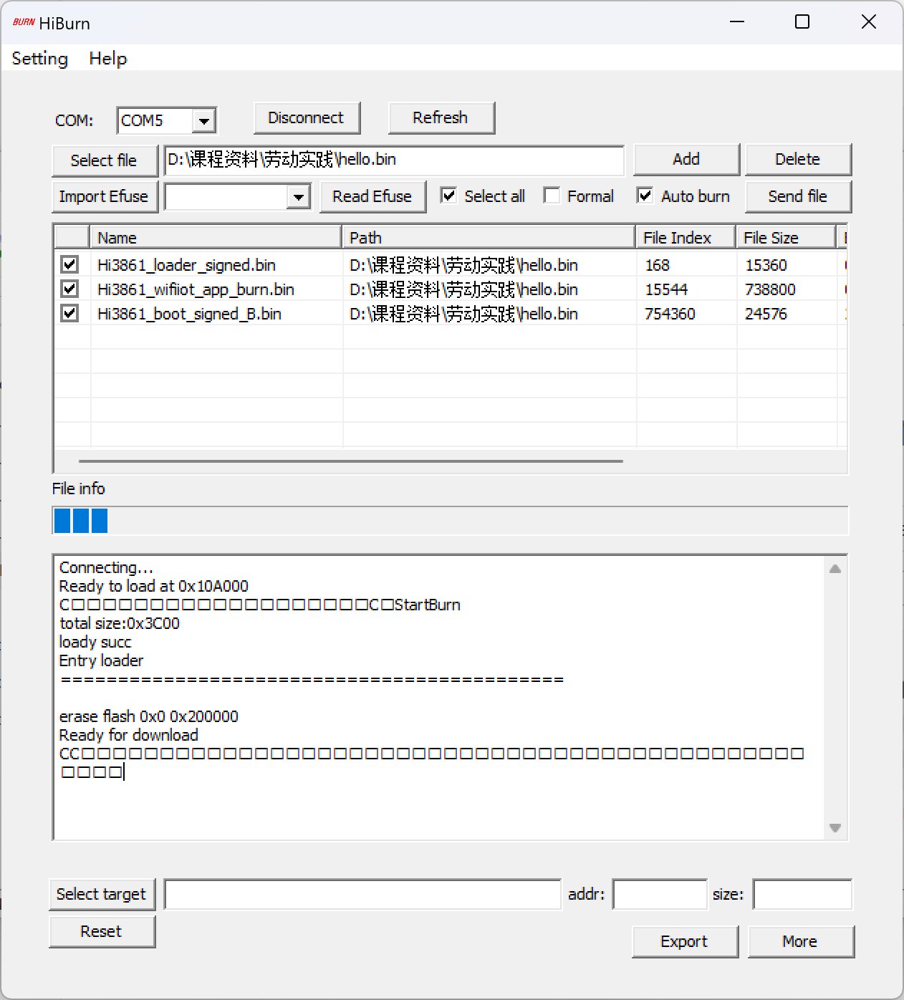
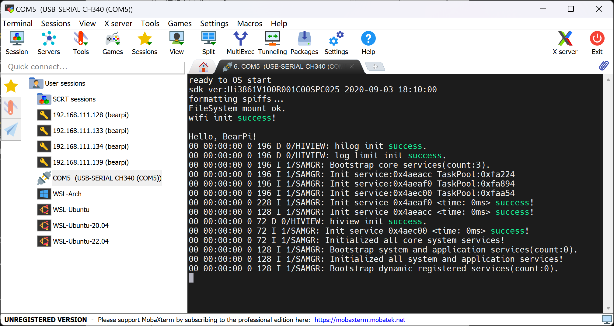
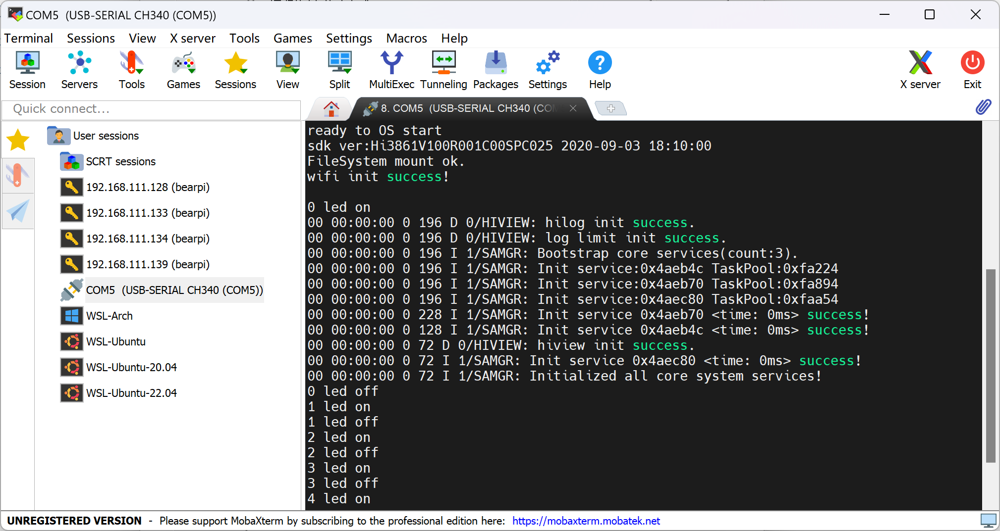
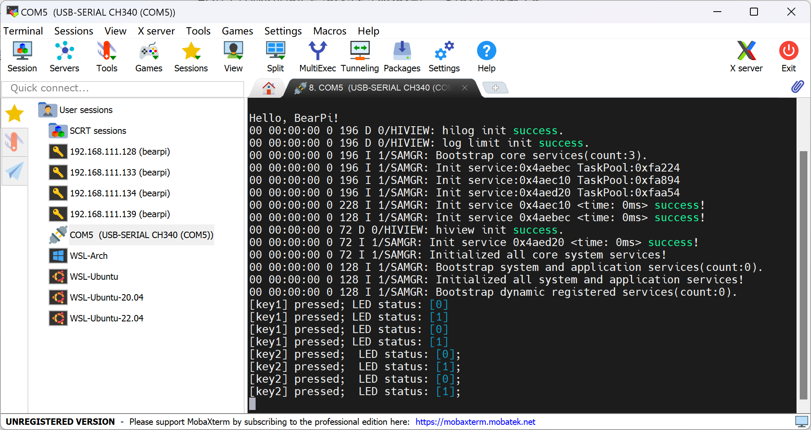
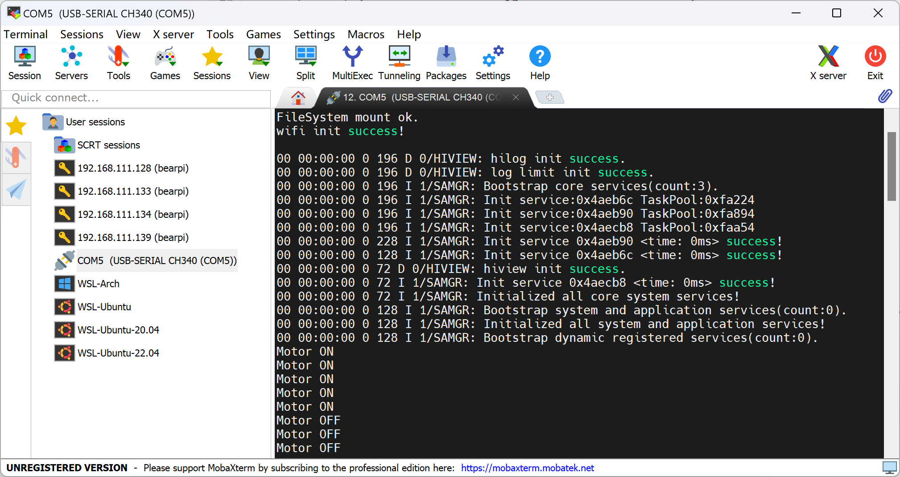
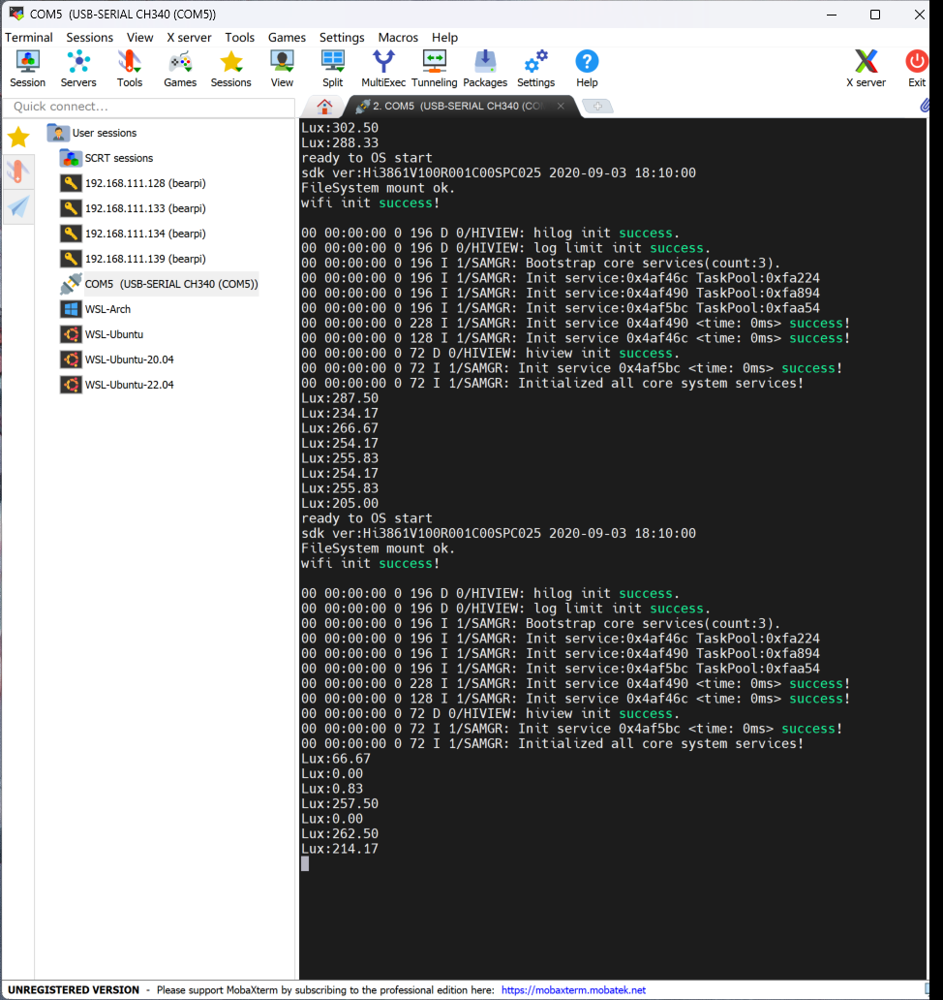

## 1.1 环境配置

### 依赖安装

参考给定的虚拟机镜像的版本

```shell
nvm install 14.15.1

npm install -g @ohos/hpm-cli@1.0.2

pip install pycryptodome

pip install ecdsa
```


### 驱动安装

必须在插上开发板才能安装驱动


###  烧录

1. 文档建议Baud选择 921600, 参考其他人博客 可以设置为3000000, 速度更快
2. 烧录过程似乎要跑两轮进度条, 直到界面显示`Connecting...`后断开

## 2.1 Hello World

编译依然是

```shell
hpm dist
```

BUILD.gn

```json
static_library("myapp") {
    sources = [
        "hello.c"
    ]

    include_dirs = [
        "//utils/native/lite/include",
        "//kernel/liteos_m/components/cmsis/2.0",
        "//base/iot_hardware/interfaces/kits/wifiiot_lite",
    ]
}
```

hello.c

```c
#include <stdio.h>
#include <ohos_init.h>

void led(void)
{
    printf("Hello, BearPi!\r\n");
}
APP_FEATURE_INIT(led);
```

不知道什么缘故 开始烧录需要等待2~3秒, 要耐心XD, 别以为代码出问题了






## 2.2 LED

build.gn

```json
static_library("myled") {
    sources = [
        "led.c"
    ]

    include_dirs = [
        "//utils/native/lite/include",
        "//base/iot_hardware/interfaces/kits/wifiiot_lite",
    ]
}
```

led.c

```c
#include <stdio.h>
#include <ohos_init.h>
#include "wifiiot_gpio.h"
#include "wifiiot_gpio_ex.h"
#include <unistd.h>

void led(void)
{
    int cnt = 0;
    while (1)
    {
        GpioSetOutputVal(WIFI_IOT_IO_NAME_GPIO_2, WIFI_IOT_GPIO_VALUE1);
        printf("%d led on\n", cnt);
        usleep(1000000);
        GpioSetOutputVal(WIFI_IOT_IO_NAME_GPIO_2, WIFI_IOT_GPIO_VALUE0);
        printf("%d led off\n", cnt++);
        usleep(1000000);
    }
}
APP_FEATURE_INIT(led);
```




## button

example使用的引脚是`WIFI_IOT_IO_NAME_GPIO_11 `课程例子用的是`WIFI_IOT_GPIO_IDX_11`

二者等效


实现的是一个按键反转

```c
#include <stdio.h>
#include <ohos_init.h>
#include "wifiiot_gpio.h"
#include "wifiiot_gpio_ex.h"

// 反转value
static void reverse_value(WifiIotGpioValue *value)
{
    if (*value == WIFI_IOT_GPIO_VALUE1)
    {
        *value = WIFI_IOT_GPIO_VALUE0;
    }
    else
    {
        *value = WIFI_IOT_GPIO_VALUE1;
    }
}

void f1_pressed(char *arg)
{
    (void)arg;
    WifiIotGpioValue value;
    GpioGetOutputVal(WIFI_IOT_IO_NAME_GPIO_2, &value);
    printf("[key1] pressed; LED status: [%d]\n", value);
    reverse_value(&value);
    GpioSetOutputVal(WIFI_IOT_IO_NAME_GPIO_2, value);
}

void key_init(void)
{
    hello();
    GpioInit();

    // 初始化LED灯
    IoSetFunc(WIFI_IOT_IO_NAME_GPIO_2, WIFI_IOT_IO_FUNC_GPIO_2_GPIO);
    GpioSetDir(WIFI_IOT_IO_NAME_GPIO_2, WIFI_IOT_GPIO_DIR_OUT);

    // 初始化F1按键，设置为下降沿触发中断
    IoSetFunc(WIFI_IOT_GPIO_IDX_11, WIFI_IOT_IO_FUNC_GPIO_11_GPIO);

    GpioSetDir(WIFI_IOT_GPIO_IDX_11, WIFI_IOT_GPIO_DIR_IN);
    IoSetPull(WIFI_IOT_GPIO_IDX_11, WIFI_IOT_IO_PULL_UP);
    GpioRegisterIsrFunc(WIFI_IOT_GPIO_IDX_11, WIFI_IOT_INT_TYPE_EDGE, WIFI_IOT_GPIO_EDGE_FALL_LEVEL_LOW, f1_pressed, NULL);

    // IoSetFunc(WIFI_IOT_GPIO_IDX_11, WIFI_IOT_IO_FUNC_GPIO_11_GPIO);
    // GpioSetDir(WIFI_IOT_GPIO_IDX_11, WIFI_IOT_GPIO_DIR_IN);
    // GpioRegisterIsrFunc(WIFI_IOT_GPIO_IDX_11, WIFI_IOT_INT_TYPE_EDGE, WIFI_IOT_GPIO_EDGE_FALL_LEVEL_LOW, f1_pressed, NULL);
}

APP_FEATURE_INIT(key_init);
```



## motor

main.c

```c
#include <stdio.h>
#include <stdint.h>
#include <ohos_init.h>
#include "wifiiot_gpio.h"
#include "wifiiot_gpio_ex.h"

#define MOTOR_ON 1
#define MOTOR_OFF 0

#define DEBOUNCE_TIME 50 // 去抖动时间，单位：毫秒

void set_motor(int value)
{
    if (value == 0)
    {
        GpioSetOutputVal(WIFI_IOT_IO_NAME_GPIO_8, WIFI_IOT_GPIO_VALUE0);
    }
    else
    {
        GpioSetOutputVal(WIFI_IOT_IO_NAME_GPIO_8, WIFI_IOT_GPIO_VALUE1);
    }
}

void f1_pressed(char *arg)
{
    (void)arg;

    WifiIotGpioValue value = WIFI_IOT_GPIO_VALUE1;
    GpioSetOutputVal(WIFI_IOT_IO_NAME_GPIO_2, value);
    set_motor(MOTOR_ON);
    printf("Motor ON\n");
    // 去抖动
    usleep(DEBOUNCE_TIME * 1000);
}

void f2_pressed(char *arg)
{
    (void)arg;

    WifiIotGpioValue value = WIFI_IOT_GPIO_VALUE0;
    GpioSetOutputVal(WIFI_IOT_IO_NAME_GPIO_2, value);
    set_motor(MOTOR_OFF);
    printf("Motor OFF\n");
    // 去除抖动
    usleep(DEBOUNCE_TIME * 1000);
}

void key_init(void)
{
    GpioInit();

    // 初始化LED灯
    IoSetFunc(WIFI_IOT_IO_NAME_GPIO_2, WIFI_IOT_IO_FUNC_GPIO_2_GPIO);
    GpioSetDir(WIFI_IOT_IO_NAME_GPIO_2, WIFI_IOT_GPIO_DIR_OUT);

    // 初始化电机
    IoSetFunc(WIFI_IOT_IO_NAME_GPIO_8, WIFI_IOT_IO_FUNC_GPIO_8_GPIO);
    GpioSetDir(WIFI_IOT_IO_NAME_GPIO_8, WIFI_IOT_GPIO_DIR_OUT);

    // 初始化F1按键，设置为下降沿触发中断
    IoSetFunc(WIFI_IOT_GPIO_IDX_11, WIFI_IOT_IO_FUNC_GPIO_11_GPIO);

    GpioSetDir(WIFI_IOT_GPIO_IDX_11, WIFI_IOT_GPIO_DIR_IN);
    IoSetPull(WIFI_IOT_GPIO_IDX_11, WIFI_IOT_IO_PULL_UP);
    GpioRegisterIsrFunc(WIFI_IOT_GPIO_IDX_11, WIFI_IOT_INT_TYPE_EDGE, WIFI_IOT_GPIO_EDGE_FALL_LEVEL_LOW, f1_pressed, NULL);

    // 初始化F2按键，设置为下降沿触发中断
    IoSetFunc(WIFI_IOT_GPIO_IDX_12, WIFI_IOT_IO_FUNC_GPIO_12_GPIO);

    GpioSetDir(WIFI_IOT_GPIO_IDX_12, WIFI_IOT_GPIO_DIR_IN);
    IoSetPull(WIFI_IOT_GPIO_IDX_12, WIFI_IOT_IO_PULL_UP);
    GpioRegisterIsrFunc(WIFI_IOT_GPIO_IDX_12, WIFI_IOT_INT_TYPE_EDGE, WIFI_IOT_GPIO_EDGE_FALL_LEVEL_LOW, f2_pressed, NULL);
}

APP_FEATURE_INIT(key_init);
```




## 紫外线灯


```c
    // 紫外线灯
    IoSetFunc(WIFI_IOT_IO_NAME_GPIO_14, WIFI_IOT_IO_FUNC_GPIO_14_GPIO);
    GpioSetDir(WIFI_IOT_IO_NAME_GPIO_14, WIFI_IOT_GPIO_DIR_OUT);
    GpioSetOutputVal(WIFI_IOT_IO_NAME_GPIO_14, WIFI_IOT_GPIO_VALUE1);
    // 检查是否设置成功
    WifiIotGpioValue value;
    GpioGetOutputVal(WIFI_IOT_IO_NAME_GPIO_14, &value);
    assert(value == WIFI_IOT_GPIO_VALUE1);
```


## 光敏传感

> 可以参考sample中的C2_e53_ia1_temp_humi_pls

### 头文件封装

```c
#ifndef __E53_IA1_H__
#define __E53_IA1_H__

#include <stdio.h>
#include <unistd.h>
#include <stdint.h>
#include <ohos_init.h>
#include "wifiiot_gpio.h"
#include "wifiiot_gpio_ex.h"
#include "wifiiot_i2c.h"
#include "wifiiot_i2c_ex.h"
#include <stdlib.h>

// #define assert(e) ((e) ? (void)0 : assert_fail(__FILE__, __LINE__, #e))

// inline void assert_fail(const char *file, int line, const char *expr)
// {
//     printf("assertion \"%s\" failed: file \"%s\", line %d\n", expr, file, line);
//     abort();
// }

#define BH1750_Addr 0x23

typedef enum
{
    OFF = 0,
    ON
} E53_IA1_Status_ENUM;

/* E53_IA1传感器数据类型定义*/
typedef struct
{
    float Lux;         // 光照强度
    float Humidity;    // 湿度
    float Temperature; // 温度
} E53_IA1_Data_TypeDef;

/**
 * @brief 启动BH1750, 开始采集数据
 */
void E53_IA1_Read_Data(E53_IA1_Data_TypeDef *E53_IA1_Data);

/**
 * @brief 设置紫外线灯状态
 */
void Light_StatusSet(E53_IA1_Status_ENUM status);
/**
 * @brief 设置马达状态
*/
void Motor_StatusSet(E53_IA1_Status_ENUM status);

/**
 * @brief E53_IA1 IO接口初始化
 */
void E53_IA1_IO_Init(void);

/**
 * @brief 初始化BH1750
 */
void Init_BH1750(void);

/**
 * @brief E53_IA1传感器初始化
 */
void E53_IA1_Init(void);


#endif // __E53_IA1_H__
```

### 具体实现

```c
#include "e53_ia1.h"

void E53_IA1_IO_Init(void)
{
    GpioInit();

    IoSetFunc(WIFI_IOT_IO_NAME_GPIO_8, WIFI_IOT_IO_FUNC_GPIO_8_GPIO); // 设置GPIO_2的复用功能为普通GPIO
    GpioSetDir(WIFI_IOT_IO_NAME_GPIO_8, WIFI_IOT_GPIO_DIR_OUT);       // 设置GPIO_2为输出模式

    IoSetFunc(WIFI_IOT_IO_NAME_GPIO_14, WIFI_IOT_IO_FUNC_GPIO_14_GPIO); // 设置GPIO_2的复用功能为普通GPIO
    GpioSetDir(WIFI_IOT_IO_NAME_GPIO_14, WIFI_IOT_GPIO_DIR_OUT);        // 设置GPIO_2为输出模式

    IoSetFunc(WIFI_IOT_IO_NAME_GPIO_0, WIFI_IOT_IO_FUNC_GPIO_0_I2C1_SDA); // GPIO_0复用为I2C1_SDA
    IoSetFunc(WIFI_IOT_IO_NAME_GPIO_1, WIFI_IOT_IO_FUNC_GPIO_1_I2C1_SCL); // GPIO_1复用为I2C1_SCL
    I2cInit(WIFI_IOT_I2C_IDX_1, 400000);                                  /* baudrate: 400kbps */
    I2cSetBaudrate(WIFI_IOT_I2C_IDX_1, 400000);
}

void Init_BH1750(void)
{
    WifiIotI2cData bh1750_i2c_data = {0};
    uint8_t send_data[1] = {0x01};
    bh1750_i2c_data.sendBuf = send_data;
    bh1750_i2c_data.sendLen = 1;
    I2cWrite(WIFI_IOT_I2C_IDX_1, (BH1750_Addr << 1) | 0x00, &bh1750_i2c_data);
}

void Start_BH1750(void)
{
    WifiIotI2cData bh1750_i2c_data = {0};
    uint8_t send_data[1] = {0x10};
    bh1750_i2c_data.sendBuf = send_data;
    bh1750_i2c_data.sendLen = 1;
    I2cWrite(WIFI_IOT_I2C_IDX_1, (BH1750_Addr << 1) | 0x00, &bh1750_i2c_data);
}

void E53_IA1_Read_Data(E53_IA1_Data_TypeDef *E53_IA1_Data)
{
    Start_BH1750(); // 启动传感器采集数据
    usleep(180000);
    WifiIotI2cData bh1750_i2c_data = {0};
    uint8_t recv_data[2] = {0};
    bh1750_i2c_data.receiveBuf = recv_data;
    bh1750_i2c_data.receiveLen = 2;
    I2cRead(WIFI_IOT_I2C_IDX_1, (BH1750_Addr << 1) | 0x01, &bh1750_i2c_data); // 读取传感器数据
    E53_IA1_Data->Lux = (float)(((recv_data[0] << 8) + recv_data[1]) / 1.2);
}

void Light_StatusSet(E53_IA1_Status_ENUM status)
{
    if (status == ON)
        GpioSetOutputVal(WIFI_IOT_IO_NAME_GPIO_14, 1); // 设置GPIO_2输出高电平点亮灯
    if (status == OFF)
        GpioSetOutputVal(WIFI_IOT_IO_NAME_GPIO_14, 0); // 设置GPIO_2输出低电平关闭灯
}

void Motor_StatusSet(E53_IA1_Status_ENUM status)
{
    if (status == ON)
        GpioSetOutputVal(WIFI_IOT_IO_NAME_GPIO_8, 1); // 设置GPIO_8输出高电平打开电机
    if (status == OFF)
        GpioSetOutputVal(WIFI_IOT_IO_NAME_GPIO_8, 0); // 设置GPIO_8输出低电平关闭电机
}

void E53_IA1_Init(void)
{
    E53_IA1_IO_Init();
    Init_BH1750();
}
```


### Main

```c
#include "e53_ia1.h"

#define MIN_LUX 20

E53_IA1_Data_TypeDef E53_IA1_Data;

void init(void)
{
    E53_IA1_Init();
    while (1)
    {
        E53_IA1_Read_Data(&E53_IA1_Data);
        printf("Lux:%.2f\r\n", E53_IA1_Data.Lux);

        if (E53_IA1_Data.Lux < MIN_LUX)
        {
            Light_StatusSet(ON);
            Motor_StatusSet(ON);
        }
        else
        {
            Light_StatusSet(OFF);
            Motor_StatusSet(OFF);
        }

        usleep(1000000);
    }
}

APP_FEATURE_INIT(init);
```


### 运行结果




# Another note

## sudo与文件权限

有同学在下载时, 在命令前误加了sudo, 这会导致文件/目录的权限被设置为root用户, 在vscode以bearpi普通用户登录时, 没有访问.h头文件的权限, 编写代码不能识别到头文件&&编译要加sudo

可以通过修改文件权限的方式解决

```shell
sudo chmod -R 755 /path/to/your/directory
```

- 给所有用户可读可执行权限