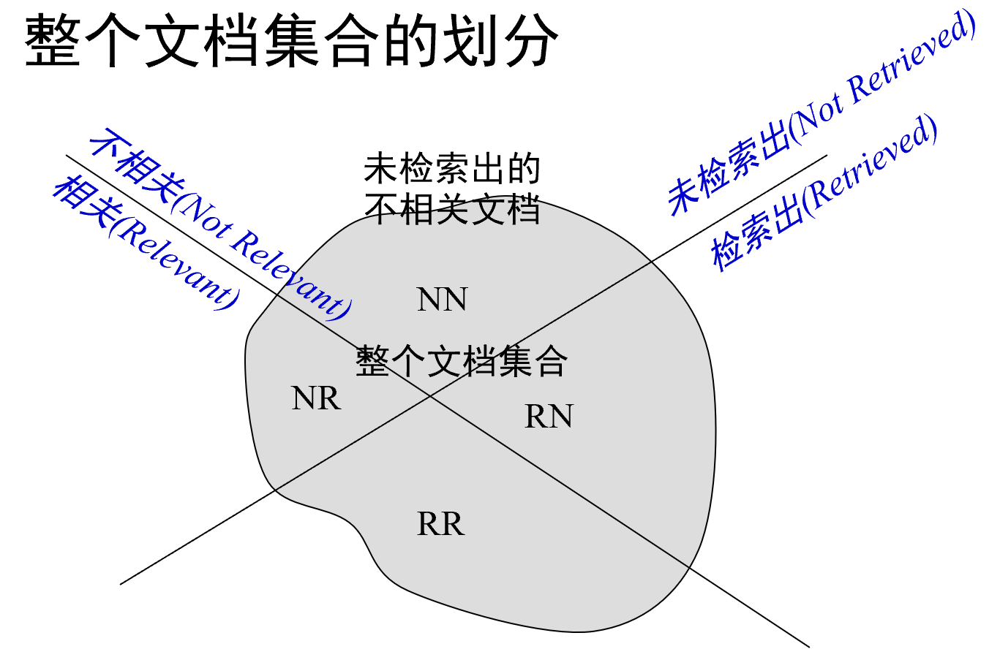
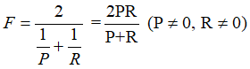
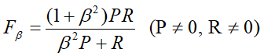
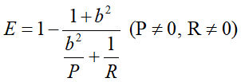

## 第8讲 搜索评价&结果摘要

### 8.2 有关检索评价

信息检索系统的目标是**较少消耗**情况下**尽快**、**全面**返回**准确**的结果。

#### 评价的纬度

1. 效率 (Efficiency)—可以采用通常的评价方法

   - 时间开销

   - 空间开销

   - 响应速度

2. 效果 (Effectiveness)

   - 返回的文档中有多少相关文档

   - 所有相关文档中返回了多少

   - 返回得靠不靠前

3. 其他指标

   - 覆盖率(Coverage)

   - 访问量

   - 数据更新速度

#### 评价的几部分

评价指标：某个或某几个可衡量、可比较的值

评价过程：设计上保证公平、合理

### 8.3 评价指标

#### 评价指标分类

- 对单个查询进行评估的指标
  - 在单个查询上检索系统的得分
- 对多个查询进行评估的指标
  - 在多个查询上检索系统的得分

**评价指标**

- **召回率**(Recall): RR/(RR + NR) ↖，返回的**相关**结果数占实际相关结果总数的比率，也称为**查全率**，R∈ [0,1]
  - 坟墓为所有相关的结果数

- **正确率**(Precision): RR/(RR + RN)↗，返回的结果中真正相关结果的比率，也称为**查准率**， P∈ [0,1]
  - 分母为查出来的结果数

两个指标分别度量检索效果的某个方面，忽略任何一个方面都有失偏颇。

两个极端情况：返回有把握的1篇，P=100%，但R极低；全部文档都返回，R＝1，但P极低

**召回率和正确率存在的问题**

1. 召回率难以计算
   - 解决方法：Pooling方法，或者不考虑召回率

1. 两个指标分别衡量了系统的某个方面，但是也为比较带来了难度，究竟哪个系统好？大学最终排名也只有一个指标。
   - 解决方法：单一指标，将两个指标融成一个指标
2. 两个指标都是基于(无序)集合进行计算，并没有考虑序的作用
   - 举例：两个系统，对某个查询，返回的相关文档数目一样都是10，但是第一个系统是前10条结果，后一个系统是最后10条结果。显然，第一个系统优。但是根据上面基于集合的计算，显然两者指标一样。
   - 解决方法：引入序的作用

**P和R融合**

F值(F-measure)：召回率R和正确率P的调和平均值，if P=0 or R=0, then F=0, else 采用下式计算：

F~β~：表示召回率的重要程度是正确率的*β*(>=0)倍， *β>*1更重视召回率， *β<*1更重视正确率

E(Effectiveness)值：召回率R和正确率P的加权平均值，b>1表示更重视P，E=1- F~β~, *, b^2^=1/β^2^

