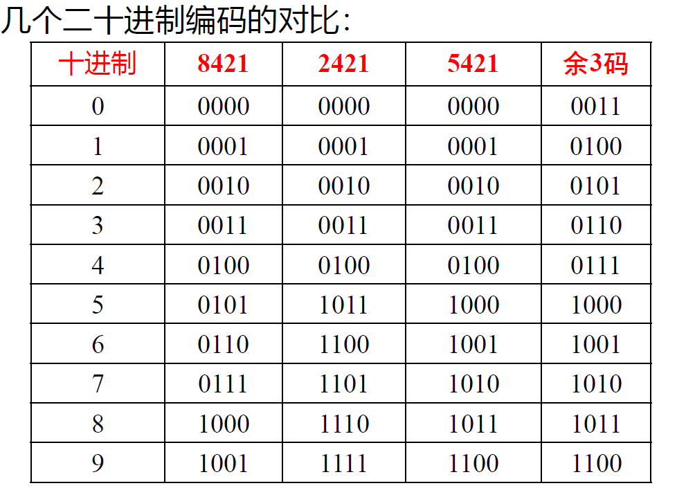
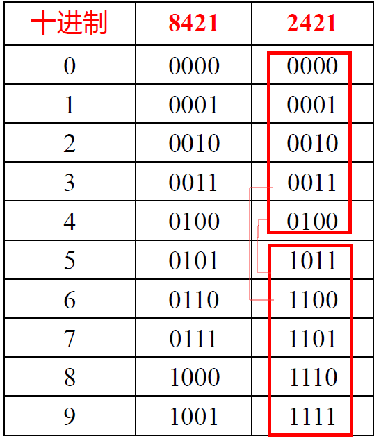
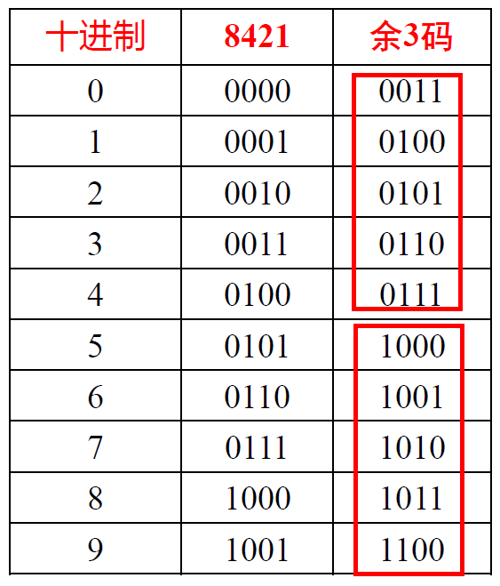

# 目录

* #### Part 1 组合逻辑

1. 开关理论基础
2. 逻辑门电路
3. 组合逻辑电路

* #### Part2 时序逻辑

4. 触发器
5. 时序逻辑电路

# 第一章 基本知识
## 1. 数制及其转换
1. 十进制转二进制
	* 整数: 余数短除法
	* 小数:  乘法取整运算（保留到小数点后五位， 使用0舍1入法）
2. 二进制转八进制 / 十六进制
	* 八进制每三位分割， 十六进制没四位分割， 整数部分向前补0， 小数部分向后补0， 转化为对应数制
	* 十六进制用（）~H~ / （）~h~表示
## 2. 原反补码
1. 原码: 符号位+数字 (0正， 1负)
2. 反码: 正数不变；负数在原码基础上， 将数字部分按位取反
3. 补码: 正数不变；负数在反码基础上+1
	* 快速获得补码: **|X|从右边数第一个1及其右边保持不变,左边按位取反。(符号位也取反)**
	* 获得负数的补码: **从右边数第一个1及其右边保持不变,左边按位取反**

## 3. 几种常用的编码
### 3.1 BCD码
1. BCD（Binary Coded Decimal）码: 用四位二进制数表示一位十进制数码（0~9）
	
	* 分为有权码（8421码 2421码）和 无权码 （余3码）
	* 
	
2. 8421码:  四位二进制码的权分别为 2^3^, 2^2^, 2^1^, 2^0^ 
	
	* 8421的加法修正规则较为复杂
	* 6组冗余码为 (1010~1111]
	
3. 2421码:  四位二进制码的权分别为2, 4, 2, 1

   * 
     * 对9自补
     * 冗余码位于中间 [0101, 1010]

4. 余3码: 在==8421码基础==上加上0011(即3) 形成的无权码

  * 
    * 同样对9自补
    * 冗余码位于两端, [0000~0011), (1101~1111]
  * 将一个数转化为余三码
    1. 转化为十进制数
    2. 转化为8421BCD码
    3. 转化为余三码

  * 余3码的==加法==: 如果有进位， 则结果+3， 如果没有进位， 结果-3

    * 解释: 

      * 余三码要保证结果正确, 其每一位都应该是8421码+3
      * -3: 两个加数在转化为余三码的过程中, 每一位上都加过0011, ==总和+6==, 结果需要-3, 才能变为+3的余三码

      * +3: 进位之后, 由16进制转为了10进制, 相当于==-6==, 结果总和为(+6-6=0)需要+3成为余三码

### 3.2 可靠性编码

1. 纠错的三个层次
	* 编码本身不易出错:  格雷码
	* 出错能够检查出来:  奇偶检验码
	* 检查并能够自我纠错: 海明码
	
2. 格雷码（Gray Code）
	
	1. 格雷码: 任意相邻的代码只有一位二进制数不同
		* 目的: 在数字变化时， 减少位数的变化次数， 以减少错误的发生
		
	2. 编码规则: 由==自然二进制码==(注意: 并非BCD码)转换得来
	
	   * 设二进制数为B=B~n-1~B~n-2~...B~i+1~B~i~...B~1~B~0~, 对应的格雷码为G=G~n-1~G~n-2~...G~i+1~G~i~...G~1~G~0~
	
	     则有: ①G~n-1~=B~n-1~(首位相同) ②G~i~ = B~i+1~ $\oplus$ B~i~ (异或)
	
	   * 生成格雷码步骤
	   	1. 格雷码复制最高位
	   	2. 格雷码之后的每一位与原码的前一位进行异或运算
	
3. 奇偶检验码
	1. 组成: 信息位 + 校验位(1位) = 奇/偶校验码
	
	2. 分类: 
	
	   * 奇校验: 使信息位+校验位中1的个数为奇数 (凑成奇数)
	     * 奇校验位(以8421码为例): 𝑃=𝐵8$\oplus$𝐵4$\oplus$𝐵2$\oplus$𝐵1$\oplus$1
	   * 偶校验: 使信息位+校验位中1的个数为偶数 (凑成偶数)
	     * 偶校验位(以8421码为例): 𝑃=𝐵8$\oplus$𝐵4$\oplus$𝐵2$\oplus$𝐵1
	
	3. 使用例: 
	
	   * | 被校验信息                                     | 奇校验码 | 偶校验码 |
	     | ---------------------------------------------- | -------- | -------- |
	     | 10 10 10 10 (4个1) | 1        | 0        |
	     | 11 00 11 01 (5个1) | 0        | 1        |
	     | 11 01 00 11 (5个1) | 0        | 1        |
	     | 10 01 10 01 (4个1) | 1        | 0        |
	     | 10 10 11 00 (4个1) | 1        | 0        |
	     | 11 10 11 00 (5个1) | 0        | 1        |
	
	4. 奇偶校验码的检错: 只能检出发生奇数个错误, 并不能纠错
	
	   * 例: 使用奇校验传送1001, 校验位P=1, 奇校验码为10011
	
	     ①正确传输: 𝑃′=𝐵8$\oplus$𝐵4$\oplus$𝐵2$\oplus$𝐵1$\oplus$𝑃=1$\oplus$0 $\oplus$0 $\oplus$1 $\oplus$1=1 **= P**
	     
	     ②错一位(10111), 检测出错误: 𝑃′=𝐵8$\oplus$𝐵4$\oplus$𝐵2$\oplus$𝐵1$\oplus$𝑃=1$\oplus$ 0 $\oplus$ 1 $\oplus$ 1 $\oplus$ 1=0 **!= P**
	     
	     ③错两位(11111), 此时依然奇数个1, 无法检测出错误

# 第二章 逻辑代数基础

