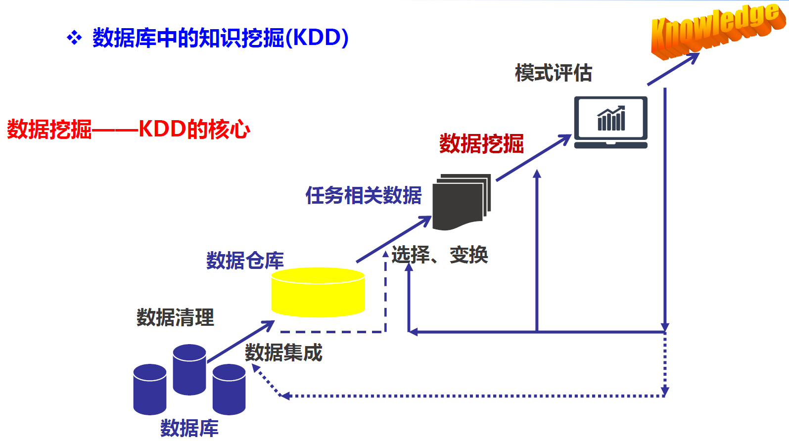
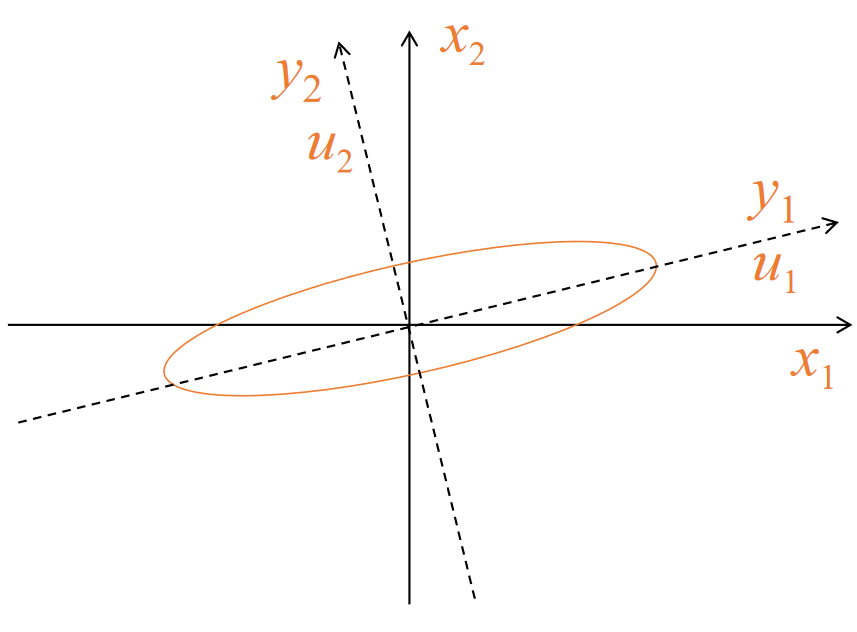

# 考试范围

## ver1

1. 简答: 3~4题 20分
   - 规范化
   - 文本分类
   - 熵
   - 算法区别
2. 计算: 80分 参考作业
   1. A, FP, 关联规则
   2. ID3, KNN, ID3、KNN、BAYES
   3. KMeans算法， 距离计算
   4. 回归（相关性）
   5. 文本分类--PageRank

## ver2

上课内容: 到DM7-聚类 && 回归

题型: 选择 简答 

1. dm1
   - 无具体计算, 可以看看数据挖掘流程, 开放计算题会用到
   - 数据挖掘&KDD: 数据挖掘是核心
   - 数据挖掘& 数据仓库: ←提供数据 & →技术
     - 数据仓库dm0不考
   - 什么类型的数据(dm2) && 什么类型的模式()
2. dm2 认识数据
   1. 属性类型: 二元/数值/标称 (结合第四小节的计算)
      - 计算都是数值型
   2. 基本统计描述
      - 不需要计算, 了解概念
      - 均值(小声说了句没有到)和方差
      - 什么是中位数, 众数, 应用到什么类型的数据(结合数据属性)
   3. 无可视化
   4. 相似性和相异性的**计算**
      - 二元的临近性, 计算跟例题差不多
      - 标准化(规范化)
      - 度量方式: 只有**欧几里得(欧式), 曼哈顿, 夹角余弦距离**
      - 最大最小计算, 了解一下小数
   5. 作业: 做!
3. dm3 数据预处理
   1. **清理**
      - 
   2. 集成
      - 相关性分析(结合回归分析), 看一下题目
        - 相关系数: 正相关, 独立, 负相关
   3. **规约**
      - 什么是主成分分析, kl变换, 流形学习 [了解一下]
      - 选择和提取
        - 如何选择: 启发式, 利用方差&标准差
   4. 离散化和概念分成(略)
   5. 变换

4. dm4 **关联规则**
   1. apriori算法 特点 不足 计算
   2. fp算法 特点 计算
   3. apriori和fp比较: 支持度低apriori挖掘出的频繁项集更多, 所以更慢
   4. 作业 例题6.3, 6.5
      1. fp注意多路径
5. dm5 分类
   1. **计算&特点**: 决策树, 贝叶斯
   2. 决策树
      1. 三种信息选择度量 特点, 联系和区别(ppt29页)
         1. **信息增益: 计算**信息熵, 信息增益
         2. 增益率: 
         3. 基尼指数
   3. 贝叶斯
      1. 考试形式类似作业
      2. 特点和不足, 如何克服
   4. 模型评估与选择
      1. 分类器的**评估度量 **重点
         1. 混淆矩阵
      2. ?
      3. ?
6. dm6
   1. sum, 贝叶斯, bp, knn: 了解特点和联系, 不用计算
7. dm7
   - 划分, 层次 **计算**
   - 密度 了解特点

# DM1 引论

## 1.1 为什么进行数据挖掘？

数据挖掘的意义: 从大量数据中发掘interesting的**知识和模式**

## 1.2 什么是数据挖掘？

从数据库中挖掘知识: 

- 数据清理(消除噪声和删除不一致的数据。占全过程60％的工作量)
- 数据集成（多种数据源可以组合在一起）
- 数据选择（从数据库中提取与分析任务相关的数据）
- 数据变换（数据变换或统一成适合挖掘的形式）
- **数据挖掘（核心步骤，使用智能方法提取数据模式）**
- 模式评估（根据某种兴趣度度量，识别提供知识的真正有趣的模式）
- 知识表示（使用可视化和知识表示技术，向用户提供挖掘的知识）

## 1.3 挖掘什么类型的数据？

1. 数据库系统
   - 数据库系统由一组内部相关的数据（数据库）和一组管理和存取数据的软件程序组成
2. 数据仓库
   - 数据仓库是一个从多个数据源收集的信息存储库，存放在一致的模式下，并且通常驻留在单个站点上。
3. 

## 1.4 挖掘什么类型的模式及如何挖掘？

## 1.5 数据挖掘流程及应用

## 1.6 相关研究领域

# DM2 认识数据

## 2.1 数据对象与属性类型

### 2.1.1 数据对象

==数据对象==（又称样本）：它代表一个实体，由一组属性（或特征/变量/维） 描述，描述一个样本的一组属性称为属性向量（或特征向量）

- 样本: $X = (x_1, x_2,...,x_n)$
- 属性: $x_i$, 可为各种类型, 可取各种值

### 2.1.2 属性类型

1. ==标称属性== 
   - 定性的，属性值是一些符号或事物的名称
     - 如 hair_color: 可能为黑色, 白色, 棕色…
   - 不定量, 不定序
2. ==二元属性== 
   - 二元属性是一种标称属性，只有两个类别或状态：0或1
   - 如果两种状态对应于 true和false的话，二元属性又称**布尔属性**。
3. **序数属性**
   - 定性的，序数属性值之间具有有意义的序或秩评定，但是相继值之间的差是未知的，其中心趋势可以用众数和中位数来表示
     - 只有排序, 具体两级差多少未知
4. ==数值属性==
   - 数值属性可以是区间标度 的或比率标度的，其中心趋势度量可以用均值、中位数或众数来表示。
   - 定量的，即它是可度量的量，用**整数或实数值**表示。
5. 离散的或连续的（机器学习领域分类算法的常用分类法） 
   - 离散属性具有有限或无限可能个值，可以用或不用整数表示。如：属性 hair_color、smoker都有有限个值，因此是离散的。 
   - 如果属性不是离散的，则它是连续的。

## 2.2 数据的基本统计描述

1. 动机：能够理好地理解数据，它们对于数据清理特别有用 

   - 获得数据的总体印象 

   - 识别数据的典型特征 

   - 凸显噪声或离群点 

2. 度量数据的中心趋势 

   - **均值、中位数、众数（模）等** 

3. 度量数据的离散程度 

   - 极差、四分位数、四分位数极差、方差、标准差等 

4. 基本统计描述的图形显示 

   - 盒图、分位数图、Q-Q图、直方图、散点图、局部回归曲线

### 2.2.1 数据的中心趋势

#### ==均值==

==均值== $\overline{x} = \frac1n\sum_{i=1}^nx_i\\$

==加权平均== $\overline{x} = \frac{\sum_{i=1}^nw_ix_i}{\sum_{i=1}^nw_i}\\$

截尾均值: 去掉高、低极端值得到的均值

- e.g. 计算平均工资时，可以截掉上下各2％的值后计算均值，以抵消少数极端值的影响 ~~(极端数值疑似是有点多了)~~
- **问题**：对极端值很敏感

#### ==中位数==

有序集的中间值或者中间两个值平均 

问题：适用于倾斜数据

#### 众数（Mode，也叫模）

集合中出现频率最高的值，对于适度倾斜（非对称的）的单峰频率曲线，可以 使用以下经验公式计算众数：
$$
mean-mode=3×(mean-median)
$$

**问题**：可能最高频率对应多个不同值，导致多个众数；极端情况下，如果每个 数据值仅出现一次，则它没有众数；

### 2.2.2 离散程度

1. **极差**: 数据集的最大值和最小值之差 
2. **四分位数** 
   - Q1 (25th percentile), Q3 (75th percentile)，中位数就是第2个四分位数(Q2) 
3. **四分位极差（IQR）** 
   - IQR = Q3 – Q1 
   - 通常我们认为，孤立点是指落在第三个四分位数之上或第一个四分位数之下至 少 1.5×IQR 处的值 
4. ==方差和标准差==
   - $\sigma^2=\frac1N\sum_{i=1}^n(x_i-\mu)^2=\frac1N\sum_{i=1}^nx_i^2-\mu^2\\$

## 2.3 数据可视化

略

## 2.4 度量数据的相似性和相异性

> 相似性和相异性都称==邻近性==

1. 相似性 
   - 量化两组数据的相似性
   - 物体相似性越大时，值越大
   - 取值范围是[0,1] 
2. 相异性
   - 量化两组数据的不同的程度
   - 物体相似性越大时，值越小
   - 最小的差异值取0
   - 上限值根据实际不同而不同

### 2.4.2 数据矩阵和相异性矩阵

1. 数据矩阵 

   -  对象-属性结构 
   - 二模矩阵，行与列代表不同实体 
   - 用n×p（n个对象×p个属性）矩阵存放n个对象 
   - $\begin{bmatrix}x_{11}&...&x_{1f}&...&x_{1p}\\...&...&...&...&...\\x_{i1}&...&x_{if}&...&x_{ip}\\...&...&...&...&...\\x_{n1}&...&x_{nf}&...&x_{np}\end{bmatrix}$

2. 相异性矩阵 

   - 对象-对象结构 
   - 单模矩阵，行和列代表相同的实体 
   - 存储n个对象两两之间的相异性

   - $\begin{bmatrix}0&&&&\\d(2,1)&0&&&\\d(3,1)&d(3,2)&\theta&&\\\vdots&\vdots&\vdots&&\\d(n,1)&d(n,2)&...&...&0\end{bmatrix}$

### 2.4.3 临近性度量计算

1. **标称属性**的邻近性度量
   - 对象 i, j 有p个属性，m指匹配的数目，即对象 i 和 j 取相同属性值的数目，
     则对象 i和 j之间的相异性为$d(i,j) = \frac{p-m}{p}$ 

#### **二元属性**的邻近性度量

- 二元属性只有两种状态：0或1，0表示该属性不出现，1表示该属性出现
- 二元属性的列联表 $\begin{array}{cc|ccc}&&\mathbf{Object~j}\\&&1&0&sum\\\hline&1&a&b&a+b\\\mathbf{Object~i}&0&c&d&c+d\\&sum&a+c&b+d&p\end{array}$ 
- **对称的二元属性**，每个状态都同样重要。对象i和j的相异性为： $d(i, j)=\frac{b+c}{a+b+c+d}\\$
- **非对称的二元属性**，两个状态不是同等重要的。对象i与j的相异性为：$d(i,j)=\frac{b+c}{a+b+c}\\$ 

#### 数值属性的邻近性度量

##### 规范化(标准化)

> 将度量值转换为**无单位**的数值

最小－最大规范化 : $$\nu^{\prime}=\frac{\nu-\min_A}{\max_A-\min_A}({new\_\max}_A-{new\_\min}_A)+{new\_\min}_A\\$$ 

z-score规范化

小数定标规范化

##### 距离计算

Euclidean距离 (==欧几里得距离==)

$$
d(i,j)=\sqrt{(\left|x_{i1}-x_{j1}\right|^2+\left|x_{i2}-x_{j2}\right|^2+...+\left|x_{ip}-x_{jp}\right|^2)}
$$
 Manhattan距离 (==曼哈顿距离==)

$$
d(i,j)=|x_{i1}-x_{j1}|+|x_{i2}-x_{j2}|+...+|x_{ip}-x_{jp}|
$$
 Minkowski距离 (闵科夫斯基距离)

$$
d(i,j)=\sqrt[q]{(|x_{i1}-x_{j1}|^q+|x_{i2}-x_{j2}|^q+...+|x_{ip}-x_{jp}|^q)}
$$

#### 序数属性的邻近性度量

假设f是描述n个对象的一组序数属性之一，f的相异性计算步骤如下： 

- 设第i个对象的f值为$x_{if}$，则用它在值中的序$r_{if} = \{1,...,M_f\}$代替 
- 由于每个序数属性都可以有不同的状态数，将每个f值的序映射到[0,1]，以 便使每个属性都有相同的权重 
- 相异性采用数值属性的相异性计算方法，使用$z_{if}$作为第i个对象的f值

####  混合属性的相异性

在真实数据集中，对象不是被一种类型的属性描述，而是被多种类型的属性描 述。计算混合型属性描述的对象之间的相异性 

- 法一：将属性按类型分组，对每种类型的变量进行单独的分析，如果这些分析得到兼容的结果，则这种方法是可行的，然而通常不兼容。 

- 法二：所有属性一起处理，进行一次分析，可以将不同类型的属性组合在单 个相异性矩阵中，把所有有意义的属性转换到共同的值域区间[0,1]之内，则

  $d(i,j)=\frac{\sum_1^p\delta_{ij}d_{ij}\left(f\right)}p\\$
  其中，$d_{ij}(f)$ 为单个类型属性定义的距离，$p$为属性的个数。

#### 余弦相似性

余弦相似性是一种度量，它可以用来比较文档，或针对给定的查询词向量对文 档排序。令x和y是两个待比较的向量，使用余弦度量作为相似函数，有
$$
sim(x, y) = \frac{x\cdot y}{||x||\cdot||y||}\\
$$

# DM3 数据预处理

## 3.1 数据预处理

 

- 数据清理: 填写缺失的值；光滑噪声数据，识别或删除孤立点；解决不一致性；解决由于数据集成造成 的数据冗余问题； 
- 数据集成: 将多个数据源中的数据整合到一个一致的存储中，减少不一致和冗余； 
- 数据归约: 得到数据集的简化表示，它小得多，但可以得到相同或相近的结果，包括维归约和数值归约； 
- 数据离散化和概念分层: 是数据归约的一部分，通过数据的离散化和概念分层来归约数据，对数字型数据特别重要； 
- 数据变换: 规范化、数据离散化和概念分层都是某种形式的数据变换；

## 3.2 数据清理

## 3.3 数据集成

1. 实体识别问题: 两个数据中, 什么情况下合并
2. 冗余和相关分析
   - 一个属性如果能由另一个或另一组属性“导出”，则这个属性可能是冗余的
   - 属性或维命名的不一致也可能导致结果数据集中的冗余 
     例如：年收入属性与工资属性，出生年月属性与年龄属性
   - 有些冗余可以被相关分析检查到 
     - 标称数据，使用卡方检验 
     - 数值属性，使用相关系数和协方差
3. 元组重复
   - 
4. 数据值冲突的检测与处理

### 3.3.2 相关性检验

#### $\chi^2$相关

$\chi^2=\sum_{i=1}^c\sum_{j=1}^r\frac{\left(o_{ij}-e_{ij}\right)^2}{e_{ij}}\\$

- 其中，$o_{ij}$是联合事件的观测频度（即实际计数），而$e_{ij}$是期望频度，可用下式计算
  - $e_{ij}=\frac{count(A=a_i)\times count(B=b_j)}n\\$

### 3.3.3 相关分析

##### 相关系数$r_{A, B}$

$$
r_{A,B}=\frac{\sum_{i-1}^n(a_i-\overline{A})(b_i-\overline{B})}{n\sigma_A\sigma_B}=\frac{\sum_{i=1}^n(a_ib_i)-n\overline{A}\overline{B}}{n\sigma_A\sigma_B}
$$

其中, n是样本个数, $\overline A$和$\overline B$分别是属性 A 和 B 的平均值, σA , σB分别是属性A和B的标准差。 

- 如果$r_{A,B}> 0$，则A和B是**正相关**的，意味着A的值随B的值增加而增加。该值越大，相关 性越强。 
- 如果$ r_{A,B} = 0$，则A和B是**独立**的，不存在相关。 
- 如果$r_{A,B} < 0$，则A和B是**负相关**的，一个值随另一个值的减少而增加。意味着每一个属性 都阻止另一个出现。 
- 注意：相关性并不蕴涵因果关系

#### 协方差$Cov$

$Cov(A,B)=E((A-\overline{A})(B-\overline{B}))=\frac{\sum_{i=1}^n(a_i-\overline{A})(b_i-\overline{B})}n=E(AB)-\overline{A}\ \overline{B}\\$

$E(AB): A和B对应项相乘, 然后求均值$

## 3.4 数据归约

**数据归约策略** 

- [维规约](#3.4.1 维归约)：减少所考虑的随机变量或属性的个数 
  - 方法：属性子集选择、主成分分析等 / 特征选择、特征提取 
- [数值规约](#3.4.2 数值规约)：用替代的、较小的数据表示形式替换原数据 
  - 方法：参数或非参数 
- 数据压缩：使用编码机制压缩数据集，维归约和数量归约可以视为某种形式的数据压缩 
  - 方法：无损的和有损的 

花费在数据归约上的计算时间不应超过或“抵消”在归约后的数据挖掘上挖掘所节省的时间。

### 3.4.1 维归约

- 特征提取(线性/非线性)：用映射（或变换）的方法把原始特征变换为较少的新特征
  $y=W^Tx$  映射空间
- 分为
  - 离散K-L变换 (Karhunen-Loeve) 
  - 主成分分析PCA (Principle Component Analysis)

#### 离散KL变换

目标： 

- 进行特征提取，新对象不能完全地表示原有的对象，能量总会有损失，我们希望找到一种能量最为集中、能量损失最小的变换方法。 
- 是一种**正交变换**，对原向量x用标准正交向量系$u_j$进行线性变换，得到新向量y用来表示x，经过K-L变换组合，y是变换后的系数向量，它的各分量之间具有**最小的相关性**，因此关键就是要找到这样的变换矩阵。

- $\mathcal{X}\to\mathcal{Y}\quad\left(\boldsymbol{u}_i^T\boldsymbol{u}_j=\boldsymbol{\delta}_{ij}=\left\{\begin{matrix}1,i=j\\0,i\neq j\end{matrix}\right.\right)$ 

##### KL变换-性质

1. 变换产生的新分量正交或不相关
   - 新分量 y1 和 y2正交（或不相关），两个新分量的坐标轴方向分别由 u1 和 u2 确定
   -  
2. 使新向量更趋确定、能量更趋集中
3. 以部分新分量表示原向量能量损失最小

#### 主成分分析(PCA)

目标： 

- 寻找一个线性投影方向，把多个相关变量变换为**少数几个无关变量**（即主成分），这些主成分最能够代表原始数据结构，包含原始变量大部分的信息，通常由原始变量的线性组合来表示。 
- PCA是基于K-L变换的一种最优正交线性变换。PCA的变换矩阵是协方差矩阵，K-L变换 的变换矩阵可以有很多种（自相关矩阵、协方差矩阵、样本总类内离散度矩阵等等）。
  - 当 K-L变换矩阵为协方差矩阵时，等同于PCA。

准则函数： $\begin{aligned}&\max_w\quad w^TCo\nu(X)w\\&s.t.\quad\begin{vmatrix}w\end{vmatrix}=1\end{aligned}$

求解：对协方差矩阵 进行特征值分解，选取最大的d个特征值对应的特征向 量组成 ，这就是PCA寻找的线性投影方向。

##### 主成分分析-性质

1. 性质1：从几何意义来看，变换后的主分量空间坐标系与变换前的空间坐标系相比旋转了一个角度。而且新坐标系的坐标轴一定指向数据信息量较大的方向。以二维空间为例，假定某样本的分布呈椭圆状，那么经过旋转后，新坐标系的坐标轴一定分别指向椭圆的长半轴和短半轴方向——主分量方向，因为长半轴这一方向的信息量最大。 
2. 性质2：PCA对于椭球状分布的样本集有很好的效果, 学习所得的主方向就是椭球的主轴方向。

 

##### 主成分分析–不足

不足：PCA 是一种非监督的算法，能找到很好地代表所有样本的方向，但这个方向 对于分类未必是最有利的。

####  线性判别分析(LDA)

目标： 

- 寻找一个线性投影方向，使类内散度尽可能小，类间散度尽可能大，即寻找最能把两类样 本分开的投影直线。 
- 这实际上是两类数据的特征提取，提取的特征数是１。这一思想可以推广到任意类数据， 提取任意多个特征。

##### 线性判别分析–性质

性质1：满足类间距尽可能大，类内距尽可能小的原则

##### 线性判别分析–不足

不足：LDA 是一种监督的算法，能找到很好的方向对样本进行分类，但这个方向对于表示所有样本未必是最有利的。

### 3.4.2 数值规约

#### 回归和对数线性模型(参数)

1. 一元线性回归模型 
   - 用一个自变量的线性函数对因变量Y建模，如： $Y=WX+B$
   - 两个参数 
   - 通常适用最小二乘法来确定这条直线 
2. 多元线性回归模型 
   - 用两个或多个自变量的线性函数对因变量Y建模，如： $Y = B_0 + B_1X_1+B_2X_2+...+B_nX_n$
   - 两个或多个参数 
3. 对数线性模型：近似离散的多维概率分布

#### 直方图(无参数)

直方图：使用分箱来近似数据分布

#### 聚类(无参数)

==聚类==：它将对象划分为群或簇，使得在一个簇中的对象相互“相似”，而与其他簇中的对象“相异”

- 相似性基于**距离函数**，用对象在空间中的“接近”程度定义。 
- 簇的“质量”可以用**直径**度量，直径是簇中两个对象的最大距离。 
- 簇的“质量”也可以用**形心**距离度量，它定义为簇中每个对象到簇形心（表示“平均对象”，或簇空间中的平均点）的平均距离。

#### 抽样(无参数)

抽样：允许用数据的较小随机样本（子集）表示大型数据集。假设大型数据集D包含 N个元组，常用的对D的抽样方法有： 

- s个样本的**无放回简单随机抽样**（SRSWOR）：由D的N个元组中抽取s个样本（s<N） 
- s个样本的**有放回简单随机抽样**（SRSWR）：过程同上，只是元组被抽取后，将被回放， 可能再次被抽取
- **聚类抽样**：D中元组被分入M个互不相交的聚类中，可在其中的s个聚类上进行简单随机抽样（SRS，m<M） 
- **分层抽样**：D被划分为互不相交的“层”，则可通过对每一层的简单随机抽样（SRS）得到D的分层选样

#### 数据立方体聚集

> ???

### 3.4.3 数据压缩

1. 有损压缩 VS. 无损压缩 
   - 如果原数据能够从压缩后的数据重构而不损失信息，则该数据归约称为无损的。 
   - 如果我们只能近似重构原数据，则该数据归约称为有损的。 
2. 字符串压缩 
   - 通常是无损压缩，有广泛的理论基础和精妙的算法 
   - 在解压缩前对字符串的操作非常有限 
3. 音频/视频压缩 
   - 通常是有损压缩，压缩精度可以递进选择 
   - 有时可以在不解压整体数据的情况下，重构某个片断

## 3.5 数据离散化和概念分层

> 略?

### 3.5.1 数值数据的离散化

**数值数据的离散化**：将连续属性的值域划分区间,便于数据挖掘,影响顶层决策 

- 年龄是个连续属性,可以取0~100及以上的整数,单独研究特定年龄的样本数据并没有太大意义 
- 但年龄可以用区间标签(0~18,19~30,30~50,>50)或者概念标签(童年,青年,中年,老年) **替换元素值**,这样的研究成果才有指导价值 

**数值数据的离散化方法**： 

- 分箱（binning）：自顶向下分裂，非监督的 
- 直方图分析（histogram）：自顶向下分裂，非监督的 
- 聚类分析：自顶向下分裂或将由底向上合并，数据划分成簇，每个簇形成同一个概念层上 的一个节点
- 基于熵的离散化（决策树分析）：自顶向下分裂，监督的 
- 基于$\chi^2$分析的离散化（相关分析）：由底向上合并，监督的

### 3.5.2 标称数据的概念分层

**标称数据的概念分层产生**：将标称数据变换到多个粒度层，标称数据是无序的离散 数据，它有有限个不同值（但可能很多个） 

**标称数据的概念分层产生方法** 

- 由用户或专家在模式级显式的说明属性的部分序 
  - 区<市<省<国家 
- 通过显示数据分组说明**分层结构**的一部分 
  - {福建，广东，浙江}<中国东南部 
- 说明属性集，但不说明它们的偏序，然后系统根据算法自动产生属性的序，构造有意义的 概念分层（示例：根据个数） 
- 对只说明**部分属性集**的情况，则可根据数据库模式中的数据语义定义对属性的捆绑信息， 来恢复相关的属性

**启发规则**：较高概念分层的属性，通常包含较少的不同值

## 3.6 数据变换

光滑：去除数据中的噪声（分箱、聚类、回归） 

属性构造（特征构造）：由给定属性构造新的属性，并添加到属性集中，以增加对 高维数据的结构的理解和精确度 

聚集：对数据进行汇总或聚集（例如，可以聚集日销售数据，计算月和年销售量） 

**规范化**：把属性数据按比例绽放，使之落入一个特定的小区间 

离散化：数据数值属性（例如，年龄）的原始值用区间标签（例如，0～10,11～20 等）或概念标签（例如，youth、adult、senior）替换。 

标称数据的概念分层产生：属性，如street，可以泛化到较高的概念层，如city或 country。

### 3.6.1 规范化

==规范化==：将数据按比例缩放，使之落入一个特定的小区间

- 最小–最大规范化 $\nu^{\prime}=\frac{\nu-\min_A}{\max_A-\min_A}({new\_\max}_A-{new\_\min}_A)+{new\_\min}_A\\$
- z–score规范化 $\nu^{\prime}=\frac{\nu-mean_A}{standard\_de\nu_A}$
- 小数定标规范化 $\nu^{\prime}=\frac\nu{10^j}\\$ 其中，j是使 Max(| $\nu^{\prime}|)<1$的最小整数 L

# DM4 关联规则

## 4.1 ==关联规则基本概念==

1. ==关联规则==(Association Rule)可以表示为一个蕴含式： $R：X\Rightarrow Y$ 
   - 例如：$R：尿布\Rightarrow啤酒$

2. **项集和频繁项集**
   - 项目的集合称为==项集==，项目个数为K的项集称为==K项集==
     例如，{牛奶，面包，黄油}是个3项集
   - 支持度大于或等于**最小支持度**的项集称为==频繁项集==，反之则称为非频繁项集。
   - 如果k项集满足**最小支持度**，称为==频繁k项集==，记作$L_k$。

3. ==支持度==

   - 关联规则R的支持度(support)是交易集中同时包含X和Y的交易数与**所有交易数**之比
   - $support(X\Rightarrow Y) = \frac{count(X\cup Y)}{D} = P(X\cup Y)$
   - P: 概率

4. ==置信度==

   - 关联规则R的置信度(confidence)是指同时包含X和Y的交易数与**包含X的交易数**之比
   - $confidence(X\Rightarrow Y) = \frac{count(X\cup Y)}{count(x)} = \frac{P(X\cup Y)}{P(X)} = P(Y|X)$

5. 关联规则的==最小支持度==和==最小置信度==

   - 关联规则的最小支持度也就是衡量频繁集的最小支持度(Minimum Support)，记为 supmin，它用于衡量规则需要满足的最低重要性。 

   - 关联规则的最小置信度(Minimum Confidence)记为confmin，它用于衡量规则需要满足的最低可靠性。 

6. ==强关联规则==
   - 如果规则$R:X\Rightarrow Y$满足$\begin{cases}support(X\Rightarrow Y)\geq supmin\  \\ confidence(X\Rightarrow Y)\geq confmin\end{cases}$，称关联规则$X\Rightarrow Y$为强关联规则，否则称关联规则$X\Rightarrow Y$为弱关联规则。 
   - 在挖掘关联规则时，产生的关联规则要经过supmin和confmin衡量，筛选出的强关联规则才能用于指导商家的决策。

## ==4.2 Apriori算法==

### 4.3.1 算法描述

Apriori算法由连接和剪枝两个步骤组成

1. 连接：为了找$L_k$ ，通过$L_{k-1}$与自己连接产生候选k项集的集合，该候选k项集记为$C_k$ 。 
   - $L_{k-1}$中的两个元素$l_1$和$l_2$可以执行连接操作$l_1 l_2$的条件是
     $(l_1[1]=l_2[1])\and (l_1[2]=l_2[2])\and ...\and (l_1[k-2]=l_2[k-2]) \and \textcolor{red}{(l_1[k-1]<l_2[k-1])}$
   - $C_k=L_{k-1}\rhd\lhd L_{k-1}$ 
2. 剪枝：对候选k项集$C_k$，删除其非频繁的选项，得到$L_k$ 
   1. $C_k$是$L_k$的超集（$L_k$ $C_k$ ），即它的成员可能不是频繁的，但是所有频繁的都在$C_k$中。 因此可以通过扫描数据库，侯选项集的计数值不小于最小支持度计数就是频繁的，属 于$L_k$ ； 
   2. 为了减少计算量，可以使用Apriori性质，即如果k项集的一个(k-1)子集不在$L_k$-1中， 则该候选不可能是频繁的，可以直接从$C_k$删除。

### 4.3.2 Apriori算法调优

> [了解]

Apriori算法的主要挑战 

- 可能需要重复扫描数据库： 如果频繁集最多包含10个项，那么就需要扫描交易数据表10遍，这需要很大的I/O负载； 
- 可能产生大量的候选项集： 若有100个项目，可能产生候选项集数： 
- 对候选项集的支持度计算非常繁琐； 

**解决思路** 

- 减少对数据的扫描次数； 
- 缩小产生的候选项集； 
- 改进对候选项集的支持度计算方法

#### ① 散列

1995年Park等人提出一种散列技术来生成2项侯选集。Prak使用（10x+y）mod7函数。 

将每个项集通过相应的散列函数映射到散列表的不同的桶中，这样可以通过将桶中的**项集计数**跟**最小支持计数**相比较**先淘汰**一部分项集。 

例如：当扫描数据库中每个事务，由C1中的候选1项集产生频繁1项集L1时，对每个事务 产生所有的2项集，将它们散列到散列表结构的不同桶中，并增加对应的桶计数，在散列 表中对应的桶计数低于支持度阈值的2项集不可能是频繁2项集，可从候选2项集中删除， 这样就可大大压缩了要考虑的2项集。

#### ② 事务压缩

事务压缩（压缩进一步迭代的事务数） 

不包含任何k项集的事务不可能包含任何(k+1)项集，这种事务在下一步的计算中可以加上标记或删除。

#### ③ 划分

先把数据库从逻辑上分成几个互不相交的块，每次单独考虑一个分块并对它生成所有的频繁项集，然后把产生的频繁项集合并，用来生成所有可能的频繁项集，最后计算这些频繁项集的支持度。 

分块的大小选择要使得每个分块可以被放入主存。 

总共只需要两次数据库扫描。 

- 第一次扫描：将数据划分为多个部分并找到局部频繁项集；
- 第二次扫描：评估每个候选频繁项集的实际支持度，以确定全局频繁项集； 

算法的正确性是由每一个可能的频繁项集至少出现在某一个分块中保证的。

#### ④ 选样

选样（在给定数据的一个子集挖掘） 

选择原始数据的一个样本，在这个样本上用Apriori算法挖掘频繁模式。 

样本大小应该以可以放在内存中为宜。

总共只需要一到两次数据库扫描。

- 可以通过一次全局扫描来验证从样本中发现的模式；
- 可以通过第二次全局扫描来找到遗漏的模式； 

通过**牺牲精确度**来减少算法开销，为了提高效率，可以适当**降低最小支持度**来减少遗漏的频繁模式。

#### ⑤ 动态项集技术

在扫描的不同点添加候选项集，这样，如果一个候选项集已经满足最少支持度，则在可以 直接将它添加到频繁项集，而不必在这次扫描的以后对比中继续计算

## 4.3 ==FP-growth算法==

### 4.3.1 算法步骤

1. 频繁1项集的导出（第一次扫描数据库） 导出频繁1-项集的集合，并得到它们的支持度计数，然后将每个交易中的频繁项按支持度计数递减序排列，如下图：
   

2. 构建FP树(第二次扫描数据库)
   - 创建树的根节点，用null标记； 
   - 每个交易中的频繁项按支持度计数递减序排列后，对每个交易创建一个分枝； 
     - 例如：为第一个交易{f, c, a, m, p}构建一个分枝； 
   - 当考虑为一个交易增加分枝时，沿共同前缀上的每个节点的计数加1，为跟随前缀后的项创 建节点并连接； 
     - 例如：将第二个事务{f, c, a, b, m}加到树上时，将为f，c，a各增计数1，然后为{b, m}创建分枝
   - 创建一个项头表，每个项通过一个节点链指向它在树中的出现，以方便遍历。如左表：
     -  
3. FP树挖掘 
   - 由长度为1的频繁模式（初始后缀模式）开始，构造它的**条件模式基**（一个“子模式基/ 子数据库”，由FP树中与该后缀模式一起出现的前缀路径集组成）； 
   - 构造长度为1的频繁模式（初始后缀模式）的条件FP树； 
   - 递归地在条件FP树上挖掘频繁模式。直到结果FP-tree为空, 或只含单个路径 (此路径的每个子路径对应的相集都是频繁集)。模式增长通过初始后缀模式与条件FP树产生的频繁模式连 接实现。

# DM5 分类(基本概念)

## 5.1 基本概念

### 5.1.1 分类与预测

#### 分类

1. 分类 
   - 根据训练数据集和类标号构建模型 
   - 用于预测新数据的类标号（离散值） 
2. 分类示例 
   - 银行贷款员需要分析数据，来弄清哪些贷款申请者是安全的，哪些是有风险的。就需要构造一个分类器来预测类属编号，比如预测顾客属类。 
   - 垃圾邮件分类。 
3. 分类方法 
   - ==决策树==、==贝叶斯==方法、K-近邻方法、支持向量机、神经网络、关联规则方法等

#### 预测

1. 预测 
   - 构建连续函数值模型 
   - 用于预测未知值或缺省值（连续值） 
2. 预测示例
   - 银行贷款员需要预测贷给某个顾客多少钱是安全的。就需要构造一个预测器，预测一个连续值函数或有序值，比如贷款金额。 
   - 红酒品质鉴别。 
3. 预测方法 
   - 线性回归、 非线性回归、 多元回归

#### 区别

相同点 

- 两者都需要构建模型，再用模型来估计未知值 
  - 模型看作一个映射或函数 y=f(X)， X是输入，y是输出； 
  - 模型准确率，要使用单独的测试集进行测试；

不同点

- 分类法用来估计“类标号属性” （离散值）
- 预测法用来估计 “预测属性” （连续值）

## 5.2 决策树归纳

### 5.2.1 属性选择度量

#### 信息增益 ID3

1. 定义

   - 信息论中定义事件的平均信息量为单个事件的信息量的统计平均值，称为==期望信息（信息熵）==为$\color{blue}Info(D)=-\sum_{\\i=1}^nP_ilogP_i$ 对所有样本(D)进行分类
   - $Info_A(D)=\sum_{j=1\\}^{V} \frac{|D_j|}{|D|}Info(D_j)$ 对根据A进行分类后的样本(D~j~)进行分类

   - 可以理解为: $\frac{|D_j|}{|D|}为权重, Info(D_j)部分为对小样本D_j根据A进行分类\\$
   - ==信息增益==: $Gain(A)=Info(D)-Info_A(D)$ 

2. 使用ID3进行决策树归纳

   - 选择具有**最高信息增益**的属性进行分裂

   - 对于同一组样本, 其$Info(D)$相同, 所以可以只比较$Info_A(D)$

   - **做题时可以不算这个, 但是要写出Gain公式**

3. **特点:** 信息增益度量倾向于选择**具有大量值的属性**，不过，考虑充当唯一标识符的属性， 这种划分信息增益最大，但是对分类没用。

##### 例题

| Age         | Income | Student | Credit Rating | Buys Computer |
| ----------- | ------ | ------- | ------------- | ------------- |
| youth       | high   | no      | fair          | no            |
| youth       | high   | no      | excellent     | no            |
| middle_aged | high   | no      | fair          | yes           |
| senior      | medium | no      | fair          | yes           |
| senior      | low    | yes     | fair          | yes           |
| senior      | low    | yes     | excellent     | no            |
| middle_aged | low    | yes     | excellent     | yes           |
| youth       | medium | no      | fair          | no            |
| youth       | low    | yes     | fair          | yes           |
| senior      | medium | yes     | fair          | yes           |
| youth       | medium | yes     | excellent     | yes           |
| middle_aged | medium | no      | excellent     | yes           |
| middle_aged | high   | yes     | fair          | yes           |
| senior      | medium | no      | excellent     | no            |

Class P: buys_computer = “yes” 

Class N: buys_computer = “no”

**第一层**

1. 计算信息熵: $Info(D)=I(9,5)=-\frac9{14}\log_2(\frac9{14})-\frac5{14}\log_2(\frac5{14})=0.940 $ 
2. 根据age分类: $Info_{age}(D)=\frac5{14}I(2,3)+\frac4{14}I(4,0)+\frac5{14}I(3,2)=0.694$ 
3. 信息增益为: $Gain(age) = Info(D)-Info_{age}(D)=0.246$
4. 同理可得 $G\alpha in(income)=0.029\\Gain(student)=0.151\\Gain(credit\_rating)=0.048$ 

所以, age信息增益最高, 选择为分裂属性

……

结果(肉眼可得, 懒得算了)

#### 增益率 C4.5

> 克服信息增益倾向于选择大量

==分裂信息==: $\color{blue}SplitInfo_A(D)=-\sum_{j=1\\}^V\frac{|D_j|}{|D|}log_2(\frac{|D_j|}{|D|})$

==增益率==: $GainRate(A)=\frac{Gain(A)}{SplitInfo_A(D)}\\$ 

选择具有**最大增益率**的属性作为分裂属性

注意：随着划分信息趋向于0，增益率变得不稳定，为了避免这种情况，增加一个约束： 选取的测试的**信息增益必须较大**，至少与考察的所有测试的平均增益一样大。

##### 例

属性income的测试将表中的数据划分为3个分区，即low、medium和high，分别包含4、 6和4个元组。

1. 计算分裂信息: $SplitInfo_A\left(D\right)=-\sum_{j=1}^\nu\frac{\left|D_j\right|}{\left|D\right|}\times\log_2\left(\frac{\left|D_j\right|}{\left|D\right|}\right)\\=-\frac4{14}\times\log_2\frac4{14}-\frac6{14}\times\log_2\frac6{14}-\frac4{14}\times\log_2\frac4{14}=1.557$ 
2. 计算信息增益(前面的例子算过了): $Gain(income)=0.029$
3. 计算增益率: $ GainRatio\left(income\right)=0.029/1.557=0.019 $ 

#### 基尼指数

> 对于二元的划分

$\color{blue}Gini(D)=(\sum_{i=1}^m P_i(1-P_i))=1-\sum_{\\i=1}^mP_i^2$

$Gini_A(D)=\frac{|D_1|}{|D|}Gini(D_1)+\frac{|D_2|}{|D|}Gini(D_2)$

不纯度降低=$\Delta Gini(A)=Gini(D)-Gini_A(D)$

选择具有**最大化不纯度降低**的属性作为分裂属性

##### 例

Class P: buys_computer = “yes”（包含9个样本） Class N: buys_computer = “no”（包含5个样本） 

1. 首先使用基尼指数式计算D的不纯度：$Gini\left(D\right)=1-\left(\frac9{14}\right)^2-\left(\frac5{14}\right)^2=0.459$ 
2. 计算每个属性的基尼指数: 
   - 从属性income开始，并考虑每个可能的分裂子集。考虑子集{ low, medium }，导致 10个满足条件的样本在分区D1中，其它个样本将指派到分区D2中。基于该划分计算出基尼指数值为：
     $$\begin{aligned}
     &Gini_{income\in\{low,medium\}}\left(D\right)=\frac{10}{14}Gini\left(D_1\right)+\frac4{14}Gini\left(D_2\right) \\
     &=\frac{10}{14}\Bigg(1-\Bigg(\frac{7}{10}\Bigg)^2-\Bigg(\frac{3}{10}\Bigg)^2\Bigg)+\frac{4}{14}\Bigg(1-\Bigg(\frac{2}{4}\Bigg)^2-\Bigg(\frac{2}{4}\Bigg)^2\Bigg)\\
     &=0.443=Gini_{income\in\{high\}}\big(D\big)
     \end{aligned}$$ 
   - 类似地，用其余子集划分的基尼指数值为： 
     - 0.458（子集{low, high}和 {medium} ）
     - 0.450（子集{medium, high}和 {low} ）
   - 因此，属性income的最好二元划分在{low, medium}和 {high}上，因为它最小化基尼指数，它的基尼指数为：0.443 
   - 评估属性age，得到 {youth, senior}和 {middle_aged}为最好划分，基尼指数为： 0.357
   - 属性student和credit_rating都是二元的，分别具有基尼指数0.367和0.429。 
   - 因此，属性 age和分裂子集 {youth, senior}产生最小的基尼指数，不纯度降低0.4590.357=0.102。二元划分“age {youth, senior}”导致D中样本的不纯度降低最大，并 返回作为分裂准则。结点N用该准则标记，从它生长出两个分析，并相应地划分样本。

#### 度量方式比较

| 度量方式 | 特点                                                         |
| -------- | ------------------------------------------------------------ |
| 信息增益 | 偏向于多值(大量值)属性                                       |
| 增益率   | 倾向于不平衡的划分，其中一个分区比其他分区小得多             |
| 基尼指数 | 偏向于多值属性 当类的数量很大时会有困难 倾向于导致相等大小的分区和纯度 |

### 5.2.2 过度拟合和树剪枝

产生的决策树会出现过分适应数据的问题

- 因为数据中存在噪声和离群点, 部分分支是因为数据异常
- 对未知样本判断不准确

**防止过分拟合的两种方法---剪枝**

- 先剪枝: 在树构造过程中, 设定阈值, 提前停止子集划分
- 后剪枝: 对完全生长的树进行剪枝, 删除结点的分支用最频繁的类标记去替换

## 5.3 贝叶斯分类

### 5.3.1 理论基础

设X是样本，用属性值描述，类标号未知； 

设H为某种假设 ，如样本X属于某个特定类C； 

P(H|X)是**后验概率**，或在条件X下，H的后验概率 

- 例如，已经顾客的年龄为35岁且收入为四万美元，该顾客将购买计算机的概率。

P(H)(prior probability)是**先验概率**，或H的先验概率

- 例如，顾客将购买计算机的概率, 无论年龄和收入。 

P(X)是X的**先验概率**，可观察到样本数据

- 例如，顾客集合中年龄为35岁且收入为四万美元的概率。 

P(X|H)是**后验概率**，或在条件H下，X的后验概率

- 例如，已知顾客将购买计算机，该顾客年龄为35岁且收入为四万美元的概率。 

==贝叶斯定理==： $P(H|X)=\frac{P(X|H)P(H)}{P(X)}$

### 5.3.2 朴素贝叶斯分类

**朴素贝叶斯分类器**：预测X属于条件X下具有最高后验概率的类，规则(略）

- 根据根据贝叶斯定理，最大化右式即可： $P(C_i|X)=\frac{P(X|C_i)P(C_i)}{P(X)}\\$
- 由于 P(X) 对所有类为常数 ，只需最大化：$P(X|C_i)P(C_i)$ 
- 如果类的先验概率$P(X)$未知，通常假定这些类是等概率的($各个P(C_i)相等$)，只需最大化： $P(X|C_i)$
- 为了降低计算开销，可以做类条件独立的朴素假设（即属性之间不存在依赖关系）。 
  - 注意：连续属性问题。
  - $P(X|C_i)=\prod_{k=1}^nP(x_k|C_i)=P(x_1|C_i)P(x_2|C_i)\cdots P(x_n|C_i)$

#### 例

| age     | income | student | credit_rating | buys_computer |
| ------- | ------ | ------- | ------------- | ------------- |
| <=30    | high   | no      | fair          | no            |
| <=30    | high   | no      | excellent     | no            |
| 31...40 | high   | no      | fair          | yes           |
| >40     | medium | no      | fair          | yes           |
| >40     | low    | yes     | fair          | yes           |
| >40     | low    | yes     | excellent     | no            |
| 31...40 | low    | yes     | excellent     | yes           |
| <=30    | medium | no      | fair          | no            |
| <=30    | low    | yes     | fair          | yes           |
| >40     | medium | yes     | fair          | yes           |
| <=30    | medium | yes     | excellent     | yes           |
| 31...40 | medium | no      | excellent     | yes           |
| 31...40 | high   | yes     | fair          | yes           |
| >40     | medium | no      | excellent     | no            |

两类：C1:buys_computer = ‘yes’，C2:buys_computer = ‘no’； 

预测以下样本的类标号: X = (`age <=30`,`Income = medium`,`Student = yes`,`Credit_rating = Fair`)

#### 不足

> 需要计算一些概率值，开销大
>
> 零概率值问题
>
> 属性独立性假设问题

##### 零概率值问题

朴素贝叶斯分类需要每一个条件概率都必须非零，否则预测的概率将为零

$P(X\mid C_i)=\prod_{\begin{array}{c}k=1\\\end{array}}^nP(x_k\mid C_i)$ 

**克服方式: 拉普拉斯校准**

##### 属性独立性假设问题

> 朴素贝叶斯假设属性都是独立的

使得朴素贝叶斯分类成为可能，但是实践中很少满足，因为属性 （变量）通常是相关的

如何克服: 

- **贝叶斯信念网络**, 联合属性的贝叶斯推理和因果关系 
- **决策树**, 在一个时刻只推理一个属性，首先考虑最重要的属性

## 5.4 基于规则的分类

> 暂skip

## 5.5 模型评估与选择

### 5.5.1 术语

**正样本（P）**：感兴趣的主要类的样本。 

**负样本（N）**：其他样本。 

真正例（True Positive，TP）：被分类器正确分类的正样本。 

真负例（True Negative，TN）：被分类器正确分类的负样本。 

假正例（False Positive，FP）：被错误地标记为正样本的负样本。 

假负例（False Negative，FN）：被错误地标记为负样本的正样本。

==混淆矩阵==: 

| $ &(分类器)预测的类\\实际的类&$ | TRUE      | FALSE     | 合计 |
| ------------------------------- | --------- | --------- | ---- |
| TRUE                            | TP 真正例 | FN 真负例 | $P$  |
| FALSE                           | FP 假正例 | TN 假负例 | $N$  |
| 合计                            | $P’$      | $N'$      |      |

### 5.5.2 准确性、错误率、灵敏性和特效性

**类分布相对平衡**

- ==准确率== =$(TP+TN)/(P+N) =灵敏性×P/(P+N)+特效性×N/(P+N) $

- ==错误率== =$(FP+FN)/(P+N) $

**类不平衡问题**：感兴趣的类（正类）是稀少的，即数据集的分布反映负类显著地占多数，而 正类占少数，例如“欺诈检测”“医学分析” 

- 灵敏性(召回率)： 正确识别的正样本的百分比，$灵敏性 = TP/P $
- 特效性：正确识别的负样本的百分比，$特效性 = TN/N$

### 5.5.3 精度、召回率、 F 度量

==精度==: $precision=TP/(TP+FP)＝TP/P'$ 

- 标记为正类的样本**实际**为正类所占的百分比

==召回率==: $recall=TP/(TP+FN) ＝ TP/P$ 

- 正类的样本标记为正类的百分比

==F 度量== (F1 或 F分数)：精度和召回率的调和均值，它赋予召回率和精度相等的权重$F=\frac{2* precision*recall} {precision+recall}\\$ 

$F_ß$：精度和召回率的加权度量，它赋予召回率权重是赋予精度的β倍

$F_{\beta}\quad=\quad\frac{(1+\beta^{2})\times precision\times recall}{\beta^{2}\times precision+recall}\\$ 

### 5.5.4 其他性能指标

准确率：模型正确分类或预测的能力

速度：产生和使用模型的计算花销

健壮性：给定噪声数据或有空缺值的数据，模型正确分类或预测的能力

可伸缩性：对大量数据，有效的构建分类器或预测器的能力

可解释性：学习模型提供的理解和洞察的层次

## 5.6 提高分类准确率的技术
