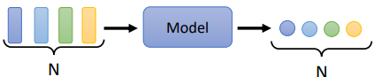

# 04-Self-attention

## 4.1. 输入是向量序列
### 4.1.1 文字处理（自然语言处理）

**将每一个词汇表示为向量**。
- 一个很长的向量(one-hot编码)，长度与世界上存在的词汇数量一样多，所有词汇彼此之间没有关系。
- 给每一个词汇一个向量，这个向量包含语义信息，而一个句子就是一组长度不一的向量。
-  

### 4.1.2 声音信号处理
会把一段声音信号取一个范围，这个范围叫做一个窗口（window），把该窗口里的信息描述成一个向量，这个向量称为一帧（frame）。一小段声音信号，它里面包含的信息量非常可观。

### 4.1.3 图
社交网络是一个图，在社交网络上，每一个节点就是一个人。每一个节点可以看作是一个向量。每个人的信息（性别、年龄及工作等）都可以用一个向量来表示。因此一个社交网络可以看做是一堆向量所组成。

把一个分子当作是模型的输入，每一个分子可以看作是一个图，分子上的每一个球就是一个原子，每个原子就是一个向量，而每个原子可以用one-hot向量来表示。

## 4.2. 输出的三种可能性
### 每一个向量都有一个对应的标签
输入与输出的长度是一样的。模型不需要去烦恼要输出多少个标签，输出多少个标签。

**例**：
- 词性标注（POS tagging）：机器会自动决定每一个词汇的词性，判断该词是名词、动词还是形容词等。
- 语音识别
- 社交网络：每个节点（人）进行标注【是否推送商品】

### 一组向量序列输出一个标签
整个序列只需要输出一个标签就好。

举例：
- 文本情感分析：给机器看一段话，模型要决定这段话是积极的（positive）还是消极的（negative）。
- 语音识别

### 模型自行决定输出多少个标签
输入是N个向量，输出可能是N'个标签，而N'是机器自己决定的。此种任务被称作**序列到序列（Sequence to Sequence，Seq2Seq）**。

举例：
- 翻译
- 语音识别

## 4.3. Self-attention 运作原理
### 4.3.1 以 Sequence Labeling 为例
> 考虑第一个输出可能性，每一个向量都有一个对应的标签，Sequence Labeling 要给序列里面的每一个向量一个标签。

#### 方法一

对每一个向量，用 Fully-connected network(或者说MLP多层感知机) 分别进行处理。

**问题**: 这种方法忽略了序列上下文的关系。同一个词汇在句子中不同的位置、不同的上下文环境下，词汇的词性有可能是不一样的，但此方法的输出会因是**同一个词汇而永远只有同一个输出**。

#### 方法二
改进方法一，串联若干个向量后丢进 Fully-connected network。给 Fully-connected network 一个整个 window 的信息，让它可以考虑一些上下文，即与该向量相邻的其他向量的信息。

**问题**: 序列的长度有长有短，输入给模型的序列的长度每次可能都不一样。开一个 window 比最长的序列还要长，才可能把整个序列盖住。但是开一个大的窗口，意味着 Fully-connected network 需要非常多的参数，可能运算量会很大，此外还容易过拟合。

⇒ 想要更好地考虑整个输入序列的信息，就要用到==**自注意力模型**==。

### 4.3.2 Self-attention model
考虑整个序列的所有向量，**综合向量序列整体和单个向量个体**，得到对每一个向量处理后的向量，将这些向量分别连接一个 FC，FC 可以专注于处理这一个位置的向量，得到对应结果。

自注意力模型不是只能用一次，可以叠加很多次，与 FC 可以交替使用。

#### 内部架构

**输入**：一串的 vector，这些 vector 可能是整个 network 的 input，也可能是某个 hidden layer 的 output。  
**输出**：处理 input 以后，**每一个 b 都是考虑了所有的 a 以后才生成出来的**。

#### 具体步骤
1. 根据 $a^1$ 向量找出跟其他向量的相关程度 $α$ (标量)
2. 藉由一个计算 attention 的模块来得到 $α$ 
   - **Dot-product**：把输入的两个向量分别乘上 $W^q$ 和 $W^k$，得到两个向量 $q$ 和 $k$ 后做点积，把它们做逐元素（element-wise）的相乘，再全部加起来得到一个 $α$**（常用，也被用在 Transformer 中）**。  
   - **Additive**：两个向量通过 $W^q$ 和 $W^k$ 得到 $q$ 和 $k$ 后，把 $q$ 和 $k$ 串联起来丢到激活函数（activation function），再乘上矩阵 $W$ 得到 $α$。
3. 计算完 $a^1$ 跟其他向量的相关性 $α$ 后（也必须计算 $a^1$ 跟自己的 $α$），把所有的 $α$ 经过 softmax（也可使用其他激活函数，如 ReLu）得到 $α'$。
4. 把向量 $a^1$ 到 $a^4$ 乘上 $W^v$ 得到新的向量 $v^1, v^2, v^3, v^4$，接下来把每一个向量都去乘上 $α'$ 后再求和得到 $b^1$。
	- 如果 $a^1$ 跟 $a^2$ 有高相关性，即 $α_{1,2}'$ 的值很大，再做加权和后，得到的 $b^1$ 就可能会比较接近 $v^2$。所以谁的注意力的分数最大，谁的 $v$ 就会主导（dominant）抽出来的结果。
	- **注意：$b^1$ 到 $b^4$ 是同时被计算出来的。** 没有数据依赖
$$
\begin{aligned}
b^1&=\alpha'_{1,1}v^1+\alpha'_{1,2}v^2+\alpha'_{1,3}v^3+\alpha'_{1,4}v^4\\
&=(q^1\cdot k^1)\times W^va^1+\dots+(q^4\cdot k^4)\times W^va^4 \\
&=(W^qa^1\cdot W^ka^1)\times W^va^1+\dots+(W^qa^4\cdot W^ka^4)\times W^va^4
\end{aligned}
$$

#### 矩阵的角度
1. 先计算 $Q = A \times W^q$，$K = A \times W^k$，$V = A \times W_v$，合并后以 $Q, K, V$ 表示
   
2. 根据 $Q , K^T$ 计算 $A$，经过一个激活函数（如 softmax 或 ReLu），得到 $A'$（称做 attention matrix）。  
   
3. 再乘以 $V$ 得到 $O$，以 $O$ 表示。  
   
4. 综合：     
   - $I$ 是 Self-attention 的一组 vector input。  
   - $I$ 分别乘上 $W^q, W^k, W^v$ 矩阵得到 $Q, K, V$。  
   - 接下来 $Q \times K^T$ 得到 $A$，再经过激活函数得到 $A'$ Attention Matrix（生成 $Q$ 就是为了得到 attention 的 score）。  
   - $A'$再乘上 $V$，就得到 $O$。$O$ 就是 Self-attention 这个 layer 的输出。
   - $W^q, W^k, W^v$ 是三个要学习的矩阵参数。

### 4.3.3 Multi-head Self-attention

Multi-head Self-attention 的使用非常广泛，有一些任务，如翻译、语音识别等，用该方法可以得到较好的结果。**需要多少的 head 是需要调的 hyperparameter**。  
**原因**：
在使用 Self-attention 计算相关性的时候，是用 $q$ 去找相关的 $k$。但是“相关”有很多种不同的形式，所以也许可以有多个 $q$，不同的 $q$ 负责不同种类的相关性，这就是 Multi-head Self-attention。

**步骤**：
1. 先把 $a$ 乘上一个矩阵得到 $q$。  
2. 再把 $q$ 乘上另外两个矩阵，分别得到 $q^1, q^2$ 和 $k^1, k^2$，代表有两个 head；同理可以得到 $v^1, v^2$。  
3. 从同一个 head 里的 $q,k,v$ 计算 $b$。  
4. 将各个 head 计算得到的 $b$ 拼接，通过一个 transform 得到 $O$，然后再送到下一层。

## 4.4. Positional Encoding
到目前为止，Self-attention 的操作里面没有位置的信息，但有时候**位置的信息很重要**。
- 举例，在做词性标注时，动词较不容易出现在句首，如果某一个词汇是放在句首，其为动词的可能性就比较低，所以位置的信息往往也是有用的。

**方法**：
每个位置用一个 vector 来表示它是 sequence 的第 $i$ 个，然后拼接到原向量中。

产生 positional encoding vector 的方法有很多种，如人工设置、根据数据训练出来等，目前还不知道哪一种方法最好，仍是一个尚待研究的问题。

## 4.5. 应用
### 4.5.1 自然语言处理
在自然语言处理领域，除了 Transformer 外，BERT 也用到了 Self-attention。

### 4.5.2 语音
问题：把一段声音信号表示成一组向量的话，这组向量可能会非常地长；attention matrix 的计算复杂度是长度的平方，因此需要很大的计算量、很大的存储空间。  
解决方法：延伸 Self-attention 的概念，运用 Truncated Self-attention。使用 Truncated Self-attention 只考虑一个小范围语音，而不考虑一整个句子，如此就可以加快运算的速度。

### 4.5.3 图像
一张图像可以看作是一个向量序列，既然也是一个向量序列，那么就可以用 Self-attention 来处理图像。

#### Self-attention vs CNN
- **Self-attention**：考虑一个像素和整张图片的信息。⇒ 自己学出 receptive field 的形状和大小。  
- **CNN**：receptive field 是人为设定的，只考虑范围内的信息。  
结论：CNN 就是 self-attention 的特例，可以说是更 flexible 的 CNN。Self-attention 只要设定合适的参数，它可以做到跟 CNN 一模一样的事情。根据论文《An Image is Worth 16×16 Words: Transformers for Image Recognition at Scale》显示的结果，给出以下解释：  
- Self-attention 弹性比较大，所以需要比较多的训练资料，训练资料少的时候会 overfitting。  
- 而 CNN 弹性比较小，在训练资料少时结果比较好，但训练资料多时，它没有办法从更多的训练资料得到好处。

#### Self-attention vs RNN
Recurrent Neural Network 跟 Self-attention 做的事情非常像，它们的 input 都是一个 vector sequence，前一个时间点的输出也会作为输入丢进 RNN 产生新的向量，也同时会输入到 FC。很多的应用往往都把 RNN 的架构逐渐改成 Self-attention 的架构。

主要区别：
- 对 RNN 来说，假设最右边的 vector 要考虑最左边的输入，那它必须要把最左边的输入存在 memory 中都不能够忘掉一路带到最右边，才能在最后的时间点被考虑。  
- 对 Self-attention 来说没有这个问题，它可以在整个 sequence 上非常远的 vector 之间轻易地抽取信息。  
- Self-attention 可以平行处理所有的输出，效率更高：Self-attention 四个 vector 是平行产生的，不需等谁先运算完才把其他运算出来。  
- RNN 无法平行化，必须依次产生。

### 4.5.4 图
Self-attention 也可以在图中使用，把 node 当作 vector。然而，图中的 edge 意味着节点之间的关系，所以我们可以只计算有 edge 相连的 node 的 attention，若两个 node 之间没有 edge，代表两个 node 没有关系，就不必计算 attention。这种方法也被称为图神经网络（GNN）。

## 4.6. Learn More
Self-attention 有多种变形，由于其计算成本高，减少其计算量是未来的研究方向。论文《Long Range Arena: A Benchmark for Efficient Transformers》比较了各种不同的自注意力的变形，许多 Self-attention 的变形如：Linformer、Performer、Reformer 等等，往往比原来的 Transformer 性能还能差一些，但是速度会比较快。想进一步研究可参考论文《Efficient Transformers: A Survey》。

