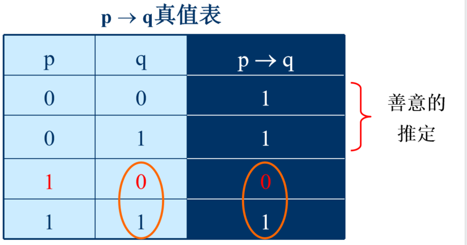
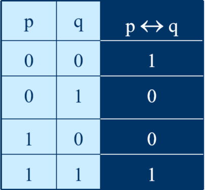

# 目录

* #### Part1 数理逻辑

  * 第一章  命题逻辑的基本概念
  * 第二章  命题逻辑等值演算
  * 第三章  命题逻辑的推理理论
  * 第四章  一阶逻辑基本概念
  * 第五章  一阶逻辑等值演算与推理

* #### Part2 集合论

  * 第六章  集合代数
  * 第七章  二元关系
  * 第八章  函数

* #### Part3 代数结构

  * 第九章  代数系统
  * 第十章  群与环

* #### Part4 图论

  * 第十四章  图的基本概念
  * 第十五章  欧拉图哈密顿图
  * 第十六章  树
  * 第十七章  平面图

# Part1 数理逻辑

## 第一章 命题逻辑基本概念

### 1.1 命题与联结词

##### 1.1.1命题与真值

1. 定义

   * 命题: 判断结果==惟一==的陈述句

   * 命题的真值: 判断的==结果==

   * 真值的取值: 真、假

   * 真命题: 真值为真的命题

     假命题: 真值为假的命题

2. 判断命题
   * 感叹句、祈使句、疑问句属于非陈述句，所以都不是命题
     * `这只兔子跑得真快呀！`/ `请不要讲话！`/`你有铅笔吗？`均**不是命题**
   * 如果陈述句的判断结果==不惟一确定==，那么该陈述句也不是命题
     * `明年我将去欧洲` / `任一大于2的偶数都可写成两个质数之和`真值一定存在, 只是不知道, **是命题**
     * `x－y>2`真值不确定, **不是命题**
   * 陈述句中的悖论也不是命题
     * `我正在说假话` / `理发师猜想`

##### 1.1.2 命题符号化
1. 原子命题（简单命题）：一个不能再分解为更加简单的命题， 是命题逻辑中研究的最基本单位
	* 用小写英文字母p, q, r, p~i~, q~i~等表示简单命题
2. 复杂命题：由简单命题与联结词按照一定规则复合成的命题

##### 1.1.3 复合命题及联结词
1. 否定式与否定联结词 "$\neg$" (\neg)

2. 合取式与合区联结词 "$\wedge$"(\wedge) / "$\cdot$"(\cdot)  (且, 逻辑乘)
	
	1. 合取相关规则
		* p$\wedge$p 等价于p
		* p$\wedge$1 等价于p
		* p$\wedge$0 等价于0
		* p$\wedge$($\neg$p) 等价于p
		* 合取满足==交换律==: **p $\wedge$ q 等价于q $\wedge$ p**
		* 合取满足==结合律==: **p $\wedge$(q $\wedge$r) 等价于(p$\wedge$q) $\wedge$r**
	
3. 析取式与析取联结词 "$\vee$" （或, 逻辑加）
	
	1. 分类
		* 相容或：全为真时， 也为真（普通的或）
		* 排斥或：只有一真一假时， 才为真（异或）
	2. 例
		* 2或4是素数 **相容或**
		* 小明只能拿一个苹果或一个梨 **排斥或**
		* 小红生于2000年或2001年 **排斥或/相容或** (因为从实际生活来说， 生于2000年和生于2001年必定一真一假)
	
4. 蕴涵式与蕴涵联结词"$\rightarrow$" 
	
	1. a$\rightarrow$b, 则a是b的充分条件 / a蕴涵b
	
	2. 真值表
	
	   
	
	3. p$\rightarrow$q的逻辑关系等价于以下常见表达(中文连接词)
		* 充分系
			* ==p是q的充分条件==
			* 如果p， 则q
			* 只要p， 就q
			* 因为p， 所以q
		* 必要系
			* ==q为p的必要条件==
			* p仅当q
			* 除非q， 才p
			* 只有q， 才p
	
5. 等价式与等价联结词"$\leftrightarrow$" (当且仅当)
	
	* 
	
	* 符号化后， ==只考虑真值==， 不考虑两个命题之间是否存在逻辑关系
	
6. 联结词的优先顺序: **(), $\neg$, $\wedge$, $\vee$, $\rightarrow$, $\leftrightarrow$**
