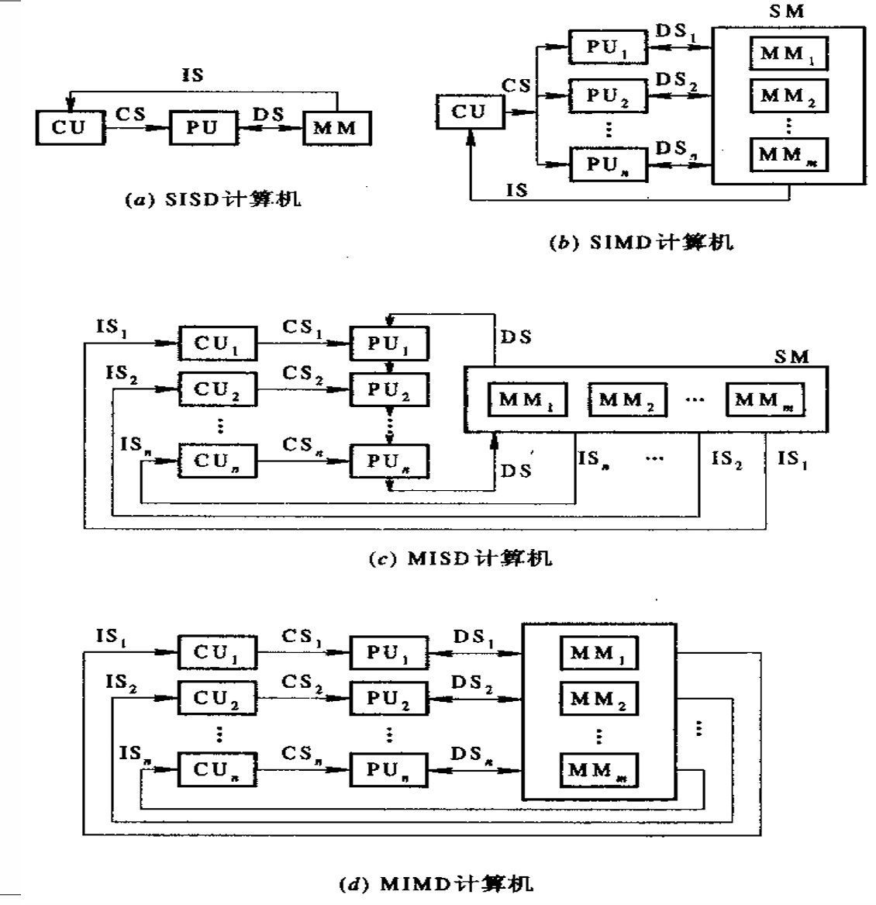
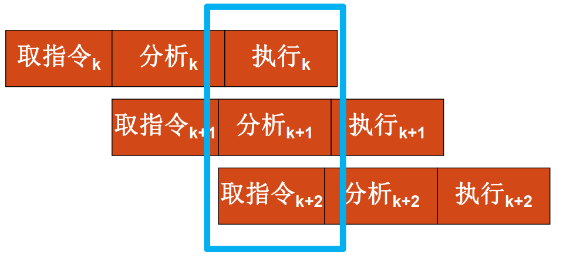

# 第1章 计算机系统结构概论

## 1.1 计算机系统的多级层次结构

>  计算机系统 = 硬件/固件+软件

计算机语言从低级往高级发展电子数字计算机

- 高一级语言功能更强，但均以低级语言为基础。
- 从**计算机语言**的角度，可以将计算机系统看成是按功能划分的**多层次结构**。 
  每一层以一种语言为特征。

### 翻译&解释

翻译：先用转换程序将高一级机器级上的程序整个地变换成低一级机器级上等效的程序，然后再在低一级机器级上实现的技术

- 编译程序实现将高级语言源程序转换为机器语言目标程序

解释：在低级机器级上用它的一串语句或指令来 仿真高级机器级上的一条语句或指令的功能，是通过对高级的机器级语言程序中的每条语句或指 令逐条解释来实现的技术。

- 微指令程序解释实现机器指令

> from gpt
>
> 1. **编译：**
>    - **定义：** 编译是将高级编程语言代码转换为机器代码或中间代码的过程。
>    - **目的：** 编译的主要目的是生成一个可在特定计算机体系结构上独立运行的可执行文件。
>    - **输出：** 编译的结果通常是一个可执行文件或中间代码，然后由计算机硬件执行。
> 2. **翻译：**
>    - **定义：** 在更广义上，翻译是将代码或文本从一种语言转换为另一种语言的过程。在编程的上下文中，它可以指编译和解释的过程。
>    - **目的：** 翻译的目的是使代码在不同的环境或语言中可理解或可执行。
>    - 类型：
>      - *源到源翻译：* 将代码从一种高级编程语言转换为另一种。
>      - *二进制翻译：* 将机器代码从一种架构转换为另一种。
> 3. **解释：**
>    - **定义：** 解释是直接在没有单独编译步骤的情况下执行程序的过程。代码在运行时逐行翻译和执行。
>    - **目的：** 解释的主要目的是在不生成单独的可执行文件的情况下执行程序。
>    - **执行：** 程序在运行时被解释和执行，这使得调试更容易，提供更灵活的开发环境。

| 翻译                                 | 解释         |
| ------------------------------------ | ------------ |
| 多占存储空间(保存中间代码, 目标代码) | 节省存储空间 |
| 需要翻译程序                         | 需要编译程序 |
| 不占运行时间                         | 运行费时     |

### 多级层次结构优点

1. 理解软件、硬件、固件的地位和作用 
2. 理解各种语言的实质和实现途径
3. 探索虚拟机新的实现方法和新的系统设计 
   - 由硬件固件实现——**高级语言机器** 
   - 多处理机系统——由**真正微处理机**实现
4. 理解计算机体系结构的定义，合理进行软、 硬件系统设计与开发

## 1.2计算机系统结构、组成与实现

### 1.2.1 计算机系统结构

计算机系统的多级层次结构的划分是相对的，不同级别的程序员所了解到的**计算机属性**是不一样的，低层机器的属性对高层机器的程序员基本上是**透明**的（即**抽象使用**）。 

- 计算机属性：计算机的概念性结构和功能特性。 

- 透明性：本来存在的事物或属性，从某个角度去看却好象不存在，这种概念称为透明性。

  -  透明性例子

    | ISA               | 无需了解底层复杂的硬件               |
    | ----------------- | ------------------------------------ |
    | 应用程序接口(API) | 无需了解内部具体编码                 |
    | 虚拟内存          | 无需了解程序存储器                   |
    | 文件              | 无需了解I/O设备的工作                |
    | 虚拟机            | 无需了解机器的处理器, 操作系统和程序 |

==系统结构==就是要研究对于某级，哪些属性应该透明，哪些属性不应该透明。

- 更本质地说，系统结构就是某一语言程序员在对应的机器级上能够编写正确运行的程序 所必须了解的所有计算机属性的集合。 

==计算机系统结构==也称计算机系统的体系结构,它只是系统结构中的一部分，指的是**传统机器级的系统结构**， 即机器级程序员所看到的计算机属性（包括了**概念性结构和功能特性**）

#### 外特性: 概念性结构和功能特性

例如 
➢人需要有消化系统，胃→外特性 
➢人需要有思维系统，大脑→外特性 
➢动物需要运动系统，运动系统相关的器官→外特性

计算机的外特性有哪些？ 
➢计算机需要运算系统，需要运算器件。 
➢计算机需要存储系统，需要存储器件。 
➢计算机需要I/O系统，需要输入输出设备。

**运算器件是怎么实现的，电路是如何构造的不是外特性**

#### 透明性概念

| CPU类型, 型号, 主存容量          |        |
| -------------------------------- | ------ |
| 对应用程序员                     | 透明   |
| 对系统程序员, 硬件设计人员       | 不透明 |
| **浮点数表示, 乘法指令**         |        |
| 对高级语言程序员, 应用程序员     | 透明   |
| 对汇编语言程序员、机器语言程序员 | 不透明 |
| **数据总线宽度、微程序**         |        |
| 对硬件设计人员                   | 透明   |
| 对计算机维修人员                 | 透明   |
| 对汇编语言程序员                 | 不透明 |

## 1.4 软件等对系统结构的影响 

### 1.4.1 软件对系统结构的影响

> 软件相对于硬件的成本越来越贵，产量和可靠性的提高越来越困难，软件的排错比编写难。 为此，在系统结构设计时，提出应在新的系统结构上解决好**软件的可移植性**问题。

==软件可移植性==的定义: 软件产品不用修改或只需经过少量加工，就能 由一台机器搬到另一台机器上运行。

#### 软件可移植性的基本技术

##### 统一高级语言

软件的移植种类：系统软件和应用软件 

目前有数百种高级语言，用于不同的应用场合， 却没有一种能满足各种需要、通用的高级语言，因为： 

- 不同的用途，语言的语法结构和语义结构不同
- 对语言的基本结构没有透彻的统一的认识
- 惯性作用

##### 系列机思想

1. ==系列机==应该是多功能的、通用的，按照**统一系统结构**设计的，根据结构生产软件，按现代技术用各种器件实现的，具有不同速度、价格和应用场合的。
   - 软件运行于同系列不同型号的机器上，仅有运行时间不相同
2. 系列机的特性在于： 
   - 机器的属性相一致
   - 软件的兼容性（应做到**向后兼容**，并力争**向上兼容**）
     向后兼容是软件兼容的根本特征， 也是系列机的根本特征。

3. 系列机优点
   - 优点：
     - 采用系列机之间软件兼容，可移植性好
     - 使总线和硬件的插件、接口等相互兼容；
     - 便于实现机间通信；(使用统一数据结构和指令，便于组成多机系统和网络)
     - 便于(机器)维修、(人员)培训；
     - 有利于提高生产率, 降低成本, 增加产量
   - 缺点：
     - 采用新技术困难---如Itanium(32bit64bit)
     - 限制了计算机系统结构的发展

##### 模拟和仿真

> 为实现不同系统结构的机器之间的机器语言软 件移植，就必须做到在一种机器的系统结构上实现另一种机器的系统结构。其中最重要的，就是要在 一种机器上（A）实现另一种机器（B）的指令系统， 即**另一种机器语言**。
>
> $B机的程序\stackrel{移植}\Longrightarrow A机上运行$

1. 模拟
2. 仿真
   - 用机器中**微程序**控制的方法，解释另一台机器指令的系统，即B机器的每条机器指令用A机器一段微程序解释

## 1.5 并行性发展与计算机系统分类

### 1.5.1 并行性概念

#### 并行性的定义与功能

- 把同时进行运算或操作的特性，称并行性。即： 在同一时刻或同一时间间隔内完成两种或两种以上， 性质相同或不同的工作。 
- 开发并行性是为了提高计算机处理的速度。包括**运算速度、执行速度、数据存取的速度**。
- 并行性可分为：同时性、并发性
  - ==同时性==:  并发事件在同一时刻发生
  - ==并发性==:  并发事件在同一时间间隔里发生

#### 并行性的等级

- **程序执行**
  - 指令内部: 一条指令内部各个微操作之间的并行
  - 指令之间: 多条指令的并行执行
  - 任务、进程之间: 多个任务或程序段的并行执行
  - 作业、程序之间: 多个作业或多道程序的并行

- **数据处理**
  - 位串字串: 只能对一个字中的一位进行处理 指传统的 “串行”概念
  - 位并字串: 同时对一个字中的全部位进行处理 指传统的 “并行” 概念
  - 位串字并: 同时对多个字中的同一位进行处理
  - 位并字并: 同时对多个字中的多位进行处理 也称 “全并行”

- 信息加工，是从各个加工的步骤和阶段来分

  - 存储器操作并行----采用单体多字 、多体单字、多体多字方式进行存储器访问、读写过程

  - 处理器操作步骤并行----处理器内部操作，取指令、分析、执行操作的并行（**流水线**）

  - 处理器操作并行----采用多个处理器，在同一控制器下同时一条指令的多个数据、多个向量并行处
    理

  - 指令任务、作业并行----采用多个处理器，同时对多条指令的多个数据进行处理

#### 并行性开发的途径

##### **时间重叠**

1. 让多个处理过程在时间上相互错开，轮流重叠地使用同一套硬件设备的各个部件，以加快部件的周转提高速度。
   - 采用专用化功能部件完成专一功能，各执行过程在时间上重叠起来。把专门化功能部件从指令内部，扩展到指令之间的执行部件，构成专用功能段。采用一条指令对向量的多个元素（多个数据）进行处理，构成的**流水线处理机**。
   - 由多个不同类型、不同功能的处理机，构成**异构型多机系统**
2. 特点: 不增加硬件设备（部件），可以提高性能价格比
3. 

##### **资源重复** 

1. 通过重复设置硬件资源，提高性能和可靠性。由同一个控制器，控制多个处理器同时处理同一个数据，进行同个运算。
   - 关键部件采用重复设置、冗余技术，提高系统速度。采用多操作部件、多存储体，用同样的资源结构，通过重复设置多个相同的处理单元，在一个控制器指挥下，同时对多个数据操作。并行处理机采用阵列结构形式，构成**阵列机**。
   - 由多个相同类型、相同功能的处理机，形成**同构型多机系统**
2. 特点: 硬件价格下降了，有利于提高系统的速度和可靠性
3.  

##### **资源共享**

1. 用软件的方法，使多个用户按一定时间轮流地分时使用同一资源，以提高利用率，提高整个系统
   的性能。
   - 采用多道程序、分时系统在单机上使用形成了虚拟机系统。分时系统适用于多终端、远程终端上
     使用。
   - 将若干台具有独立功能的处理机（或计算机）相互连接起来，在操作系统控制下，统一协调地运
     行，最少依赖某一软件、硬件资源，称为**分布式处理系统** 
2. 资源共享可分为
   1. 硬件资源共享：CPU、主存、外设资源
   2. 软件资源共享:   软件、信息资源

### 1.5.2 计算机系统分类

#### 弗林分类法

> ==弗林分类法==：按指令流、数据流方式进行分类

$\begin{cases}指令流:指机器执行的指令序列\\数据流:指指令流调用的数据序列\end{cases}$

**单指令流单数据流（SISD）**: 指令部件每次只对一条指令进行译码，并只对一个操作部件分配数据

**单指令流多数据流（SIMD）**: 由单一指令部件控制，按照同一指令流的要求，给它们分配不同的数据。

**多指令流单数据流（ MISD）**: 有多个处理单元，按多条不同指令的要求对同一个数据流及中间结果进行不同的处理。一个处理单元的输出作为另一个处理单元的输入

**多指令流多数据流（MIMD）**: 由多个单指令流单数据流的集合构成

1.  

#### 库克分类法

**单指令流单执行流（ SISE ）**: 典型的单处理机系统
**单指令流多执行流（ SIME ）**: 带多操作部件的处理机
**多指令流单执行流（ MISE ）**: 带指令级多道程序的单处理机
**多指令流多执行流（ MIME）**: 典型的多处理机系统

> ==库克分类法==：按指令流、执行流方式来描述计算机总控制器的结构特征

#### 冯泽云分类法

> ==冯泽云分类法==：以计算机在**单位时间内处理的最大二进制位数**

**字串位串 ( WSBS)** : 位串处理方式，每次只处理一 个字中的一位，如位串行计算机。
**字串位并 ( WSBP)** : 字（字片）处理方式，每次处理一个字中的 n 位，如传统的位并行单处理机。
**字并位串 ( WPBS)** : 位（位片）处理方式，一次处理 m 个字中的一位，如相联处理机、阵列处理机 。
**字并位并 ( WPBP)** : 全并行处理方式，一次处理m 个字，每个字为 n 位，如阵列处理机 、多处理机

串行: serial; 并行: parallel

# 第2章 指令系统的发展和改进

指令系统设计的三个阶段：

- CISC：复杂指令系统
  - 70-80年代，CISC结构的微处理器为市场的主流
- RISC：精简指令系统
  - 80-90年代末期，RICS结构的处理器得到发展，大量出现在高性能的计算机中
- 后RISC时期
  - RISC和CISC互相借鉴继续发展，出现了新型的结构

## 2.1 CISC结构

### 2.1.1 CISC设计思想

复杂指令系统计算机CISC（Complex Instruction Set Computer）

1. 试图用数目少、功能强的指令来完成程序的任务
   - 设计方法： 用一条指令代替一串指令
     - 增加新的指令
     - 增强指令的功能，设置功能复杂的指令
     - 增加寻址方式
     - 增加数据的表现形式
2. 特点：
   - 指令条数多
   - 指令功能强
   - 寻址方式多
   - 执行时间长
   - CPU控制电路复杂

### 2.1.2 CISC改进方向

1. 面向目标程序的优化实现改进
    - 通过统计已有机器语言程序及其执行过程中指令和指令串的**使用频度**加以分析改进
      - **遵循哈夫曼压缩原理**
    - 增设强功能符合指令
2. 面向高级语言和编译的优化实现改进

      - 通过统计高级语言语句的使用频度加以改进分析
      - 优化代码生成来改进
      - 缩小语义差距
      - 面向不同高级程序语言自寻优
      - 发展高级语言计算机

3. 面向操作系统的优化实现改进

    - 统计操作系统中指令和指令串的使用频度加以改进分析
    - 增设专用于操作系统的新指令
    - 频繁使用的子程序硬化或固化
    - 发展专门的处理

### 2.1.3 CISC存在的问题

1. 指令系统庞大
  - 指令的条数多，功能复杂
  - 寻址方式多，指令的格式多，字节数长
  - 指令分析器复杂，面积增大，成本提高
  - 芯片设计周期长，成功率低，可靠性降低
2. 指令操作繁杂，速度低
  - 功能复杂，寻址方式多，指令的格式多，字节数长都影响 CPU 指令执行的速度
3. 指令系统庞大，使高级语言编译程序生成目标程序的难度大
  - 编译程序选择的目标范围大
  - 很难生成真正高效 的机器语言程序
  - 编译生成的目标程序长度长
4. 指令使用的频度差别很大,许多指令利用率很低
  - 增加设计人员 负担，降低了系统性能价格比
  - ==2-8定律==: 仅20%的指令被反复使用，在总程序数量中占80%

## 2.2 RISC结构

精简指令系统计算机RISC（Reduced Instruction Set Computer）: 通过减少指令种数和简化指令功能来降低硬件设计的复杂度，提高指令的执行速度

- 只保留功能简单的指令，对复杂的不常用指令进行精简
- 功能较复杂的指令改由软件实现
- 设置大量寄存器
- 提高流水线效率

### 2.2.1 RISC设计原则

1. 选择使用频度较高、最有用，及实现简单的指令；
2. 每条指令都在一个机器周期内完成的指令；
3. 减少指令寻址方式的种类，简化指令格式，使指令的长度相同；
4. 增加通用寄存器的数量，减少访问存储器操作；
5. 大量采用硬联控制，提高执行速度
6. 通过优化和精简指令设计支持的编译程序，能有效地为高级语言生成机器语言程序。

# 第3章 标量处理机

如何加快机器语言(指令)的执行

- 加快每条指令的执行
- 提高并行性 → 重叠, 流水

## 3.1 重叠方式

1. ==顺序解释==：各条机器指令之间顺序串行地执行，执行完一条指令后采取出下条指令来执行，而且每条指令内部的各个微操作也是顺序串行地执行
   - 控制简单, 速度慢, 部件利用率低
2. ==重叠解释==：在解释第k条指令的操作完成之前，就可开始解释第k+1条指令
   - 不能加快一条指令的实现, 但能加快相邻两条/一段程序的解释
   - 一次重叠:  
   - 二次重叠:  

### 重叠存在的问题

1. 访存冲突
   1. 操作数和指令分别存于两个独立编址且可同时访问的存储器，有利于实现指令保护，增加总线控制和软件设计的复杂性
   2. 混存，采用多体交叉主存结构
   3. 增设指令缓冲寄存器
2. 在硬件上，保证有独立的指令分析部件和指令执行部件； 
3. 两部分执行的时间常常不相同，在硬件上解决好控制上的同步；

4. 控制相关(指令跳转)
5. 

## 3.2 流水

## 3.3 

