> [02325《计算机系统结构》自考大题：第 6、7、8 章_实现16个处理单元互连的pm2i单级网络1写出所有各种单级pm2i互连函数的一般式 23号-CSDN博客](https://blog.csdn.net/weixin_43605641/article/details/124525916)

# 第1章 计算机系统结构概论

## 1.1 计算机系统的多级层次结构

>  计算机系统 = 硬件/固件+软件

计算机语言从低级往高级发展电子数字计算机

- 高一级语言功能更强，但均以低级语言为基础。
- 从**计算机语言**的角度，可以将计算机系统看成是按功能划分的**多层次结构**。 
  每一层以一种语言为特征。

### 翻译&解释

翻译：先用转换程序将高一级机器级上的程序整个地变换成低一级机器级上等效的程序，然后再在低一级机器级上实现的技术

- 编译程序实现将高级语言源程序转换为机器语言目标程序

解释：在低级机器级上用它的一串语句或指令来 仿真高级机器级上的一条语句或指令的功能，是通过对高级的机器级语言程序中的每条语句或指 令逐条解释来实现的技术。

- 微指令程序解释实现机器指令

> from gpt
>
> 1. **编译：**
>    - **定义：** 编译是将高级编程语言代码转换为机器代码或中间代码的过程。
>    - **目的：** 编译的主要目的是生成一个可在特定计算机体系结构上独立运行的可执行文件。
>    - **输出：** 编译的结果通常是一个可执行文件或中间代码，然后由计算机硬件执行。
> 2. **翻译：**
>    - **定义：** 在更广义上，翻译是将代码或文本从一种语言转换为另一种语言的过程。在编程的上下文中，它可以指编译和解释的过程。
>    - **目的：** 翻译的目的是使代码在不同的环境或语言中可理解或可执行。
>    - 类型：
>      - *源到源翻译：* 将代码从一种高级编程语言转换为另一种。
>      - *二进制翻译：* 将机器代码从一种架构转换为另一种。
> 3. **解释：**
>    - **定义：** 解释是直接在没有单独编译步骤的情况下执行程序的过程。代码在运行时逐行翻译和执行。
>    - **目的：** 解释的主要目的是在不生成单独的可执行文件的情况下执行程序。
>    - **执行：** 程序在运行时被解释和执行，这使得调试更容易，提供更灵活的开发环境。

| 翻译                                 | 解释         |
| ------------------------------------ | ------------ |
| 多占存储空间(保存中间代码, 目标代码) | 节省存储空间 |
| 需要翻译程序                         | 需要编译程序 |
| 不占运行时间                         | 运行费时     |

### 多级层次结构优点

1. 理解软件、硬件、固件的地位和作用 
2. 理解各种语言的实质和实现途径
3. 探索虚拟机新的实现方法和新的系统设计 
   - 由硬件固件实现——**高级语言机器** 
   - 多处理机系统——由**真正微处理机**实现
4. 理解计算机体系结构的定义，合理进行软、 硬件系统设计与开发

## 1.2计算机系统结构、组成与实现

### 1.2.1 计算机系统结构

计算机系统的多级层次结构的划分是相对的，不同级别的程序员所了解到的**计算机属性**是不一样的，低层机器的属性对高层机器的程序员基本上是**透明**的（即**抽象使用**）。 

- 计算机属性：计算机的概念性结构和功能特性。 

- 透明性：本来存在的事物或属性，从某个角度去看却好象不存在，这种概念称为透明性。

  -  透明性例子

    | ISA               | 无需了解底层复杂的硬件               |
    | ----------------- | ------------------------------------ |
    | 应用程序接口(API) | 无需了解内部具体编码                 |
    | 虚拟内存          | 无需了解程序存储器                   |
    | 文件              | 无需了解I/O设备的工作                |
    | 虚拟机            | 无需了解机器的处理器, 操作系统和程序 |

==系统结构==就是要研究对于某级，哪些属性应该透明，哪些属性不应该透明。

- 更本质地说，系统结构就是某一语言程序员在对应的机器级上能够编写正确运行的程序 所必须了解的所有计算机属性的集合。 

==计算机系统结构==也称计算机系统的体系结构,它只是系统结构中的一部分，指的是**传统机器级的系统结构**， 即机器级程序员所看到的计算机属性（包括了**概念性结构和功能特性**）

#### 外特性: 概念性结构和功能特性

例如 
➢人需要有消化系统，胃→外特性 
➢人需要有思维系统，大脑→外特性 
➢动物需要运动系统，运动系统相关的器官→外特性

计算机的外特性有哪些？ 
➢计算机需要运算系统，需要运算器件。 
➢计算机需要存储系统，需要存储器件。 
➢计算机需要I/O系统，需要输入输出设备。

**运算器件是怎么实现的，电路是如何构造的不是外特性**

#### 透明性概念

| CPU类型, 型号, 主存容量          |        |
| -------------------------------- | ------ |
| 对应用程序员                     | 透明   |
| 对系统程序员, 硬件设计人员       | 不透明 |
| **浮点数表示, 乘法指令**         |        |
| 对高级语言程序员, 应用程序员     | 透明   |
| 对汇编语言程序员、机器语言程序员 | 不透明 |
| **数据总线宽度、微程序**         |        |
| 对硬件设计人员                   | 透明   |
| 对计算机维修人员                 | 透明   |
| 对汇编语言程序员                 | 不透明 |

## 1.4 软件等对系统结构的影响 

### 1.4.1 软件对系统结构的影响

> 软件相对于硬件的成本越来越贵，产量和可靠性的提高越来越困难，软件的排错比编写难。 为此，在系统结构设计时，提出应在新的系统结构上解决好**软件的可移植性**问题。

==软件可移植性==的定义: 软件产品不用修改或只需经过少量加工，就能 由一台机器搬到另一台机器上运行。

#### 软件可移植性的基本技术

##### 统一高级语言

软件的移植种类：系统软件和应用软件 

目前有数百种高级语言，用于不同的应用场合， 却没有一种能满足各种需要、通用的高级语言，因为： 

- 不同的用途，语言的语法结构和语义结构不同
- 对语言的基本结构没有透彻的统一的认识
- 惯性作用

##### 系列机思想

1. ==系列机==应该是多功能的、通用的，按照**统一系统结构**设计的，根据结构生产软件，按现代技术用各种器件实现的，具有不同速度、价格和应用场合的。
   - 软件运行于同系列不同型号的机器上，仅有运行时间不相同
2. 系列机的特性在于： 
   - 机器的属性相一致
   - 软件的兼容性（应做到**向后兼容**，并力争**向上兼容**）
     向后兼容是软件兼容的根本特征， 也是系列机的根本特征。

3. 系列机优点
   - 优点：
     - 采用系列机之间软件兼容，可移植性好
     - 使总线和硬件的插件、接口等相互兼容；
     - 便于实现机间通信；(使用统一数据结构和指令，便于组成多机系统和网络)
     - 便于(机器)维修、(人员)培训；
     - 有利于提高生产率, 降低成本, 增加产量
   - 缺点：
     - 采用新技术困难---如Itanium(32bit64bit)
     - 限制了计算机系统结构的发展

##### 模拟和仿真

> 为实现不同系统结构的机器之间的机器语言软 件移植，就必须做到在一种机器的系统结构上实现另一种机器的系统结构。其中最重要的，就是要在 一种机器上（A）实现另一种机器（B）的指令系统， 即**另一种机器语言**。
>
> $B机的程序\stackrel{移植}\Longrightarrow A机上运行$

1. 模拟
2. 仿真
   - 用机器中**微程序**控制的方法，解释另一台机器指令的系统，即B机器的每条机器指令用A机器一段微程序解释

## 1.5 并行性发展与计算机系统分类

### 1.5.1 并行性概念

#### 并行性的定义与功能

- 把同时进行运算或操作的特性，称并行性。即： 在同一时刻或同一时间间隔内完成两种或两种以上， 性质相同或不同的工作。 
- 开发并行性是为了提高计算机处理的速度。包括**运算速度、执行速度、数据存取的速度**。
- 并行性可分为：同时性、并发性
  - ==同时性==:  并发事件在同一时刻发生
  - ==并发性==:  并发事件在同一时间间隔里发生

#### 并行性的等级

- **程序执行**
  - 指令内部: 一条指令内部各个微操作之间的并行
  - 指令之间: 多条指令的并行执行
  - 任务、进程之间: 多个任务或程序段的并行执行
  - 作业、程序之间: 多个作业或多道程序的并行

- **数据处理**
  - 位串字串: 只能对一个字中的一位进行处理 指传统的 “串行”概念
  - 位并字串: 同时对一个字中的全部位进行处理 指传统的 “并行” 概念
  - 位串字并: 同时对多个字中的同一位进行处理
  - 位并字并: 同时对多个字中的多位进行处理 也称 “全并行”

- 信息加工，是从各个加工的步骤和阶段来分

  - 存储器操作并行----采用单体多字 、多体单字、多体多字方式进行存储器访问、读写过程

  - 处理器操作步骤并行----处理器内部操作，取指令、分析、执行操作的并行（**流水线**）

  - 处理器操作并行----采用多个处理器，在同一控制器下同时一条指令的多个数据、多个向量并行处
    理

  - 指令任务、作业并行----采用多个处理器，同时对多条指令的多个数据进行处理

#### 并行性开发的途径

##### **时间重叠**

1. 让多个处理过程在时间上相互错开，轮流重叠地使用同一套硬件设备的各个部件，以加快部件的周转提高速度。
   - 采用专用化功能部件完成专一功能，各执行过程在时间上重叠起来。把专门化功能部件从指令内部，扩展到指令之间的执行部件，构成专用功能段。采用一条指令对向量的多个元素（多个数据）进行处理，构成的**流水线处理机**。
   - 由多个不同类型、不同功能的处理机，构成**异构型多机系统**
2. 特点: 不增加硬件设备（部件），可以提高性能价格比
3. 

##### **资源重复** 

1. 通过重复设置硬件资源，提高性能和可靠性。由同一个控制器，控制多个处理器同时处理同一个数据，进行同个运算。
   - 关键部件采用重复设置、冗余技术，提高系统速度。采用多操作部件、多存储体，用同样的资源结构，通过重复设置多个相同的处理单元，在一个控制器指挥下，同时对多个数据操作。并行处理机采用阵列结构形式，构成**阵列机**。
   - 由多个相同类型、相同功能的处理机，形成**同构型多机系统**
2. 特点: 硬件价格下降了，有利于提高系统的速度和可靠性
3.  

##### **资源共享**

1. 用软件的方法，使多个用户按一定时间轮流地分时使用同一资源，以提高利用率，提高整个系统
   的性能。
   - 采用多道程序、分时系统在单机上使用形成了虚拟机系统。分时系统适用于多终端、远程终端上
     使用。
   - 将若干台具有独立功能的处理机（或计算机）相互连接起来，在操作系统控制下，统一协调地运
     行，最少依赖某一软件、硬件资源，称为**分布式处理系统** 
2. 资源共享可分为
   1. 硬件资源共享：CPU、主存、外设资源
   2. 软件资源共享:   软件、信息资源

### 1.5.2 计算机系统分类

#### 弗林分类法

> ==弗林分类法==：按指令流、数据流方式进行分类

$\begin{cases}指令流:指机器执行的指令序列\\数据流:指指令流调用的数据序列\end{cases}$

**单指令流单数据流（SISD）**: 指令部件每次只对一条指令进行译码，并只对一个操作部件分配数据

**单指令流多数据流（SIMD）**: 由单一指令部件控制，按照同一指令流的要求，给它们分配不同的数据。

**多指令流单数据流（ MISD）**: 有多个处理单元，按多条不同指令的要求对同一个数据流及中间结果进行不同的处理。一个处理单元的输出作为另一个处理单元的输入

**多指令流多数据流（MIMD）**: 由多个单指令流单数据流的集合构成

1.  

#### 库克分类法

**单指令流单执行流（ SISE ）**: 典型的单处理机系统
**单指令流多执行流（ SIME ）**: 带多操作部件的处理机
**多指令流单执行流（ MISE ）**: 带指令级多道程序的单处理机
**多指令流多执行流（ MIME）**: 典型的多处理机系统

> ==库克分类法==：按指令流、执行流方式来描述计算机总控制器的结构特征

#### 冯泽云分类法

> ==冯泽云分类法==：以计算机在**单位时间内处理的最大二进制位数**

**字串位串 ( WSBS)** : 位串处理方式，每次只处理一 个字中的一位，如位串行计算机。
**字串位并 ( WSBP)** : 字（字片）处理方式，每次处理一个字中的 n 位，如传统的位并行单处理机。
**字并位串 ( WPBS)** : 位（位片）处理方式，一次处理 m 个字中的一位，如相联处理机、阵列处理机 。
**字并位并 ( WPBP)** : 全并行处理方式，一次处理m 个字，每个字为 n 位，如阵列处理机 、多处理机

串行: serial; 并行: parallel

# 第2章 指令系统的发展和改进

指令系统设计的三个阶段：

- CISC：复杂指令系统
  - 70-80年代，CISC结构的微处理器为市场的主流
- RISC：精简指令系统
  - 80-90年代末期，RICS结构的处理器得到发展，大量出现在高性能的计算机中
- 后RISC时期
  - RISC和CISC互相借鉴继续发展，出现了新型的结构

## 2.1 CISC结构

### 2.1.1 CISC设计思想

复杂指令系统计算机CISC（Complex Instruction Set Computer）

1. 试图用数目少、功能强的指令来完成程序的任务
   - 设计方法： 用一条指令代替一串指令
     - 增加新的指令
     - 增强指令的功能，设置功能复杂的指令
     - 增加寻址方式
     - 增加数据的表现形式
2. 特点：
   - 指令条数多
   - 指令功能强
   - 寻址方式多
   - 执行时间长
   - CPU控制电路复杂

### 2.1.2 CISC改进方向

1. 面向目标程序的优化实现改进
    - 通过统计已有机器语言程序及其执行过程中指令和指令串的**使用频度**加以分析改进
      - **遵循哈夫曼压缩原理**
    - 增设强功能符合指令
2. 面向高级语言和编译的优化实现改进

      - 通过统计高级语言语句的使用频度加以改进分析
      - 优化代码生成来改进
      - 缩小语义差距
      - 面向不同高级程序语言自寻优
      - 发展高级语言计算机

3. 面向操作系统的优化实现改进

    - 统计操作系统中指令和指令串的使用频度加以改进分析
    - 增设专用于操作系统的新指令
    - 频繁使用的子程序硬化或固化
    - 发展专门的处理

### 2.1.3 CISC存在的问题

1. 指令系统庞大
  - 指令的条数多，功能复杂
  - 寻址方式多，指令的格式多，字节数长
  - 指令分析器复杂，面积增大，成本提高
  - 芯片设计周期长，成功率低，可靠性降低
2. 指令操作繁杂，速度低
  - 功能复杂，寻址方式多，指令的格式多，字节数长都影响 CPU 指令执行的速度
3. 指令系统庞大，使高级语言编译程序生成目标程序的难度大
  - 编译程序选择的目标范围大
  - 很难生成真正高效 的机器语言程序
  - 编译生成的目标程序长度长
4. 指令使用的频度差别很大,许多指令利用率很低
  - 增加设计人员 负担，降低了系统性能价格比
  - ==2-8定律==: 仅20%的指令被反复使用，在总程序数量中占80%

## 2.2 RISC结构

精简指令系统计算机RISC（Reduced Instruction Set Computer）: 通过减少指令种数和简化指令功能来降低硬件设计的复杂度，提高指令的执行速度

- 只保留功能简单的指令，对复杂的不常用指令进行精简
- 功能较复杂的指令改由软件实现
- 设置大量寄存器
- 提高流水线效率

### 2.2.1 RISC设计原则

1. 选择使用频度较高、最有用，及实现简单的指令；
2. 每条指令都在一个机器周期内完成的指令；
3. 减少指令寻址方式的种类，简化指令格式，使指令的长度相同；
4. 增加通用寄存器的数量，减少访问存储器操作；
5. 大量采用硬联控制，提高执行速度
6. 通过优化和精简指令设计支持的编译程序，能有效地为高级语言生成机器语言程序。

# 第3章 标量处理机

如何加快机器语言(指令)的执行

- 加快每条指令的执行
- 提高并行性 → 重叠, 流水

## 3.1 重叠方式

1. ==顺序解释==：各条机器指令之间顺序串行地执行，执行完一条指令后采取出下条指令来执行，而且每条指令内部的各个微操作也是顺序串行地执行
   - 控制简单, 速度慢, 部件利用率低
2. ==重叠解释==：在解释第k条指令的操作完成之前，就可开始解释第k+1条指令
   - 不能加快一条指令的实现, 但能加快相邻两条/一段程序的解释
   - 一次重叠:  
   - 二次重叠:  

### 时间重叠需要解决的问题

#### ①解决访存冲突

1. 原因: 一般的机器上，操作数和指令混存于同一主存内，取指需要访主存，分析中取操作数也可能访主存。而一次只能访问一个主存单元
2. 解决方案: 
   1. **操作数**和**指令**分别存于两个独立编址且可同时访问的存储器，有利于实现指令保护，增加总线控制和软件设计的复杂性
   2. 混存，采用多体交叉主存结构
      - 分级存储(添加cache)
   3. 增设指令缓冲寄存器
      - **先行控制方式**: 先行控制是指在处理机内部设置一定容量的指令缓冲栈，把指今分折器所需要的指令事先取到指令缓冲栈中，而不必访问主存储器。这样，就能够使取指令、分析指令和执行指令重叠起来执行。如果指令分析器每次都能够在先行指令缓冲栈中得到，则取指令只需要很短的时间就能够完成，因此，可以**把指令与分析指令合并到一起**，从而将二次重叠转换为一次重叠。
        

#### ②解决控制同步

> 很怪

为了实现重叠, 需要保证有独立的指令分析部件和指令执行部件

两个阶段执行的时间常常不相同，需要在硬件上解决好控制上的同步

- 保证同一时刻只有分析K+1和执行k的重叠
  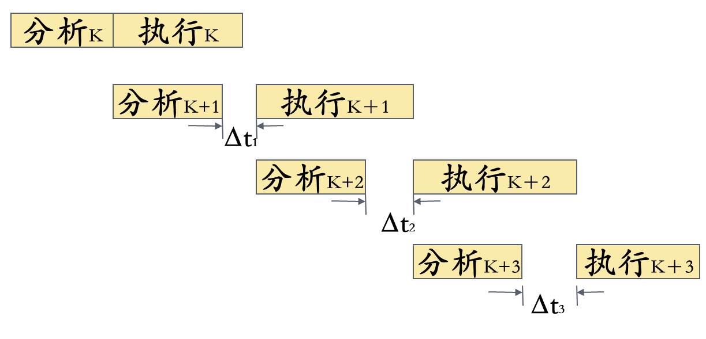 

#### ③转移指令

> 在本门课中 似乎未使用分支预测技术(默认执行连续的下一条分支)

- **延迟转移**: 将与分支指令**不存在数据相关**的、在分支指令**之前**的$指令i$(即原本一定会执行的指令)移动到分支指令$记为jump$之后, 在$jump$运行到执行阶段时, 如果需要跳转, 此时并不会撤销$指令i$, 从而避免了分支预测失败时的浪费
  - 在现代处理器中, 因为分支预测技术的效果足够好, 通常不使用这个技术了

#### ④指令相关

> 与[csapp](../csapp/CSAPP.md#4.5.5 流水线冒险)对冒险的分类方式有较大区别, 会进行比较

##### **指令相关**

> 对应**内存**产生的数据冒险

1. 原因: 采用Von Neumann型机器上指令可修改的办法经第k条指令的执行来形成第k+1条指令
2. 解决方式: 
      1. 在程序执行过程中，不准修改指令 
      2. 改变指令的执行方式，采用“执行”指令将指令相关改成操作数相关。

##### 主存空间**数相关**

1. 相邻两条指令之间要求对主存同一单元先写入而后再读出的关联。
2. 解决方法：延迟(即插入bubble)。 
    

##### 通用寄存器空间**数相关**

1. 通用寄存器存放：操作数、运算结果、变址或基址
   - 存放于通用寄存器中的**基址或变址值**一般总是在“分析”周期的前半段就取出来用；
   - **操作数**是在“分析”周期的后半段取出，到“执行”周期的前半段才用得上；
   - **运算结果**是在“执行”周期的末尾才形成，并送入通用寄存器中
   - 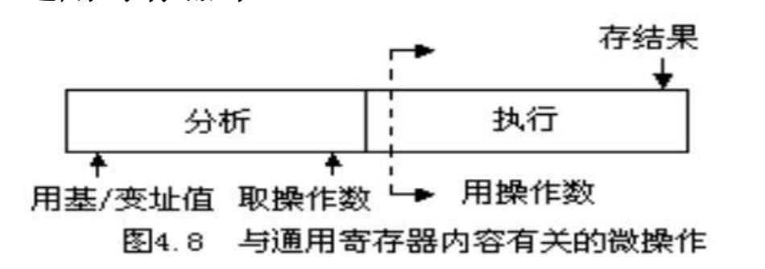 
2. 机器的基本指令格式如下图所示。
   - L1、L3：存放第一操作数和运算结果的通用寄存器号
   - B2为形成第二操作数地址的基址值所在通用寄存器号
   - d2为相对位移
   -  
3. 假设某台机器正常情况下，“分析”和“执行”的周期与主存周期一样都是4拍。
   - 有些指令需从通用寄存器组中取两个操作数（L1）和（L2），若通用寄存器组做在一个片子上，每次只能读出一个数，则在“分析k+1”期间，操作数（L1）和（L2）就需要在不同拍时取得，分别送入运算器的B和C寄存器，以便在“执行k+1”时用
   - 当程序执行过程中出现$L_1（k+1）=L_3（k）$时就发生了L1相关；而当$L_2（k+1）=L_3（k）$时就发生了L2相关
     -  
4. 解决方案1: **推后读**
   - 把“分析k+1”推后到“执行k”结束时开始(插入一个bubble)
     - 只要发生数相关就使一次重叠变成了完全的顺序串行，速度明显下降；
   - 把“分析k+1”只推后到“执行k”把结果送入L3时，保证“分析k+1”在取（L1）或（L2）时能取到就可。
     - 相邻两条指令的解释仍有部分重叠，可以减少速度损失，但控制要稍微复杂一些。
   - 推后读方法靠牺牲速度来避免相关出错
5. 解决方法2：**增设相关专用通路** (**转发forwarding/旁路bypassing**)
   - 在运算器的输出到操作数寄存器B或C输入之间增设一条“相关专用通路”
   - 在发生L1或L2相关时，让相关专用通路接通，在“执行k”时将运算结果送入通用寄存器，同时直接将运算结果回送到B或C寄存器，
   - 可大大缩短传送时间，并能保证当“执行k+1”需要用此操作数时，它已在B或C寄存器中准备好了
6. 推后“分析k+1” VS. 设置“相关专用通路”
   1. 解决重叠方式相关处理的两种基本方法。
   2. 推后“分析k+1”以降低速度为代价，设备基本不增加；设置“相关专用通路”以增加设备为代价，重叠效率不下降。
   3. 设置“相关专用通路”也可用于解决主存空间数相关，但由于主存空间数相关的出现概率低很多，所以只采用推后读来解决

综上所述，为了实现两条指令在时间上的重叠解释

1. 需要付出硬件代价
2. 要处理好指令可能存在的相关。
   - 相关处理的办法无非是“推后读”和设置相关专用通路两种，应当在成本和效率上加以权衡选用。
3. 合理安排好指令顺序及指令微操作的时间关系，使“分析”和“执行”所需的时间尽可能匹配，以提高重叠的效率

## 3.2 流水

### 3.2.1 流水线基本概念

> 流水是重叠的延伸
>
> - 一次重叠：只是把一条指令的解释分解为两个子过程；
> - 流水：分解为更多的子过程。

1. 流水线定义
   - 流水线的每一个==阶段==称为流水步、流水步骤、流水段、流水线阶段、流水功能段、功能段、流水级、流水节拍等。
   - 在每一个流水段的末尾或开头必须设置一个==锁存器==，称为流水寄存器、流水锁存器、流水闸门寄存器等。会增加指令的执行时间。
   - 为了简化，在一般流水线中不画出流水锁存器

2. 流水线性能计算
   - 流水线经过装入、充满、排空三个阶段
   - 流水的最大吞吐率：当流水线正常流动时的吞吐率。每隔Δt流出一个结果。
   - 流水的最大吞吐率取决于子过程所经过的时间Δt
3. 流水线特点
   1. 只有连续提供同类任务才能充分发挥流水线的效率
      - 对于指令流水线：要尽量减少因条件分支造成的“断流”
      - 对于操作部件：主要通过编译技术，尽量提供连续的同类操作
   2. 在流水线的每一个流水线段中都要设置一个流水锁存器
      - 时间开销：流水线的执行时间加长
      - 是流水线中需要增加的主要硬件之一
   3. 各流水段的时间应尽量相等
      - 流水线处理机的基本时钟周期等于时间最长的流水段的时间长度
      - 流水线需要有装入时间、充满时间和排空时间
      - 在理想情况下，当流水线充满后，每隔Δt时间将会有一个结果流出流水线。

### 3.2.2 流水线分类

> 从不同角度，有不同的分类

1. 依据向下扩展和向上扩展思路，可分类出在计算机系统不同等级上使用的流水线
   - 向下扩展：子过程细分
   - 向上扩展：**多个处理机**之间进行流水
2. 按流水处理的级别
   1. 部件级（操作流水线），如浮点加法器流水线
      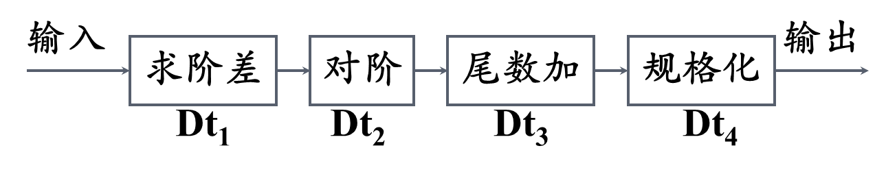 
   2. 处理机级，指令流水线 (Instruction Pipelining)
      - 例如：在采用先行控制器的处理机中，各功能部件之间的流水线
         
   3. 系统级：宏流水线 (Macro Pipelining)每个处理机对同一个数据流的不同部分分别进行处理
       
3. 按功能多少
   - 单功能：只能完成一种固定功能的流水线
     - Cray-1计算机中有12条；
     - YH-1计算机有18条；
     - Pentium有一条5段的定点和一条8段的浮点流水线；
     - PentiumⅢ有三条指令流水线，其中两条定点指令流水线，一条浮点指令流水线。
   - 多功能：流水线的各段通过不同连接实现不同功能
     - Texas公司的ASC计算机中的8段流水线，能够实现：定点加减法、定点乘法、浮点加法、浮点乘法、逻辑运算、移位操作、数据转换、向量运算等。
4. 按多功能的连接方式
   - **静态**：同一段时间内，多功能流水线中的各个功能段只能按照一种固定的方式连接，实现一种固定的功能
     - 只有连续出现同一种运算时，流水线的效率才能得到充分的发挥。
   - **动态**：在同一段时间内，多功能流水线中的各段可以按照不同的方式连接，同时执行多种功能。
   - 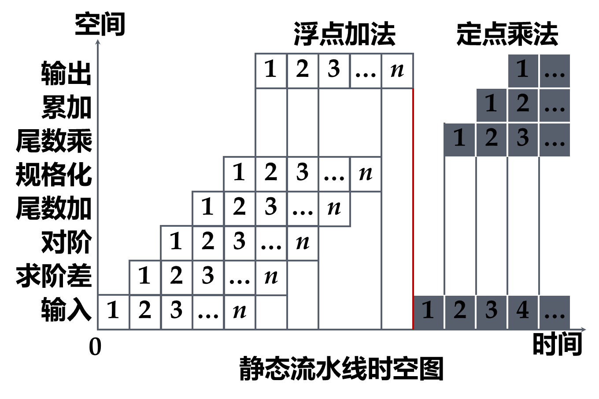 
     所有浮点加法的阶段完成后, 才能装入定点乘法
   -  
5. 按数据表示方式进行区分
   - **标量流水**：没有向量数据，只能用标量循环方式来对向量、数组进行处理。
     - Amdahl 470V/6、IBM 360/91
   - **向量流水**：设置有向量指令和向量运算硬件，能对向量、数组中的各个元素流水地处理。
     - CRAY-1
6. 按是否有反馈回路
   - **线性(Linear Pipelining)**：每个流水段都流过一次，且仅流过一次
   - **非线性(Nonlinear Pipelining)**：在流水线的某些流水段之间有反馈回路或前馈回路
7. 按照控制方式：
   - **同步流水线**
   - **异步流水线**
   - 顺序流水线与乱序流水线：乱序流水线又称为无序流水线、错序流水线或异步流水线等

### 3.2.3 流水线处理机的主要性能

> 通过时空图分析 
> 吞吐率（TP, Thoughput Rate） 
> 加速比（Speed Ratio）
> 效率（Efficiency）  

#### 吞吐率（TP, Thoughput Rate）

1. 流水线单位时间里能流出的任务数或结果数。
   - 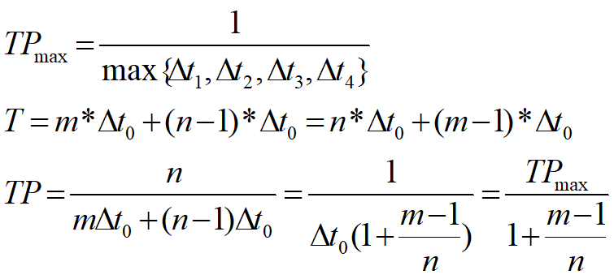 
     m: 阶段数;    n: 流水线任务数
   - 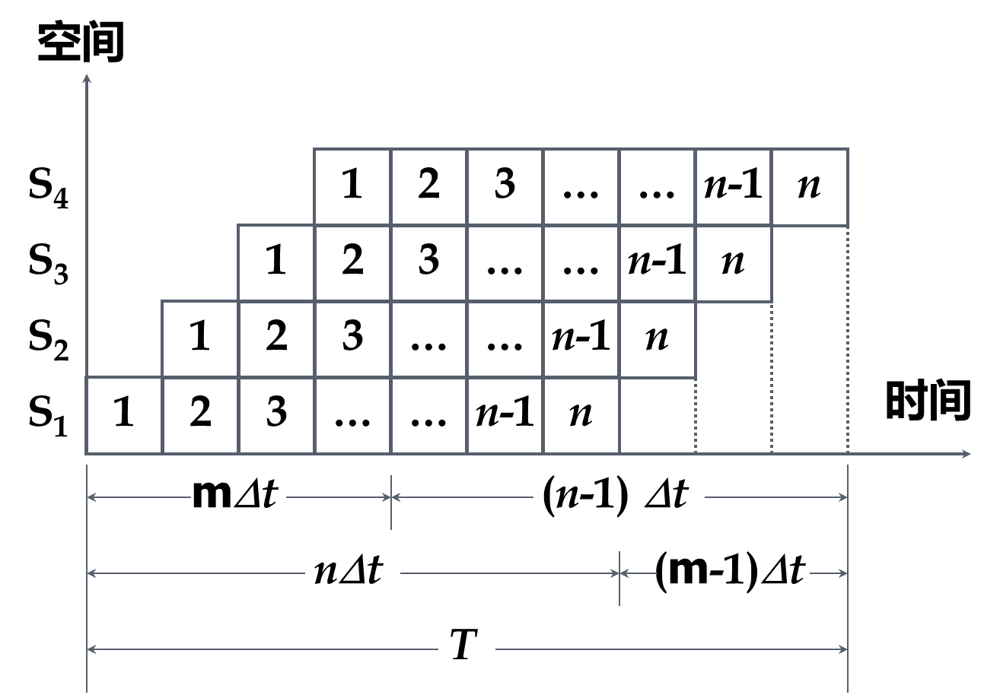 
2. 阶段不等长
   - 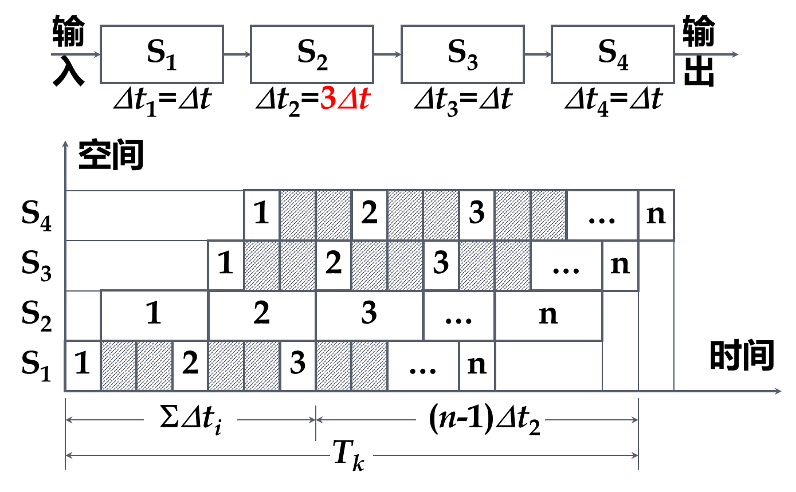 
     如图, S2阶段较长, 即存在**瓶颈子过程**S2
3. 瓶颈子过程 解决方案1: 细分
   - 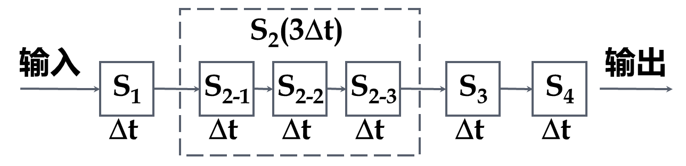 
   -  
4. 瓶颈子过程 解决方案2: 并行
   -   
     - 设置3个**相同的**S2流程使用到的部件
     - 此时的S2-1是S2的一号部件, 而非方案1的子过程
   - 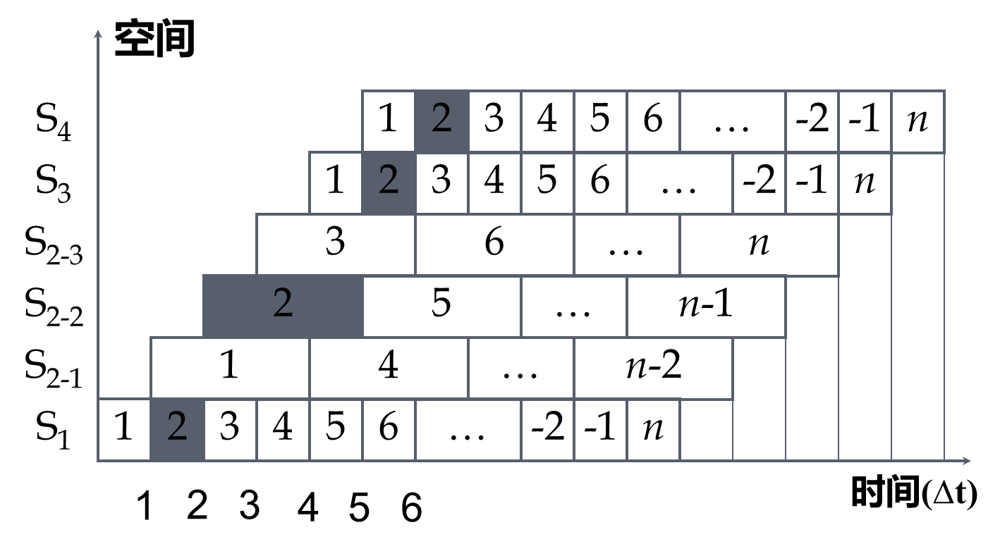 
5. 

### 3.2.4 流水机器的相关处理

> 处理可能出现流水线断流的情况

影响流水线的情况: 

- 编译后的目标代码
- 操作数、指令的读取
- 各种相关
- 中断

### 非线性流水线的调度

## 3.3

# 第4章 向量处理机

==向量处理机==：具有**向量数据表示**的处理机

- 向量流水处理机: 时间重叠
- 阵列处理机: 资源重复

## 4.1 向量的流水处理与向量流水处理机

### 4.1.1 向量的流水处理

向量的流水处理：选择使向量运算最能充分发挥出流水线性能的处理方式。

向量的几种处理方式： 以 $D=A* (B+C)$为例 (A, B, C为n维向量)

1. 横向处理方式
   - 逐个求$d_i$, 得到D 
     向量元素 $b_i+c_i \rightarrow k, k* a_i → d_i$
   - 不是流水处理方式，存在相关
2. 纵向处理方式
   - 先求所有的$K= (B+C)$，再求所有的 A*K
   - 是流水处理，需要每拍取得成对元素
3. 分组纵横处理方式
   - 把该向量分割成若干个组，使每个组都能装入向量寄存器中， **每组按纵向处理**, **组间**采用软件方
     法编制循环程序的方式**依次循环处理** 。
   - 解决主存与流水线速度不匹配问题

### 4.1.2 向量流水处理机的结构

向量流水处理机(Vector Processor) 是指将**向量数据表示**与**流水线技术**相结合 ，**能**进行向量流水处理的处理机。

#### 向量处理机的指令系统

> 一般应包含有向量型和标量型两类指令

向量型运算类指令一般又可以有如下几种：

- 向量 $V_1$ 运算得向量 $V_2$ 如 $V_2 =SIN(V_1)$
- 向量 $V$ 运算得标量 $S$ 如
- 向量 $V_1$ 与向量 $V_2$ 运算得向量 $V_3$ 如 $V_3 =V_1 ∧V_2$
- 向量 $V_1$ 与标量 $S$ 运算得向量 $V_2$ 如 $V_2 =S*V_1$

## 4.2  阵列处理机原理

**多机系统**

> 鬼知道为什么突然有这个

指的是多处理机系统和多计算机系统 
==多处理机系统==：是由多台处理机组成的单一计算机系统，各处理机都可有自己的控制部件，可带自己的局部存储器，能执行各自的程序。受逻辑上**统一的操作系统**控制。
==多计算机系统==：是由多台独立的计算机组成的系统，各计算机分别在逻辑上独立的操作系统控制下运行，机间可以互不通信，即使通信也只是经通道或通信线路以文件或数据集形式进行，实现多个作业的并行。 

==阵列处理机==: 多个处理单元（PU）按照一定方式互连，在同一个控制单元（ CU）控制下，对各自的数据完成同一条指令规定的操作。

- 指令级并行的SIMD计算机

### 4.2.1 阵列处理机的构型和特点

一台阵列处理机通常由五个部分组成

- 1个控制器CU
- n个处理单元PE
- m个存储器模块M
- 1个互连网络ICN
- 一台输入输出处理机IOP

阵列处理机结构的差异主要体现在**存储器的组成方式**和**互连网络的作用**不同。

由存储器的组成方式不同, 互连网络的作用不同进行分类: 

- 分布式存储器的阵列处理机构形
- 集中式共享存储器的阵列处理机构形

#### 分布式存储器的阵列机结构

## 4.3 SIMD计算机的互连网络

### 4.3.1 互连网络与互连函数

1. 基本功能
   - 互连网络主要完成结点与结点间的连接，连接和控制方式不同，连接效果不同。
2. 互连网络的设计思路
   - 根据应用需要（互连网络属性），选择合理的特征方式，考虑互连网络的性能因素，综合加以合理组
     合。
   - 目标：低成本、高灵活性、高连接度、低延时、适合VLSI。
3. 互连网络的表示
   - 四要素: 定时协议、**控制策略、开关方法、拓扑结构**

#### 拓扑结构

1. 拓扑结构指网络的入端&出端的连接模式 
   - 即相邻节点(处理单元)之间的通路
   - 可以用一组==互连函数==定义, 来描述**节点地址**的一一对应关系
   - 节点地址用**二进制编码**来表示
     - N个节点的地址长度$n = log_2N$位

2. ==互连函数==: 互连网络的连接特征一般用**连接函数**表示。连接函数可以用节点间的连线图表示，也可以用简单的函数式表示。
   1. 编码方式
      - 入端的编码：$x=(b{_n-1}…b_0)\quad n=log_2N$
      - 出端的编码：$f(x)=(b_{n-1}…b_0)$或其他形式
   2. 互连函数为基于$b_{n-1}…b_0$的排列、组合、移位、取反等操作的结果
3. 拓扑结构分类: 根据出入端可以连接的模式
   - **静态拓扑结构**：两个节点间的链路是固定的
     - 
   - **动态拓扑结构**：两个节点间的链路通过置定网络的开关单元状态可以重新配置

4. 动态拓扑结构
   - **动态单级网络**: 只有有限的几种连接，必须经循环多次通过 ，才能实现**任意**两个处理单元之间的信息传送，故称此动态单级网络为**循环网络** 。
   - **动态多级网络**: 是由**多个单级网络串联**组成的，以实现任意两个处理单元之间的连接。将多级互连网络循环使用可实现复杂的互连，称循环多级网络或多级循环网络

### 4.3.2 基本互连函数

| 置换方式         | description                                                  | 函数式                                                       |                                                              |
| ---------------- | ------------------------------------------------------------ | ------------------------------------------------------------ | ------------------------------------------------------------ |
| **恒等置换**     | 相同编号的输入端与输出端一一对应的互连                       | $I(p_{n-1}p_{n-2}...p_0) = \\p_{n-1}p_{n-2}...p_0$           | 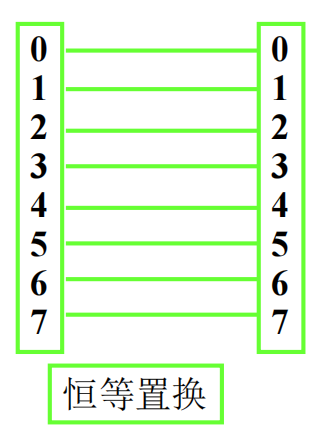 |
| **交换置换**     | 实现二进制地址编号中**第0位**位置不同的输入端和输出端之间的连接 (相邻奇偶交换) | $EX(p_{n-1} p_{n-2}…p_1 p_0)=\\p_{n-1} p_{n-2}…p_1\textcolor{red}{\overline{p_0}}$ |                                                              |
| **立方体置换**   | 实现二进制地址编号中的 第 i 位位置不同的输入端和输出端之间的连接 | $Cube_i (p_{n-1}p_{n-2}...p_i... p_1 p_0 )=\\p_{n-1}p_{n-2}...\textcolor{red}{\overline{p_i}}... p_1 p_0 $ |                                                              |
| **全混洗置换**   | 输入端的二进制地址循环左移1位                                | $Sh(p_{n-1} p_{n-2}…p_1 p_0)=\\p_{n-2}…p_1p_0\textcolor{red}{p_{n-1}}$ |                                                              |
| **加减2^i^置换** | 将输入端数组循环移动2^i^的位置向输出端传送                   | $PM_{+i}(x) = (x+2^i)mod\ N\\PM_{-i}(x) = (x-2_i)mod\ N$     |                                                              |

### 4.3.3 基本的单级互连网络

#### 立方体单级网络（交换互连网络）

立方体的每一个顶点，代表一个处理单元，共8个处理单元，用 Z Y X 三位二进制代码来表示。

立方体单级网络有 3 种互联函数: 

- $Cube: (Z(b_2)\ Y(b_1)\ X(b_0))\\\begin{array}{cc}\mathrm{X:}&\mathrm{Cube_{0}=(b_{2}b_{1}\overline{{b_{0}}})~}\\\mathrm{Y:}&\mathrm{Cube_{1}=(b_{2}\overline{b_{1}}{b_{0}})~}\\\mathrm{Z:}&\mathrm{Cube_{2}=(\overline{{b_{2}}}b_{1}b_{0})~}\end{array}$ 
- 连接线的两端上的编码，对应于相应方向的位置（1位）取反，其余不变

#### PM2I单级网络（循环移数网络）

出端编码与连接的入端结点编码相差$2^i$

互连函数: $PM2_{+i} = (j+2^i)mod\ N\\
PM2_{-i} = (j-2^i)mod\ N$ 

- 共有**2n种**互连函数(n=logN)

#### 混洗交换单级网络

> 由混洗函数和交换函数组成

1. ==全混洗互连函数==（shuffle）：$Shuffle(b_{n-1}b_{n-2}…b_1b_0)=(b_{n-2}…b_1b_0b_{n-1})$；
   - 把$b_{n-1}$移到$b_0$处
   - 以N=8为例
     
   - 存在问题: 全0和全1结点无法和其他节点产生关联

2. **交换互连函数**: 使用最简单的$Cube_0$函数, 即$Exchange(b_{n-1}b_{n-2}…b_1b_0) = (b_{n-1}b_{n-2}…b_1\overline{b_0})$ 
   - *为了让节点0(b000)和节点7(b111)与其他节点连接*
3. **混洗交换互连函数**: $Exchange(Shuffle(b_{n-1}b_{n-2}…b_1b_0)) = (b_{n-2}…b_1b_0\overline{b_{n-1}})$ 
   - 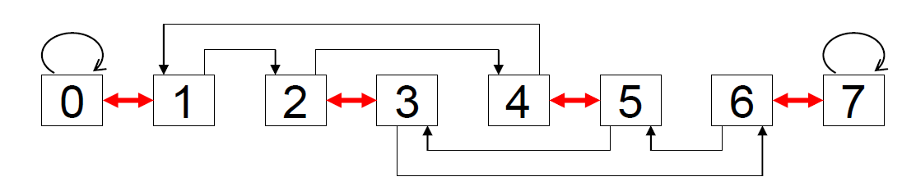 

> 单级互联网络小结: 
> 任一单级互连网络均可表示成N 入 N 出 的过程。
>
> 1. 单级互连网络特性
>    - 任一单级互连网络可实现部分结点一对或几对间的连接，不能实现**任意多对**结点间的同时连接 。
>    - **单级互连网络含义**：某些连接方法或拓扑结构。
> 2. 单级互连网络应用
>    - 利用单级互连网络的特性作为实际
>    - ICN 的拓扑结构；通过交换开关作为ICN的可变因素；
>    - 通过交换开关多次控制实现ICN的结点间任意互连。

### 4.3.4 基本的多级互连网络

目标：

- 完成某结点与其它任一结点的连接；
- 同时完成多对结点的连接。

方法：

- 从时间性和空间性方面开发。

#### 循环互连网络（时间性）

组成：$DTR_{in} 、 DTR_{out} 、 MUX 、 IN$ 。
结构：一个单级ICN+MUX 。
特点：节省了设备，增加了时间，每个MUX 可单独控制。

#### 多级互连网络（空间性）

1. 不同的**多级互连网络**反映在所采用的交换开关, 拓扑结构和控制方式上有所不同 。
2. ==(二元)交换开关==：是具有**两个入端和两个出端**的交换单元 。用作各种多级互连网络的基本构件。
   -  
   -  
3. ==拓扑结构==：
   - 不同级开关间连接方式(单级 CIN 的连接功能)，即**各级之间出端和入端相互连接**的模式。
4. ==控制方式==：
   - 级控制：同级交换开关使用同一个控制信号控制。
   - 单元级控制：每个交换开关分别控制。
   - 部分级控制：第i级使用第i+1个控制信号控制。

#### 多级立方体网络 ※

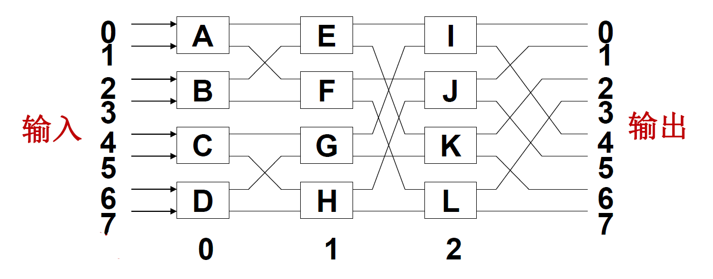

- 交换开关：二功能(直通 和 交换)
- 拓扑结构：
  - 当第i级交换开关处于交换功能时，该多级网络实现的是$Cube_i (第i位取反)$ 互连函数；
  - 对于第i级和第i+1级之间， 把$2^{i+1}$个开关分为**一组**， 组内采用**蝶式变换**。

- 根据**控制方式**不同，多级立方体网络有**STARAN网络**和**间接二进制n立方体网络**两种。
   1. STARAN 网络： 级控制和部分级控制
      - STARAN网络根据控制方式不同可以实现不同的功能： **交换功能** 和 **移数功能**
   2. 间接二进制n立方体网络： 单元控制

##### 交换功能

1. 控制方式： 级控制
   - 控制信号(对某一级的开关)
     - 1 ：开关实现 交换 功能
     - 0 ：开关实现 直通 功能
2. 交换功能： 组间次序不变，组内元素镜像。
   - 所谓交换(函数 )，是将一组元素**首尾对称**地进行交换

3. 应用： 对集中式处理机同时数据传输作用很大。

##### 移数功能

1. 控制：部分级控制 （第 i 级有 i+1 种控制信号）
2. 功能：控制信号不同，功能不同。
   - 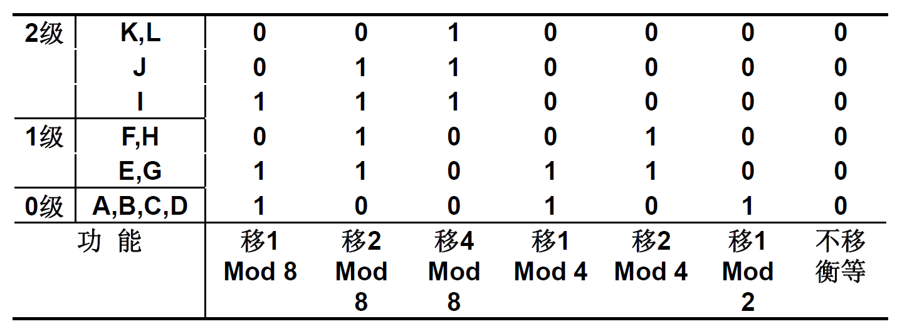

3. 应用：
   - 移数功能很适合于累加求和算法实现；
   - 不同的Mod ，可用作不同的分组操作。

#### 多级混洗交换网络(ω网络)

交换开关：四功能 （允许实现一对多的连接
拓扑结构：不同级相同， 均为全混洗 结构；
控制方式：级控制、部分级控制、单元控制；
连接图：第 n-1 级靠近入端；

功能：

- 若为级控制且开关为二功能：是STARAN 交换网络的逆网络；（F 、 G 交换位置）
- 部分级控制且开关为二功能：是STARAN 移数网络的逆网络；
- 单元控制：可实现更强大的功能。
  - 利用交换开关的播送功能实现一对多的连接。
- 典型应用：恒等置换、移数置换等各种函数的变形置换； 可完成数组按行、列、对角线、子块等无冲突访问

## 4.4 并行存储器无冲突访问

1. 访问需求
   1. 并行存取向量中各分量信息；
   2. 可按行、列、对角线等方法存取
   3. 步长不一致 。
2. 存在问题
   1. 存储器带宽限制: 存储器带宽达不到向量带宽；
   2. 访存方式: 步长不同，产生访存冲突。
3. 解决方法
   1. **采用多体交叉存储器**: 增加 MEM 带宽
   2. **对向量分组操作**: 解决MEM带宽小于向量带宽问题
   3. **选择适当的存储体数m达到无冲突访问**

**一维向量**：顺序存放，防止步长与 m 成比例；

- **存储体个数m**取质数，且与步长互质。

**多维向量**：错位存放，满足行、列、对角线等方式；

- 当m 大于每次访问向量元素个数时，
- $m=2^{2P}+1, \delta_1{=}2^P$, 同一列不同行错开距离
  $\delta_{2}=1$, 同一行不同列错开距离
- 对二维元素$A_{ab}$: 
  - 放置的体号$j=(\delta_1a + \delta_2b+ C)mod\ m$ 
    - C = $A_{00}$的体号地址
  - 体内序号$i=a$ 

# 第5章 多处理机

## 5.1 多处理机概述

### 5.1.1 多处理机的基本概念

1. ==多处理机系统==是指有两台以上的处理机，共享I/O子系统，机间经共享主存或高速通信网络通信，在操作系统的控制之下，协同求解大而复杂问题的计算机系统。
   - 多处理机系统采用**资源共享**的技术途径，提高并行处理能力(作业, 任务级并行)，属于**多指令流多数据流（MIMD）**

2. 多处理机相较于 阵列处理机
   - **并行性级别**: 作业、任务级，更高
   - **硬件结构**: 多个处理器要用多个指令部件控制
   - **算法实现**: 进一步挖掘更多隐含的并行性
   - **系统管理**: 更多依靠操作系统等软件手段
3. 多处理机优势: 
   - 性价比高
   - 可靠性高: 多个相同构件, 有冗余
   - 处理速度高: 单处理机CPU频率不能再提高, 运行速度受限, 多处理机通过并行提高运行速度
   - 模块化
4. 多处理机需要解决的问题
   - **处理机–存储器–IO的互连**:  多处理机系统的处理机多，机间通信的模式多样、灵活、不规则，所以硬件结构的实现，是首要的问题
   - **多处理机各级的并行**: 通过指令内部向量、数组的并行，指令之间作业、任务、程序段，以及算法、程序语言、编译、操作系统等的全面并行
   - **任务的合理划分**
   - 任务和进程间的同步
   - 资源调度和任务分配
   - 现场切换

### 5.1.2 多处理机的硬件结构

#### 紧耦合与松耦合

##### 紧耦合多处理机

- 特点: 通过共享主存实现机间通讯 (通信速度就受限于主存)
  - 
- 系统属性：
  - 同构or异构: PE 类型相同or不同；
  - 对称or非对称 每个 PE 与部分or全部的 I/O 通道连接。
- 常见结构：同构对称式 和 异构非对称式 多机系统。
- 限制：PE 数量不能很多。 为什么？
  - 主存带宽、IN 带宽、同步开销限制了 PE 的数量。
- 访存冲突解决方案：
  - 采取多体交叉访问方式，增加PEM 数量；
  - 每个PE 自带小容量局部存储器，存放核心代码、OS 表格等，减少 PE 访存次数；
  - 每个PE 自带一个 Cache ，减少 PE 访存次数。

##### 松耦合多处理机

1. ==松耦合多处理机==: 每一台处理机都有容量较大的局部存储器，用于存储经常用的数据和指令，减少访存冲突，不同处理机间或者通过**通道互连** / **消息传送系统（MTS）**实现通信。 
2. 松耦合多处理机较适合做粗粒度的并行计算 。
   - 作业可被分为若干个相对独立的任务, 任务间信息流量较少, 则可在多个处理机上并行执行, 
     即松耦合度的多处理机系统有效 。
3. 特点：
   - 通过消息传送系统实现机间通讯；
     - 
     - 每个模块是一个独立的处理机，整个系统可看成是一个分布系统。
   - 互连网络：MTS 有总线、环形、多级网络等种类；
   - 结构：有**层次**和**非层次**两种结构。

#### 机间互联方式

> 总线形式 
> 环形互连形式 
> 交叉开关形式 
> 多端口存储器形式
> 蠕虫穿洞寻径网络
> 开关枢纽结构形式 

##### 总线形式

1. PE、 PEM 、 I/O 通道均连在总线上，采用分时或多路转换技术实现数据传递，是最简单的连接方式。
2. 总线仲裁算法：
   - 静态优先级算法、平等算法、动态优先级算法、先来先服务算法等。
   - 对外设一般采用优先级算法；对PE 采用均等算法。
3. 实现方法：
   - 集中式：由总线控制器控制；
   - 分布式：中机构分散到各PE 中。
4. 提高总线效率方法：
   - 改善传输介质和增加总线数量。
   - 总线互连方式不适宜连接过多的处理机。

##### 环形互连形式

为保持总线式互连的优点，同时又能克服其不足，可以考虑构造一种逻辑总线 ，让各台处理机之间点点相连成环状，称==环形互连==

##### 交叉开关形式 (空间分配)

==交叉开关方式==是总线形式的一个极端，**总线数=PE 数 +PEM 数 +I/O 通道数**，是一种全相联形式，控制、仲裁、转换机构均在开关中。

- 通常: PEM数 >= PE数+I/O

改进：用一系列较小开关串联或并联，形成多级交叉开关，减少其复杂性。

交叉开关方式不适宜连接过多的处理机。

##### 多端口存储器形式

将控制、仲裁、转换机构移到存储器中。
每个端口与一个PE 或 I/O 通道相连。

多端口存储器形式不适宜连接过多的处理机。

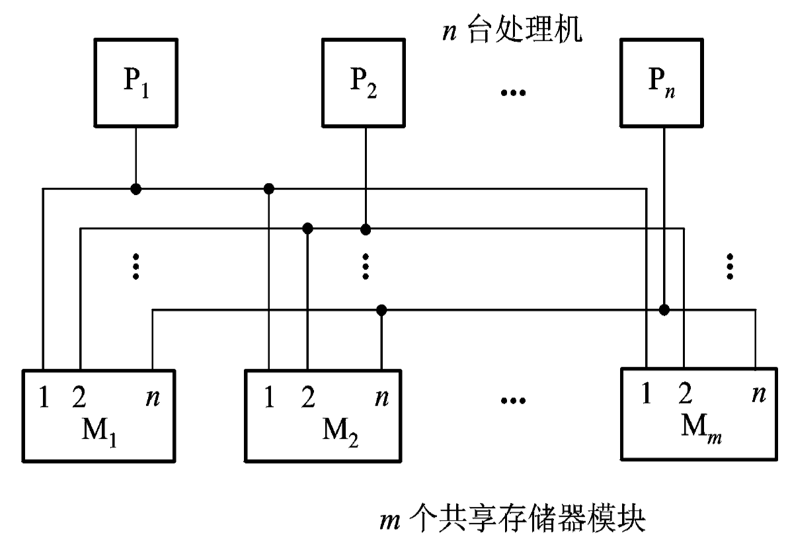

## 5.2 缓存一致性

### 5.2.1 什么是缓存一致性

Cache的一致性问题：保证同一数据块在不同Cache以及主存中的多个副本的一致性

**进程迁移引起数据不一致性**

- 多处理机中允许将未完成的进程挂起，调度到另一处理机上执行。进程的迁移可能造成最近修改过的信息只保留在原处理机的 Cache 中，迁移后则不能正确恢复

**I/O 传输 造成的数据不一致性**

- 系统中发生部分绕过 Cache 的 I/O 操作，可能形成主存内容与 Cache 内容的不一致

如果一个存储器满足以下3 点，则称该**存储器是一致**的 。

- 处理器 P 对单元 X 进行一次写之后又对单元 X 进行读，读和写之间没有其他处理器对单元 X 进行写，则 P 读到的值总是前面写进去的值。
- 处理器 P 对单元 X 进行写之后，另一处理器 Q 对单元 X 进行读，读和写之间没有其他写，则 Q 读到的值应该是 P 写进去的值。
- 对同一单元的写是顺序化的，即任意两个处理器对同一单元的两次写，从各个处理器的角度看顺序都是相同的。

### 5.2.2 缓存一致性解决方法

1. 解决进程迁移引起的 Cache 不一致性
   - 禁止迁移
   - 触发写回主存: 进程挂起时，将该进程改写过的块写回主存
2. 以硬件为基础实现多 Cache 一致性
   - 监视/监听法 (Snoopying)
   - 目录表法 (Directory)
   - **关键**：跟踪记录共享数据块的状态

#### 监视法

**适用结构**：总线型互连的多处理机
**基本思想**：利用**总线播送**更改主存的情况，各个Cache 控制器通过 监听总线 来判断它们是否有总线上请求的数据块。
**写作废协议**

- 当一个处理器对某数据项进行写入时, 通过广播使其他 Cache 中所有对应该数据项的副本**作废** 。

**写更新协议**

- 当一个处理器对某数据项进行写入时, 通过广播使其他 Cache 中所有对应于该数据项的副本进行**更新** 。

写更新和写作废协议**性能差距**主要来自：

- 在对同一个数据进行多次写操作而中间无读操作的情况下
  - 写更新协议需进行**多次写广播**操作
  - 写作废协议只需**一次作废**操作 。
- 在对同一Cache 块的**多个字**进行写操作的情况下
  - 写更新协议对于每一个写操作都要进行 一次广播
  - 写作废协议仅在对该块的**第一次写**时进行作废操作即可 。
- 写作废是针对 Cache 块进行操作
  写更新则是针对字或字节进行

#### 目录法

==目录==：一种专用的数据结构用于记录可以进入Cache 的每个数据块的状态 、 哪些处理器有该块的副本 以及 是否修改过 等信息

**适用结构**：非总线型互连的多处理机

**基本思想**：根据目录表，一个处理机在写入自身Cache 的同时，只需 有选择地通知其他存有此数据块的 Cache 将副本作废或更新。

分类

- 全映像目录表
- 有限目录表法
- 链式目录表法

#### 基于软件实现

**基本思想**：不允许要共享的可写数据进入 Cache

- 任意时刻均不允许共享的可写数据进入Cache, 只留在主存中
- 通过编译分析后, **只在实际有写入操作会影响一致性的时间内**不允许进入主存

## 5.3 多处理机的并行

### 5.3.1 并行算法

#### 并行算法的定义和分类

并行算法是指可同时执行的多个进程 的集合，各进程可以相互作用, 协调和并发处理

按并行进程间的操作顺序不同并行算法又分同步型、异步型和独立型三种 。

- **同步型**：各进程间由于相关, 必须顺次等待 。
- **异步型**：各进程间执行相互独立, 根据执行情况决定中止或继续 。
- **独立型**：各进程间完全独立, 不需要相互通信 。

根据各处理机 计算任务的大小 即任务粒度 不同 并行算法又分 细粒度 、 中粒度 和 粗粒度 三种 。

- **细粒度**： 向量或循环级的并行
- **中粒度**：较大的循环级并行 并确保这种并行的好处可以补偿因并行带来的额外开销 。
- **粗粒度**：子任务级的并行 。

此外, 用同构性来表示并行的各进程间的相似度 。

- MIMD系统上运行的进程： **异构性**
- SIMD系统上运行的进程：**同构性**

#### 多处理机并行算法的设计思路

将大程序分解为 若干可并行处理的过程 。

把**每个过程**看做一个**节点** ，将过程间的**关系**用节点组成的树

- $例: E_1=a+b*x+c*Y = (a) + ((b*x)+(c*Y))$

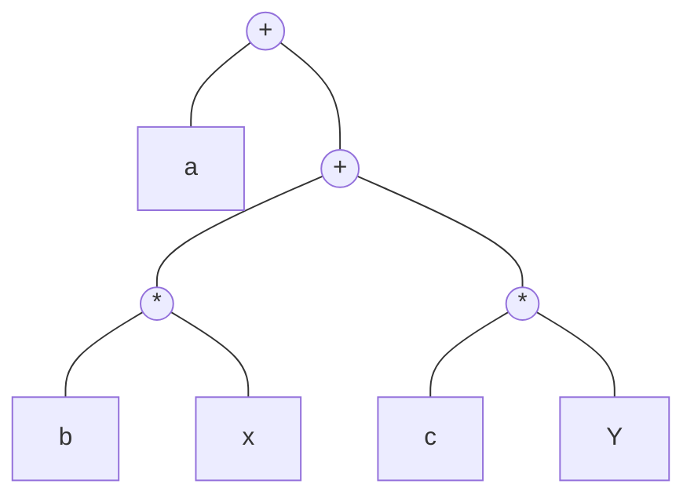

**并行算法评价指标**

- $P$: 可并行处理的处理机机数；
- $T_P$: P 台处理机运算的级数, 即树高
- **$S_P$ 加速比**: 表示单处理机顺序运算的级数$T_1$与P 台处理机并行运算的级数$T_P$之比；
  - $S_P=T_1/T_P$
- $E_P$: P 台处理机的设备利用率(效率)
  - $ E_P = S_P /P$

树的设计目标：又“矮”又“瘦”

- 矮: 算法速度快(步骤少)
- 瘦: 使用资源少(用到的计算单元少)

**例$E_1=a+b · x+c · x · x+d · x · x · x$**

**例: $E_2=a+b(c+def+ g)+ h$**

P=1: $E_2 = (efd+c+g)*b+a+h$ 

P=2: $E_2=(a+h)+b((c+g)+def)$

$E_2 = (a+h)+(bc+bg)+bdef$

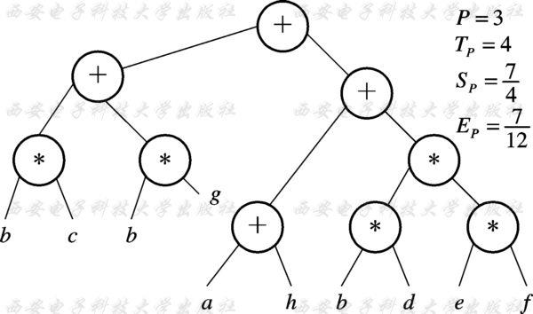

- 将`a+h`移动到最底层, 而非倒数第二层, 可以减小树宽

$Z = a+bcd(e+gh)+i(k+l)$

串行算法的树形流程图(P=1), 求运算级数

并行算法的树形流程图, 运算级数$T_P$, 处理机个数$P$

