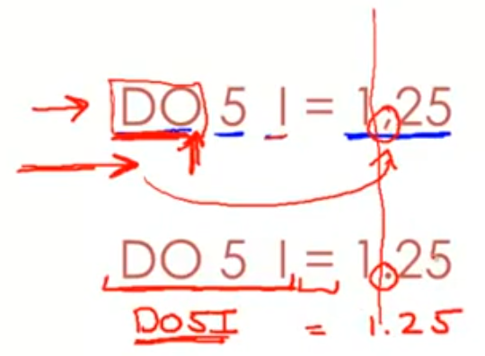
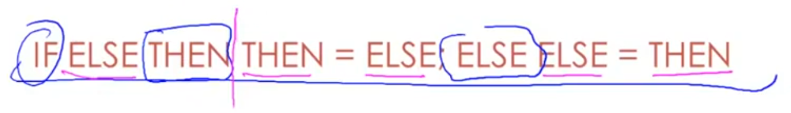
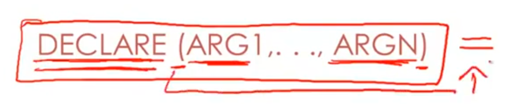
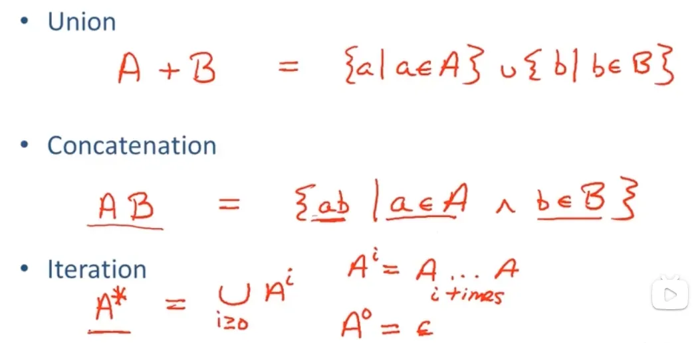
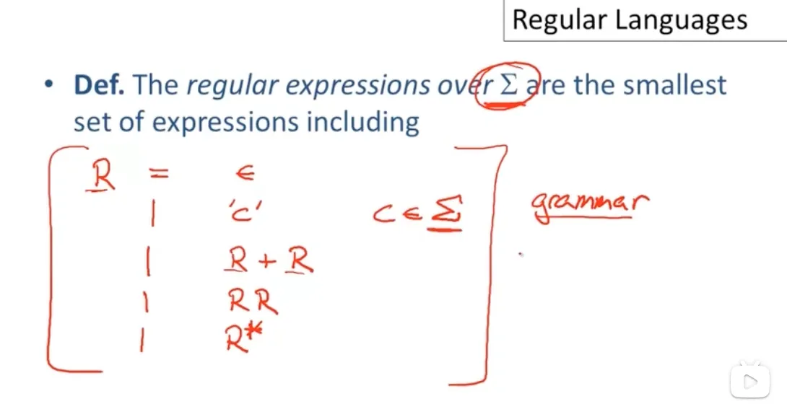

> P1 01-01-_Introduction
> P2 01-02-_Structure_of_a_Compiler
> P3 01-03-_The_Economy_of_Programming_Languages

## 2. Cool语言

### 2.1 Cool Overview

> P4 02-01-_Cool_Overview

1. ==COOL==: Classroom Object Oriented Language, 专门用于编译器教学的语言
2. Cool特性: 
   - 抽象
   - 静态
   - 重用(通过继承)
   - 自动内存管理
   - …
3. 课程目的: 将Cool编译为MIPS (或许能改造成RISC-V?)
4. PA
   1. Cool语言编程: 写一个解释器
   2. 词法分析
   3. 语法分析
   4. 语义分析
   5. 代码生成
   6. TODO: 优化

### 2.2 Cool Sample

Hello World

```java
class Main {
    // 声明i为IO类型, 并初始化
	i : IO <- new IO; 
	main():Int {{
        i.out_string("Hello World\n"); 
        1;}
    };
};
    
class Main {
    // 声明i为IO类型, 并初始化
	i : IO <- new IO; 
	main():Object { //or 声明返回IO
        i.out_string("Hello World\n"); 
    };
};

class Main {
	main():Object {
        (new IO).out_string("Hello World\n"); 
    };
};

class Main inherits IO { // 继承IO
	main():Object { 
        // self.out_string("Hello World\n"); 
        out_string("Hello World\n"); 
    };
};
```

> P5 02-02-_Cool_Example_II

  

> P6 02-03-_Cool_Example_III

## 3. 词法分析器Lexical Analysis

### 3.1 词法分析概述

> P7 03-01-_Lexical_Analysis

```c
    if (i == j)
        z = 0;
    else
        z = 1;
```

对于词法分析器, 它接收的是线性的文件中的字节

```
\tif (i == j)\n\t\tz = 0;\n\telse\b\t\tz = 1;
```

**词法分析器的任务**

1. 识别子字符串Token(Lexemes词元)
2. 为Token进行分类class
   - Identifier, Keywords, Num, 语法单元(如`(`, `)`)
   - 输出: 一个Token:  `<Token class, lexemes>`

**Token的类别**

- Identifier标识符: 字母or数字组成的字符串, 以字母开头
- Integer, number: 一个非空的数字字符串(可以试0001, 0000)
- Keyword: `else`, `if`, `begin`
- operators: 操作符
- Whitespace: 空格, 换行, tab

### 3.2 词法分析示例

> P8 03-02-_Lexical_Analysis_Examples

**设计 lexical 规则时，很重要的目标之一就是，尽可能少的 lookahead。**

**实现方式:**

1. 从左到右扫描源码的文本
2. 需要lookahead, 但是为了减少复杂度, 需要尽可能地减少lookahead

  **一些典型例子**

1. 正面：变量名不能以数字开头，减少了 lookahead。
2. 反面：`==` 和 `=`，必须 lookahead 才能区分。不是一个很好的 grammar 设计。

**FORTRAN SAMPLE**

来自fortran 的奇葩例子，需要很长的 lookahead。

- > 背景：Fortran 里面，空格是没有意义的。
  > 即，可以删了所有空格再分析代码。

1. 代码上，2 行的区别是 1, 25 和 1. 25。语义上，完全不一样。
   
2. 前者，是一个 loop，从 1 循环倒 25.
3. 后者，声明了一个变量 do5I，并赋值 1.25

**PL/1 SAMPLE**

> PL/1: Programing Language 1, IBM开发的语言
>
> PL/1的关键字**不是保留字**, 即可以用关键字来命名变量

1. 
   - 扫描到竖线时, 还需要看这堆表达式是什么
2. 
   - DECLARE可能是关键字or数组引用, 具体是哪个要看后面是否有赋值
   - 但同时, 参数列表不等长, 需要lookahead的长度无限

**C++ SAMPLE**

C++模板语法: `Foo<BAR>`
C++流语法: `cin>>var`

- 当模板嵌套时, `Foo<Bar<Bazz>>`, `>>`可能会被视为流操作符


### 3.3 正则语言

> P9 03-03-_Regular_Languages

1. 基本理解：
   1. Lexical structure = token classes
   2. 用**正则语言**描述每个 token classes 包含哪些(哪种)字符串。
2. 基本语法
   - 单字符: `‘c’ = {"C"}`
   - 空串: `ε={""}`, 包含一个空字符串的集合, 并不是$\empty$ 
   - 
     - 我们学的
       
   - 将上述5种组合起来, 就构成了grammer的最小定义
   - 
     - 其中∑不是求和, 是语言的alphabet, 语言可用的所有字符
3. 

> P10 03-04-_Formal_Languages

  

> P11 03-05-_Lexical_Specifications

  

> P12 04-01-_Lexical_Specification

  

> P13 04-02-_Finite_Automata

  

> P14 04-03-_Regular_Expressions_into_NFAs

  

> P15 04-04-_NFA_to_DFA

  

> P1604-05-_Implementing_Finite_Automata

  

> P1705-01-_Introduction_to_Parsing

  

> P1805-02-_Context_Free_Grammars

  

> P1905-03-_Derivations

  

> P2005-04-_Ambiguity

  

> P2106-01-_Error_Handling

  

> P2206-02-_Abstract_Syntax_Trees

  

> P2306-03-_Recursive_Descent_Parsing

  

> P2406-04-_Recursive_Descent_Algorithm

  

> P2506-04-1-_Recursive_Descent_Limitations

  

> P2606-05-_Left_Recursion

  

> P2707-01-_Predictive_Parsing

  

> P2807-02-_First_Sets

  

> P2907-03-_Follow_Sets

  

> P3007-04-_LL1_Parsing_Tables

  

> P3107-05-_Bottom-Up_Parsing

  

> P3207-06-(黑羽の天使翼已校对）_Shift-Reduce_Parsing

  

> P3308-01-_Handles

  

> P3408-02-_Recognizing_Handles

  

> P3508-03-_Recognizing_Viable_Prefixes

  

> P3608-04-_Valid_Items

  

> P3708-05-_SLR_Parsing

  

> P3808-06-_SLR_Parsing_Example

  

> P3908-07-_SLR_Improvements

  

> P4008-08-_SLR_Examples

  

> P4109_09-09-_Implementing_Type_Checking

  

> P4209-01-_Introduction_to_Semantic_Analysis

  

> P4309-02-_Scope

  

> P4409-03-_Symbol_Tables

  

> P4509-04-_Types

  

> P4609-05-_Type_Checking

  

> P4709-06-_Type_Environments

  

> P4809-07-_Subtyping

  

> P4909-08-_Typing_Methods

  

> P5010-01-_Static_vs._Dynamic_Typing

  

> P5110-02-_Self_Type

  

> P5210-03-_Self_Type_Operations

  

> P5310-04-_Self_Type_Usage

  

> P5410-05-_Self_Type_Checking

  

> P5510-06-_Error_Recovery

  

> P5611-01-_Runtime_Organization

  

> P5711-02-_Activations

  

> P5811-03-_Activation_Records

  

> P5911-04-_Globals_and_Heap

  

> P6011-05-_Alignment

  

> P6111-06-_Stack_Machines

  

> P6212-01-_Introduction_to_Code_Generation

  

> P6312-02-_Code_Generation_I

  

> P6412-03-_Code_Generation_II

  

> P6512-04-_Code_Generation_Example

  

> P6612-05-_Temporaries

  

> P6712-06-_Object_Layout

  

> P6813-01-_Semantics_Overview

  

> P6913-02-_Operational_Semantics

  

> P7013-03-_Cool_Semantics_I

  

> P7113-04-_Cool_Semantics_II

  

> P7214-01-_Intermediate_Code

  

> P7314-02-_Optimization_Overview

  

> P7414-03-_Local_Optimization

  

> P7514-04-_Peephole_Optimization

  

> P7615-01-_Dataflow_Analysis

  

> P7715-02-_Constant_Propagation

  

> P7815-03-_Analysis_of_Loops

  

> P7915-04-_Orderings

  

> P8015-05-_Liveness_Analysis

  

> P8116-01-_Register_Allocation

  

> P8216-02-_Graph_Coloring

  

> P8316-03-_Spilling

  

> P8416-04-_Managing_Caches

  

> P8517-01-_Automatic_Memory_Management

  

> P8617-02-_Mark_and_Sweep

  

> P8717-03-_Stop_and_Copy

  

> P8817-04-_Conservative_Collection

  

> P8917-05-_Reference_Counting

  

> P9018-01-_Java

  

> P9118-02-_Java_Arrays

  

> P9218-03-_Java_Exceptions

  

> P9318-04-_Java_Interfaces

  

> P9418-05-_Java_Coercions

  

> P9518-06-_Java_Threads

  

> P9618-07-_Other_Topics

  

> P97DeduceIt_Demo

  