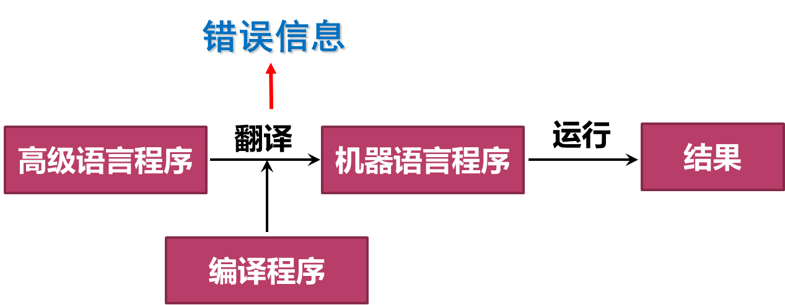
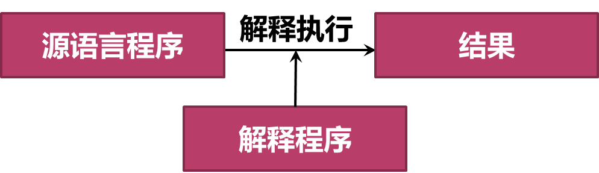
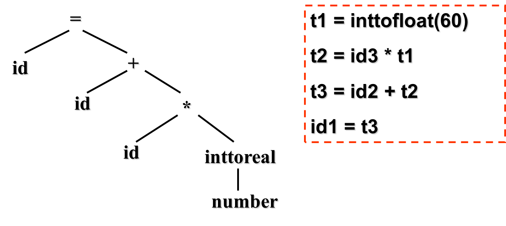

# 第一章 引论

## 1.1 什么是编译程序

#### 常见的程序

==翻译程序==(Translator)：把某一种语言程序(源语言程序)，翻译成等价的、用另一种语言编写的程序(目标语言程序)的程序，同时报告源程序中的错误。

==编译程序==(compiler)： 把某一种高级语言程序等价地转换成另一种低级语言程序(如**汇编语言或机器语言**程序)的程序。(c, c++)

==解释程序==：把源语言写的源程序作为输入，但不产生目标程序，而是边解释边执行源程序本身。(python)

反编译器(decompiler)：进行编译器的反向操作，把一个程序由较低的抽象形式（机器可读）转成较高的抽象形式（人工可读）。
源语言为低级语言，目标语言为高级语言。
源到源的翻译器：把一种高级语言翻译成为另一种高级语言。

## 1.2 为什么要学习编译原理

## 1.3 编译程序的结构

编译器由两个部分组成
==分析部分（前端）==：将源程序分解成中间表示。若分析过程检查出源程序没有按照正确的语法构成，或语义上不一致，它必须提供有用的信息，使用户可以进行改正。分析部分还会收集有关信息，信息存放在符号表中。

==综合部分/合成部分（后端）==：根据中间表示和符号表信息来构建目标程序。

 

注意: 

- 每个过程都可能出现错误
- 在最开始时就需要实现**符号管理表** 

### 编译流程

#### ①==词法分析==

1. 任务：从左到右扫描源程序的字符流，识别出==词素==（lexeme），并将其抽象成==词法单元==（token）`<种别码，属性值>`

   - **分词**

2. 遵循的原则：构词规则

   - | 单词类型 | 种别                                                         | 种别码               |
     | -------- | ------------------------------------------------------------ | -------------------- |
     | 关键     | program、if、else、then、…                                   | 一词一码             |
     | 标识符   | 变量名、数组名、记录名、过程名、…                            | **多词一码**         |
     | 常量     | 整型、浮点型、字符型、布尔型、…                              | 一型一码             |
     | 运算符   | 算术（  + - * /   ++ -- ）   关系（ >   <  ==  !=  >=  <= ）   逻辑（  &   \|  ~ ） | 一词一码 或 一型一码 |
     | 界限符   | ;  (   ) =  { } …                                            | 一词一码             |

3. 描述工具：有穷自动机

4. 例: 赋值语句

   -  
   - 
   - **空白，换行等将被忽略**

#### ②==语法分析==

1. 任务:根据语言的语法规则，从词法分析器输出的token序列中识别出==各类短语（语法单位）==，并构造==语法分析树(parse tree)==。
2. 语法分析树描述了句子的语法结构,通过语法分析确定整个输入串是否构成一个语法上正确的程序。
3. 遵循的原则：语法规则
4. 描述工具：**上下文无关文法**
5. 例
   - 
   - 树是基于语言的文法来构建的
   - 

#### ③==语义分析==

1. 任务:
   - 语义检查：使用**语法树和符号表**中的信息来检查源程序是否和语言定义的语义一致。
   - 收集标识符的属性信息（种属、类型、长度等），将信息存放在语法树或符号表中。
   - **类型检查**是一个重要组成部分，它检查每个运算符是否具有匹配的运算分量。
   - 发现语义错误，并支持代码生成
2. 输出为==注释树==：分析树被标记上语义动作
   -  
3. 

#### ④==中间代码生成== END

> 常被包括到语义分析中
>
> 本次课只介绍到这里

1. 任务:对各类语法单位按语言的**语义**进行初步翻译。中间代码应易于生成，且容易被翻译成目标机器的语言。

2. 遵循的原则：语义规则

3. 描述工具：属性文法

4. 中间代码：三元式、四元式、树等

5. 例: 三地址指令：由类似于汇编语言的指令序列组成每个指令最多有三个操作数

   - 

6. 常用的三地址指令及其四元式表示

   - | 序号 | 指令类型         | 指令形式                      | 四元式                                                       |
     | ---- | ---------------- | ----------------------------- | ------------------------------------------------------------ |
     | 1    | 赋值指令         | x = y op z     x = op y       | (  op  , y , z   , x  )  (  op  , y , _ , x )                |
     | 2    | 复制指令         | x = y                         | (   = , y   , _ , x )                                        |
     | 3    | 条件跳转         | if x relop y goto n           | (  relop  , x   , y   ,   n )                                |
     | 4    | 非条件跳转       | goto n                        | (  goto  , _ , _  , n  )                                     |
     | 5    | 参数传递         | param x                       | (param, _ , _  , x  )                                        |
     | 6    | 过程调用         | call p, n                     | (call,  p , n , _  )                                         |
     | 7    | 过程返回         | return   x                    | (  return, _  , _  ,  x  )                                   |
     | 8    | 数组引用         | x = y[i]                      | (  =[]  ,   y , i  ,   x  )                                  |
     | 9    | 数组赋值         | x[i] = y                      | (  []=  ,   y , x  ,   i  )                                  |
     | 10   | 地址及  指针操作 | x =& y     x =\* y     *x = y | (  & , y  , _  ,  x  )  (  =\*  , y  , _  ,  x  )  (  *=  , y  , _  ,  x  ) |

#### ⑤优化

1. 任务：对于前阶段产生的中间代码进行加工变换，以期在最后阶段产生更高效的目标代码。
2. 遵循的原则：程序的等价变换规则，主要包括：公共子表达式的提取、循环优化、删除无用代码等等。

#### ⑥目标代码生成

1. 任务: 把中间代码变换成特定机器上的目标代码。
2. 依赖于硬件系统结构和机器指令的含义。
3. 目标代码三种形式:
   - 绝对指令代码: 可直接运行 
   - 可重新定位指令代码: 需要连接装配
   - 汇编指令代码: 需要进行汇编

### 符号表管理和错误处理

1. 符号表管理
   - 保存记号的信息（存储空间、类型、作用域）
   - 在分析、综合过程中使用/修改
   -  
     符号表是用于存放标识符的属性信息的数据结构
2. 错误处理：
   - 发现源程序中的错误，把错误信息报告给用户
   - 发现哪些错误?
     - 语法错误：非法标识符、括号不匹配……
     - 语义错误：变量未声明、类型不一致……
   - 发现错误后如何处理?

### 遍 pass

- 所谓"遍"，就是对源程序或源程序的中间结果从头到尾扫描一次，进行加工，产生新的中间结果或目标程序。
- 阶段与遍是不同的概念。一遍可以由若干阶段组成，一个阶段也可以分若干遍来完成。
- 有单遍编译器，也有多遍编译器。单遍费内存，多遍耗时间。想获取更高的优化效果一般需要多遍。

# 第2章 一个简单的语法制导翻译器

## 2.1 什么是语法制导翻译

编译器**前端**的工作(即**分析阶段**)就是将源程序划分成多个组成部分, 生成源程序的内部表示形式(==中间代码==); **后端**(即合成阶段)将中间代码翻译为目标程序

1. 编译器前端模型
   -  
2. 编译器的前端的各个阶段围绕待编译语言的“**语法**”展开。
   - 程序设计语言的**语法**描述
     - 描述语言的**正确**构成形式
     - 工具：==上下文无关文法==
   - 程序设计语言的**语义**
     - 描述语言的含义，即**功能**

### 文法描述的几个基本概念

- ==字母表==: 一个有穷字符集，记为$∑$
- ∑上的**字符**：字母表∑中每个元素
- ∑上的**字符串**：指由∑中的字符所**构成**的一个有穷字符序列 (可以重复用)
  - 字符串的长度：符号的个数， 如|aab|=3
  - 空串：不包含任何字符的序列，记为$ε$
- 用$∑^*$表示∑上的所有字符串的**全体**，包含空字ε
  - 例: 设 ∑={a， b}，则 ∑*={ε,a,b,aa,ab,ba,bb,aaa,...}

- ∑*的子集U和V的连接（积）定义为$UV＝\{ αβ | α \in U \& β\in V \} $ (笛卡尔积)
  - 例: 设 U＝{ a, aa } ，V＝ { b, bb }, 则UV ={ ab, abb, aab, aabb}
- V自身的n次积记为：$V^n=V V…V$
  - $V^0={ε}$
  - $V^*是V的克林闭包：V^*=V^0∪V^1∪V^2∪V^3∪… $
  - $V^+是V的正规闭包：V^＋＝V V^*$ 当V中没有ε时, V^+^比V^*^少一个ε
  -  

## 2.2 语法定义

==上下文无关文法==: 简称==文法==, 用于描述程序设计语言语法的表示方法, 用于组织编译器前端

### 2.2.1 文法定义

定义上下文无关文法(context-free grammer, G)为一个四元组$G(V_T, V_N, P, S)$

- $V_T$: ==终结符==(terminal)集（非空） 
  - 文法所定义的语言的基本符号的集合
  - 仅出现在**产生式**右部（体）
  - 例：VT ={ He,a,gave,book,me}
- $V_N$ ：==非终结符==(non-terminal)集（非空）
  - 表示语法成分的符号，有时也称为“ **语法变量**”
  - 在某个产生式的左部出现过的文法符号
  - 例：VN ={ <句子>,<主语>,<谓语>,......}
    程序语言中有 <语句>、<表达式>、<程序>等
  - $V_T \cap V_N = \empty;\quad V_T∪V_N = 文法符号集$

- $S$：==开始符号==(start symbol)
  - 特殊的非终结符，表示该文法中最大的语法成分
  - 例：S = <句子>
  - 两种说明方式：
    - 明确指出
    - 第1条产生式规则左部的文法符号
  - $S\in V_N$ 
- $P$：==产生式==(production)==集==
  - 也称重写规则或规则：描述语言的语法结构的形式规则
  - 一般形式： $α→β$，读作：α**定义**为β
  - α是一个**符号**，称为**左部**或**头**。$α∈V_N$
    β是**有穷符号串**，称为**右部**或**体**。$β∈(V_T∪V_N)^*$

例2-5: 定义只含`+`,`*`的算术表达式的文法

 

### 2.2.2 推导**Derivation**

- 给定文法$G(V_T, V_N, P, S)$，若$A \rightarrow γ\in P $且$α,β (V_T \cup V_N)*$ ，则文法符号串$αAβ$**可重写**为$α γ β$，记作$αAβ \Rightarrow αγβ$，称**$αAβ$直接推导**$αγβ$。

- 如果$α_1\Rightarrow α_2\Rightarrow ...\Rightarrow α_n$，则称这个序列是从$α_1到α_n$的一个**推导**。
  若存在一个从$α_1到α_n$的推导，则称$α_1$可以推导出$α_n$ 。

- 推导长度：执行一步推导的次数
  - 一步推导$\Rightarrow$
  - 1步或若干步的推导 $\Rightarrow ^+$
  - 0步或若干步的推导 $\Rightarrow^*$
    

### 2.2.3 文法和语言

文法定义的**==语言==**：从**开始符号**出发，利用推导能得到的所有**终结符号串**的集合。

- 如果$S \Rightarrow^* α，α∈(V_T∪V_N)*$，则α为文法G的句型
- 如果$S \Rightarrow^+ w$ (终结符号串)，则w为文法G的句子
- 文法G的句子集合称为==文法G生成的语言==，记为$L(G) = \{α|S\Rightarrow α, α\in V_T^*\}$

上下文无关文法生成的语言称为==上下文无关语言==

> 练2-4 请证明$ (i*i+i)$是文法$G(E)： E \rightarrow i | E+E | E*E | (E) $的一个句子。

- 证明：$E \Rightarrow (E) 
  		   \Rightarrow (E+E)
    		   \Rightarrow (E*E+E)
    		   \Rightarrow (i*E+E)
    		   \Rightarrow (i*i+E) 
    		   \Rightarrow (i*i+i)$

$(i*i+i)是文法G的句子E，(E)，(E*E+E)，…，(i*i+i)是句型。$

- 文法和语言的关系
  - 给定一个文法，就从结构上**唯一地确定**其语言
  - 给定一种语言，能确定其文法，但文法**不唯一**
- 等价文法
  - 设$G_1$和$G_2$是两个文法，若$L(G_1)=L(G_2)$，则称$G_1$与$G_2$为等价文法。

> 例2-7  设文法 $G(A)：A \rightarrow c | Ab$, G(A)产生的语言是什么？

- 以c开头，后继若干个b即 L(G)={c，cb，cbb，……}
  称为**递归文法**

> 练2-5  设文法$ G(S)：S \rightarrow AB, A \rightarrow aA|a, B \rightarrow bB|b$
> 	G(S)产生的语言是什么？

- $L(G)=\{a^mb^n|m，n>0\}$

> 例2-8  请给出产生语言为$\{a^nb^n|n\geq1\}$的文法

- 递推方法：
  - 满足条件最简单的句子是 ab $G(S): S\rightarrow ab$
  - 若S是满足条件的句子，则在S左右分别添加a和b，即$aSb$也满足条件。$S\rightarrow aSb$
- 递归方法：
  - 若S是满足条件的句子，则拿掉S开头a和结尾b也满足条件$S\rightarrow aSb$，一直到最简单的句子ab。$S\rightarrow ab$

**语法分析的任务**：输入终结符号串，找出从开始符号推导出该串的方法

例2-9 如下文法对串9-5+2的推导
$	list \Rightarrow list + digit  \Rightarrow list - digit + digit  
     	\Rightarrow digit - digit + digit  
		\Rightarrow 9 - digit + digit  
     	\Rightarrow 9 - 5 + digit   \Rightarrow 9 - 5 + 2$

### 2.2.4 语法分析树

从一个句型到一个句型的推导往往不唯一，可以以**图形方式**描述一个句子的推导过程，称为**语法分析树（简称语法树）**。

某一文法的语法树应具有以下性质：

- 根节点是**开始符号**
- 叶节点是**终结符**（ token）和 **ε**
- 内部节点（非叶结点）是**非终结符**
- 如果应用了规则$A \rightarrow x_1x_2…x_n$, 则A是内部结点;  $x_1 , x_2 , … ，x_n$是其**从左到右**的子结点（内部节点或叶节点）

### 2.2.5 二义性Ambiguous

> 例2-11 文法 $G(E)：E→i|E+E|E*E|(E) $句子$(i*i+i)$的语法树

 

**该文法是二义性文法**

==文法的二义性==：如果一个文法存在某个句子对应**两棵不同的语法树**，则说这个**文法是二义**的。

> 例2-12 证明：文法$S \rightarrow  aSbS | bSaS | ε $是二义的

证：对于串abab存在**两棵不同的分析树**：

> 例2-13 $string \Rightarrow  string + string | string – string | 0 | 1 | …| 9$

解：9-5+2存在两棵不同的分析树，是二义性文法

  造成二义性的原因：文法中没有体现出**结合率**和**优先级**

可以基于**优先级**和**结合性**构建无二义的文法

- 四则运算存在两个优先级，所以可引入两个非终结符expr和term来对应不同的运算层次
- 四则运算均为左结合，因此在每条规则中，**更为抽象**的非终结符应位于左边

