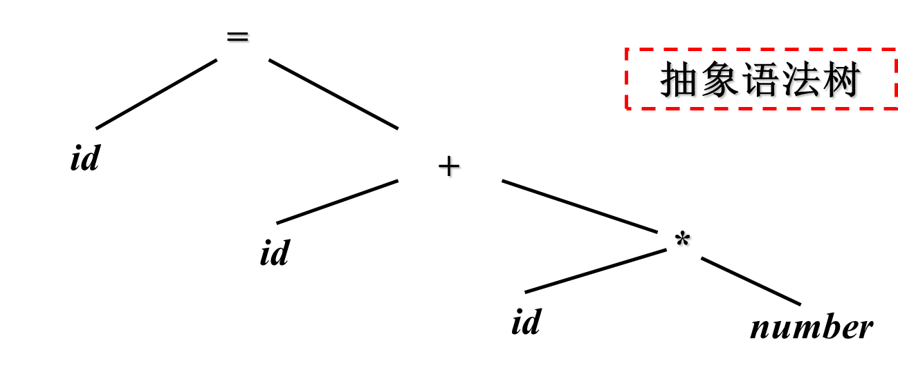

## 第一章 引论

### 1.1 什么是编译程序

#### 常见的程序

==翻译程序==(Translator)：把某一种语言程序(源语言程序)，翻译成等价的、用另一种语言编写的程序(目标语言程序)的程序，同时报告源程序中的错误。

==编译程序==(compiler)： 把某一种高级语言程序等价地转换成另一种低级语言程序(如**汇编语言或机器语言**程序)的程序。(c, c++)

==解释程序==：把源语言写的源程序作为输入，但不产生目标程序，而是边解释边执行源程序本身。(python)

反编译器(decompiler)：进行编译器的反向操作，把一个程序由较低的抽象形式（机器可读）转成较高的抽象形式（人工可读）。
源语言为低级语言，目标语言为高级语言。
源到源的翻译器：把一种高级语言翻译成为另一种高级语言。

### 1.2 为什么要学习编译原理

### 1.3 编译程序的结构

编译器由两个部分组成
==分析部分（前端）==：将源程序分解成中间表示。若分析过程检查出源程序没有按照正确的语法构成，或语义上不一致，它必须提供有用的信息，使用户可以进行改正。分析部分还会收集有关信息，信息存放在符号表中。

==综合部分（后端）==：根据中间表示和符号表信息来构建目标程序。

 

注意: 

- 每个过程都可能出现错误
- 在最开始时就需要实现**符号管理表** 

#### ①==词法分析==

1. 任务：从左到右扫描源程序的字符流，识别出==词素==（lexeme），并将其抽象成==词法单元==（token）`<种别码，属性值>`

2. 遵循的原则：构词规则

   - | 单词类型 | 种别                                                         | 种别码               |
     | -------- | ------------------------------------------------------------ | -------------------- |
     | 关键     | program、if、else、then、…                                   | 一词一码             |
     | 标识符   | 变量名、数组名、记录名、过程名、…                            | **多词一码**         |
     | 常量     | 整型、浮点型、字符型、布尔型、…                              | 一型一码             |
     | 运算符   | 算术（  + - * /   ++ -- ）   关系（ >   <  ==  !=  >=  <= ）   逻辑（  &   \|  ~ ） | 一词一码 或 一型一码 |
     | 界限符   | ;  (   ) =  { } …                                            | 一词一码             |

3. 描述工具：有穷自动机

4. 例: 赋值语句

   -  
   - 
   - **空白，换行等将被忽略**

#### ②==语法分析==

1. 任务:根据语言的语法规则，从词法分析器输出的token序列中识别出==各类短语（语法单位）==，并构造==语法分析树(parse tree)==。
2. 语法分析树描述了句子的语法结构,通过语法分析确定整个输入串是否构成一个语法上正确的程序。
3. 遵循的原则：语法规则
4. 描述工具：**上下文无关文法**
5. 例
   - 
   - 树是基于语言的文法来构建的
   - 

#### ③==语义分析==

1. 任务:
   - 语义检查：使用**语法树和符号表**中的信息来检查源程序是否和语言定义的语义一致。
   - 收集标识符的属性信息（种属、类型、长度等），将信息存放在语法树或符号表中。
   - **类型检查**是一个重要组成部分，它检查每个运算符是否具有匹配的运算分量。
   - 发现语义错误，并支持代码生成
2. 输出为==注释树==：分析树被标记上语义动作
   -  
3. 

#### ④==中间代码生成== END

> 常被包括到语义分析中
>
> 本次课只介绍到这里

1. 任务:对各类语法单位按语言的**语义**进行初步翻译。中间代码应易于生成，且容易被翻译成目标机器的语言。

2. 遵循的原则：语义规则

3. 描述工具：属性文法

4. 中间代码：三元式、四元式、树等

5. 例: 三地址指令：由类似于汇编语言的指令序列组成每个指令最多有三个操作数

   - 

6. 常用的三地址指令及其四元式表示

   - | 序号 | 指令类型         | 指令形式                      | 四元式                                                       |
     | ---- | ---------------- | ----------------------------- | ------------------------------------------------------------ |
     | 1    | 赋值指令         | x = y op z     x = op y       | (  op  , y , z   , x  )  (  op  , y , _ , x )                |
     | 2    | 复制指令         | x = y                         | (   = , y   , _ , x )                                        |
     | 3    | 条件跳转         | if x relop y goto n           | (  relop  , x   , y   ,   n )                                |
     | 4    | 非条件跳转       | goto n                        | (  goto  , _ , _  , n  )                                     |
     | 5    | 参数传递         | param x                       | (param, _ , _  , x  )                                        |
     | 6    | 过程调用         | call p, n                     | (call,  p , n , _  )                                         |
     | 7    | 过程返回         | return   x                    | (  return, _  , _  ,  x  )                                   |
     | 8    | 数组引用         | x = y[i]                      | (  =[]  ,   y , i  ,   x  )                                  |
     | 9    | 数组赋值         | x[i] = y                      | (  []=  ,   y , x  ,   i  )                                  |
     | 10   | 地址及  指针操作 | x =& y     x =\* y     *x = y | (  & , y  , _  ,  x  )  (  =\*  , y  , _  ,  x  )  (  *=  , y  , _  ,  x  ) |

#### ⑤优化

1. 任务：对于前阶段产生的中间代码进行加工变换，以期在最后阶段产生更高效的目标代码。
2. 遵循的原则：程序的等价变换规则，主要包括：公共子表达式的提取、循环优化、删除无用代码等等。

#### ⑥目标代码生成

1. 任务: 把中间代码变换成特定机器上的目标代码。
2. 依赖于硬件系统结构和机器指令的含义。
3. 目标代码三种形式:
   - 绝对指令代码: 可直接运行 
   - 可重新定位指令代码: 需要连接装配
   - 汇编指令代码: 需要进行汇编

#### 符号表管理和错误处理

1. 符号表管理
   - 保存记号的信息（存储空间、类型、作用域）
   - 在分析、综合过程中使用/修改
   -  
     符号表是用于存放标识符的属性信息的数据结构
2. 错误处理：
   - 发现源程序中的错误，把错误信息报告给用户
   - 发现哪些错误?
     - 语法错误：非法标识符、括号不匹配……
     - 语义错误：变量未声明、类型不一致……
   - 发现错误后如何处理?

#### 遍 pass

- 所谓"遍"，就是对源程序或源程序的中间结果从头到尾扫描一次，进行加工，产生新的中间结果或目标程序。
- 阶段与遍是不同的概念。一遍可以由若干阶段组成，一个阶段也可以分若干遍来完成。
- 有单遍编译器，也有多遍编译器。单遍费内存，多遍耗时间。想获取更高的优化效果一般需要多遍。