# 第一章 引论

## 1.1 什么是编译程序

#### 常见的程序

==翻译程序==(Translator)：把某一种语言程序(源语言程序)，翻译成等价的、用另一种语言编写的程序(目标语言程序)的程序，同时报告源程序中的错误。


==编译程序==(compiler)： 把某一种高级语言程序等价地转换成另一种低级语言程序(如**汇编语言或机器语言**程序)的程序。(c, c++)


==解释程序==：把源语言写的源程序作为输入，但不产生目标程序，而是边解释边执行源程序本身。(python)


反编译器(decompiler)：进行编译器的反向操作，把一个程序由较低的抽象形式（机器可读）转成较高的抽象形式（人工可读）。
源语言为低级语言，目标语言为高级语言。
源到源的翻译器：把一种高级语言翻译成为另一种高级语言。

## 1.2 为什么要学习编译原理


## 1.3 编译程序的结构

编译器由两个部分组成
==分析部分（前端）==：将源程序分解成中间表示。若分析过程检查出源程序没有按照正确的语法构成，或语义上不一致，它必须提供有用的信息，使用户可以进行改正。分析部分还会收集有关信息，信息存放在符号表中。

==综合部分/合成部分（后端）==：根据中间表示和符号表信息来构建目标程序。

 

注意: 

- 每个过程都可能出现错误
- 在最开始时就需要实现**符号管理表** 

> 早期编译器中每个流程都比较均衡
>
> 现代编译器中使用了工具, 词法(FLEX), 语法(BISON)分析环节很少, 有较长的语义分析阶段, **非常大的优化阶段**, 一个小代码生成阶段


### 编译流程

#### ①==词法分析==

1. 任务：从左到右扫描源程序的字符流，识别出==词素==（lexeme），并将其抽象成==词法单元==（token）`<种别码，属性值>`

   - **分词**

2. 遵循的原则：构词规则

   - | 单词类型 | 种别                                                         | 种别码               |
     | -------- | ------------------------------------------------------------ | -------------------- |
     | 关键     | program、if、else、then、…                                   | 一词一码             |
     | 标识符   | 变量名、数组名、记录名、过程名、…                            | **多词一码**         |
     | 常量     | 整型、浮点型、字符型、布尔型、…                              | 一型一码             |
     | 运算符   | 算术（  + - * /   ++ -- ）  <br />关系（ >   <  ==  !=  >=  <= ）  <br />逻辑（  &   \|  ~ ） | 一词一码 或 一型一码 |
     | 界限符   | ;  (   ) =  { } …                                            | 一词一码             |
     
     | 类型   | 种别  |
     | ------ | ----- |
     | 关键字 | if    |
     | 标识符 | array |
     | 标识符 | i     |
     | 运算符 | ==    |
     
     

3. 描述工具：有穷自动机

4. 例: 赋值语句

   -  
   - 
   - **空白，换行等将被忽略**

#### ②==语法分析==

1. 任务:根据语言的语法规则，从词法分析器输出的token序列中识别出==各类短语（语法单位）==，并构造==语法分析树(parse tree)==。
2. 语法分析树描述了句子的语法结构,通过语法分析确定整个输入串是否构成一个语法上正确的程序。
3. 遵循的原则：语法规则
4. 描述工具：**上下文无关文法**
5. 例
   - 
   - 树是基于语言的文法来构建的
   - 


#### ③==语义分析==

1. 任务:
   - 语义检查：使用**语法树和符号表**中的信息来检查源程序是否和语言定义的语义一致。
   - 收集标识符的属性信息（种属、类型、长度等），将信息存放在语法树或符号表中。
   - **类型检查**是一个重要组成部分，它检查每个运算符是否具有匹配的运算分量。
   - 发现语义错误，并支持代码生成
2. 输出为==注释树==：分析树被标记上语义动作
   -  
3. 

#### ④==中间代码生成== END

> 常被包括到语义分析中
>
> 本次课只介绍到这里

1. 任务:对各类语法单位按语言的**语义**进行初步翻译。中间代码应易于生成，且容易被翻译成目标机器的语言。

2. 遵循的原则：语义规则

3. 描述工具：属性文法

4. 中间代码：三元式、四元式、树等

5. 例: 三地址指令：由类似于汇编语言的指令序列组成每个指令最多有三个操作数

   - 

6. 常用的三地址指令及其四元式表示

   - | 序号 | 指令类型         | 指令形式                      | 四元式                                                       |
     | ---- | ---------------- | ----------------------------- | ------------------------------------------------------------ |
     | 1    | 赋值指令         | x = y op z     x = op y       | (  op  , y , z   , x  )  (  op  , y , _ , x )                |
     | 2    | 复制指令         | x = y                         | (   = , y   , _ , x )                                        |
     | 3    | 条件跳转         | if x relop y goto n           | (  relop  , x   , y   ,   n )                                |
     | 4    | 非条件跳转       | goto n                        | (  goto  , _ , _  , n  )                                     |
     | 5    | 参数传递         | param x                       | (param, _ , _  , x  )                                        |
     | 6    | 过程调用         | call p, n                     | (call,  p , n , _  )                                         |
     | 7    | 过程返回         | return   x                    | (  return, _  , _  ,  x  )                                   |
     | 8    | 数组引用         | x = y[i]                      | (  =[]  ,   y , i  ,   x  )                                  |
     | 9    | 数组赋值         | x[i] = y                      | (  []=  ,   y , x  ,   i  )                                  |
     | 10   | 地址及  指针操作 | x =& y     x =\* y     *x = y | (  & , y  , _  ,  x  )  (  =\*  , y  , _  ,  x  )  (  *=  , y  , _  ,  x  ) |

#### ⑤优化

1. 任务：对于前阶段产生的中间代码进行加工变换，以期在最后阶段产生更高效的目标代码。
2. 遵循的原则：程序的等价变换规则，主要包括：公共子表达式的提取、循环优化、删除无用代码等等。

#### ⑥目标代码生成

1. 任务: 把中间代码变换成特定机器上的目标代码。
2. 依赖于硬件系统结构和机器指令的含义。
3. 目标代码三种形式:
   - 绝对指令代码: 可直接运行 
   - 可重新定位指令代码: 需要连接装配
   - 汇编指令代码: 需要进行汇编


### 符号表管理和错误处理

1. 符号表管理
   - 保存记号的信息（存储空间、类型、作用域）
   - 在分析、综合过程中使用/修改
   -  
     符号表是用于存放标识符的属性信息的数据结构
2. 错误处理：
   - 发现源程序中的错误，把错误信息报告给用户
   - 发现哪些错误?
     - 语法错误：非法标识符、括号不匹配……
     - 语义错误：变量未声明、类型不一致……
   - 发现错误后如何处理?

### 遍 pass

- 所谓"遍"，就是对源程序或源程序的中间结果从头到尾扫描一次，进行加工，产生新的中间结果或目标程序。
- 阶段与遍是不同的概念。一遍可以由若干阶段组成，一个阶段也可以分若干遍来完成。
- 有单遍编译器，也有多遍编译器。单遍费内存，多遍耗时间。想获取更高的优化效果一般需要多遍。


# 第2章 一个简单的语法制导翻译器

## 2.1 什么是语法制导翻译

编译器**前端**的工作(即**分析阶段**)就是将源程序划分成多个组成部分, 生成源程序的内部表示形式(==中间代码==); **后端**(即合成阶段)将中间代码翻译为目标程序

1. 编译器前端模型
   - 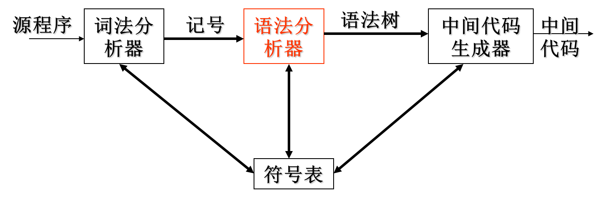 
2. 编译器的前端的各个阶段围绕待编译语言的“**语法**”展开。
   - 程序设计语言的**语法**描述
     - 描述语言的**正确**构成形式
     - 工具：==上下文无关文法==
   - 程序设计语言的**语义**
     - 描述语言的含义，即**功能**

### 文法描述的几个基本概念

- ==字母表==: 一个有穷字符集，记为$∑$
- ∑上的**字符**：字母表∑中每个元素
- ∑上的**字符串**：指由∑中的字符所**构成**的一个有穷字符序列 (可以重复用)
  - 字符串的长度：符号的个数， 如|aab|=3
  - 空串：不包含任何字符的序列，记为$ε$
- 用$∑^*$表示∑上的所有字符串的**全体**，包含空字ε
  - 例: 设 ∑={a， b}，则 ∑*={ε,a,b,aa,ab,ba,bb,aaa,...}

- ∑*的子集U和V的连接（积）定义为$UV＝\{ αβ | α \in U \& β\in V \} $ (笛卡尔积)
  - 例: 设 U＝{ a, aa } ，V＝ { b, bb }, 则UV ={ ab, abb, aab, aabb}
- V自身的n次积记为：$V^n=V V…V$
  - $V^0={ε}$
  - $V^*是V的克林闭包：V^*=V^0∪V^1∪V^2∪V^3∪… $
  - $V^+是V的正规闭包：V^＋＝V V^*$ 当V中没有ε时, V^+^比V^*^少一个ε
  -  

## 2.2 语法定义

==上下文无关文法==: 简称==文法==, 用于描述程序设计语言语法的表示方法, 用于组织编译器前端

### 2.2.1 文法定义

定义上下文无关文法(context-free grammer, G)为一个四元组$G(V_T, V_N, P, S)$

- $V_T$: ==终结符==(terminal)集（非空） 
  - 文法所定义的语言的基本符号的集合
  - 仅出现在**产生式**右部（体）
  - 例：VT ={ He,a,gave,book,me}
- $V_N$ ：==非终结符==(non-terminal)集（非空）
  - 表示语法成分的符号，有时也称为“ **语法变量**”
  - 在某个产生式的左部出现过的文法符号
  - 例：VN ={ <句子>,<主语>,<谓语>,......}
    程序语言中有 <语句>、<表达式>、<程序>等
  - $V_T \cap V_N = \empty;\quad V_T∪V_N = 文法符号集$

- $S$：==开始符号==(start symbol)
  - 特殊的非终结符，表示该文法中最大的语法成分
  - 例：S = <句子>
  - 两种说明方式：
    - 明确指出
    - 第1条产生式规则左部的文法符号
  - $S\in V_N$ 
- $P$：==产生式==(production)==集==
  - 也称重写规则或规则：描述语言的语法结构的形式规则
  - 一般形式： $α→β$，读作：α**定义**为β
  - α是一个**符号**，称为**左部**或**头**。$α∈V_N$
    β是**有穷符号串**，称为**右部**或**体**。$β∈(V_T∪V_N)^*$

例2-5: 定义只含`+`,`*`的算术表达式的文法

 

### 2.2.2 推导**Derivation**

- 给定文法$G(V_T, V_N, P, S)$，若$A \rightarrow γ\in P $且$α,β (V_T \cup V_N)*$ ，则文法符号串$αAβ$**可重写**为$α γ β$，记作$αAβ \Rightarrow αγβ$，称**$αAβ$直接推导**$αγβ$。

- 如果$α_1\Rightarrow α_2\Rightarrow ...\Rightarrow α_n$，则称这个序列是从$α_1到α_n$的一个**推导**。
  若存在一个从$α_1到α_n$的推导，则称$α_1$可以推导出$α_n$ 。


- 推导长度：执行一步推导的次数
  - 一步推导$\Rightarrow$
  - 1步或若干步的推导 $\Rightarrow ^+$
  - 0步或若干步的推导 $\Rightarrow^*$
    

### 2.2.3 文法和语言

1. 文法定义的**==语言==**：从**开始符号**出发，利用推导能得到的所有**终结符号串**的集合。

   - 如果$S \Rightarrow^* α，α∈(V_T∪V_N)*$，则α为文法G的句型

   - 如果$S \Rightarrow^+ w$ (终结符号串)，则w为文法G的句子

   - 文法G的句子集合称为==文法G生成的语言==，记为<font color = 66ccff>$L(G) = \{α|S\Rightarrow α, α\in V_T^*\}$</font>

   - 上下文无关文法生成的语言称为==上下文无关语言==

2. >  练2-4 请证明$ (i*i+i)$是文法$G(E)： E \rightarrow i | E+E | E*E | (E) $的一个句子。

   - 证明：$E \Rightarrow (E) 
     		   \Rightarrow (E+E)
           		   \Rightarrow (E*E+E)
           		   \Rightarrow (i*E+E)
           		   \Rightarrow (i*i+E) 
           		   \Rightarrow (i*i+i)$
     $(i*i+i)是文法G的句子E，(E)，(E*E+E)，…，(i*i+i)是句型。$


3. 文法和语言的关系

   - 给定一个文法，就从结构上**唯一地确定**其语言

   - 给定一种语言，能确定其文法，但文法**不唯一**

4. 等价文法
   - 设$G_1$和$G_2$是两个文法，若$L(G_1)=L(G_2)$，则称$G_1$与$G_2$为等价文法。

5. > 例2-7  设文法 $G(A)：A \rightarrow c | Ab$, G(A)产生的语言是什么？

   - 以c开头，后继若干个b即 L(G)={c，cb，cbb，……}
     称为**递归文法**

6. > 练2-5  设文法$ G(S)：S \rightarrow AB, A \rightarrow aA|a, B \rightarrow bB|b$
   > 	G(S)产生的语言是什么？

   - $L(G)=\{a^mb^n|m，n>0\}$

7. > 例2-8  请给出产生语言为$\{a^nb^n|n\geq1\}$的文法

   - 递推方法：
     - 满足条件最简单的句子是 ab $G(S): S\rightarrow ab$
     - 若S是满足条件的句子，则在S左右分别添加a和b，即$aSb$也满足条件。$S\rightarrow aSb$
   - 递归方法：
     - 若S是满足条件的句子，则拿掉S开头a和结尾b也满足条件$S\rightarrow aSb$，一直到最简单的句子ab。$S\rightarrow ab$

8. **语法分析的任务**：输入终结符号串，找出从开始符号推导出该串的方法

   - > 例2-9 如下文法对串`9-5+2`的推导
     > $	list \Rightarrow list + digit  \Rightarrow list - digit + digit  
     >      	\Rightarrow digit - digit + digit\\  
     > 		\Rightarrow 9 - digit + digit  
     >      	\Rightarrow 9 - 5 + digit   \Rightarrow 9 - 5 + 2$

### 2.2.4 语法分析树

从一个句型到一个句型的推导往往不唯一，可以以**图形方式**描述一个句子的推导过程，称为**语法分析树（简称语法树）**。

某一文法的语法树应具有以下性质：

- 根节点是**开始符号**
- 叶节点是**终结符**（ token）和 **ε**
- 内部节点（非叶结点）是**非终结符**
- 如果应用了规则$A \rightarrow x_1x_2…x_n$, 则A是内部结点;  $x_1 , x_2 , … ，x_n$是其**从左到右**的子结点（内部节点或叶节点）


### 2.2.5 二义性Ambiguous

> 例2-11 文法 $G(E)：E→i|E+E|E*E|(E) $句子$(i*i+i)$的语法树

 

**该文法是二义性文法**

#### 什么是二义性

==文法的二义性==：如果一个文法存在某个句子对应**两棵不同的语法树**，则说这个**文法是二义**的。

- 本门课程只讨论文法二义性, 不涉及语义二义性
  - 语义二义性: Jack said Tom left **his** assignment at home.

> 例2-12 证明：文法$S \rightarrow  aSbS | bSaS | ε $是二义的

证：对于串abab存在**两棵不同的分析树**：
 

#### 二义性的产生原因

1. >  例2-13 $string \Rightarrow  string + string | string – string | 0 | 1 | …| 9$

   - 解：9-5+2存在两棵不同的分析树，是二义性文法
     

   - 左树: 先9-5=4, 再4+2=6
     右树: 先5+2=7, 再9-7=2 计算顺序错误

   - 造成二义性的原因：文法中没有体现出**结合率**和**优先级**

2. 可以基于**优先级**和**结合性**构建无二义的文法

   - 四则运算存在两个优先级，所以可引入两个非终结符expr和term来对应不同的运算层次
     在这个文法中, term会比expr+term, expr-term先进行计算, 即优先度高

   - 四则运算均为左结合，因此在每条规则中，**更为抽象**的非终结符应位于左边
     

3. 程序设计语言中的上下文无关文法

#### 2.2.6 最左推导&最右推导

1. ==最左推导==（Leftmost derivation） : 首先替换最左边的非终结符
   ==最右推导==（rightmost derivation） : 首先替换最右边的非终结符
2. 最左（右）推导与**分析树**一一对应

   - 即, **最左(右)推导可以用来判断文法二义性**

     - 可以通过说明对于某一个串存在两个不同的最左推导来证明文法二义
- 可以通过说明对于某一个串存在两个不同的最右推导来证明文法二义


## 2.3 语法制导翻译

- 采用文法来指导对程序的翻译过程。
- 通过向一个文法的产生式附加一些规则或程序片段来实现。
- ==语法制导定义==和==翻译方案==分别描述了两种不同的附加规则或程序片段的方法。

### 2.3.1 语法制导定义

1. 让每个**文法符号**与一个**属性集合**相关联
   - 属性：文法符号的一些特征。
     如:表达式的属性可以有类型、值等。
2. 让每个**产生式**与一组**语义规则**相关联
   - 语义规则用于计算与该产生式的文法符号相关联的属性的值

3. ==注释分析树==：在结点上**标记相应的属性值**的语法分析树。
   
4. ==综合属性==：如果某属性在语法分析树结点N上的值是由N的子结点以及N本身的属性值确定的，这个属性称为综合属性。
   - 注释方法：先构建分析树，然后注释。
   - 如果只存在综合属性，则只需要对分析树进行一次后续遍历，就可以算出各个结点的属性值。

### 2.3.2 语法制导翻译方案

1. 语法制导翻译方案: 常简称为==翻译方案==。它将语义动作直接**嵌入**到产生式规则中

   - 语义动作：嵌入到产生式内的程序片段（`{...}`）
   - 翻译方案指定了语义动作的执行顺序。

2. 画出一个翻译方案的语法分析树时，要同时描述语义信息：为每个语义动作分别构造一个额外的**子结点**，并用虚线将它和该产生式头部对应的结点相连。(树多了个叉)

   - >  例2-17 把表达式翻译成后缀形式的语义动作

     - expr  →  expr1 + term  { print('+') }
       expr  →  expr1 -  term   { print('-') }
       expr  →  term
       term →  0  { print ('0') }
       term →  1  { print('1') }
            . . .
       term →  9  { print ('9') }
     - 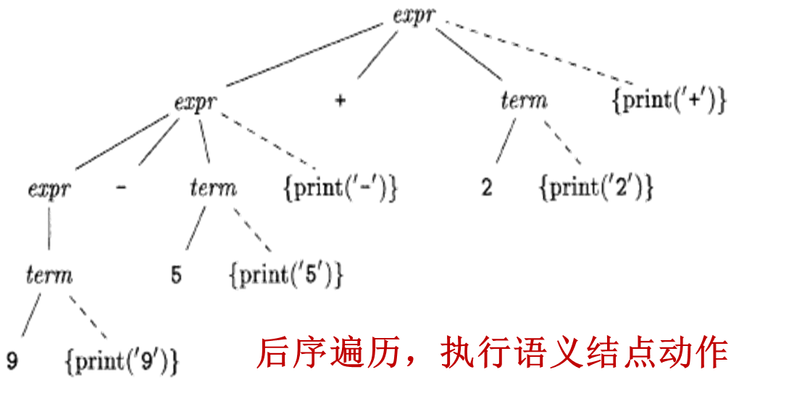

#### 例

例2-18：分别构建一个**语法制导定义**和**翻译方案**，把算术表达式从中缀表示翻译成前缀表示。并给出输入9-5+2和9-5*2时的注释分析树。

##### 语法制导定义实现


##### 翻译方案实现


## 2.4 语法分析

1. 功能：确定如何使用文法生成（推导）一个终结符号串（句子）的过程。
   - 目的: 检查词法分析输出的单词序列是否是源语言的语法规则
2. 语法分析方法分类：
   - ==自顶向下==：从**根结点**开始，逐步向叶子结点方向进行构造 $\begin{cases}递归下降法\\预测分析法\\LL文法 \end{cases}$
   - ==自底向上==：从**叶子结点**开始，逐步构造出根结点。
3. 语法分析器构造方法
   - 手工构造：人工编程实现分析器。支持自顶向下分析
   - 自动构造：形式化地描述文法，分析器构造程序自动将描述转为分析程序。支持自顶向下和自底向上分析

### 2.4.1 自顶向下分析法

1. 从标号为开始符号的根结点开始，反复执行以下两个步骤

   - **扩展结点**：在标号为非终结符号A的结点N上，选择A的一个产生式，并为该产生式体中的各个符号构造出N的子结点

   - **确定待扩展结点**：寻找下一个结点来构造子树，通常选择当前语法分析树中**最左边**的尚未扩展的非终结符。

2. 自顶向下分析实际上是一种**试探性**的过程，可能导致分析效率极低甚至失败。**通常，在自顶向下的分析过程中会遇到二义性问题、左递归引起的无限推导和回溯问题。**

### 2.4.2 递归下降分析法

1. 一般性的自顶向下分析方法。使用一组**递归过程**来处理输入，文法的每一个非终结符都关联一个过程。

   - 非终结符选择产生式是一个“尝试并犯错”的过程。即首先选择一个产生式，不合适时进行回溯，再尝试另一个产生式。

2. > 例2-20 考虑文法$E→T | T+ E\\ T→ int | int * T | ( E )　$　　
   > 给出递归下降法分析(int)的过程。


### 2.4.3 预测分析法

1. 是递归下降分析法的一种简单形式
   - 要求：每个非终结符对应的过程中的控制流（选择哪个产生式）都可以通过**向前看一个符号**（输入中当前被扫描的终结符）来确定。
   - 分析输入串时出现的**过程调用序列** 对应 先序遍历该输入串的一棵语法分析树。

2. 例: 一个预测分析机的伪代码

   - ```pseudocode
     S →  +SS  |  -SS | a
     void s( ) {
         switch (lookahead ) {
             case + :  match('+'); s( ); s( ); break;
             case - :   match('-'); s( );  s( ); break;
             case a :  match ('a'); break;
             default: report ("syntax error");
          }
     }
     ```

   - 例: -+a+aaa
     1. lookahead=-, 选择2, 进入递归层1
        1. `lookahea`d=+, 选择1, 进入递归层2
           1. lookahead=a, 选择3 返回
           2. lookahead=+, 选择1, 进入递归层3
              1. lookahead=a, 选择3 返回
              2. lookahead=a, 选择3 返回
     2. lookahead=a, 选择3 返回

   

### 2.4.4 预测分析法的问题: 左递归

当产生式出现“左递归”时，递归下降语法分析器会进入**无限循环**。

==左递归==：产生式体的最左边的符号和产生式头部相同， 如$  A  → Aα | β   (α≠ ε, β不以A开头)$	

> 例2-23  算术表达式的文法        $S →E\\E→E+T|T\\T→T*F|F\\F→(E)|id$ 
> 为句子id*id+id构造分析树

-  若E()决定使用E→E+T，因为产生式体的开头为E，E()将被递归调用。

#### 左递归的消除

- $  A  → Aα | β   (α≠ ε, β不以A开头)$最后生成的语言形式: $\beta a^* (^*: 正则, 代表任意多个)$

- 上面的产生式进行左递归的消除: $A\rightarrow \beta A'\\A'\rightarrow αA'|\varepsilon$

 

$E→a|-a|E+a|E-a消除左递归$

- $E→ E(+a|-a)|(+a|-a)$

> 练2-9  消除文法G(P)的左递归
> 	P →（Q）|aP|a
> 	Q →Q ,P|P

- $P →（Q）|\textcolor{red}{aP|a} \\ Q→PQ'\\Q'→,PQ|\varepsilon$
- 对于这题, 当lookahead=a时, 会无法确定选择aP还是a, 需要再往后看一个

### 2.4.5 预测分析法问题:回溯

非终结符选择产生式是一个“尝试并犯错”的过程。即首先选择一个产生式，不合适时进行回溯，再尝试另一个产生式。
当出现形如 $A→ αβ_1|αβ_2$的产生式，此时无法确认应该选择A的哪个产生式，可以通过改写产生式(提取左公因子)来推后这个决定，等获得足够信息后再做出正确的选择。

- $A→ αβ_1|αβ_2\quad 变为\quad \begin{cases}A→αA'\\A'→β_1|β_2\end{cases}$ 

> 例2-26 文法	 $E → E' | E' + E\\E' → -E' | id | (E)$
> 用预测分析法分析id+id 

解：

- 提取左公共因子
  	E → E' | E' + E  变为  	$E → E'A\\A→ ε | + E\\E' → -E' | id | (E)$
- $ E \Rightarrow E'A \Rightarrow id A \Rightarrow  id + E \Rightarrow id + E'A
    		    \Rightarrow id + idA \Rightarrow id + id$ 


------

往后为实验内容

------

# 第3章 词法分析

> 词法分析主要任务: 读入源程序输入字符, 将字符组成词素, 生成并输出一个词法分析序列, 每个词法单元对于一个词素

词法分析的任务：从左向右逐行扫描源程序的字符，识别出各个单词，确定**单词的类型**。并将识别出的单词转换成统一的**机内表示**——词法单元(token)形式

编译程序是在单词的级别上来分析和翻译源程序，因此，词法分析是编译的基础


## 3.1 词法分析器的作用

### 3.1.1 词法分析器的作用

1. 读入源程序
2. 去除注释、空格、制表符、换行符等
3. 建立符号表
4. **识别词素，抽象成记号** (`<单词种别，单词的值>`)
5. 将记号插入符号表
6. 发现词法错误，建立错误消息与源程序的**位置**联系
7. 将记号提交给语法分析器

- 完成功能越多越好


### 3.1.2 词素识别实例


### 3.1.3 词法分析的输出

1. 词法分析器的输出：
   - `<单词种别，单词自身的值>`
   
2. 程序语言单词的分类：
   - **关键字**(保留字或基本字)：如while, if
   - **标识符**：用来表示各种名字，如变量名、数组名
     - 由字母/数字/下划线组成, 字母或下划线开头
   - **常数**：各种类型的常数 256，3.14
   - **运算符**：如，＋、－、*、/
   - **分界符**：如逗号，分号，冒号

3. 单词种别通常用整数编码表示
   - 界符和运算符: **一符一码**
   - 关键字可分成一类，也可以一个关键字分成一类。**一字一码**
   - 常数可统归一类，也可按类型（整型、实型、布尔型等），每个类型的常数划分成一类。**一类型一码**
   - 所有的标识符分为一类。**一类一码**
   
4. 单词的属性值
   - 对于关键字、分界符、运算符来说，它们的单词种别就可以表示其完整的信息，故对于这类单词，其单词自身的值通常为空
   - 对于标识符，词类编码所反映的信息不够充分，标识符的具体特性还要通过单词自身的值进行互相区分。标识符的单词自身的属性常用其在符号表中的入口指针来表示
   - 对于常数，其单词自身的值常用其在常数表中的入口指针来表示

5. | 单词分类              | 编码方式              | 属性值           |
   | --------------------- | --------------------- | ---------------- |
   | 关键字(保留字/基本字) | 一字一码 (一种关键字) | null             |
   | 标识符                | 一类一码              | 符号表的入口指针 |
   | 常数                  | 一类型一码            | 常数表的入口指针 |
   | 运算符                | 一符一码              | null             |
   | 分界符                | 一符一码              | null             |

   

### 3.1.4 词法分析术语

1. ==记号（词法单元、单词） Token== 
   - 具有独立含义的**最小语法单位**，每个记号代表一类符号串
   - 例:  `<identifier>`, `<number>`
2. ==模式Pattern==: 描述某个记号的词素集合的**构造规则**
3. ==词素Lexeme==
   - 源程序的符号序列，可匹配某个记号的模式
   - 标识符: x, count, name, etc…


### 3.1.5 词法错误

1. 当前输入的前缀无法匹配任何记号时报词法错误，如：
   - 出现了当前语言中不会出现的字符，如 @ 或 #
   - 整数越界
   - 标识符名太长(有些语言最大长度为32个字符)
   - 字符串太长(有些语言最大长度为256个字符) 
   - 字符串跨行
2. 局部化 
   - 例: `whil  ( x = 0 ) do  ` 并不产生词法错误


### 3.1.6 双缓冲双指针策略

1. 提高源程序读入速度的策略

2. 采用大块存储空间作为缓存，一次性将大批数据读入缓存

3. 采用双缓冲

   - 在一个缓冲I/O, 另一缓冲词法分析, 第一块用完后, 继续读第二块, 保证连续性

   - ```pseudocode
     switch (*forward++ ) {
         case eof:
     	      if (forward is at end of first buffer ) {
     		reload second buffer;
     		forward = beginning of second buffer;
     	     }
     	    else if (forward is at end of second buffer ) {
     		reload first buffer;
     		forward = beginning of first buffer;
     }
     	   else /* eof within a buffer marks the end of input */
     		terminate lexical analysis;
     	   break;
          cases for the other characters: ......
     }
     
     ```

### 3.1.7 词法分析的设计形式

1. 设计成一个独立程序，完成词法分析的任务，结果以文件的形式组织，做为语法分析的输入
    
2. 作为语法分析的子程序
    

### 3.1.8 词法分析器的构造策略

1. 使用传统的程序设计语言手工编写
2. 使用汇编语言手工编写
3. 使用**词法分析器生成器**，从基于**正则表达式**的说明自动产生
   - 例: FLEX


## 3.2 词法分析机的手工实现

### 3.2.1 识别模式

1. 标识符识别
   - 字母开头的字母数字串，后跟界符或算符
2. 常数识别
   - 口识出算术常数并将其转变为二进制内码表示。
   - 5.88, 5.E08
3. 算符和界符的识别
   - 把多个字符符合而成的算符和界符拼合成一个单一单词符号
   - ++, 

### 3.2.2 状态转换图

1. 状态转换图是一张有向图，用来描述和识别记号
2. 包括:
   - **结点**：代表状态States，用圆圈表示
   - **有向边**：代表动作Actions，边上的标记（字符）表示射出状态下可能出现的输入字符（字符类别）
   - **初态**Start State：模式的开始，无源箭头的目标
   - **终态**Final State(s)：模式的结束，双圈
     - 可能带有`*`, 表示输入需要回退一个位置, 意思是当前输入不是当前词素的一部分
   - 一张转换图包含有限个状态，其中有一个为初始状态，有若干个终止状态

### 3.2.3 词法分析器的手工实现

## 3.3 词法分析器的自动生成

### 3.3.1 字母表和串

1. 字母表$∑$ ：符号的有穷集合
   1. 例：{0,1},  {a,b,c},  {n,m, … , z}
2. 串（字）：基于给定字母表的有穷符号序列
   - 例：0011，abbca，AABBC …
3. 串的长度：串S中的符号的数，记为|S|
4. 串的运算：连接、幂
5. 用$∑^*$表示$\sum$上所有串的**全体**，包含空串ε

### 3.3.2 串的术语

> 原始串: banana

- **前缀Prefix**:从尾部删除0或多个符号得到的串。ban, banana, ε
- **后缀Suffix**:从首部删除0或多个符号得到的串。ana, banana, ε
- **子串Substring**:删除某个前缀和某个后缀后得到的串。 nan, ban, ana, banana, ε
  - 真前缀：不等于原串，也不为ε的前缀
    真后缀、真子串：与上类似
- **子序列Subsequence**:删除0或多个符号所得的串。bnan, nn, ε

- > 例3-6 试说明字符串abcdefghij，分别有多少个前缀、后缀、真前缀、子串和子序列。

  - 

### 3.3.3 语言上的运算


例：令L={A，B，…，Z，a，b，…，z}，D={0，1，…，9}。则L(L∪D)*表示的语言是标识符(数字/字母组成, 且字母开头)

### 3.3.4 正则表达式&语言(正则集)

##### 正则基本定义

1. ==正则表达式==(Regular Expression，RE)，又名正则式、正规表达式、正规式。是一种用来描述词素模式的 更紧凑的表示方法
   - 正则表达式可以由较小的正则表达式按照特定规则递归地构建
   - 例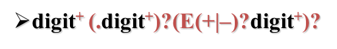
   - 基于字母表$\Sigma$​构造串的一组规则（模板、模式）
   
2. 如果r是正则式，则`L(r)`是r描述的语言（正规集、正则集）

   - L()被称为Mapping Function, 实现语法(syntax)→语义(semantics)的映射

   - 基于同一个字母表，可以通过不同的正则式来定义不同的语言

3. **正则表达式定义**

   - **空串**: ε是正则式，L(ε)={ε}
   - **单字符**: 若$a∈\Sigma$, 则a是正则式， L(a)={a}
   - 若r和s为正则式，且L(r)和L(s)为对应语言。  则
     - **Union**: `r|s`是正则式，L(r|s)  =  L(r)  L(s)
     - **Concatenation**: `rs `是正则式，L(rs)  =  L(r) L(s)
     - **Interaction**: `r*` 是正则式，L(r*)  =  (L(r))*
     - `(r)`是正则式，L((r))=L(r)
   - 以上运算均左结合，优先级从高到低为：`*， 连接，|`

4. 仅由有限次使用上述步骤（3个构造运算）定义的表达式才是$\Sigma$上的正则式，仅由这些正则式表示的串的集合称为==正则语言（正则集）==。
   所有词法结构一般都可以用正则集描述，它们就是词法分析时的**词素**。

##### 一堆例题

1.  
2.  


##### 正则表达式的代数定律

- 

##### 正则表达式的拓展

- `+` : 1个或多个      	
  - $r^* = r^+ | ε且r^+ = rr^*$
- `?` : 0或1个		
  - $r^? = r  | ε$
- `[range] `: 字符的范围
  $A | B | C | … | Z = [ABC…Z] = [A-Z]$

##### 正则定义

==正则定义==是具有如下形式的定义序列：

​		$		d_1→r_1\\
​		d_2→r_2\\
​		   …\\
​		d_n→r_n$
 其中：

- 每个$d_i$都是一个新符号，它们都不在字母表 Σ中，而且各不相同
- 每个ri是字母表 Σ∪{d1 ,d2 , … ,di-1}上的正则表达式

**省流**: 给一些RE命名，并在之后的RE中像使用字母表中的符号一样使用这些名字($d_i$)

- 如C语言中标识符的正则定义

  ```tex
  digit → [0-9]
  letter_ → [A-Za-z_]
  id → letter_(letter_|digit)*
  ```

  

### 3.3.5 词法分析器生成工具Lex

1. Lex使用

   1. 用Lex语言写一个输入文件，描述要生成的词法分析器
   2. Lex编译器将lex文件转换成C语言程序
   3. 编译C程序,即得词法分析器
   4.  

2. Lex程序结构

   - ```c
     declarations           //声明
     %%
     translation rules      //转换规则
     %%
     auxiliary procedures  //辅助过程
     ```

   - ```c
     // 声明(定义)
     delim		[  \t\n]       // 定义空白字符
     ws	 	{delim}+         // 匹配一个或多个空白字符
     letter 		[A-Za-z]        // 定义字母
     digit 		[0-9]           // 定义数字
     id 		{letter} ({letter} | {digit})*    // 定义标识符
     number 	{digit}+(\.{digit}+)?(E[+-]?{digit}+)?   // 定义数字
     
     %%
     // 规则
     {ws}     	{ }            // 忽略空白字符
     if			{return(IF);}  // 匹配关键字"if"
     then		{return(THEN);}  // 匹配关键字"then"
     else		{return(ELSE);}  // 匹配关键字"else"
     {id}		{yylval=(int) installID( ); return(ID);}  // 匹配标识符
     {number}	{yylval=(int) installNum( ); return(NUMBER);}  // 匹配数字
     “<”			{yylval=LT; return(RELOP);}  // 匹配"<"
     “<=”		{yylval=LE; return(RELOP);}  // 匹配"<="
     “=”			{yylval=EQ; return(RELOP);}  // 匹配"="
     “< >”		{yylval = NE; return(RELOP);}  // 匹配"< >"
     “>”			{yylval = GT; return(RELOP);}  // 匹配">"
     “>=”		{yylval = GE; return(RELOP);}  // 匹配">="
     
     %%
     // 用户子程序
     int installID( ){  }  // 安装标识符
     int installNum( ) {  }  // 安装数字
     int num_lines = 0, num_chars = 0;  // 初始化行数和字符数
     
     %%
     \n    {++num_lines; ++num_chars;}  // 统计换行符
     .      {++num_chars;}  // 统计其他字符
     %%
     main( argc, argv )
     int argc; char **argv;
     {  
     	++argv, --argc;  // 跳过程序名
     	if ( argc > 0 )      
     		yyin = fopen( argv[0], "r" );  // 打开文件
      	else  
      		yyin = stdin;  // 默认输入为标准输入
      	yylex(  );  // 调用词法分析器
      	printf( "# of lines = %d, # of chars = %d\n", num_lines,  num_chars );  // 输出行数和字符数  
     }
     ```

3. Lex冲突解决
   - 当输入的多个前缀与多个模式匹配时，使用如下优先原则选择正确的词素：
     1. 匹配最长串的规则优先
     2. 长度相同时，在前的规则优先 (这样可以实现优先级)


## 3.4 有穷自动机

==有穷自动机== ( Finite Automata，FA )由两位神经物理学家MeCuloch和Pitts于1948年首先提出，是对一类处理系统建立的数学模型

- 这类系统具有一系列离散的输入输出信息和有穷数目的内部状态（状态：概括了对过去输入信息处理的状况）
- 系统只需要根据当前所处的状态和当前的输入信息就可以决定系统的后继行为（下一状态）。
  每当系统处理了当前的输入后，系统的内部状态也将发生改变


### 3.4.1 FA的表示

1. ==状态转换图== (Transition Graph)
   - **结点**：FA的状态
   - **初始状态**（开始状态）：只有一个，由start箭头指向
   - **终止状态**（接收状态）：可以有多个，用双圈表示
   - **带标记的有向边**：如果对于**输入a**，存在一个从状态p到状态q的转换，就在p、q之间画一条有向边，并标记上a
2. ==状态转换矩阵（表）==：描述各个状态下，对应于各个输入的状态迁移。


### 3.4.2 FA的分类

1. 确定的FA(Deterministic finite automata, **DFA**)
2. 不确定的FA(Nondeterministic finite automata, **NFA**)

#### DFA

**DFA是NFA的一个特例**

1. 对状态转换图的形式化
2. **没有输入ε**之上的转换动作
   - 一个空边会导致输出不确定
3. 对每个状态s和每个输入符号a，有且仅有一条标号为a的边离开


DFA是一个五元组，$M = ( S，Σ ，δ，s_0，F )$

- S：有穷状态集
- Σ：输入字母表，即输入符号集合。假设ε不是 Σ中的元素
- δ：状态转换函数，将S×Σ映射到S的单值部分映射。$\forall s∈S, a∈Σ, δ(s,a)$表示从状态s出发，沿着标记为a的边所能到达的状态。
- s0：开始状态 (或初始状态)，s0∈ S
- F：接收状态（或终止状态）集合，F⊆ S


#### NFA

NFA是一个五元组，$M = ( S，Σ ，δ，s_0，F )$

- S：有穷状态集
- Σ：输入符号集合，即输入字母表。假设ε 不是Σ中的元素
- δ：将S×Σ映射到$\color{red}2^S$的部分映射。$\forall s∈S, a∈Σ\cup\{\varepsilon\}, δ(s,a)$表示从状态s出发，沿着标记为a的边所能到达的状态集合
  - NFA是多值映射
- s0：开始状态 (或初始状态)，s0∈ S
- F：接收状态（或终止状态）集合，F⊆ S


#### FA对输入字符的接受

**定义**

1. 给定输入串x，如果存在一个对应于串x的从初始状态到某个终止状态的转换序列，则称串x被该FA==接受==
   1. 路径中的ε标号将被忽略
2. 由一个有穷自动机M接收的**所有串构成的集合**称为是该FA定义（或接收）的==语言==，记为L(M )

**匹配规则: 最长匹配**

1. 当输入串的多个前缀与一个或多个模式匹配时，总是选择最长的前缀进行匹配
2. 在到达某个终态之后，只要输入带上还有符号，FA就继续前进，以便寻找尽可能长的匹配
   -  
   - 如上图, 如果不使用最长匹配, `<=`会被识别为`<`和`=`


### 3.4.3 DFA&NFA的构建

#### DFA和NFA的等价性

1. ==等价FA==：对于任何两个有限自动机M和M'，若L(M)=L(M')，则称M和M'等价
   - 对任何非确定的有穷自动机N ，存在定义同一语言的确定的有穷自动机D
   - 对任何确定的有穷自动机D ，存在定义同一语言的非确定的有穷自动机N
   - 即: **DFA与NFA描述能力相同**！

2. 例: 
   

#### 正则→FA


正则表达式以符号序列的形式非常直观的描述单词的构成，但是构造分析器时真正实现或模拟的是DFA。

直接由RE构造DFA是非常困难的，经常**通过NFA实现**。

#### 正则→NFA

1. 正则式ε对应 NFA 
2. 正则式$a\in \Sigma$, 对应NFA  
   - **正则转换为NFA图的边**, 而不是节点(状态)
3. 若s,t是正则式, N(s)和N(t)是对应的NFA，则`s|t`对应之NFA为: 
4. 若s, t为正则式，N(s)和N(t)是对应的NFA，则`st`对应之NFA为:  
   - 将s的结束状态和t的开始状态重合起来
5. 如果s是正则式, N(s)为对应NFA,  则`s*`对应之NFA为:  
   - 下面的空边: 匹配０次
     上面的空边: 匹配多次


#### NFA→DFA 子集构造算法

> 消除二义性?

**计算量:** 

1. ε-closure(s)  : $s \in S$      ==状态s的ε闭包==
   - 从状态s出发，仅通过ε边就能达到的状态集合 
2. ε-closure(T) :$ T \sube S $   ==状态集T的ε闭包==
   - 从状态集I中任一状态出发，仅通过ε边就能达到的状态集
3. move(T,a): $T \sube S,  a\in \Sigma $  ==转移函数==
   - 对于状态集T，在输入a时，可以到达的状态集**(不考虑ε边)**


**例**

例3-22 将下面的NFA转换成DFA


| I                          | Ia                   | Ib                     |
| -------------------------- | -------------------- | ---------------------- |
| {**0**,1,7,2,4} (〇)       | {**3,8**, 6,1,7,2,4} | {**5**,6,1,7,2,4}      |
| {**3,8**,6,1,7,2,4} (①)    | {**3,8**, …} (同①)   | {**5, 9**, 6,1,7,2,4}  |
| {**5**,6,1,7,2,4} (②)      | {**3,8**, …} (同①)   | {**5**, …}             |
| {**5, 9**, 6,1,7,2,4} (③)  | {**3,8**, …} (同①)   | {**10, 5**, 6,1,7,2,4} |
| {**10, 5**, 6,1,7,2,4} (④) | {**3,8**, …} (同①)   | {**5**, …}             |

- 技巧 找a边和b边, 看I中有哪些边的前驱节点

简化结果

| I         | a    | b    |
| --------- | ---- | ---- |
| 0         | 1    | 2    |
| 1         | 1    | 3    |
| 2         | 1    | 2    |
| 3         | 1    | 4    |
| 4 $\cdot$ | 1    | 2    |


### 3.4.4 等价相关概念

自动机的==等价==：可以存在多个识别同一语言的DFA，这些DFA等价。

==同构==：如果仅需变换状态的名字就可以将一个DFA变成另一个，则这两个DFA同构。

两个==状态的等价==：同时是或不是**接受状态**，且对任意的输入，总是转向同一状态或等价状态

最少状态数的DFA：合并等价状态。

串x**可区分**状态s和t：分别从s和t出发，沿串x到达的两个状态中，只有一个是接受状态。

### 3.4.5 最小化DFA

**基本思想**: 把M的状态集划分为一些不相交的子集，使得任何两个不同子集的状态是可区别的而同一子集的任何两个状态是等价的。最后，让每个子集选出一个代表，同时消去其他状态

#### 划分过程

**工作原理**：将状态集分划成多个组，每个组中的各个状态相互不可区分。然后，将每个组中的状态合并成一个状态。

1. 将状态集划分成两组：终结状态集 F 和 非终结状态集S - F.

2. **(循环直到不需要继续细分)** 
    考察当前划分中的每一组G：
  - 如果有必要，将G划分成若干子组，使各子组中的任意两个状态s 和 t 对于给定输入均转向划分中的同一组；并更新划分
3. 每组状态用一个状态代表，原DFA中所有由该组中状态发出的边或指向该组中某状态的边，都要与该代表状态关联。	


# 第4章 语法分析

## 4.1 语法分析器


任务：基于文法检查记号流的构成（语法规则）

- 识别正确的输入，生成分析树
- 发现、报告语法错误

**例1**

 

**例2**

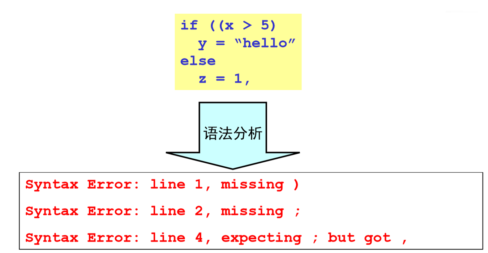 


## 4.2 上下文无关文法

> 为什么要通过文法形式化地描述语言?
>
> - 精确易懂的表示方法
> - 编译器构建工具可以基于文法来自动构建编译器
> - 使语言的演化变得容易

### 4.2.1 上下文无关文法定义

可见[2.2.1 文法定义](#2.2.1 文法定义)

$G=(T, N, P, S)$

- T(Terminal): 终结符集

- N: 非终结符集
- P: 一组产生式规则
  - 每条规则的形式: $X→\beta_1\beta_2...\beta_n$
    其中$X\in N, \beta_i\in(T\cup N)$
- S: **唯一**的开始符号 ($S\in N$)

### 4.2.2 推导

1. ==推导==: 

   - 给定文法G, 从G的开始符号S开始, 用产生式的右部替换为左侧的非终结符

   - 此过程不断重复, 直到不出现**非终结符**为止

   - 最终形成的串称为**句子**
   - 每一步推导中，都需要做两个选择
     - 替换当前句型中的哪个非终结符
     - 用该非终结符的哪个候选式进行替换

2. 推导顺序:
   - ==最左推导==：每次总是选择最左侧的符号进行替换
   - ==最右推导==：每次总是选择最右侧的符号进行替换 (也叫==规范推导==)

### 4.2.3 语法分析树

上面的推导过程可以表达为树状结构

- 与推导顺序无关

特点: 

- 每个非叶子节点 $\Leftrightarrow$ 非终结符
- 叶子结点 $\Leftrightarrow$ 终结符
- 每一步推导 $\Leftrightarrow$ 如何从parent结点生成子节点

例: 

> 例4-4 用下面文法推导句子：3+4*5
>
> - E -> num | id | E+E | E*E

|          |                                                              |                                                              |
| -------- | ------------------------------------------------------------ | ------------------------------------------------------------ |
| 最左推导 | $E\Rightarrow E+E\Rightarrow3+E\Rightarrow3+E*E\Rightarrow3+4*E\Rightarrow3+4*5$ | 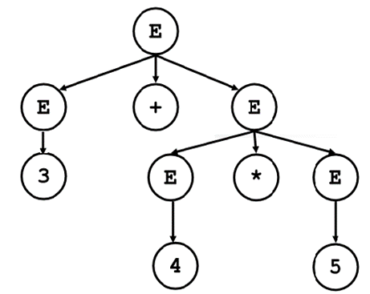 |
| 最右推导 | $E\Rightarrow E*E\Rightarrow E+E*E\Rightarrow3+E*E\Rightarrow3+4*E\Rightarrow3+4*5$ |  |


### 4.2.4 文法的二义性

一个文法是**二义**的，如果：

- 能为一个句子生成多棵语法分析树（推荐）
- 能为一个句子生成多个最左推导
- 能为一个句子生成多个最右推导


- note: 似乎没有算法去检查文法是否二义, 只能碰运气去试…

**文法二义性导致的问题**

- 从编译器角度看，二义性文法存在问题：
  - 同一个程序会有不同的含义
  - 程序运行的结果是不唯一的
- 解决方案：**重写文法**
  -  

## 4.3 自顶向下分析

> 语法分析：给定文法G和句子s，回答s是否能从G推导出来？

### 4.3.1 自顶向下分析的基本思想

==自顶向下分析==基本思想：从分析树的顶部（根节点）向底部（叶节点）方向构造分析树。即从文法的开始符号S出发推导出词串s的过程。

- 总是选择每个句型的**最左**非终结符进行替换 (最左推导)

- 根据输入流中的下一个终结符，选择最左非终结符的一个候选式

- > 例: 


### 4.3.2 自顶向下分析面临的问题

#### ①无限循环问题 (左递归)

> 例: 
>
>  
>
> - 对于终结符id, E不断选择E+T

对于我们使用的最左推导, 产生这个无限循环的原因即为左递归

- 如果一个文法中有一个非终结符A使得对某个串α存在一个推导$A\Rightarrow^+Aα$ ，那么这个文法就是==左递归==的
- 含有$A→Aα$形式产生式的文法称为是==直接左递归==的(immediate left recursive)
- 经过两步或两步以上推导产生的左递归称为是==间接左递归==的

##### 直接左递归的消除

处理策略：将直接左递归转化为直接右递归

- 将文法：$A\rightarrow A \alpha | \beta  (α≠ ε, β不以A开头)$
  转化为:   $A\rightarrow \beta A’\\ A’\rightarrow \alpha A’ | ε$ 
- 一般形式: 
  - $$\begin{gathered}
    A\to A\alpha_1|A\alpha_2|\ldots|A\alpha_n|\beta_1|\beta_2|\ldots|\beta_m \\
    (\alpha_i\neq\varepsilon,\beta_j\text{不以}A\text{开头}) \\
     \Downarrow \\
    A\to\beta_1A^{\prime}\mid\beta_2A^{\prime}\mid...\mid\beta_mA^{\prime} \\
    A'\to\alpha_1A'\mid\alpha_2A'\mid...\mid\alpha_nA'\mid\varepsilon  
    \end{gathered}$$ 
  - **消除的代价**: 产生了非终结符(A’)和$\varepsilon  $产生式

##### 间接左递归的消除

==间接左递归==：由多步推导带来的左递归
例如:  

**间接左递归消除算法**
$$
\begin{align}
&按照某个顺序将非终结符号排序为A_1，A_2，… ，A_n\\
&for ( 从1到n的每个i ) \{\\
&\qquad for (从1到i-1的每个i ) \{\\
&\qquad\qquad 消除由A_j导致的左递归：即向每个形如A_i → A_jγ的产生式\\
&\qquad\qquad代入所有A_j为头的规则。得 A_i → δ1 γ∣δ2 γ∣…∣δk γ ，\\
&\qquad\qquad \quad其中A_j  → δ1∣δ2∣… ∣δk ，是所有的A_j产生式 \\
&\qquad\qquad    \}\\
&\qquad     消除A_i 产生式之间的直接左递归\\
 \}
 \end{align}
$$

#### ②回溯问题

1. ==回溯==

   - 分析过程中，当一个非终结符用某一个候选式匹配成功时，这种匹配可能是暂时的。出错时，需要进行“回溯”
   - 当同一个非终结符的多个候选式存在共同前缀时，将导致回溯。

2. 例: 

   - > $S→xAy\\
     > A→**|*$

   - 

3. 解决方案: 提取左公因子, 消除回溯

   - ```
     对于每个非终结符A，找出它的两个或多个候选式的最长公共前缀α。若α ≠ ε，则将所有A-产生式
         A → α β1 | α β2 | … | α βn | γ1 | γ2 | … | γm
         替换为
         A → α A' | γ1 | γ2 | … | γm
         A' → β1 | β2 | … | βn
         其中， γi 表示所有不以α开头的产生式体； 
     不断应用这个转换，直到每个非终结符的任意两个产生式体都没有公共前缀为止
     ```

   - 通过改写产生式来推迟决定，等读入了足够多的输入，获得足够信息后再做出正确的选择

### 4.3.3 递归下降的语法分析

==自顶向下的语法分析==：从分析树的根结点开始，深度优先地创建该树的各个结点。

一个递归下降分析程序由一组过程组成，每个非终结符号有一个对应的过程。

程序的执行从开始符号对应的过程开始，如果这个过程的过程体扫描了整个输入串，它就停止执行并宣布语法分析成功。

```pseudocode
void A( ) {
    选择一个A的产生式, A → X1 X2 . . . Xk;
    for ( i = 1  to k ) {
           if ( Xi 是一个非终结符 )
                  调用过程 Xi( ) ;
          else if ( Xi 等于当前的输入符号 a )
                      读入下一个输入符号;
          else /* 发生了一个错误 */;
     }
}
```


### 4.3.4 预测分析

==预测分析==是递归下降分析技术的一个**特例**

- 在每一步推导过程中，通过在输入中向前看固定个数（通常是一个）符号来选择正确的A-产生式。为保证分析的确定性，选出的候选式必须是唯一的。
- 预测分析不需要回溯，是一种确定的自顶向下分析方法
- 可以对某些文法构造出向前看k个输入符号的预测分析器，该类文法有时也称为==LL(k) 文法类== 

#### ①串首终结符(集) FIRST

==串首终结符== ：串首第一个终结符，简称首终结符

**串α的首终结符集FIRST(α)**：可以从α推导出的所有首终结符构成的集合。

- 对于$\forall α∈(V_T∪V_N)^+,  FIRST(α)=\{ a | α \Rightarrow ^* aβ，a∈ V_T，β∈(V _T∪ V_N)*\}；$
- 如果 $α \Rightarrow ^* ε，那么 ε∈FIRST(α)$ ($α \Rightarrow^* ε$ 表示串 α 可以经过一系列（可能是零个或多个）推导步骤最终被推导出空串ε)

如果非终结符A的所有候选式的首终结符集两两不相交，当要求A匹配输入串时，A就能根据当前输入符号a，选择唯一的正确的候选式。该候选式就是那个串首终结符集中包含a的α

##### 计算文法符号X的FIRST(X)

反复执行以下步骤，直至无法加入新的终结符或ε
    1. 若 X 是终结符，则FIRST(X) = X
        2. 若X是非终结符，且$ X\rightarrow Y_1Y_2…Y_k∈P(k≥1)$，则将 $FIRST(Y_1Y_2…Y_k) $加入到 FIRST(X); 
       - 如何计算$FIRST(Y_1Y_2…Y_k)$ →见③
        3. 若$X \Rightarrow ε ∈P$，则将 ε 加入到 FIRST(X)

##### 计算串$X_1X_2…X_n$的$FIRST(X_1X_2…X_n)$

1. 将FIRST(X1)中所有终结符加入 $FIRST(X_1X_2…X_n) $
2. for(i=1;i<n-1;i++)
    - 若$\textcolor{red}{ε}∈FIRST(X_i)$，将$FIRST(X_{i+1})$中所有终结符加入$FIRST(X_1X_2…X_n)$ 
    - 否则break; 
3. 如果对$∀i, ε∈FIRST(X_i)$成立, 则将 ε 加入 $FIRST(X_1X_2…X_n) $
   - 即所有$X_i$都有$\varepsilon$

#### ②什么时候使用$\varepsilon$产生式

如果当前某**非终结符A**与当前**输入符a**不匹配时，若存在A→ε，可以通过检查**a是否可以出现在A的后面**，来决定是否使用产生式 A→ε

- 若文法中无 A→ε ，则应报错

- 判断a是否可以出现在A的后面: 使用FOLLOW(A)

#### ③非终结符的后继符号集 FOLLOW

非终结符A的==后继符号集FOLLOW(A)==：可能在某些句型中紧跟在A右边的终结符号的集合。

- $FOLLOW(A)=\{a| S \Rightarrow^* αAaβ, a∈V_T，α,β∈(V_T∪V_N)^*\}$

- 如果A是某个句型的的最右符号，则将结束符“`$`”添加到FOLLOW(A)中

##### 计算所有非终结符的FOLLOW集

反复执行以下规则,直到无法加入新的终结符和`$`
1. 如果S是开始符, 将`$`加入FOLLOW(S), 这里`$`是输入结束标记.

2. 如果存在一个产生式$ A \rightarrow αBβ$, 则将 FIRST(β) 中的终结符加入 FOLLOW(B).

3. 如果存在:

   - 产生式 $A\rightarrow aB$, 或者
   - 产生式$A\rightarrowαBβ$, 且 ε∈FIRST(β) 

     - 则将**FOLLOW (A) 加入 FOLLOW (B)** (别看错了 不是B加入A)


> FIRST: 看产生式左部, 右部的FIRST按照条件加入左部
>
> FOLLOW: 看产生式右部, 右部的右边

#### ④LL(1)文法

1. ==LL(1)文法==: **Left-to-Right, Leftmost derivation, 1-symbol lookahead**，从左到右扫描输入，最左推导，向前看一个输入符号。
2. 文法G是LL(1)的，当且仅当G的任意两个具有相同左部的产生式A → α | β 满足下面的条件：
   - 不存在终结符a使得α和β都能够推导出以a开头的串
   - α 和β至多有一个能推导出ε 
   - 如果 $β \Rightarrow^* ε，则FIRST (α)∩FOLLOW(A) =Φ$；
     如果 $α \Rightarrow^* ε，则FIRST (β)∩FOLLOW(A) =Φ$；

#### ⑤表驱动的预测分析法

1. 特征：不需要为每个非终结符编写递归下降过程，而是根据预测分析表构造一个不需要回溯的非递归下降语法分析器。
2. 要求: 文法是LL(1)文法
3. 表驱动的预测分析器包含：
   - 一个输入缓冲区
   - 一个栈
   - 一张分析表
   - 一个输出流
   -  
4. 假设要用非终结符A进行匹配, 当前输入符号为a, A的所有产生式为$A→α_1|α_2|...|α_n$
   1. 若$a\in FIRST(\alpha_i)$, 则让$\alpha_i$进行匹配
   2. 若a不属于任何一个候选FIRST集, 则
      1. 若$\varepsilon$属于某个$FIRST(\alpha_i)$且$a\in FOLLOW(A)$, 则则让A与$\varepsilon$自动匹配
      2. 否则, a的出现是一种**语法错误**

##### 预测分析表M

==预测分析表==是一个M[A，a]形式的矩阵

- 其中：行A为非终结符，列a为终结符或＄
- M[A，a]中可能存放一条关于A的产生式，指出当A面临a时所应采取的候选式；
- M[A，a]中也可能存放一条“出错标志”，指出Ａ不应该面临a

##### 构建预测分析表

1. 计算每个非终结符A及其产生式右部α的FIRST(α)和FOLLOW(A)
2. 构造分析表M[A,a]
   1. 表的每一行对应一个非终结符，每一列对应一个输入符号（含终结符和输入结束标志$）
   2. 确定每个产生式$A→α$在分析表M[A,a]中的位置
      1. 为每条规则$A→α$，重复步骤 2、3
      2. 若终结符$a∈FIRST(α)$，将 $A→α$ 直接加入 M[A, a]
      3. 若ε∈FIRST(α)，对于$\forall b∈Follow(A)$，将$A→α$加入M[A,b]
      4. 分析表中**未定义项目**均为错误.
      5. 若表中存在**多重定义项目**，则本文法不是LL(1).

##### 预测分析程序


- 分析表M[A,a]矩阵：A是非终结符，a是终结符或’$’
- 分析栈STACK：用于存放文法符号
- 预测分析程序：根据现行栈顶符号和当前输入符号，执行动作


## 4.4 自底向上分析

> 自顶向下分析使用的文法必须是LL(1)文法, 适用性不好

1. 从分析树的**底部**(叶节点)向**顶部**(根节点)方向构造分析树
2. 可以看成是**将输入串w归约为文法开始符号S**的过程
3. 自顶向下的语法分析采用最左推导方式
4. 自底向上的语法分析采用最左归约方式（反向构造最右推导）


==归约==：先将一个子串与某规则的右部匹配，然后将该子串替换为该规则的左部。

**核心问题**：

- 什么时候进行规约
- 选择哪个产生式进行规约

自底向上语法分析的通用框架

- **移入-归约分析(Shift-Reduce Parsing)**

### 4.4.1 移入–规约分析的过程

1. 在对输入串的一次从左到右扫描过程中，语法分析器将零个或多个输入符号**移入**到栈的顶端(push)，直到它可以对栈顶的一个文法符号串β进行归约为止
2. 然后，它将β**归约**为某个产生式的左部
3. 语法分析器不断地重复这个循环，直到它检测到**一个语法错误**，或者栈中包含了开始符号且输入缓冲区为空(当进入这样的格局时，语法分析器停止运行，并宣称**成功完成**了语法分析)为止

#### 例

 

 


**最左归约：最右推导($\Rightarrow$)的反向过程**
$S\Rightarrow aAcBe\Rightarrow aAc\textcolor{#66ccff}{d}e\Rightarrow a\textcolor{red}{Ab}cde\Rightarrow a\textcolor{#66ccff}{b}bcde\\$

### 4.4.2 移入-归约分析器可采取的4种动作

- **移入**：将下一个输入符号移到栈的顶端
- **归约**：被归约的符号串的右端必然处于栈顶。语法分析器在栈中确定这个串的左端，并决定用哪个非终结符来替换这个串
- **接受**：宣布语法分析过程成功完成
- **报错**：发现一个语法错误，并调用错误恢复子例程

### 4.4.3 规约过程的问题

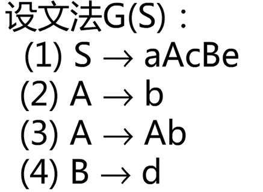 

在步骤5(规约②)时, 栈为aAb, 此时规约方式有两种A→Ab和A→b

如果选择了A→b, 结果如下

 

后续无法继续规约, 出错

**错误原因**: 错误的识别了[句柄](# 短语&句柄)

### 4.4.4 基本概念

#### 短语&句柄

对于文法G[S]，αβδ是G的一个句型，如果有$S\Rightarrow^* αAδ$, 且：

- $A \Rightarrow^+ β$，则称β是句型αβδ相对于A的==短语==
- $A→β$ ，则称β是句型αβδ相对于A的==直接短语==（简单短语）
- 一个句型的**最左直接短语**称为该句型的==句柄== 

**例**

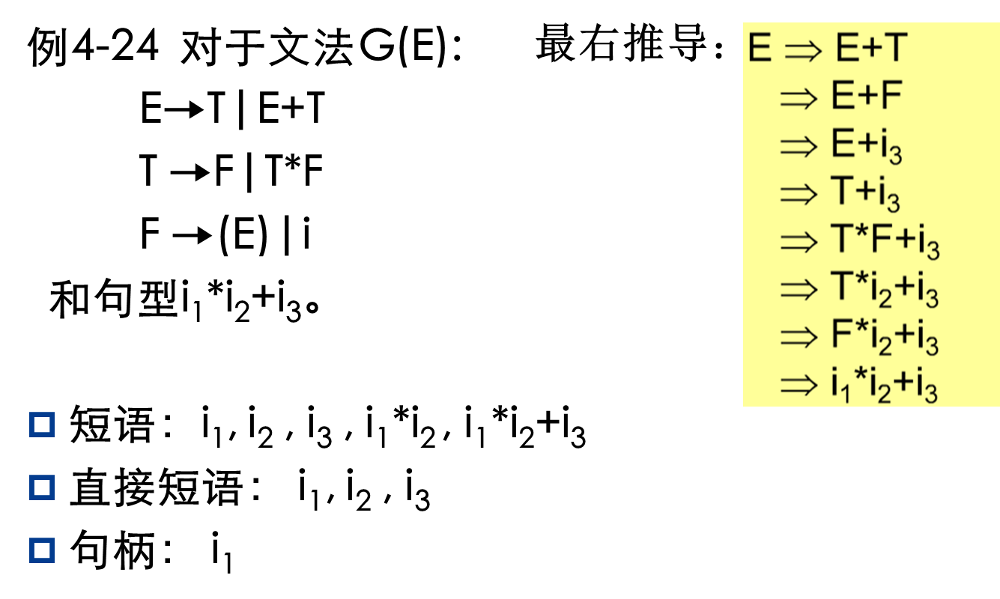

一个句型的**语法树**中

- 任一子树的叶节点所组成的符号串都是该句型的短语。
- 任一最小子树（树高为1）的叶节点所组成的符号串都是该句型的直接短语。
- 句柄是最左边的直接短语


#### 规范

- 在自底向上的分析中，总是采用最左归约的方式，因此把**最左归约**称为==规范归约==
- 规范归约是最右推导的逆过程，则**最右推导**相应地称为==规范推导==
- 由规范推导推出的句型称为==规范句型==

#### 前缀

==前缀==：符号串的首部

- 如: abc的前缀: ε,a,ab,abc

==活前缀==：文法G[S]的一个规范句型αβ，其中β 为终结符号串。若α不含句柄后的任何符号，则称α为活前缀（可行前缀）

- 如果α是含有句柄的活前缀，则称α为==可归前缀==。
- 可归前缀即最长的活前缀

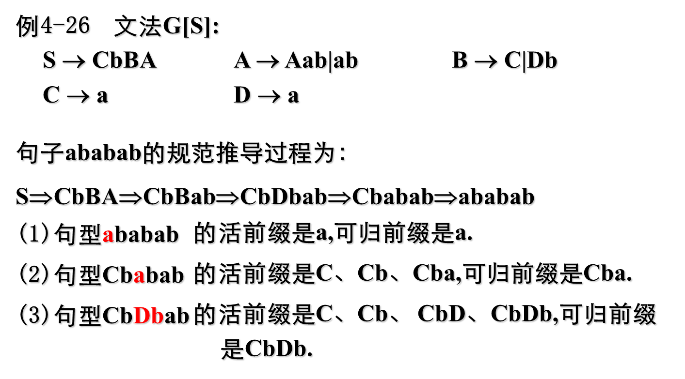

### 4.4.5 LR分析法

LR文法(Knuth, 1963) 是最大的、可以构造出相应移入-归约语法分析器的文法类

- L: 对输入进行从左到右的扫描
- R: 反向构造出一个最右推导序列

==LR(k)分析==

- 规范归约：**句柄**作为可归约串
- 需要向前查看k个输入符号的LR分析
  - k = 0 和 k = 1 这两种情况具有实践意义
  - 当省略(k)时，表示k =1 


LR分析法流程: 

1. 产生分析表:  
2. LR分析器工作: 

#### ①LR分析法的基本原理

自底向上分析的关键问题是**如何正确识别句柄**。句柄是逐步形成的，用“状态”表示句柄识别的进展程度。

- 历史：已经移入符号栈的内容
- 展望：根据产生式推测未来可能遇到的输入符号
- 现实：当前的输入符号

==LR分析法==：把“历史”信息和“展望”信息抽象成状态，由栈顶的状态和现行的输入符号唯一确定每一步的动作（移入或规约）

#### ②LR分析机(自动机)的总体结构


使用一个栈来保存文法符号，使用一个输入缓冲区来存放将要进行语法分析的其余符号

句柄在被识别（归约）时，总是完整地出现在栈顶

|            | 栈   | 输入 |
| ---------- | ---- | ---- |
| 分析开始时 | $    | w$   |
| 分析终止时 | $S   | $    |

- S是文法的开始符号，w为待识别的输入串


#### ③LR分析表的结构

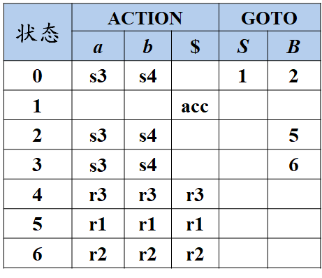

- ACTION: 状态s面临符号a时, 采取什么动作<br />GOTO: 状态s面临文法符号X时, 下一状态是什么
- 移进sn：将符号a、状态n压入栈
- 归约rn：用第n个产生式进行归约
- 接受acc: 宣布分析成功, 停止分析器工作
- 也就是状态机, 只不过没有用有向图来表示


### 4.4.6 LR分析表

#### ①LR(0)自动机

规范归约过程中

- 栈内的符号串和扫描剩下的输入符号串构成了一个规范句型
- 栈内如果出现句柄，句柄一定在栈的顶部
  

识别了句柄的一部分（规范句型的活前缀）就相当于识别了当前规范句型的左起部分

指导LR分析的目标：保证栈中总是活前缀

- 哪些字符串是活前缀？
- 能否构造一个DFA来识别活前缀？
  答：对于一个文法G，可以构造一个DFA，它能识别G的所有活前缀。


##### 增广文法

文法G[S]的增广文法$G’$ ：在G中引入一个新开始符号$S’$和一个新产生式$S’→S$而得到的文法


引入这个新的开始产生式的目的是: 使得文法开始符号仅出现在**一个产生式的左边**，从而使得分析器**只有一个接受状态**

- 新加的开始产生式记为0号

##### LR(0)项目

LR(0)项目: 由文法G的每个产生式右部加一个点构成，简称==项==。

例如  S→XYZ有四个项目： 
           S→•XYZ，S→X•YZ，S→XY•Z和S→XYZ•

- $A→\varepsilon$只有一个项目: $A→\bullet$ 

S→•XYZ: ==移进项目==, 表示希望接下来在输入中看到一个能从XYZ推导得到的串。
S→X•YZ: ==待约项目==, 表示在输入中已经看到了一个可以由X推导得到的串，希望接下来看到一个能从YZ推导得到的串
S→XYZ•: ==归约项目==, 表示栈顶看到了XYZ，可以把它归约为S

==后继项目==（Successive Item）: 同属于一个产生式的项目，但圆点的位置只相差一个符号，则称后者是前f者的后继项目

- $A→α\cdot Xβ的后继项目是A→αX·β$ 

==等价项目==: 可以把等价的项目组成一个项目集( $I$ ) ，称为==项目集闭包==(Closure of Item Sets)，每个项目集闭包对应着自动机的一个**状态**


##### 项集的闭包

项集：项的集合

项集I的闭包CLOSURE(I)计算

1. 首先将I中所有元素加入CLOSURE(I).
2. 若A→α•Bβ∈CLOSURE(I)，将所有的B→γ产生式对应的项B→•γ 加入CLOSURE(I) 
    反复使用规则2，直至无新规则可加入

**算法**

```pseudocode
SetOfltems CLOSURE ( I ) {
J = I；
    repeat
        for ( J中的每个项A → α∙Bβ ) 
            for ( G的每个产生式B → γ ) 
                if ( 项B → ∙ γ不在J中 ) 
                    将B → ∙ γ加入J中；
    until 在某一轮中没有新的项被加入到J中;
    return J;
}
```

**例:** 
 

若 I = {E’ → .E}
则 CLOUSURE(I) = {
​	**E’ → .E** (闭包中的初始项)
​	E → .E+T 
​	E → .T 
​	T → .T*F 
​	T → .F
​	F → .(E)
​	F → .id
}

##### GOTO函数(转移函数)

GOTO(I,X)：项目集I对应于文法符号X的**后继项目集闭包**。

$GOTO( I, X )=CLOSURE(\{A→αX·β | A→α·Xβ∈I\})$

```pseudocode
SetOfltems GOTO ( I，X ) {
    将J 初始化为空集；                   
    for ( I 中的每个项A → α∙Xβ ) 
    	将项 A → αX∙β 加入到集合J 中；
    return CLOSURE ( J )；
}
```


##### LR(0)自动机

LR(0)的项目集规范族构成一个DFA ，它可以识别文法G的所有活前缀

文法$G = ( V_N , V_T , P , S )$的LR(0)自动机为$M = ( C, VN∪VT , GOTO, I_0 , F )$
其中 $\begin{align} &C={项目集规范族}\\
&I=GOTO(J,X ) \\
&I_0= CLOSURE({S′ →\cdot S })\\
&F= CLOSURE({S′ →S\cdot}) \end{align}$


- 后继项有多少个, 由当前状态的$\cdot$后面的符号的种类决定

##### LR(0)自动机的使用

文法G: $0:S’→S\$\\1:S→xxT\\2:T →y$ 分析输入串xxy\$

 

 


##### LR分析表的结构

语法分析动作函数ACTION[i,a]：i为状态和a为当前输入(或终结符$)，其值有四种形式

- 移入sj。移入状态j，同时移入符号a
- 归约rj。假设第j条规则为$A→β$，则将栈顶的β归约为A。
- 接受。接受输入串，完成语法分析。
- 报错。在输入中发现一个错误并执行纠正动作。

转换函数GOTO[Ii,A]：i为状态和A为非终结符。若GOTO[Ii,A]=Ij，则在当前状态为i，归约得到非终结符A时，移入与A对应的状态j。

如果基于某文法构建的所有LR(0)项集，要么只有移入项目，要么只有一个归约项目，则可以构建LR(0)分析表，并且：

- 该文法称为LR(0)文法
- 在分析时，不需要看输入即可确定动作
- 分析表中，归约项目无需考虑后继。


##### LR分析表的构造

构造G'的规范LR(0)项集族C = { I0, I1, … , In}

令Ii对应状态i。ACTION表和GOTO表构造如下：

- if $A→α·aβ∈I_i\and GOTO( I_i , a )=I_j$ then $ACTION[ i, a ]=s_j$ 
- if $A→α.Bβ∈Ii \and GOTO( Ii , B )=Ij$ then $GOTO[ i, B ]=j$ 
- if $A→α·∈Ii \and A ≠ S'$ then for $\forall a∈V_T∪\{\$\}$
   do $ACTION[ i, a ]=r_j （j是产生式A→α的编号）$
- $if\ S'→S· ∈I_i\quad then\ ACTION [ i, \$ ]=acc$ 
  - acc是唯一的
- 没有定义的所有条目都设置为“error” 

|      | a    | b    | c    | d    | $    |      | E    | A    | B    |
| ---- | ---- | ---- | ---- | ---- | ---- | ---- | ---- | ---- | ---- |
| 0    | S2   | S3   |      |      |      |      | 1    |      |      |
| 1    |      |      |      |      | acc  |      |      |      |      |
| 2    |      |      | S5   | S6   |      |      |      | 4    |      |
| 3    |      |      | S8   | S9   |      |      |      |      | 7    |
| 4    | r1   | r1   | r1   | r1   | r1   |      |      |      |      |
| 5    |      |      | S5   | S6   |      |      |      | 10   |      |
| 6    | r4   | r4   | r4   | r4   | r4   |      |      |      |      |
| 7    | r2   | r2   | r2   | r2   | r2   |      |      |      |      |
| 8    |      |      | S8   | S9   |      |      |      |      | 11   |
| 9    | r6   | r6   | r6   | r6   | r6   |      |      |      |      |
| 10   | r3   | r3   | r3   | r3   | r3   |      |      |      |      |
| 11   | r5   | r5   | r5   | r5   | r5   |      |      |      |      |

- 归约项: 一整行都填r

#### ②SLR分析

> LR(0)文法太简单，能分析的文法有限，没有太大的实用价值
>
> - LR(0)分析表可能包含冲突
> - 如果LR(0)分析表中**没有语法分析动作冲突**，那么给定的文法就称为LR(0)文法

##### 引入–LR(0)中的冲突问题

LR(0)中的冲突问题: 

 


状态2中有移入–归约冲突

**LR(0)冲突解决方式**: 向前看一个输入符号**a**

对于$I_2$中冲突的$\begin{aligned}&E→T\cdot +E\\&E→T\cdot\end{aligned}$ 对于下一个输入的symbol a

- 如果$a=+$, 执行s3; 
- 如果$a\in FOLLOW(E) = \{\$\}$, 使用$E→T\cdot$规约

##### SLR分析法

**基本思想**: 

- $$对于项目集I, 有: \ \begin{aligned}&m个移进项目\begin{cases}A_1{\to}\alpha_1{\cdot}a_1\beta_1\\A_2{\to}\alpha_2{\cdot}a_2\beta_2\\\cdots\\A_m{\to}\alpha_m{\cdot}a_m\beta_m \end{cases}
  \qquad n个规约项目\begin{cases}B_1{\to}\gamma_1.\\B_2{\to}\gamma_2.\\\cdots\\B_n{\to}\gamma_n.\end{cases}\end{aligned}$$
-  如果集合$\{a_1, a_2, …, a_m\}$和$FOLLOW(B_1)， FOLLOW(B_2)，…，FOLLOW(B_n)$**两两不相交**，
  则项目集I中的冲突可以按以下原则解决： 
  - 设a是下一个输入符号 (look ahead)
  - 若$a∈\{a_1, a_2, …, a_m\}$，则**移进a** (与LR(0)相同)
  - 若$a∈FOLLOW(B_i)$，则用产生式 $B_i→γ_i$ **归约** (多了FOLLOW的判断)
  - 此外，报错

这种解决方法是比较简单的，因此称作==SLR(1)分析==，由此构造的分析表，称作==SLR分析表==。

##### SLR分析表构建

> 与LR(0)分析表相似

构造G'的规范LR(0)项集族C = { I0, I1, … , In}

令Ii对应状态i。ACTION表和GOTO表构造如下：

- if $A→α·aβ∈I_i\and GOTO( I_i , a )=I_j$ then $ACTION[ i, a ]=s_j$ 
- if $A→α.Bβ∈Ii \and GOTO( I_i , B )=I_j$ then $GOTO[ i, B ]=j$ 
- if $A→α·∈Ii \and A ≠ S'$ then $\textcolor{red}{for\ \forall a∈FOLLOW\{A\}}$
   do $ACTION[ i, a ]=r_j （j是产生式A→α的编号)$ 
  
  - > LR(0)分析表: 
    > if $A→α·∈Ii \and A ≠ S'$ then for $\textcolor{red}{\forall a∈V_T∪\{\$\}}$
    > do $ACTION[ i, a ]=r_j （j是产生式A→α的编号）$
  
  - 对于归约项, 此时**并不是一整行都填r**, 较为简单地处理移入-规约冲突
- $if\ S'→S· ∈I_i\quad then\ ACTION [ i, \$ ]=acc$ 
  - acc是唯一的
- 没有定义的所有条目都设置为“error” 

如果给定文法的SLR分析表中**不存在有冲突的动作**，那么该文法称为==SLR文法==

##### 例

例4-32 文法G[S]
	  S→AB  	  A→aBa|ε	  B→bAb|ε

1. 该文法是SLR(1)的吗？
2. 若是，请构造它的分析表。
3. 给出输入串baab$的分析过程。


#### ③LR(1)分析

##### 引入–SLR的缺陷

1. ==SLR(1)分析==(Simple LR)：基于LR(0)，通过进一步判断一个向前符号，来决定是否执行归约动作
   - $A→α•$ 归约，当且仅当y∈FOLLOW(A)


2. 优点：

   - 相比LR(0)，有可能减少需要归约的情况

   - 有可能消除移入-归约冲突


3. 缺点

   - **仍然有冲突出现的可能**: SLR只是简单地考察下一个输入符号b是否属于与归约项目A→α相关联的FOLLOW(A)，但b∈FOLLOW(A)只是归约α的一个必要条件，而非充分条件

   -   

   - **FOLLOW(A)={c,d}**, 考虑FOLLOW(A)并不足以解决冲突

##### LR(1)

解决方法：

- 通过**分裂状态**，使LR分析器的每个状态$A→\alpha \cdot$能确切知道句柄α后紧跟哪些终结符时才能把α归约成A
- 对于产生式 A→α的归约，在不同的使用位置，A会要求不同的后继符号
- 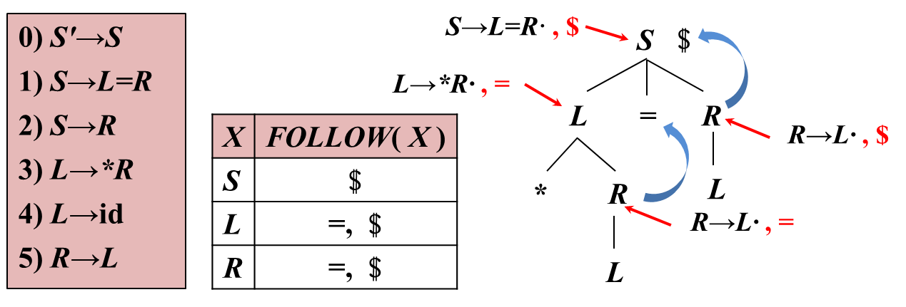

##### 规范LR(k)项目

形式：$[A→α•β,\ a_1a_2…a_k]$

- $a_1a_2…a_k$表示A后面必须紧跟的终结符号串(长度为k)，称为该项的==展望符==（或向前==搜索符号串==）


$β\neq \varepsilon$, $a_1a_2…a_k$**不起作用**(无视)

当$\beta = \varepsilon$时, $A→\alpha \cdot$是归约项

- 对归约项目$[A→α•,a_1a_2…a_k]$，仅当前输入符号串开始的前k个符号是$a_1a_2…a_k$时，才能用A→α进行归约

当k=1时，此时的项目$[A→α•β,a]$称为LR(1)项目

##### 规范LR(1)项目

==LR(1)项目==：扩充LR(0)项目，使之包含终结符a或结束标记作为第2个成分(**搜索符**)，一般形式为:

- $[A → α•β, a]$

搜索符a实际上是**归约条件**：

- 在β非空(即不是规约项目)时，不考虑a；
- 在β为空时（即当前为归约项目），则**只有当前输入为a**时，方可按$A → α$进行归约
  - 同样是对规约操作的产生添加了条件

- 这样的a的集合总是FOLLOW(A)的**子集**，有可能是真子集。


##### 展望符的计算

其他与LR（0）相同，仅**闭包的计算不同**

对项目 $[A→α·Bβ, a]$，添加$[B→·γ, b]$到**项目集**，其中展望符$b∈FIRST(βa)$​ 
对项目集之间的转换, 展望符不变

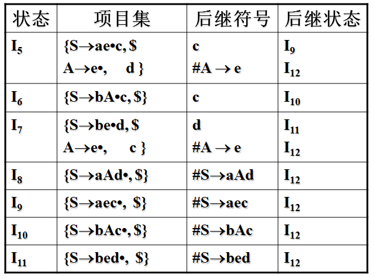


先基于LR(0)的分析表


例4-35 对文法   S→L=R | R       L→*R | i      R→L
构造LALR分析表

解：

- 增加产生式S’→ S，得到增广文法G[S’] ：
  		(0)S’→S             	(1)S→L=R
    		(2)S→R 		(3)L→*R
    		(4)L→ i           	(5)R→L

- 写出项目
  1. $\begin{aligned}&S’→\cdot S, \$\\&S→\cdot L=R, \$\\&S→\cdot R,\$
     \\&L→\cdot *R, =\\& L→\cdot i, =\\&R→\cdot L,\$\\&↑得新项目\\&L→.*R, \$\\&L→.*i, \$\\\end{aligned}$ 
     **合并**后生成的L和之前的L: 
     $\begin{aligned}&S’→\cdot S, \$\\&S→\cdot L=R, \$\\&S→\cdot R,\$
     \\&L→\cdot *R, =|\$\\& L→\cdot i, =|\$\\&R→\cdot L,\$\\\end{aligned}$ 
  2. 

#### ④LALR分析

==同心集==：具有相同核心（LR(1)项目集的第一分量集合）的项集，即**除展望符外**，两个LR(1)项目集是相同的

==LALR分析==：寻找同心集，并将它们合并成一个项集。

- 可以压缩LR(1)分析表中的状态数，从而可能得到LALR分析表
- 压缩可能导致归约/归约冲突 (此时文法不是LALR)
- 压缩不会导致移入/归约冲突


