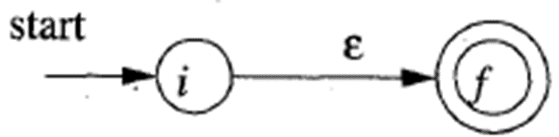

## 思政进课堂

- 选择or简答
- PPT原文 五分

## 题型

- 选择 2*5
- 填空 2*7 (程序填空)
- 解答(简答) 5\*4 + 6*2 + 8 = 40
- 综合(解答plus) 10 + 12 +14 = 36

## 1-2章

1. 什么是编译程序
   - 高级语言编写的源程序, 翻译为等价的目标程序
2. 编译程序的工作过程
   - 前端+后端
3. 上下文无关文法
   - 四要素 $V_N, V_T, S, P$
   - 推导, 句型, 句子, 语法树, 二义性

### 作业1

#### 自顶向下推导

#### 二义性证明

- 找一个串(不一定要是句子), 画出两个不一样的语法树, 即可证明

**给出语言对应的, 满足某个条件的(长度不超过5), 句子**

- 先把可以合并的产生式合并? 
- 解题步骤
  1. 描述语言: 口述 / 正则
  2. 给出所求句子

### 作业2

#### 左递归消除

##### 直接左递归的消除

处理策略：将直接左递归转化为直接右递归

- 将文法：$A→ \textcolor{red}{A} \alpha | \beta  (α≠ ε, β不以A开头)$
  转化为:   $A→ \beta A’\\ A’→ \alpha A’ | ε$ 
  - $A→ \textcolor{red}{A} \alpha | \beta$递归如果结束, 一定是选择了$\beta$, 即句子开头为$\beta$
  - 不结束的话, $A→A\alpha\Rightarrow A\alpha\alpha$, $\alpha$一直延长

- 一般形式: 
  - $$\begin{gathered}
    A→ A\alpha_1|A\alpha_2|\ldots|A\alpha_n|\beta_1|\beta_2|\ldots|\beta_m \\
    (\alpha_i\neq\varepsilon,\beta_j\text{不以}A\text{开头}) \\
     \Downarrow \\
    A→\beta_1A^{\prime}\mid\beta_2A^{\prime}\mid...\mid\beta_mA^{\prime} \\
    A'→\alpha_1A'\mid\alpha_2A'\mid...\mid\alpha_nA'\mid\varepsilon  
    \end{gathered}$$ 
  - **消除的代价**: 产生了非终结符(A’)和$\varepsilon  $产生式

##### 间接左递归的消除

==间接左递归==：由多步推导带来的左递归
例如:  

**间接左递归消除算法**
$$
\begin{align}
&按照某个顺序将非终结符号排序为A_1，A_2，… ，A_n\\
&for (i: 从1到n的每个i ) \{\\
&\qquad for (j: 从1到i-1的每个i ) \{\\
&\qquad\qquad 消除由A_j导致的左递归：即向每个形如A_i → A_jγ的产生式\textcolor{red}{代入}所有A_j为头的规则。\\
&\qquad\qquad 得 A_i → δ1 γ∣δ2 γ∣…∣δk γ ，其中A_j  → δ1∣δ2∣… ∣δk ，是所有的A_j产生式 \\
&\qquad\qquad    \}\\
&\qquad     消除A_i 产生式之间的直接左递归\\
 \}
 \end{align}
$$

- S, A
- i = S, j = null
- i = A, j = S
  - 消除S导致的左递归, 对A→Sd代入$S→Aa|b$
  - 得$A→\textcolor{red}{Aa}d|\textcolor{red}{b}d|\varepsilon$, 出现直接左递归
  - 消除直接左递归: $A→bdA'|A'\\A'→adA'|\varepsilon$

## 第3章 词法分析

1. 基本概念: 词法单元, 串, 正则式RE, 有穷自动机FA及其表示(状态转换图, 状态转换表)
   - 给一个正则, 画状态转换图
   - 给一个正则, 描述语言
2. ?
3. NFA→DFA: 子集构造法

### 作业3

**画出状态转换图**

- 先写正则, 再画转换图
- 记得可以用空边

**描述正则定义的语言**

- 没什么好说的

**给出模式组(n个正则), 对输出串xxx的识别结果**

- 最长匹配

### 作业4&5

**RE转状态图**

1. 则式ε对应 NFA 
2. 正则式$a\in \Sigma$, 对应NFA  
   - **正则转换为NFA图的边**, 而不是节点(状态)
3. 若s,t是正则式, N(s)和N(t)是对应的NFA，则`s|t`对应之NFA为: 
4. 若s, t为正则式，N(s)和N(t)是对应的NFA，则`st`对应之NFA为:  
   - 将s的结束状态和t的开始状态重合起来
5. 如果s是正则式, N(s)为对应NFA,  则`s*`对应之NFA为:  
   - 下面的空边: 匹配０次
     上面的空边: 匹配多次

### 子集构造算法

**计算量:** 

1. ε-closure(s)  : $s \in S$      ==状态s的ε闭包==
   - 从状态s出发，仅通过ε边就能达到的状态集合 
2. ε-closure(T) :$ T \sube S $   ==状态集T的ε闭包==
   - 从状态集I中任一状态出发，仅通过ε边就能达到的状态集
3. move(T,a): $T \sube S,  a\in \Sigma $  ==转移函数==
   - 对于状态集T，在输入a时，可以到达的状态集**(不考虑ε边)**

**例**

例3-22 将下面的NFA($(a|b)^*abb$)转换成DFA

| I                              | Ia                   | Ib                     |
| ------------------------------ | -------------------- | ---------------------- |
| {**0**,1,7,2,4} (开始闭包〇)   | {**3,8**, 6,1,7,2,4} | {**5**,6,1,7,2,4}      |
| {**3,8**,6,1,7,2,4} (闭包①)    | {**3,8**, …} (同①)   | {**5, 9**, 6,1,7,2,4}  |
| {**5**,6,1,7,2,4} (闭包②)      | {**3,8**, …} (同①)   | {**5**, …}             |
| {**5, 9**, 6,1,7,2,4} (闭包③)  | {**3,8**, …} (同①)   | {**10, 5**, 6,1,7,2,4} |
| {**10, 5**, 6,1,7,2,4} (闭包④) | {**3,8**, …} (同①)   | {**5**, …}             |

- 技巧 找a边和b边, 看I中有哪些边的前驱节点

简化结果

| I                          | a    | b    |
| -------------------------- | ---- | ---- |
| 0                          | 1    | 2    |
| 1                          | 1    | 3    |
| 2                          | 1    | 2    |
| 3                          | 1    | 4    |
| 4 $\cdot (用点表示终止态)$ | 1    | 2    |

###  最小化DFA

**基本思想**: 把M的状态集划分为一些不相交的子集，使得任何两个不同子集的状态是可区别的而同一子集的任何两个状态是等价的。最后，让每个子集选出一个代表，同时消去其他状态

**划分过程**

> **工作原理**：将状态集分划成多个组，每个组中的各个状态相互不可区分。然后，将每个组中的状态合并成一个状态。

1. 将状态集划分成**两组**：终结状态集 F 和 非终结状态集S - F.

2. **(循环直到不需要继续细分)** 考察当前划分中的每一组G：
     - 根据输入a后到达的结果状态是否属于同一个状态集，将G划分成若干子组，使各子组中的任意两个状态s 和 t 对于给定输入均转向划分中的同一组；并更新划分
       - 注意, 更新划分后可能导致之前属于同一组的可以被再次划分

3. 每组状态用一个状态代表，原DFA中所有由该组中状态发出的边或指向该组中某状态的边，都要与该代表状态关联。	

# 第4章 语法分析

基本概念： CFG、推导、语法分析树、语法二义性

语法分析方法：自顶向下，自底向上

自顶向下分析：LL（1）

1. 修改文法：消除左递归，提出左公因子
2. FIRST集合FOLLOW集
3. 构建预测分析表
4. 构建句子的分析过程

自底向上分析: LR(0), SLR(1), LR(1), LALR(1)

1. 构建增广文法
2. 构建LR自动机(项集闭包, 后继项集闭包)
3. 构建LR分析表
4. 进行分析

SLR(1): 只在FOLLOW(A)中填入归约项A→a

LR(1)项集闭包: 对项目[A→a•Bβ, a], 添加[B→•γ, b]到项目集, 其中$b\in FIRST(\beta a)$

## 作业7

