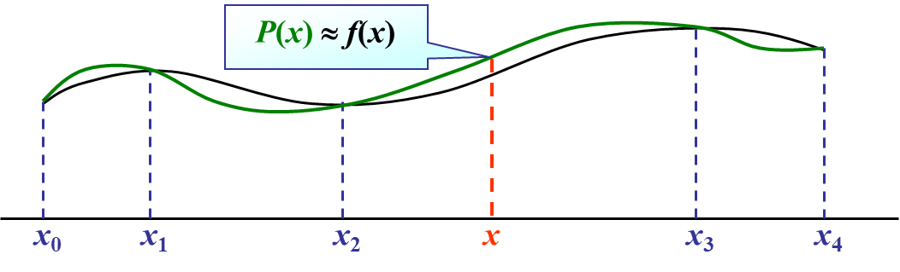
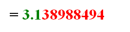

# 第1章 数值分析与科学计算引论

数值分析: 将复杂的计算式转换为指令集中定义过的+、- (×、÷)输入到计算机中, 得到**近似解**

## 1.2  误差的背景介绍

### 1.2.1 来源与分类

| 来源                           | 分类               |
| ------------------------------ | ------------------ |
| 从实际问题中抽象出数学模型     | 模型误差           |
| 通过**测量**得到模型中参数的值 | 观测误差           |
| 求近似解                       | 方法误差(截断误差) |
| 机器字长有限                   | 舍入误差           |

### 1.2.2 误差与有效数字

#### 绝对误差

==绝对误差==: $e^* = x^* - x, 其中x为精确值, x^*为x的近似值$

- 精确值x通常不可求得, 我们只能求出近似值

==绝对误差限==: $|e^*|的上限即为\epsilon^*, 称为\textcolor{#66ccff}{绝对误差限}$ 

- 工程上常记为$x = x^* \pm e^*$, 如$\int_0^1 $

- 注意: 
  e* 理论上讲是唯一确定的，可能取正，也可能取负。
  e* > 0 不唯一，当然 e* 越小越具有参考价值。

#### 相对误差

==相对误差==: $e_r^* = \frac{e^*}x ≈ \frac{e^*}{x^*}$

==相对误差限==: $\epsilon_r^* (= \frac{\epsilon^*}{x}) = \frac{\epsilon^*}{|x^*|} $

#### 有效数字

~~看不懂的~~定义: 用科学记数法, 记$近似值x^*=a_1.a_2a_3...a_n*10^m(其中a_1\neq 0)$, 若$(|e^*|=)\ |x^*-x|\leq \textcolor{red}{0.5}*10^{m-n+1}$(即$a_n$的截取按照四舍五入规则), 则称$x^*$为n位有效数字, 精确到$10^{m-n+1}$

- $m+1$: $x^*$小数点前的位数
  $n$: 有效位数
  $m-n+1$: 

#### 有效数字与相对误差的关系

1. 有效数字→相对误差
   - 已知$x^*$有n位有效数字, 其**相对误差限**为
     $\epsilon_r^*=\frac{\epsilon^*}{|x^*|}=$

#### 数值运算中的误差限

# 第2章 插值法

当精确函数 y = f(x) 非常复杂或未知时，在一系列节点 $x_0 … x_n $处测得函数值$ y_0 = f(x_0), … yn _= f(x_n)$，由此构造一个**简单易算**的近似函数 $P(x) ≈ f(x)$，满足条件$P(x_i) = f(x_i)  (i = 0, … n)$。这里的 P(x) 称为f(x) 的插值函数。

最常用的插值函数是**多项式**

### 插值多项式

> 为了使插值函数更方便在计算机上运算,一般插值函数都使用**代数多项式和有理函数**

#### 代数插值多项式的存在唯一性

设函数$y=f(x)$在区间[a,b]上的代数插值多项式为$P(x)=a_0+a_1x+a_2x^2+...+a_nx^n, P_n(x_i)=y_i, i=0, 1,2,...,n$  书上的命名是$L(x)$ 

即多项式$P_n(x)$的系数$a_0, a_1, ...,a_n$满足线性方程组

$\begin{cases}a_0+a_1x_0+a_2x_0^2+...+a_nx_0^n=y_0 \\
a_0+a_1x_1+a_2x_1^2+...+a_nx_1^n=y_1\\......\\
a_0+a_1x_n+a_2x_n^2+...+a_nx_n^n=y_n\end{cases}$ 

上述方程组的系数行列式为n+1阶的Vandermond行列式

$V=\left | \begin{matrix}
1 & x_0 & ...  & x_0^n \\
1 & x_1 & ...  & x_1^n \\
... & ... & ...  & ... \\
1 & x_n & ...  & x_n^n \\
\end{matrix} \right |  =\prod_{i=0}^{n-1}\prod_{j=i+1}^n(x_j-x_i) \neq 0 (x_i\neq x_j)$ 

==定理==: 满足$P(x_i)=y_i, i=0,1,...,n $次数不超过n的**插值多项式一定唯一存在**

- 若多项式次数≠n, 则插值多项式不唯一
  例如$P(x)=L_n(x)+p(x)\prod_{i=0}^n(x-x_i)$也是一个插值多项式，其中p(x)可以是任意多项式。

## 2.2拉格朗日插值

### 2.2.1 线性插值&抛物线插值

复读

插值的目的是求出n次多项式$P(x)=a_0+a_1x+a_2x^2+...+a_nx^n\ 使得\ P_n(x_i)=y_i, i=0,1,...,n$ 

#### 线性插值

即n=1, 已知$y_0=f(x_0), y_1=f(x_1)$ 求$P_1(x)=a_0+a_1x$满足$P_1(x_0)=y_0, P_2(x_1)=y_1$

由几何意义易得

$\begin{aligned}
\boldsymbol{P_{1}}(\boldsymbol{x})& =y_0+\frac{y_1-y_0}{x_1-x_0}(x-x_0)  \\
&={\left[\frac{x-x_1}{x_0-x_1}\right]}y_0+{\left[\frac{x-x_0}{x_1-x_0}\right]}y_1=\sum_{i=0}^{1}\textcolor{red}{l_i(x)}y_i
\end{aligned}$              $\begin{aligned} l_0(x)=\frac{x-x_1}{x_0-x_1}\\l_1(x)=\frac{x-x_0}{x_1-x_0}\end{aligned}$ 

#### 抛物线插值

即n=2, … 略!

### 2.2.2 拉格朗日插值多项式

**==定义—n次插值基函数==**

若n次多项式$l_j(x)(j=0,1,...,n)$在$n+1$个节点$x_0<x_1<...<x_n$上满足条件$l_j(x_k)=\delta_{jk}=\begin{cases}1,&k=j\\0,&k\neq j\end{cases}\quad j,k=0,1,...,n$, 则称这n+1个n次多项式$l_0(x), l_1(x),...,l_n(x)为节点x_0,x_1,...,x_n$上的**n次插值基函数**

与上面的例子类似, 可以推导得出n次插值基函数为$\begin{aligned}
l_k(x)& =\frac{(x-x_0)(x-x_1)\cdots(x-x_{k-1})(x-x_{k+1})\cdots(x-x_n)}{(x_k-x_0)(x_k-x_1)\cdots(x_k-x_{k-1})(x_k-x_{k+1})\cdots(x_k-x_n)}  \\
&=\prod_{i=0}^n\frac{\left(x-x_i\right)}{\left(x_k-x_i\right)}\quad\quad k=0,1,2,\cdots,n \\
\end{aligned}$ 

所以$\color{blue}L_n(x)=\sum_{k=0\\}^ny_kl_k(x)$, 由$l_k(x)$的定义可知$L_n(x_j)=\sum_{k=0\\}^n y_kl_k(x_j)=y_j,j=0,1,...,n$ 满足插值多项式的定义

将形如上述$L_n(x)$的插值多项式称为**拉格朗日(Lagrange)插值多项式**

**简化写法**

记$\omega_{n+1}(x)=(x-x_0)(x-x_1)...(x-x_n)$, 可得$\omega_{n+1}^{\prime}(x_k)=(x_k-x_0)(x_k-x_1)\cdot \cdot\cdot (x_k-x_{k-1})(x_k-x_{k+1})\cdot \cdot \cdot (x_k-x_n)$ 

得$\begin{aligned}
l_k(x)& \begin{aligned}&=\frac{(x-x_0)(x-x_1)\cdots(x-x_{k-1})(x-x_{k+1})\cdots(x-x_n)}{(x_k-x_0)(x_k-x_1)\cdots(x_k-x_{k-1})(x_k-x_{k+1})\cdots(x_k-x_n)}\end{aligned}=\textcolor{blue}{\frac{\omega_{n+1}(x)}{\omega_{n+1}^{\prime}(x_k)(x-x_k)}}\quad\quad\quad k=0,1,2,\cdots,n
\end{aligned}$ 

$$
\textcolor{blue}{L_n(x)}=\sum_{k=0\\}^ny_kl_k(x): Lagrange插值多项式\\
\textcolor{blue}{l_k(x)}=\frac{\omega_{n+1}(x)}{\omega_{n+1}^{\prime}(x_k)(x-x_k)}: Lagrange插值基函数
$$

### 2.2.3 插值余项&误差估计

设区间[a, b]上f(x)的差值多项式为n阶的$L_n(x)$, 令余项$R_n(x) = f(x) - L_n(x)$

显然, 在插值节点$x_i$上有$R_n(x_i) = f(x_i) - L_n(x_i) = 0$ 

因此, $R_n(x)$在[a, b]上有n+1个零点

**设**$R_n(x) = K(x)\omega_{n+1}(x);\quad \omega_{n+1}(x) = (x-x_0)(x-x_1)...(x-x_n)$

此时有$R_n(x) = K(x)\omega_{n+1}(x) = f(x) - L_n(x)$ 

….

得

==拉格朗日型余项定理==: $R_n(x) = K(x)\omega_{n+1}(x) =\frac{f^{(n+1)}(\xi)}{(n+1)!}\omega_{n+1}(x), 其中\omega_{n+1}(x)=\prod_{i=0}^{n}(x-x_i), \xi\in(a,b)$ 

## 2.3均差与牛顿插值多项式

### 2.3.1 插值多项式的逐次生成

Lagrange插值多项式的基函数为$l_i(x)=\prod_{j=0\and j\neq i}^{n}\frac{(x-x_j)}{(x_i-x_j)}$

当需要增加节点时, 所有基函数$l_i(x)$都需要重新计算

考虑使用一种逐次生成插值多项式的方法, 记为$P_n(x)$ 

$对0次插值,P_0(x)=f(x_0)$

对1次插值, $\begin{cases}P_1(x_0)=f(x_0)\\P_1(x_1)=f(x_1)\end{cases}$

$$ P_1(x)=f(x_0)+\frac{f(x_1)-f(x_0)}{x_1-x_0}(x_1-x_0)(点斜式)=P_0(x)+a_1(x-x_0)$$ 

对2次插值, $\begin{cases}P_2(x_0)=f(x_0)\\P_2(x_1)=f(x_1)\\P_2(x_1)=f(x_2)\end{cases}$

$P_2(x)=P_1(x)+a_2(x-x_0)(x-x_1)$

…. TODO

可得, $P_n(x)=a_0+a_1(x-x_0)+a_2(x-x_0)(x-x_1)+...+a_n(x-x_0)(x-x_1)...(x-x_n)$

其中$a_0, a_1, ...,a_n可由P_n(x_i)=f(x_i)计算得到$

$P(x_0)=a_0=f(x_0)\\P(x_1)=a_0+a_1(x_1-x_0)=f(x_1)得a_1=\frac{f(x_1)-f(x_0)}{x_1-x_0}\\P$ 

### 2.3.2 均差及其性质

==差商(均差, devided difference)的定义==:

 $一阶差商: f[x_0,x_i]=\frac{f(x_1)-f(x_0)}{x_1-x_0}\\ 
二阶差商: f[x_0, x_1,x_2] =\frac{f[x_1,x_2]-f[x_0,x_1]}{x_2-x_0}\\...\\
k+1阶差商: \begin{aligned}
f[x_0,...,x_{k+1}]& =\frac{f[x_0,x_1,...,x_k]-f[x_1,...,x_k,x_{k+1}]}{x_0-x_{k+1}}  \\
&=\frac{f[x_0,...,x_{k-1},x_k]-f[x_0,...,x_{k-1},x_{k+1}]}{x_k-x_{k+1}}
\end{aligned}$  

是递归定义的

k+1阶差商只需要任选两个k阶差商相减, 并没有固定选择的要求

#### 均差的性质 ※

##### k阶均差-f(x)的线性表示

$\begin{aligned}
f[x_0,x_1,\cdots,x_{k-1},x_k]&=\sum_{i=0}^k\frac{f(x_i)}{(x_i-x_0)\cdots(x_i-x_{i-1})(x_i-x_{i+1})\cdots(x_i-x_k)} \\
&=\sum_{i=0}^k\frac{f(x_i)}{\omega_{k+1}^{\prime}(x_i)} \\
&\textbf{其中}\quad\omega_{k+1}(x)=\prod_{i=0}^k\left(x-x_i\right),\quad\omega_{k+1}^{\prime}(x_i)=\prod_{j=0}^k\left(x_i-x_j\right)
\end{aligned}$

##### 差商与顺序无关

### 2.3.3 牛顿插值多项式

$N_n(x)=\alpha_0+\alpha_1(x-x_0)+\alpha_2(x-x_0)(x-x_1)+....+\alpha_n(x-x_0)...(x-x_{n-1})$

$\left.\left\{\begin{array}{cccc|c}f(x)=f(x_0)+f[x,x_0](x-x_0) & \\ f[x,x_0]=f[x_0,x_1]+f[x,x_0,x_1](x-x_1) \\ ....................\\ f[x,x_0,...,x_{n-1}]=f[x_0,...,x_{n}]+f[x,x_0,...,x_{n}](x-x_{n})\quad& \end{array}\right.\right.$

把后一式带入前一式 $f(x)=\boxed{f(x_0)+f[x_0,x_1](x-x_0)+f[x_0,x_1,x_2](x-x_0)(x-x_1)+...}$

$(+f[x_0,...,x_n](x-x_0)...(x-x_{n-1})$ $+f[x,x_0,...,x_n](x-x_0)...(x-x_{n-1})(x-x_n)$

$N_n(x)$ $a_i=f[X_0,\ldots,X_i]$ $R_n(x)$

n阶插值多项式$P_n(x)=f[x_0,...,x_n]x^n+?x^{n-1}+...+?x+?1$, **最高项系数**一定为n阶差商

↑可以用来证明性质1, 结合拉格朗日插值公式

## 2.4埃尔米特插值

> 埃米特插值: 不仅要求函数值相等, 还要求若干阶导数相等

==埃尔米特插值==: 要求插值函数 P (x) 满足$P(x_i) = f (x_i), P’ (x_i) = f ’ (x_i),…, P^{(m)} (x_i) = f^{ (m)} (x_i)$ 

**注意:** 

- N 个条件可以确定N-1阶多项式
- 要求在1个节点$ x_0 $处直到**m 阶导数**都重合的插值多项式即为Taylor多项式
  - $\begin{gathered}
    \begin{aligned}P(x)=f(x_0)+f'(x_0)(x-x_0)+...+\frac{f^{(m)}(x_0)}{m!}(x-x_0)^m\end{aligned} \\
    \textbf{其余项为}\quad R(x)=f(x)-P(x)=\frac{f^{(m+1)}(\xi)}{(m+1)!}(x-x_0)^{(m+1)} 
    \end{gathered}$
- 一般只考虑$f$与$f ’$的值。

Hermite插值计算出的**多项式次数**

> 给定n+1个点前面的插值函数最高只有n阶 (列出n+1个方程, 解得n个待定系数)

### 两点三次Hermite插值

> 考虑只有两个节点的插值问题

设$f(x)$在节点$x_0,x_1$处的函数值为$y_0,y_1$ 在节点 $x_0,x_1$处的的一阶导数值为 $y_0^{\prime},y_1^{\prime}$

两个节点最高可以用$2\times1+1=3$次$Hermite$多项式$H_{3}(x)$

 $H_3(x)$应满足插值条件

$$
H_3(x_0)=y_0\quad H_3(x_1)=y_1\\
H_3^{\prime}(x_0)=y_0^{\prime}\quad H_3'(x_1)=y_1'
$$
用四个基函数表示$\color{blue}H_3(x) = y_0α_0(x) + y_1\alpha_1(x)+y_0'\beta_0(x)+y'\beta_1(x)$ 

可得
$$
\begin{aligned}&\color{red}{{\alpha_0(x_0)=1}}\quad\color{red}{{\alpha_0(x_1)=0}}\quad\color{red}{{\alpha_0^{\prime}(x_0)=0}}\quad\color{red}{{\alpha_0^{\prime}(x_1)=0}}\\
&\alpha_1(x_0)=0\quad\alpha_1(x_1)=1\quad\alpha_1^{\prime}(x_0)=0\quad\alpha_1^{\prime}(x_1)=0\\
&\beta_0(x_0)=0\quad\beta_0(x_1)=0\quad\beta_0^{\prime}(x_0)=1\quad\beta_0^{\prime}(x_1)=0\\
&\beta_0(x_0)=0 \quad\beta_1(x_0)=0\quad\beta_1^{\prime}(x_1)=0\quad\beta_1^{\prime}(x_1)=1 \ \end{aligned}
 \Longrightarrow
\begin{cases}对\alpha(x): 只有\textcolor{blue}{{a_i(x_i)=1}} ,其余为0\\ 对\beta(x): 只有\textcolor{blue}{\beta_i'(x_i)=1},其余为0\end{cases}
$$

因为$H_3(x)$是3次多项式, 所以$\alpha_0(x)$最高也为3次, $\color{orange}\begin{cases}\alpha_0(x_0)=1&\alpha_0'(x_0)=0&①\\\alpha_0(x_1)=0 &\alpha_0'(x_1)=0&②\end{cases}$

- 在$x_1$处, $\color{orange}②\quad \alpha_0(x_1)=\alpha_0'(x_1)=0 $, 即$x_1$为$\alpha_0$的**二重零点**, 函数值为0, 导数也为0
  可设$\color{blue}\alpha_0(x)=(x-x_1)^2(\alpha x+b)$ 
- 在$x_0$处, $\color{orange}①\quad \alpha_0(x_0)=1\ \ \alpha_0'(x_0)=0$ , 代入得$a=-\frac2{\left(x_0-x_1\right)^3}\quad b=\frac1{\left(x_0-x_1\right)^2}+\frac{2x_0}{\left(x_0-x_1\right)^3}$

**代入得**

$$
\begin{aligned}
\alpha_0(x)& =\textcolor{blue}{(x-x_1)^2(ax+b)}  \\
&=(x-x_1)^2\left(-\frac{2x}{\left(x_0-x_1\right)^3}+\frac1{\left(x_0-x_1\right)^2}+\frac{2x_0}{\left(x_0-x_1\right)^3}\right) \\
&=\frac{(x-x_1)^2}{\left(x_0-x_1\right)^2}\quad\left(1+\frac{2x_0}{x_0-x_1}-\frac{2x}{x_0-x_1}\right) \\
&=\left(1+2\frac{x-x_0}{x_1-x_0}\right)\left(\frac{x-x_1}{x_0-x_1}\right)^2=\color{blue} (1+2l_1(x))\cdot l_0^2(x)\\
\text{即}&\quad\alpha_0(x)=(1+2l_1(x))\cdot l_0^2(x)~=\left(1+2\frac{x-x_0}{x_1-x_0}\right)\!\left(\frac{x-x_1}{x_0-x_1}\right)^2
\end{aligned}
$$

**类似可得**
$$
\begin{aligned}\\\alpha_1(x)&=(1+2l_0(x))\cdot l_1^2(x)=\left(1+2\frac{x-x_1}{x_0-x_1}\right)\left(\frac{x-x_0}{x_1-x_0}\right)^2\\\beta_0(x)&=(x-x_0)\cdot l_0^2(x)~=\left(x-x_0\right)\left(\frac{x-x_1}{x_0-x_1}\right)^2\\\beta_1(x)&=(x-x_1)\cdot l_1^2(x)~=\left(x-x_1\right)\left(\frac{x-x_0}{x_1-x_0}\right)^2\end{aligned}
$$

代入$\color{blue}H_3(x) = y_0α_0(x) + y_1\alpha_1(x)+y_0'\beta_0(x)+y'\beta_1(x)$ 得
$$
\begin{aligned}
\textcolor{blue}{H_{3}}(& x)=y_{0}\alpha_{0}(x)+y_{1}\alpha_{1}(x)+y_{0}^{\prime}\beta_{0}(x)+y_{1}^{\prime}\beta_{1}(x)  \\
&=y_0(1+2l_1(x))\cdot l_0^2(x)+y_1(1+2l_0(x))\cdot l_1^2(x) \\
&\qquad+y_0^{\prime}(x-x_0)\cdot l_0^2(x)^2+y_1^{\prime}(x-x_1)\cdot l_1^2(x) \\
&=y_0\Bigg(1+2\frac{x-x_0}{x_1-x_0}\Bigg)\Bigg(\frac{x-x_1}{x_0-x_1}\Bigg)^2+y_1\Bigg(1+2\frac{x-x_1}{x_0-x_1}\Bigg)\Bigg(\frac{x-x_0}{x_1-x_0}\Bigg)^2 \\
&\qquad+y_0^{\prime}(x-x_0)\left(\frac{x-x_1}{x_0-x_1}\right)^2+y_1^{\prime}(x-x_1){\left(\frac{x-x_0}{x_1-x_0}\right)}^2
\end{aligned}
$$

### 两点三次Hermite插值的余项

两点三次Hermite插值的误差为$R_3(x) = f(x)-H_3(x)$

有$$\begin{cases}
R_3(X_i) =f(x_i)-H_3(x_i)=0  \\
R_3^{\prime}(X_i) =f^{\prime}(x_i)-H^{\prime}_3(x_i)=0 
\end{cases} \qquad i=0,1$$ 

所以$x_0, x_1$均为$R_3(x)$的二重零点, 可设$R_3(x) = K(x)(x-x_0)^2(x-x_1)^2, K(x)待定$ 

设辅助函数$$\varphi(t)=f(t)-H_3(t)-K(x)(t-x_0)^2(t-x_1)^2$$ 

则有
$$
\begin{cases}
\varphi(x_i) \begin{aligned}&=f(x_i)-H_3(x_i)-K(x)(x_i-x_0)^2(x_i-x_1)^2=0\end{aligned} &i=0,1\\
\varphi(x) =f(x)-H_3(x)-K(x)(x-x_0)^2(x-x_1)^2=0 
\end{cases}
$$
至少有5个零点 ($\varphi(x_0), \varphi(x_1)四个, \varphi(x)至少一个$)

用4次Rolle定理, 即可得, $至少存在一点\xi \in[x_0, x_1], 使得\varphi^{(4)}(x)=0$, 即 $\varphi^{(4)}(\xi) = f^{(4)}(\xi)-4!K(x) = 0 \quad(H_3(x)三次,导没了)$

所以,两点三次Hermite插值的余项为
$$
R_3(x) = \frac{f^{(4)}(\xi)}{4!}(x-x_0)^2(x-x_1)^2 \quad其中\xi \in[x_0, x_1]
$$

### 高次Hermite插值

作为多项式插值,三次已是较高的次数，次数再高就有可能发生Runge现象

因此，对有n+1节点的插值问题，我们可以使用分段两点三次Hermite插值

## 2.5分段低次插值

### 2.5.1 Runge现象

$\textbf{在}[-5,5]\textbf{上考察}f(x)=\frac1{1+x^2}\textbf{ 的}L_n(x)\text{。 取 }x_i=-5+\frac{10}ni\quad(i=0,...,n)$

- n越大，端点附近抖动越大，称为Runge现象 ($L_n(x) \not\rightarrow f (x)$)

### 2.5.2 分段线性插值

## 2.6 埃米特插值(分段三次插值)

## 2.6三次样条插值

> 第三章 不需要了

# 第4章 数值积分

## 4.1 数值积分概论

### 4.1.1 数值积分基本思想

对于积分 $I(f)=\int_a^bf(x)dx $

如果知道$f(x)$的原函数$F(x)$, 则由牛顿-莱布尼茨公式有
$$
\int_a^bf(x)dx = F(x)|_a^b = F(b)-F(a)
$$
但是在工程和科研中, 常出现以下问题

1. $f(x)$的解析式不存在, 只给出了$f(x)$的数值
2. $f(x)$的原函数$F(x)$求不出来, 如$F(x)$不是初等函数
3. $f(x)$表达式复杂, $F(x)$很难求出

**简单的积分近似计算方式:** 
$$
梯形公式: T=\frac{b-a}2[f(b)+f(a)]\\
中矩形公式: R=(b-a)f(\frac{b+a}2)\\
机械求积: \textcolor{blue}{\int_a^bf(x)dx\approx \sum_{k=0}^nA_kf(x_k)}, 其中x_k称为求积节点, A_k称为求积系数
$$

- 求积节点一般是给定的, 我们的目标就是确定==求积系数==$A_k$ 

### 4.1.2 插值多项式计算积分

> 积分的近似计算方法很多,但为方便起见,最常用的一种方法是利用插值多项式来构造数值求积公式,具体步骤如下:

在积分区间$[a, b]$上取n+1个插值节点$a\leq x_0< x_1...< x_n\leq b$

$f(x)$的n次插值多项式: $L_n(n) = \sum_{k=0}^nf(x_k)l_k(x), l_k(x)为插值基函数$

## 4.2 Newton-Cotes数值求积分

### 4.2.1 NewTon-Cotes公式

> 牛顿–柯特斯公式

Newton-Cotes公式是指等距节点下使用Lagrange插值多项式建立的数值求积公式

设函数$f(x)\in C[a,b]$, ($C[a,b]: 在[a,b]上连续的函数集合$)

将积分区间$[a,b]$分割成n等分, 各个节点为$x_k = a + kh, h = \frac{b-a}{n}$

使用Lagrange插值得: $L_n(x)=\sum_{k=0}^nf(x_k)l_k(x)\quad R_n(x)=\frac{f^{(n+1)}(\xi)}{(n+1)!}\omega_{n+1}(x)\\$

- 其中 $l_k(x)=\prod_{\substack{0\leq j\leq n\\j\neq k}}\frac{x-x_j}{x_k-x_j}\quad\xi\in[a,b]\quad\omega_{n+1}(x)=\prod_{i=0}^n(x-x_i)$ 

此时积分准确值$I = \int_a^bf(x)dx = \int_a^b[L(x)+R(x)]dx = \int_a^bf(x_k)l(x_k)dx + \int_a^bR(x)dx = \sum_{k=0}^n A_kf(x_k)+\int_a^bR(x)dx\\$

- 其中 $$A_k=\int_a^bl_k(x)dx=\int_a^b\prod_{0\leq j\leq n \and j\neq k}\frac{x-x_j}{x_k-x_j}dx\\$$

令$$I_n(f)=\sum_{k=0}^nA_kf(x_k)\\R(I_n)=\int_a^bR_n(x)dx$$得, $I(f) = I_n(f)+R(I_n), I(f)\approx I_n(f)$

- ==n阶Newton-Cotes求积公式==: $I_n(f)=\sum_{k=0}^nA_kf(x_k)$
- ==Newton-Cotes公式的余项==: $R(I_n)=\int_a^bR_n(x)dx \quad 其中, R_n(x)=\frac{f^{(n+1)}(\xi)}{(n+1)!}\omega_{n+1}(x)\\$ 

**A~k~的计算与Cotes系数**

> $A_k=\int_a^bl_k(x)dx=\int_a^b\prod_{0\leq j\leq n \and j\neq k}\frac{x-x_j}{x_k-x_j}dx\\$ 

$$
\begin{aligned}
&设x=a+th, 由x\in[a, b], 得t\in[0, n]\\
A_{k} &=\int_a^b\prod_{\substack{0\leq j\leq n\\j\neq k}}\frac{x-x_j}{x_k-x_j}dx=\int_0^n\Bigg(\prod_{\substack{0\leq j\leq n\\j\neq k}}\frac{(t-j)h}{(k-j)h}\Bigg)\cdot h\cdot dt\\
& =\frac{h\cdot(-1)^{n-k}}{k!\cdot(n-k)!}\int_0^n\prod_{\begin{matrix}0\leq j\leq n\\j\neq k\end{matrix}}(t-j)dt\\
& =(b-a)\cdot\frac{(-1)^{n-k}}{n\cdot k!\cdot(n-k)!}\int_0^n\prod_{0\leq j\leq n}(t-j)dt\\
\end{aligned}
$$
$A_k=\begin{pmatrix}b-a\end{pmatrix}\cdot C_k^{(n)}$

$\therefore I_n(f)=\sum_{k=0}^nA_kf(x_k)=\begin{pmatrix}b-a\end{pmatrix}\cdot \sum_{k=0}^nC_k^{(n)}f(x_k)\\$

- $C_k^{(n)}$==称为Cotes系数==
- Cotes 系数仅取决于 n 和 k，可查表得到。与 f (x) 及区间[a, b]均无关。

### 4.2.2 低阶Newton-Cotes公式及其余项

> 在Newton-Cotes公式中,n=1,2,4时的公式是最常用也最重要三个公式,称为低阶公式

#### 梯形公式

**梯形求积公式**
$$
\begin{aligned}
&n=1,x_0=a,x_1=b,h=b-a\\
&\text{Cotes系数为} \begin{cases}C_0^{(1)}=-\int_0^1(t-1)dt=\frac12\\
C_1^{(1)}=\int_0^1tdt=\frac12\end{cases}
\\&I_1(f)=(b-a)\sum_{k=0}^1C_k^{(1)}f(x_k)=\frac{b-a}2[f(x_0)+f(x_1)]

\\
&\text{即 }I_1(f)=\frac{b-a}2[f(a)+f(b)]\end{aligned}
$$

==梯形求积公式==(两点公式): $T=I_1(f)=\frac{(b-a)}2[f(a)+f(b)]\\$

**梯形公式余项**

> $R_n(x)=\frac{f^{(n+1)}(\xi)}{(n+1)!}\omega_{n+1}(x)$

$R(T)=R(I_1)=\int_a^bR_1(x)dx$

$\begin{aligned}
R(T)& =\int_a^b\frac{f''(\xi_x)}{2}(x-a)(x-b)dx  \\
&=\frac{f^{\prime\prime}(\eta)}2\int_a^b(x-a)(x-b)dx \\
&=-\frac{f^{\prime\prime}(\eta)}2\frac{(b-a)^3}6 \\
&=-\frac{(b-a)^3}{12}f^{\prime\prime}(\eta)
\end{aligned}$

$\therefore\ \mid R(T)\mid\leq\frac{(b-a)^3}{12}M_2\quad M_2=\max_{x\in[a,b]}\mid f^{\prime\prime}(x)\mid $

- 梯形(trapezia)公式具有1次代数精度

#### Simpson公式

$$
\begin{aligned}
&\text{取}n=2,\text{则}x_0=a,x_1=\frac{b+a}2,x_2=b,h=\frac{b-a}2& \\
&\text{Cotes系数为}\quad \begin{cases}C_0^{(2)}=\frac{1}{4}\int_0^2(t-1)(t-2)dt=\frac{1}{6}\\
C_1^{(2)}=\frac{-1}{2}\int_0^2t(t-2)dt=\frac{4}{6} \\
C_2^{(2)}=\frac{1}{4}\int_0^2(t-1)tdt=\frac{1}{6} \end{cases}\\
&\text{求积公式为} \quad I_2=(b-a)\sum_{k=0}^2C_k^{(2)}f(x_k)\\
\end{aligned}
$$

==Simpson求积公式==(三点公式, 抛物线公式): $$\begin{aligned}S=I_2(f)&=(b-a)[\frac16f(x_0)+\frac46f(x_1)+\frac16f(x_2)]\\&=\frac{b-a}6[f(a)+4f(\frac{a+b}2)+f(b)]\end{aligned}$$

==Simpson公式的余项==: $R(S)=R(I_2)=\int_a^bR_2(x)dx =-\frac{b-a}{180}\Big(\frac{b-a}{2}\Big)^4f^{(4)}(\eta)\\$

- Simpson公式具有3次代数精度

|                           | 公式                                       | 余项$R[f]$                                          | 步长h           | 余项$R[f]$ (用h表示)                                      | 代数精度 |
| ------------------------- | ------------------------------------------ | --------------------------------------------------- | --------------- | --------------------------------------------------------- | -------- |
| n=1(梯形公式)             | $\frac{(b-a)}2[f(a)+f(b)]\\$               | $-\frac{(b-a)^3}{12}f^{\prime\prime}(\xi)\\$        | $b-a$           | $-\frac{(b-a)^3}{12}f^{\prime\prime}(\xi), \xi\in[a,b]\\$ | 1        |
| n=2(Simpson公式)          | $\frac{b-a}6[f(a)+4f(\frac{a+b}2)+f(b)]\\$ | $-\frac{b-a}{180}(\frac{b-a}2)^4f^{(4)}(\xi)\\$     | $\frac{b-a}2\\$ | $-\frac1{90}h^5f^{(4)}(\xi), \xi\in[a,b]\\$               | 3        |
| n = 3: Simpson’s 3/8-Rule |                                            |                                                     | $\frac{b-a}3\\$ | $-\frac3{80}h^5f^{(5)}(\xi)\\$                            | 3        |
| n = 4: Cotes Rule         |                                            | $-\frac{2(b-a)}{945}(\frac{b-a}4)^6f^{(6)}(\eta)\\$ | $\frac{b-a}4\\$ | $-\frac8{945}h^7f^{(6)}(\xi)\\$                           | 5        |

==定理==：当n为偶数时，Newton-Cotes公式至少具有n+1次代数精度

**证明：当n为偶数时， Newton-Cotes公式对$x^{n+1}$的余项为0**

$$
\begin{aligned}
&\begin{cases}
R_n(x)=f(x)-P_n(x)=\frac{f^{(n+1)}(\xi)}{(n+1)!}(x-x_0)\cdots(x-x_n)=\prod_{j=0}^n(x-x_j) \\\\
R(I_n)=\int_a^bR_n(x)dx=\int_a^b\prod_{j=0}^n(x-x_j)dx\\ 
\end{cases}
\\
&令x=a+th\quad \int_a^bR_n(x)dx=\int_0^nh\prod_{j=0}^n(a+th-a-jh)dt=h^{n+2}\int_0^n\prod_{j=0}^n(t-j)dt \\
&\text{令}t=\mu+\frac n2 \quad\int_0^n\prod_{j=0}^n(t-j)dt=\int_{-\frac n2}^{\frac n2}\prod_{j=0}^n(\mu+\frac n2-j)d\mu=\int_{-\frac n2}^{\frac n2}\prod_{j=-\frac n2}^{\frac n2}(\mu-j)d\mu \\
&被积函数\prod_{j=-\frac n2}^{\frac n2}(\mu-j)是奇函数 \\

&令g(\mu)= \prod_{-\frac n2}^{\frac n2}(\mu-j)=(\mu+\frac n2)(\mu+\frac n2-1)\cdots\mu\cdots(\mu-\frac n2+1)(\mu-\frac n2)  \\
&g(-\mu)= (-\mu+\frac{n}{2})(-\mu+\frac{n}{2}-1)\cdots(-\mu)\cdots(-\mu-\frac{n}{2}+1)(-\mu-\frac{n}{2})  \\
&g(-\mu)= \begin{pmatrix}-1\end{pmatrix}^{n+1}g(\mu)=-g(\mu) \\
&\therefore \int_{-\frac n2}^{\frac n2}\prod_{j=-\frac n2}^{\frac n2}(\mu-j)d\mu = 0\\
&\therefore R(I_n)=\int_a^bR_n(x)dx=\int_0^n\prod_{j=0}^n(t-j)dt = \int_{-\frac n2}^{\frac n2}\prod_{j=-\frac n2}^{\frac n2}(\mu-j)d\mu  = 0

\end{aligned}
$$

### 4.2.3 Newton-Cotes公式的稳定性

## 4.3 复合求积公式

当积分区间$[a,b]$长度较大, 节点数n+1固定时, 使用Newton-Cotes的误差较大

- 考虑提高n, 过高次数的插值, 公式的舍入误差很难控制
- Newton-Cotes公式在$n\geq 8$时不稳定

为了提高公式的精度,又使算法简单易行,往往使用**复合方法**

- 将$[a,b]$分为若干小区间, 在小区间内使用低阶Newton-Cotes, 最后累加

高次插值有Runge 现象，故采用分段低次插值 → ==分段低次合成的 Newton-Cotes 复合求积公式==。

### 4.3.1 复合梯形公式

分割: $h = \frac{b-a}{n}, x_k=a+hk(k=0,1,\cdots,n)$

在第k个区间($[x_k,x_{k+1}]$)上用梯形公式, 然后累加: 

$$
\int_{x_k}^{x_{k+1}}f(x)dx\approx\frac{x_{k+1}-x_k}2[f(x_k)+f(x_{k+1})],\quad k=0,...,n-1\quad \Longrightarrow \\\int_a^bf(x)dx\approx\sum_{k=0}^{n-1}\frac h2[f(x_k)+f(x_{k+1})]=\frac h2{\left[f(a)+2\sum_{k=1}^{n-1}f(x_k)+f(b)\right]}=\color{blue}{T_n}
$$

$$
\textcolor{blue}{T_n}=\frac h2[f(a)+2\sum_{k=1}^{n-1}f(x_k)+f(b)]
$$

- 头, 末尾($a = x_0, b = x_n$)加1次, 其他节点被加两次
  

### 4.3.2 复合Simpson公式

==复合Simpson公式==:$h=\frac{b-a}n,x_k=a+kh\quad(k=0,...,n) \\
\int_{x_k}^{x_{k+1}}f(x)dx\approx\frac h6[f(x_k)+4f(x_{k+\frac12})+f(x_{k+1})]
$ 

- 因为simpson最少需要三个插值点, 在$x_k和x_{k+1}$之间插入一个点$x_{k+\frac12}$ 
  - *n=2→n=3, 并不会增加过多的误差* 
    *~~神奇的分数下标~~*
-  
  $x_k$被加两次→$2f(x_k)$, $x_{k+\frac{1}{2}}$不会重复加→$4f(x_{k+\frac12})$

得$\int_a^bf(x)dx\approx\frac h6[f(a)+4\sum_{k=0}^{n-1}f(x_{k+\frac12})+2\sum_{k=1}^{n-1}f(x_k)+f(b)]=\color{blue}{S_n}\\$

例: 使用各种复合求积公式计算定积分 $I=\int_0^1\frac{\sin x}xdx\\$

为简单起见,依次使用8阶复合梯形公式、4阶复合Simpson公式和2阶复合Cotes公式

可得各节点的值如表

| Trapz | Simpson             | Cotes               | $x_i$ | $f(x_i)$    |
| ----- | ------------------- | ------------------- | ----- | ----------- |
| $x_0$ | $x_0$               | $x_0$               | 0     | 1           |
| $x_1$ | $x_{0+\frac{1}{2}}$ | $x_{0+\frac{1}{4}}$ | 0.125 | 0.99739787  |
| $x_2$ | $x_1$               | $x_{0+\frac{1}{2}}$ | 0.25  | 0.98961584  |
| $x_3$ | $x_{1+\frac{1}{2}}$ | $x_{0+\frac{3}{4}}$ | 0.375 | 0.97672674  |
| $x_4$ | $x_2$               | $x_1$               | 0.5   | 0.95885108  |
| $x_5$ | $x_{2+\frac{1}{2}}$ | $x_{1+\frac{1}{4}}$ | 0.625 | 0.93615564  |
| $x_6$ | $x_3$               | $x_{1+\frac{1}{2}}$ | 0.75  | 0.90885168  |
| $x_7$ | $x_{3+\frac{1}{2}}$ | $x_{1+\frac{3}{4}}$ | 0.875 | 0.87719257  |
| $x_8$ | $x_4$               | $x_2$               | 1     | 0.841470981 |

$\begin{aligned}
&T_8=\frac{1}{16}[f(0)+2\sum_{k=1}^7f(x_k)+f(1)]=0.94569086 \\
&S_4=\frac{1}{24}[f(0)+4\sum_{k=0}^3f(x_{k+\frac12})+2\sum_{k=1}^3f(x_k)+f(1)]=0.94608331 \\
&C_{2}=\frac1{180}[7f(0)+\sum_{k=0}^1[32f(x_{k+\frac14})+12f(x_{k+\frac24})+32f(x_{k+\frac34})]+14\sum_{k=1}^1f(x_k)+7f(1)]=0.94608307
\end{aligned}$ 

$\begin{aligned}
&T_8 = 0.94569086 \quad 精度最低\\&S_4=0.94608331 \quad 精度次高\\&C_2=0.94608307\quad 精度最高\\
&精确值I  =0.946083070367183\end{aligned}$

- 但是误差和收敛速度还需要考虑

### 4.3.3 复合求积公式的余项和收敛的阶

**余项**

|       | 求积公式                                                     | 单纯求积公式的余项                                  | 复合求积公式的余项                                |
| ----- | ------------------------------------------------------------ | --------------------------------------------------- | ------------------------------------------------- |
| $T_n$ | $\frac h2[f(a)+2\sum_{k=1}^{n-1}f(x_k)+f(b)]\\$              | $-\frac{(b-a)}{12}(b-a)^2f''(\eta)\\$               | $-\frac{(b-a)}{12}(h)^2f''(\eta)\\$               |
| $S_n$ | $\frac h6[f(a)+4\sum_{k=0}^{n-1}f(x_{k+\frac12})+2\sum_{k=1}^{n-1}f(x_k)+f(b)]\\$ | $-\frac{b-a}{180}(\frac{b-a}2)^4f^{(4)}(\eta)\\$    | $-\frac{b-a}{180}(\frac{h}2)^4f^{(4)}(\eta)\\$    |
| $C_2$ |                                                              | $-\frac{2(b-a)}{945}(\frac{b-a}4)^6f^{(6)}(\eta)\\$ | $-\frac{2(b-a)}{945}(\frac{h}4)^6f^{(6)}(\eta)\\$ |

- 复合求积公式的误差就是将小区间(长度为步长h)的误差逐个累加

**收敛阶**

==定义==: 若一个积分公式的误差满足 $\lim_{h\to0}\frac{R[f]}{h^p}=C<\infty, 且C\neq 0$ 则称该公式是$p$ 阶收敛的。

例: 计算$π = \int_0^1\frac{4}{1+x^2}dx\\$ 

-  
-  

例2: **给定精度$\varepsilon$, 如何取n** ( 要求$|I-T_n|< \varepsilon$, 如何判断n=?)

$|R[f]| = |-\frac{h^2}{12}(b-a)f''()|\leq |-\frac{h^2}{12}(b-a)|M_2$ 

- 

## 4.4 龙贝格求积公式

> 复合梯形公式: $\textcolor{blue}{T_n}=\frac h2[f(a)+2\sum_{k=1}^{n-1}f(x_k)+f(b)]$

在复合梯形公式的基础上, 将[a, b]分隔成2n等份, 且$h = \frac{(b-a)}{n}$不变

即多出来下标为$k+\frac12, k=0,1,...,n-1$的点
$$
\begin{aligned}
T_{2n} &= \frac{(b-a)}{4n}[f(a)+2\sum_{k=1}^{n-1}f(x_k)+2\sum_{k=0}^{n-1}f(x_{k+\frac12})+f(b)]\\
&= \frac{h}{4}[f(a)+2\sum_{k=1}^{n-1}f(x_k)+f(b)]+\frac{h}{2}\sum_{k=0}^{n-1}f(x_{k+\frac12})\\
&= \textcolor{blue}{\frac{1}{2}T_n + \frac{h}{2}\sum_{k=0}^{n-1}f(x_{k+\frac12})}\\
&= \frac{1}{2}T_n + \frac{b-a}{2n}\sum_{k=0}^{n-1}f(a+(k+\frac12)h)
\end{aligned}
$$

- 在已经计算出$T_n$基础上, 如果精度不够, 就可以加n个点递归计算, 提高精度

**新步长$h_k$**
$$
\begin{aligned}
&记h_k = \frac{(b-a)}{2^k}, n=2^{k-1}\\
& 当节点数n=1时, h_0=b-a, n=2时, h_1=\frac{b-a}2\\
& T_1 = \frac{b-a}2[f(a)+f(b)] \quad(基本的梯形公式)\\
& T_2 = \\
& 当n=2^k时, 记T_n=T_{2^k}=T_0(k) \quad {k=0,1,2,\dots}
\end{aligned}
$$
**递推公式**

**外推加速公式**

> 复合梯形公式余项: $R_T=$

$$
\begin{aligned}
&由余项得\frac{I-T_{2n}}{I-T_n}\approx \frac14, 展开得I\approx \frac43T_{2n}-\frac13T_n\\\\
I&\approx \frac43T_{2n}-\frac13T_n\\
&=\frac46T_n+\frac23\sum f(x_{k+\frac12})-\frac13T_n\\
&=\frac13T_n + \frac23h\sum f(x_{k+\frac12})\\
&=\frac13 \frac{h}2[f(a)+2\sum f(x_k)+f(b)] + \frac23h\sum f(x_{k+\frac12})\\
&=\textcolor{red}{\frac h6[f(x_k)+4f(x_{k+\frac12})+f(x_{k+1})]=S_n}\\

\end{aligned}
$$

- 可知, $S_n$的精度>

**龙贝格公式(算法)**

用上前面的新步长: $n=2^{k-1}, T_n=T_0(k-1), T_{2n}=T_0(k), I\approx \frac43T_0(k)-\frac13T_0(k-1)=S_{n}$

- 既然有$T_0(k)$, 那么肯定有$T_1(k)$

$T_1(k-1)=\frac43T_0(k)-\frac13T_0(k-1)=S_n=S_{2^{k-1}}\\$

同理, 对Simpson公式$S_n=S_{2^{k-1}}=T_1(k-1);\\S_{2n}=S_{2^{k}}=T_1(k)$

…

==加速公式==总结为: $T_m(k-1)=\frac1{4^m-1}[4^mT_{m-1}(k)-T_{m-1}(k-1)]\\$

.assets/image-20240509094752220.png)

## 4.5 高斯求积

> 只讲概念: 什么是高斯求积公式, 什么是高斯求积公式的的节点

# 第5章 解线性方程组的直接方法

# 第6章 解线性方程组的迭代法

# 第7章 非线性方程与方程组的数值解法